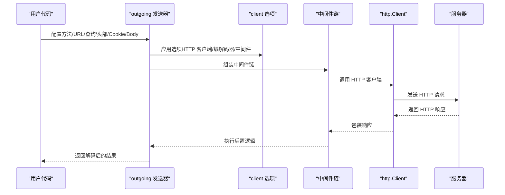
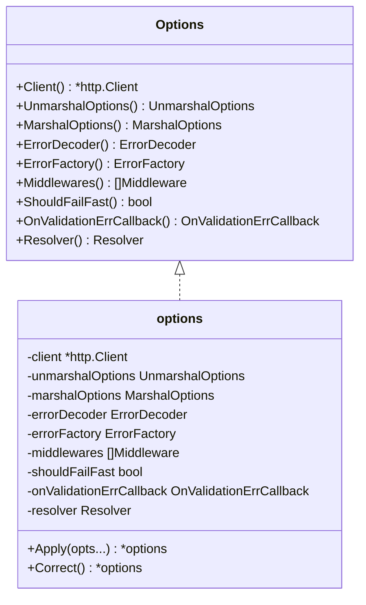
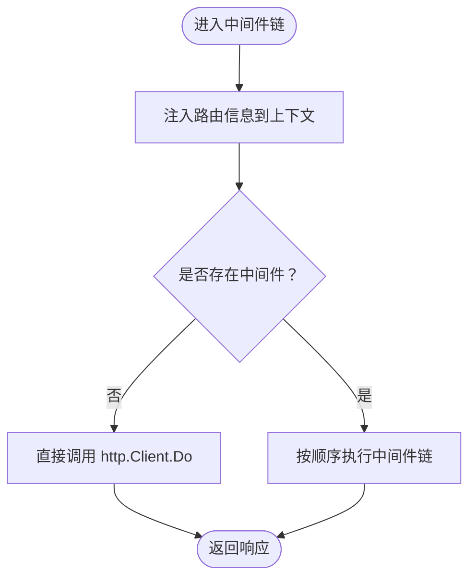
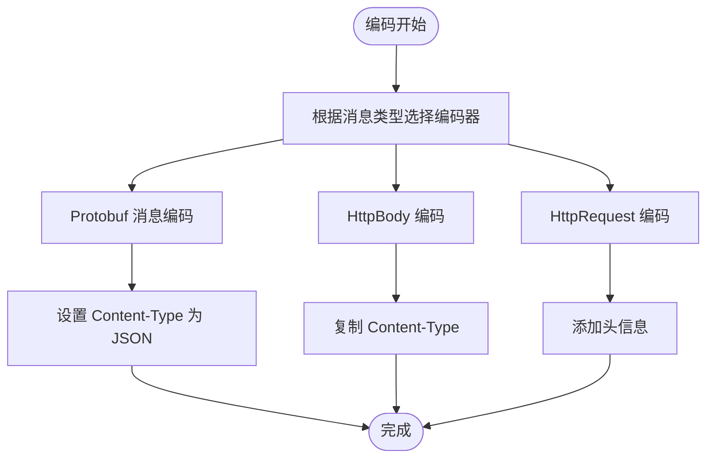
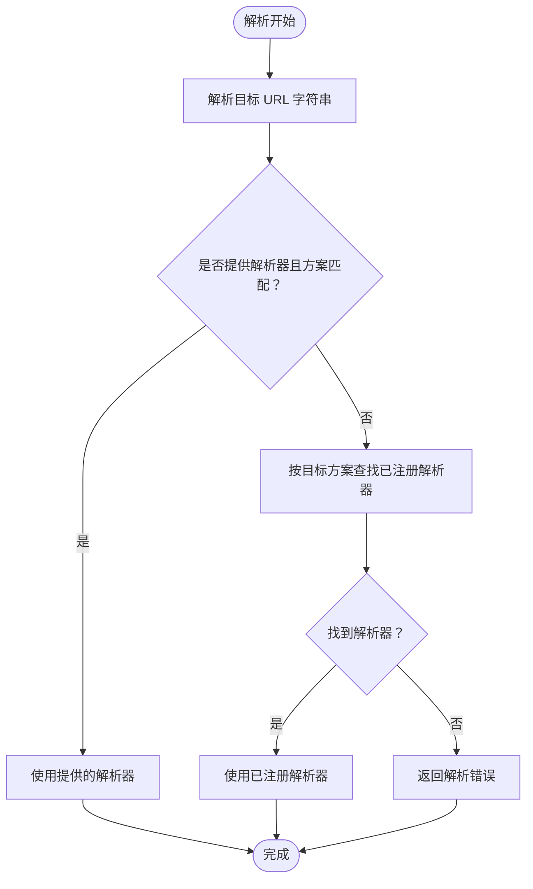
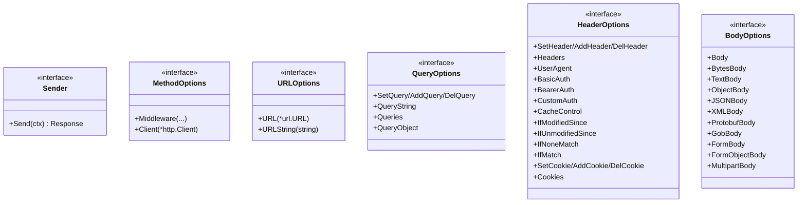
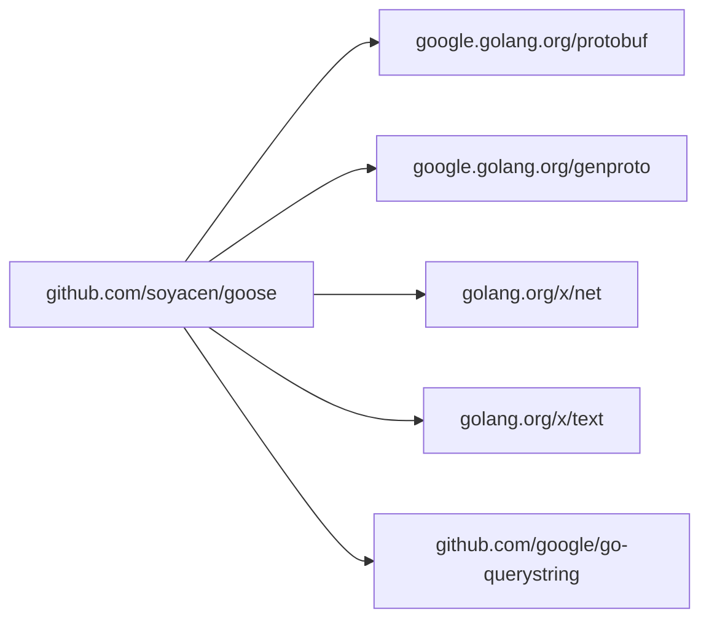

# HTTP 客户端框架

<cite>
**本文档引用的文件**
- [client/option.go](file://client/option.go)
- [client/middleware.go](file://client/middleware.go)
- [client/encoder.go](file://client/encoder.go)
- [client/decoder.go](file://client/decoder.go)
- [client/resolver/resolver.go](file://client/resolver/resolver.go)
- [outgoing/outgoing.go](file://outgoing/outgoing.go)
- [common.go](file://common.go)
- [go.mod](file://go.mod)
- [middleware/accesslog/middleware.go](file://middleware/accesslog/middleware.go)
- [middleware/basicauth/middleware.go](file://middleware/basicauth/middleware.go)
- [middleware/context/middleware.go](file://middleware/context/middleware.go)
- [middleware/cors/middleware.go](file://middleware/cors/middleware.go)
- [example/user/user_test.go](file://example/user/user_test.go)
- [client/middleware_test.go](file://client/middleware_test.go)
- [client/option_test.go](file://client/option_test.go)
- [client/encoder_test.go](file://client/encoder_test.go)
- [client/decoder_test.go](file://client/decoder_test.go)
</cite>

## 更新摘要
**所做更改**
- 新增客户端中间件系统详细分析，包括中间件链构建、调用机制和执行顺序
- 新增客户端选项配置系统完整说明，涵盖所有配置项和默认行为
- 新增客户端编解码器详细工作原理，包含三种编码器和三种解码器
- 新增完整的客户端使用示例，展示链式 API 构造请求的完整流程
- 新增中间件生态说明，涵盖访问日志、基础认证、上下文注入等中间件
- 新增详细的测试用例分析，展示各组件的单元测试覆盖情况

## 目录
1. [简介](#简介)
2. [项目结构](#项目结构)
3. [核心组件](#核心组件)
4. [架构总览](#架构总览)
5. [详细组件分析](#详细组件分析)
6. [依赖分析](#依赖分析)
7. [性能考虑](#性能考虑)
8. [故障排查指南](#故障排查指南)
9. [结论](#结论)
10. [附录：完整使用示例](#附录完整使用示例)

## 简介
本项目提供一个现代化的 HTTP 客户端框架，专注于与基于 Protobuf 的服务进行交互。框架通过可组合的中间件、灵活的编解码器、完善的选项配置系统以及与服务器框架一致的中间件生态，为构建高性能、可维护的 HTTP 客户端提供了统一抽象。

## 项目结构
- client：客户端核心实现（选项、中间件、编解码器、URL 解析器）
- outgoing：高层级发送器（链式 API 构造请求、设置查询参数、头部、Cookie、Body 等）
- middleware：中间件生态（访问日志、基础认证、上下文注入、CORS、超时、限流等）
- example：示例与测试用例（展示如何与服务器框架配合使用）
- server：服务器侧对应实现（与客户端共享接口契约）

```mermaid
graph TB
subgraph "客户端层"
OUT["outgoing 发送器<br/>链式 API 构造请求"]
OPT["client 选项<br/>配置 HTTP 客户端/编解码器/中间件"]
ENC["编码器<br/>Protobuf/HttpBody/HttpRequest 编码"]
DEC["解码器<br/>Protobuf/HttpBody/HttpResponse 解码"]
RES["URL 解析器<br/>注册/解析目标 URL"]
END
subgraph "中间件层"
AL["访问日志中间件"]
BA["基础认证中间件"]
CTX["上下文中间件"]
CORS["CORS 中间件"]
END
subgraph "服务器层协作"
S_MW["服务器中间件生态"]
S_ENC["服务器编码器"]
S_DEC["服务器解码器"]
END
OUT --> OPT
OUT --> ENC
OUT --> DEC
OUT --> RES
OPT --> AL
OPT --> BA
OPT --> CTX
OPT --> CORS
AL -. 协作 .-> S_MW
ENC -. 协作 .-> S_ENC
DEC -. 协作 .-> S_DEC
```

**图表来源**
- [outgoing/outgoing.go:1-1079](file://outgoing/outgoing.go#L1-L1079)
- [client/option.go:1-279](file://client/option.go#L1-L279)
- [client/encoder.go:1-81](file://client/encoder.go#L1-L81)
- [client/decoder.go:1-89](file://client/decoder.go#L1-L89)
- [client/resolver/resolver.go:1-70](file://client/resolver/resolver.go#L1-L70)
- [middleware/accesslog/middleware.go:1-318](file://middleware/accesslog/middleware.go#L1-L318)
- [middleware/basicauth/middleware.go:1-113](file://middleware/basicauth/middleware.go#L1-L113)
- [middleware/context/middleware.go:1-35](file://middleware/context/middleware.go#L1-L35)
- [middleware/cors/middleware.go:1-249](file://middleware/cors/middleware.go#L1-L249)

**章节来源**
- [go.mod:1-14](file://go.mod#L1-L14)

## 核心组件
- 选项系统（Options）：集中管理 HTTP 客户端、编解码器选项、错误处理、中间件链、URL 解析器、失败快速模式等。
- 中间件系统（Middleware/Chain）：以函数式链式组合中间件，支持客户端与服务器两端。
- 编解码器（Encoder/Decoder）：针对 Protobuf、HttpBody、标准 HTTP 请求/响应进行编码与解码。
- URL 解析器（Resolver）：支持按方案注册解析器，自动选择合适的解析策略。
- 高层发送器（outgoing sender）：提供链式 API 构造请求，包括方法、URL、查询、头部、Cookie、Body 等。

**章节来源**
- [client/option.go:12-158](file://client/option.go#L12-L158)
- [client/middleware.go:9-99](file://client/middleware.go#L9-L99)
- [client/encoder.go:15-81](file://client/encoder.go#L15-L81)
- [client/decoder.go:16-89](file://client/decoder.go#L16-L89)
- [client/resolver/resolver.go:10-70](file://client/resolver/resolver.go#L10-L70)
- [outgoing/outgoing.go:27-169](file://outgoing/outgoing.go#L27-L169)

## 架构总览
客户端采用"高层发送器 + 选项 + 中间件 + 编解码器"的分层设计。发送器负责请求构造，选项负责行为配置，中间件负责横切关注点（如日志、鉴权、上下文），编解码器负责数据序列化/反序列化。与服务器框架保持接口一致性，便于在同构场景下复用中间件与编解码逻辑。



**图表来源**
- [outgoing/outgoing.go:147-169](file://outgoing/outgoing.go#L147-L169)
- [client/middleware.go:76-99](file://client/middleware.go#L76-L99)
- [client/option.go:160-265](file://client/option.go#L160-L265)

## 详细组件分析

### 选项系统（Options）
- 职责：集中管理客户端行为，包括 HTTP 客户端实例、Protobuf JSON 编解码选项、错误解码器/工厂、中间件列表、URL 解析器、失败快速模式、验证回调等。
- 关键能力：
  - Apply/Merge：批量应用 Option 函数
  - Correct：默认值填充（如未设置则使用默认 HTTP 客户端、默认错误处理）
  - 访问器：Client/UnmarshalOptions/MarshalOptions/ErrorDecoder/ErrorFactory/Middlewares/ShouldFailFast/OnValidationErrCallback/Resolver
- 可扩展性：通过 Option 函数开放扩展点，支持自定义错误处理、编解码器、中间件链与解析器。



**图表来源**
- [client/option.go:12-158](file://client/option.go#L12-L158)

**章节来源**
- [client/option.go:55-279](file://client/option.go#L55-L279)

### 中间件系统（Middleware/Chain）
- 职责：以函数式组合中间件，形成责任链；支持客户端与服务器两端。
- 关键类型：
  - Invoker：封装一次 HTTP 调用
  - Middleware：接收 HTTP 客户端、请求与下一个 Invoker，返回响应或错误
  - Chain：将多个中间件合并为单一中间件
- 调用入口：
  - Invoke：注入路由信息到上下文，若无中间件则直接调用 HTTP 客户端，否则按链路执行



**图表来源**
- [client/middleware.go:76-99](file://client/middleware.go#L76-L99)

**章节来源**
- [client/middleware.go:9-99](file://client/middleware.go#L9-L99)

### 编解码器（Encoder/Decoder）
- 编码器：
  - EncodeMessage：将 Protobuf 消息 JSON 编码写入请求体，设置 Content-Type 为 JSON
  - EncodeHttpBody：将 HttpBody 原始数据写入请求体，复制 Content-Type
  - EncodeHttpRequest：将 HttpRequest 的原始 body 写入请求体，并附加所有头信息
- 解码器：
  - DecodeMessage：读取响应体 JSON 并反序列化为 Protobuf 消息
  - DecodeHttpBody：提取响应的 Content-Type 与原始数据
  - DecodeHttpResponse：提取状态码、原因短语、头集合与响应体



**图表来源**
- [client/encoder.go:15-81](file://client/encoder.go#L15-L81)

**章节来源**
- [client/encoder.go:15-81](file://client/encoder.go#L15-L81)
- [client/decoder.go:16-89](file://client/decoder.go#L16-L89)

### URL 解析器（Resolver）
- 职责：将目标 URL 解析为实际可用地址，支持按方案注册解析器。
- 关键能力：
  - RegisterResolver：按方案注册解析器
  - Resolve：优先使用显式提供的解析器，否则查找已注册解析器



**图表来源**
- [client/resolver/resolver.go:39-70](file://client/resolver/resolver.go#L39-L70)

**章节来源**
- [client/resolver/resolver.go:10-70](file://client/resolver/resolver.go#L10-L70)

### 高层发送器（outgoing sender）
- 职责：提供链式 API 构造 HTTP 请求，包括方法、URL、查询参数、头部、Cookie、Body 等。
- 关键能力：
  - 方法选择：Get/Put/Post/Delete/Patch/Options/Trace/Connect
  - URL 设置：支持 *url.URL 或字符串
  - 查询参数：Set/Add/Del/QueryString/Queries/Object
  - 头部设置：Set/Add/Del/Headers/UserAgent/BasicAuth/BearerAuth/CustomAuth/缓存控制/条件请求头
  - Cookie 设置：Set/Add/Del/Cookies
  - Body 设置：Reader/Bytes/Text/Object/JSON/XML/Protobuf/Gob/Form/Multipart
- 默认行为：若未显式设置 http.Client，则创建带 Transport 和超时的默认客户端



**图表来源**
- [outgoing/outgoing.go:110-179](file://outgoing/outgoing.go#L110-L179)
- [outgoing/outgoing.go:220-374](file://outgoing/outgoing.go#L220-L374)
- [outgoing/outgoing.go:654-757](file://outgoing/outgoing.go#L654-L757)

**章节来源**
- [outgoing/outgoing.go:27-169](file://outgoing/outgoing.go#L27-L169)

### 错误处理与断言工具
- BreakOnError/ContinueOnError：提供错误拦截与续接能力，支持将前置错误与后续操作错误合并返回，便于链式调用中的错误聚合。

**章节来源**
- [common.go:5-51](file://common.go#L5-L51)

### 中间件生态（客户端侧）
- 访问日志中间件：记录请求耗时、方法、路径、状态码、错误等信息，支持打印请求/响应体
- 基础认证中间件：为客户端请求设置 Basic 用户名密码
- 上下文中间件：允许在客户端请求中注入/修改上下文
- CORS 中间件：服务器端使用，客户端无需关心

**章节来源**
- [middleware/accesslog/middleware.go:206-276](file://middleware/accesslog/middleware.go#L206-L276)
- [middleware/basicauth/middleware.go:71-76](file://middleware/basicauth/middleware.go#L71-L76)
- [middleware/context/middleware.go:24-34](file://middleware/context/middleware.go#L24-L34)
- [middleware/cors/middleware.go:35-249](file://middleware/cors/middleware.go#L35-L249)

## 依赖分析
- 外部依赖：google.golang.org/protobuf、google.golang.org/genproto、golang.org/x/net、golang.org/x/text、github.com/google/go-querystring
- 内部模块：client、outgoing、middleware、server、common 工具



**图表来源**
- [go.mod:5-12](file://go.mod#L5-L12)

**章节来源**
- [go.mod:1-14](file://go.mod#L1-L14)

## 性能考虑
- 连接池与传输：默认 http.Client 使用 Transport，建议结合业务场景调整 MaxIdleConns/MaxConnsPerHost/IdleConnTimeout 等参数
- 编解码：Protobuf JSON 编解码开销可控，避免在高频路径中重复构造大型消息
- 中间件链：尽量减少不必要的中间件层级，避免多次 IO 拷贝
- 日志：访问日志在生产环境建议关闭请求/响应体打印，降低 CPU 与内存压力

## 故障排查指南
- 编解码错误：检查 MarshalOptions/UnmarshalOptions 是否与服务器一致；确认 Content-Type 设置正确
- URL 解析失败：确认目标 URL 方案与已注册解析器匹配，或显式传入解析器
- 中间件异常：逐个禁用中间件定位问题；关注访问日志中间件输出
- 超时与连接问题：检查 http.Client.Timeout 与 Transport 配置；核对网络连通性
- 错误聚合：使用 BreakOnError/ContinueOnError 将多处错误合并，便于定位

**章节来源**
- [client/decoder.go:28-37](file://client/decoder.go#L28-L37)
- [client/resolver/resolver.go:50-69](file://client/resolver/resolver.go#L50-L69)
- [middleware/accesslog/middleware.go:206-276](file://middleware/accesslog/middleware.go#L206-L276)
- [common.go:14-50](file://common.go#L14-L50)

## 结论
该 HTTP 客户端框架通过清晰的分层设计与一致的中间件生态，实现了与服务器框架的无缝协作。其选项系统、编解码器与高层发送器共同构成了易用而强大的客户端开发体验。结合丰富的中间件生态与完善的错误处理机制，能够满足从简单 REST 到复杂 Protobuf 服务的多样化需求。

## 附录：完整使用示例
以下示例展示了如何使用高层发送器构造请求、设置查询参数与头部、发送请求并解析响应。示例来源于仓库中的用户服务测试，演示了与服务器框架的协同工作方式。

- 创建 HTTP 客户端并启动本地服务器
- 使用链式 API 构造请求（方法、URL、查询、头部、Body）
- 发送请求并解析响应（Protobuf/JSON）
- 断言响应内容与期望一致

**章节来源**
- [example/user/user_test.go:47-160](file://example/user/user_test.go#L47-L160)

### 客户端中间件系统详细分析

#### 中间件链构建机制
中间件系统采用函数式编程范式，通过 Chain 函数将多个中间件组合成单一中间件。系统支持空中间件、单个中间件和多个中间件的不同处理策略。

**章节来源**
- [client/middleware.go:43-55](file://client/middleware.go#L43-L55)

#### 中间件调用机制
Invoke 函数负责执行中间件链，它会将路由信息注入到请求上下文中，然后根据是否存在中间件来决定直接调用 HTTP 客户端还是按链路执行中间件。

**章节来源**
- [client/middleware.go:88-94](file://client/middleware.go#L88-L94)

#### 中间件执行顺序验证
通过单元测试验证中间件的执行顺序，确保中间件按照正确的顺序执行和回溯。

**章节来源**
- [client/middleware_test.go:157-212](file://client/middleware_test.go#L157-L212)

### 客户端选项配置系统详细分析

#### 选项接口设计
Options 接口定义了客户端的所有可配置选项，包括 HTTP 客户端、编解码器选项、错误处理、中间件链、URL 解析器等。

**章节来源**
- [client/option.go:12-40](file://client/option.go#L12-L40)

#### 默认值处理机制
Correct 方法负责填充默认值，包括默认 HTTP 客户端、默认错误解码器和工厂、默认验证回调等。

**章节来源**
- [client/option.go:72-86](file://client/option.go#L72-L86)

#### 选项应用与合并
Apply 方法支持批量应用 Option 函数，支持链式调用和组合使用。

**章节来源**
- [client/option.go:65-70](file://client/option.go#L65-L70)

#### 单元测试覆盖
选项系统具有完整的单元测试覆盖，包括接口实现验证、getter 方法测试、各种 Option 函数测试等。

**章节来源**
- [client/option_test.go:33-99](file://client/option_test.go#L33-L99)

### 客户端编解码器详细分析

#### 编码器类型与功能
系统提供三种编码器，分别处理不同的消息类型：

1. **EncodeMessage**：处理 Protobuf 消息，将其 JSON 编码后写入请求体
2. **EncodeHttpBody**：处理 HttpBody 消息，复制原始数据和 Content-Type
3. **EncodeHttpRequest**：处理 HttpRequest 消息，写入原始 body 并添加所有头信息

**章节来源**
- [client/encoder.go:15-81](file://client/encoder.go#L15-L81)

#### 解码器类型与功能
系统提供三种解码器，分别处理不同的响应类型：

1. **DecodeMessage**：将响应体 JSON 解码为 Protobuf 消息
2. **DecodeHttpBody**：提取响应的 Content-Type 与原始数据
3. **DecodeHttpResponse**：提取状态码、原因短语、头集合与响应体

**章节来源**
- [client/decoder.go:16-89](file://client/decoder.go#L16-L89)

#### 编解码器单元测试
编解码器具有完整的单元测试，验证各种场景下的编码解码行为，包括正常情况、错误处理等。

**章节来源**
- [client/encoder_test.go:17-142](file://client/encoder_test.go#L17-L142)
- [client/decoder_test.go:19-167](file://client/decoder_test.go#L19-L167)

### 客户端使用示例详细分析

#### 链式 API 构造请求
outgoing 发送器提供完整的链式 API 来构造 HTTP 请求，包括方法、URL、查询参数、头部、Cookie、Body 等设置。

**章节来源**
- [outgoing/outgoing.go:27-169](file://outgoing/outgoing.go#L27-L169)

#### 高层发送器功能特性
- **方法选择**：支持 GET、POST、PUT、DELETE、PATCH、OPTIONS、TRACE、CONNECT 等 HTTP 方法
- **URL 设置**：支持 *url.URL 或字符串格式
- **查询参数**：提供 Set、Add、Del、QueryString、Queries、QueryObject 等操作
- **头部设置**：支持多种头部操作和认证方式
- **Cookie 设置**：提供完整的 Cookie 管理功能
- **Body 设置**：支持多种数据类型的序列化和传输

**章节来源**
- [outgoing/outgoing.go:110-179](file://outgoing/outgoing.go#L110-L179)
- [outgoing/outgoing.go:220-374](file://outgoing/outgoing.go#L220-L374)
- [outgoing/outgoing.go:654-757](file://outgoing/outgoing.go#L654-L757)

#### 默认客户端配置
如果未显式设置 http.Client，系统会创建带有合理默认配置的客户端，包括超时时间和连接池设置。

**章节来源**
- [outgoing/outgoing.go:147-169](file://outgoing/outgoing.go#L147-L169)

### 中间件生态详细分析

#### 访问日志中间件
提供详细的 HTTP 请求访问日志，包括请求耗时、方法、路径、状态码、错误等信息，支持可配置的日志级别和内容打印。

**章节来源**
- [middleware/accesslog/middleware.go:206-276](file://middleware/accesslog/middleware.go#L206-L276)

#### 基础认证中间件
支持 Basic 认证，可以为客户端请求设置用户名和密码，也支持服务器端的认证验证。

**章节来源**
- [middleware/basicauth/middleware.go:71-76](file://middleware/basicauth/middleware.go#L71-L76)

#### 上下文中间件
允许在客户端请求中注入或修改上下文信息，支持自定义的上下文转换函数。

**章节来源**
- [middleware/context/middleware.go:24-34](file://middleware/context/middleware.go#L24-L34)

#### CORS 中间件
提供跨域资源共享支持，主要用于服务器端，客户端通常不需要直接使用。

**章节来源**
- [middleware/cors/middleware.go:35-249](file://middleware/cors/middleware.go#L35-L249)