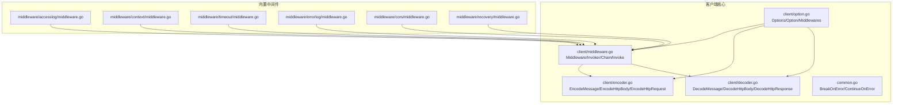
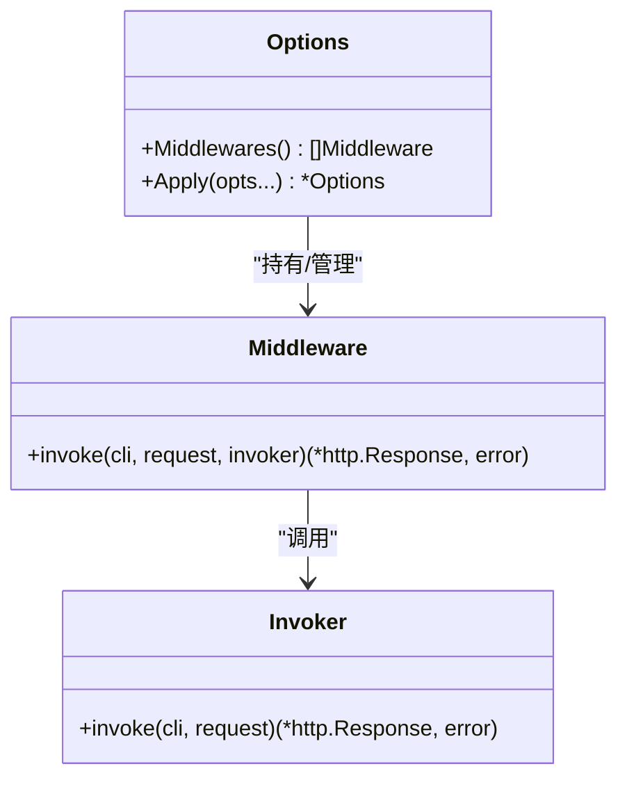
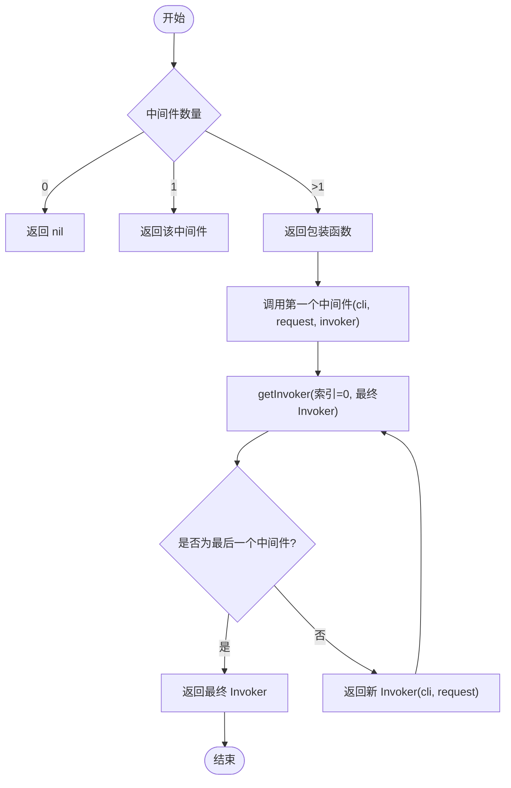
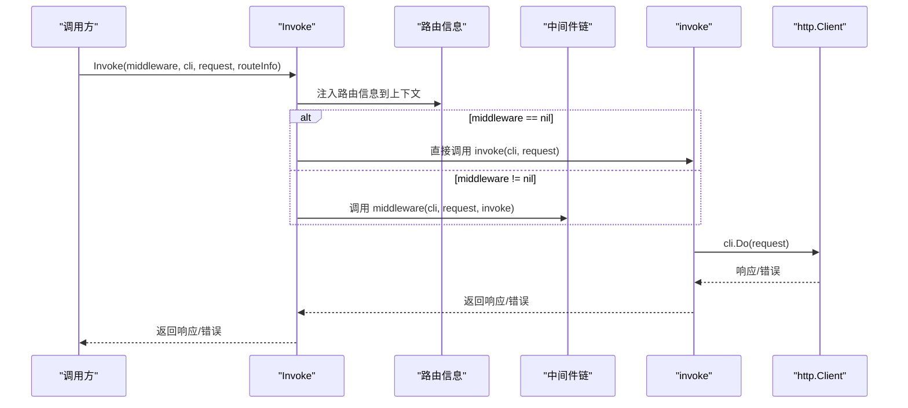
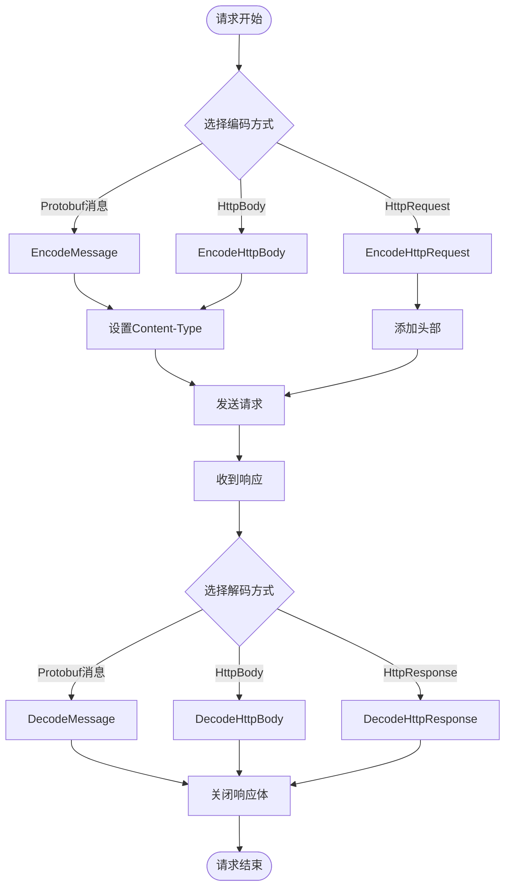
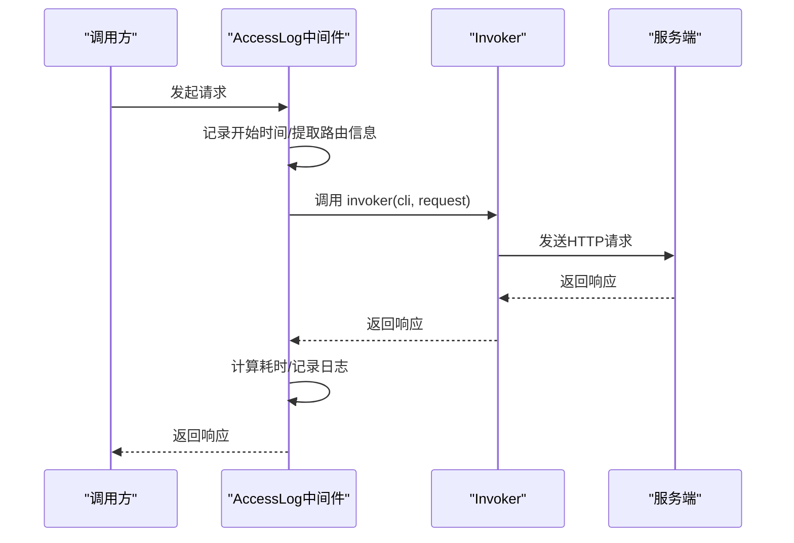
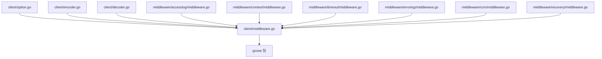

# 客户端中间件系统

<cite>
**本文档引用的文件**
- [middleware.go](file://client/middleware.go)
- [middleware_test.go](file://client/middleware_test.go)
- [option.go](file://client/option.go)
- [decoder.go](file://client/decoder.go)
- [encoder.go](file://client/encoder.go)
- [common.go](file://common.go)
- [middleware/accesslog/middleware.go](file://middleware/accesslog/middleware.go)
- [middleware/context/middleware.go](file://middleware/context/middleware.go)
- [middleware/timeout/middleware.go](file://middleware/timeout/middleware.go)
- [middleware/errorlog/middleware.go](file://middleware/errorlog/middleware.go)
- [middleware/cors/middleware.go](file://middleware/cors/middleware.go)
- [middleware/recovery/middleware.go](file://middleware/recovery/middleware.go)
</cite>

## 目录
1. [简介](#简介)
2. [项目结构](#项目结构)
3. [核心组件](#核心组件)
4. [架构总览](#架构总览)
5. [详细组件分析](#详细组件分析)
6. [依赖关系分析](#依赖关系分析)
7. [性能考虑](#性能考虑)
8. [故障排查指南](#故障排查指南)
9. [结论](#结论)
10. [附录](#附录)

## 简介
本文件系统性介绍 Goose 项目的 HTTP 客户端中间件体系，重点阐述 Middleware 与 Invoker 的设计、中间件链的构建与执行机制，以及 Chain、getInvoker、Invoke 的协作流程。同时提供中间件开发最佳实践与使用示例，帮助开发者正确传递请求与响应数据。

## 项目结构
客户端中间件系统位于 client 子包中，核心类型与函数定义在 middleware.go；配置与选项在 option.go；编码解码工具在 encoder.go 与 decoder.go；通用错误处理辅助在 common.go；具体业务中间件如访问日志、上下文注入、超时控制、错误日志、CORS、异常恢复等位于 middleware 子目录。



**图表来源**
- [middleware.go:1-99](file://client/middleware.go#L1-L99)
- [option.go:1-279](file://client/option.go#L1-L279)
- [encoder.go:1-81](file://client/encoder.go#L1-L81)
- [decoder.go:1-89](file://client/decoder.go#L1-L89)
- [common.go:1-51](file://common.go#L1-L51)
- [middleware/accesslog/middleware.go:1-318](file://middleware/accesslog/middleware.go#L1-L318)
- [middleware/context/middleware.go:1-35](file://middleware/context/middleware.go#L1-L35)
- [middleware/timeout/middleware.go:1-107](file://middleware/timeout/middleware.go#L1-L107)
- [middleware/errorlog/middleware.go:1-195](file://middleware/errorlog/middleware.go#L1-L195)
- [middleware/cors/middleware.go:1-249](file://middleware/cors/middleware.go#L1-L249)
- [middleware/recovery/middleware.go:1-55](file://middleware/recovery/middleware.go#L1-L55)

**章节来源**
- [middleware.go:1-99](file://client/middleware.go#L1-L99)
- [option.go:1-279](file://client/option.go#L1-L279)

## 核心组件
- Middleware：客户端中间件函数类型，签名包含 HTTP 客户端、请求对象与下一个 Invoker，返回响应或错误。
- Invoker：调用链末端的函数类型，负责真正发起 HTTP 请求。
- Chain：将多个中间件组合成一个单一中间件，形成从外到内的调用链。
- getInvoker：递归构建调用链，将“下一个中间件”与“最终 Invoker”连接起来。
- Invoke：对外暴露的入口，将路由信息注入上下文后，按需选择直接调用或通过中间件链执行。

这些组件共同实现了洋葱模型的中间件执行：外层中间件先执行预处理逻辑，再调用 invoker，最终到达底层 HTTP 客户端；随后在返回路径上，外层中间件可进行后处理。

**章节来源**
- [middleware.go:9-98](file://client/middleware.go#L9-L98)

## 架构总览
下图展示了客户端中间件链的构建与执行过程，以及与选项配置、编码解码模块的交互关系。

```mermaid
sequenceDiagram
participant Caller as "调用方"
participant Opt as "Options(选项)"
participant MW as "Chain/Invoke"
participant MDW as "中间件链(Middleware)"
participant INV as "Invoker(最终调用)"
participant HTTP as "http.Client"
Caller->>Opt : 配置中间件列表与客户端
Caller->>MW : 调用 Invoke(middleware, cli, request, routeInfo)
MW->>MW : 注入路由信息到请求上下文
alt 未提供中间件
MW->>INV : 直接调用 invoke(cli, request)
else 提供中间件
MW->>MDW : 调用 Chain(...) 构建链
MDW->>INV : 通过 getInvoker 递归构建调用链
end
INV->>HTTP : cli.Do(request)
HTTP-->>INV : 响应/错误
INV-->>MDW : 返回响应/错误
MDW-->>Caller : 返回响应/错误
```

**图表来源**
- [middleware.go:76-98](file://client/middleware.go#L76-L98)
- [option.go:225-236](file://client/option.go#L225-L236)

## 详细组件分析

### 中间件类型与职责
- Middleware：接收当前请求与下一个 Invoker，可在调用 invoker 前后插入横切逻辑（如日志、鉴权、超时、上下文扩展等）。
- Invoker：封装最终的 HTTP 请求调用，通常由 http.Client.Do 实现。



**图表来源**
- [middleware.go:9-33](file://client/middleware.go#L9-L33)
- [option.go:12-40](file://client/option.go#L12-L40)

**章节来源**
- [middleware.go:9-33](file://client/middleware.go#L9-L33)
- [option.go:12-40](file://client/option.go#L12-L40)

### 中间件链构建与执行：Chain 与 getInvoker
- Chain：当传入空参数时返回 nil；单个中间件直接返回该中间件；多个中间件时，返回一个包装函数，其内部通过 getInvoker 将第一个中间件与后续链路连接。
- getInvoker：采用递归策略，当到达最后一个中间件时返回最终 Invoker；否则返回一个新 Invoker，它调用下一个中间件并将自身作为新的 invoker 传入，从而形成“外层先入栈”的洋葱结构。



**图表来源**
- [middleware.go:35-74](file://client/middleware.go#L35-L74)

**章节来源**
- [middleware.go:35-74](file://client/middleware.go#L35-L74)

### 请求执行：Invoke 与 invoke
- Invoke：将路由信息注入请求上下文，若未提供中间件则直接调用 invoke；否则将中间件与最终 Invoker 组合后执行。
- invoke：封装 http.Client.Do，完成实际的网络请求。



**图表来源**
- [middleware.go:76-98](file://client/middleware.go#L76-L98)

**章节来源**
- [middleware.go:76-98](file://client/middleware.go#L76-L98)

### 编码与解码：请求/响应数据处理
- 编码器：将 Protobuf 消息或 HttpBody/HttpRequest 编码为 HTTP 请求体，并设置 Content-Type。
- 解码器：将 HTTP 响应解码为 Protobuf 消息或 HttpBody/HttpResponse，负责读取响应体并关闭流。



**图表来源**
- [encoder.go:15-80](file://client/encoder.go#L15-L80)
- [decoder.go:16-88](file://client/decoder.go#L16-L88)

**章节来源**
- [encoder.go:15-80](file://client/encoder.go#L15-L80)
- [decoder.go:16-88](file://client/decoder.go#L16-L88)

### 内置中间件示例与最佳实践

#### 访问日志中间件（accesslog）
- 功能：在客户端侧记录请求耗时、方法、URL、状态码、错误等信息。
- 使用建议：结合路由信息与请求 ID 进行关联；谨慎开启请求/响应体打印以避免性能与安全问题。



**图表来源**
- [middleware/accesslog/middleware.go:206-275](file://middleware/accesslog/middleware.go#L206-L275)

**章节来源**
- [middleware/accesslog/middleware.go:206-275](file://middleware/accesslog/middleware.go#L206-L275)

#### 上下文中间件（context）
- 功能：允许在请求上下文中注入或修改数据，便于后续中间件或业务逻辑使用。
- 使用建议：仅做轻量上下文变换，避免阻塞或昂贵操作。

**章节来源**
- [middleware/context/middleware.go:24-34](file://middleware/context/middleware.go#L24-L34)

#### 超时中间件（timeout）
- 功能：基于请求上下文的 deadline 或自定义超时，设置请求头并创建带超时的上下文。
- 使用建议：优先使用已有 deadline，避免过度缩短超时导致误判。

**章节来源**
- [middleware/timeout/middleware.go:72-106](file://middleware/timeout/middleware.go#L72-L106)

#### 错误日志中间件（errorlog）
- 功能：捕获 HTTP 错误（状态码 ≥ 400）或调用错误，记录请求/响应关键信息。
- 使用建议：生产环境谨慎开启响应体打印，避免敏感信息泄露。

**章节来源**
- [middleware/errorlog/middleware.go:60-105](file://middleware/errorlog/middleware.go#L60-L105)

#### CORS 中间件（server 端）
- 说明：虽然主要面向服务端，但有助于理解跨域场景下的客户端行为与期望。
- 使用建议：与客户端超时、重试策略配合，确保跨域请求稳定。

**章节来源**
- [middleware/cors/middleware.go:35-160](file://middleware/cors/middleware.go#L35-L160)

#### 异常恢复中间件（recovery）
- 说明：服务端中间件，用于捕获 panic 并记录堆栈。
- 对客户端的意义：提醒在调用链中注意异常传播与日志记录。

**章节来源**
- [middleware/recovery/middleware.go:38-50](file://middleware/recovery/middleware.go#L38-L50)

### 测试验证与执行顺序
- 单元测试覆盖了 Chain 的空/单/多中间件情况、Invoke 的正常与错误路径、getInvoker 的链式构造与执行顺序验证。
- 执行顺序验证确保洋葱模型正确：外层先入栈，invoker 执行后，再逐层出栈进行后处理。

**章节来源**
- [middleware_test.go:33-212](file://client/middleware_test.go#L33-L212)

## 依赖关系分析
- client/middleware.go 依赖标准库 net/http 与 goose 包（用于路由信息注入与提取）。
- option.go 提供 Options 接口与 Option 函数，支持在客户端初始化阶段注入中间件链。
- encoder/decoder 与 client 层解耦，通过统一的接口与选项配置进行协作。
- 内置中间件均遵循相同的 Middleware/Invoker 模式，可自由组合。



**图表来源**
- [middleware.go:3-7](file://client/middleware.go#L3-L7)
- [option.go:3-10](file://client/option.go#L3-L10)
- [encoder.go:3-13](file://client/encoder.go#L3-L13)
- [decoder.go:3-14](file://client/decoder.go#L3-L14)
- [middleware/accesslog/middleware.go:1-18](file://middleware/accesslog/middleware.go#L1-L18)
- [middleware/context/middleware.go:1-9](file://middleware/context/middleware.go#L1-L9)
- [middleware/timeout/middleware.go:1-12](file://middleware/timeout/middleware.go#L1-L12)
- [middleware/errorlog/middleware.go:1-14](file://middleware/errorlog/middleware.go#L1-L14)
- [middleware/cors/middleware.go:1-33](file://middleware/cors/middleware.go#L1-L33)
- [middleware/recovery/middleware.go:1-9](file://middleware/recovery/middleware.go#L1-L9)

**章节来源**
- [middleware.go:3-7](file://client/middleware.go#L3-L7)
- [option.go:3-10](file://client/option.go#L3-L10)

## 性能考虑
- 中间件链深度：链越深，每次调用的函数栈与闭包开销越大，建议按需组合中间件。
- 日志与 IO：访问日志与错误日志中间件在高并发下可能产生 IO 压力，建议合理配置日志级别与开关。
- 请求体读取：错误日志中间件会读取响应体，建议仅在必要时开启响应体打印。
- 编解码成本：Protobuf JSON 编解码存在 CPU 开销，尽量减少不必要的序列化/反序列化。

## 故障排查指南
- 中间件未生效：检查是否正确通过 Options 注入中间件链，或是否在调用 Invoke 时传入了正确的中间件。
- 执行顺序异常：确认中间件注册顺序与洋葱模型一致，外层先入栈，后出栈。
- 超时问题：检查请求上下文 deadline 与超时中间件设置，避免过短超时导致误判。
- 错误日志缺失：确认错误日志中间件已启用，且状态码 ≥ 400 或存在非 nil 错误才会记录。
- 编解码失败：核对 Content-Type 与编解码器匹配，确保响应体可读且及时关闭。

**章节来源**
- [middleware_test.go:56-128](file://client/middleware_test.go#L56-L128)
- [middleware/errorlog/middleware.go:60-105](file://middleware/errorlog/middleware.go#L60-L105)
- [middleware/timeout/middleware.go:72-106](file://middleware/timeout/middleware.go#L72-L106)

## 结论
Goose 的客户端中间件系统以简洁的 Middleware/Invoker 类型为核心，通过 Chain 与 getInvoker 实现可组合、可扩展的洋葱模型。结合 Options 的中间件注入与编码解码模块，开发者可以快速构建具备日志、鉴权、超时、限流、熔断等能力的 HTTP 客户端。遵循本文的最佳实践与使用示例，可有效提升系统的可观测性、稳定性与可维护性。

## 附录

### 中间件开发最佳实践
- 明确职责边界：每个中间件只做一件事，避免过度耦合。
- 正确传递上下文：在中间件中修改上下文时，务必使用 WithContext 替换请求。
- 控制副作用：避免在中间件中进行阻塞操作，必要时使用异步或池化资源。
- 合理使用日志：生产环境谨慎开启大体积请求/响应体打印。
- 错误处理：中间件内发生的错误应向上抛出或转换为可识别的错误类型，便于上层统一处理。
- 性能优化：复用资源（如缓冲区、日志属性切片池），减少分配与拷贝。

### 使用示例（步骤说明）
- 初始化客户端选项并注入中间件链：通过 Options 的 Middlewares(...) 将多个中间件追加到链表中。
- 构建中间件链：使用 Chain(...) 将中间件组合为单一中间件。
- 执行请求：调用 Invoke(...)，传入中间件、HTTP 客户端、请求与路由信息，获得响应或错误。
- 处理响应：根据需要使用解码器将响应转换为 Protobuf 消息或 HttpBody/HttpResponse。

**章节来源**
- [option.go:225-236](file://client/option.go#L225-L236)
- [middleware.go:35-98](file://client/middleware.go#L35-L98)
- [decoder.go:16-88](file://client/decoder.go#L16-L88)
- [encoder.go:15-80](file://client/encoder.go#L15-L80)