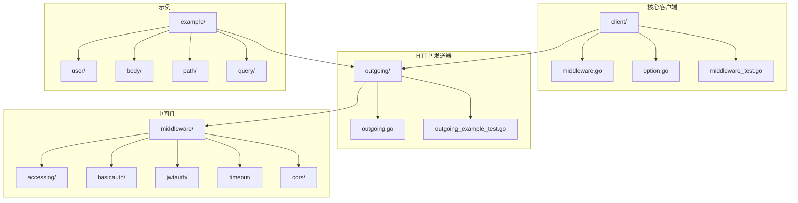
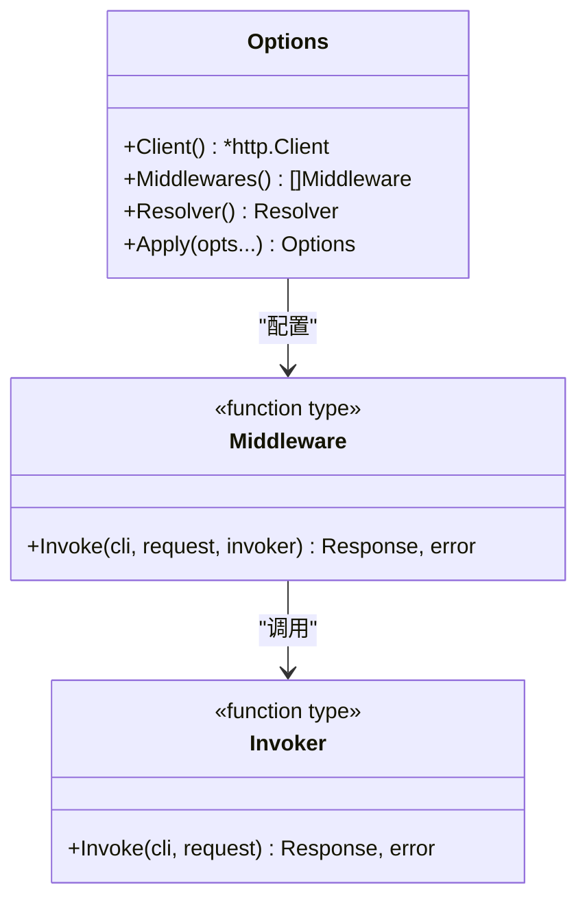
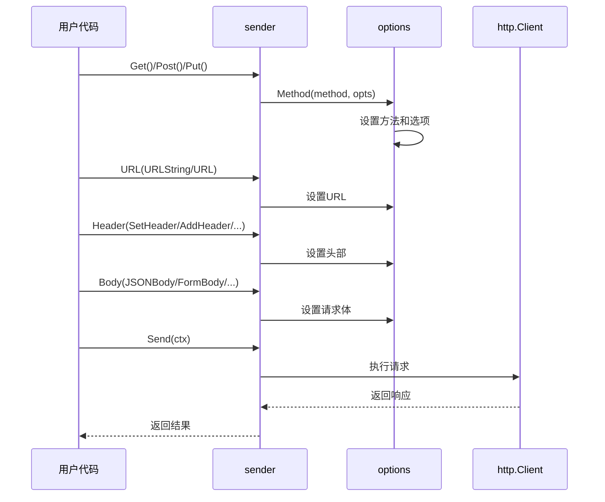
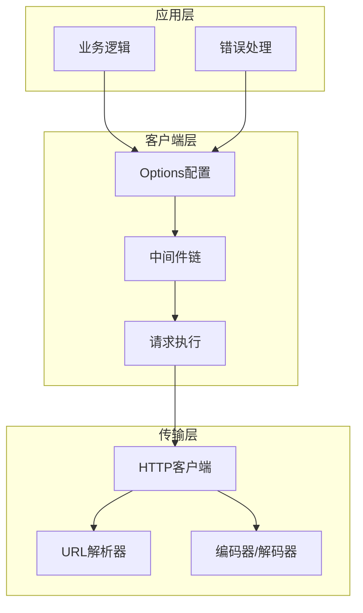
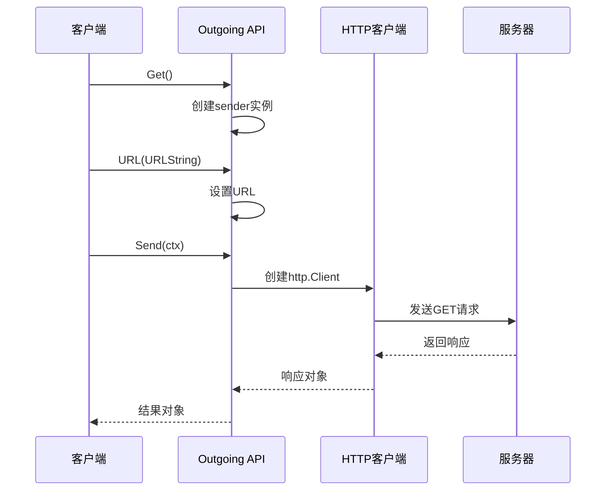
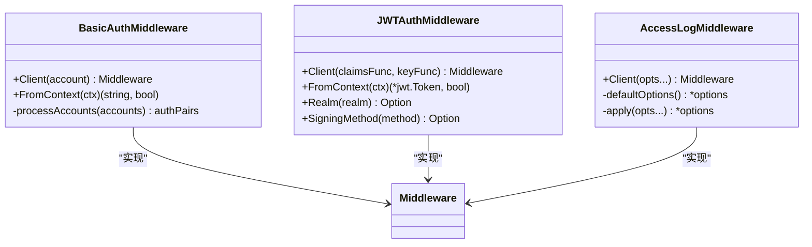
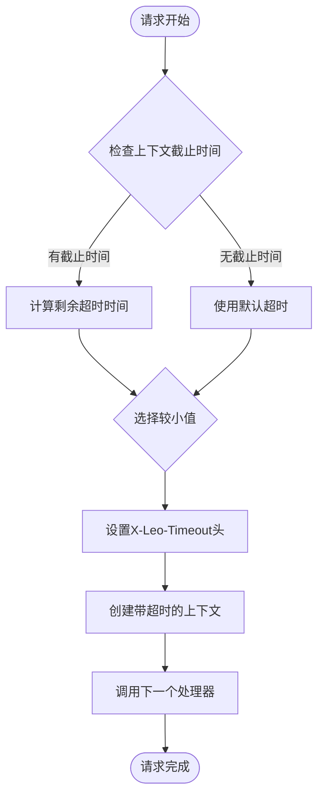
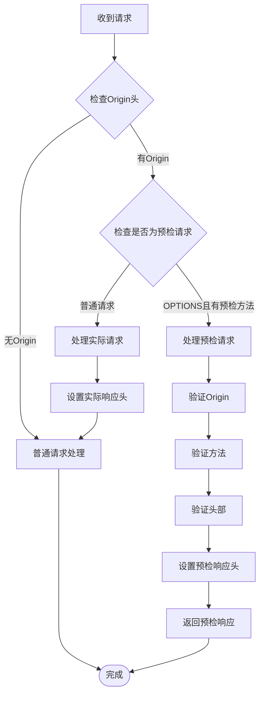
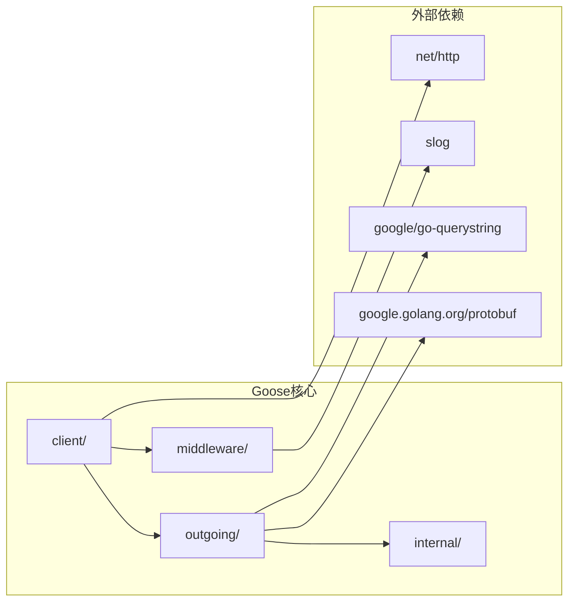

# 客户端使用示例

<cite>
**本文档引用的文件**
- [client/middleware.go](file://client/middleware.go)
- [client/option.go](file://client/option.go)
- [outgoing/outgoing.go](file://outgoing/outgoing.go)
- [outgoing/outgoing_example_test.go](file://outgoing/outgoing_example_test.go)
- [middleware/accesslog/middleware.go](file://middleware/accesslog/middleware.go)
- [middleware/basicauth/middleware.go](file://middleware/basicauth/middleware.go)
- [middleware/jwtauth/middleware.go](file://middleware/jwtauth/middleware.go)
- [middleware/timeout/middleware.go](file://middleware/timeout/middleware.go)
- [middleware/cors/middleware.go](file://middleware/cors/middleware.go)
- [example/user/user.proto](file://example/user/user.proto)
- [example/user/user.pb.go](file://example/user/user.pb.go)
- [example/user/user_test.go](file://example/user/user_test.go)
- [client/middleware_test.go](file://client/middleware_test.go)
</cite>

## 目录
1. [简介](#简介)
2. [项目结构](#项目结构)
3. [核心组件](#核心组件)
4. [架构概览](#架构概览)
5. [详细组件分析](#详细组件分析)
6. [依赖关系分析](#依赖关系分析)
7. [性能考虑](#性能考虑)
8. [故障排除指南](#故障排除指南)
9. [结论](#结论)

## 简介

Goose 是一个功能强大的 HTTP 客户端库，提供了简洁而灵活的 API 来构建 HTTP 请求。该库采用中间件架构设计，支持多种认证方式、日志记录、超时控制等高级功能。

本指南将详细介绍如何使用 Goose 客户端库进行实际开发，包括基础请求、认证请求、中间件配置等场景的完整使用示例和最佳实践。

## 项目结构

Goose 项目采用模块化设计，主要包含以下核心目录：

**图表来源**
- [client/middleware.go:1-99](file://client/middleware.go#L1-L99)
- [outgoing/outgoing.go:1-800](file://outgoing/outgoing.go#L1-L800)
- [middleware/accesslog/middleware.go:1-318](file://middleware/accesslog/middleware.go#L1-L318)

**章节来源**
- [client/middleware.go:1-99](file://client/middleware.go#L1-L99)
- [client/option.go:1-279](file://client/option.go#L1-L279)
- [outgoing/outgoing.go:1-800](file://outgoing/outgoing.go#L1-L800)

## 核心组件

### 中间件系统

Goose 的中间件系统是其核心特性之一，提供了强大的请求处理能力：

**图表来源**
- [client/middleware.go:21-33](file://client/middleware.go#L21-L33)
- [client/option.go:12-40](file://client/option.go#L12-L40)

### 发送器接口

Outgoing 包提供了流畅的 API 接口来构建 HTTP 请求：

**图表来源**
- [outgoing/outgoing.go:27-65](file://outgoing/outgoing.go#L27-L65)
- [outgoing/outgoing.go:147-169](file://outgoing/outgoing.go#L147-L169)

**章节来源**
- [client/middleware.go:21-99](file://client/middleware.go#L21-L99)
- [client/option.go:12-279](file://client/option.go#L12-L279)
- [outgoing/outgoing.go:1-800](file://outgoing/outgoing.go#L1-L800)

## 架构概览

Goose 客户端库采用分层架构设计，确保了良好的可扩展性和可维护性：

**图表来源**
- [client/option.go:42-53](file://client/option.go#L42-L53)
- [client/middleware.go:35-55](file://client/middleware.go#L35-L55)
- [outgoing/outgoing.go:99-108](file://outgoing/outgoing.go#L99-L108)

## 详细组件分析

### 基础请求示例

以下是最简单的 HTTP GET 请求示例：

**图表来源**
- [outgoing/outgoing_example_test.go:17-32](file://outgoing/outgoing_example_test.go#L17-L32)

### 认证中间件实现

Goose 提供了多种认证中间件，包括基本认证和 JWT 认证：

**图表来源**
- [middleware/basicauth/middleware.go:71-76](file://middleware/basicauth/middleware.go#L71-L76)
- [middleware/jwtauth/middleware.go:186-218](file://middleware/jwtauth/middleware.go#L186-L218)
- [middleware/accesslog/middleware.go:206-276](file://middleware/accesslog/middleware.go#L206-L276)

**章节来源**
- [outgoing/outgoing_example_test.go:17-32](file://outgoing/outgoing_example_test.go#L17-L32)
- [middleware/basicauth/middleware.go:71-76](file://middleware/basicauth/middleware.go#L71-L76)
- [middleware/jwtauth/middleware.go:186-218](file://middleware/jwtauth/middleware.go#L186-L218)

### 超时中间件配置

超时中间件提供了灵活的超时控制机制：

**图表来源**
- [middleware/timeout/middleware.go:72-106](file://middleware/timeout/middleware.go#L72-L106)

**章节来源**
- [middleware/timeout/middleware.go:1-107](file://middleware/timeout/middleware.go#L1-L107)

### CORS 中间件处理

CORS 中间件实现了完整的跨域资源共享处理：

**图表来源**
- [middleware/cors/middleware.go:147-159](file://middleware/cors/middleware.go#L147-L159)

**章节来源**
- [middleware/cors/middleware.go:1-249](file://middleware/cors/middleware.go#L1-L249)

## 依赖关系分析

Goose 客户端库的依赖关系相对简单，主要依赖于标准库和 Google 的 Protobuf 库：

**图表来源**
- [go.mod:1-14](file://go.mod#L1-L14)

**章节来源**
- [go.mod:1-14](file://go.mod#L1-L14)

## 性能考虑

### 连接池优化

Goose 默认配置了合理的连接池参数以优化性能：

- 最大空闲连接数：100
- 每主机最大空闲连接数：100  
- 每主机最大连接数：100
- 空闲连接超时：90秒
- 启用压缩：false

### 中间件链优化

中间件执行顺序对性能有重要影响。建议：

1. 将高频使用的中间件放在前面
2. 避免在中间件中进行阻塞操作
3. 合理使用缓存机制

## 故障排除指南

### 常见问题及解决方案

**问题1：请求超时**
- 检查客户端超时设置
- 验证网络连接状态
- 查看服务器响应时间

**问题2：认证失败**
- 确认认证凭据正确性
- 检查中间件配置
- 验证服务器端认证服务

**问题3：中间件执行顺序问题**
- 检查中间件链配置
- 验证中间件执行顺序
- 确认中间件互不冲突

**章节来源**
- [client/middleware_test.go:157-213](file://client/middleware_test.go#L157-L213)

## 结论

Goose 客户端库提供了强大而灵活的 HTTP 客户端功能，通过其模块化的中间件架构和流畅的 API 设计，能够满足各种复杂的 HTTP 请求场景。通过本文档提供的示例和最佳实践，开发者可以快速上手并充分利用该库的各项功能。

建议在实际项目中：
1. 根据需求选择合适的中间件组合
2. 合理配置超时和重试策略
3. 使用适当的日志记录中间件进行调试
4. 注意中间件的执行顺序和性能影响