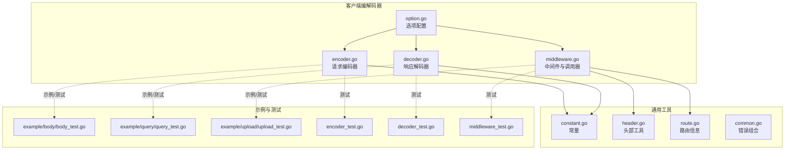
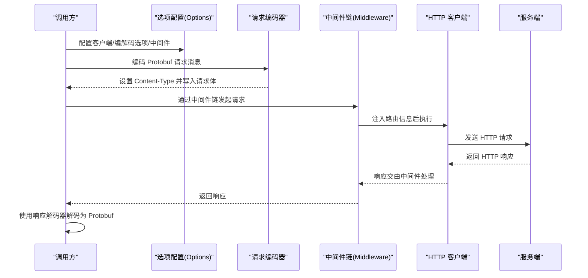
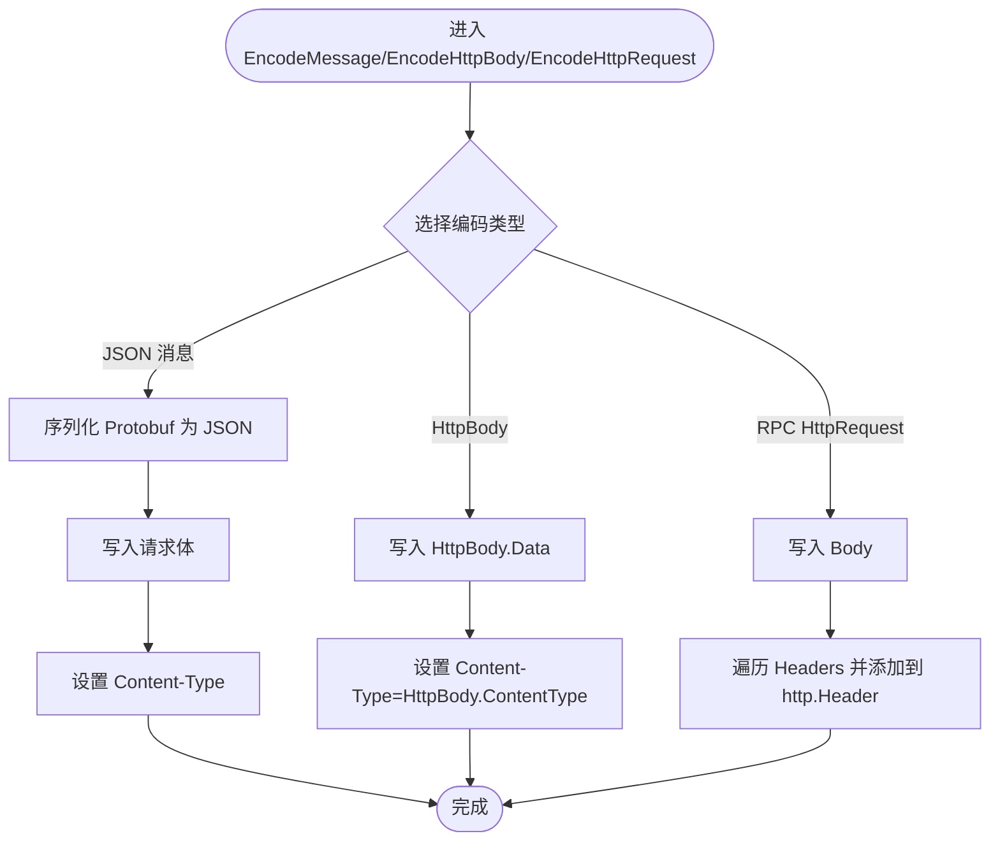
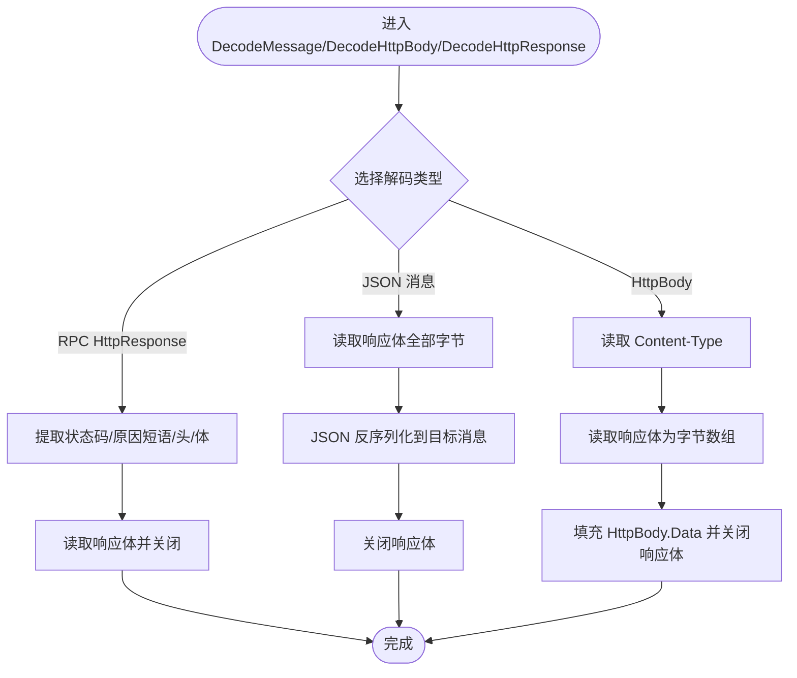
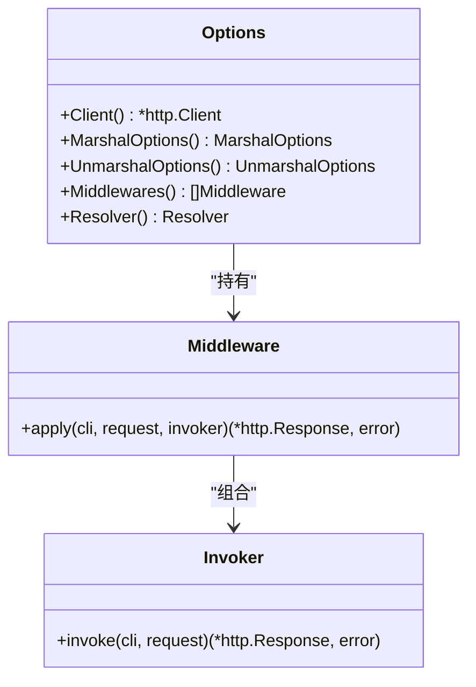
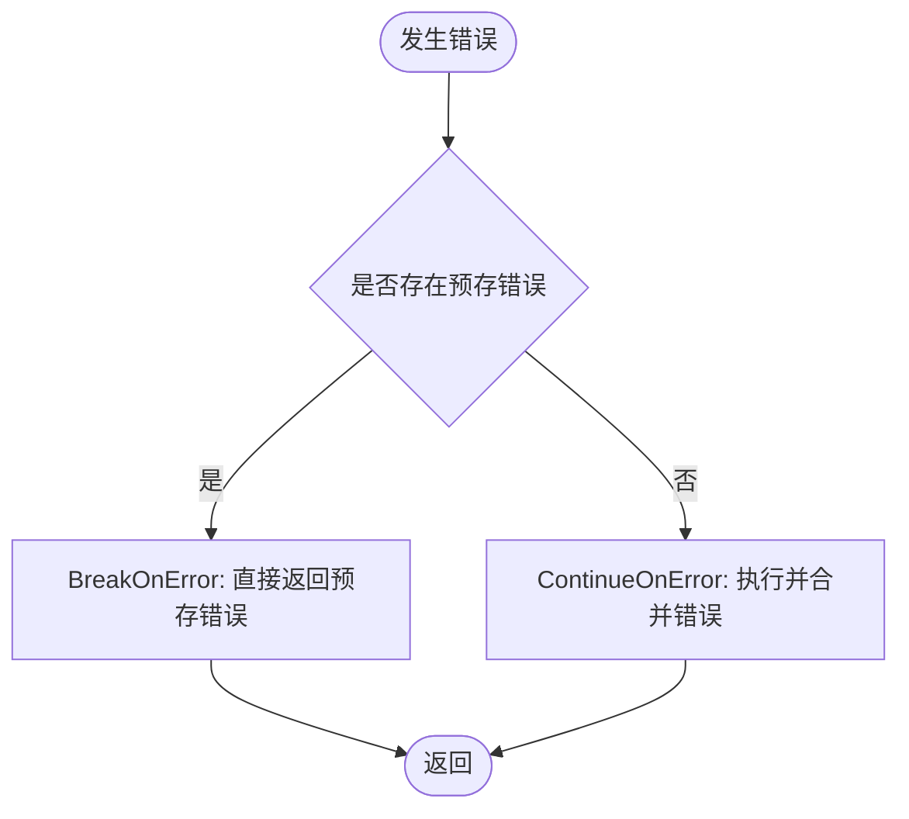
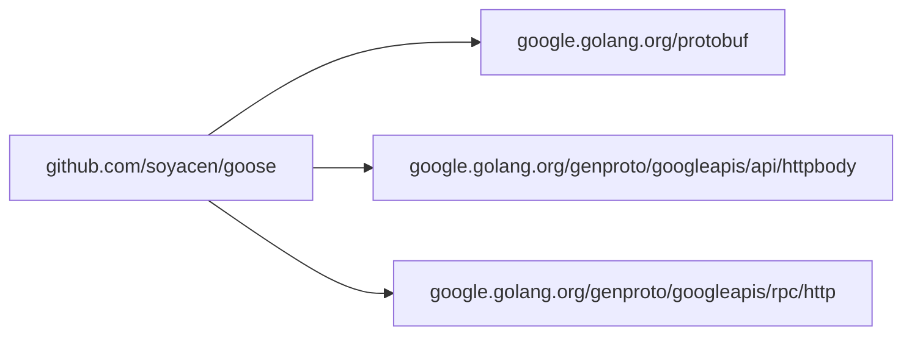

# 客户端编解码器

<cite>
**本文引用的文件**
- [client/encoder.go](file://client/encoder.go)
- [client/decoder.go](file://client/decoder.go)
- [client/middleware.go](file://client/middleware.go)
- [client/option.go](file://client/option.go)
- [client/encoder_test.go](file://client/encoder_test.go)
- [client/decoder_test.go](file://client/decoder_test.go)
- [client/middleware_test.go](file://client/middleware_test.go)
- [common.go](file://common.go)
- [constant.go](file://constant.go)
- [header.go](file://header.go)
- [route.go](file://route.go)
- [example/body/body_test.go](file://example/body/body_test.go)
- [example/query/query_test.go](file://example/query/query_test.go)
- [example/upload/upload_test.go](file://example/upload/upload_test.go)
- [go.mod](file://go.mod)
</cite>

## 目录
1. [简介](#简介)
2. [项目结构](#项目结构)
3. [核心组件](#核心组件)
4. [架构总览](#架构总览)
5. [详细组件分析](#详细组件分析)
6. [依赖分析](#依赖分析)
7. [性能考虑](#性能考虑)
8. [故障排查指南](#故障排查指南)
9. [结论](#结论)
10. [附录](#附录)

## 简介
本文件系统性阐述 HTTP 客户端的编解码器实现，重点覆盖以下方面：
- 请求编码器如何将 Protocol Buffers 消息转换为 HTTP 请求（含 JSON 序列化、原始 HttpBody 写入、RPC HttpRequest 复制）
- 响应解码器如何将 HTTP 响应转换为 Protocol Buffers 消息（含 JSON 反序列化、原始 HttpBody 提取、RPC HttpResponse 聚合）
- 编解码过程中的数据转换、序列化与反序列化机制
- 使用示例：不同数据类型的处理方式与错误处理策略
- 编解码器与中间件系统的集成方式

## 项目结构
客户端编解码器位于 client 子包，配合通用常量、上下文注入工具与选项配置共同构成完整的调用链路。

图表来源
- [client/encoder.go:1-81](file://client/encoder.go#L1-L81)
- [client/decoder.go:1-89](file://client/decoder.go#L1-L89)
- [client/middleware.go:1-99](file://client/middleware.go#L1-L99)
- [client/option.go:1-279](file://client/option.go#L1-L279)
- [constant.go:1-16](file://constant.go#L1-L16)
- [header.go:1-88](file://header.go#L1-L88)
- [route.go:1-26](file://route.go#L1-L26)
- [common.go:1-51](file://common.go#L1-L51)
- [example/body/body_test.go:1-164](file://example/body/body_test.go#L1-L164)
- [example/query/query_test.go:1-397](file://example/query/query_test.go#L1-L397)
- [example/upload/upload_test.go:1-275](file://example/upload/upload_test.go#L1-L275)
- [client/encoder_test.go:1-150](file://client/encoder_test.go#L1-L150)
- [client/decoder_test.go:1-179](file://client/decoder_test.go#L1-L179)
- [client/middleware_test.go:1-213](file://client/middleware_test.go#L1-L213)

章节来源
- [client/encoder.go:1-81](file://client/encoder.go#L1-L81)
- [client/decoder.go:1-89](file://client/decoder.go#L1-L89)
- [client/middleware.go:1-99](file://client/middleware.go#L1-L99)
- [client/option.go:1-279](file://client/option.go#L1-L279)
- [constant.go:1-16](file://constant.go#L1-L16)
- [header.go:1-88](file://header.go#L1-L88)
- [route.go:1-26](file://route.go#L1-L26)
- [common.go:1-51](file://common.go#L1-L51)

## 核心组件
- 请求编码器（encoder.go）：负责将 Protobuf 消息写入 HTTP 请求体，并设置 Content-Type；支持 JSON 序列化、原始 HttpBody 直写、RPC HttpRequest 的头与体复制。
- 响应解码器（decoder.go）：负责从 HTTP 响应中读取并解析为 Protobuf 消息；支持 JSON 反序列化、原始 HttpBody 提取、RPC HttpResponse 的状态、原因短语、头与体聚合。
- 中间件系统（middleware.go）：定义 Invoker 与 Middleware 类型，提供链式组合与执行能力，并在调用前注入路由信息。
- 选项配置（option.go）：集中管理 HTTP 客户端、JSON 编解码选项、错误解码器/工厂、中间件列表、失败快速返回、校验回调与 URL 解析器等。

章节来源
- [client/encoder.go:15-81](file://client/encoder.go#L15-L81)
- [client/decoder.go:16-89](file://client/decoder.go#L16-L89)
- [client/middleware.go:9-99](file://client/middleware.go#L9-L99)
- [client/option.go:12-279](file://client/option.go#L12-L279)

## 架构总览
客户端编解码器与中间件、选项配置协同工作，形成“编码请求 → 应用中间件 → 发起 HTTP 请求 → 解码响应”的完整流程。

图表来源
- [client/option.go:267-279](file://client/option.go#L267-L279)
- [client/encoder.go:28-80](file://client/encoder.go#L28-L80)
- [client/middleware.go:76-99](file://client/middleware.go#L76-L99)
- [client/decoder.go:28-88](file://client/decoder.go#L28-L88)

## 详细组件分析

### 请求编码器（编码 Protobuf → HTTP 请求）
- JSON 消息编码：将 Protobuf 消息按 JSON 规则序列化，写入请求体，设置 Content-Type 为 application/json; charset=utf-8。
- HttpBody 编码：直接将 HttpBody.Data 写入请求体，Content-Type 来自 HttpBody.ContentType。
- RPC HttpRequest 编码：将 Body 写入请求体，将 Headers 列表逐项添加到 http.Header。

图表来源
- [client/encoder.go:28-80](file://client/encoder.go#L28-L80)
- [constant.go:3-15](file://constant.go#L3-L15)

章节来源
- [client/encoder.go:15-81](file://client/encoder.go#L15-L81)
- [constant.go:3-15](file://constant.go#L3-L15)

### 响应解码器（解码 HTTP 响应 → Protobuf 消息）
- JSON 消息解码：读取响应体全部字节，按 JSON 反序列化为目标 Protobuf 消息，最后关闭响应体。
- HttpBody 解码：提取 Content-Type，读取响应体为字节数组，填充 HttpBody。
- RPC HttpResponse 解码：提取状态码与原因短语，遍历响应头为 HttpHeader 列表，读取响应体为字节数组。

图表来源
- [client/decoder.go:28-88](file://client/decoder.go#L28-L88)
- [constant.go:3-15](file://constant.go#L3-L15)

章节来源
- [client/decoder.go:16-89](file://client/decoder.go#L16-L89)
- [constant.go:3-15](file://constant.go#L3-L15)

### 中间件系统与调用链
- 类型定义：Invoker 为最终执行函数，Middleware 接受 HTTP 客户端、请求与下一个 Invoker。
- 链式组合：Chain 将多个 Middleware 组合成单一 Middleware，内部通过递归构建 invoker 链。
- 执行入口：Invoke 在调用前注入 RouteInfo，若未提供中间件则直接执行；否则按链顺序执行。

图表来源
- [client/middleware.go:9-99](file://client/middleware.go#L9-L99)
- [client/option.go:12-40](file://client/option.go#L12-L40)

章节来源
- [client/middleware.go:9-99](file://client/middleware.go#L9-L99)
- [client/option.go:12-158](file://client/option.go#L12-L158)

### 错误处理与资源清理
- 错误组合：BreakOnError 与 ContinueOnError 提供统一的错误传播与合并策略，确保资源清理与错误叠加。
- 资源关闭：解码器在读取响应体后显式关闭 Body；编码器在写入失败时立即返回错误。

图表来源
- [common.go:14-50](file://common.go#L14-L50)

章节来源
- [common.go:14-50](file://common.go#L14-L50)
- [client/decoder.go:29-36](file://client/decoder.go#L29-L36)
- [client/decoder.go:49-56](file://client/decoder.go#L49-L56)
- [client/decoder.go:69-87](file://client/decoder.go#L69-L87)

### 使用示例与数据类型处理

- JSON 消息（Protobuf Struct/Message）
  - 编码：将消息 JSON 序列化后写入请求体，设置 Content-Type。
  - 解码：读取响应体 JSON 并反序列化为目标消息。
  - 示例参考：[example/query/query_test.go:111-139](file://example/query/query_test.go#L111-L139) 展示多种标量/包装/列表类型的序列化行为。

- 原始 HttpBody
  - 编码：直接写入 Data，设置 Content-Type。
  - 解码：提取 Content-Type 与 Data。
  - 示例参考：[example/upload/upload_test.go:115-180](file://example/upload/upload_test.go#L115-L180) 展示 multipart/form-data 的上传与解码。

- RPC HttpRequest/HttpResponse
  - 编码：写入 Body，复制 Headers 到 http.Header。
  - 解码：提取状态码、原因短语、头列表与 Body。
  - 示例参考：[example/body/body_test.go:148-163](file://example/body/body_test.go#L148-L163) 展示 HttpRequest 的使用。

章节来源
- [example/query/query_test.go:111-139](file://example/query/query_test.go#L111-L139)
- [example/upload/upload_test.go:115-180](file://example/upload/upload_test.go#L115-L180)
- [example/body/body_test.go:148-163](file://example/body/body_test.go#L148-L163)

### 错误处理策略
- 编码阶段：对 Writer/Body 写入失败立即返回错误，避免污染请求。
- 解码阶段：对响应体读取失败或 JSON 反序列化失败返回错误，并在可能时关闭响应体。
- 中间件阶段：错误中间件可直接返回错误；链式执行时遵循先入后出的调用顺序。

章节来源
- [client/encoder_test.go:53-59](file://client/encoder_test.go#L53-L59)
- [client/encoder_test.go:91-97](file://client/encoder_test.go#L91-L97)
- [client/encoder_test.go:136-142](file://client/encoder_test.go#L136-L142)
- [client/decoder_test.go:54-64](file://client/decoder_test.go#L54-L64)
- [client/decoder_test.go:97-106](file://client/decoder_test.go#L97-L106)
- [client/decoder_test.go:157-167](file://client/decoder_test.go#L157-L167)
- [client/middleware_test.go:118-128](file://client/middleware_test.go#L118-L128)

## 依赖分析
- 第三方依赖
  - google.golang.org/protobuf：JSON 编解码、消息接口
  - google.golang.org/genproto/googleapis/api/httpbody：HttpBody
  - google.golang.org/genproto/googleapis/rpc/http：google.rpc.HttpRequest/HttpResponse
- 内部模块
  - goose：常量、头部工具、路由信息、错误组合

图表来源
- [go.mod:5-13](file://go.mod#L5-L13)

章节来源
- [go.mod:5-13](file://go.mod#L5-L13)

## 性能考虑
- I/O 合并：编码器直接将消息写入 io.Writer，避免不必要的缓冲；解码器一次性读取响应体，减少系统调用次数。
- 序列化开销：JSON 编解码的 CPU 开销与消息大小成正比；建议在高频路径上评估压缩或二进制格式。
- 中间件链长度：中间件数量增加会带来额外的函数调用与闭包分配；应按需组合中间件。
- 资源释放：确保响应体在解码后及时关闭，防止连接泄漏。

## 故障排查指南
- 编码失败
  - 检查 Writer 是否可写；确认 MarshalOptions 配置正确。
  - 参考测试用例定位问题：[client/encoder_test.go:53-59](file://client/encoder_test.go#L53-L59)、[client/encoder_test.go:91-97](file://client/encoder_test.go#L91-L97)、[client/encoder_test.go:136-142](file://client/encoder_test.go#L136-142)
- 解码失败
  - 检查响应体是否可读、JSON 是否合法；确认 UnmarshalOptions 配置。
  - 参考测试用例定位问题：[client/decoder_test.go:54-64](file://client/decoder_test.go#L54-L64)、[client/decoder_test.go:97-106](file://client/decoder_test.go#L97-L106)、[client/decoder_test.go:157-167](file://client/decoder_test.go#L157-167)
- 中间件异常
  - 确认中间件链顺序与职责边界；验证错误中间件是否正确返回。
  - 参考测试用例定位问题：[client/middleware_test.go:118-128](file://client/middleware_test.go#L118-128)、[client/middleware_test.go:157-212](file://client/middleware_test.go#L157-212)
- 路由信息缺失
  - 确保 Invoke 前已注入 RouteInfo；检查上下文键值对。
  - 参考实现：[client/middleware.go:88-93](file://client/middleware.go#L88-93)、[route.go:17-26](file://route.go#L17-L26)

章节来源
- [client/encoder_test.go:53-59](file://client/encoder_test.go#L53-L59)
- [client/encoder_test.go:91-97](file://client/encoder_test.go#L91-L97)
- [client/encoder_test.go:136-142](file://client/encoder_test.go#L136-L142)
- [client/decoder_test.go:54-64](file://client/decoder_test.go#L54-L64)
- [client/decoder_test.go:97-106](file://client/decoder_test.go#L97-L106)
- [client/decoder_test.go:157-167](file://client/decoder_test.go#L157-L167)
- [client/middleware_test.go:118-128](file://client/middleware_test.go#L118-L128)
- [client/middleware_test.go:157-212](file://client/middleware_test.go#L157-L212)
- [client/middleware.go:88-93](file://client/middleware.go#L88-L93)
- [route.go:17-26](file://route.go#L17-L26)

## 结论
客户端编解码器以简洁的 API 实现了 Protobuf 与 HTTP 的双向转换，结合中间件系统提供了灵活的扩展点。通过明确的错误处理与资源管理策略，能够在复杂场景下保持稳定与高效。建议在生产环境中：
- 明确选择编码类型（JSON/HttpBody/RPC），并根据负载特征优化序列化选项
- 合理组织中间件链，避免冗余处理
- 在高并发场景下关注响应体读取与关闭时机，防止资源泄露

## 附录
- 关键常量
  - Content-Type 键与默认 JSON/文本内容类型：[constant.go:3-15](file://constant.go#L3-L15)
- 上下文与头部工具
  - 头部复制、上下文注入与客户端 IP 提取：[header.go:10-88](file://header.go#L10-L88)
- 路由信息
  - 路由方法、模式与全限定方法名的上下文存储：[route.go:7-26](file://route.go#L7-L26)
- 选项配置清单
  - 客户端、编解码选项、错误处理器、中间件、失败快速返回、校验回调、URL 解析器：[client/option.go:12-158](file://client/option.go#L12-L158)