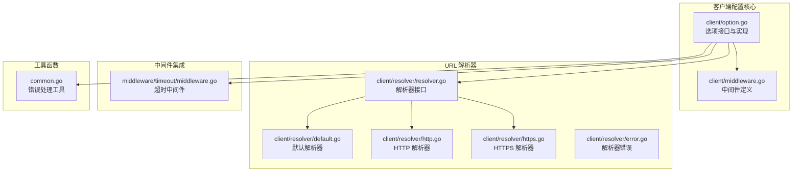
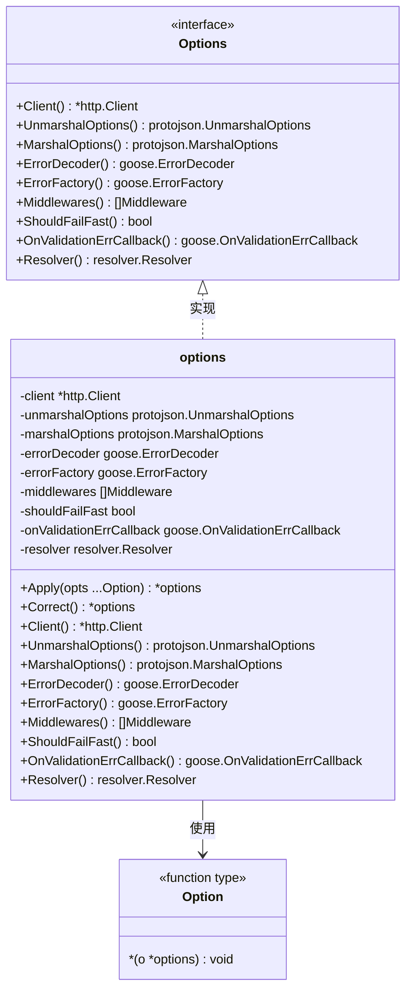
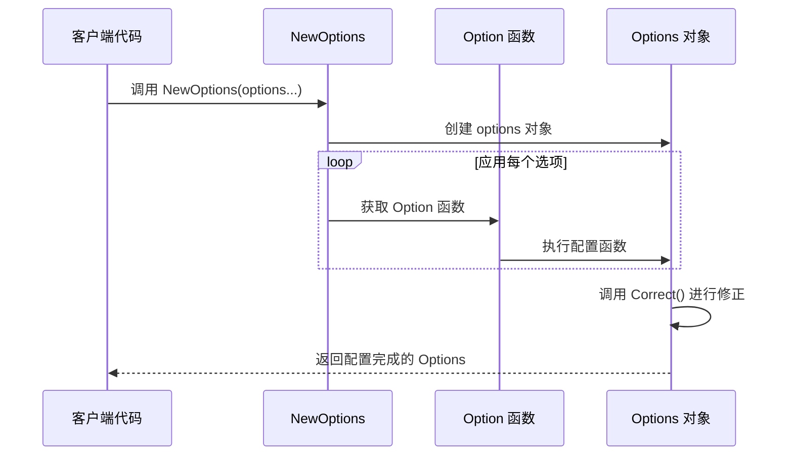
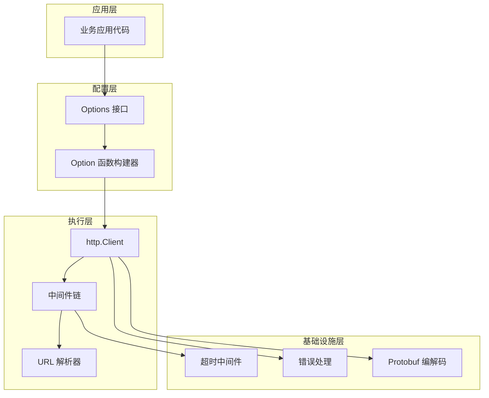
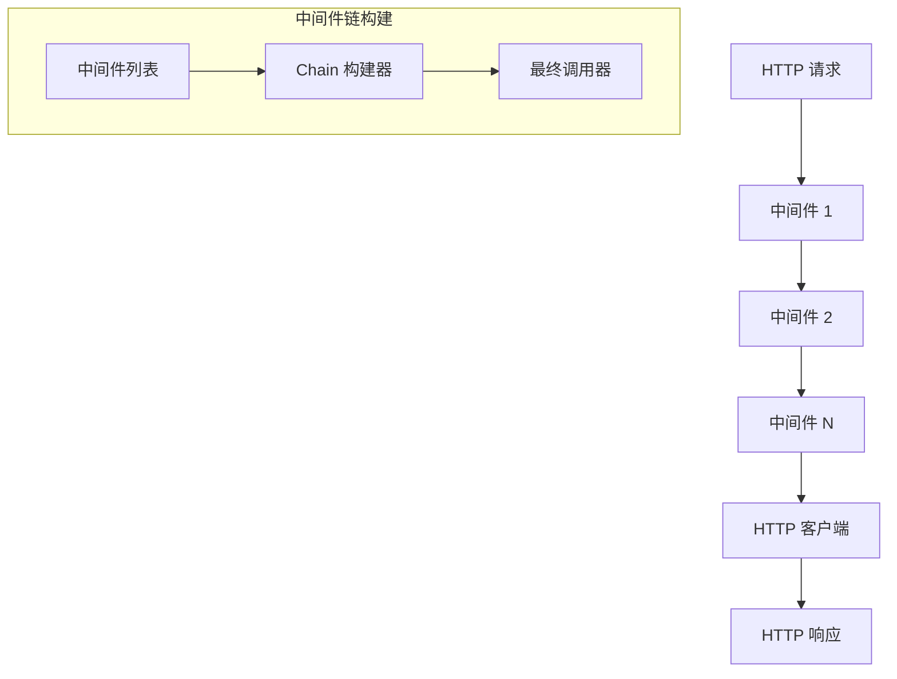
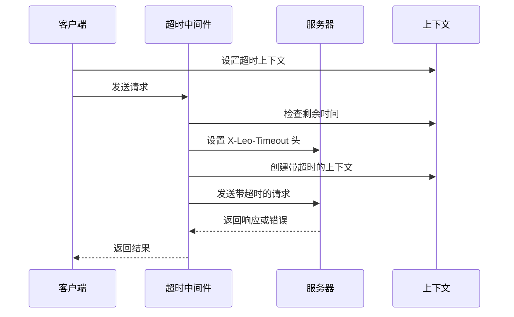
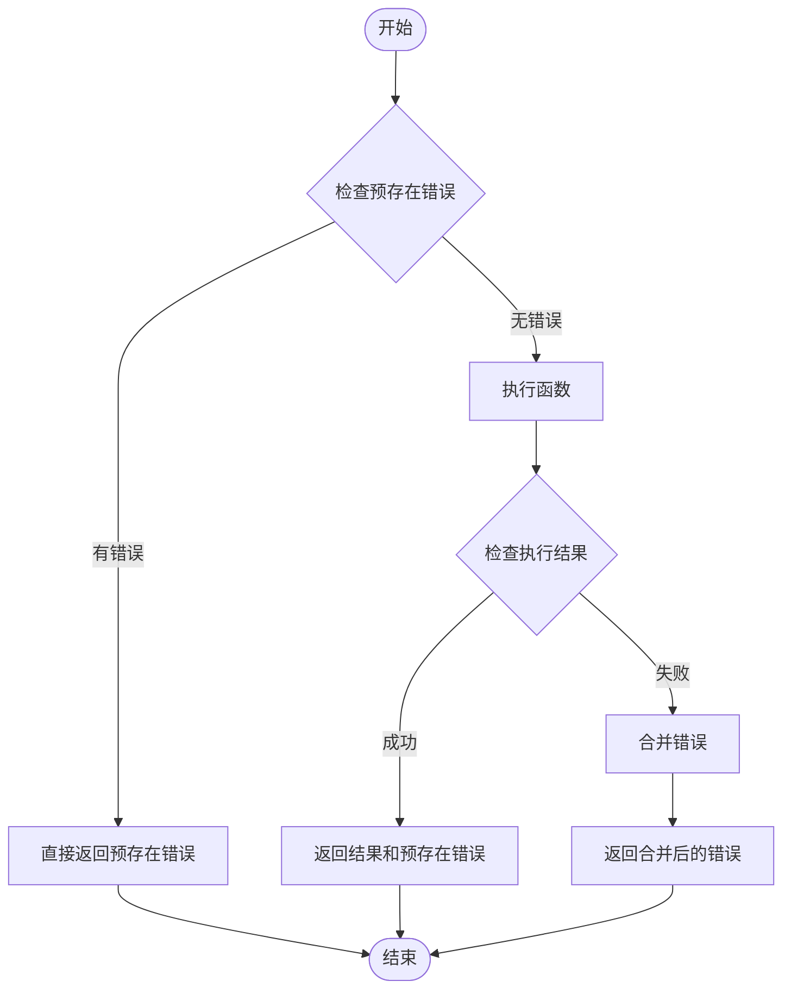
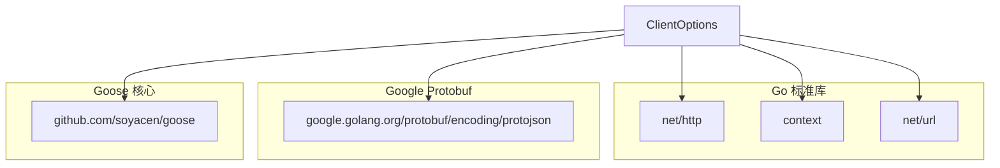
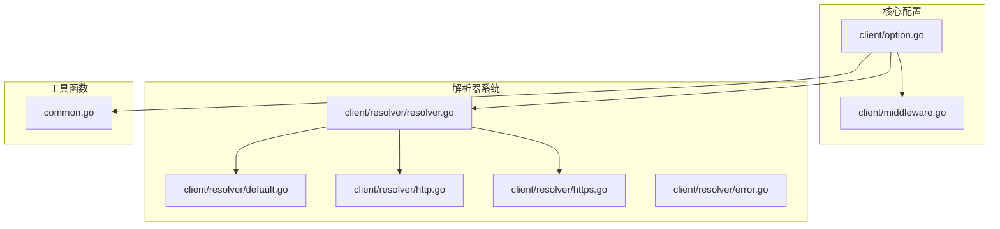

# 客户端选项配置

<cite>
**本文档引用的文件**
- [client/option.go](file://client/option.go)
- [client/option_test.go](file://client/option_test.go)
- [client/middleware.go](file://client/middleware.go)
- [client/resolver/resolver.go](file://client/resolver/resolver.go)
- [client/resolver/default.go](file://client/resolver/default.go)
- [client/resolver/http.go](file://client/resolver/http.go)
- [client/resolver/https.go](file://client/resolver/https.go)
- [client/resolver/error.go](file://client/resolver/error.go)
- [middleware/timeout/middleware.go](file://middleware/timeout/middleware.go)
- [common.go](file://common.go)
- [go.mod](file://go.mod)
</cite>

## 目录
1. [简介](#简介)
2. [项目结构](#项目结构)
3. [核心组件](#核心组件)
4. [架构概览](#架构概览)
5. [详细组件分析](#详细组件分析)
6. [依赖分析](#依赖分析)
7. [性能考虑](#性能考虑)
8. [故障排除指南](#故障排除指南)
9. [结论](#结论)

## 简介

本文档全面介绍了 Goose HTTP 客户端的选项配置系统。该系统采用函数式选项模式（Functional Options Pattern），提供了灵活且类型安全的方式来配置 HTTP 客户端的各种行为。系统支持客户端连接配置、超时设置、TLS 配置、错误处理、中间件链以及 URL 解析等功能。

函数式选项模式是 Go 语言中一种优雅的配置方式，它通过将配置作为函数参数传递，避免了构造函数参数过多的问题，同时保持了类型安全性和可读性。

## 项目结构

Goose 项目的客户端选项配置系统主要分布在以下模块中：



**图表来源**
- [client/option.go:1-279](file://client/option.go#L1-L279)
- [client/resolver/resolver.go:1-70](file://client/resolver/resolver.go#L1-L70)

**章节来源**
- [client/option.go:1-279](file://client/option.go#L1-L279)
- [client/middleware.go:1-99](file://client/middleware.go#L1-L99)
- [client/resolver/resolver.go:1-70](file://client/resolver/resolver.go#L1-L70)

## 核心组件

### 选项接口设计

客户端选项系统的核心是一个简洁而强大的接口设计，定义了所有可配置的客户端行为：



**图表来源**
- [client/option.go:12-158](file://client/option.go#L12-L158)

### 函数式选项模式实现

系统采用函数式选项模式，每个配置项都是一个返回函数的构造器：



**图表来源**
- [client/option.go:267-279](file://client/option.go#L267-L279)
- [client/option.go:58-86](file://client/option.go#L58-L86)

**章节来源**
- [client/option.go:12-158](file://client/option.go#L12-L158)
- [client/option.go:267-279](file://client/option.go#L267-L279)

## 架构概览

客户端选项配置系统遵循分层架构设计，各组件职责清晰：



**图表来源**
- [client/option.go:1-279](file://client/option.go#L1-L279)
- [client/middleware.go:1-99](file://client/middleware.go#L1-L99)
- [middleware/timeout/middleware.go:1-107](file://middleware/timeout/middleware.go#L1-L107)

## 详细组件分析

### 选项配置系统

#### HTTP 客户端配置

HTTP 客户端是所有请求的基础，支持自定义连接池、超时设置、TLS 配置等：

| 配置项 | 类型 | 默认值 | 作用描述 |
|--------|------|--------|----------|
| Client | *http.Client | nil | 自定义 HTTP 客户端实例 |
| UnmarshalOptions | protojson.UnmarshalOptions | 空选项 | Protobuf 反序列化选项 |
| MarshalOptions | protojson.MarshalOptions | 空选项 | Protobuf 序列化选项 |

#### 错误处理配置

系统提供了灵活的错误处理机制：

| 配置项 | 类型 | 默认值 | 作用描述 |
|--------|------|--------|----------|
| ErrorDecoder | goose.ErrorDecoder | DefaultDecodeError | 自定义错误解码器 |
| ErrorFactory | goose.ErrorFactory | DefaultErrorFactory | 自定义错误工厂 |
| OnValidationErrCallback | goose.OnValidationErrCallback | 空回调 | 验证错误回调 |

#### 中间件配置

中间件系统支持链式调用和组合：



**图表来源**
- [client/middleware.go:35-74](file://client/middleware.go#L35-L74)

#### URL 解析器配置

系统支持多种 URL 解析策略：

| 解析器类型 | 处理方案 | 使用场景 |
|------------|----------|----------|
| DefaultResolver | 空字符串方案 | 无方案 URL 的默认处理 |
| HttpResolver | 直接复制组件 | HTTP 协议 URL |
| HttpsResolver | 直接复制组件 | HTTPS 协议 URL |

**章节来源**
- [client/option.go:160-265](file://client/option.go#L160-L265)
- [client/middleware.go:1-99](file://client/middleware.go#L1-L99)
- [client/resolver/resolver.go:1-70](file://client/resolver/resolver.go#L1-L70)

### 超时配置系统

超时中间件实现了客户端和服务端的双向超时控制：



**图表来源**
- [middleware/timeout/middleware.go:61-107](file://middleware/timeout/middleware.go#L61-L107)

**章节来源**
- [middleware/timeout/middleware.go:1-107](file://middleware/timeout/middleware.go#L1-L107)

### 错误处理工具

系统提供了两个重要的错误处理工具函数：



**图表来源**
- [common.go:14-50](file://common.go#L14-L50)

**章节来源**
- [common.go:1-51](file://common.go#L1-L51)

## 依赖分析

### 外部依赖

系统的主要外部依赖包括：



**图表来源**
- [go.mod:1-14](file://go.mod#L1-L14)

### 内部依赖关系



**图表来源**
- [client/option.go:1-279](file://client/option.go#L1-L279)
- [client/resolver/resolver.go:1-70](file://client/resolver/resolver.go#L1-L70)

**章节来源**
- [go.mod:1-14](file://go.mod#L1-L14)
- [client/option.go:1-279](file://client/option.go#L1-L279)

## 性能考虑

### 选项应用优化

1. **延迟初始化**: 未设置的选项会在 `Correct()` 方法中进行延迟初始化，避免不必要的内存分配
2. **中间件链优化**: 使用递归构建器模式创建中间件链，减少函数调用开销
3. **解析器缓存**: 注册的解析器存储在并发安全的映射中，提供 O(1) 查找性能

### 内存管理

- 所有配置选项都使用指针类型，避免大对象的复制
- 中间件链采用尾递归优化，减少栈空间使用
- 解析器注册使用 `sync.Map` 提供高并发访问性能

## 故障排除指南

### 常见问题诊断

#### 选项未生效

**症状**: 配置的选项没有按预期工作

**可能原因**:
1. 选项应用顺序问题
2. 选项被后续选项覆盖
3. 未正确调用 `NewOptions()` 或 `Apply()`

**解决方案**:
```go
// 正确的做法
opts := client.NewOptions(
    client.Client(customClient),
    client.FailFast(),
    client.Middlewares(timeoutMiddleware),
)

// 检查配置是否正确
fmt.Printf("Client: %v\n", opts.Client())
fmt.Printf("FailFast: %v\n", opts.ShouldFailFast())
```

#### URL 解析错误

**症状**: `resolver: scheme <scheme> is not supported` 错误

**解决方法**:
```go
// 确保使用正确的 URL 方案
url := "https://example.com"  // 而不是 "example.com"

// 或者自定义解析器
customResolver := resolver.DefaultResolver{
    HttpScheme: "https",
}
```

#### 中间件执行异常

**症状**: 中间件链中的某个中间件导致请求失败

**调试步骤**:
1. 检查中间件的执行顺序
2. 验证每个中间件的错误处理
3. 使用日志记录中间件的输入输出

**章节来源**
- [client/option_test.go:223-266](file://client/option_test.go#L223-L266)
- [client/resolver/error.go:1-27](file://client/resolver/error.go#L1-L27)

## 结论

Goose HTTP 客户端的选项配置系统通过精心设计的函数式选项模式，为开发者提供了强大而灵活的配置能力。系统的主要优势包括：

1. **类型安全**: 所有配置选项都有明确的类型定义
2. **扩展性强**: 易于添加新的配置选项和中间件
3. **性能优化**: 采用多种优化技术确保运行效率
4. **易于测试**: 清晰的接口设计便于单元测试
5. **向后兼容**: 设计允许在未来版本中添加新功能而不破坏现有代码

通过合理使用这些配置选项，开发者可以轻松地定制 HTTP 客户端的行为，满足各种复杂的网络通信需求。建议在实际项目中根据具体需求选择合适的配置组合，并充分利用中间件系统来实现横切关注点的功能。