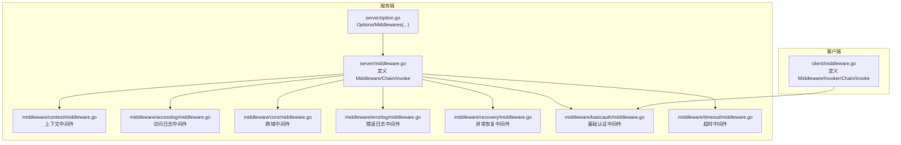
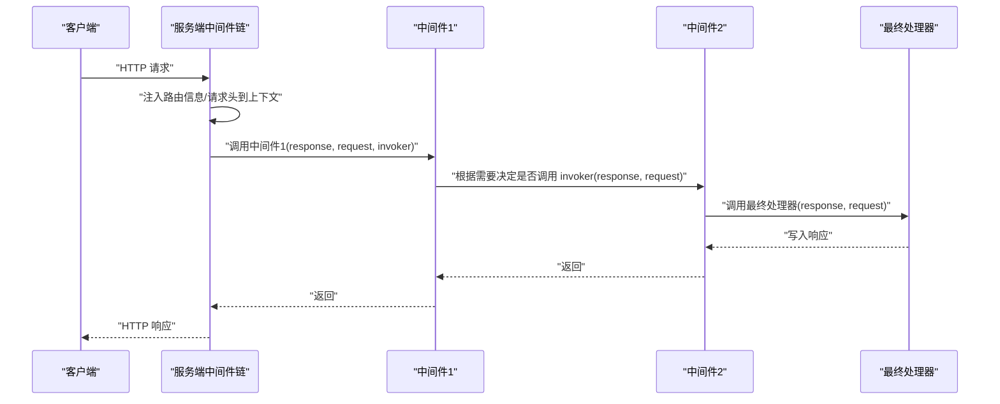
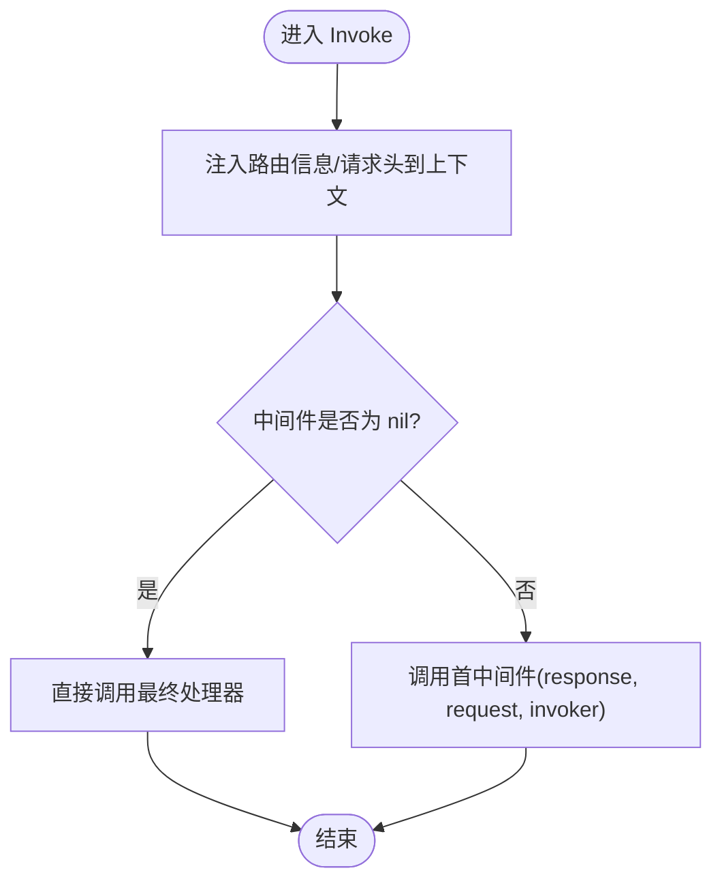
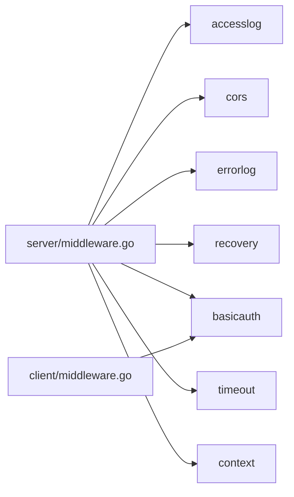

# 中间件系统

<cite>
**本文引用的文件**
- [server/middleware.go](file://server/middleware.go)
- [server/middleware_test.go](file://server/middleware_test.go)
- [client/middleware.go](file://client/middleware.go)
- [middleware/context/middleware.go](file://middleware/context/middleware.go)
- [middleware/accesslog/middleware.go](file://middleware/accesslog/middleware.go)
- [middleware/cors/middleware.go](file://middleware/cors/middleware.go)
- [middleware/cors/option.go](file://middleware/cors/option.go)
- [middleware/errorlog/middleware.go](file://middleware/errorlog/middleware.go)
- [middleware/errorlog/option.go](file://middleware/errorlog/option.go)
- [middleware/recovery/middleware.go](file://middleware/recovery/middleware.go)
- [middleware/basicauth/middleware.go](file://middleware/basicauth/middleware.go)
- [middleware/timeout/middleware.go](file://middleware/timeout/middleware.go)
- [server/option.go](file://server/option.go)
- [go.mod](file://go.mod)
</cite>

## 目录
1. [引言](#引言)
2. [项目结构](#项目结构)
3. [核心组件](#核心组件)
4. [架构总览](#架构总览)
5. [详细组件分析](#详细组件分析)
6. [依赖分析](#依赖分析)
7. [性能考虑](#性能考虑)
8. [故障排查指南](#故障排查指南)
9. [结论](#结论)
10. [附录](#附录)

## 引言
本文件系统性阐述 HTTP 服务器与客户端的中间件体系：从 Middleware 函数类型的设计理念、Chain 的链式组合机制、getInvoker 的递归调用实现，到执行顺序、上下文传递与错误传播；并提供自定义中间件的开发规范、性能优化建议与调试技巧，以及内置中间件的使用场景与配置方法。

## 项目结构
中间件系统主要由以下部分组成：
- 服务端中间件基础设施：定义 Middleware 类型、链式组合与执行入口
- 客户端中间件基础设施：定义 Middleware/Invoker 类型、链式组合与执行入口
- 内置中间件：鉴权、跨域、访问日志、错误日志、超时、恢复等
- 服务器选项：集中管理中间件链与其它服务端配置

图表来源
- [server/middleware.go:1-85](file://server/middleware.go#L1-L85)
- [client/middleware.go:1-99](file://client/middleware.go#L1-L99)
- [server/option.go:1-198](file://server/option.go#L1-L198)
- [middleware/accesslog/middleware.go:1-318](file://middleware/accesslog/middleware.go#L1-L318)
- [middleware/cors/middleware.go:1-249](file://middleware/cors/middleware.go#L1-L249)
- [middleware/errorlog/middleware.go:1-195](file://middleware/errorlog/middleware.go#L1-L195)
- [middleware/recovery/middleware.go:1-55](file://middleware/recovery/middleware.go#L1-L55)
- [middleware/basicauth/middleware.go:1-113](file://middleware/basicauth/middleware.go#L1-L113)
- [middleware/timeout/middleware.go:1-107](file://middleware/timeout/middleware.go#L1-L107)
- [middleware/context/middleware.go:1-35](file://middleware/context/middleware.go#L1-L35)

章节来源
- [server/middleware.go:1-85](file://server/middleware.go#L1-L85)
- [client/middleware.go:1-99](file://client/middleware.go#L1-L99)
- [server/option.go:1-198](file://server/option.go#L1-L198)

## 核心组件
- 服务端 Middleware 类型：接收响应写入器、请求对象与“下一个处理器”（invoker）作为参数，形成责任链模式
- 客户端 Invoker 类型：封装一次 HTTP 调用，返回响应或错误
- Chain 组合：将多个中间件按声明顺序串联，最终形成单一 Middleware/Invoker
- getInvoker 递归构建：从当前索引开始，递归地将“下一个中间件”包装为 invoker，直至最终处理器
- Invoke 入口：在服务端将路由信息与请求头注入上下文后，调用链首部中间件；在客户端直接调用最终 invoker 或首部中间件

章节来源
- [server/middleware.go:9-84](file://server/middleware.go#L9-L84)
- [client/middleware.go:9-98](file://client/middleware.go#L9-L98)

## 架构总览
下图展示服务端中间件链的调用序列：请求进入后，先注入上下文信息，再依次调用各中间件；每个中间件可选择读取/修改上下文、请求头、请求体，决定是否调用下一个 invoker，最终到达业务处理器。

图表来源
- [server/middleware.go:76-84](file://server/middleware.go#L76-L84)
- [server/middleware.go:31-43](file://server/middleware.go#L31-L43)
- [server/middleware.go:56-63](file://server/middleware.go#L56-L63)

## 详细组件分析

### 服务端中间件基础设施
- Middleware 设计：统一的中间件签名，便于链式组合与复用
- Chain 策略：空链返回 nil；单个中间件直接返回；多个中间件通过 getInvoker 递归构建
- getInvoker 实现：递归包装，避免闭包捕获导致的栈深问题，确保调用顺序与职责清晰
- Invoke 行为：若中间件为 nil，直接调用最终处理器；否则将路由信息与请求头注入上下文后交由中间件处理

图表来源
- [server/middleware.go:76-84](file://server/middleware.go#L76-L84)

章节来源
- [server/middleware.go:9-84](file://server/middleware.go#L9-L84)

### 客户端中间件基础设施
- Invoker 抽象：封装一次 HTTP 调用，返回响应或错误
- Middleware 签名：接收 HTTP 客户端、请求与下一个 Invoker
- Chain/Invoke：与服务端一致的链式组合与执行模型，支持在客户端侧进行重试、限流、日志等横切关注点

章节来源
- [client/middleware.go:9-98](file://client/middleware.go#L9-L98)

### 上下文中间件
- 作用：允许注入/转换上下文，常用于透传追踪 ID、用户身份、租户信息等
- 服务端/客户端均提供对应实现，保持一致性

章节来源
- [middleware/context/middleware.go:11-35](file://middleware/context/middleware.go#L11-L35)

### 访问日志中间件
- 功能：记录请求耗时、状态码、请求/响应体（可选）、请求头等
- 服务端：包装响应写入器以捕获状态码与可选响应体；支持跳过特定路由的日志
- 客户端：记录出站请求耗时、状态码、错误信息等
- 性能：使用 sync.Pool 复用属性切片，降低分配开销

章节来源
- [middleware/accesslog/middleware.go:116-204](file://middleware/accesslog/middleware.go#L116-L204)
- [middleware/accesslog/middleware.go:206-276](file://middleware/accesslog/middleware.go#L206-L276)

### 跨域中间件
- 功能：处理预检（OPTIONS）与实际 CORS 请求，设置允许的 Origin/Method/Header、凭证、暴露头、缓存时间等
- 支持通配符 Origin、自定义校验函数、私有网络访问控制
- 测试覆盖：包含多种场景验证（通配符匹配、方法/头部白名单、Vary 头等）

章节来源
- [middleware/cors/middleware.go:45-160](file://middleware/cors/middleware.go#L45-L160)
- [middleware/cors/option.go:9-105](file://middleware/cors/option.go#L9-L105)
- [middleware/cors/middleware_test.go:41-500](file://middleware/cors/middleware_test.go#L41-L500)

### 错误日志中间件
- 功能：仅对 4xx/5xx 或客户端错误进行日志记录，支持打印请求/响应体
- 服务端/客户端分别实现，属性构建逻辑相似但字段略有差异

章节来源
- [middleware/errorlog/middleware.go:24-106](file://middleware/errorlog/middleware.go#L24-L106)
- [middleware/errorlog/option.go:5-60](file://middleware/errorlog/option.go#L5-L60)

### 异常恢复中间件
- 功能：捕获 panic 并调用自定义回调，默认记录堆栈
- 适用：保护服务端在未知异常情况下不崩溃，维持稳定性

章节来源
- [middleware/recovery/middleware.go:38-55](file://middleware/recovery/middleware.go#L38-L55)

### 基础认证中间件
- 服务端：解析 Authorization 头，校验凭据，失败时返回 401 并要求质询
- 客户端：为出站请求设置 Basic 用户名密码
- 上下文：将用户名注入请求上下文，便于后续中间件/处理器使用

章节来源
- [middleware/basicauth/middleware.go:55-113](file://middleware/basicauth/middleware.go#L55-L113)

### 超时中间件
- 服务端：从请求头读取超时设置（若更短则采用），创建带超时的上下文
- 客户端：基于上下文截止时间计算剩余时间，设置请求头并创建带超时的上下文
- 关键头：X-Leo-Timeout

章节来源
- [middleware/timeout/middleware.go:28-107](file://middleware/timeout/middleware.go#L28-L107)

### 服务器选项与中间件链集成
- Options 接口提供 Middlewares() 获取中间件链
- Middlewares(...) Option 将中间件追加到链中
- 与 Chain/Invoke 协同工作，形成统一的服务端中间件装配方式

章节来源
- [server/option.go:8-102](file://server/option.go#L8-L102)
- [server/option.go:143-154](file://server/option.go#L143-L154)

## 依赖分析
- 中间件之间无直接循环依赖，耦合度低
- 服务端与客户端中间件共享相同的链式组合思想，但具体类型不同
- 内置中间件彼此独立，可通过 Options/Chain 自由组合

图表来源
- [server/middleware.go:1-85](file://server/middleware.go#L1-L85)
- [client/middleware.go:1-99](file://client/middleware.go#L1-L99)
- [middleware/accesslog/middleware.go:1-318](file://middleware/accesslog/middleware.go#L1-L318)
- [middleware/cors/middleware.go:1-249](file://middleware/cors/middleware.go#L1-L249)
- [middleware/errorlog/middleware.go:1-195](file://middleware/errorlog/middleware.go#L1-L195)
- [middleware/recovery/middleware.go:1-55](file://middleware/recovery/middleware.go#L1-L55)
- [middleware/basicauth/middleware.go:1-113](file://middleware/basicauth/middleware.go#L1-L113)
- [middleware/timeout/middleware.go:1-107](file://middleware/timeout/middleware.go#L1-L107)
- [middleware/context/middleware.go:1-35](file://middleware/context/middleware.go#L1-L35)

章节来源
- [go.mod:1-14](file://go.mod#L1-L14)

## 性能考虑
- 使用 sync.Pool 复用属性切片（访问日志中间件）
- 在中间件中尽量避免重复读取/拷贝请求体
- 合理设置日志级别与开关，减少不必要的 IO
- 对于客户端中间件，优先使用上下文截止时间，避免无效超时
- 避免在中间件中进行昂贵的 CPU 密集操作，必要时异步化或限流

## 故障排查指南
- 中间件未生效
  - 检查是否正确调用 Chain 并将结果传入 Invoke
  - 确认中间件链顺序是否符合预期
- 日志缺失
  - 访问日志：确认路由是否被跳过、是否开启打印请求/响应体
  - 错误日志：确认状态码是否为 4xx/5xx 或客户端错误
- 跨域失败
  - 核对 AllowedOrigins/AllowedMethods/AllowedHeaders 配置
  - 注意通配符与大小写敏感性
- 超时异常
  - 检查请求头 X-Leo-Timeout 是否正确设置
  - 客户端需确保上下文截止时间合理
- 异常恢复
  - 若未看到 panic 日志，检查自定义回调是否覆盖默认行为

章节来源
- [middleware/accesslog/middleware.go:116-204](file://middleware/accesslog/middleware.go#L116-L204)
- [middleware/errorlog/middleware.go:24-106](file://middleware/errorlog/middleware.go#L24-L106)
- [middleware/cors/middleware.go:45-160](file://middleware/cors/middleware.go#L45-L160)
- [middleware/timeout/middleware.go:28-107](file://middleware/timeout/middleware.go#L28-L107)
- [middleware/recovery/middleware.go:38-55](file://middleware/recovery/middleware.go#L38-L55)

## 结论
该中间件系统以简洁的 Middleware/Invoker 类型为核心，通过 Chain 与 getInvoker 实现稳定的链式组合与执行顺序，结合上下文注入与错误传播，提供了高扩展性的横切能力。内置中间件覆盖了常见需求，同时保留了灵活的配置接口。开发者可据此快速构建安全、可观测、健壮的 HTTP 服务。

## 附录

### 自定义中间件开发指南
- 编写规范
  - 明确职责边界：每个中间件只做一件事
  - 保持幂等：多次调用不应产生副作用
  - 正确传递上下文：必要时通过 context 注入/提取信息
  - 严格遵循链式调用：在合适时机调用 invoker
- 性能优化
  - 避免在中间件中进行阻塞 IO
  - 复用对象池（如 sync.Pool）
  - 控制日志量级与字段数量
- 调试技巧
  - 使用最小链路定位问题
  - 在关键节点打印上下文信息
  - 利用错误日志中间件辅助诊断

### 内置中间件使用场景与配置
- 访问日志：生产环境必备，建议仅在非关键路径开启请求/响应体打印
- 错误日志：仅记录错误，避免噪声
- 跨域：前后端分离时启用，谨慎配置 AllowedOrigins
- 基础认证：对外暴露 API 时启用
- 超时：服务端/客户端配合，保障整体 SLA
- 异常恢复：保护服务稳定运行
- 上下文：贯穿全链路的追踪与审计

章节来源
- [middleware/accesslog/middleware.go:116-204](file://middleware/accesslog/middleware.go#L116-L204)
- [middleware/errorlog/middleware.go:24-106](file://middleware/errorlog/middleware.go#L24-L106)
- [middleware/cors/middleware.go:45-160](file://middleware/cors/middleware.go#L45-L160)
- [middleware/basicauth/middleware.go:55-113](file://middleware/basicauth/middleware.go#L55-L113)
- [middleware/timeout/middleware.go:28-107](file://middleware/timeout/middleware.go#L28-L107)
- [middleware/recovery/middleware.go:38-55](file://middleware/recovery/middleware.go#L38-L55)
- [middleware/context/middleware.go:11-35](file://middleware/context/middleware.go#L11-L35)