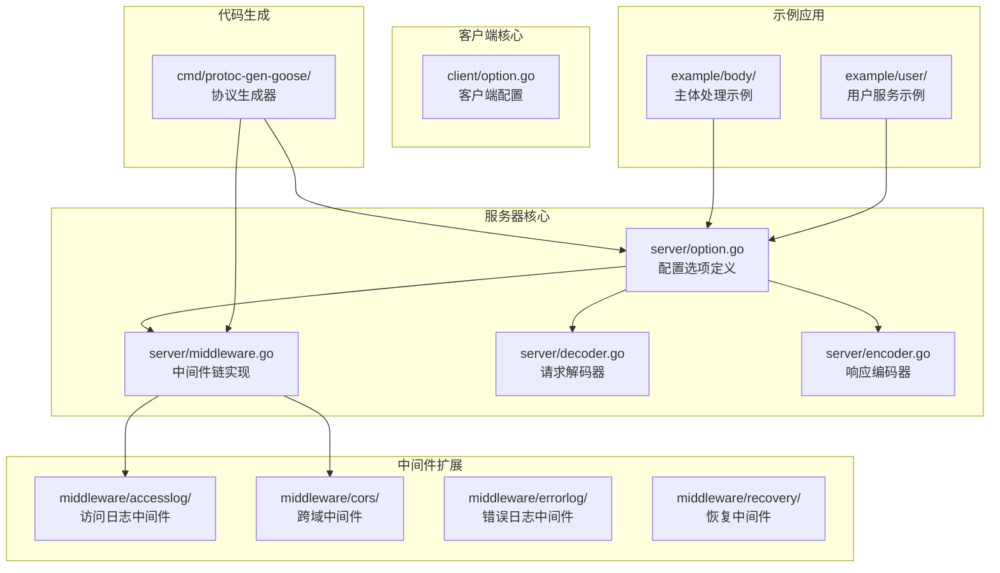
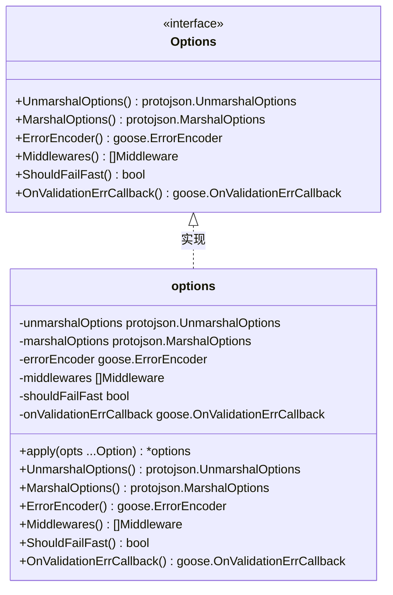
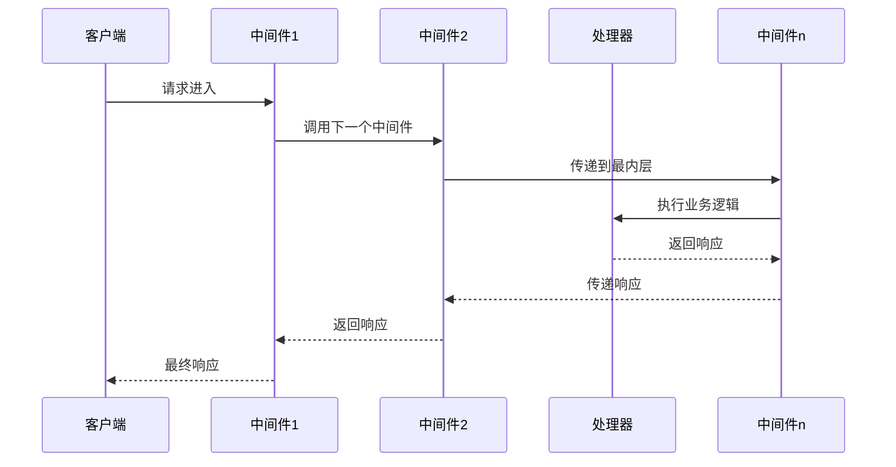
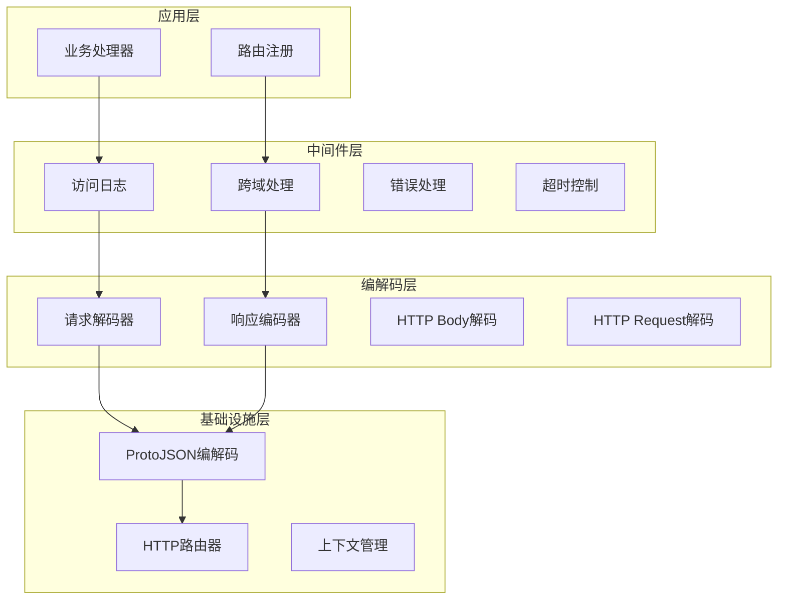
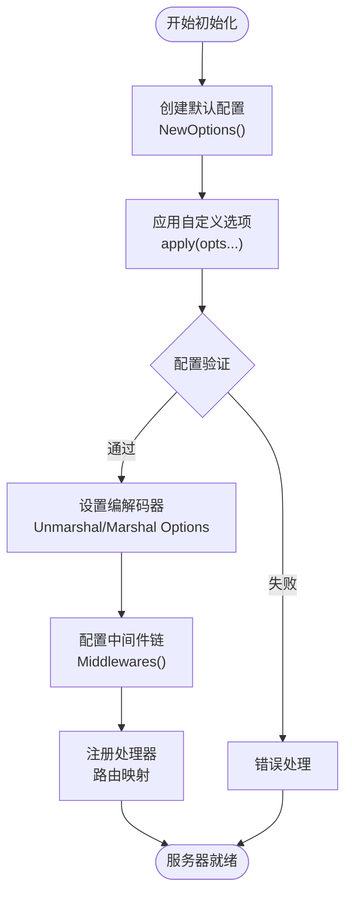
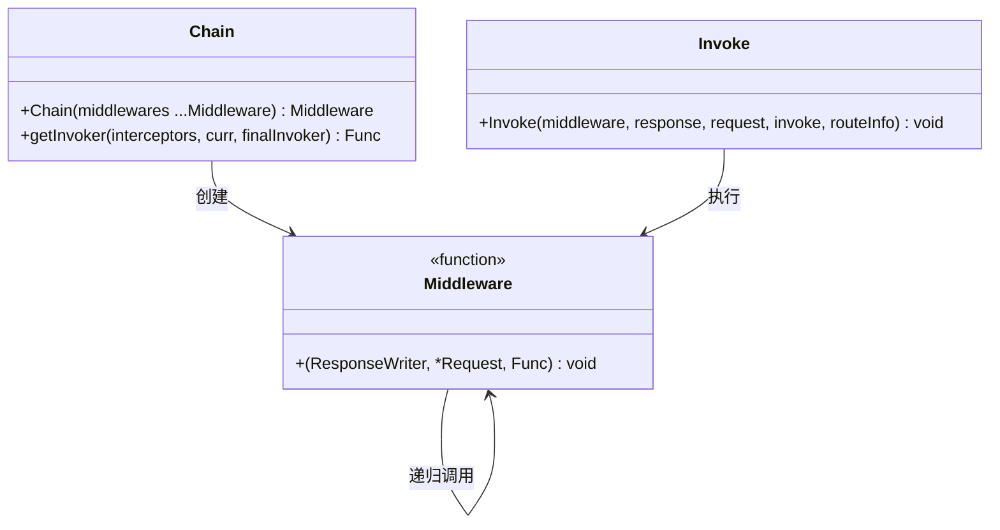
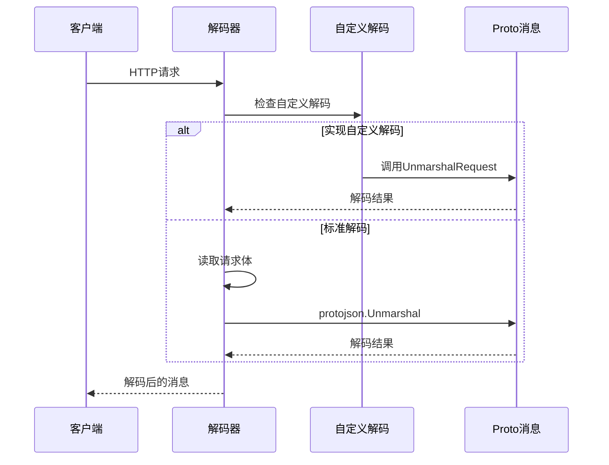
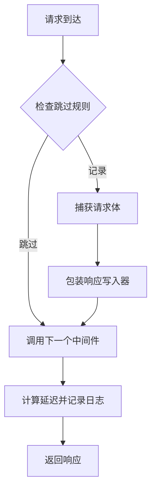
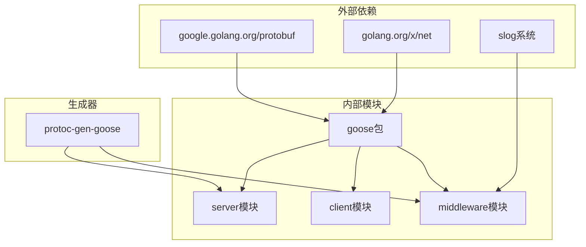
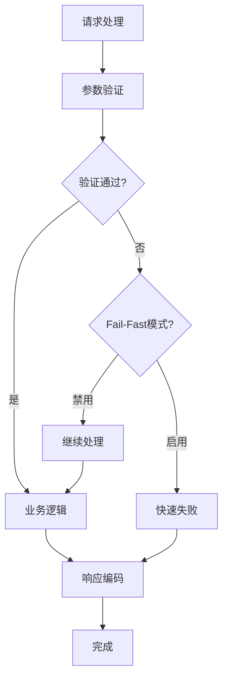

# 服务器初始化和配置

<cite>
**本文档引用的文件**
- [server/option.go](file://server/option.go)
- [server/middleware.go](file://server/middleware.go)
- [server/decoder.go](file://server/decoder.go)
- [server/encoder.go](file://server/encoder.go)
- [client/option.go](file://client/option.go)
- [common.go](file://common.go)
- [middleware/accesslog/middleware.go](file://middleware/accesslog/middleware.go)
- [middleware/cors/middleware.go](file://middleware/cors/middleware.go)
- [cmd/protoc-gen-goose/server/generator.go](file://cmd/protoc-gen-goose/server/generator.go)
- [example/body/body_goose.pb.go](file://example/body/body_goose.pb.go)
- [example/user/user_goose.pb.go](file://example/user/user_goose.pb.go)
</cite>

## 目录
1. [简介](#简介)
2. [项目结构](#项目结构)
3. [核心组件](#核心组件)
4. [架构概览](#架构概览)
5. [详细组件分析](#详细组件分析)
6. [依赖关系分析](#依赖关系分析)
7. [性能考虑](#性能考虑)
8. [故障排除指南](#故障排除指南)
9. [结论](#结论)

## 简介

本文档深入介绍了 Go HTTP 服务器的初始化过程和配置选项。该服务器基于 Protocol Buffers 和 protojson 编解码器，提供了灵活的中间件链配置、可定制的编解码器选择以及完善的配置验证机制。

服务器采用函数式选项模式（Functional Options Pattern），通过 Option 函数来配置各种运行时行为，包括中间件链、编解码器选项、错误处理策略等。系统支持 fail-fast 模式、验证回调机制，并提供了丰富的中间件生态系统。

## 项目结构

该项目采用模块化设计，主要包含以下核心目录：

**图表来源**
- [server/option.go:1-198](file://server/option.go#L1-L198)
- [server/middleware.go:1-85](file://server/middleware.go#L1-L85)
- [client/option.go:1-279](file://client/option.go#L1-L279)

**章节来源**
- [server/option.go:1-198](file://server/option.go#L1-L198)
- [server/middleware.go:1-85](file://server/middleware.go#L1-L85)
- [client/option.go:1-279](file://client/option.go#L1-L279)

## 核心组件

### 配置选项接口

服务器的核心配置通过 Options 接口定义，提供统一的配置访问方法：

**图表来源**
- [server/option.go:8-27](file://server/option.go#L8-L27)
- [server/option.go:29-37](file://server/option.go#L29-L37)

### 中间件链系统

中间件链采用递归调用机制，支持多层中间件组合：

**图表来源**
- [server/middleware.go:31-63](file://server/middleware.go#L31-L63)

**章节来源**
- [server/option.go:8-27](file://server/option.go#L8-L27)
- [server/option.go:29-102](file://server/option.go#L29-L102)
- [server/middleware.go:9-85](file://server/middleware.go#L9-L85)

## 架构概览

服务器采用分层架构设计，从上到下分为应用层、中间件层、编解码层和基础设施层：

**图表来源**
- [server/decoder.go:15-112](file://server/decoder.go#L15-L112)
- [server/encoder.go:14-98](file://server/encoder.go#L14-L98)
- [middleware/accesslog/middleware.go:104-200](file://middleware/accesslog/middleware.go#L104-L200)

## 详细组件分析

### 服务器初始化流程

服务器初始化采用延迟初始化模式，通过 NewOptions 函数创建配置实例：

**图表来源**
- [server/option.go:179-198](file://server/option.go#L179-L198)
- [server/option.go:42-54](file://server/option.go#L42-L54)

### 配置选项详解

#### 编解码器配置

服务器提供灵活的编解码器配置选项：

| 选项类型 | 默认值 | 作用 | 使用场景 |
|---------|--------|------|----------|
| UnmarshalOptions | protojson.UnmarshalOptions{} | 请求解码配置 | 自定义字段命名、忽略未知字段 |
| MarshalOptions | protojson.MarshalOptions{} | 响应编码配置 | 时间格式、枚举字符串化 |
| ErrorEncoder | goose.DefaultEncodeError | 错误响应编码 | 统一错误格式 |
| Middlewares | []Middleware{} | 中间件链 | 日志、认证、限流 |

#### 中间件配置

中间件采用链式调用模式，支持多层嵌套：

**图表来源**
- [server/middleware.go:9-17](file://server/middleware.go#L9-L17)
- [server/middleware.go:19-43](file://server/middleware.go#L19-L43)
- [server/middleware.go:65-85](file://server/middleware.go#L65-L85)

**章节来源**
- [server/option.go:104-177](file://server/option.go#L104-L177)
- [server/middleware.go:19-85](file://server/middleware.go#L19-L85)

### 编解码器实现

#### 请求解码器

请求解码器支持多种解码方式：

**图表来源**
- [server/decoder.go:15-61](file://server/decoder.go#L15-L61)
- [server/decoder.go:29-37](file://server/decoder.go#L29-L37)

#### 响应编码器

响应编码器提供多种输出格式支持：

| 编码器类型 | 输出格式 | 使用场景 |
|-----------|----------|----------|
| EncodeResponse | application/json | 标准Protobuf响应 |
| EncodeHttpBody | 动态Content-Type | 文件上传下载 |
| EncodeHttpResponse | 完整HTTP响应 | gRPC网关 |

**章节来源**
- [server/decoder.go:15-112](file://server/decoder.go#L15-L112)
- [server/encoder.go:14-98](file://server/encoder.go#L14-L98)

### 中间件生态系统

#### 访问日志中间件

访问日志中间件提供详细的请求追踪能力：

**图表来源**
- [middleware/accesslog/middleware.go:116-200](file://middleware/accesslog/middleware.go#L116-L200)

#### CORS中间件

CORS中间件支持灵活的跨域配置：

| 配置项 | 类型 | 默认值 | 描述 |
|-------|------|--------|------|
| AllowedOrigins | []string | [] | 允许的源地址 |
| AllowedMethods | []string | ["GET","POST","HEAD"] | 允许的HTTP方法 |
| AllowedHeaders | []string | ["Accept","Content-Type","X-Requested-With"] | 允许的头部 |
| AllowCredentials | bool | false | 是否允许携带凭证 |

**章节来源**
- [middleware/accesslog/middleware.go:104-200](file://middleware/accesslog/middleware.go#L104-L200)
- [middleware/cors/middleware.go:35-72](file://middleware/cors/middleware.go#L35-L72)

## 依赖关系分析

服务器组件之间的依赖关系呈现清晰的层次结构：

**图表来源**
- [go.mod:1-14](file://go.mod#L1-L14)
- [cmd/protoc-gen-goose/server/generator.go:1-40](file://cmd/protoc-gen-goose/server/generator.go#L1-L40)

**章节来源**
- [go.mod:1-14](file://go.mod#L1-L14)
- [cmd/protoc-gen-goose/server/generator.go:13-37](file://cmd/protoc-gen-goose/server/generator.go#L13-L37)

## 性能考虑

### 内存优化策略

服务器采用了多项内存优化技术：

1. **sync.Pool复用**：访问日志中间件使用 sync.Pool 复用 `[]slog.Attr` 切片
2. **响应写入器包装**：通过包装 ResponseWriter 捕获状态码和响应体
3. **中间件链优化**：避免不必要的中间件包装和转换

### 并发安全

所有配置选项都是线程安全的，中间件链在并发环境下表现稳定：

- 中间件链使用不可变数据结构
- 配置选项在创建后不被修改
- 上下文传递确保请求隔离

## 故障排除指南

### 常见配置错误

#### 编解码器配置问题

**问题**：JSON解析错误
**原因**：UnmarshalOptions配置不当
**解决方案**：
- 检查 `DiscardUnknown` 设置
- 验证 `UseProtoNames` 配置
- 确认时间格式兼容性

#### 中间件链问题

**问题**：中间件执行顺序错误
**原因**：中间件添加顺序不当
**解决方案**：
- 访问日志中间件应放在最外层
- 认证中间件应在业务逻辑之前
- 错误处理中间件应放在最后

#### 验证错误处理

服务器提供两种错误处理模式：

**图表来源**
- [common.go:14-50](file://common.go#L14-L50)

**章节来源**
- [common.go:5-51](file://common.go#L5-L51)

### 调试技巧

1. **启用详细日志**：使用 `WithPrintRequest` 和 `WithPrintResponse`
2. **检查中间件链**：确认中间件执行顺序
3. **验证编解码器**：测试自定义解码器实现
4. **监控性能指标**：关注延迟和内存使用情况

## 结论

该HTTP服务器提供了完整而灵活的配置体系，通过函数式选项模式实现了高度可定制的服务器行为。其核心优势包括：

1. **模块化设计**：清晰的分层架构便于维护和扩展
2. **灵活配置**：丰富的选项系统满足各种使用场景
3. **性能优化**：多项内存和并发优化技术
4. **中间件生态**：完整的中间件生态系统支持
5. **代码生成**：自动化代码生成减少重复工作

推荐的最佳实践包括：合理配置中间件链顺序、使用fail-fast模式提高错误反馈速度、自定义编解码器以满足特定需求，以及充分利用中间件生态系统来增强服务器功能。