# 编解码器系统

<cite>
**本文引用的文件**
- [client/decoder.go](file://client/decoder.go)
- [client/encoder.go](file://client/encoder.go)
- [server/decoder.go](file://server/decoder.go)
- [server/encoder.go](file://server/encoder.go)
- [common.go](file://common.go)
- [constant.go](file://constant.go)
- [type_string.go](file://type_string.go)
- [type_int.go](file://type_int.go)
- [type_uint.go](file://type_uint.go)
- [type_bool.go](file://type_bool.go)
- [type_float.go](file://type_float.go)
- [ws/stream.go](file://ws/stream.go)
- [ws/conn.go](file://ws/conn.go)
- [ws/util.go](file://ws/util.go)
- [example/websocket/server/main.go](file://example/websocket/server/main.go)
- [example/websocket/client/main.go](file://example/websocket/client/main.go)
- [example/websocket/service_impl.go](file://example/websocket/service_impl.go)
- [example/websocket/websocket_goose.pb.go](file://example/websocket/websocket_goose.pb.go)
- [example/websocket/websocket.proto](file://example/websocket/websocket.proto)
- [client/decoder_test.go](file://client/decoder_test.go)
- [client/encoder_test.go](file://client/encoder_test.go)
- [server/decoder_test.go](file://server/decoder_test.go)
- [server/encoder_test.go](file://server/encoder_test.go)
- [example/body/body_test.go](file://example/body/body_test.go)
</cite>

## 更新摘要
**所做更改**
- 完全重构了WebSocket流式系统章节，反映Codec抽象层的移除
- 更新了WebSocket序列化机制说明，现在直接使用protojson进行序列化
- 简化了WebSocket架构描述，突出直接序列化的优势
- 移除了对不存在的ws/client.go文件的引用
- 更新了示例文件路径引用，指向新的WebSocket实现
- 保留了HTTP服务器编解码器系统的完整内容不变

## 目录
1. [简介](#简介)
2. [项目结构](#项目结构)
3. [核心组件](#核心组件)
4. [架构总览](#架构总览)
5. [详细组件分析](#详细组件分析)
6. [WebSocket流式系统](#websocket流式系统)
7. [依赖关系分析](#依赖关系分析)
8. [性能考虑](#性能考虑)
9. [故障排除指南](#故障排除指南)
10. [结论](#结论)
11. [附录](#附录)

## 简介
本文件系统性阐述 HTTP 服务器的编解码器实现与使用方法，覆盖客户端与服务端两侧的编解码流程，包括：
- Decoder 接口设计与实现：如何从 HTTP 请求/响应中解码为 Protobuf 消息或通用数据结构
- Encoder 接口实现：如何将 Protobuf 消息编码为 HTTP 响应，以及内容类型处理
- 数据类型解码机制：URL 参数、查询参数、请求体、响应体的处理策略
- 自定义开发指南：扩展自定义类型支持、错误处理与性能优化
- 与 Protocol Buffers 的集成：消息编解码、包装类型（wrapper types）转换、类型映射规则
- WebSocket流式系统：基于protojson的直接序列化机制，移除了Codec抽象层

**更新** WebSocket流式系统已完全重构，移除了Codec抽象层，现在直接使用protojson进行序列化。这种简化的架构设计提高了性能和可靠性，同时降低了复杂性。

## 项目结构
该仓库围绕 HTTP 编解码器构建了清晰的分层结构：
- client 包：面向客户端的编解码器，负责将 Protobuf 消息编码为 HTTP 请求，或将 HTTP 响应解码为 Protobuf 消息
- server 包：面向服务端的编解码器，负责将 HTTP 请求解码为 Protobuf 消息，或将 Protobuf 消息编码为 HTTP 响应
- ws 包：WebSocket流式系统，使用protojson直接进行消息序列化，移除了Codec抽象层
- 类型转换工具：提供针对字符串、整数、无符号整数、布尔、浮点等基础类型的解析与包装/解包函数
- 常量与通用工具：统一 Content-Type、错误头键等常量，以及错误组合工具
- 示例与测试：通过示例展示不同场景下的编解码用法，测试验证行为正确性

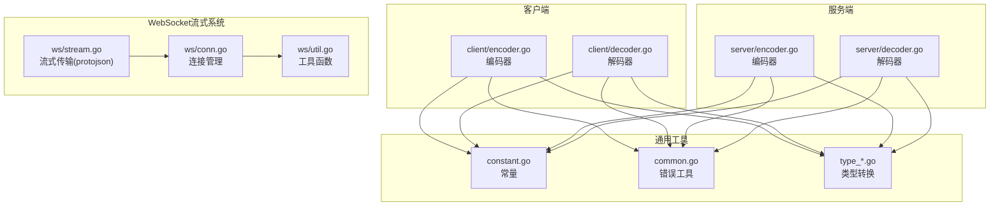

**图表来源**
- [client/encoder.go:1-81](file://client/encoder.go#L1-L81)
- [client/decoder.go:1-89](file://client/decoder.go#L1-L89)
- [server/encoder.go:1-98](file://server/encoder.go#L1-L98)
- [server/decoder.go:1-112](file://server/decoder.go#L1-L112)
- [ws/stream.go:1-526](file://ws/stream.go#L1-L526)
- [ws/conn.go:1-252](file://ws/conn.go#L1-L252)
- [ws/util.go:1-27](file://ws/util.go#L1-L27)
- [constant.go:1-16](file://constant.go#L1-L16)
- [common.go:1-51](file://common.go#L1-L51)
- [type_string.go:1-88](file://type_string.go#L1-L88)
- [type_int.go:1-305](file://type_int.go#L1-L305)
- [type_uint.go:1-305](file://type_uint.go#L1-L305)
- [type_bool.go:1-211](file://type_bool.go#L1-L211)
- [type_float.go:1-308](file://type_float.go#L1-L308)

**章节来源**
- [client/encoder.go:1-81](file://client/encoder.go#L1-L81)
- [client/decoder.go:1-89](file://client/decoder.go#L1-L89)
- [server/encoder.go:1-98](file://server/encoder.go#L1-L98)
- [server/decoder.go:1-112](file://server/decoder.go#L1-L112)
- [ws/stream.go:1-526](file://ws/stream.go#L1-L526)
- [ws/conn.go:1-252](file://ws/conn.go#L1-L252)
- [ws/util.go:1-27](file://ws/util.go#L1-L27)
- [constant.go:1-16](file://constant.go#L1-L16)
- [common.go:1-51](file://common.go#L1-L51)
- [type_string.go:1-88](file://type_string.go#L1-L88)
- [type_int.go:1-305](file://type_int.go#L1-L305)
- [type_uint.go:1-305](file://type_uint.go#L1-L305)
- [type_bool.go:1-211](file://type_bool.go#L1-L211)
- [type_float.go:1-308](file://type_float.go#L1-L308)

## 核心组件
- 客户端编解码器
  - 编码器：将 Protobuf 消息编码为 JSON 并写入请求体，设置 Content-Type；支持 HttpBody 和通用 HttpRequest 的编码
  - 解码器：将 HTTP 响应体解析为 Protobuf 消息；支持 HttpBody 和通用 HttpResponse 的解码
- 服务端编解码器
  - 解码器：将 HTTP 请求体解析为 Protobuf 消息；支持 HttpBody 和通用 HttpRequest 的解码；支持自定义解码接口
  - 编码器：将 Protobuf 消息编码为 JSON 写入响应体，设置 Content-Type；支持 HttpBody 和通用 HttpResponse 的编码
- WebSocket流式系统
  - **更新** 基于protojson的直接序列化机制，完全移除了Codec抽象层，不再支持自定义Codec
  - 提供ClientStream和ServerStream接口，支持双向流式通信
  - 包含生产级连接管理和重试机制
- 类型转换工具
  - 字符串、整数、无符号整数、布尔、浮点等基础类型的解析、格式化、包装与解包
- 常量与错误工具
  - 统一 Content-Type、错误头键等常量；提供错误组合与继续执行的工具函数

**章节来源**
- [client/encoder.go:15-81](file://client/encoder.go#L15-L81)
- [client/decoder.go:16-89](file://client/decoder.go#L16-L89)
- [server/encoder.go:14-98](file://server/encoder.go#L14-L98)
- [server/decoder.go:15-112](file://server/decoder.go#L15-L112)
- [ws/stream.go:67-133](file://ws/stream.go#L67-L133)
- [ws/stream.go:187-249](file://ws/stream.go#L187-L249)
- [ws/conn.go:12-252](file://ws/conn.go#L12-L252)
- [constant.go:3-16](file://constant.go#L3-L16)
- [common.go:5-51](file://common.go#L5-L51)
- [type_string.go:5-88](file://type_string.go#L5-L88)
- [type_int.go:11-305](file://type_int.go#L11-L305)
- [type_uint.go:11-305](file://type_uint.go#L11-L305)
- [type_bool.go:10-211](file://type_bool.go#L10-L211)
- [type_float.go:11-308](file://type_float.go#L11-L308)

## 架构总览
编解码器在客户端与服务端之间形成对称的双向通道，统一通过 Protobuf 消息进行数据交换，并在必要时与标准 HTTP 结构（如 google.api.HttpBody、google.rpc.HttpRequest/HttpResponse）互操作。**更新** WebSocket流式系统采用简化的protojson直接序列化机制，完全移除了复杂的Codec抽象层，提供了更简洁高效的架构。

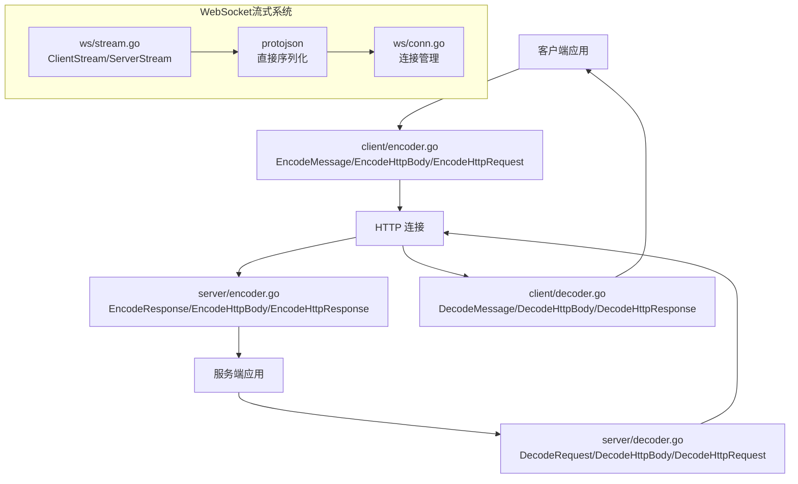

**图表来源**
- [client/encoder.go:15-81](file://client/encoder.go#L15-L81)
- [client/decoder.go:16-89](file://client/decoder.go#L16-L89)
- [server/encoder.go:14-98](file://server/encoder.go#L14-L98)
- [server/decoder.go:15-112](file://server/decoder.go#L15-L112)
- [ws/stream.go:1-526](file://ws/stream.go#L1-L526)
- [ws/conn.go:1-252](file://ws/conn.go#L1-L252)

## 详细组件分析

### 客户端编解码器

#### 编码器（client/encoder.go）
- EncodeMessage：将 Protobuf 消息序列化为 JSON，写入请求体，设置 Content-Type 为 application/json
- EncodeHttpBody：直接将 HttpBody.Data 写入请求体，Content-Type 来自 HttpBody.ContentType
- EncodeHttpRequest：将 HttpRequest.Body 写入请求体，并将所有 Headers 添加到 http.Header

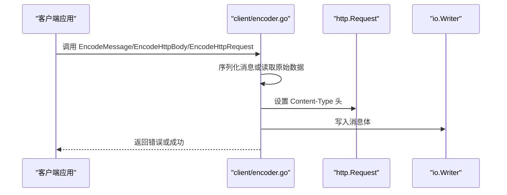

**图表来源**
- [client/encoder.go:15-81](file://client/encoder.go#L15-L81)

**章节来源**
- [client/encoder.go:15-81](file://client/encoder.go#L15-L81)

#### 解码器（client/decoder.go）
- DecodeMessage：读取响应体，使用 protojson.UnmarshalOptions 解析为 Protobuf 消息
- DecodeHttpBody：提取 Content-Type 头，读取原始响应体填充 HttpBody
- DecodeHttpResponse：提取状态码、原因短语、头集合与响应体，封装为 google.rpc.HttpResponse

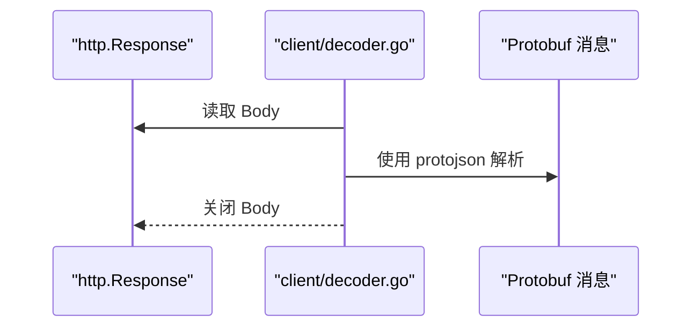

**图表来源**
- [client/decoder.go:16-89](file://client/decoder.go#L16-L89)

**章节来源**
- [client/decoder.go:16-89](file://client/decoder.go#L16-L89)

### 服务端编解码器

#### 解码器（server/decoder.go）
- CustomDecodeRequest：检查目标消息是否实现了自定义解码接口，若实现则优先调用
- DecodeRequest：读取请求体并使用 protojson.UnmarshalOptions 解析为 Protobuf 消息
- DecodeHttpBody：读取请求体并填充 HttpBody.Data 与 Content-Type
- DecodeHttpRequest：读取请求体，填充 Method、URI、Headers、Body

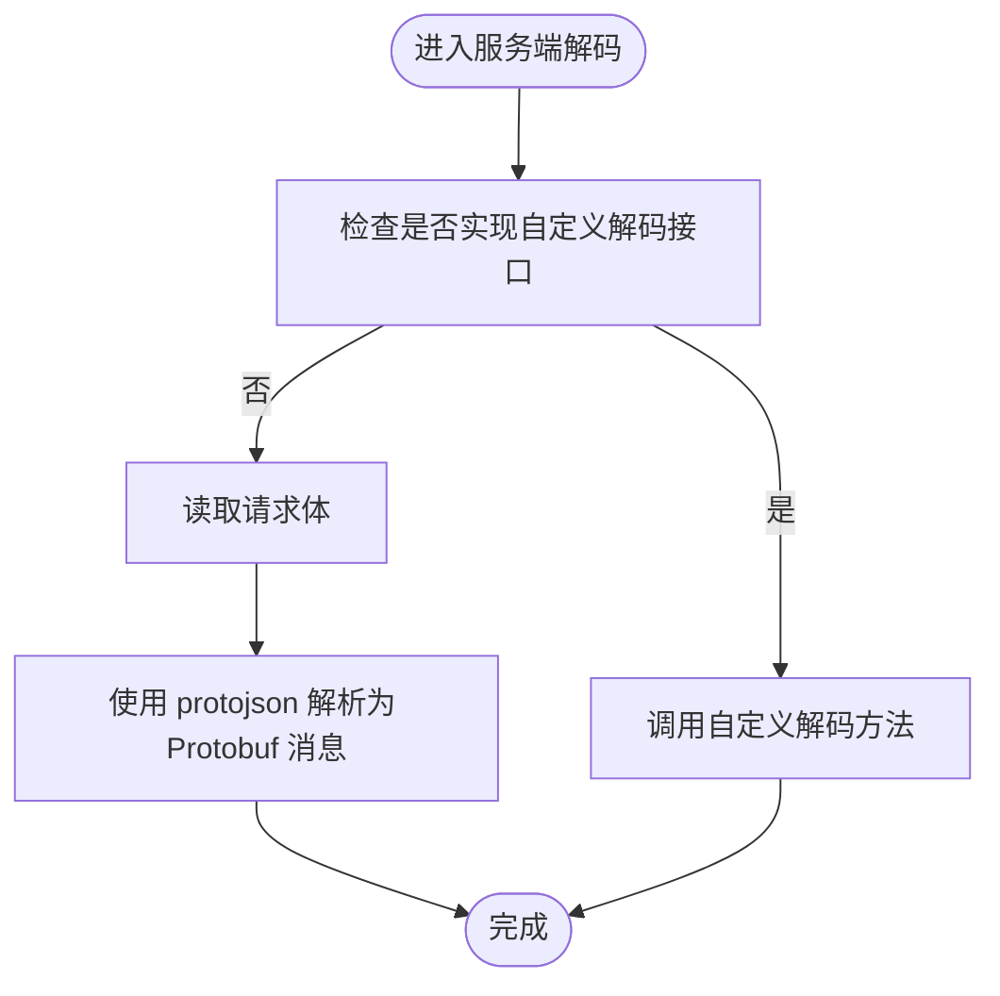

**图表来源**
- [server/decoder.go:15-112](file://server/decoder.go#L15-L112)

**章节来源**
- [server/decoder.go:15-112](file://server/decoder.go#L15-L112)

#### 编码器（server/encoder.go）
- EncodeResponse：设置 Content-Type 为 application/json，状态码为 200，写入 JSON 响应体
- EncodeHttpBody：设置 Content-Type 来自 HttpBody，状态码为 200，写入原始字节
- EncodeHttpResponse：复制 Headers、状态码与 Body 到 http.ResponseWriter

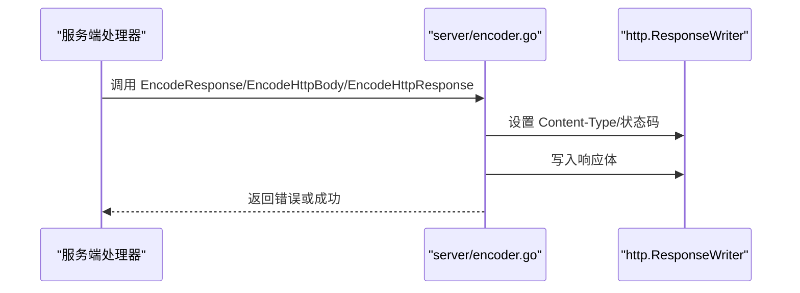

**图表来源**
- [server/encoder.go:14-98](file://server/encoder.go#L14-L98)

**章节来源**
- [server/encoder.go:14-98](file://server/encoder.go#L14-L98)

### 数据类型解码机制

#### URL/查询参数解码
- 整数、无符号整数、布尔、浮点、字符串均提供从 url.Values 中解析的方法族，支持：
  - 单值解析：GetXXX
  - 指针返回：GetXXXPtr
  - 切片解析：GetXXXSlice
  - 包装类型：GetXXXValue、GetXXXValueSlice（wrapperspb）
  - 包装/解包：WrapXXXSlice、UnwrapXXXSlice
- 解析默认行为：
  - 键不存在时，数值类型返回零值，布尔返回 false，字符串返回空，切片返回 nil
  - 解析失败返回具体错误

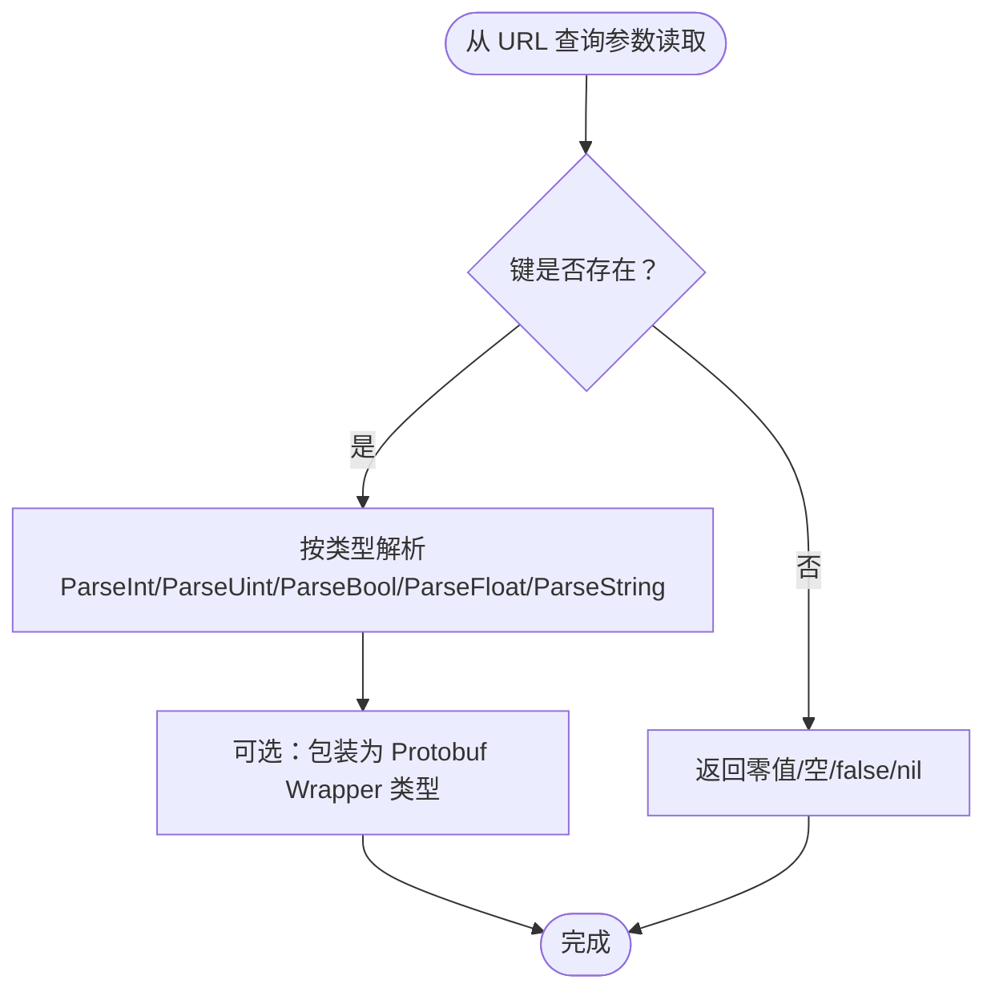

**图表来源**
- [type_int.go:94-152](file://type_int.go#L94-L152)
- [type_uint.go:94-152](file://type_uint.go#L94-L152)
- [type_bool.go:82-130](file://type_bool.go#L82-L130)
- [type_float.go:95-153](file://type_float.go#L95-L153)
- [type_string.go:5-24](file://type_string.go#L5-L24)

**章节来源**
- [type_int.go:94-152](file://type_int.go#L94-L152)
- [type_uint.go:94-152](file://type_uint.go#L94-L152)
- [type_bool.go:82-130](file://type_bool.go#L82-L130)
- [type_float.go:95-153](file://type_float.go#L95-L153)
- [type_string.go:5-24](file://type_string.go#L5-L24)

#### 请求体/响应体解码
- Protobuf JSON：通过 protojson.UnmarshalOptions/MarshalOptions 实现
- 原始字节：HttpBody.Data 直接读取/写入
- 通用 HTTP 结构：google.api.HttpBody、google.rpc.HttpRequest/HttpResponse 作为桥接载体

**章节来源**
- [client/decoder.go:16-89](file://client/decoder.go#L16-L89)
- [client/encoder.go:15-81](file://client/encoder.go#L15-L81)
- [server/decoder.go:15-112](file://server/decoder.go#L15-L112)
- [server/encoder.go:14-98](file://server/encoder.go#L14-L98)

### 内容类型与响应格式化
- Content-Type 统一键名与 JSON 默认值由常量提供
- 编码器在写入响应前设置 Content-Type，并在必要时设置状态码
- 对于 HttpBody，Content-Type 来自消息字段；对于通用 HttpResponse，由消息中的 Headers 与 Status 字段决定

**章节来源**
- [constant.go:3-16](file://constant.go#L3-L16)
- [client/encoder.go:36](file://client/encoder.go#L36)
- [server/encoder.go:29](file://server/encoder.go#L29)
- [server/encoder.go:82-97](file://server/encoder.go#L82-L97)

### 自定义开发指南

#### 自定义类型支持
- 在服务端，若目标消息实现了自定义解码接口，则优先使用该接口进行解码，从而支持非标准或复杂的数据绑定逻辑
- 在客户端，可通过自定义消息类型配合 Encode/Decode 函数实现特定协议

**章节来源**
- [server/decoder.go:25-37](file://server/decoder.go#L25-L37)

#### 错误处理
- 错误组合与继续执行：提供 BreakOnError 与 ContinueOnError 工具，用于在链式调用中优雅地合并与传播错误
- 响应体关闭：客户端解码器在读取后确保关闭响应体，避免资源泄漏

**章节来源**
- [common.go:5-51](file://common.go#L5-L51)
- [client/decoder.go:36](file://client/decoder.go#L36)
- [client/decoder.go:87](file://client/decoder.go#L87)

#### 性能优化
- 避免重复解析：优先使用已有的类型转换函数，减少重复的字符串/数字转换
- 预分配切片：类型转换工具预分配结果切片容量，降低内存重分配成本
- 原始字节传输：对于二进制大对象，优先使用 HttpBody.Data 直传，避免额外编码开销

**章节来源**
- [type_int.go:37-46](file://type_int.go#L37-L46)
- [type_uint.go:37-46](file://type_uint.go#L37-L46)
- [type_bool.go:33-42](file://type_bool.go#L33-L42)
- [type_float.go:40-49](file://type_float.go#L40-L49)

### 与 Protocol Buffers 的集成

#### 类型转换规则
- 包装类型：将基础类型包装为 wrapperspb.XXXValue，便于在 Protobuf 字段中表示可空或标量值
- 解包类型：从 wrapperspb.XXXValue 提取原始值，用于业务逻辑处理
- 数组转换：提供 WrapXXXSlice 与 UnwrapXXXSlice，支持批量转换

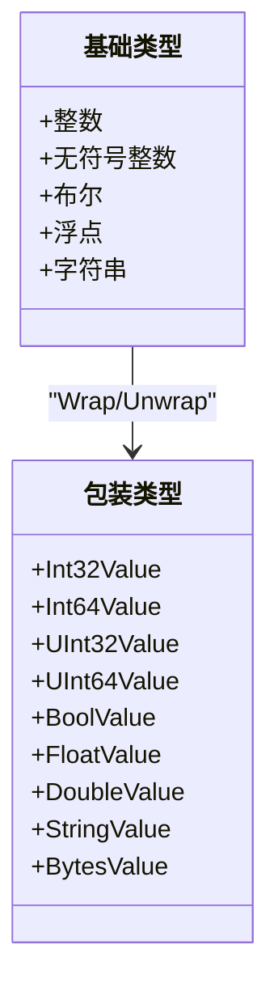

**图表来源**
- [type_int.go:218-305](file://type_int.go#L218-L305)
- [type_uint.go:218-305](file://type_uint.go#L218-L305)
- [type_bool.go:164-211](file://type_bool.go#L164-L211)
- [type_float.go:219-308](file://type_float.go#L219-L308)
- [type_string.go:26-88](file://type_string.go#L26-L88)

#### 消息编解码
- Protobuf JSON：通过 protojson.MarshalOptions/UnmarshalOptions 控制序列化/反序列化细节
- 通用结构：google.api.HttpBody 与 google.rpc.HttpRequest/HttpResponse 作为跨语言/跨协议的桥梁

**章节来源**
- [client/encoder.go:28-38](file://client/encoder.go#L28-L38)
- [client/decoder.go:28-37](file://client/decoder.go#L28-L37)
- [server/encoder.go:27-44](file://server/encoder.go#L27-L44)
- [server/decoder.go:52-61](file://server/decoder.go#L52-61)

## WebSocket流式系统

### 架构设计
**更新** WebSocket流式系统经过重大重构，完全移除了Codec抽象层，采用简化的protojson直接序列化机制。新架构更加简洁高效，直接利用protojson库进行消息序列化，提供了完整的流式通信能力，支持客户端单向流、服务器单向流和双向流模式。

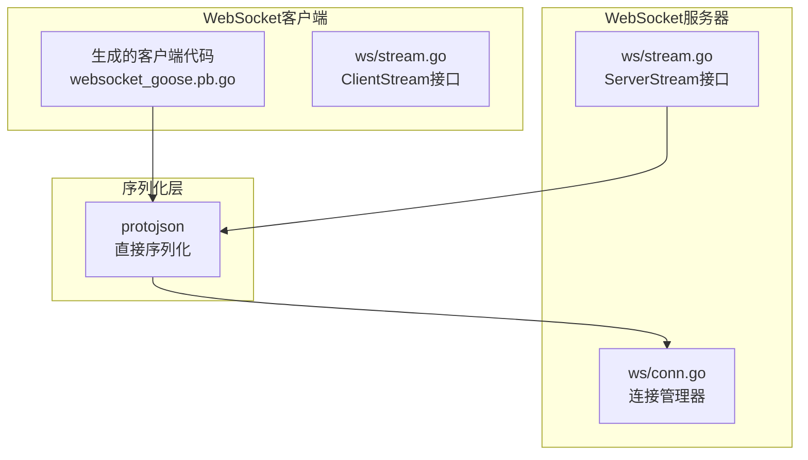

**图表来源**
- [ws/stream.go:1-526](file://ws/stream.go#L1-L526)
- [ws/conn.go:1-252](file://ws/conn.go#L1-L252)
- [example/websocket/websocket_goose.pb.go:1-293](file://example/websocket/websocket_goose.pb.go#L1-L293)

### 核心组件

#### 连接管理（ws/conn.go）
- ConnConfig：配置连接参数，包括最大读取字节数、写入缓冲区大小、Ping间隔、写入超时
- Conn：生产级WebSocket连接封装，提供异步写入、心跳保活、优雅关闭等功能
- 支持背压处理和消息队列管理

#### 流式接口（ws/stream.go）
- ClientStream：客户端流式接口，支持SendMsg和RecvMsg方法
- ServerStream：服务端流式接口，支持SendMsg和RecvMsg方法
- GenericClientStream/GenericServerStream：泛型流式接口，提供类型安全的流式通信

#### 客户端实现（websocket_goose.pb.go）
- streamServiceClient：生成的WebSocket客户端，支持自动连接管理和消息序列化
- 支持三种流式模式：客户端单向流、服务器单向流、双向流
- 使用protojson.MarshalOptions和protojson.UnmarshalOptions进行消息序列化

### 序列化机制
**更新** WebSocket流式系统现在直接使用protojson进行序列化，完全移除了Codec抽象层。

- 客户端和服务端都使用protojson.MarshalOptions和protojson.UnmarshalOptions进行消息序列化
- 通过NewClientStream和NewServerStream构造函数传入序列化选项
- 简化了架构设计，提高了性能和可靠性
- 不再支持自定义Codec实现，所有序列化都通过统一的protojson处理

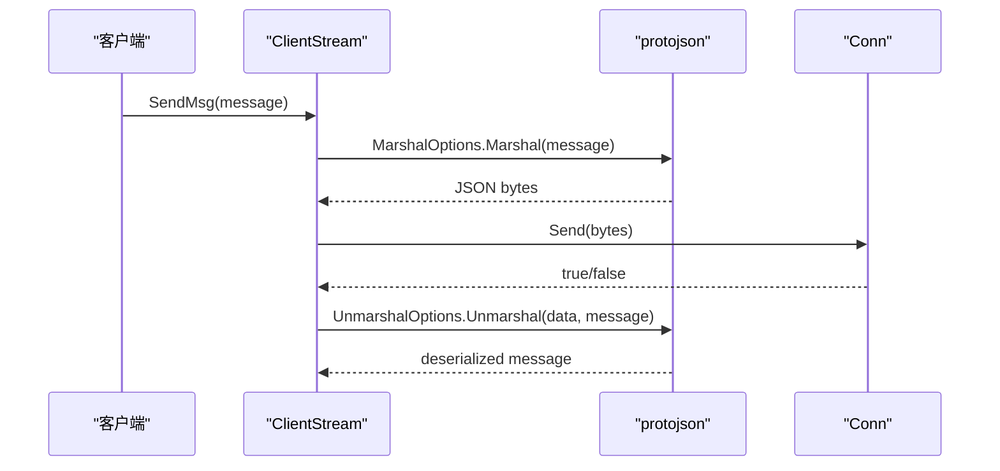

**图表来源**
- [ws/stream.go:109-139](file://ws/stream.go#L109-L139)
- [ws/stream.go:223-255](file://ws/stream.go#L223-L255)

**章节来源**
- [ws/conn.go:12-252](file://ws/conn.go#L12-L252)
- [ws/stream.go:67-133](file://ws/stream.go#L67-L133)
- [ws/stream.go:187-249](file://ws/stream.go#L187-L249)
- [example/websocket/websocket_goose.pb.go:188-268](file://example/websocket/websocket_goose.pb.go#L188-L268)
- [example/websocket/server/main.go:57-168](file://example/websocket/server/main.go#L57-L168)
- [example/websocket/client/main.go:19-207](file://example/websocket/client/main.go#L19-207)
- [example/websocket/service_impl.go:1-126](file://example/websocket/service_impl.go#L1-L126)

## 依赖关系分析

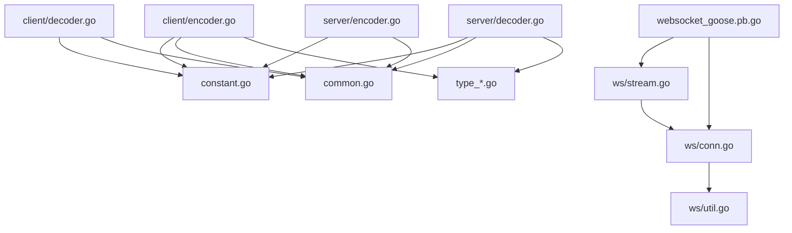

**图表来源**
- [client/encoder.go:1-81](file://client/encoder.go#L1-L81)
- [client/decoder.go:1-89](file://client/decoder.go#L1-L89)
- [server/encoder.go:1-98](file://server/encoder.go#L1-L98)
- [server/decoder.go:1-112](file://server/decoder.go#L1-L112)
- [ws/stream.go:1-526](file://ws/stream.go#L1-L526)
- [ws/conn.go:1-252](file://ws/conn.go#L1-L252)
- [ws/util.go:1-27](file://ws/util.go#L1-L27)
- [example/websocket/websocket_goose.pb.go:1-293](file://example/websocket/websocket_goose.pb.go#L1-L293)
- [constant.go:1-16](file://constant.go#L1-L16)
- [common.go:1-51](file://common.go#L1-L51)
- [type_string.go:1-88](file://type_string.go#L1-L88)
- [type_int.go:1-305](file://type_int.go#L1-L305)
- [type_uint.go:1-305](file://type_uint.go#L1-L305)
- [type_bool.go:1-211](file://type_bool.go#L1-L211)
- [type_float.go:1-308](file://type_float.go#L1-L308)

**章节来源**
- [client/encoder.go:1-81](file://client/encoder.go#L1-L81)
- [client/decoder.go:1-89](file://client/decoder.go#L1-L89)
- [server/encoder.go:1-98](file://server/encoder.go#L1-L98)
- [server/decoder.go:1-112](file://server/decoder.go#L1-L112)
- [ws/stream.go:1-526](file://ws/stream.go#L1-L526)
- [ws/conn.go:1-252](file://ws/conn.go#L1-L252)
- [ws/util.go:1-27](file://ws/util.go#L1-L27)
- [example/websocket/websocket_goose.pb.go:1-293](file://example/websocket/websocket_goose.pb.go#L1-L293)
- [constant.go:1-16](file://constant.go#L1-L16)
- [common.go:1-51](file://common.go#L1-L51)
- [type_string.go:1-88](file://type_string.go#L1-L88)
- [type_int.go:1-305](file://type_int.go#L1-L305)
- [type_uint.go:1-305](file://type_uint.go#L1-L305)
- [type_bool.go:1-211](file://type_bool.go#L1-L211)
- [type_float.go:1-308](file://type_float.go#L1-L308)

## 性能考虑
- 尽量复用 io.ReadCloser 的读取与关闭逻辑，避免重复拷贝
- 对于大对象，优先使用 HttpBody.Data 直传，减少不必要的 JSON 编解码
- 合理使用类型转换工具的预分配能力，降低切片扩容带来的性能损耗
- 在高并发场景下，注意 Content-Type 与状态码设置的原子性，避免竞态
- WebSocket连接使用异步写入和缓冲队列，提高吞吐量
- **更新** 移除Codec抽象层后，WebSocket序列化直接使用protojson，减少了中间层开销，提高了性能和稳定性
- **更新** 新的WebSocket架构避免了额外的抽象层调用，提升了整体序列化效率

## 故障排除指南
- 编码/解码错误
  - 检查 protojson.MarshalOptions/UnmarshalOptions 的配置是否正确
  - 确认 Content-Type 是否与实际数据一致
- 响应体读取失败
  - 客户端解码器会在读取失败时返回错误并关闭响应体，需检查底层网络与上游服务
- 自定义解码未生效
  - 确认目标消息是否实现了自定义解码接口，且接口签名与约定一致
- WebSocket连接问题
  - 检查连接配置参数，包括最大读取字节数、写入超时等
  - 确认protojson序列化选项配置正确
  - 查看日志输出，定位具体的连接或序列化错误
  - **更新** 由于移除了Codec抽象层，无需检查自定义Codec实现相关问题
  - **更新** 检查新的WebSocket客户端配置和重试机制设置

**章节来源**
- [client/decoder_test.go:19-64](file://client/decoder_test.go#L19-L64)
- [client/decoder_test.go:66-106](file://client/decoder_test.go#L66-L106)
- [client/decoder_test.go:108-167](file://client/decoder_test.go#L108-L167)
- [client/encoder_test.go:17-59](file://client/encoder_test.go#L17-L59)
- [client/encoder_test.go:61-97](file://client/encoder_test.go#L61-L97)
- [client/encoder_test.go:99-142](file://client/encoder_test.go#L99-L142)
- [server/decoder_test.go:39-53](file://server/decoder_test.go#L39-L53)
- [server/decoder_test.go:55-72](file://server/decoder_test.go#L55-L72)
- [server/decoder_test.go:74-107](file://server/decoder_test.go#L74-L107)
- [server/encoder_test.go:31-50](file://server/encoder_test.go#L31-L50)
- [server/encoder_test.go:52-74](file://server/encoder_test.go#L52-L74)
- [server/encoder_test.go:76-102](file://server/encoder_test.go#L76-L102)

## 结论
本编解码器系统以 Protobuf 为核心，结合标准 HTTP 结构与类型转换工具，提供了完整、可扩展的客户端/服务端编解码能力。**更新** WebSocket流式系统经过重大重构，采用简化的protojson直接序列化机制，完全移除了复杂的Codec抽象层，显著提高了性能和可靠性。新的架构更加简洁明了，减少了中间层的复杂性，同时保持了良好的性能和功能完整性。通过统一的常量与错误处理工具，保证了跨模块的一致性与可靠性；通过包装/解包与原生字节传输，兼顾了灵活性与性能。建议在实际工程中遵循本文档的使用规范与最佳实践，以获得稳定高效的运行效果。

## 附录

### 使用示例参考
- 示例展示了多种请求体模式（命名体、星号体、HttpBody、通用 HttpRequest）的服务端处理与客户端调用
- **更新** WebSocket示例展示了完整的流式通信实现，包括客户端、服务端和双向流模式，使用protojson直接序列化，位于新的示例文件路径

**章节来源**
- [example/body/body_test.go:18-54](file://example/body/body_test.go#L18-L54)
- [example/body/body_test.go:70-97](file://example/body/body_test.go#L70-L97)
- [example/body/body_test.go:113-146](file://example/body/body_test.go#L113-L146)
- [example/body/body_test.go:148-163](file://example/body/body_test.go#L148-L163)
- [example/websocket/server/main.go:57-168](file://example/websocket/server/main.go#L57-L168)
- [example/websocket/client/main.go:19-207](file://example/websocket/client/main.go#L19-207)
- [example/websocket/service_impl.go:1-126](file://example/websocket/service_impl.go#L1-L126)
- [example/websocket/websocket_goose.pb.go:188-268](file://example/websocket/websocket_goose.pb.go#L188-L268)