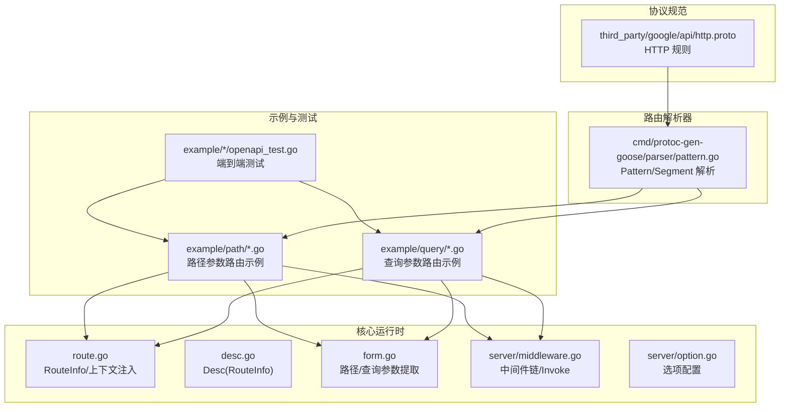
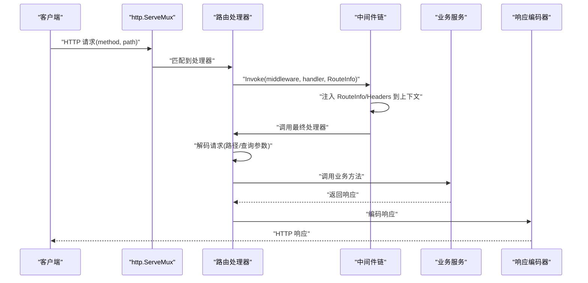
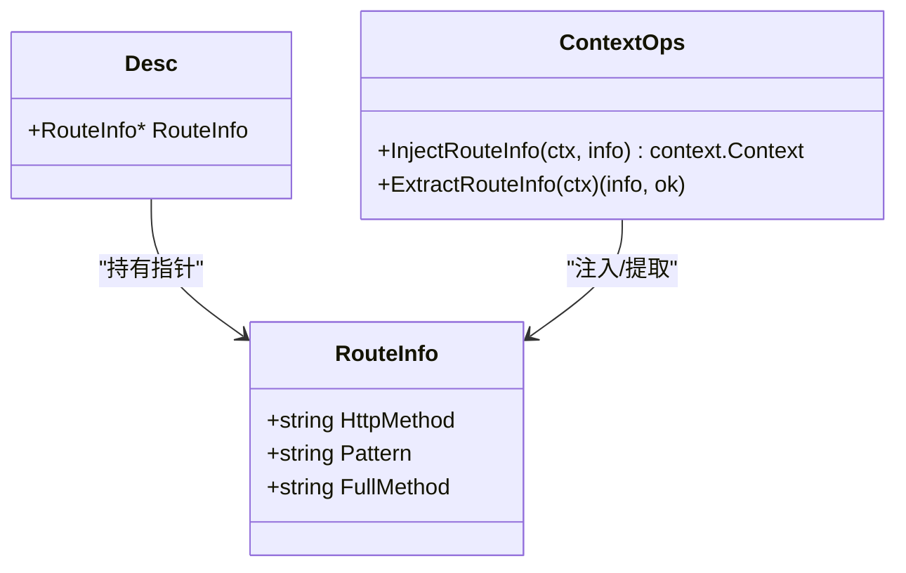
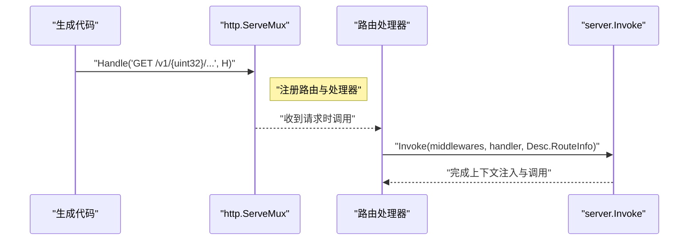
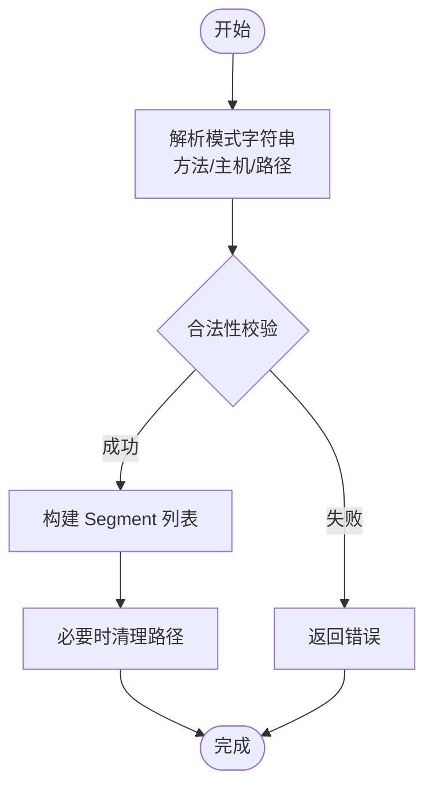
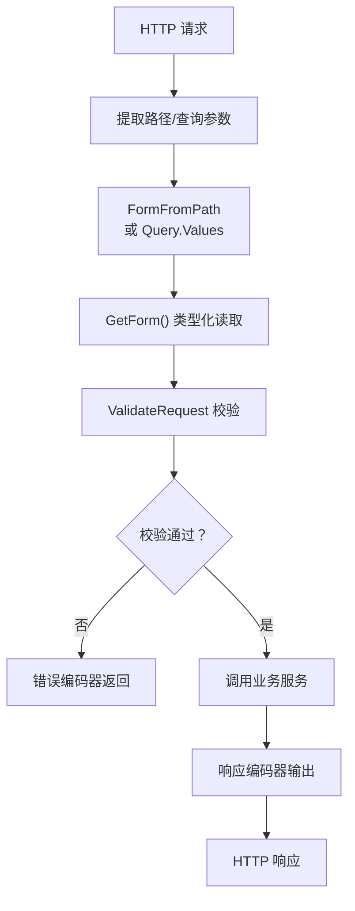
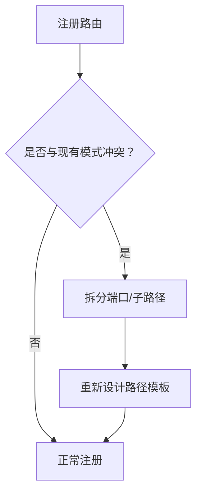
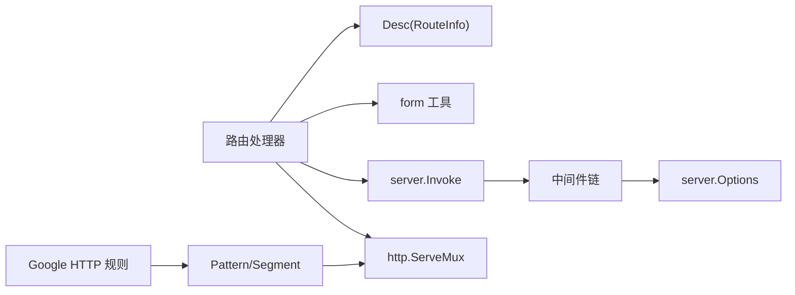

# 路由管理和处理

<cite>
**本文引用的文件**
- [route.go](file://route.go)
- [desc.go](file://desc.go)
- [pattern.go](file://cmd/protoc-gen-goose/parser/pattern.go)
- [middleware.go](file://server/middleware.go)
- [option.go](file://server/option.go)
- [form.go](file://form.go)
- [path_goose.pb.go](file://example/path/path_goose.pb.go)
- [query_goose.pb.go](file://example/query/query_goose.pb.go)
- [openapi_test.go（路径）](file://example/path/openapi_test.go)
- [openapi_test.go（查询）](file://example/query/openapi_test.go)
- [http.proto](file://third_party/google/api/http.proto)
</cite>

## 目录
1. [引言](#引言)
2. [项目结构](#项目结构)
3. [核心组件](#核心组件)
4. [架构总览](#架构总览)
5. [详细组件分析](#详细组件分析)
6. [依赖分析](#依赖分析)
7. [性能考虑](#性能考虑)
8. [故障排查指南](#故障排查指南)
9. [结论](#结论)
10. [附录：最佳实践与规范](#附录最佳实践与规范)

## 引言
本文件系统性阐述该 HTTP 服务器的路由管理系统，重点围绕 RouteInfo 结构体、路由描述符、HTTP 方法与路径模式的匹配机制展开；覆盖路由注册流程、动态路由处理、路由上下文传递；并提供路径参数与查询参数解析、HTTP 方法映射的最佳实践，以及路由冲突检测与解决方案。

## 项目结构
该仓库采用“按功能域分层”的组织方式：
- 核心运行时与工具：route.go、desc.go、form.go、server/middleware.go、server/option.go
- 路由模式解析器：cmd/protoc-gen-goose/parser/pattern.go
- 示例路由与集成测试：example/path/*.go、example/query/*.go、example/*/openapi_test.go
- 协议与规范：third_party/google/api/http.proto



**图表来源**
- [route.go:1-27](file://route.go#L1-L27)
- [desc.go:1-6](file://desc.go#L1-L6)
- [form.go:1-80](file://form.go#L1-L80)
- [middleware.go:1-85](file://server/middleware.go#L1-L85)
- [option.go:1-198](file://server/option.go#L1-L198)
- [pattern.go:1-244](file://cmd/protoc-gen-goose/parser/pattern.go#L1-L244)
- [path_goose.pb.go:655-750](file://example/path/path_goose.pb.go#L655-L750)
- [query_goose.pb.go:1-200](file://example/query/query_goose.pb.go#L1-L200)
- [openapi_test.go（路径）:374-466](file://example/path/openapi_test.go#L374-L466)
- [openapi_test.go（查询）:365-394](file://example/query/openapi_test.go#L365-L394)
- [http.proto:214-243](file://third_party/google/api/http/proto#L214-L243)

**章节来源**
- [route.go:1-27](file://route.go#L1-L27)
- [desc.go:1-6](file://desc.go#L1-L6)
- [pattern.go:1-244](file://cmd/protoc-gen-goose/parser/pattern.go#L1-L244)
- [middleware.go:1-85](file://server/middleware.go#L1-L85)
- [option.go:1-198](file://server/option.go#L1-L198)
- [form.go:1-80](file://form.go#L1-L80)
- [path_goose.pb.go:655-750](file://example/path/path_goose.pb.go#L655-L750)
- [query_goose.pb.go:1-200](file://example/query/query_goose.pb.go#L1-L200)
- [openapi_test.go（路径）:374-466](file://example/path/openapi_test.go#L374-L466)
- [openapi_test.go（查询）:365-394](file://example/query/openapi_test.go#L365-L394)
- [http.proto:214-243](file://third_party/google/api/http.proto#L214-L243)

## 核心组件
- RouteInfo：承载一次路由的关键元信息，包含 HTTP 方法、路径模式、RPC 全名。
- Desc：封装服务端路由描述符，持有 RouteInfo 指针，用于在生成的路由处理器中注入上下文。
- Pattern/Segment：解析路由模板字符串，支持字面量、单段通配、多段通配、尾部占位符等。
- 中间件链与 Invoke：将中间件与最终处理器组合，统一注入 RouteInfo、Header 等上下文。
- 表单工具：FormFromPath/FormFromMap/GetForm 等，提供路径与查询参数的类型化提取。

**章节来源**
- [route.go:7-15](file://route.go#L7-L15)
- [desc.go:3-5](file://desc.go#L3-L5)
- [pattern.go:14-62](file://cmd/protoc-gen-goose/parser/pattern.go#L14-L62)
- [middleware.go:9-84](file://server/middleware.go#L9-L84)
- [form.go:8-79](file://form.go#L8-L79)

## 架构总览
下图展示从请求进入、路由匹配、参数解析、业务处理到响应返回的完整链路。



**图表来源**
- [middleware.go:65-84](file://server/middleware.go#L65-L84)
- [path_goose.pb.go:692-715](file://example/path/path_goose.pb.go#L692-L715)
- [query_goose.pb.go:58-81](file://example/query/query_goose.pb.go#L58-L81)

## 详细组件分析

### RouteInfo 与上下文传递
- 结构体字段
  - HttpMethod：HTTP 方法（如 GET/POST）
  - Pattern：路径模式（如 /v1/{id}）
  - FullMethod：RPC 全名（如 /package.service/method）
- 上下文注入与提取
  - InjectRouteInfo：将 RouteInfo 注入到请求上下文
  - ExtractRouteInfo：从上下文取出 RouteInfo，供中间件或业务使用
- 在处理器中的使用
  - 处理器通过 server.Invoke 将 RouteInfo 注入上下文后执行业务逻辑



**图表来源**
- [route.go:7-26](file://route.go#L7-L26)
- [desc.go:3-5](file://desc.go#L3-L5)

**章节来源**
- [route.go:7-26](file://route.go#L7-L26)
- [desc.go:3-5](file://desc.go#L3-L5)
- [middleware.go:76-84](file://server/middleware.go#L76-L84)

### 路由描述符与路由注册
- 描述符
  - Desc.RouteInfo 指向 RouteInfo，作为路由处理器的静态描述符，贯穿中间件链与错误编码。
- 注册方式
  - 使用 http.ServeMux.Handle("METHOD PATH", handler)，例如：
    - "GET /v1/{uint32}/{fixed32}/..."
    - "GET /v1/bool"
  - 生成代码会构造对应的 handler，并在内部调用 server.Invoke 注入 RouteInfo 后执行。



**图表来源**
- [path_goose.pb.go:659-679](file://example/path/path_goose.pb.go#L659-L679)
- [query_goose.pb.go:25-46](file://example/query/query_goose.pb.go#L25-L46)
- [middleware.go:65-84](file://server/middleware.go#L65-L84)

**章节来源**
- [path_goose.pb.go:659-679](file://example/path/path_goose.pb.go#L659-L679)
- [query_goose.pb.go:25-46](file://example/query/query_goose.pb.go#L25-L46)
- [middleware.go:65-84](file://server/middleware.go#L65-L84)

### HTTP 方法与路径模式匹配机制
- 方法匹配
  - ServeMux 严格按方法匹配；生成代码中显式指定方法（如 GET/POST），确保与 OpenAPI 规则一致。
- 路径模式
  - 支持字面量、单段通配（{name}）、多段通配（{name...}）、尾部占位符（/{$}）。
  - 解析器对非法模式进行校验（如非法方法、重复通配名、非末尾通配等）。
- 清理与规范化
  - 非 CONNECT 方法要求路径已清理（cleanPath），避免歧义匹配。



**图表来源**
- [pattern.go:64-178](file://cmd/protoc-gen-goose/parser/pattern.go#L64-L178)
- [pattern.go:201-221](file://cmd/protoc-gen-goose/parser/pattern.go#L201-L221)

**章节来源**
- [pattern.go:64-178](file://cmd/protoc-gen-goose/parser/pattern.go#L64-L178)
- [pattern.go:201-221](file://cmd/protoc-gen-goose/parser/pattern.go#L201-L221)

### 动态路由处理与参数解析
- 路径参数
  - 使用 r.PathValue(key) 提取，再通过 FormFromPath 统一转为 url.Values，便于后续 GetForm 类型化读取。
- 查询参数
  - 使用 request.URL.Query() 获取，直接传入 GetForm 进行类型转换。
- 类型化读取
  - GetForm 以函数式风格串联多个字段读取，遇到错误立即中断，保证一致性。



**图表来源**
- [form.go:36-79](file://form.go#L36-L79)
- [path_goose.pb.go:721-741](file://example/path/path_goose.pb.go#L721-L741)
- [query_goose.pb.go:87-107](file://example/query/query_goose.pb.go#L87-L107)

**章节来源**
- [form.go:18-79](file://form.go#L18-L79)
- [path_goose.pb.go:721-741](file://example/path/path_goose.pb.go#L721-L741)
- [query_goose.pb.go:87-107](file://example/query/query_goose.pb.go#L87-L107)

### 中间件链与上下文传递
- 中间件链
  - Chain 将多个中间件组合为单一 Middleware，按序执行。
  - Invoke 在执行前将 RouteInfo、Header 注入上下文，随后调用最终处理器。
- 选项配置
  - Options 提供解码/编码选项、错误编码器、中间件列表、验证回调、FailFast 等配置项。

```mermaid
sequenceDiagram
participant MW as "中间件链"
participant INV as "server.Invoke"
participant H as "处理器"
participant OPT as "Options"
OPT-->>MW : "Middlewares()"
INV->>INV : "注入 RouteInfo/Header"
INV->>MW : "执行中间件"
MW->>H : "调用最终处理器"
H-->>MW : "返回结果"
MW-->>INV : "完成"
```

**图表来源**
- [middleware.go:19-84](file://server/middleware.go#L19-L84)
- [option.go:8-102](file://server/option.go#L8-L102)

**章节来源**
- [middleware.go:19-84](file://server/middleware.go#L19-L84)
- [option.go:8-102](file://server/option.go#L8-L102)

### 路由冲突检测与解决方案
- 冲突场景
  - 示例测试显示，当路径模板存在重叠（如 /v1/{int32}/... 与 /v1/{int64}/...）时，Go ServeMux 会拒绝注册，导致冲突。
- 解决方案
  - 将不同类型的同级路径拆分到不同端口或子路径，避免在同一 ServeMux 下重叠。
  - 通过 OpenAPI 文档驱动生成路由，确保路径唯一性与规范性。



**图表来源**
- [openapi_test.go（路径）:374-376](file://example/path/openapi_test.go#L374-L376)

**章节来源**
- [openapi_test.go（路径）:374-376](file://example/path/openapi_test.go#L374-L376)

## 依赖分析
- 组件耦合
  - 路由处理器依赖 Desc.RouteInfo 完成上下文注入与错误编码。
  - 参数解析依赖 form 工具与标准库 http/url。
  - 中间件链依赖 server 选项配置。
- 外部依赖
  - ServeMux：负责路由注册与匹配。
  - Google HTTP 规则：定义路径模板语法与语义。



**图表来源**
- [path_goose.pb.go:692-715](file://example/path/path_goose.pb.go#L692-L715)
- [middleware.go:65-84](file://server/middleware.go#L65-L84)
- [pattern.go:64-178](file://cmd/protoc-gen-goose/parser/pattern.go#L64-L178)
- [http.proto:214-243](file://third_party/google/api/http.proto#L214-L243)

**章节来源**
- [path_goose.pb.go:692-715](file://example/path/path_goose.pb.go#L692-L715)
- [middleware.go:65-84](file://server/middleware.go#L65-L84)
- [pattern.go:64-178](file://cmd/protoc-gen-goose/parser/pattern.go#L64-L178)
- [http.proto:214-243](file://third_party/google/api/http.proto#L214-L243)

## 性能考虑
- 路由匹配
  - ServeMux 的匹配为线性扫描，建议减少同 ServeMux 下的路由数量，避免过长匹配链。
- 中间件链
  - 中间件数量与顺序直接影响延迟，建议合并与复用通用中间件。
- 参数解析
  - 使用 url.Values 与类型化读取，避免重复解析与类型转换开销。
- 编解码
  - 通过 Options 配置 protojson 的编解码选项，平衡精度与性能。

## 故障排查指南
- 常见问题
  - 路由未命中：检查方法与路径是否与注册一致；确认路径是否被清理。
  - 参数解析失败：核对路径/查询键名与模板一致；检查类型转换函数。
  - 中间件未生效：确认 server.Invoke 是否正确注入 RouteInfo/Header。
  - 冲突注册：拆分端口或调整路径模板，避免 ServeMux 报错。
- 排查步骤
  - 打印请求上下文中的 RouteInfo 与 Header，定位中间件链位置。
  - 使用最小可复现示例，逐步添加中间件与参数，定位问题点。
  - 对照 OpenAPI 文档与生成代码，确保路径模板与方法映射一致。

**章节来源**
- [middleware.go:76-84](file://server/middleware.go#L76-L84)
- [openapi_test.go（路径）:374-376](file://example/path/openapi_test.go#L374-L376)

## 结论
该路由系统以 RouteInfo 为核心，结合 Desc 描述符、ServeMux 匹配、中间件链与参数解析工具，形成清晰、可扩展的 HTTP 路由处理链路。通过严格的模式解析与 OpenAPI 驱动，能够有效避免冲突并提升开发效率。建议在实际工程中遵循最佳实践，合理拆分路由、优化中间件链与参数解析，确保性能与可维护性。

## 附录：最佳实践与规范
- 路径参数
  - 使用明确的通配名称，避免重复；优先使用单段通配，仅在必要时使用多段通配。
  - 在处理器中统一通过 FormFromPath 与 GetForm 读取，保证类型安全与错误早发现。
- 查询参数
  - 明确每个查询键的类型与可选性；使用 GetForm 进行类型化读取。
- HTTP 方法映射
  - 与 OpenAPI 规则保持一致，避免混用；使用生成代码确保一致性。
- 中间件与上下文
  - 将 RouteInfo/Header 注入上下文，便于日志、鉴权与追踪。
- 冲突规避
  - 不同类型的同级路径拆分到不同端口或子路径；通过 OpenAPI 文档驱动生成，确保唯一性。

**章节来源**
- [pattern.go:64-178](file://cmd/protoc-gen-goose/parser/pattern.go#L64-L178)
- [form.go:36-79](file://form.go#L36-L79)
- [path_goose.pb.go:721-741](file://example/path/path_goose.pb.go#L721-L741)
- [query_goose.pb.go:87-107](file://example/query/query_goose.pb.go#L87-L107)
- [openapi_test.go（路径）:374-376](file://example/path/openapi_test.go#L374-L376)
- [http.proto:214-243](file://third_party/google/api/http.proto#L214-L243)