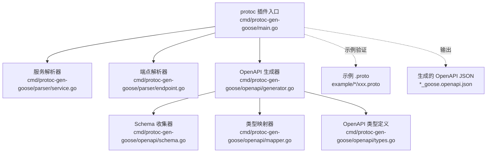
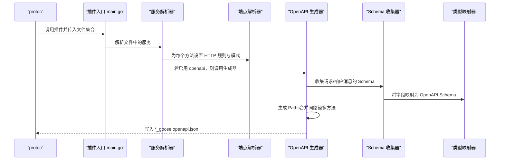
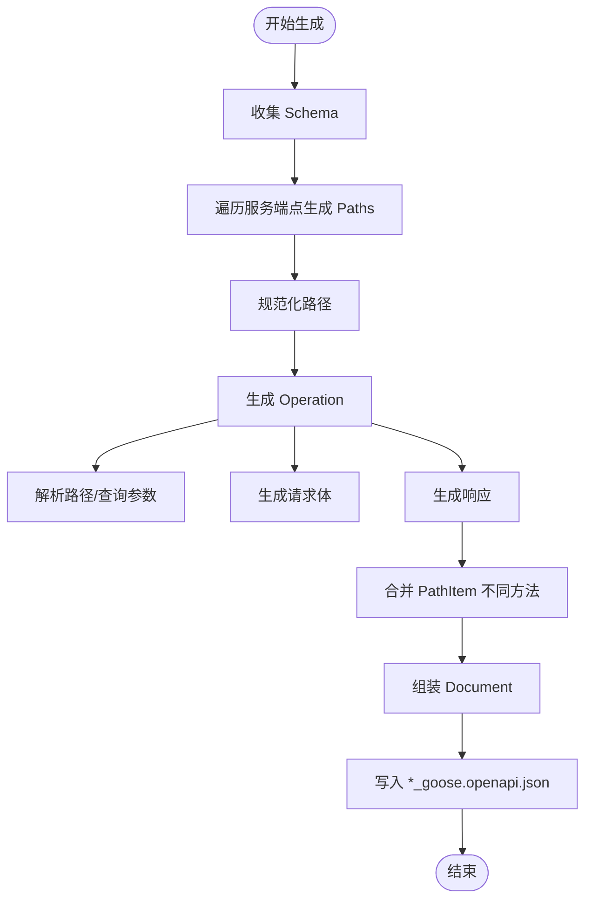
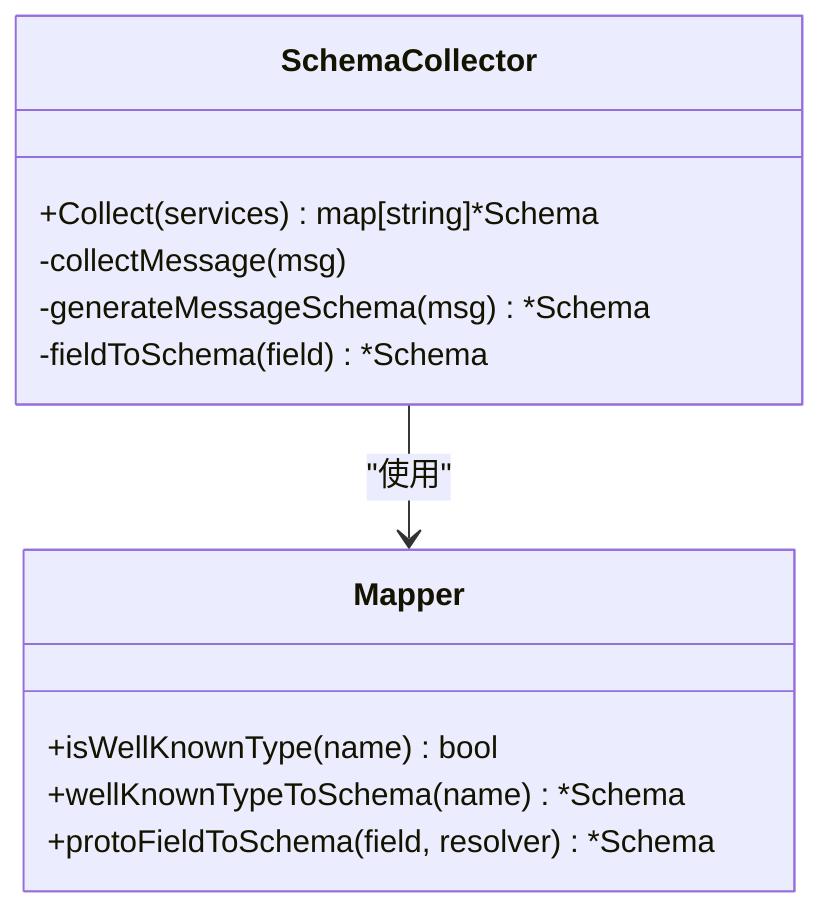
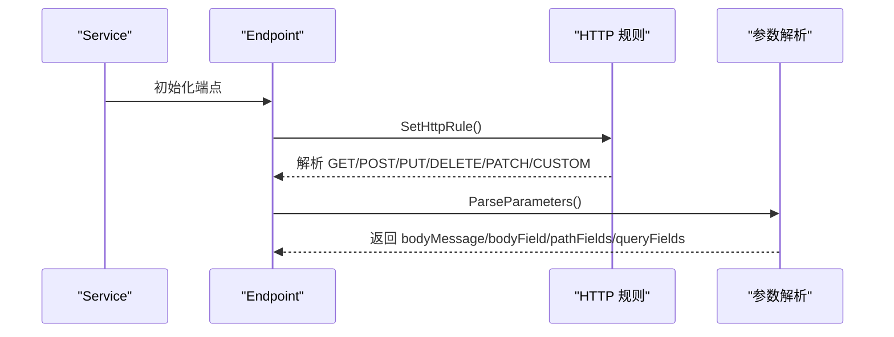
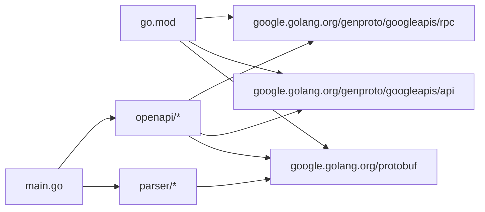

# OpenAPI 文档生成

<cite>
**本文引用的文件**
- [main.go](file://cmd/protoc-gen-goose/main.go)
- [generator.go](file://cmd/protoc-gen-goose/openapi/generator.go)
- [mapper.go](file://cmd/protoc-gen-goose/openapi/mapper.go)
- [schema.go](file://cmd/protoc-gen-goose/openapi/schema.go)
- [types.go](file://cmd/protoc-gen-goose/openapi/types.go)
- [service.go](file://cmd/protoc-gen-goose/parser/service.go)
- [endpoint.go](file://cmd/protoc-gen-goose/parser/endpoint.go)
- [user.proto](file://example/user/user.proto)
- [body.proto](file://example/body/body.proto)
- [path.proto](file://example/path/path.proto)
- [user_goose.openapi.json](file://example/user/user_goose.openapi.json)
- [body_goose.openapi.json](file://example/body/body_goose.openapi.json)
- [path_goose.openapi.json](file://example/path/path_goose.openapi.json)
- [Makefile](file://Makefile)
- [go.mod](file://go.mod)
</cite>

## 更新摘要
**所做更改**
- 新增完整的 OpenAPI 文档生成功能说明
- 添加详细的配置选项和使用示例
- 完善从 .proto 到 OpenAPI 的映射规则说明
- 增加 Schema 生成机制的详细解释
- 补充参数和响应描述方式的技术细节
- 提供完整的示例对照和最佳实践指南

## 目录
1. [简介](#简介)
2. [项目结构](#项目结构)
3. [核心组件](#核心组件)
4. [架构总览](#架构总览)
5. [组件详解](#组件详解)
6. [依赖关系分析](#依赖关系分析)
7. [性能与扩展性](#性能与扩展性)
8. [故障排查指南](#故障排查指南)
9. [结论](#结论)
10. [附录：完整使用示例与配置](#附录完整使用示例与配置)

## 简介
本文档系统化阐述 Goose 项目中的 OpenAPI 文档生成功能，提供 API 文档自动生成的完整指南。该功能以 .proto 文件为单一事实源，通过解析 google.api.http 注解与消息结构，自动生成符合 OpenAPI 3.0.3 规范的 JSON 文档。

主要特性包括：
- 完整的 HTTP 方法与路径映射
- 参数（路径/查询）与请求体 Schema 自动生成
- 响应状态码与内容类型策略化处理
- 对常见 Protobuf 已知类型的内建支持
- 支持动态内容类型（HttpBody、HttpResponse）
- 可扩展的元信息与标签分类

## 项目结构
OpenAPI 生成能力位于命令行插件 protoc-gen-goose 中，核心目录与职责如下：

- **cmd/protoc-gen-goose/main.go**：插件入口，解析 --openapi 标志位，按需触发 OpenAPI 生成
- **cmd/protoc-gen-goose/openapi/**：OpenAPI 生成器与类型定义
  - generator.go：核心生成逻辑，负责文档构建与文件输出
  - schema.go：Schema 收集器，递归收集消息类型并生成 Schema
  - mapper.go：类型映射器，将 Protobuf 类型映射到 OpenAPI Schema
  - types.go：OpenAPI 数据模型定义
- **cmd/protoc-gen-goose/parser/**：协议解析器，负责从 .proto 提取 HTTP 映射与参数
- **example/**：示例 .proto 及其生成的 OpenAPI 文档，便于对照理解



**图表来源**
- [main.go:38-101](file://cmd/protoc-gen-goose/main.go#L38-L101)
- [service.go:63-89](file://cmd/protoc-gen-goose/parser/service.go#L63-L89)
- [endpoint.go:181-243](file://cmd/protoc-gen-goose/parser/endpoint.go#L181-L243)
- [generator.go:15-61](file://cmd/protoc-gen-goose/openapi/generator.go#L15-L61)
- [schema.go:26-40](file://cmd/protoc-gen-goose/openapi/schema.go#L26-L40)
- [mapper.go:8-28](file://cmd/protoc-gen-goose/openapi/mapper.go#L8-L28)
- [types.go:3-85](file://cmd/protoc-gen-goose/openapi/types.go#L3-L85)

## 核心组件

### 插件入口与控制流
- **标志位解析**：通过 `--goose_opt=openapi=true` 启用 OpenAPI 生成
- **服务遍历**：对每个包含服务的 .proto 文件生成对应的 Go 代码
- **条件生成**：仅在启用 openapi 时调用 OpenAPI 生成器
- **文件输出**：生成 *_goose.openapi.json 文件

### OpenAPI 生成器
- **Schema 收集**：递归遍历所有服务端点涉及的消息类型
- **路径生成**：基于服务端点生成 PathItem，合并同路径不同方法
- **文档组装**：构建完整的 OpenAPI 3.0.3 文档结构
- **文件写入**：将 JSON 文档写入指定文件名

### Schema 收集与映射
- **递归收集**：处理嵌套消息、列表、映射等复杂类型
- **去重机制**：使用 visited 哈希表避免重复生成相同消息的 Schema
- **类型映射**：将 Protobuf 基本类型、枚举、消息映射到 OpenAPI Schema
- **已知类型处理**：特殊处理 google.protobuf.* 和 google.api.HttpBody 等

### 解析器
- **HTTP 规则解析**：读取 google.api.http 注解，推导 HTTP 方法、路径
- **参数提取**：解析路径参数与查询参数，限定支持的数据类型
- **请求体映射**：根据 http.body 设置确定请求体 Schema

**章节来源**
- [main.go:38-101](file://cmd/protoc-gen-goose/main.go#L38-L101)
- [generator.go:15-61](file://cmd/protoc-gen-goose/openapi/generator.go#L15-L61)
- [schema.go:26-134](file://cmd/protoc-gen-goose/openapi/schema.go#L26-L134)
- [mapper.go:8-136](file://cmd/protoc-gen-goose/openapi/mapper.go#L8-L136)
- [service.go:63-89](file://cmd/protoc-gen-goose/parser/service.go#L63-L89)
- [endpoint.go:58-243](file://cmd/protoc-gen-goose/parser/endpoint.go#L58-L243)

## 架构总览
下图展示从 .proto 到 OpenAPI 文档的关键步骤与模块交互：



**图表来源**
- [main.go:38-101](file://cmd/protoc-gen-goose/main.go#L38-L101)
- [service.go:63-89](file://cmd/protoc-gen-goose/parser/service.go#L63-L89)
- [endpoint.go:181-243](file://cmd/protoc-gen-goose/parser/endpoint.go#L181-L243)
- [generator.go:15-61](file://cmd/protoc-gen-goose/openapi/generator.go#L15-L61)
- [schema.go:26-134](file://cmd/protoc-gen-goose/openapi/schema.go#L26-L134)
- [mapper.go:64-136](file://cmd/protoc-gen-goose/openapi/mapper.go#L64-L136)

## 组件详解

### OpenAPI 生成器（generator.go）
OpenAPI 生成器是核心组件，负责将解析得到的服务信息转换为标准的 OpenAPI 3.0.3 文档。

#### 主要功能
- **文档构建**：创建 Document 对象，包含 openapi 版本、info 元信息、paths 路径和 components 组件
- **路径生成**：遍历所有服务端点，生成 PathItem 并按路径合并不同 HTTP 方法
- **操作生成**：为每个端点生成 Operation，包含 operationId、summary、parameters、requestBody、responses
- **文件输出**：将生成的 JSON 文档写入 *_goose.openapi.json 文件

#### 关键行为
- **路径规范化**：`normalizePath()` 移除内部路径占位符，适配 OpenAPI 格式
- **操作生成**：`generateOperation()` 解析路径/查询参数、请求体、响应
- **请求体处理**：`generateRequestBody()` 根据 http.body 设置请求体 Schema
- **响应处理**：`generateResponses()` 根据 HTTP 方法选择默认状态码
- **路径合并**：`mergePathItem()` 将多个方法合并到同一 PathItem



**图表来源**
- [generator.go:15-61](file://cmd/protoc-gen-goose/openapi/generator.go#L15-L61)
- [generator.go:64-130](file://cmd/protoc-gen-goose/openapi/generator.go#L64-L130)
- [generator.go:133-240](file://cmd/protoc-gen-goose/openapi/generator.go#L133-L240)

**章节来源**
- [generator.go:15-286](file://cmd/protoc-gen-goose/openapi/generator.go#L15-L286)

### Schema 收集与映射（schema.go、mapper.go）
Schema 收集器和类型映射器共同完成从 Protobuf 类型到 OpenAPI Schema 的转换。

#### Schema 收集器
- **递归遍历**：`collectMessage()` 递归遍历消息字段，跳过"已知类型"
- **去重机制**：使用 visited 哈希表避免重复生成相同消息的 Schema
- **required 字段**：计算非可选且非列表/映射字段为 required
- **嵌套处理**：为非已知类型消息建立 $ref 引用

#### 类型映射器
- **已知类型识别**：`isWellKnownType()` 识别 google.protobuf.* 与 google.api.HttpBody 等
- **内联 Schema**：`wellKnownTypeToSchema()` 为已知类型返回内联 Schema
- **字段映射**：`protoFieldToSchema()` 处理标量、枚举、消息、列表、映射等



**图表来源**
- [schema.go:12-134](file://cmd/protoc-gen-goose/openapi/schema.go#L12-L134)
- [mapper.go:8-136](file://cmd/protoc-gen-goose/openapi/mapper.go#L8-L136)

**章节来源**
- [schema.go:11-134](file://cmd/protoc-gen-goose/openapi/schema.go#L11-L134)
- [mapper.go:8-136](file://cmd/protoc-gen-goose/openapi/mapper.go#L8-L136)

### 解析器（parser/service.go、parser/endpoint.go）
解析器负责从 .proto 文件中提取 HTTP 映射规则和参数信息。

#### 服务解析
- **服务遍历**：`NewServices()` 为每个方法设置 HTTP 规则（默认 POST 模式）
- **模式解析**：解析路径模式，支持通配符和命名参数
- **流式检查**：检测并拒绝流式 RPC 方法

#### 端点解析
- **HTTP 规则**：`SetHttpRule()` 读取 google.api.http 注解
- **参数解析**：`ParseParameters()` 解析路径参数与查询参数
- **类型验证**：严格限制路径参数支持的数据类型
- **字段查找**：`FindField()` 根据名称查找消息字段



**图表来源**
- [service.go:63-89](file://cmd/protoc-gen-goose/parser/service.go#L63-L89)
- [endpoint.go:181-243](file://cmd/protoc-gen-goose/parser/endpoint.go#L181-L243)
- [endpoint.go:58-161](file://cmd/protoc-gen-goose/parser/endpoint.go#L58-L161)

**章节来源**
- [service.go:10-90](file://cmd/protoc-gen-goose/parser/service.go#L10-L90)
- [endpoint.go:58-243](file://cmd/protoc-gen-goose/parser/endpoint.go#L58-L243)

### OpenAPI 数据模型（types.go）
OpenAPI 数据模型定义了完整的 OpenAPI 3.0.3 规范结构。

#### 根文档结构
- **Document**：根对象，包含 openapi 版本、info 元信息、paths 路径和 components 组件
- **Info**：API 元信息，包含 title、version、description
- **Components**：可复用对象集合，主要包含 schemas

#### 路径与操作
- **PathItem**：单个路径上的操作集合，支持 get/post/put/delete/patch/head/options
- **Operation**：单个 API 操作，包含 operationId、summary、parameters、requestBody、responses

#### 参数与响应
- **Parameter**：操作参数，支持 path、query、header、cookie 位置
- **RequestBody**：请求体，包含描述和内容类型映射
- **Response**：响应定义，包含描述和内容类型映射

#### Schema 定义
- **Schema**：类型定义，支持基本类型、数组、对象、枚举、引用等
- **MediaType**：媒体类型定义，关联具体 Schema

**章节来源**
- [types.go:3-85](file://cmd/protoc-gen-goose/openapi/types.go#L3-L85)

## 依赖关系分析
OpenAPI 生成功能依赖以下外部库和内部模块：

### 外部依赖
- **google.golang.org/protobuf**：解析 .proto 元数据、注解与消息/字段描述
- **google.golang.org/genproto/googleapis/api**：读取 google.api.http 注解
- **google.golang.org/genproto/googleapis/rpc**：读取 google.rpc.HttpResponse

### 内部模块
- **parser**：协议解析，提供服务和端点信息
- **openapi**：OpenAPI 生成与 Schema 映射
- **cmd/protoc-gen-goose**：插件入口和控制流



**图表来源**
- [go.mod:5-13](file://go.mod#L5-L13)
- [main.go:3-17](file://cmd/protoc-gen-goose/main.go#L3-L17)

**章节来源**
- [go.mod:5-13](file://go.mod#L5-L13)
- [main.go:3-17](file://cmd/protoc-gen-goose/main.go#L3-L17)

## 性能与扩展性
OpenAPI 生成器具有良好的性能特征和扩展潜力：

### 性能特征
- **去重优化**：Schema 收集使用 visited 哈希表，避免重复生成相同消息的 Schema
- **线性复杂度**：合并 PathItem 时按路径键覆盖，复杂度与端点数量线性相关
- **内存效率**：仅在需要时生成 Schema，支持大型 .proto 文件

### 扩展建议
- **元信息定制**：当前生成器使用包名作为标题、固定版本号，可扩展参数支持自定义标题/版本
- **标签分类**：可通过扩展在生成器中注入 tags 字段或基于路径前缀分组
- **内容类型扩展**：当前对 google.api.HttpBody 与 google.rpc.HttpResponse 有特殊处理，可扩展更多"动态内容"类型
- **文档增强**：支持添加 description、externalDocs、security 等高级元信息

## 故障排查指南

### 常见问题与解决方案

#### 流式 RPC 不支持
- **现象**：解析器检测到流式方法会报错
- **原因**：OpenAPI 规范不支持流式 RPC
- **解决**：移除流式修饰符或使用其他通信模式

#### 路径参数类型限制
- **现象**：路径参数类型验证失败
- **支持类型**：布尔、整数、浮点、字符串、枚举以及特定包装类型
- **解决**：调整 .proto 文件中的字段类型或使用查询参数

#### 查询参数过滤
- **现象**：某些字段未出现在查询参数中
- **过滤规则**：映射字段、流式字段、不支持类型会被自动排除
- **解决**：确保字段类型符合查询参数要求

#### 请求体为空但方法需要请求体
- **现象**：GET/HEAD/DELETE 方法生成空请求体
- **原因**：HTTP 规范限制
- **解决**：调整注解或使用非 GET 方法

#### 响应体为动态内容
- **现象**：响应体内容类型为 */*
- **原因**：google.api.HttpBody 生成二进制 Schema
- **解决**：接受动态内容类型或使用固定 Schema

**章节来源**
- [service.go:74-77](file://cmd/protoc-gen-goose/parser/service.go#L74-L77)
- [endpoint.go:82-112](file://cmd/protoc-gen-goose/parser/endpoint.go#L82-L112)
- [endpoint.go:118-160](file://cmd/protoc-gen-goose/parser/endpoint.go#L118-L160)
- [generator.go:136-138](file://cmd/protoc-gen-goose/openapi/generator.go#L136-L138)
- [generator.go:188-196](file://cmd/protoc-gen-goose/openapi/generator.go#L188-L196)

## 结论
Goose 的 OpenAPI 生成器提供了完整的 API 文档自动生成解决方案。它以 .proto 为单一事实源，通过解析 google.api.http 注解与消息结构，自动生成符合 OpenAPI 3.0.3 规范的 JSON 文档。

### 核心优势
- **自动化程度高**：从 .proto 直接生成完整的 OpenAPI 文档
- **规范兼容性强**：完全遵循 OpenAPI 3.0.3 规范
- **类型安全**：基于 Protobuf 类型系统，确保 Schema 准确性
- **扩展灵活**：支持自定义元信息和标签分类

### 应用场景
- **API 文档生成**：自动生成 RESTful API 文档
- **SDK 开发**：为各种编程语言生成客户端 SDK
- **测试验证**：与 Postman、Swagger 等工具集成
- **API 网关**：支持 API 网关的路由和验证

对于更丰富的元信息与标签分类，可在现有生成器基础上扩展参数与模板，满足企业级 API 管理需求。

## 附录：完整使用示例与配置

### 1) 生成配置与命令

#### 使用 Makefile 目标
```bash
# 一键生成示例
make example

# 或手动执行
protoc \
--proto_path=. \
--proto_path=./third_party \
--proto_path=./../ \
--go_out=. \
--go_opt=paths=source_relative \
--goose_out=. \
--goose_opt=paths=source_relative \
--goose_opt=openapi=true \
example/*/*.proto
```

#### 直接调用插件
```bash
# 启用 OpenAPI 生成
protoc --goose_out=. --goose_opt=openapi=true your_service.proto

# 指定输出路径
protoc --goose_out=. --goose_opt=openapi=true --goose_opt=paths=source_relative your_service.proto
```

**章节来源**
- [Makefile:14-29](file://Makefile#L14-L29)

### 2) 从 .proto 到 OpenAPI 的映射规则

#### HTTP 方法与路径映射
- **默认行为**：未显式声明时，默认 POST 且路径为 "/服务名/方法名"
- **注解优先**：google.api.http 注解优先于默认规则
- **自定义路径**：支持任意路径模式，包括通配符

#### 路径参数规则
- **提取机制**：从路径片段中提取变量名 `{variable}`
- **类型限制**：仅支持布尔、整数、浮点、字符串、枚举及特定包装类型
- **必填标记**：路径参数自动标记为 required=true

#### 查询参数规则
- **自动提取**：从请求消息中筛选非路径、非映射字段
- **类型过滤**：仅支持标量类型和特定包装类型
- **可选字段**：查询参数默认为可选

#### 请求体映射
- **通配符**：`body: "*"` 表示整个请求消息作为请求体
- **字段映射**：`body: "fieldName"` 表示指定字段作为请求体
- **类型处理**：支持 HttpBody 二进制请求体

#### 响应体策略
- **状态码选择**：POST=201、DELETE=204、其他=200
- **默认响应**：始终包含 default 错误响应
- **内容类型**：application/json 或 */*（动态内容）

**章节来源**
- [endpoint.go:181-243](file://cmd/protoc-gen-goose/parser/endpoint.go#L181-L243)
- [endpoint.go:58-161](file://cmd/protoc-gen-goose/parser/endpoint.go#L58-L161)
- [generator.go:133-240](file://cmd/protoc-gen-goose/openapi/generator.go#L133-L240)

### 3) Schema 生成机制

#### 消息 Schema 生成
- **对象结构**：为每个非已知类型消息生成对象 Schema
- **属性映射**：属性名为 JSON 名称，属性 Schema 由字段映射而来
- **required 处理**：非可选且非列表/映射字段加入 required 数组

#### 字段类型映射
- **标量类型**：映射到相应 OpenAPI 类型与格式
- **枚举类型**：生成字符串类型并包含 enum 值数组
- **包装类型**：映射为对应标量并标注 nullable=true
- **时间类型**：Timestamp 映射为 date-time，Duration 映射为字符串

#### 复杂类型处理
- **列表类型**：items 为元素 Schema
- **映射类型**：additionalProperties 为值 Schema
- **嵌套消息**：非已知类型生成 $ref，已知类型内联

**章节来源**
- [schema.go:74-110](file://cmd/protoc-gen-goose/openapi/schema.go#L74-L110)
- [mapper.go:64-136](file://cmd/protoc-gen-goose/openapi/mapper.go#L64-L136)

### 4) 文档结构与内容

#### 根对象结构
- **openapi**：固定为 3.0.3
- **info**：包含 title（包名）、version（固定 1.0.0）
- **paths**：路径到 PathItem 的映射
- **components**：可复用对象，主要包含 schemas

#### PathItem 结构
- **方法字段**：get/post/put/delete/patch/head/options
- **操作合并**：同路径不同方法合并到同一 PathItem

#### Operation 定义
- **operationId**：由输入消息名与方法名组合
- **summary**：方法名
- **parameters**：路径/查询参数数组
- **requestBody**：请求体定义
- **responses**：状态码到响应的映射

#### 媒体类型处理
- **application/json**：标准 JSON 响应
- **\*/\***：动态内容类型（HttpBody）
- **二进制格式**：HttpBody 使用 string, binary 格式

**章节来源**
- [generator.go:34-61](file://cmd/protoc-gen-goose/openapi/generator.go#L34-L61)
- [generator.go:86-130](file://cmd/protoc-gen-goose/openapi/generator.go#L86-L130)
- [generator.go:168-240](file://cmd/protoc-gen-goose/openapi/generator.go#L168-L240)

### 5) 示例对照

#### 用户服务（CRUD）示例
- **创建用户**：POST /v1/user，请求体为 CreateUserRequest，响应 201
- **获取用户**：GET /v1/user/{id}，路径参数 id，响应 200
- **修改用户**：PUT /v1/user/{id}，请求体为 ModifyUserRequest，响应 200
- **删除用户**：DELETE /v1/user/{id}，响应 204
- **更新用户**：PATCH /v1/user/{id}，请求体为 UserItem 子对象，响应 200

#### 请求体示例
- **通配符请求体**：StarBody 使用整个消息作为请求体
- **命名请求体**：NamedBody 使用指定字段作为请求体
- **HttpBody 请求体**：HttpBodyStarBody 和 HttpBodyNamedBody 使用二进制格式
- **空请求体**：NonBody 使用 google.protobuf.Empty

#### 路径参数示例
- **布尔类型**：BoolPath 支持 bool、optional bool、包装类型
- **整数类型**：Int32Path、Int64Path 支持多种整数格式
- **浮点类型**：FloatPath、DoublePath 支持 float 和 double
- **字符串类型**：StringPath 支持普通字符串和多值字符串
- **枚举类型**：EnumPath 支持 Status 枚举

**章节来源**
- [user.proto:11-62](file://example/user/user.proto#L11-L62)
- [body.proto:11-51](file://example/body/body.proto#L11-L51)
- [path.proto:9-154](file://example/path/path.proto#L9-L154)
- [user_goose.openapi.json:7-217](file://example/user/user_goose.openapi.json#L7-L217)
- [body_goose.openapi.json:7-181](file://example/body/body_goose.openapi.json#L7-L181)
- [path_goose.openapi.json:7-601](file://example/path/path_goose.openapi.json#L7-L601)

### 6) 自定义文档信息、标签分类与版本管理

#### 当前实现
- **标题**：来自 .proto 包名，格式为 "包名 API"
- **版本**：固定 1.0.0
- **描述**：当前未提供描述字段
- **标签**：未提供标签分类功能

#### 建议扩展
- **元信息定制**：在生成器中引入参数以覆盖 info.title/info.version
- **标签分类**：支持基于路径前缀或注释的标签分组
- **描述支持**：添加对 proto 文件中注释的解析和映射
- **外部配置**：支持外部 YAML/JSON 配置文件注入

#### 配置示例
```bash
# 自定义标题和版本
protoc --goose_out=. --goose_opt=openapi=true --goose_opt=title="My API" --goose_opt=version="2.0.0"

# 指定输出路径
protoc --goose_out=. --goose_opt=openapi=true --goose_opt=paths=source_relative
```

**章节来源**
- [generator.go:34-47](file://cmd/protoc-gen-goose/openapi/generator.go#L34-L47)
- [main.go:21-24](file://cmd/protoc-gen-goose/main.go#L21-L24)