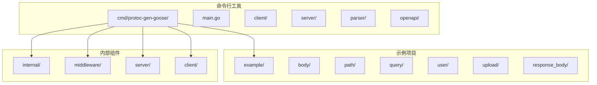
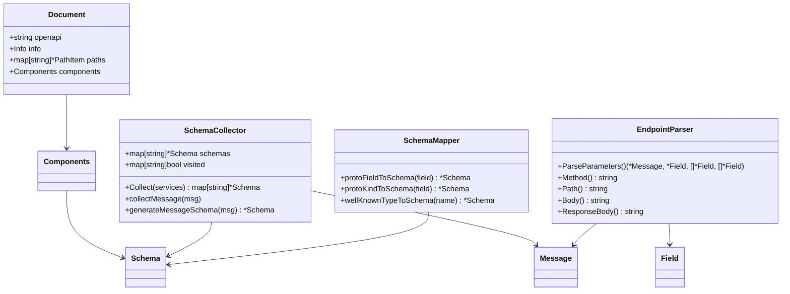
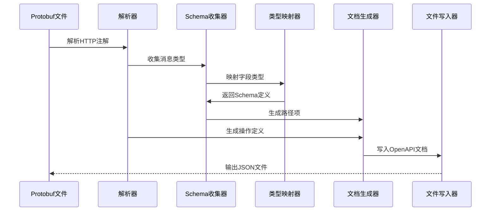
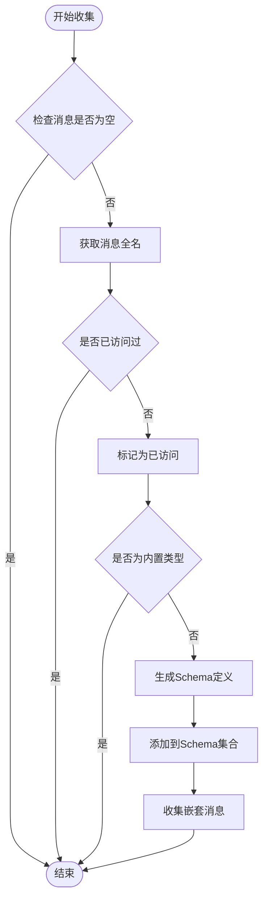
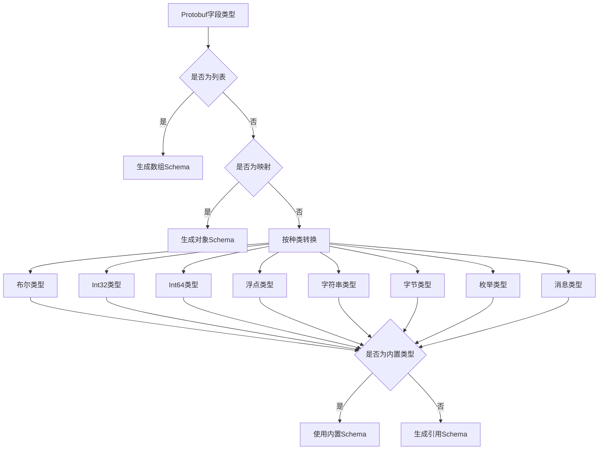
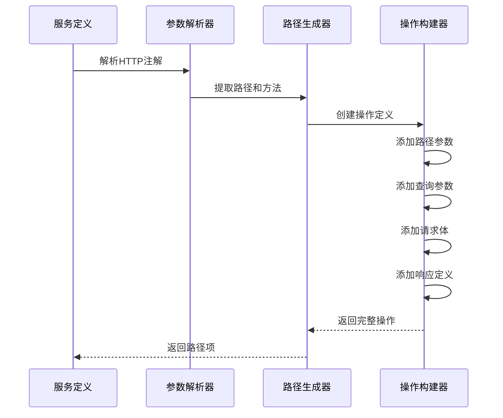
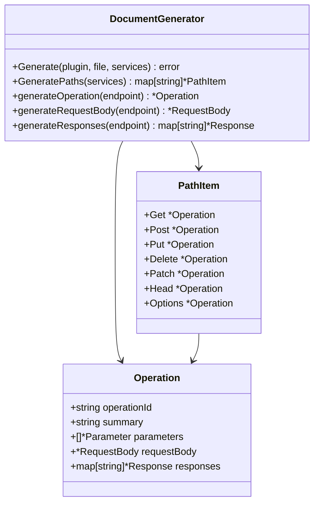
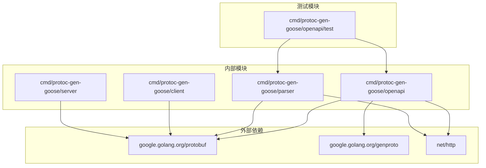

# OpenAPI 文档生成器

<cite>
**本文档引用的文件**
- [main.go](file://cmd/protoc-gen-goose/main.go)
- [generator.go](file://cmd/protoc-gen-goose/openapi/generator.go)
- [mapper.go](file://cmd/protoc-gen-goose/openapi/mapper.go)
- [schema.go](file://cmd/protoc-gen-goose/openapi/schema.go)
- [types.go](file://cmd/protoc-gen-goose/openapi/types.go)
- [service.go](file://cmd/protoc-gen-goose/parser/service.go)
- [endpoint.go](file://cmd/protoc-gen-goose/parser/endpoint.go)
- [body.proto](file://example/body/body.proto)
- [path.proto](file://example/path/path.proto)
- [query.proto](file://example/query/query.proto)
- [body_goose.openapi.json](file://example/body/body_goose.openapi.json)
- [path_goose.openapi.json](file://example/path/path_goose.openapi.json)
- [query_goose.openapi.json](file://example/query/query_goose.openapi.json)
- [generator_test.go](file://cmd/protoc-gen-goose/openapi/generator_test.go)
- [mapper_test.go](file://cmd/protoc-gen-goose/openapi/mapper_test.go)
</cite>

## 目录
1. [简介](#简介)
2. [项目结构](#项目结构)
3. [核心组件](#核心组件)
4. [架构概览](#架构概览)
5. [详细组件分析](#详细组件分析)
6. [依赖关系分析](#依赖关系分析)
7. [性能考虑](#性能考虑)
8. [故障排除指南](#故障排除指南)
9. [结论](#结论)
10. [附录](#附录)

## 简介

OpenAPI 文档生成器是一个基于 Protobuf 的代码生成工具，专门用于将 .proto 文件转换为符合 OpenAPI 3.0 规范的 API 文档。该工具通过解析 Protobuf 服务定义中的 HTTP 注解，自动生成对应的 OpenAPI 规范文档，包括路径、参数、请求体、响应等完整信息。

该生成器支持多种数据类型的映射，包括基本类型、枚举、消息类型以及 Google Protobuf 的标准类型（如 Timestamp、Duration、HttpBody 等）。它能够处理路径参数、查询参数、请求体等多种 HTTP 请求形式，并自动识别响应状态码和内容类型。

## 项目结构

该项目采用模块化设计，主要包含以下核心目录：



**图表来源**
- [main.go:1-126](file://cmd/protoc-gen-goose/main.go#L1-L126)
- [generator.go:1-286](file://cmd/protoc-gen-goose/openapi/generator.go#L1-L286)

**章节来源**
- [main.go:1-126](file://cmd/protoc-gen-goose/main.go#L1-L126)

## 核心组件

### OpenAPI 生成器核心功能

OpenAPI 生成器的核心职责是将 Protobuf 服务定义转换为 OpenAPI 3.0 规范文档。其主要功能包括：

1. **Schema 收集器**：递归收集所有消息类型的 Schema 定义
2. **路径生成器**：根据 HTTP 注解生成 OpenAPI 路径项
3. **类型映射器**：将 Protobuf 类型映射到 OpenAPI 类型
4. **文档构建器**：组装完整的 OpenAPI 文档结构

### 主要数据结构



**图表来源**
- [types.go:1-85](file://cmd/protoc-gen-goose/openapi/types.go#L1-L85)
- [schema.go:1-134](file://cmd/protoc-gen-goose/openapi/schema.go#L1-L134)
- [mapper.go:1-136](file://cmd/protoc-gen-goose/openapi/mapper.go#L1-L136)
- [endpoint.go:1-243](file://cmd/protoc-gen-goose/parser/endpoint.go#L1-L243)

**章节来源**
- [types.go:1-85](file://cmd/protoc-gen-goose/openapi/types.go#L1-L85)
- [schema.go:1-134](file://cmd/protoc-gen-goose/openapi/schema.go#L1-L134)
- [mapper.go:1-136](file://cmd/protoc-gen-goose/openapi/mapper.go#L1-L136)

## 架构概览

OpenAPI 文档生成器的整体架构采用分层设计，从底层的数据解析到高层的文档生成，形成了清晰的职责分离：



**图表来源**
- [generator.go:13-61](file://cmd/protoc-gen-goose/openapi/generator.go#L13-L61)
- [schema.go:25-40](file://cmd/protoc-gen-goose/openapi/schema.go#L25-L40)
- [mapper.go:64-85](file://cmd/protoc-gen-goose/openapi/mapper.go#L64-L85)

### 数据流处理

系统的核心数据流包括以下几个关键步骤：

1. **输入解析**：读取 Protobuf 文件，提取服务定义和 HTTP 注解
2. **Schema 收集**：递归遍历所有消息类型，收集必要的 Schema 定义
3. **类型映射**：将 Protobuf 类型转换为 OpenAPI 类型
4. **文档构建**：组装完整的 OpenAPI 文档结构
5. **输出生成**：将文档序列化为 JSON 格式并写入文件

**章节来源**
- [generator.go:13-61](file://cmd/protoc-gen-goose/openapi/generator.go#L13-L61)

## 详细组件分析

### Schema 收集器 (SchemaCollector)

Schema 收集器负责递归收集所有需要在 OpenAPI 文档中定义的消息类型。其工作原理如下：



**图表来源**
- [schema.go:52-91](file://cmd/protoc-gen-goose/openapi/schema.go#L52-L91)

#### 关键特性

1. **递归收集**：自动处理嵌套消息类型，确保所有相关类型都被包含
2. **去重机制**：防止重复收集相同的消息类型
3. **内置类型过滤**：跳过 Google Protobuf 的标准类型，因为它们有特殊的 OpenAPI 表示
4. **引用管理**：为非内置类型生成 `$ref` 引用，避免重复定义

**章节来源**
- [schema.go:11-134](file://cmd/protoc-gen-goose/openapi/schema.go#L11-L134)

### 类型映射器 (TypeMapper)

类型映射器负责将 Protobuf 类型转换为对应的 OpenAPI 类型。它支持多种数据类型：



**图表来源**
- [mapper.go:64-135](file://cmd/protoc-gen-goose/openapi/mapper.go#L64-L135)

#### 内置类型特殊处理

系统对 Google Protobuf 的标准类型提供了特殊的 OpenAPI 映射：

| Protobuf 类型 | OpenAPI 类型 | 格式 | 可空性 |
|---------------|--------------|------|--------|
| google.protobuf.Timestamp | string | date-time | 否 |
| google.protobuf.Duration | string | 无 | 否 |
| google.protobuf.Empty | object | 无 | 否 |
| google.protobuf.StringValue | string | 无 | 是 |
| google.protobuf.Int32Value | integer | int32 | 是 |
| google.protobuf.Int64Value | integer | int64 | 是 |
| google.protobuf.BoolValue | boolean | 无 | 是 |
| google.protobuf.FloatValue | number | float | 是 |
| google.protobuf.DoubleValue | number | double | 是 |
| google.protobuf.UInt32Value | integer | int32 | 是 |
| google.protobuf.UInt64Value | integer | int64 | 是 |
| google.api.HttpBody | string | binary | 否 |

**章节来源**
- [mapper.go:30-62](file://cmd/protoc-gen-goose/openapi/mapper.go#L30-L62)

### 路径生成器 (PathGenerator)

路径生成器根据 HTTP 注解生成 OpenAPI 路径项，处理不同类型的 HTTP 方法和参数：



**图表来源**
- [generator.go:63-130](file://cmd/protoc-gen-goose/openapi/generator.go#L63-L130)

#### 参数处理逻辑

系统支持三种类型的参数处理：

1. **路径参数**：从 URL 路径中提取，必须为标量类型或特定的包装类型
2. **查询参数**：从 URL 查询字符串中提取，支持标量类型和包装类型
3. **请求体**：从 HTTP 请求体中提取，支持完整消息或指定字段

**章节来源**
- [generator.go:85-130](file://cmd/protoc-gen-goose/openapi/generator.go#L85-L130)

### 文档生成器 (DocumentGenerator)

文档生成器负责组装最终的 OpenAPI 文档，包括基本信息、路径定义和组件定义：



**图表来源**
- [generator.go:13-61](file://cmd/protoc-gen-goose/openapi/generator.go#L13-L61)

**章节来源**
- [generator.go:13-61](file://cmd/protoc-gen-goose/openapi/generator.go#L13-L61)

## 依赖关系分析

OpenAPI 文档生成器的依赖关系相对简单，主要依赖于 Google Protobuf 编译器框架：



**图表来源**
- [main.go:3-16](file://cmd/protoc-gen-goose/main.go#L3-L16)
- [generator.go:3-11](file://cmd/protoc-gen-goose/openapi/generator.go#L3-L11)

### 关键依赖说明

1. **Protobuf 编译器**：使用 `protogen` 包进行代码生成
2. **HTTP 注解**：使用 `google.golang.org/genproto/googleapis/api/annotations` 处理 HTTP 注解
3. **标准库**：使用 `net/http` 进行 HTTP 方法处理

**章节来源**
- [main.go:3-16](file://cmd/protoc-gen-goose/main.go#L3-L16)

## 性能考虑

### 内存使用优化

1. **去重机制**：通过 `visited` 映射避免重复处理相同的消息类型
2. **延迟加载**：仅在需要时才生成 Schema 定义
3. **引用复用**：使用 `$ref` 引用避免重复定义

### 处理效率

1. **单次遍历**：Schema 收集器在一次遍历中完成所有类型收集
2. **缓存策略**：类型映射结果可以被缓存复用
3. **增量更新**：支持增量处理，避免重新生成整个文档

## 故障排除指南

### 常见问题及解决方案

#### 1. 流式 RPC 不支持

**问题描述**：系统不支持流式 RPC 方法
**解决方法**：确保所有 RPC 方法都是标准的请求-响应模式

**章节来源**
- [service.go:74-76](file://cmd/protoc-gen-goose/parser/service.go#L74-L76)

#### 2. 路径参数类型限制

**问题描述**：路径参数不支持列表或映射类型
**解决方法**：将复杂类型改为查询参数或请求体

**章节来源**
- [endpoint.go:82-84](file://cmd/protoc-gen-goose/parser/endpoint.go#L82-L84)

#### 3. HTTP 注解格式错误

**问题描述**：HTTP 注解格式不符合规范
**解决方法**：检查 `.proto` 文件中的 `(google.api.http)` 注解格式

**章节来源**
- [endpoint.go:181-192](file://cmd/protoc-gen-goose/parser/endpoint.go#L181-L192)

### 调试技巧

1. **启用详细日志**：通过调试模式查看生成过程
2. **验证 JSON 结构**：使用 JSON 验证工具检查生成的 OpenAPI 文档
3. **单元测试**：运行测试套件验证各组件功能

**章节来源**
- [generator_test.go:96-146](file://cmd/protoc-gen-goose/openapi/generator_test.go#L96-L146)

## 结论

OpenAPI 文档生成器提供了一个完整、高效的解决方案，将 Protobuf 服务定义自动转换为符合 OpenAPI 3.0 规范的 API 文档。其设计具有以下优势：

1. **全面的类型支持**：支持所有常见的 Protobuf 类型和 Google 标准类型
2. **灵活的参数处理**：支持路径参数、查询参数和请求体的灵活组合
3. **高质量的输出**：生成的 JSON 文档结构清晰、格式规范
4. **易于扩展**：模块化设计便于功能扩展和维护

该工具特别适合需要同时维护 Protobuf 接口定义和 OpenAPI 文档的项目，能够显著提高开发效率和文档质量。

## 附录

### 使用示例

#### 基本使用方法

```bash
# 生成 OpenAPI 文档
protoc --openapi_out=. --openapi_opt=paths_out=. your_service.proto
```

#### 配置选项

| 选项 | 描述 | 默认值 |
|------|------|--------|
| `openapi` | 启用 OpenAPI 文档生成 | false |
| `paths_out` | 指定路径输出目录 | 当前目录 |

### 示例项目

系统包含多个示例项目，展示了不同类型场景的使用方法：

1. **Body 示例**：演示请求体的不同配置方式
2. **Path 示例**：展示各种数据类型的路径参数
3. **Query 示例**：演示查询参数的处理
4. **Upload 示例**：处理文件上传场景
5. **Response Body 示例**：演示响应体的配置

**章节来源**
- [body.proto:1-63](file://example/body/body.proto#L1-L63)
- [path.proto:1-154](file://example/path/path.proto#L1-L154)
- [query.proto:1-174](file://example/query/query.proto#L1-L174)