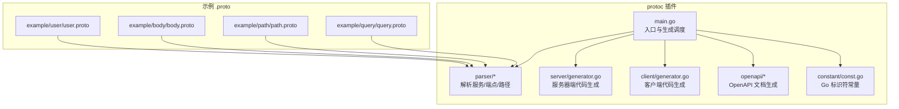
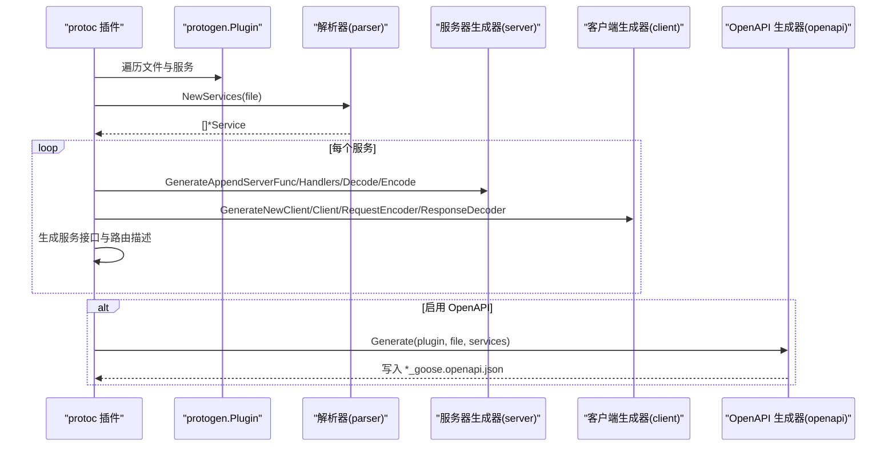
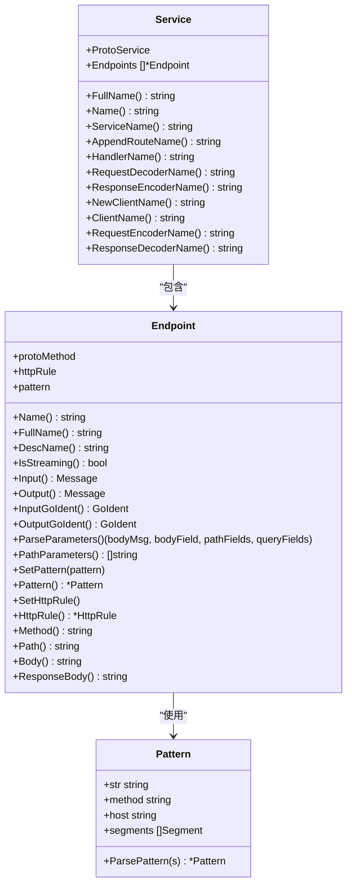
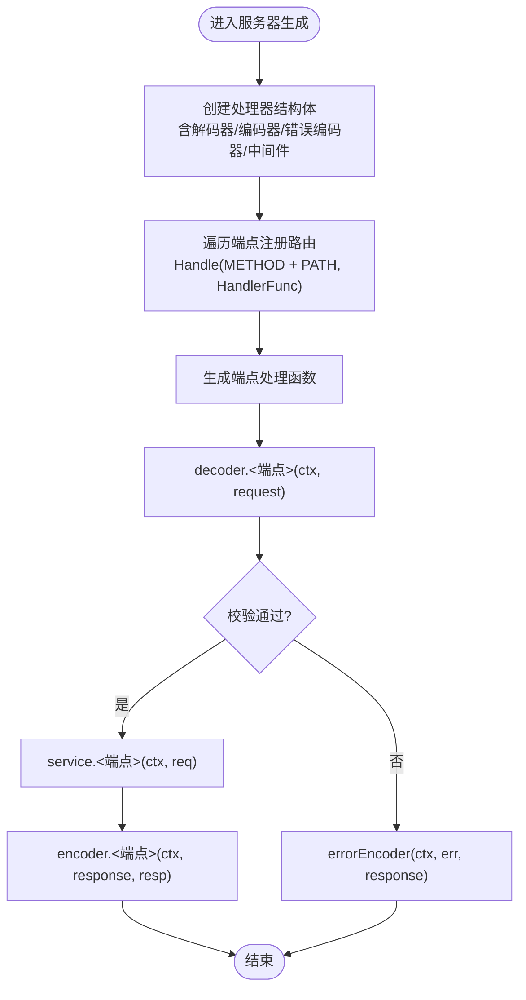
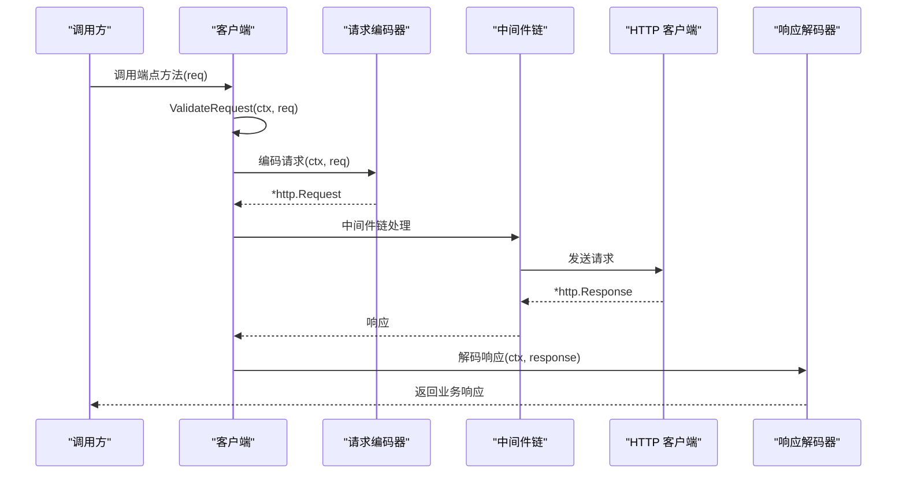
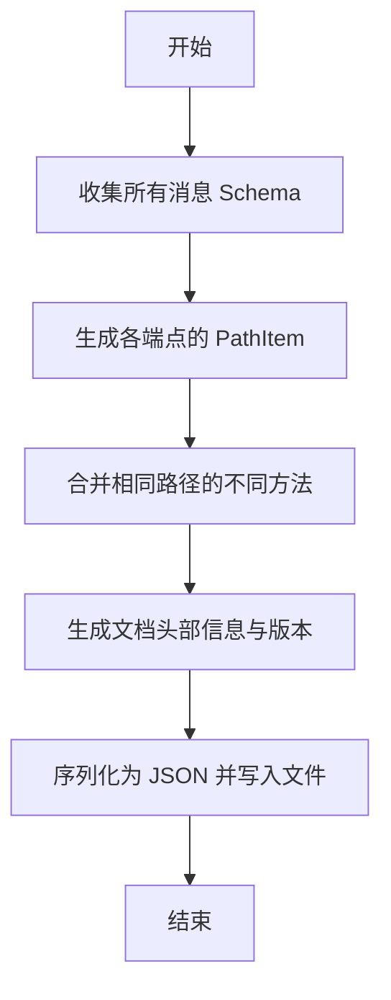
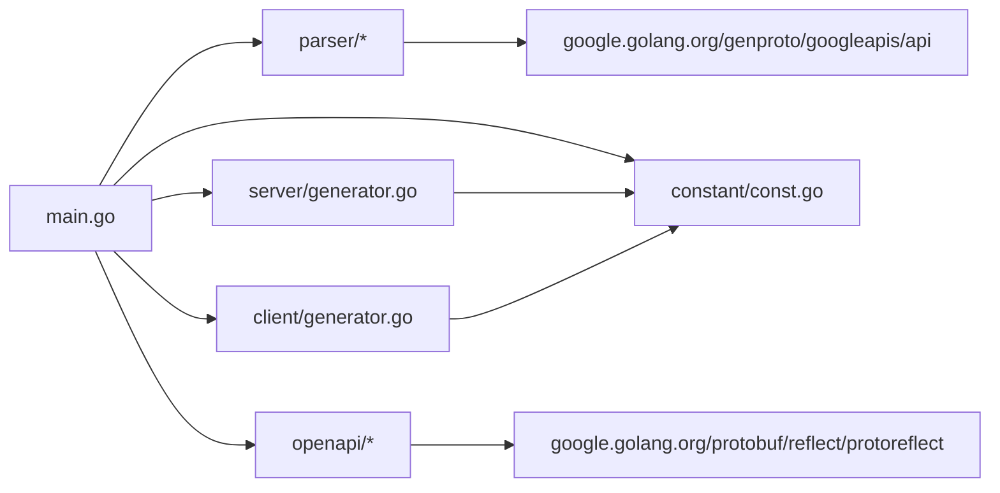

# Protocol Buffers 代码生成

<cite>
**本文引用的文件**
- [cmd/protoc-gen-goose/main.go](file://cmd/protoc-gen-goose/main.go)
- [cmd/protoc-gen-goose/parser/service.go](file://cmd/protoc-gen-goose/parser/service.go)
- [cmd/protoc-gen-goose/parser/endpoint.go](file://cmd/protoc-gen-goose/parser/endpoint.go)
- [cmd/protoc-gen-goose/parser/pattern.go](file://cmd/protoc-gen-goose/parser/pattern.go)
- [cmd/protoc-gen-goose/server/generator.go](file://cmd/protoc-gen-goose/server/generator.go)
- [cmd/protoc-gen-goose/client/generator.go](file://cmd/protoc-gen-goose/client/generator.go)
- [cmd/protoc-gen-goose/constant/const.go](file://cmd/protoc-gen-goose/constant/const.go)
- [cmd/protoc-gen-goose/openapi/generator.go](file://cmd/protoc-gen-goose/openapi/generator.go)
- [cmd/protoc-gen-goose/openapi/schema.go](file://cmd/protoc-gen-goose/openapi/schema.go)
- [cmd/protoc-gen-goose/openapi/mapper.go](file://cmd/protoc-gen-goose/openapi/mapper.go)
- [example/user/user.proto](file://example/user/user.proto)
- [example/body/body.proto](file://example/body/body.proto)
- [example/path/path.proto](file://example/path/path.proto)
- [example/query/query.proto](file://example/query/query.proto)
- [go.mod](file://go.mod)
</cite>

## 更新摘要
**所做更改**
- 新增完整的 Protocol Buffers 代码生成系统文档
- 添加 protoc 插件使用指南和工作原理说明
- 完善解析器系统的详细分析
- 更新服务器端和客户端代码生成器的实现细节
- 扩展 OpenAPI 文档生成器的功能说明
- 增加自定义生成选项和配置方法
- 提供具体的 .proto 文件示例和生成结果对照

## 目录
1. [简介](#简介)
2. [项目结构](#项目结构)
3. [核心组件](#核心组件)
4. [架构总览](#架构总览)
5. [详细组件分析](#详细组件分析)
6. [依赖关系分析](#依赖关系分析)
7. [性能考虑](#性能考虑)
8. [故障排查指南](#故障排查指南)
9. [结论](#结论)
10. [附录：使用示例与生成结果](#附录使用示例与生成结果)

## 简介
本文档系统性阐述 Goose 的 Protocol Buffers 代码生成体系，重点围绕 protoc 插件的工作原理与使用方法展开。内容覆盖：
- .proto 文件解析流程（HTTP 注解、路径模式、参数提取）
- 生成的 Go 代码结构（服务接口、服务器处理器、客户端实现、路由描述）
- OpenAPI 文档生成机制（Schema 收集、路径项生成、响应体映射）
- 自定义生成选项与配置方式
- 具体 .proto 示例与对应生成结果对照，帮助开发者快速掌握从 .proto 到可运行代码的完整流程

## 项目结构
Goose 的代码生成器以 protoc 插件形式存在，核心位于 cmd/protoc-gen-goose 目录下，包含解析器、服务器端生成器、客户端生成器、常量定义以及 OpenAPI 生成模块。示例目录 example 提供多种场景的 .proto 文件，便于验证生成效果。

**图表来源**
- [cmd/protoc-gen-goose/main.go:1-126](file://cmd/protoc-gen-goose/main.go#L1-L126)
- [cmd/protoc-gen-goose/parser/service.go:1-90](file://cmd/protoc-gen-goose/parser/service.go#L1-L90)
- [cmd/protoc-gen-goose/server/generator.go:1-82](file://cmd/protoc-gen-goose/server/generator.go#L1-L82)
- [cmd/protoc-gen-goose/client/generator.go:1-69](file://cmd/protoc-gen-goose/client/generator.go#L1-L69)
- [cmd/protoc-gen-goose/openapi/generator.go:1-286](file://cmd/protoc-gen-goose/openapi/generator.go#L1-L286)
- [cmd/protoc-gen-goose/constant/const.go:1-203](file://cmd/protoc-gen-goose/constant/const.go#L1-L203)
- [example/user/user.proto:1-111](file://example/user/user.proto#L1-L111)
- [example/body/body.proto:1-63](file://example/body/body.proto#L1-L63)
- [example/path/path.proto:1-154](file://example/path/path.proto#L1-L154)
- [example/query/query.proto:1-174](file://example/query/query.proto#L1-L174)

**章节来源**
- [cmd/protoc-gen-goose/main.go:1-126](file://cmd/protoc-gen-goose/main.go#L1-L126)
- [go.mod:1-14](file://go.mod#L1-L14)

## 核心组件
- 解析器（parser）：负责读取 protogen.Service/Method，解析 HTTP 规则、路径模式、请求参数（路径/查询/请求体），并校验不支持的流式 RPC。
- 服务器端生成器（server）：生成路由注册函数、HTTP 处理器、请求解码器、响应编码器等。
- 客户端生成器（client）：生成客户端构造函数、客户端结构体、请求编码器、响应解码器等。
- 常量模块（constant）：统一管理生成代码中使用的 Go 标识符（如 net/http、github.com/soyacen/goose 包内类型等）。
- OpenAPI 生成器（openapi）：收集消息 Schema，生成 OpenAPI 3.0 路径项与文档，并输出 JSON 文件。

**章节来源**
- [cmd/protoc-gen-goose/parser/service.go:1-90](file://cmd/protoc-gen-goose/parser/service.go#L1-L90)
- [cmd/protoc-gen-goose/parser/endpoint.go:1-243](file://cmd/protoc-gen-goose/parser/endpoint.go#L1-L243)
- [cmd/protoc-gen-goose/server/generator.go:1-82](file://cmd/protoc-gen-goose/server/generator.go#L1-L82)
- [cmd/protoc-gen-goose/client/generator.go:1-69](file://cmd/protoc-gen-goose/client/generator.go#L1-L69)
- [cmd/protoc-gen-goose/constant/const.go:1-203](file://cmd/protoc-gen-goose/constant/const.go#L1-L203)
- [cmd/protoc-gen-goose/openapi/generator.go:1-286](file://cmd/protoc-gen-goose/openapi/generator.go#L1-L286)

## 架构总览
protoc 插件在运行时接收 protogen.Plugin，遍历每个需要生成的文件与服务，执行以下流程：
- 解析服务与端点，设置 HTTP 方法与路径，解析路径参数与查询参数，确定请求体字段或整体消息。
- 生成服务接口定义与路由描述常量。
- 生成服务器端：路由注册函数、处理函数、请求解码器、响应编码器。
- 生成客户端：客户端构造函数、客户端结构体、请求编码器、响应解码器。
- 可选：生成 OpenAPI 文档（JSON），包含路径项、参数、请求体、响应与 Schema。

**图表来源**
- [cmd/protoc-gen-goose/main.go:38-101](file://cmd/protoc-gen-goose/main.go#L38-L101)
- [cmd/protoc-gen-goose/server/generator.go:13-40](file://cmd/protoc-gen-goose/server/generator.go#L13-L40)
- [cmd/protoc-gen-goose/client/generator.go:11-34](file://cmd/protoc-gen-goose/client/generator.go#L11-L34)
- [cmd/protoc-gen-goose/openapi/generator.go:13-61](file://cmd/protoc-gen-goose/openapi/generator.go#L13-L61)

## 详细组件分析

### 解析器（Service/Endpoint/Pattern）
- Service：封装 protogen.Service，派生服务名、方法名、路由名、编解码器名等；遍历 Method 构建 Endpoint 列表。
- Endpoint：解析 HTTP 规则（google.api.http），推导 HTTP 方法与路径；解析路径参数与查询参数；确定请求体字段或整体消息；校验路径参数不支持列表/映射及未知消息类型。
- Pattern：解析 goose 风格路径模式（支持 {name}、{name...}、{$}），并进行合法性检查（如重复命名、位置约束）。

**图表来源**
- [cmd/protoc-gen-goose/parser/service.go:10-89](file://cmd/protoc-gen-goose/parser/service.go#L10-L89)
- [cmd/protoc-gen-goose/parser/endpoint.go:16-242](file://cmd/protoc-gen-goose/parser/endpoint.go#L16-L242)
- [cmd/protoc-gen-goose/parser/pattern.go:14-178](file://cmd/protoc-gen-goose/parser/pattern.go#L14-L178)

**章节来源**
- [cmd/protoc-gen-goose/parser/service.go:63-89](file://cmd/protoc-gen-goose/parser/service.go#L63-L89)
- [cmd/protoc-gen-goose/parser/endpoint.go:58-161](file://cmd/protoc-gen-goose/parser/endpoint.go#L58-L161)
- [cmd/protoc-gen-goose/parser/endpoint.go:181-242](file://cmd/protoc-gen-goose/parser/endpoint.go#L181-L242)
- [cmd/protoc-gen-goose/parser/pattern.go:81-178](file://cmd/protoc-gen-goose/parser/pattern.go#L81-L178)

### 服务器端代码生成
- 路由注册函数：创建 ServeMux，组装服务端选项，将每个端点注册到指定 HTTP 方法+路径。
- 处理器：包含服务实例、请求解码器、响应编码器、错误编码器、中间件链与校验回调；每个端点生成一个处理函数，负责解码请求、校验、调用服务、编码响应。
- 请求/响应编解码器：按端点参数来源（路径/查询/请求体）生成相应编码/解码逻辑。

**图表来源**
- [cmd/protoc-gen-goose/server/generator.go:13-40](file://cmd/protoc-gen-goose/server/generator.go#L13-L40)
- [cmd/protoc-gen-goose/server/generator.go:42-81](file://cmd/protoc-gen-goose/server/generator.go#L42-L81)

**章节来源**
- [cmd/protoc-gen-goose/server/generator.go:13-81](file://cmd/protoc-gen-goose/server/generator.go#L13-L81)

### 客户端代码生成
- 客户端构造函数：根据目标地址与选项创建客户端，注入请求编码器、响应解码器、中间件链与校验回调。
- 客户端结构体：包含底层 HTTP 客户端、编码器、解码器、失败快速返回策略与校验回调。
- 请求/响应编解码器：按端点参数来源生成编码/解码逻辑，最终通过中间件链与 Invoke 调用底层客户端。

**图表来源**
- [cmd/protoc-gen-goose/client/generator.go:11-34](file://cmd/protoc-gen-goose/client/generator.go#L11-L34)
- [cmd/protoc-gen-goose/client/generator.go:36-68](file://cmd/protoc-gen-goose/client/generator.go#L36-L68)

**章节来源**
- [cmd/protoc-gen-goose/client/generator.go:11-68](file://cmd/protoc-gen-goose/client/generator.go#L11-L68)

### OpenAPI 文档生成
- Schema 收集：递归遍历所有端点的输入/输出消息，跳过已访问与已知类型，生成对象 Schema 并记录到 components/schemas。
- 路径项生成：将每个端点的路径规范化（移除特定后缀），按 HTTP 方法写入 PathItem；合并同路径不同方法。
- 参数与请求体：基于端点参数解析生成 path/query 参数；根据 HTTP 方法与 body 设置请求体。
- 响应：依据 HTTP 方法推断状态码（200/201/204），处理 google.api.HttpBody 与 google.rpc.HttpResponse 的动态内容。

**图表来源**
- [cmd/protoc-gen-goose/openapi/generator.go:13-61](file://cmd/protoc-gen-goose/openapi/generator.go#L13-L61)
- [cmd/protoc-gen-goose/openapi/schema.go:25-40](file://cmd/protoc-gen-goose/openapi/schema.go#L25-L40)
- [cmd/protoc-gen-goose/openapi/mapper.go:8-28](file://cmd/protoc-gen-goose/openapi/mapper.go#L8-L28)

**章节来源**
- [cmd/protoc-gen-goose/openapi/generator.go:63-286](file://cmd/protoc-gen-goose/openapi/generator.go#L63-L286)
- [cmd/protoc-gen-goose/openapi/schema.go:52-134](file://cmd/protoc-gen-goose/openapi/schema.go#L52-L134)
- [cmd/protoc-gen-goose/openapi/mapper.go:64-136](file://cmd/protoc-gen-goose/openapi/mapper.go#L64-L136)

### 常量与标识符
- 统一管理生成代码中的 Go 标识符，包括标准库（net/http、context、protojson）、第三方（google.golang.org/protobuf）以及 Goose 自身包内的类型与函数名，确保生成代码的一致性与可维护性。

**章节来源**
- [cmd/protoc-gen-goose/constant/const.go:7-203](file://cmd/protoc-gen-goose/constant/const.go#L7-L203)

## 依赖关系分析
- 插件入口依赖 protogen 与 google.golang.org/genproto/googleapis/api，用于读取 .proto 元数据与 HTTP 注解。
- 解析器依赖 protogen 与 x/exp/slices，结合 google.golang.org/genproto 的 annotations.HttpRule。
- 服务器/客户端生成器依赖 constant 中的标识符集合，间接依赖 Goose 的 server/client 包。
- OpenAPI 生成器依赖 protogen 与 protoreflect，配合 well-known 类型映射生成 Schema。

**图表来源**
- [cmd/protoc-gen-goose/main.go:3-17](file://cmd/protoc-gen-goose/main.go#L3-L17)
- [cmd/protoc-gen-goose/parser/endpoint.go:8-14](file://cmd/protoc-gen-goose/parser/endpoint.go#L8-L14)
- [cmd/protoc-gen-goose/openapi/schema.go:4-9](file://cmd/protoc-gen-goose/openapi/schema.go#L4-L9)
- [go.mod:5-13](file://go.mod#L5-L13)

**章节来源**
- [cmd/protoc-gen-goose/main.go:3-17](file://cmd/protoc-gen-goose/main.go#L3-L17)
- [go.mod:5-13](file://go.mod#L5-L13)

## 性能考虑
- 生成器采用单次遍历完成服务/端点解析与代码生成，避免重复扫描。
- OpenAPI 生成仅在显式启用时执行，减少不必要的 JSON 序列化开销。
- Schema 收集使用 visited 去重，避免重复生成相同消息的 Schema。
- 路由注册与处理函数均通过常量标识符复用，降低字符串拼接与反射成本。

## 故障排查指南
- 流式 RPC 不受支持：若 .proto 中定义了 streaming 方法，解析阶段会直接报错，需改为普通 RPC。
- 路径参数类型限制：路径参数不支持列表、映射与非内置包装类型以外的消息；请改用查询参数或请求体。
- HTTP 注解缺失：未提供 google.api.http 选项时，默认使用 POST 且 body 为 "star"，路径为 "/<服务全名>/<方法名>"。
- OpenAPI 生成失败：检查是否正确导入 google.api.annotations.proto；确认消息类型为已知类型或可生成 Schema。

**章节来源**
- [cmd/protoc-gen-goose/parser/service.go:74-77](file://cmd/protoc-gen-goose/parser/service.go#L74-L77)
- [cmd/protoc-gen-goose/parser/endpoint.go:82-112](file://cmd/protoc-gen-goose/parser/endpoint.go#L82-L112)
- [cmd/protoc-gen-goose/parser/endpoint.go:181-192](file://cmd/protoc-gen-goose/parser/endpoint.go#L181-L192)
- [cmd/protoc-gen-goose/openapi/generator.go:50-53](file://cmd/protoc-gen-goose/openapi/generator.go#L50-L53)

## 结论
Goose 的 protoc 插件将 .proto 中的 RPC 与 google.api.http 注解无缝转换为可运行的服务器与客户端代码，并可选生成 OpenAPI 文档。其设计强调：
- 明确的解析规则与严格的参数类型约束
- 一致的代码生成模板与可扩展的中间件链
- 可选的 OpenAPI 输出，便于 API 文档与联调

建议在 .proto 中明确标注 HTTP 行为，合理组织请求体与路径/查询参数，以获得更清晰的生成代码与 OpenAPI 文档。

## 附录：使用示例与生成结果

### 示例一：用户服务（基础 CRUD）
- .proto 片段要点
  - 使用 google.api.annotations.proto
  - 定义多个 RPC，分别映射到 GET/POST/PUT/DELETE/PATCH
  - body 为 "*" 或指定字段
- 生成结果
  - 服务接口：定义每个端点方法签名
  - 路由描述：每个端点包含 HTTP 方法、路径与完整方法名
  - 服务器端：AppendXxxHttpRoute 注册函数、处理器、编解码器
  - 客户端：NewXxxHttpClient 构造函数、客户端结构体、编解码器
  - OpenAPI：路径项、参数、请求体与响应 Schema

**章节来源**
- [example/user/user.proto:10-62](file://example/user/user.proto#L10-L62)

### 示例二：请求体类型（星号体、命名体、HttpBody、HttpRequest）
- .proto 片段要点
  - body 为 "*" 与具体字段名
  - 使用 google.api.HttpBody 与 google.rpc.HttpRequest
- 生成结果
  - OpenAPI 请求体：根据 body 选择整消息或子字段 Schema
  - 服务器端：请求体解析与 HttpBody 特殊处理
  - 客户端：请求体编码与 HttpBody 处理

**章节来源**
- [example/body/body.proto:11-51](file://example/body/body.proto#L11-L51)
- [cmd/protoc-gen-goose/openapi/generator.go:133-165](file://cmd/protoc-gen-goose/openapi/generator.go#L133-L165)

### 示例三：路径参数（布尔/整数/浮点/字符串/枚举与多段）
- .proto 片段要点
  - 路径包含 {name}、{name...} 与 "{$}"
  - 支持可选字段与包装类型
- 生成结果
  - OpenAPI 参数：path 参数必填；Schema 来源于字段类型映射
  - 服务器端：路径参数解析与类型转换

**章节来源**
- [example/path/path.proto:9-154](file://example/path/path.proto#L9-L154)
- [cmd/protoc-gen-goose/openapi/generator.go:100-119](file://cmd/protoc-gen-goose/openapi/generator.go#L100-L119)

### 示例四：查询参数（布尔/整数/浮点/字符串/枚举与数组）
- .proto 片段要点
  - 查询参数支持标量、可选、包装类型与数组
- 生成结果
  - OpenAPI 参数：query 参数非必填；数组参数映射为 OpenAPI 数组 Schema

**章节来源**
- [example/query/query.proto:9-174](file://example/query/query.proto#L9-L174)
- [cmd/protoc-gen-goose/openapi/generator.go:111-119](file://cmd/protoc-gen-goose/openapi/generator.go#L111-L119)