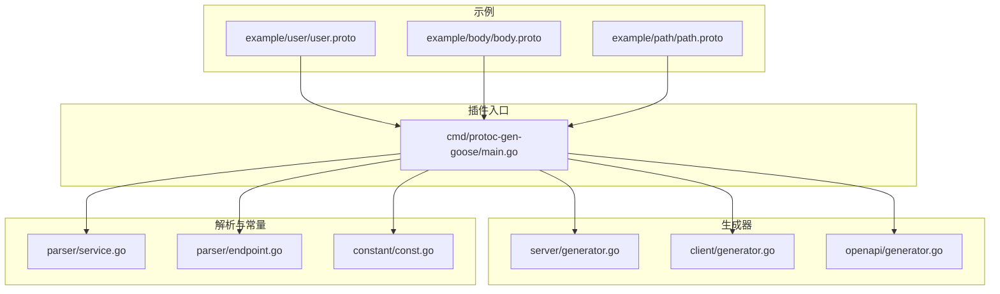
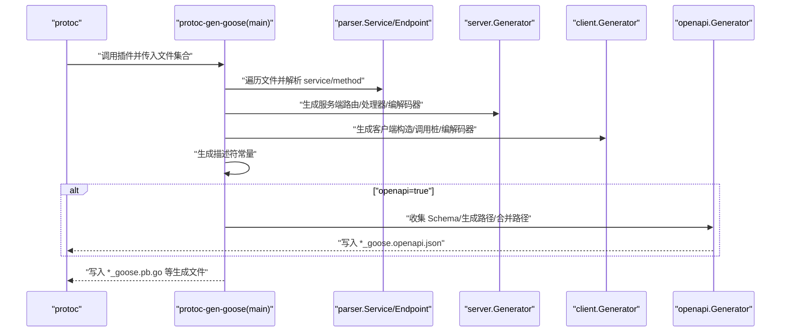
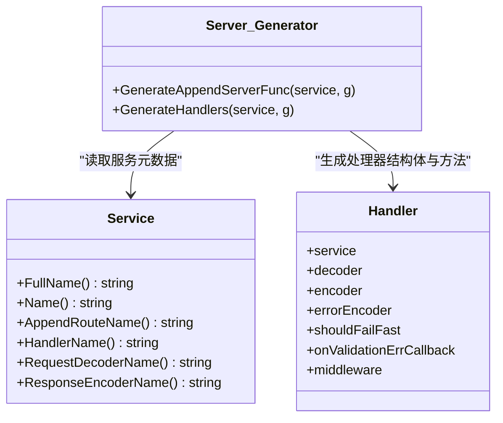
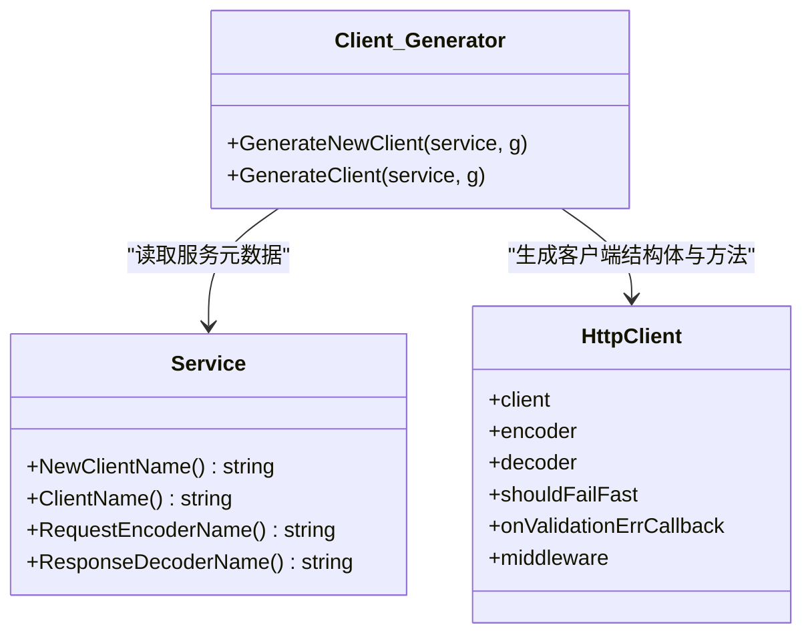
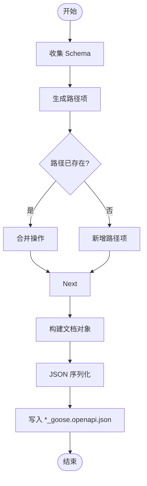
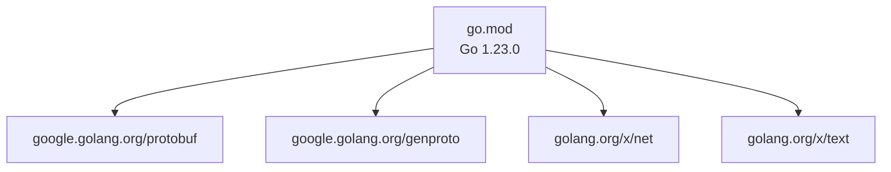

# protoc 插件使用

<cite>
**本文引用的文件**
- [main.go](file://cmd/protoc-gen-goose/main.go)
- [go.mod](file://go.mod)
- [README.md](file://README.md)
- [Makefile](file://Makefile)
- [generator.go](file://cmd/protoc-gen-goose/client/generator.go)
- [generator.go](file://cmd/protoc-gen-goose/server/generator.go)
- [generator.go](file://cmd/protoc-gen-goose/openapi/generator.go)
- [const.go](file://cmd/protoc-gen-goose/constant/const.go)
- [service.go](file://cmd/protoc-gen-goose/parser/service.go)
- [endpoint.go](file://cmd/protoc-gen-goose/parser/endpoint.go)
- [user.proto](file://example/user/user.proto)
- [body.proto](file://example/body/body.proto)
- [path.proto](file://example/path/path.proto)
</cite>

## 目录
1. [简介](#简介)
2. [项目结构](#项目结构)
3. [核心组件](#核心组件)
4. [架构总览](#架构总览)
5. [详细组件分析](#详细组件分析)
6. [依赖关系分析](#依赖关系分析)
7. [性能考虑](#性能考虑)
8. [故障排查指南](#故障排查指南)
9. [结论](#结论)
10. [附录](#附录)

## 简介
本文件面向希望使用 protoc-gen-goose 插件的开发者，系统介绍插件的安装、配置与使用方法，解释命令行参数、版本管理策略、与 protoc 编译器的集成方式，并提供完整的安装步骤、环境配置与基础使用示例，帮助快速上手。

protoc-gen-goose 是一个基于 .proto 文件的 Protobuf + HTTP/REST 代码生成插件，能够：
- 从 .proto 中的 service 生成服务端路由绑定与 HTTP 处理器
- 生成客户端调用桩代码
- 可选生成 OpenAPI 3.0.3 文档
- 支持路径参数、查询参数、请求体映射与响应体定制
- 与 Goose 生态的编码器、解码器、中间件无缝配合

## 项目结构
仓库采用多模块与分层组织方式：
- cmd/protoc-gen-goose：插件主程序与各子生成器（客户端、服务端、OpenAPI）
- client/server/middleware：运行时库与中间件
- example：示例 proto 与生成产物，演示插件使用与验证
- internal/tools：内部工具与构建脚本

图表来源
- [main.go:1-126](file://cmd/protoc-gen-goose/main.go#L1-L126)
- [generator.go:1-82](file://cmd/protoc-gen-goose/server/generator.go#L1-L82)
- [generator.go:1-69](file://cmd/protoc-gen-goose/client/generator.go#L1-L69)
- [generator.go:1-286](file://cmd/protoc-gen-goose/openapi/generator.go#L1-L286)
- [service.go:1-90](file://cmd/protoc-gen-goose/parser/service.go#L1-L90)
- [endpoint.go:1-243](file://cmd/protoc-gen-goose/parser/endpoint.go#L1-L243)
- [const.go:1-203](file://cmd/protoc-gen-goose/constant/const.go#L1-L203)
- [user.proto:1-111](file://example/user/user.proto#L1-L111)
- [body.proto:1-63](file://example/body/body.proto#L1-L63)
- [path.proto:1-154](file://example/path/path.proto#L1-L154)

章节来源
- [README.md:1-125](file://README.md#L1-L125)
- [go.mod:1-14](file://go.mod#L1-L14)

## 核心组件
- 插件入口与生命周期
  - 解析命令行参数，支持 --version 输出版本信息
  - 注册 protogen 插件回调，设置 SupportedFeatures
  - 遍历待生成文件，过滤未标记生成的文件与不含 service 的文件
  - 生成服务接口、服务端/客户端代码、描述符、可选 OpenAPI 文档

- 生成器职责
  - 服务端生成器：生成路由挂载函数、HTTP 处理器、请求/响应编解码器桥接
  - 客户端生成器：生成客户端构造函数、客户端结构体、请求编码器与响应解码器
  - OpenAPI 生成器：收集消息 Schema、生成路径项、合并重复路径、输出 JSON 文档

- 解析器与常量
  - Service/Endpoint 抽象：封装 protogen.Service/Method，解析 HTTP 规则、路径模式、参数类型约束
  - 常量集中：统一导入 Go 标准库与 Goose 运行时标识符，避免硬编码

章节来源
- [main.go:26-101](file://cmd/protoc-gen-goose/main.go#L26-L101)
- [generator.go:11-82](file://cmd/protoc-gen-goose/server/generator.go#L11-L82)
- [generator.go:9-69](file://cmd/protoc-gen-goose/client/generator.go#L9-L69)
- [generator.go:13-61](file://cmd/protoc-gen-goose/openapi/generator.go#L13-L61)
- [service.go:10-89](file://cmd/protoc-gen-goose/parser/service.go#L10-L89)
- [endpoint.go:16-243](file://cmd/protoc-gen-goose/parser/endpoint.go#L16-L243)
- [const.go:7-203](file://cmd/protoc-gen-goose/constant/const.go#L7-L203)

## 架构总览
下图展示了从 protoc 到生成代码与 OpenAPI 文档的整体流程：

图表来源
- [main.go:38-101](file://cmd/protoc-gen-goose/main.go#L38-L101)
- [generator.go:13-40](file://cmd/protoc-gen-goose/server/generator.go#L13-L40)
- [generator.go:11-34](file://cmd/protoc-gen-goose/client/generator.go#L11-L34)
- [generator.go:13-61](file://cmd/protoc-gen-goose/openapi/generator.go#L13-L61)

## 详细组件分析

### 插件入口与命令行参数
- 版本查询：当仅传入 --version 时，打印插件名与版本后退出
- 参数注册：通过 flags.Set 将 --goose_opt 传递给插件
- 生成流程：对每个需生成的文件，解析其 service，生成服务接口、服务端/客户端代码、描述符；若启用 openapi，则额外生成 OpenAPI 文档

章节来源
- [main.go:19-36](file://cmd/protoc-gen-goose/main.go#L19-L36)
- [main.go:94-98](file://cmd/protoc-gen-goose/main.go#L94-L98)

### 服务端生成器
- 路由挂载函数：接收路由器实例与服务接口，构造处理器，按 HTTP 方法与路径注册路由
- 处理器结构体：包含服务接口、请求解码器、响应编码器、错误编码器、校验开关与中间件链
- 处理器方法：解码请求 -> 校验 -> 调用服务接口 -> 编码响应 -> 中间件链包装

图表来源
- [generator.go:11-82](file://cmd/protoc-gen-goose/server/generator.go#L11-L82)
- [service.go:10-61](file://cmd/protoc-gen-goose/parser/service.go#L10-L61)

章节来源
- [generator.go:13-81](file://cmd/protoc-gen-goose/server/generator.go#L13-L81)

### 客户端生成器
- 客户端构造函数：接收目标地址与可选项，初始化客户端、请求编码器、响应解码器、中间件链
- 客户端结构体：包含底层 HTTP 客户端、编码器、解码器、校验开关与中间件
- 客户端方法：参数校验 -> 请求编码 -> 中间件链调用 -> 响应解码 -> 返回结果

图表来源
- [generator.go:9-69](file://cmd/protoc-gen-goose/client/generator.go#L9-L69)
- [service.go:47-61](file://cmd/protoc-gen-goose/parser/service.go#L47-L61)

章节来源
- [generator.go:11-68](file://cmd/protoc-gen-goose/client/generator.go#L11-L68)

### OpenAPI 生成器
- Schema 收集：遍历服务与消息，提取字段类型与约束，生成组件 Schema
- 路径生成：将每个端点转换为 OpenAPI 路径项，合并同路径不同方法
- 文档构建：组装 OpenAPI 版本、信息、路径与组件，序列化为 JSON 写入文件

图表来源
- [generator.go:13-61](file://cmd/protoc-gen-goose/openapi/generator.go#L13-L61)
- [generator.go:63-130](file://cmd/protoc-gen-goose/openapi/generator.go#L63-L130)
- [generator.go:167-240](file://cmd/protoc-gen-goose/openapi/generator.go#L167-L240)

章节来源
- [generator.go:13-286](file://cmd/protoc-gen-goose/openapi/generator.go#L13-L286)

### 解析器与常量
- Service/Endpoint：封装 protogen 元信息，解析 HTTP 规则、路径模式、参数类型约束，确保路径参数不支持列表/映射等
- 常量集中：统一管理 Go 标准库与 Goose 运行时标识符，便于生成器引用

章节来源
- [service.go:10-89](file://cmd/protoc-gen-goose/parser/service.go#L10-L89)
- [endpoint.go:58-161](file://cmd/protoc-gen-goose/parser/endpoint.go#L58-L161)
- [const.go:67-190](file://cmd/protoc-gen-goose/constant/const.go#L67-L190)

## 依赖关系分析
- Go 版本与外部依赖
  - Go 语言版本要求：1.23.0
  - 关键依赖：google.golang.org/protobuf、google.golang.org/genproto 系列、golang.org/x/net 等
- 插件与运行时耦合
  - 生成代码依赖 Goose 的运行时库（服务端/客户端编解码器、中间件、工具函数）

图表来源
- [go.mod:3-13](file://go.mod#L3-L13)

章节来源
- [go.mod:1-14](file://go.mod#L1-L14)

## 性能考虑
- 零反射：生成代码基于类型安全的编解码器，避免反射开销
- 低依赖：仅依赖必要的标准库与 protobuf，减小二进制体积与启动时间
- 高效路由：基于 Go 标准库 ServeMux，路由匹配与中间件链高效稳定
- 可选 OpenAPI：仅在需要时开启，避免不必要的 JSON 序列化与磁盘 IO

## 故障排查指南
- 不支持流式 RPC
  - 若 .proto 中定义了流式方法，解析阶段会报错并终止生成
  - 建议将流式场景移至其他传输方案（如 gRPC）
- 路径参数类型限制
  - 路径参数不支持列表、映射与非标量类型（除特定包装类型外）
  - 如出现类型不支持错误，请调整 .proto 中的字段类型或改用查询参数
- HTTP 规则缺失
  - 若未显式设置 google.api.http 选项，将回退为默认规则（POST /{full.method.name}，body:*）
  - 建议显式声明 HTTP 规则以获得预期的路由与请求体映射
- OpenAPI 生成失败
  - JSON 序列化失败会返回错误，检查消息 Schema 是否包含不可序列化类型
  - 确认 openapi=true 已正确传入 --goose_opt

章节来源
- [service.go:74-76](file://cmd/protoc-gen-goose/parser/service.go#L74-L76)
- [endpoint.go:82-112](file://cmd/protoc-gen-goose/parser/endpoint.go#L82-L112)
- [endpoint.go:181-191](file://cmd/protoc-gen-goose/parser/endpoint.go#L181-L191)
- [generator.go:50-53](file://cmd/protoc-gen-goose/openapi/generator.go#L50-L53)

## 结论
protoc-gen-goose 通过清晰的分层设计与严格的 .proto 解析，提供了从 Protobuf 到 HTTP/REST 的完整代码生成能力。结合 Goose 运行时库与中间件生态，开发者可以快速搭建高性能、可维护的 REST 服务与客户端。建议在生产环境中：
- 显式声明 HTTP 规则
- 控制路径参数类型
- 按需启用 OpenAPI 生成
- 使用中间件增强服务可观测性与安全性

## 附录

### 安装与版本管理
- 推荐使用 go install 安装最新版本插件，以便被 protoc 自动发现
- 也可在仓库根目录使用 go build 或 Makefile 的 install 目标进行本地安装
- 版本号在插件入口中定义，可通过 --version 查看

章节来源
- [README.md:36-46](file://README.md#L36-L46)
- [Makefile:6-8](file://Makefile#L6-L8)
- [main.go:22-29](file://cmd/protoc-gen-goose/main.go#L22-L29)

### 与 protoc 的集成
- 基本调用
  - 同时启用 --go_out、--go-grpc_out、--goose_out
  - 使用 --proto_path 指定 proto 搜索路径
- 生成 OpenAPI
  - 添加 --goose_opt=openapi=true
- 示例命令参考
  - 仓库 README 提供了典型 protoc 调用示例与生成产物说明

章节来源
- [README.md:48-71](file://README.md#L48-L71)

### 命令行参数与选项
- --version：打印插件名称与版本
- --goose_opt=openapi=true：启用 OpenAPI 文档生成
- --goose_opt=paths=source_relative：控制生成路径策略（与 --goose_out 搭配）

章节来源
- [main.go:27-30](file://cmd/protoc-gen-goose/main.go#L27-L30)
- [main.go:94-98](file://cmd/protoc-gen-goose/main.go#L94-L98)
- [Makefile:14-25](file://Makefile#L14-L25)

### 基础使用示例
- user 示例
  - 展示多种 HTTP 方法与路径参数、请求体映射
- body 示例
  - 展示星号体、命名体、HttpBody、HttpRequest 等场景
- path 示例
  - 展示布尔、整型、浮点、字符串、枚举等路径参数类型

章节来源
- [user.proto:7-62](file://example/user/user.proto#L7-L62)
- [body.proto:10-51](file://example/body/body.proto#L10-L51)
- [path.proto:9-154](file://example/path/path.proto#L9-L154)