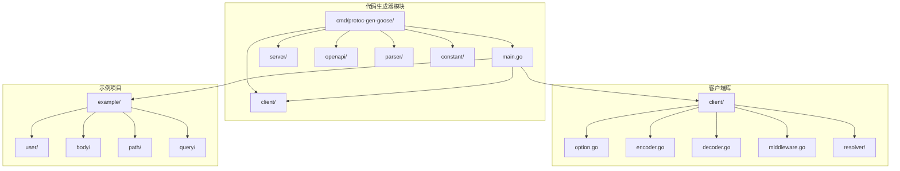
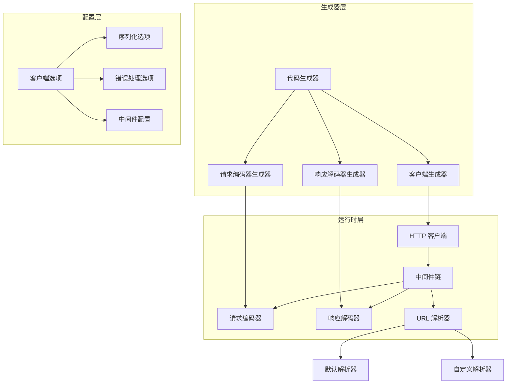
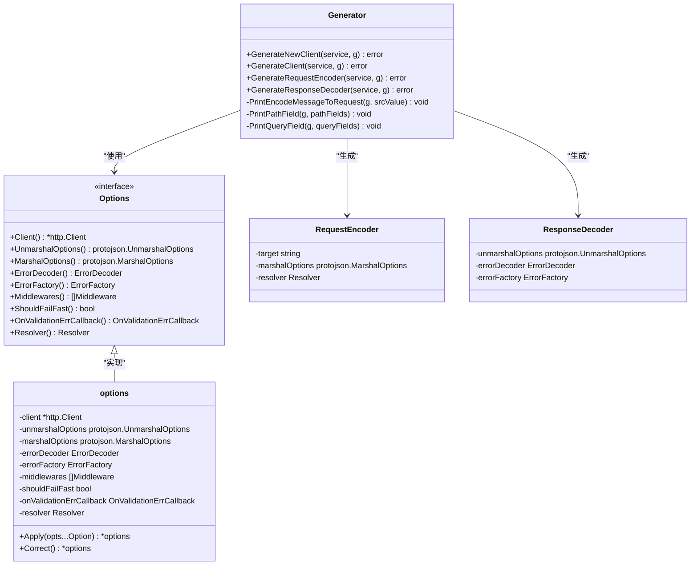
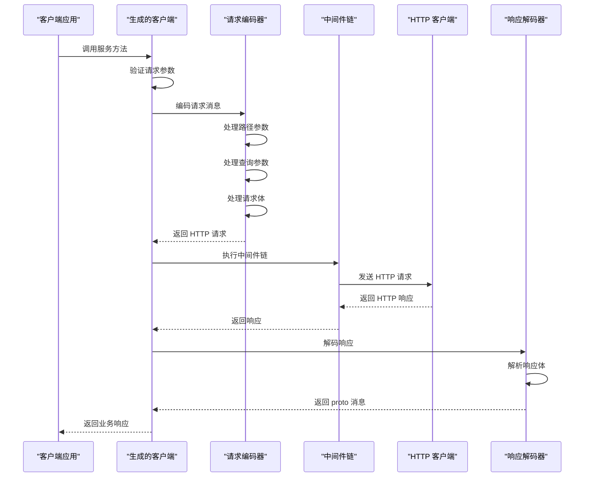
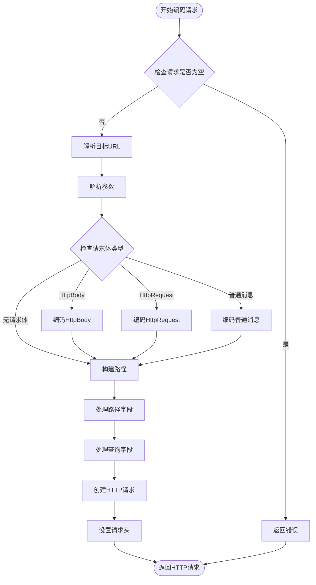
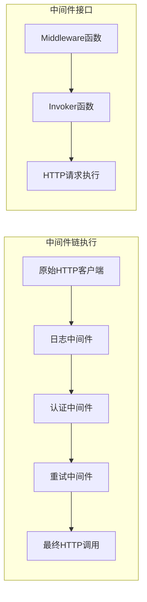
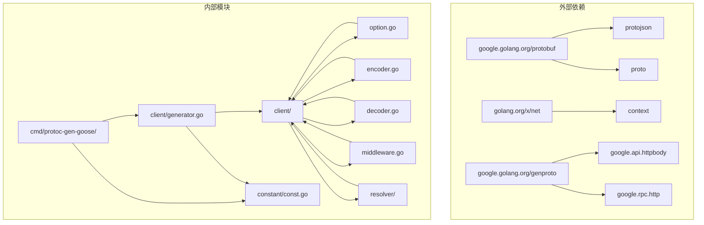

# 客户端代码生成器

<cite>
**本文档引用的文件**
- [main.go](file://cmd/protoc-gen-goose/main.go)
- [generator.go](file://cmd/protoc-gen-goose/client/generator.go)
- [request.go](file://cmd/protoc-gen-goose/client/request.go)
- [response.go](file://cmd/protoc-gen-goose/client/response.go)
- [const.go](file://cmd/protoc-gen-goose/constant/const.go)
- [option.go](file://client/option.go)
- [encoder.go](file://client/encoder.go)
- [decoder.go](file://client/decoder.go)
- [middleware.go](file://client/middleware.go)
- [default.go](file://client/resolver/default.go)
- [resolver.go](file://client/resolver/resolver.go)
- [error.go](file://client/resolver/error.go)
- [user_goose.pb.go](file://example/user/user_goose.pb.go)
- [user_test.go](file://example/user/user_test.go)
- [go.mod](file://go.mod)
</cite>

## 目录
1. [简介](#简介)
2. [项目结构](#项目结构)
3. [核心组件](#核心组件)
4. [架构概览](#架构概览)
5. [详细组件分析](#详细组件分析)
6. [依赖关系分析](#依赖关系分析)
7. [性能考虑](#性能考虑)
8. [故障排除指南](#故障排除指南)
9. [结论](#结论)

## 简介

客户端代码生成器是一个基于 Protocol Buffers 的 Go 语言客户端代码生成工具，专门用于为 gRPC/HTTP 服务生成类型安全的 HTTP 客户端代码。该工具通过解析 `.proto` 文件中的服务定义，自动生成完整的客户端实现，包括 HTTP 客户端、连接器、请求编码器和响应解码器。

该生成器的核心优势在于：
- **类型安全**：基于 proto 消息类型生成强类型的客户端接口
- **自动化**：完全自动化生成客户端代码，减少手动编写工作量
- **灵活配置**：支持丰富的配置选项，包括中间件、错误处理、序列化等
- **标准化**：遵循 HTTP RESTful 设计规范，支持路径参数、查询参数、请求体等多种数据传输方式

## 项目结构

该项目采用模块化设计，主要包含以下核心目录：

**图表来源**
- [main.go:1-126](file://cmd/protoc-gen-goose/main.go#L1-L126)
- [option.go:1-279](file://client/option.go#L1-L279)

**章节来源**
- [main.go:1-126](file://cmd/protoc-gen-goose/main.go#L1-L126)
- [go.mod:1-14](file://go.mod#L1-L14)

## 核心组件

### 代码生成器主入口

代码生成器的主入口位于 `cmd/protoc-gen-goose/main.go`，负责协调整个代码生成流程。它实现了标准的 protoc 插件接口，能够接收 proto 文件输入并输出生成的 Go 代码。

### 客户端生成器

客户端生成器 (`client/generator.go`) 是核心组件，负责生成完整的客户端实现。它包含以下主要功能：

- **NewClient 函数生成**：创建客户端实例的工厂函数
- **客户端结构体生成**：包含 HTTP 客户端、请求编码器、响应解码器等组件
- **端点方法生成**：为每个服务端点生成对应的客户端调用方法

### 请求编码器

请求编码器 (`client/request.go`) 负责将 proto 消息转换为 HTTP 请求。它支持多种数据传输格式：
- 原始 proto 消息 JSON 序列化
- Google Api HttpBody 格式
- RPC Http 请求格式

### 响应解码器

响应解码器 (`client/response.go`) 处理 HTTP 响应并将其转换为 proto 消息：
- JSON 响应解码
- HttpBody 响应处理
- Rpc HttpResponse 格式支持

**章节来源**
- [generator.go:1-69](file://cmd/protoc-gen-goose/client/generator.go#L1-L69)
- [request.go:1-355](file://cmd/protoc-gen-goose/client/request.go#L1-L355)
- [response.go:1-83](file://cmd/protoc-gen-goose/client/response.go#L1-L83)

## 架构概览

客户端代码生成器采用分层架构设计，确保各组件职责清晰、耦合度低：

**图表来源**
- [main.go:38-101](file://cmd/protoc-gen-goose/main.go#L38-L101)
- [generator.go:9-34](file://cmd/protoc-gen-goose/client/generator.go#L9-L34)

## 详细组件分析

### 客户端生成器类图

**图表来源**
- [generator.go:9-68](file://cmd/protoc-gen-goose/client/generator.go#L9-L68)
- [option.go:12-53](file://client/option.go#L12-L53)

### 客户端调用流程序列图

**图表来源**
- [generator.go:46-66](file://cmd/protoc-gen-goose/client/generator.go#L46-L66)
- [middleware.go:76-99](file://client/middleware.go#L76-L99)

### 请求编码算法流程图

**图表来源**
- [request.go:18-76](file://cmd/protoc-gen-goose/client/request.go#L18-L76)

### 中间件链实现

中间件链采用装饰器模式实现，支持多个中间件按顺序执行：

**图表来源**
- [middleware.go:21-55](file://client/middleware.go#L21-L55)

**章节来源**
- [generator.go:1-69](file://cmd/protoc-gen-goose/client/generator.go#L1-L69)
- [request.go:1-355](file://cmd/protoc-gen-goose/client/request.go#L1-L355)
- [response.go:1-83](file://cmd/protoc-gen-goose/client/response.go#L1-L83)
- [middleware.go:1-99](file://client/middleware.go#L1-L99)

## 依赖关系分析

客户端代码生成器的依赖关系相对简洁，主要依赖于标准库和 Google Protobuf 库：

**图表来源**
- [go.mod:5-13](file://go.mod#L5-L13)
- [main.go:3-17](file://cmd/protoc-gen-goose/main.go#L3-L17)

**章节来源**
- [go.mod:1-14](file://go.mod#L1-L14)
- [const.go:1-203](file://cmd/protoc-gen-goose/constant/const.go#L1-L203)

## 性能考虑

### 序列化性能优化

客户端在序列化方面采用了多项优化措施：
- **缓冲区复用**：使用 bytes.Buffer 减少内存分配
- **条件序列化**：仅在需要时进行 JSON 序列化
- **流式处理**：支持大响应体的流式读取

### 连接管理

- **HTTP 客户端配置**：支持自定义超时、重试等配置
- **连接池优化**：利用标准库的连接池机制
- **并发安全**：确保多 goroutine 下的安全性

### 内存使用

- **零拷贝优化**：在可能的情况下避免不必要的数据复制
- **延迟初始化**：按需创建中间件和编码器实例
- **资源清理**：确保响应体正确关闭，避免内存泄漏

## 故障排除指南

### 常见问题及解决方案

#### URL 解析错误
当目标 URL 不支持或格式不正确时，会抛出 `ResolverError` 异常。解决方法：
- 确保使用正确的 URL 格式（如 `http://host:port/path`）
- 注册相应的 URL 解析器
- 检查网络连接状态

#### 请求编码失败
请求编码失败通常由以下原因引起：
- proto 消息格式不正确
- 缺少必需的字段
- 数据类型不匹配

#### 响应解码异常
响应解码异常的常见原因：
- HTTP 状态码非 2xx
- 响应体格式不符合预期
- JSON 解析错误

#### 中间件执行错误
中间件链中任何环节的错误都会导致请求失败：
- 检查中间件的正确性
- 确保中间件按正确的顺序排列
- 验证中间件的配置参数

**章节来源**
- [error.go:9-27](file://client/resolver/error.go#L9-L27)
- [request.go:18-38](file://cmd/protoc-gen-goose/client/request.go#L18-L38)
- [decoder.go:16-37](file://client/decoder.go#L16-L37)

## 结论

客户端代码生成器提供了一个完整、高效且易于使用的 HTTP 客户端解决方案。通过自动化代码生成，开发者可以专注于业务逻辑实现，而无需担心底层的 HTTP 通信细节。

### 主要优势

1. **类型安全**：基于 proto 消息的强类型接口
2. **开发效率**：大幅减少重复代码编写工作
3. **可维护性**：统一的代码风格和架构模式
4. **扩展性**：灵活的配置选项和中间件系统
5. **性能优化**：针对序列化和网络通信的多项优化

### 使用建议

1. **合理配置中间件**：根据实际需求选择合适的中间件组合
2. **优化序列化选项**：根据数据特点调整 protojson 的序列化配置
3. **监控和日志**：添加适当的日志记录以便问题排查
4. **错误处理**：实现完善的错误处理和重试机制
5. **测试覆盖**：编写充分的单元测试和集成测试

该生成器为现代微服务架构提供了坚实的客户端基础设施，能够有效提升开发效率和系统可靠性。