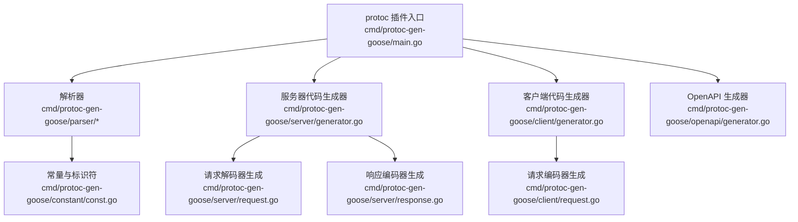
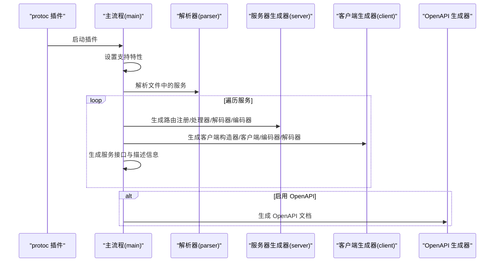
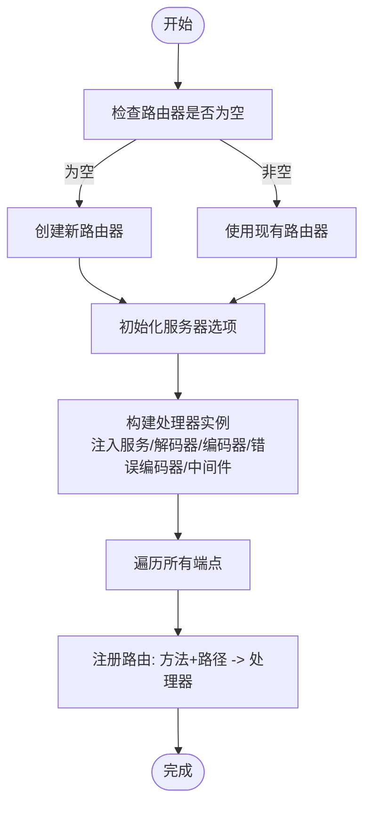
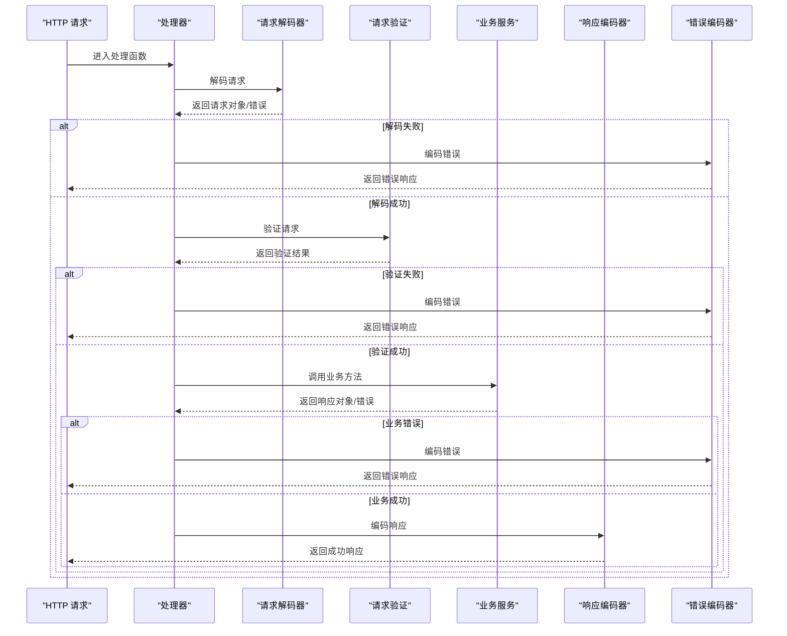
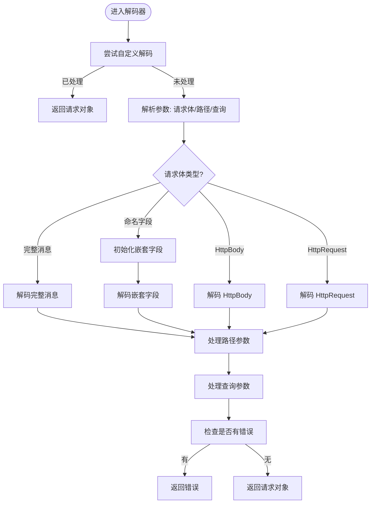
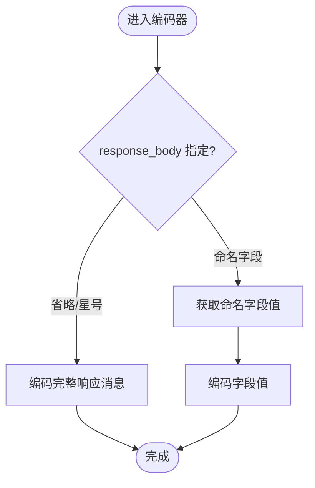
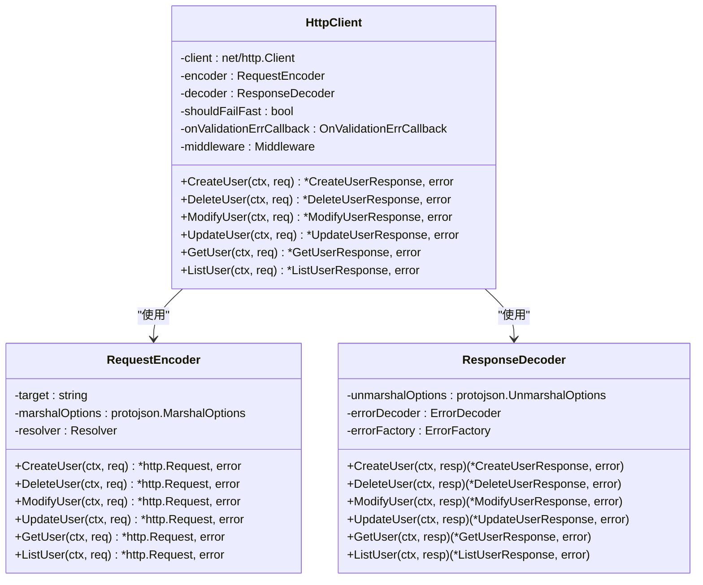
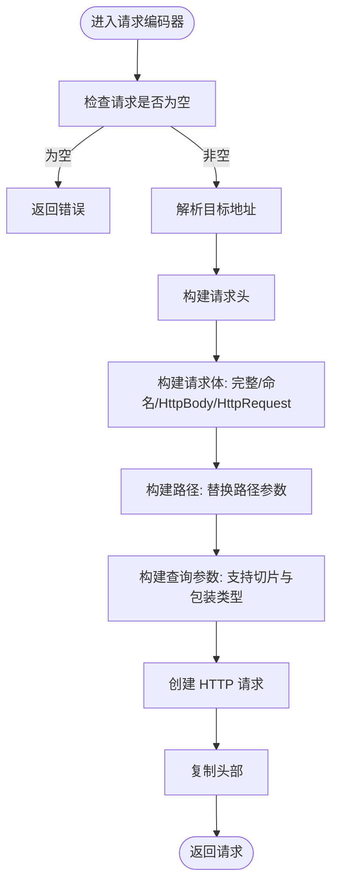
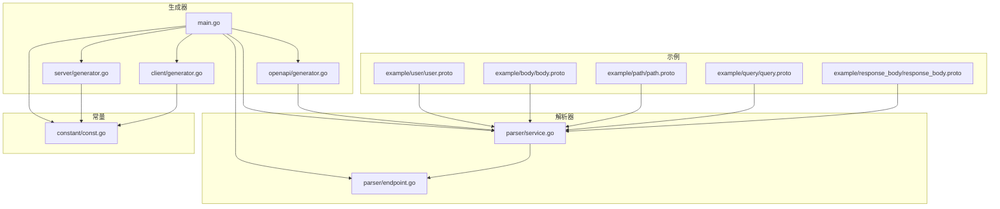

# 服务器代码生成器

<cite>
**本文档引用的文件**
- [cmd/protoc-gen-goose/main.go](file://cmd/protoc-gen-goose/main.go)
- [cmd/protoc-gen-goose/server/generator.go](file://cmd/protoc-gen-goose/server/generator.go)
- [cmd/protoc-gen-goose/client/generator.go](file://cmd/protoc-gen-goose/client/generator.go)
- [cmd/protoc-gen-goose/server/request.go](file://cmd/protoc-gen-goose/server/request.go)
- [cmd/protoc-gen-goose/server/response.go](file://cmd/protoc-gen-goose/server/response.go)
- [cmd/protoc-gen-goose/client/request.go](file://cmd/protoc-gen-goose/client/request.go)
- [cmd/protoc-gen-goose/parser/service.go](file://cmd/protoc-gen-goose/parser/service.go)
- [cmd/protoc-gen-goose/parser/endpoint.go](file://cmd/protoc-gen-goose/parser/endpoint.go)
- [cmd/protoc-gen-goose/constant/const.go](file://cmd/protoc-gen-goose/constant/const.go)
- [cmd/protoc-gen-goose/openapi/generator.go](file://cmd/protoc-gen-goose/openapi/generator.go)
- [example/user/user.proto](file://example/user/user.proto)
- [example/body/body.proto](file://example/body/body.proto)
- [example/path/path.proto](file://example/path/path.proto)
- [example/query/query.proto](file://example/query/query.proto)
- [example/response_body/response_body.proto](file://example/response_body/response_body.proto)
</cite>

## 目录
1. [简介](#简介)
2. [项目结构](#项目结构)
3. [核心组件](#核心组件)
4. [架构总览](#架构总览)
5. [详细组件分析](#详细组件分析)
6. [依赖关系分析](#依赖关系分析)
7. [性能考虑](#性能考虑)
8. [故障排除指南](#故障排除指南)
9. [结论](#结论)
10. [附录](#附录)

## 简介
本项目是一个基于 Protocol Buffers 的代码生成器，用于自动生成 HTTP 服务器端与客户端的配套代码。它通过解析 `.proto` 文件中的服务定义与 HTTP 注解，自动生成以下内容：
- 服务器端：HTTP 路由注册函数、HTTP 处理函数、请求解码器（从 HTTP 请求解码到 Protobuf 消息）、响应编码器（从 Protobuf 响应编码到 HTTP 响应）
- 客户端：HTTP 客户端构造器、HTTP 客户端结构体、请求编码器（从 Protobuf 请求编码到 HTTP 请求）、响应解码器（从 HTTP 响应解码到 Protobuf 响应）
- 可选：OpenAPI 文档生成

该生成器遵循“约定优于配置”的原则，结合 Google API HTTP 规则注解，自动推导 HTTP 方法、路径、请求体字段与响应体字段，从而减少手写样板代码的工作量。

## 项目结构
生成器采用模块化设计，按功能划分为多个子包：
- cmd/protoc-gen-goose：插件入口与主流程控制
- cmd/protoc-gen-goose/parser：解析 .proto 文件的服务与端点信息
- cmd/protoc-gen-goose/server：生成服务器端代码（路由、处理器、请求解码器、响应编码器）
- cmd/protoc-gen-goose/client：生成客户端代码（客户端构造器、客户端结构体、请求编码器、响应解码器）
- cmd/protoc-gen-goose/constant：统一管理生成代码所需的 Go 标准库与内部包标识符
- cmd/protoc-gen-goose/openapi：根据解析结果生成 OpenAPI 文档
- example：示例 .proto 文件，展示不同场景下的 HTTP 映射规则

**图表来源**
- [cmd/protoc-gen-goose/main.go:1-126](file://cmd/protoc-gen-goose/main.go#L1-L126)
- [cmd/protoc-gen-goose/server/generator.go:1-82](file://cmd/protoc-gen-goose/server/generator.go#L1-L82)
- [cmd/protoc-gen-goose/client/generator.go:1-69](file://cmd/protoc-gen-goose/client/generator.go#L1-L69)
- [cmd/protoc-gen-goose/openapi/generator.go:1-286](file://cmd/protoc-gen-goose/openapi/generator.go#L1-L286)

**章节来源**
- [cmd/protoc-gen-goose/main.go:26-101](file://cmd/protoc-gen-goose/main.go#L26-L101)
- [cmd/protoc-gen-goose/parser/service.go:63-89](file://cmd/protoc-gen-goose/parser/service.go#L63-L89)

## 核心组件
- 插件入口与主流程：负责遍历所有需要生成的 .proto 文件，解析服务与端点，调用各子生成器生成代码，并可选生成 OpenAPI 文档。
- 解析器：提取服务名、端点名、HTTP 方法与路径、请求/响应消息类型、请求体字段与响应体字段等元数据。
- 服务器生成器：生成路由注册函数、HTTP 处理器、请求解码器与响应编码器。
- 客户端生成器：生成客户端构造器、客户端结构体、请求编码器与响应解码器。
- 常量与标识符：集中管理所有生成代码中使用的外部包标识符，确保导入与调用的一致性。
- OpenAPI 生成器：基于解析结果构建 OpenAPI 3.0 文档，包含路径项、参数、请求体与响应定义。

**章节来源**
- [cmd/protoc-gen-goose/main.go:38-101](file://cmd/protoc-gen-goose/main.go#L38-L101)
- [cmd/protoc-gen-goose/parser/service.go:10-90](file://cmd/protoc-gen-goose/parser/service.go#L10-L90)
- [cmd/protoc-gen-goose/constant/const.go:7-203](file://cmd/protoc-gen-goose/constant/const.go#L7-L203)

## 架构总览
生成器的整体工作流如下：
1. 插件入口接收 protoc 插件调用，设置支持特性并运行生成流程。
2. 遍历每个文件，若文件被标记为需要生成且包含服务，则进行解析。
3. 对每个服务，生成服务接口定义与描述信息。
4. 服务器侧：生成路由注册函数、HTTP 处理器、请求解码器、响应编码器。
5. 客户端侧：生成客户端构造器、客户端结构体、请求编码器、响应解码器。
6. 若启用 OpenAPI 选项，则生成 OpenAPI 文档。

**图表来源**
- [cmd/protoc-gen-goose/main.go:26-101](file://cmd/protoc-gen-goose/main.go#L26-L101)
- [cmd/protoc-gen-goose/server/generator.go:13-40](file://cmd/protoc-gen-goose/server/generator.go#L13-L40)
- [cmd/protoc-gen-goose/client/generator.go:11-34](file://cmd/protoc-gen-goose/client/generator.go#L11-L34)
- [cmd/protoc-gen-goose/openapi/generator.go:15-61](file://cmd/protoc-gen-goose/openapi/generator.go#L15-L61)

## 详细组件分析

### 服务器端代码生成

#### 路由注册函数
- 功能：将服务的所有端点注册到 HTTP 路由器上，支持自定义路由器或默认路由器。
- 关键点：根据端点的 HTTP 方法与路径生成路由条目；初始化处理器，注入服务实例、请求解码器、响应编码器、错误编码器、验证策略与中间件链。

**图表来源**
- [cmd/protoc-gen-goose/server/generator.go:13-40](file://cmd/protoc-gen-goose/server/generator.go#L13-L40)

**章节来源**
- [cmd/protoc-gen-goose/server/generator.go:13-40](file://cmd/protoc-gen-goose/server/generator.go#L13-L40)

#### HTTP 处理器
- 功能：为每个端点生成 HTTP 处理函数，负责：
  - 使用请求解码器从 HTTP 请求解码为 Protobuf 请求对象
  - 执行请求验证
  - 调用业务服务方法
  - 使用响应编码器将 Protobuf 响应编码为 HTTP 响应
  - 错误处理：任何阶段出错均交由错误编码器处理
- 中间件：通过中间件链包装处理流程，支持统一的日志、限流、鉴权等横切关注点。

**图表来源**
- [cmd/protoc-gen-goose/server/generator.go:54-79](file://cmd/protoc-gen-goose/server/generator.go#L54-L79)

**章节来源**
- [cmd/protoc-gen-goose/server/generator.go:42-81](file://cmd/protoc-gen-goose/server/generator.go#L42-L81)

#### 请求解码器
- 功能：将 HTTP 请求解码为 Protobuf 消息，支持多种参数来源：
  - 请求体：支持完整消息体、命名字段体、HttpBody、HttpRequest
  - 路径参数：从 URL 路径中提取并转换为目标字段类型
  - 查询参数：从 URL 查询字符串中提取并转换为目标字段类型（包括切片与包装类型的特殊处理）
- 类型支持：布尔、整数（含有符号/无符号、32/64位）、浮点（32/64位）、字符串、枚举、消息（含 google.protobuf.*Value 包装类型）

**图表来源**
- [cmd/protoc-gen-goose/server/request.go:13-81](file://cmd/protoc-gen-goose/server/request.go#L13-L81)
- [cmd/protoc-gen-goose/server/request.go:101-195](file://cmd/protoc-gen-goose/server/request.go#L101-L195)
- [cmd/protoc-gen-goose/server/request.go:197-357](file://cmd/protoc-gen-goose/server/request.go#L197-L357)

**章节来源**
- [cmd/protoc-gen-goose/server/request.go:13-81](file://cmd/protoc-gen-goose/server/request.go#L13-L81)
- [cmd/protoc-gen-goose/server/request.go:101-357](file://cmd/protoc-gen-goose/server/request.go#L101-L357)

#### 响应编码器
- 功能：将 Protobuf 响应对象编码为 HTTP 响应，支持多种响应体形式：
  - 完整消息体：默认编码
  - 命名字段体：从响应消息中提取指定字段作为响应体
  - HttpBody：直接编码为二进制/动态内容
  - HttpResponse：编码为原始 HTTP 响应
- 状态码：根据 HTTP 方法自动选择合适的响应状态码（如 POST 201、DELETE 204 等）

**图表来源**
- [cmd/protoc-gen-goose/server/response.go:12-55](file://cmd/protoc-gen-goose/server/response.go#L12-L55)

**章节来源**
- [cmd/protoc-gen-goose/server/response.go:12-55](file://cmd/protoc-gen-goose/server/response.go#L12-L55)

### 客户端代码生成

#### 客户端构造器与客户端结构体
- 功能：生成客户端构造器与客户端结构体，注入底层 HTTP 客户端、请求编码器、响应解码器、错误解码器与工厂、验证策略与中间件链。
- 使用方式：通过构造器传入目标地址与选项，得到可调用的客户端实例。

**图表来源**
- [cmd/protoc-gen-goose/client/generator.go:11-34](file://cmd/protoc-gen-goose/client/generator.go#L11-L34)
- [cmd/protoc-gen-goose/client/generator.go:36-68](file://cmd/protoc-gen-goose/client/generator.go#L36-L68)

**章节来源**
- [cmd/protoc-gen-goose/client/generator.go:11-34](file://cmd/protoc-gen-goose/client/generator.go#L11-L34)
- [cmd/protoc-gen-goose/client/generator.go:36-68](file://cmd/protoc-gen-goose/client/generator.go#L36-L68)

#### 请求编码器
- 功能：将 Protobuf 请求对象编码为 HTTP 请求，支持：
  - 请求体：完整消息体、命名字段体、HttpBody、HttpRequest
  - 路径参数：将字段值格式化后替换到路径模板
  - 查询参数：将字段值格式化后拼接到查询字符串（支持切片与包装类型）
- 地址解析：支持通过解析器解析最终目标地址。

**图表来源**
- [cmd/protoc-gen-goose/client/request.go:18-76](file://cmd/protoc-gen-goose/client/request.go#L18-L76)
- [cmd/protoc-gen-goose/client/request.go:96-110](file://cmd/protoc-gen-goose/client/request.go#L96-L110)
- [cmd/protoc-gen-goose/client/request.go:156-274](file://cmd/protoc-gen-goose/client/request.go#L156-L274)

**章节来源**
- [cmd/protoc-gen-goose/client/request.go:12-76](file://cmd/protoc-gen-goose/client/request.go#L12-L76)
- [cmd/protoc-gen-goose/client/request.go:96-274](file://cmd/protoc-gen-goose/client/request.go#L96-L274)

#### 响应解码器
- 功能：将 HTTP 响应解码为 Protobuf 响应对象，支持：
  - 完整消息体：默认解码
  - HttpBody：解码为二进制/动态内容
  - 错误解码：通过错误解码器与错误工厂处理错误响应
- 验证：在调用前执行请求验证，确保输入有效。

**章节来源**
- [cmd/protoc-gen-goose/client/generator.go:36-68](file://cmd/protoc-gen-goose/client/generator.go#L36-L68)

### 解析器与常量系统

#### 解析器
- 作用：从 .proto 文件中提取服务与端点信息，解析 HTTP 规则，确定 HTTP 方法、路径、请求体字段与响应体字段，并校验路径参数类型限制（不支持列表/映射）。
- 名称生成：为服务、处理器、解码器、编码器、客户端等生成一致的名称模式，便于代码生成与调用。

**章节来源**
- [cmd/protoc-gen-goose/parser/service.go:10-90](file://cmd/protoc-gen-goose/parser/service.go#L10-L90)
- [cmd/protoc-gen-goose/parser/endpoint.go:58-161](file://cmd/protoc-gen-goose/parser/endpoint.go#L58-L161)
- [cmd/protoc-gen-goose/parser/endpoint.go:181-243](file://cmd/protoc-gen-goose/parser/endpoint.go#L181-L243)

#### 常量与标识符
- 统一管理：集中定义所有生成代码中使用的外部包标识符（如 net/http、google.golang.org/protobuf 等），确保生成代码的导入与调用一致性。
- 内部包标识符：封装了请求验证、错误编码、头部拷贝、URL 路径格式化等工具函数的标识符。

**章节来源**
- [cmd/protoc-gen-goose/constant/const.go:7-203](file://cmd/protoc-gen-goose/constant/const.go#L7-L203)

### OpenAPI 文档生成
- 路径生成：遍历所有服务与端点，生成 OpenAPI 路径项，合并相同路径的不同方法。
- 参数提取：从路径模板与查询参数中提取参数定义，支持基本类型与包装类型。
- 请求体与响应体：根据 HTTP 方法与 response_body 规则生成请求体与响应体定义，支持 HttpBody、HttpResponse 等特殊类型。
- 文档输出：将 OpenAPI 文档以 JSON 形式写入生成文件。

**章节来源**
- [cmd/protoc-gen-goose/openapi/generator.go:15-61](file://cmd/protoc-gen-goose/openapi/generator.go#L15-L61)
- [cmd/protoc-gen-goose/openapi/generator.go:64-130](file://cmd/protoc-gen-goose/openapi/generator.go#L64-L130)
- [cmd/protoc-gen-goose/openapi/generator.go:132-240](file://cmd/protoc-gen-goose/openapi/generator.go#L132-L240)

## 依赖关系分析

**图表来源**
- [cmd/protoc-gen-goose/main.go:1-126](file://cmd/protoc-gen-goose/main.go#L1-L126)
- [cmd/protoc-gen-goose/server/generator.go:1-82](file://cmd/protoc-gen-goose/server/generator.go#L1-L82)
- [cmd/protoc-gen-goose/client/generator.go:1-69](file://cmd/protoc-gen-goose/client/generator.go#L1-L69)
- [cmd/protoc-gen-goose/openapi/generator.go:1-286](file://cmd/protoc-gen-goose/openapi/generator.go#L1-L286)
- [cmd/protoc-gen-goose/parser/service.go:1-90](file://cmd/protoc-gen-goose/parser/service.go#L1-L90)
- [cmd/protoc-gen-goose/parser/endpoint.go:1-243](file://cmd/protoc-gen-goose/parser/endpoint.go#L1-L243)
- [cmd/protoc-gen-goose/constant/const.go:1-203](file://cmd/protoc-gen-goose/constant/const.go#L1-L203)

**章节来源**
- [cmd/protoc-gen-goose/main.go:1-126](file://cmd/protoc-gen-goose/main.go#L1-L126)
- [cmd/protoc-gen-goose/parser/service.go:63-89](file://cmd/protoc-gen-goose/parser/service.go#L63-L89)

## 性能考虑
- 生成代码的性能主要取决于运行时的编解码与网络 I/O，生成器本身仅负责代码生成，不引入额外运行时开销。
- 优化建议：
  - 合理使用中间件链，避免在热路径中添加过多昂贵操作。
  - 在请求解码与响应编码时，尽量复用缓冲区与选项对象，减少重复分配。
  - 对于大体量的查询参数或路径参数，注意字符串拼接与切片操作的成本。

## 故障排除指南
- 流式 RPC 不受支持：解析器会拒绝包含流式 RPC 的服务，生成过程将报错。请将相关方法改为双向 RPC 或分拆为多个非流式方法。
- 路径参数类型限制：路径参数不支持列表或映射类型，也不支持除 google.protobuf.*Value 之外的消息类型。请改用查询参数或请求体。
- 请求体字段缺失：当 HTTP 规则指定命名请求体字段但该字段不存在时，生成器会报错。请检查 .proto 文件中的字段定义与 HTTP 规则。
- 响应体字段缺失：当 HTTP 规则指定命名响应体字段但该字段不存在时，生成器会报错。请检查 .proto 文件中的字段定义与 HTTP 规则。
- OpenAPI 生成异常：若 OpenAPI 文档生成失败，检查解析器收集的模式与路径项是否正确，以及 JSON 序列化过程中是否有错误。

**章节来源**
- [cmd/protoc-gen-goose/parser/service.go:74-77](file://cmd/protoc-gen-goose/parser/service.go#L74-L77)
- [cmd/protoc-gen-goose/parser/endpoint.go:82-84](file://cmd/protoc-gen-goose/parser/endpoint.go#L82-L84)
- [cmd/protoc-gen-goose/parser/endpoint.go:70-72](file://cmd/protoc-gen-goose/parser/endpoint.go#L70-L72)
- [cmd/protoc-gen-goose/server/response.go:36-38](file://cmd/protoc-gen-goose/server/response.go#L36-L38)

## 结论
本服务器端代码生成器通过解析 .proto 文件与 HTTP 注解，自动生成完整的 HTTP 服务器与客户端配套代码，覆盖路由注册、处理函数、请求解码器与响应编码器等核心组件。其模块化设计与统一的常量系统保证了生成代码的一致性与可维护性。配合 OpenAPI 生成能力，开发者可以快速获得可测试、可文档化的 HTTP 接口实现。

## 附录

### 使用示例与生成要点

- 用户服务示例（example/user/user.proto）
  - 支持多种 HTTP 方法与路径风格，包括路径参数与查询参数的组合使用。
  - 生成要点：为每个 RPC 生成对应的 HTTP 路由、处理器、请求解码器与响应编码器；同时生成客户端调用方法。

- 请求体示例（example/body/body.proto）
  - 支持完整请求体、命名请求体字段、HttpBody 与 HttpRequest 的不同编码策略。
  - 生成要点：根据 HTTP 规则选择相应的解码/编码路径，确保二进制与动态内容的正确处理。

- 路径参数示例（example/path/path.proto）
  - 支持布尔、整数、浮点、字符串、枚举与包装类型等多种路径参数类型。
  - 生成要点：路径参数必须是标量类型，生成器会自动进行类型转换与格式化。

- 查询参数示例（example/query/query.proto）
  - 支持标量与切片、包装类型与切片的查询参数处理。
  - 生成要点：查询参数支持多值，生成器会将其编码为标准的 URL 查询字符串。

- 响应体示例（example/response_body/response_body.proto）
  - 支持省略、星号与命名的响应体选择，以及 HttpBody 与 HttpResponse 的特殊处理。
  - 生成要点：根据 response_body 规则决定响应体内容，自动设置合适的 HTTP 状态码。

**章节来源**
- [example/user/user.proto:1-111](file://example/user/user.proto#L1-L111)
- [example/body/body.proto:1-63](file://example/body/body.proto#L1-L63)
- [example/path/path.proto:1-154](file://example/path/path.proto#L1-L154)
- [example/query/query.proto:1-174](file://example/query/query.proto#L1-L174)
- [example/response_body/response_body.proto:1-60](file://example/response_body/response_body.proto#L1-L60)