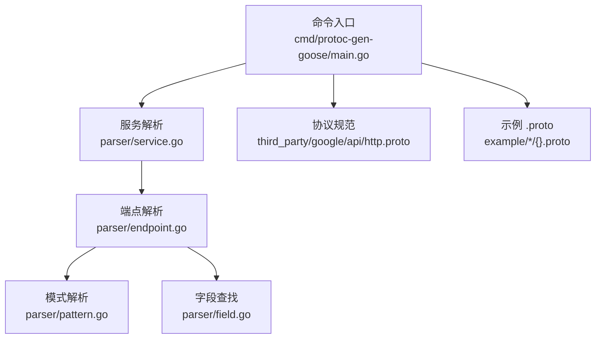
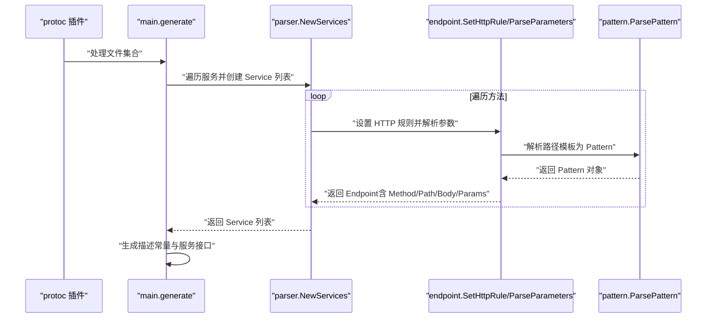
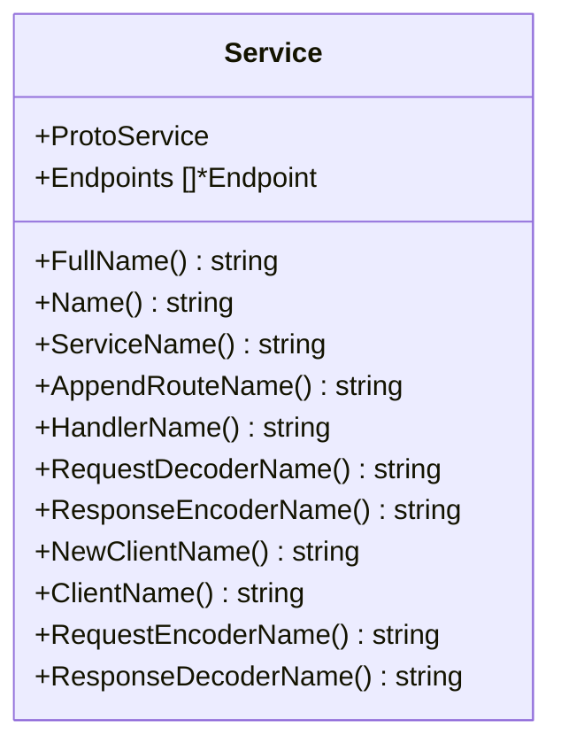
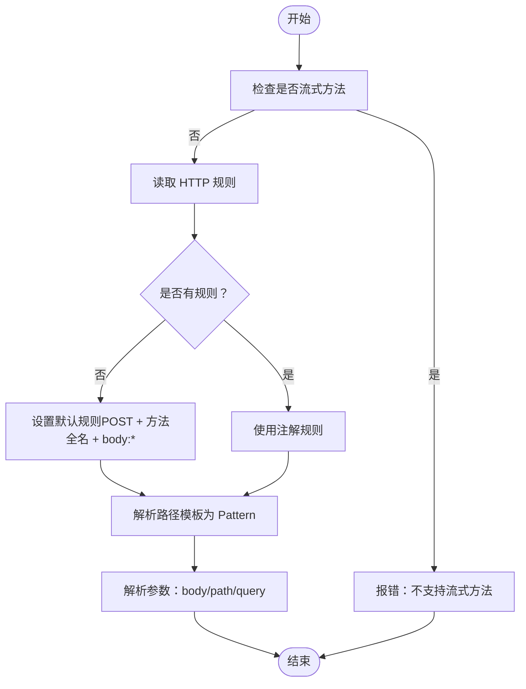
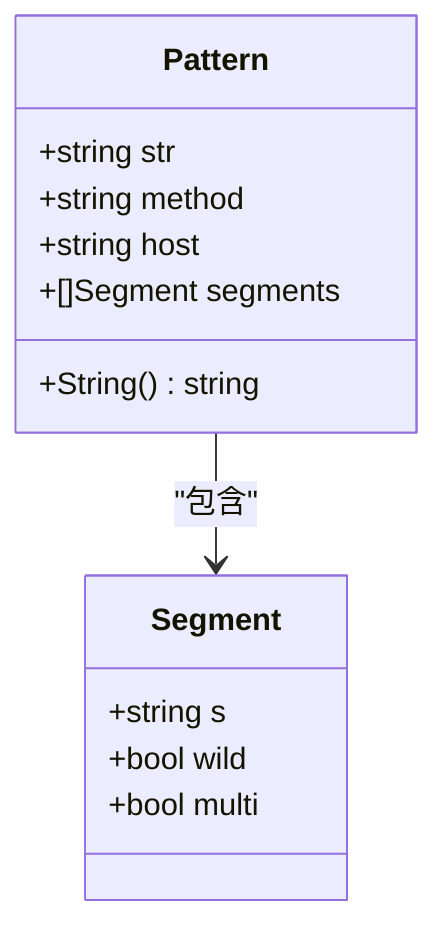
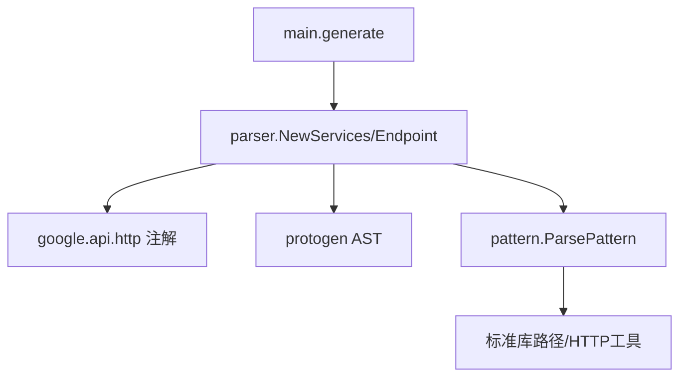

# 解析器系统

<cite>
**本文引用的文件**
- [main.go](file://cmd/protoc-gen-goose/main.go)
- [service.go](file://cmd/protoc-gen-goose/parser/service.go)
- [endpoint.go](file://cmd/protoc-gen-goose/parser/endpoint.go)
- [field.go](file://cmd/protoc-gen-goose/parser/field.go)
- [pattern.go](file://cmd/protoc-gen-goose/parser/pattern.go)
- [http.proto](file://third_party/google/api/http.proto)
- [user.proto](file://example/user/user.proto)
- [body.proto](file://example/body/body.proto)
- [path.proto](file://example/path/path.proto)
</cite>

## 目录
1. [简介](#简介)
2. [项目结构](#项目结构)
3. [核心组件](#核心组件)
4. [架构总览](#架构总览)
5. [详细组件分析](#详细组件分析)
6. [依赖分析](#依赖分析)
7. [性能考虑](#性能考虑)
8. [故障排查指南](#故障排查指南)
9. [结论](#结论)
10. [附录](#附录)

## 简介
本文件深入解析 .proto 文件的解析机制，重点说明 Service、Endpoint、Field 和 Pattern 的解析过程，解释如何从 Protocol Buffers AST 中提取服务定义、HTTP 映射规则和路由信息。文档通过实际 .proto 示例与解析后的数据结构，帮助开发者理解解析器的工作原理与最佳实践。

## 项目结构
解析器位于命令行插件目录中，核心解析逻辑集中在 parser 包内：
- 命令入口：cmd/protoc-gen-goose/main.go
- 解析器模块：cmd/protoc-gen-goose/parser/*.go
- 协议规范：third_party/google/api/http.proto
- 示例 .proto：example/*/{}.proto

图表来源
- [main.go:38-101](file://cmd/protoc-gen-goose/main.go#L38-L101)
- [service.go:63-89](file://cmd/protoc-gen-goose/parser/service.go#L63-L89)
- [endpoint.go:181-192](file://cmd/protoc-gen-goose/parser/endpoint.go#L181-L192)
- [pattern.go:81-178](file://cmd/protoc-gen-goose/parser/pattern.go#L81-L178)
- [field.go:10-20](file://cmd/protoc-gen-goose/parser/field.go#L10-L20)

章节来源
- [main.go:1-126](file://cmd/protoc-gen-goose/main.go#L1-L126)
- [service.go:1-90](file://cmd/protoc-gen-goose/parser/service.go#L1-L90)
- [endpoint.go:1-243](file://cmd/protoc-gen-goose/parser/endpoint.go#L1-L243)
- [pattern.go:1-244](file://cmd/protoc-gen-goose/parser/pattern.go#L1-L244)
- [field.go:1-76](file://cmd/protoc-gen-goose/parser/field.go#L1-L76)

## 核心组件
- Service：封装 protogen.Service，并持有多个 Endpoint；负责命名约定与路由函数名生成。
- Endpoint：封装 protogen.Method，解析 HTTP 规则、路径参数、请求体映射、响应体映射等。
- Pattern：解析路径模板字符串，支持通配符、多段通配、保留段等语义。
- Field：辅助在消息中查找字段，支持 JSON 名称匹配与类型 Go 类型推导。

章节来源
- [service.go:10-29](file://cmd/protoc-gen-goose/parser/service.go#L10-L29)
- [endpoint.go:16-20](file://cmd/protoc-gen-goose/parser/endpoint.go#L16-L20)
- [pattern.go:14-32](file://cmd/protoc-gen-goose/parser/pattern.go#L14-L32)
- [field.go:10-29](file://cmd/protoc-gen-goose/parser/field.go#L10-L29)

## 架构总览
解析流程自上而下：命令入口读取插件输入，遍历每个 .proto 文件中的服务与方法，基于 google.api.http 注解提取 HTTP 映射规则，解析路径模板为 Pattern，再对请求消息进行参数分类（body、path、query），最终生成描述常量与服务接口定义。

图表来源
- [main.go:38-101](file://cmd/protoc-gen-goose/main.go#L38-L101)
- [service.go:63-89](file://cmd/protoc-gen-goose/parser/service.go#L63-L89)
- [endpoint.go:181-192](file://cmd/protoc-gen-goose/parser/endpoint.go#L181-L192)
- [pattern.go:81-178](file://cmd/protoc-gen-goose/parser/pattern.go#L81-L178)

## 详细组件分析

### Service 解析
- 负责遍历 protogen.File 中的服务，为每个方法创建 Endpoint。
- 检查流式方法（不支持），设置默认 HTTP 规则（若未显式配置）。
- 生成服务名称、客户端名称、处理器名称等派生标识符。

图表来源
- [service.go:10-29](file://cmd/protoc-gen-goose/parser/service.go#L10-L29)

章节来源
- [service.go:63-89](file://cmd/protoc-gen-goose/parser/service.go#L63-L89)

### Endpoint 解析
- 提取 HTTP 规则：优先从方法选项中读取 google.api.http；若缺失则默认 POST 到方法全限定名，body 使用“*”。
- 解析路径模板：调用 ParsePattern 获取 Pattern 结构。
- 参数分类：根据 body、path、query 的规则，从输入消息中定位字段并校验类型合法性。
- 方法与路径：根据 HttpRule 的 oneof 字段选择 HTTP 方法与路径。
- 响应体映射：可指定响应体字段名。

图表来源
- [endpoint.go:181-192](file://cmd/protoc-gen-goose/parser/endpoint.go#L181-L192)
- [endpoint.go:58-161](file://cmd/protoc-gen-goose/parser/endpoint.go#L58-L161)
- [pattern.go:81-178](file://cmd/protoc-gen-goose/parser/pattern.go#L81-L178)

章节来源
- [endpoint.go:58-243](file://cmd/protoc-gen-goose/parser/endpoint.go#L58-L243)

### Pattern 解析
- 支持语法：可选方法、可选主机、路径模板；路径段支持字面量、单段通配、多段通配、保留段。
- 校验规则：方法必须为合法 token；路径必须经 clean 后匹配（非 CONNECT）；通配符名需唯一且为有效 Go 标识符；“$”与“...”必须位于末尾。
- 表达形式：内部以 Segment 列表表示，便于后续匹配与生成。

图表来源
- [pattern.go:14-32](file://cmd/protoc-gen-goose/parser/pattern.go#L14-L32)
- [pattern.go:58-62](file://cmd/protoc-gen-goose/parser/pattern.go#L58-L62)

章节来源
- [pattern.go:81-244](file://cmd/protoc-gen-goose/parser/pattern.go#L81-L244)

### Field 辅助
- 在消息中按字段名或 JSON 名称查找字段。
- 推导字段的 Go 类型与指针需求，支持列表、映射、消息类型等复杂结构。

章节来源
- [field.go:10-76](file://cmd/protoc-gen-goose/parser/field.go#L10-L76)

## 依赖分析
- 命令入口依赖解析器模块与生成器模块，负责遍历文件、生成描述常量与服务接口。
- 解析器依赖 protogen AST 与 google.api.http 注解，用于提取 HTTP 映射规则与路径模板。
- Pattern 解析依赖标准库的路径与 HTTP 工具函数，确保路径规范化与通配符合法性。

图表来源
- [main.go:38-101](file://cmd/protoc-gen-goose/main.go#L38-L101)
- [service.go:63-89](file://cmd/protoc-gen-goose/parser/service.go#L63-L89)
- [endpoint.go:181-192](file://cmd/protoc-gen-goose/parser/endpoint.go#L181-L192)
- [pattern.go:81-178](file://cmd/protoc-gen-goose/parser/pattern.go#L81-L178)

章节来源
- [main.go:1-126](file://cmd/protoc-gen-goose/main.go#L1-L126)
- [http.proto:262-318](file://third_party/google/api/http.proto#L262-L318)

## 性能考虑
- 解析阶段仅做一次路径模板解析与字段查找，避免重复计算。
- 通配符去重与合法性校验在解析时完成，减少运行时开销。
- 生成阶段按服务批量输出，降低文件写入次数。

## 故障排查指南
- 流式方法不支持：若方法声明为流式（客户端/服务端任一方向），解析会直接报错。请改为双向 RPC 或使用其他传输方式。
- 路径模板错误：非法方法、主机包含“{”、通配符不在末尾、重复通配符名、空通配符等均会导致解析失败。请检查模板语法。
- 参数类型不合法：路径参数不支持列表、映射与不被允许的消息类型；查询参数排除映射与不被允许的消息类型。请调整 .proto 定义或 body/path 映射。
- 未找到字段：body 或 path 指定的字段在输入消息中不存在，或 JSON 名称不匹配。请核对字段名与 JSON 名称。

章节来源
- [service.go:74-76](file://cmd/protoc-gen-goose/parser/service.go#L74-L76)
- [endpoint.go:78-84](file://cmd/protoc-gen-goose/parser/endpoint.go#L78-L84)
- [endpoint.go:110-112](file://cmd/protoc-gen-goose/parser/endpoint.go#L110-L112)
- [endpoint.go:155-157](file://cmd/protoc-gen-goose/parser/endpoint.go#L155-L157)

## 结论
该解析器系统通过解析 google.api.http 注解与路径模板，将 .proto 中的服务与方法映射到 HTTP 路由与参数绑定，形成统一的描述常量与服务接口定义。其设计清晰、边界明确，既保证了灵活性（支持多种 HTTP 方法、body 映射与通配符），又提供了严格的校验与错误提示，便于开发者快速构建高性能的 HTTP 服务。

## 附录

### 示例 .proto 与解析结果概览
- 用户服务示例：展示 GET/POST/PUT/DELETE/PATCH 多种方法与不同 body 映射策略。
- 请求体示例：演示“*”与命名字段两种 body 映射，以及 google.api.HttpBody 与 google.rpc.Http 的使用。
- 路径参数示例：覆盖布尔、整数、浮点、字符串、枚举与多段通配符等类型与组合。

章节来源
- [user.proto:11-61](file://example/user/user.proto#L11-L61)
- [body.proto:11-50](file://example/body/body.proto#L11-L50)
- [path.proto:9-153](file://example/path/path.proto#L9-L153)

### 关键数据结构与生成产物
- 描述常量：包含 HTTP 方法、路径模板、完整方法名等元信息，供运行时路由注册使用。
- 服务接口：为每个服务生成接口定义，包含所有方法签名。
- 客户端与处理器：生成客户端构造函数、请求编码器、响应解码器与服务器处理器。

章节来源
- [main.go:103-125](file://cmd/protoc-gen-goose/main.go#L103-L125)