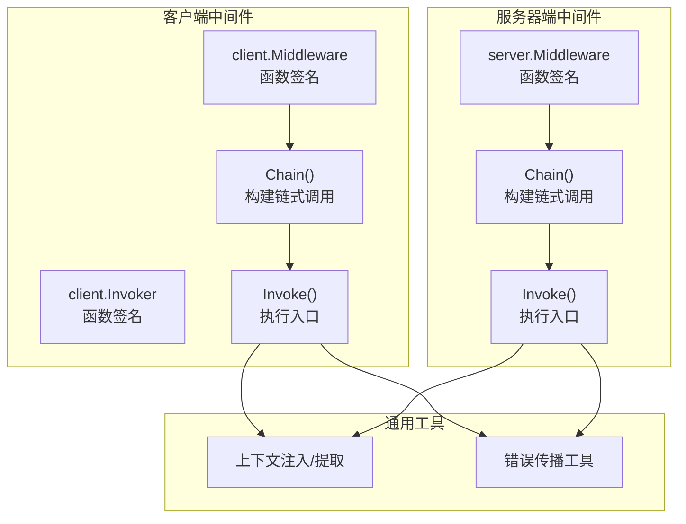
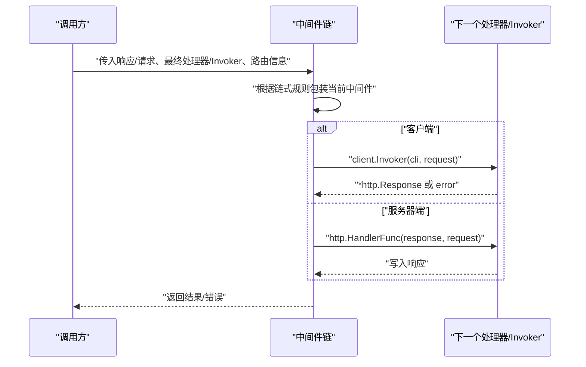
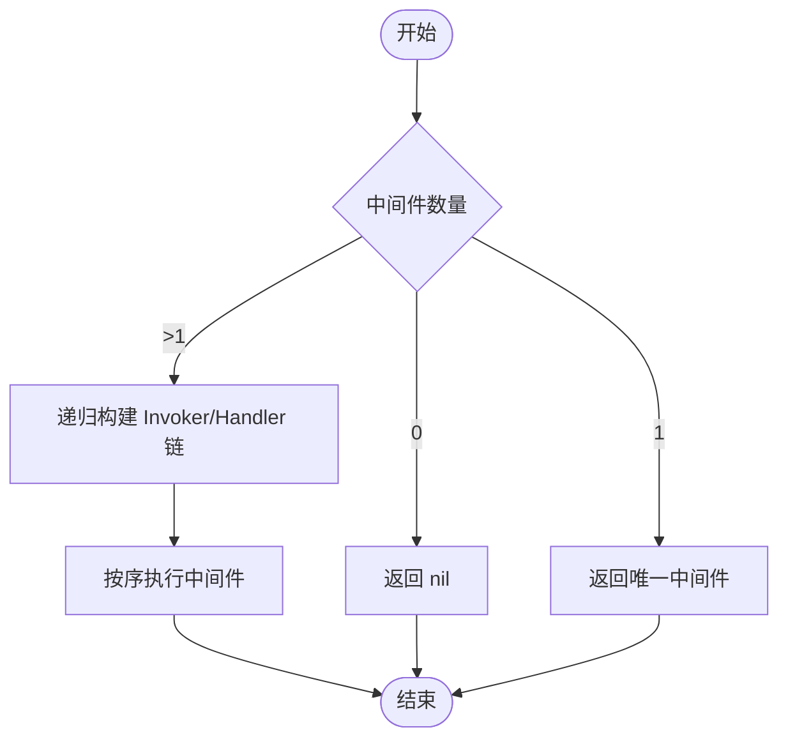
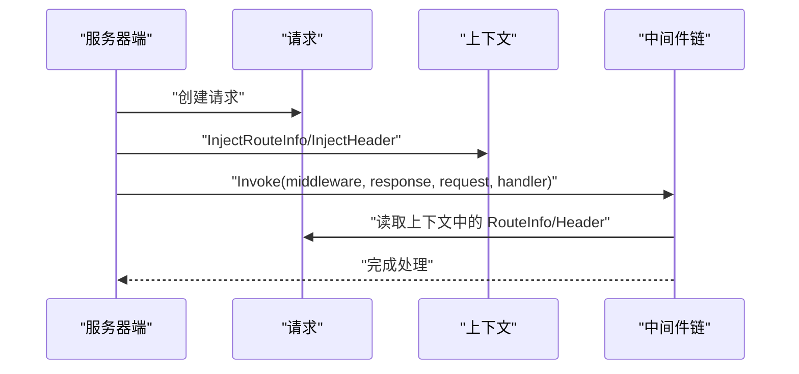
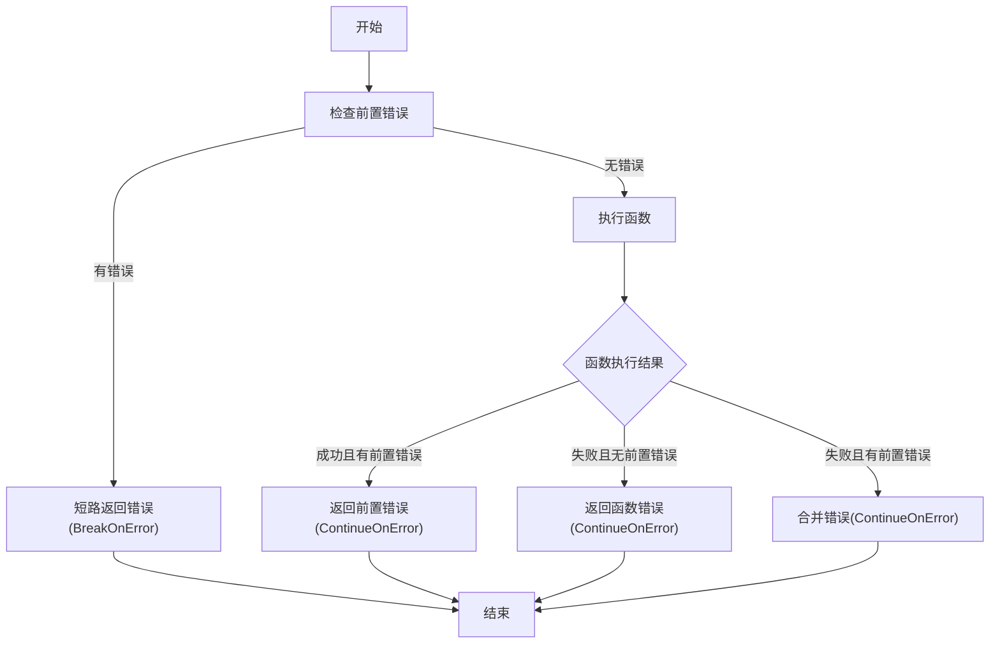
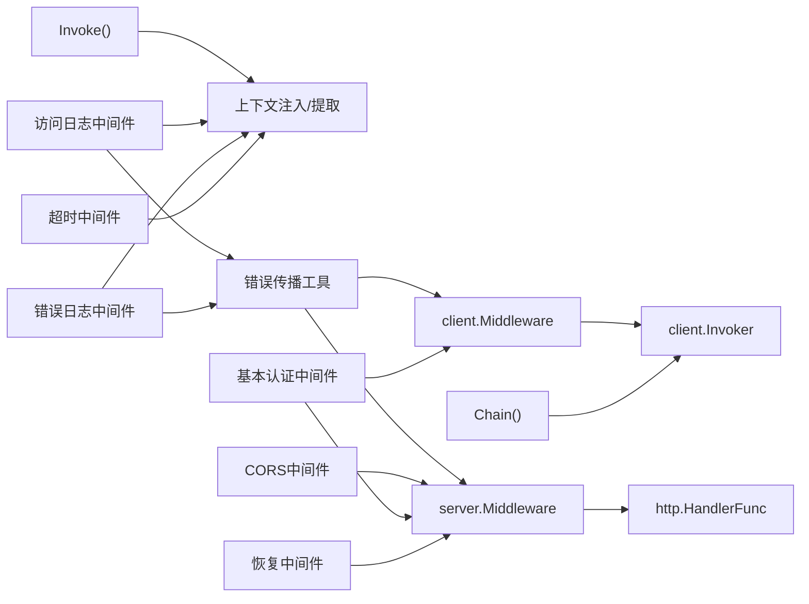

# 中间件架构设计

<cite>
**本文档引用的文件**
- [client/middleware.go](file://client/middleware.go)
- [server/middleware.go](file://server/middleware.go)
- [common.go](file://common.go)
- [middleware/context/middleware.go](file://middleware/context/middleware.go)
- [middleware/accesslog/middleware.go](file://middleware/accesslog/middleware.go)
- [middleware/recovery/middleware.go](file://middleware/recovery/middleware.go)
- [middleware/cors/middleware.go](file://middleware/cors/middleware.go)
- [middleware/basicauth/middleware.go](file://middleware/basicauth/middleware.go)
- [middleware/errorlog/middleware.go](file://middleware/errorlog/middleware.go)
- [middleware/timeout/middleware.go](file://middleware/timeout/middleware.go)
- [middleware/cors/option.go](file://middleware/cors/option.go)
- [middleware/errorlog/option.go](file://middleware/errorlog/option.go)
- [middleware/errorlog/option.go](file://middleware/errorlog/option.go)
- [middleware/accesslog/middleware.go](file://middleware/accesslog/middleware.go)
- [middleware/recovery/middleware.go](file://middleware/recovery/middleware.go)
- [middleware/timeout/middleware.go](file://middleware/timeout/middleware.go)
- [middleware/context/middleware.go](file://middleware/context/middleware.go)
- [middleware/basicauth/middleware.go](file://middleware/basicauth/middleware.go)
- [desc.go](file://desc.go)
- [header.go](file://header.go)
- [route.go](file://route.go)
- [constant.go](file://constant.go)
- [client/middleware_test.go](file://client/middleware_test.go)
- [server/middleware_test.go](file://server/middleware_test.go)
</cite>

## 目录
1. [简介](#简介)
2. [项目结构](#项目结构)
3. [核心组件](#核心组件)
4. [架构总览](#架构总览)
5. [详细组件分析](#详细组件分析)
6. [依赖关系分析](#依赖关系分析)
7. [性能考虑](#性能考虑)
8. [故障排查指南](#故障排查指南)
9. [结论](#结论)
10. [附录](#附录)

## 简介
本文件系统性阐述 Goose 中间件系统的架构设计与实现细节，涵盖以下关键主题：
- 中间件执行机制与链式调用原理
- 工厂模式在中间件中的应用
- 服务器端与客户端中间件的差异化实现
- 上下文传递机制与生命周期管理
- 错误传播与恢复策略
- 性能优化与最佳实践

## 项目结构
中间件体系围绕两条主线展开：服务器端（server）与客户端（client）。两者共享统一的链式调用模型，但在参数签名、最终调用点与上下文注入上存在差异。

图表来源
- [client/middleware.go:1-99](file://client/middleware.go#L1-L99)
- [server/middleware.go:1-85](file://server/middleware.go#L1-L85)
- [common.go:1-51](file://common.go#L1-L51)
- [header.go:1-88](file://header.go#L1-L88)

章节来源
- [client/middleware.go:1-99](file://client/middleware.go#L1-L99)
- [server/middleware.go:1-85](file://server/middleware.go#L1-L85)
- [header.go:1-88](file://header.go#L1-L88)

## 核心组件
- 客户端中间件接口与调用器
  - Middleware 定义了客户端中间件的标准签名，接收 HTTP 客户端、请求以及下一个 Invoker，并返回响应或错误。
  - Invoker 定义了“下一步”调用的函数类型，形成链式调用的基础。
  - Chain 将多个中间件组合成单一中间件，通过递归生成 Invoker 链。
  - Invoke 负责将 RouteInfo 注入到请求上下文后，按需执行链式中间件或直接调用底层 HTTP 客户端。

- 服务器端中间件接口与调用器
  - Middleware 定义了服务器端中间件的标准签名，接收响应写入器、请求以及下一个 http.HandlerFunc。
  - Chain 同样将多个中间件组合，递归生成 http.HandlerFunc 链。
  - Invoke 负责将 RouteInfo 和 Header 注入到请求上下文后，按需执行链式中间件或直接调用最终处理器。

- 通用错误传播工具
  - BreakOnError 与 ContinueOnError 提供统一的错误短路与合并策略，便于中间件在不同阶段对错误进行处理与传播。

章节来源
- [client/middleware.go:9-99](file://client/middleware.go#L9-L99)
- [server/middleware.go:9-85](file://server/middleware.go#L9-L85)
- [common.go:5-51](file://common.go#L5-L51)

## 架构总览
下图展示了客户端与服务器端中间件的共同执行流程与差异点：

图表来源
- [client/middleware.go:35-99](file://client/middleware.go#L35-L99)
- [server/middleware.go:19-85](file://server/middleware.go#L19-L85)

## 详细组件分析

### 链式调用与工厂模式
- 链式调用原理
  - Chain 对空、单个与多个中间件分别处理，确保返回值语义一致。
  - getInvoker 采用递归闭包的方式，为每个中间件生成“下一个调用”的 Invoker/Handler，形成从外到内的嵌套调用链。
- 工厂模式实现
  - 多个具体中间件（如访问日志、超时、CORS、基本认证、错误日志、恢复）均以 Server/Client 工厂函数形式暴露，内部封装配置与行为，外部仅需传入选项即可获得可复用的中间件实例。

图表来源
- [client/middleware.go:35-74](file://client/middleware.go#L35-L74)
- [server/middleware.go:19-63](file://server/middleware.go#L19-L63)

章节来源
- [client/middleware.go:35-74](file://client/middleware.go#L35-L74)
- [server/middleware.go:19-63](file://server/middleware.go#L19-L63)

### 上下文传递机制
- 服务器端
  - 在 Invoke 中将 RouteInfo 与请求头注入到请求上下文中，后续中间件可通过 ExtractRouteInfo/ExtractHeader 获取。
- 客户端
  - 在 Invoke 中仅注入 RouteInfo；如需传递头部，可在业务层自行处理或通过具体中间件（如基本认证）设置。

图表来源
- [server/middleware.go:65-85](file://server/middleware.go#L65-L85)
- [header.go:24-45](file://header.go#L24-L45)
- [desc.go:1-6](file://desc.go#L1-L6)

章节来源
- [server/middleware.go:65-85](file://server/middleware.go#L65-L85)
- [header.go:24-45](file://header.go#L24-L45)
- [desc.go:1-6](file://desc.go#L1-L6)

### 生命周期管理
- 服务器端中间件
  - 通常在进入首个中间件时执行前置逻辑（如记录开始时间、包装响应写入器），在调用链回溯时执行后置逻辑（如计算耗时、输出日志）。
- 客户端中间件
  - 在调用下游前执行前置逻辑（如设置超时、添加头部），在收到响应后执行后置逻辑（如记录耗时、错误日志）。
- 共同点
  - 所有中间件均遵循“先入后出”的生命周期，确保资源正确释放与日志完整输出。

章节来源
- [middleware/accesslog/middleware.go:116-204](file://middleware/accesslog/middleware.go#L116-L204)
- [middleware/accesslog/middleware.go:206-276](file://middleware/accesslog/middleware.go#L206-L276)
- [middleware/timeout/middleware.go:28-59](file://middleware/timeout/middleware.go#L28-L59)
- [middleware/timeout/middleware.go:72-106](file://middleware/timeout/middleware.go#L72-L106)

### 错误传播机制
- BreakOnError
  - 若已有错误，则短路后续执行，直接返回该错误；否则执行被包裹的函数。
- ContinueOnError
  - 无论前置错误是否存在，都会执行被包裹函数；若函数成功但存在前置错误，返回二者合并后的错误；若函数失败则返回其错误；若两者都失败则合并错误。
- 服务器端恢复中间件
  - 使用 defer + recover 捕获 panic，调用自定义或默认处理器记录错误栈并保证服务稳定。

图表来源
- [common.go:5-51](file://common.go#L5-L51)
- [middleware/recovery/middleware.go:38-50](file://middleware/recovery/middleware.go#L38-L50)

章节来源
- [common.go:5-51](file://common.go#L5-L51)
- [middleware/recovery/middleware.go:38-50](file://middleware/recovery/middleware.go#L38-L50)

### 服务器端中间件实现差异
- 基本认证中间件
  - 服务器端：解析 Authorization 头，校验凭据，将用户名注入上下文，随后调用下一个处理器。
  - 客户端：在 URL 中设置用户信息，直接发起请求。
- CORS 中间件
  - 处理预检（OPTIONS）与实际请求，动态设置允许的源、方法、头部、凭证等。
- 访问日志中间件
  - 包装响应写入器以捕获状态码与响应体，记录请求详情与耗时。
- 错误日志中间件
  - 捕获 4xx/5xx 状态码或客户端错误，记录请求与响应详情。
- 超时中间件
  - 服务器端：从请求头读取超时设置或使用默认值，创建带超时的上下文。
  - 客户端：基于上下文截止时间计算剩余超时，设置请求头并创建带超时的上下文。
- 恢复中间件
  - 使用 defer + recover 捕获 panic 并输出错误栈。

章节来源
- [middleware/basicauth/middleware.go:55-76](file://middleware/basicauth/middleware.go#L55-L76)
- [middleware/basicauth/middleware.go:71-76](file://middleware/basicauth/middleware.go#L71-L76)
- [middleware/cors/middleware.go:35-160](file://middleware/cors/middleware.go#L35-L160)
- [middleware/accesslog/middleware.go:116-204](file://middleware/accesslog/middleware.go#L116-L204)
- [middleware/errorlog/middleware.go:16-106](file://middleware/errorlog/middleware.go#L16-L106)
- [middleware/timeout/middleware.go:28-59](file://middleware/timeout/middleware.go#L28-L59)
- [middleware/timeout/middleware.go:72-106](file://middleware/timeout/middleware.go#L72-L106)
- [middleware/recovery/middleware.go:38-50](file://middleware/recovery/middleware.go#L38-L50)

### 客户端中间件实现差异
- 基本认证中间件
  - 客户端：在请求 URL 中设置用户信息，直接发起请求。
- 访问日志中间件
  - 记录请求耗时、状态码、错误信息等。
- 错误日志中间件
  - 捕获 HTTP 错误或非 nil 错误，记录请求与响应详情。
- 超时中间件
  - 基于上下文截止时间计算剩余超时，设置请求头并创建带超时的上下文。
- 恢复中间件
  - 客户端场景中通常不直接使用，但可结合其他中间件实现容错。

章节来源
- [middleware/basicauth/middleware.go:71-76](file://middleware/basicauth/middleware.go#L71-L76)
- [middleware/accesslog/middleware.go:206-276](file://middleware/accesslog/middleware.go#L206-L276)
- [middleware/errorlog/middleware.go:60-106](file://middleware/errorlog/middleware.go#L60-L106)
- [middleware/timeout/middleware.go:72-106](file://middleware/timeout/middleware.go#L72-L106)

### 上下文中间件
- 作用
  - 为服务器端与客户端提供统一的 ContextFunc，允许在中间件中修改或扩展上下文内容。
- 实现
  - 服务器端：将 ContextFunc 应用到请求上下文，更新请求对象。
  - 客户端：将 ContextFunc 应用到请求上下文，更新请求对象。

章节来源
- [middleware/context/middleware.go:13-35](file://middleware/context/middleware.go#L13-L35)

### 测试验证
- 客户端链式调用测试
  - 验证空链、单链、多链的行为一致性。
  - 验证错误中间件能够中断链式调用。
  - 验证中间件执行顺序符合预期。
- 服务器端链式调用测试
  - 验证空中间件时直接调用最终处理器。
  - 验证单中间件与多中间件链式调用顺序。

章节来源
- [client/middleware_test.go:33-213](file://client/middleware_test.go#L33-L213)
- [server/middleware_test.go:18-69](file://server/middleware_test.go#L18-L69)

## 依赖关系分析
- 组件耦合
  - 客户端与服务器端中间件各自独立，共享链式调用与上下文注入的通用能力。
  - 具体中间件（如访问日志、CORS、超时等）依赖通用工具（上下文注入/提取、错误传播工具）。
- 外部依赖
  - 日志：使用标准库 slog。
  - HTTP：依赖 net/http。
  - 反射：访问日志中间件在特定场景下使用反射获取路由信息，存在潜在不稳定风险。

图表来源
- [client/middleware.go:35-99](file://client/middleware.go#L35-L99)
- [server/middleware.go:19-85](file://server/middleware.go#L19-L85)
- [common.go:5-51](file://common.go#L5-L51)
- [middleware/accesslog/middleware.go:116-204](file://middleware/accesslog/middleware.go#L116-L204)
- [middleware/cors/middleware.go:35-160](file://middleware/cors/middleware.go#L35-L160)
- [middleware/basicauth/middleware.go:55-76](file://middleware/basicauth/middleware.go#L55-L76)
- [middleware/errorlog/middleware.go:16-106](file://middleware/errorlog/middleware.go#L16-L106)
- [middleware/timeout/middleware.go:28-106](file://middleware/timeout/middleware.go#L28-L106)
- [middleware/recovery/middleware.go:38-50](file://middleware/recovery/middleware.go#L38-L50)

## 性能考虑
- 对象池与切片复用
  - 访问日志中间件使用 sync.Pool 复用 slog.Attr 切片，减少频繁分配带来的 GC 压力。
- 请求/响应体读取
  - 在需要打印请求/响应体时，注意将原始流重置为 NopCloser，避免后续读取失败。
- 反射与稳定性
  - 访问日志中间件在服务器端使用反射获取路由信息，存在 panic 风险，建议谨慎使用或在生产环境禁用。
- 超时控制
  - 客户端与服务器端超时中间件均采用最小超时策略，避免过度放宽限制导致资源浪费。

章节来源
- [middleware/accesslog/middleware.go:119-203](file://middleware/accesslog/middleware.go#L119-L203)
- [middleware/accesslog/middleware.go:209-273](file://middleware/accesslog/middleware.go#L209-L273)
- [middleware/accesslog/middleware.go:298-318](file://middleware/accesslog/middleware.go#L298-L318)
- [middleware/timeout/middleware.go:28-59](file://middleware/timeout/middleware.go#L28-L59)
- [middleware/timeout/middleware.go:72-106](file://middleware/timeout/middleware.go#L72-L106)

## 故障排查指南
- 中间件未生效
  - 检查链式组合是否正确，确保 Chain 返回的中间件非空。
  - 确认 Invoke 的参数顺序与类型匹配。
- 错误未被记录
  - 服务器端错误日志中间件仅记录 4xx/5xx 或显式错误；确认状态码与错误条件满足。
  - 客户端错误日志中间件需确保响应体可读且已重置。
- 超时异常
  - 服务器端：检查请求头中的超时值格式与范围。
  - 客户端：确认上下文截止时间是否早于默认超时。
- CORS 不生效
  - 检查 AllowedOrigins、AllowedMethods、AllowedHeaders 的配置是否与请求匹配。
- 认证失败
  - 服务器端：确认 Authorization 头格式正确且凭据存在于账户列表。
  - 客户端：确认 URL 用户信息设置正确。

章节来源
- [client/middleware_test.go:33-128](file://client/middleware_test.go#L33-L128)
- [server/middleware_test.go:18-69](file://server/middleware_test.go#L18-L69)
- [middleware/errorlog/middleware.go:16-106](file://middleware/errorlog/middleware.go#L16-L106)
- [middleware/timeout/middleware.go:28-106](file://middleware/timeout/middleware.go#L28-L106)
- [middleware/cors/middleware.go:35-160](file://middleware/cors/middleware.go#L35-L160)
- [middleware/basicauth/middleware.go:55-76](file://middleware/basicauth/middleware.go#L55-L76)

## 结论
Goose 中间件系统通过统一的链式调用模型与清晰的接口抽象，实现了客户端与服务器端的一致性体验。借助工厂模式与配置化选项，中间件具备良好的可扩展性与可维护性。配合上下文注入、错误传播工具与性能优化手段，系统在保证功能完整性的同时兼顾了运行效率与可观测性。

## 附录
- 最佳实践
  - 明确中间件职责边界，避免在同一中间件中混杂过多关注点。
  - 合理组织中间件顺序，前置中间件负责输入准备与校验，后置中间件负责输出与日志。
  - 使用工厂函数集中配置，便于复用与测试。
  - 在生产环境中谨慎启用反射相关的中间件能力。
- 常见陷阱
  - 忘记重置请求/响应体流，导致后续读取失败。
  - 中间件链顺序不当，导致上下文或头部信息未按预期传递。
  - 错误处理策略不一致，造成错误丢失或重复记录。
  - CORS 配置过于宽松，带来安全风险。
  - 超时设置不合理，影响用户体验或系统稳定性。