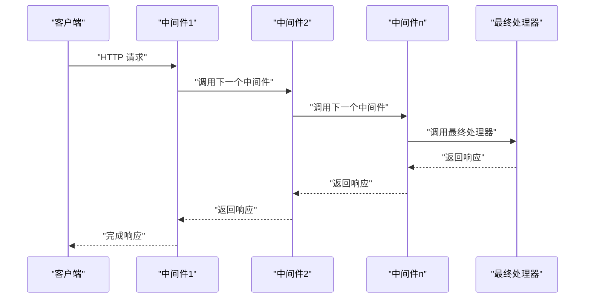
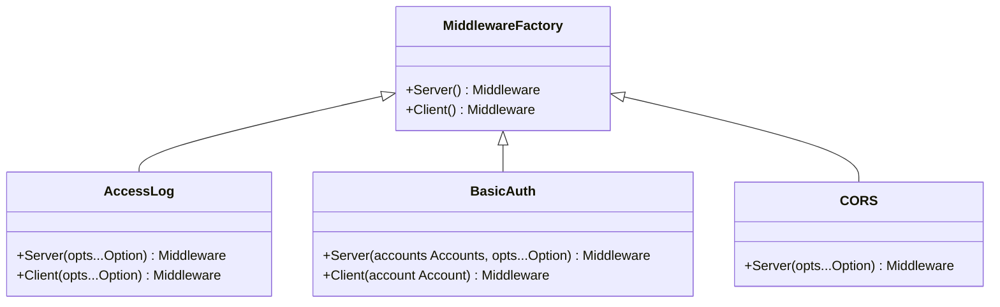
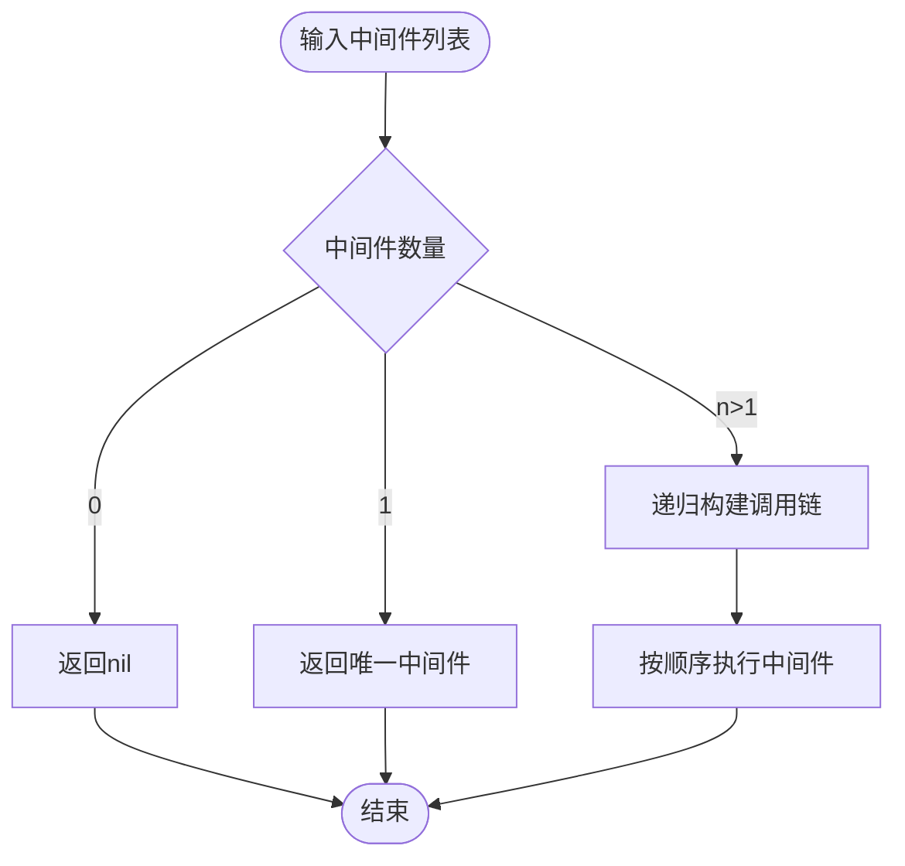
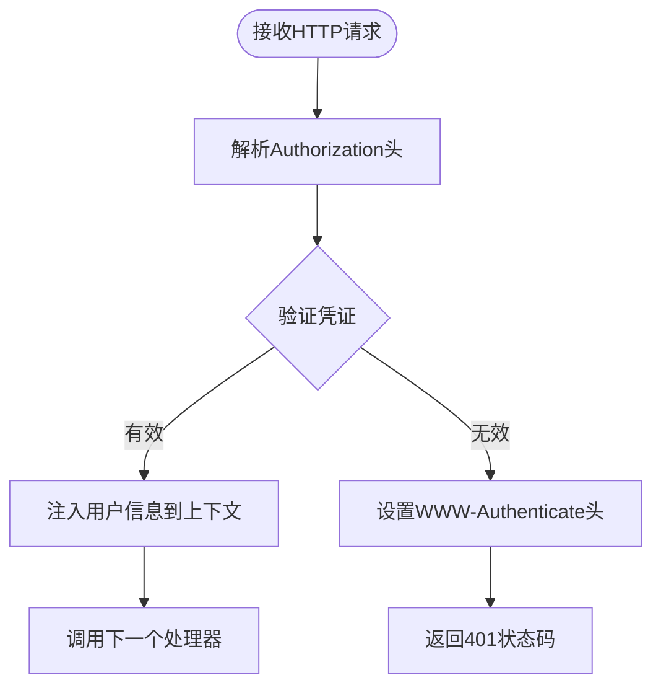
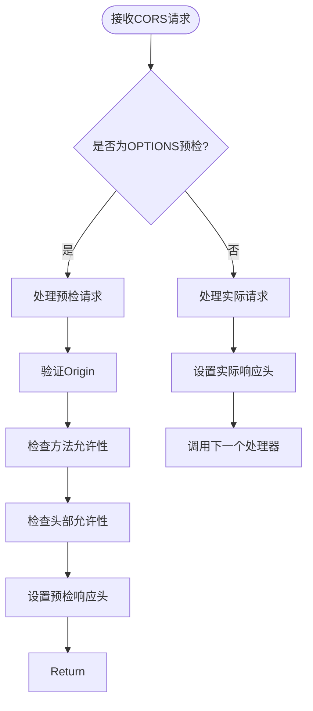
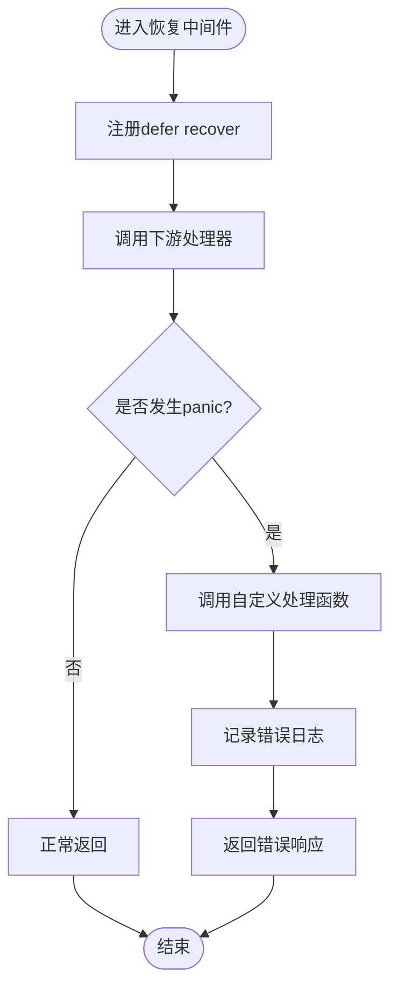
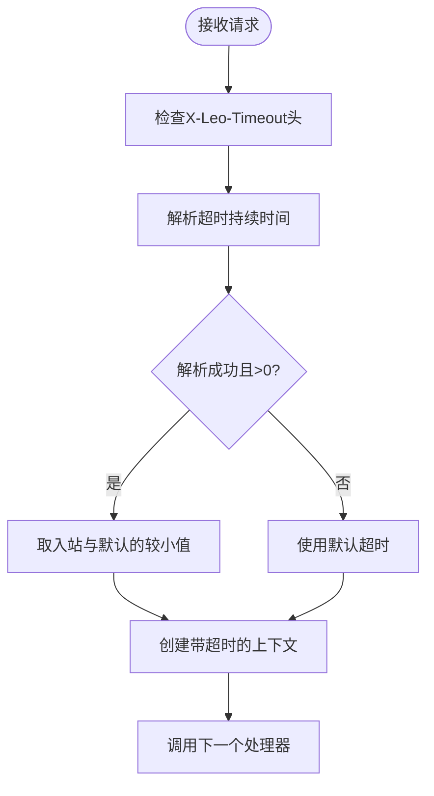
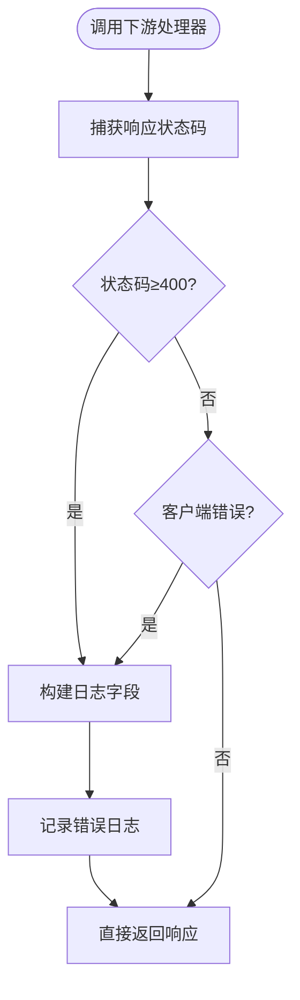
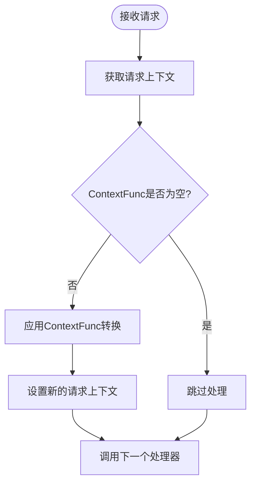
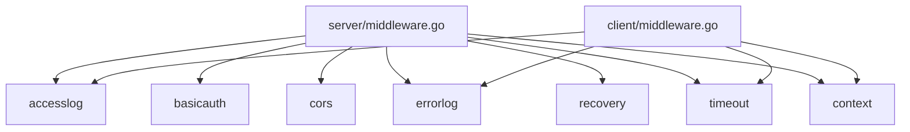

# 中间件系统

<cite>
**本文引用的文件**
- [server/middleware.go](file://server/middleware.go)
- [client/middleware.go](file://client/middleware.go)
- [middleware/accesslog/middleware.go](file://middleware/accesslog/middleware.go)
- [middleware/basicauth/middleware.go](file://middleware/basicauth/middleware.go)
- [middleware/cors/middleware.go](file://middleware/cors/middleware.go)
- [middleware/cors/option.go](file://middleware/cors/option.go)
- [middleware/errorlog/middleware.go](file://middleware/errorlog/middleware.go)
- [middleware/errorlog/option.go](file://middleware/errorlog/option.go)
- [middleware/recovery/middleware.go](file://middleware/recovery/middleware.go)
- [middleware/timeout/middleware.go](file://middleware/timeout/middleware.go)
- [middleware/context/middleware.go](file://middleware/context/middleware.go)
- [middleware/cors/middleware_test.go](file://middleware/cors/middleware_test.go)
- [server/middleware_test.go](file://server/middleware_test.go)
</cite>

## 更新摘要
**所做更改**
- 新增中间件架构设计章节，详细介绍链式调用机制和工厂模式实现
- 完善内置中间件详解，涵盖访问日志、基础认证、CORS、异常恢复、超时控制等
- 新增自定义中间件开发指南，提供接口实现和最佳实践
- 增强性能考量和故障排查指南
- 更新依赖分析和架构图示

## 目录
1. [简介](#简介)
2. [中间件架构设计](#中间件架构设计)
3. [核心组件](#核心组件)
4. [内置中间件详解](#内置中间件详解)
5. [自定义中间件开发](#自定义中间件开发)
6. [性能考量](#性能考量)
7. [故障排查指南](#故障排查指南)
8. [依赖分析](#依赖分析)
9. [结论](#结论)
10. [附录](#附录)

## 简介
本文件系统性阐述 Goose 中间件体系的设计与使用方法，覆盖以下要点：
- 执行机制：服务端与客户端中间件的统一链式调用模型
- 工厂模式：通过可组合的 Option 函数构建中间件实例
- 内置中间件：访问日志、基础认证、CORS、异常恢复、超时控制、错误日志、上下文注入等
- 自定义开发：接口规范、选项配置、最佳实践
- 性能与调试：内存复用、日志开销、断点定位与排障

## 中间件架构设计

### 链式调用机制
Goose 中间件系统采用统一的链式调用架构，通过递归构建调用链实现中间件的顺序执行：



**图表来源**
- [server/middleware.go:38-62](file://server/middleware.go#L38-L62)
- [client/middleware.go:50-73](file://client/middleware.go#L50-L73)

### 工厂模式实现
中间件采用工厂模式，通过 Server() 和 Client() 工厂函数创建对应端的中间件实例：



**图表来源**
- [middleware/accesslog/middleware.go:116-275](file://middleware/accesslog/middleware.go#L116-L275)
- [middleware/basicauth/middleware.go:55-76](file://middleware/basicauth/middleware.go#L55-L76)
- [middleware/cors/middleware.go:45](file://middleware/cors/middleware.go#L45)

**章节来源**
- [server/middleware.go:9-84](file://server/middleware.go#L9-L84)
- [client/middleware.go:21-94](file://client/middleware.go#L21-L94)

## 核心组件

### 通用类型定义
中间件系统定义了统一的类型别名，确保服务端和客户端的兼容性：

- **服务端中间件类型**：`type Middleware func(response http.ResponseWriter, request *http.Request, invoker http.HandlerFunc)`
- **客户端中间件类型**：`type Middleware func(cli *http.Client, request *http.Request, invoker Invoker) (*http.Response, error)`
- **调用器类型**：`type Invoker func(cli *http.Client, request *http.Request) (*http.Response, error)`

### 链式组合机制
Chain 函数负责将多个中间件组合为单一中间件，支持零个、一个或多个中间件的处理：



**图表来源**
- [server/middleware.go:31-43](file://server/middleware.go#L31-L43)
- [client/middleware.go:43-55](file://client/middleware.go#L43-L55)

**章节来源**
- [server/middleware.go:9-84](file://server/middleware.go#L9-L84)
- [client/middleware.go:21-94](file://client/middleware.go#L21-L94)

## 内置中间件详解

### 访问日志中间件（accesslog）

#### 功能概述
访问日志中间件提供服务端与客户端的双端日志记录功能，支持：
- 结构化日志输出，包含时间戳、延迟、状态码等关键信息
- 可配置的日志级别和路由跳过策略
- 请求/响应体的可选打印功能
- 性能优化的内存池复用机制

#### 关键实现特性
- **内存优化**：使用 `sync.Pool` 复用 `slog.Attr` 切片，减少 GC 压力
- **路由信息提取**：优先从上下文提取 `RouteInfo`，回退反射获取
- **双向支持**：同时支持服务端和客户端的日志记录
- **灵活配置**：通过 Option 函数实现丰富的配置选项

#### 选项配置
```go
// 基本配置
WithLevel(level slog.Level) Option           // 设置日志级别
WithSkip(skip func(string) bool) Option      // 设置路由跳过函数
WithPrintRequest(print bool) Option         // 启用请求体打印
WithPrintResponse(print bool) Option        // 启用响应体打印
```

**章节来源**
- [middleware/accesslog/middleware.go:20-102](file://middleware/accesslog/middleware.go#L20-L102)
- [middleware/accesslog/middleware.go:116-204](file://middleware/accesslog/middleware.go#L116-L204)

### 基础认证中间件（basicauth）

#### 功能概述
基础认证中间件提供 HTTP Basic Authentication 支持：
- **服务端**：解析 Authorization 头，验证凭证有效性
- **客户端**：在请求 URL 中嵌入用户名密码
- **安全特性**：使用常量时间比较防止时序攻击
- **灵活配置**：支持自定义 realm 和账户列表

#### 认证流程


**图表来源**
- [middleware/basicauth/middleware.go:59-68](file://middleware/basicauth/middleware.go#L59-L68)

#### 配置选项
- `Realm(realm string)`：设置认证 realm
- 支持多账户配置和动态账户管理

**章节来源**
- [middleware/basicauth/middleware.go:55-113](file://middleware/basicauth/middleware.go#L55-L113)

### CORS 中间件（cors）

#### 功能概述
CORS 中间件完全符合 W3C CORS 规范，支持：
- **预检请求处理**：OPTIONS 方法的完整验证流程
- **实际请求处理**：设置适当的 CORS 响应头
- **灵活的源策略**：支持精确匹配和通配符模式
- **安全配置**：凭据支持、私有网络访问、暴露头设置

#### CORS 处理流程


**图表来源**
- [middleware/cors/middleware.go:147-160](file://middleware/cors/middleware.go#L147-L160)
- [middleware/cors/middleware.go:162-216](file://middleware/cors/middleware.go#L162-L216)

#### 配置选项
- `AllowedOrigins([]string)`：允许的源列表，支持通配符
- `AllowedMethods([]string)`：允许的 HTTP 方法
- `AllowedHeaders([]string)`：允许的请求头
- `ExposedHeaders([]string)`：暴露给客户端的响应头
- `MaxAge(time.Duration)`：预检缓存时间
- `AllowCredentials()`：允许携带凭据
- `AllowPrivateNetwork()`：允许私有网络访问

**章节来源**
- [middleware/cors/middleware.go:45-249](file://middleware/cors/middleware.go#L45-L249)
- [middleware/cors/option.go:38-93](file://middleware/cors/option.go#L38-L93)

### 异常恢复中间件（recovery）

#### 功能概述
异常恢复中间件提供 panic 恢复和错误处理：
- **自动恢复**：捕获并处理下游处理器中的 panic
- **自定义处理**：支持自定义错误响应格式
- **结构化日志**：记录 panic 信息和堆栈跟踪

#### 恢复机制


**图表来源**
- [middleware/recovery/middleware.go:40-49](file://middleware/recovery/middleware.go#L40-L49)

#### 配置选项
- `RecoveryHandler(HandlerFunc)`：自定义 panic 处理函数

**章节来源**
- [middleware/recovery/middleware.go:38-55](file://middleware/recovery/middleware.go#L38-L55)

### 超时控制中间件（timeout）

#### 功能概述
超时控制中间件提供请求超时管理：
- **服务端**：从请求头读取超时设置，创建带超时的上下文
- **客户端**：基于上下文 deadline 计算剩余时间，设置超时头
- **智能合并**：取请求头指定值与默认值的较小者

#### 超时处理流程


**图表来源**
- [middleware/timeout/middleware.go:28-59](file://middleware/timeout/middleware.go#L28-L59)

#### 配置选项
- 仅构造参数：默认超时时间（服务端和客户端相同）

**章节来源**
- [middleware/timeout/middleware.go:14-107](file://middleware/timeout/middleware.go#L14-L107)

### 错误日志中间件（errorlog）

#### 功能概述
错误日志中间件专门记录 4xx/5xx 错误：
- **条件触发**：仅在状态码 ≥ 400 或客户端错误时记录
- **双向支持**：同时支持服务端和客户端的错误记录
- **可选内容**：支持打印请求/响应体便于问题定位

#### 错误检测机制


**图表来源**
- [middleware/errorlog/middleware.go:29-57](file://middleware/errorlog/middleware.go#L29-L57)

#### 配置选项
- `WithPrintRequest(bool)`：是否打印请求体
- `WithPrintResponse(bool)`：是否打印响应体

**章节来源**
- [middleware/errorlog/middleware.go:16-195](file://middleware/errorlog/middleware.go#L16-L195)
- [middleware/errorlog/option.go:37-60](file://middleware/errorlog/option.go#L37-L60)

### 上下文注入中间件（context）

#### 功能概述
上下文注入中间件提供请求上下文的转换：
- **服务端**：在请求上下文中注入路由信息和请求头
- **客户端**：支持自定义上下文函数进行上下文转换
- **灵活扩展**：便于后续中间件或业务逻辑使用

#### 上下文处理流程


**图表来源**
- [middleware/context/middleware.go:13-22](file://middleware/context/middleware.go#L13-L22)

#### 配置选项
- `ContextFunc(ctx) -> ctx`：自定义上下文转换函数

**章节来源**
- [middleware/context/middleware.go:11-35](file://middleware/context/middleware.go#L11-L35)

## 自定义中间件开发

### 接口实现规范

#### 服务端中间件接口
```go
type Middleware func(
    response http.ResponseWriter, 
    request *http.Request, 
    invoker http.HandlerFunc
) 
```

#### 客户端中间件接口
```go
type Middleware func(
    cli *http.Client, 
    request *http.Request, 
    invoker Invoker
) (*http.Response, error)
```

### 选项配置模式

#### 标准实现模式
```go
type options struct {
    // 配置字段
}

type Option func(*options)

func defaultOptions() *options {
    return &options{
        // 默认值
    }
}

func (o *options) apply(opts ...Option) *options {
    for _, opt := range opts {
        opt(o)
    }
    return o
}

// WithXxx 配置函数
func WithXxx(value Type) Option {
    return func(o *options) {
        o.field = value
    }
}
```

### 最佳实践指南

#### 中间件设计原则
1. **单一职责**：每个中间件只负责一个特定功能
2. **无状态设计**：避免在中间件中存储请求相关状态
3. **性能优先**：最小化内存分配和系统调用
4. **错误处理**：妥善处理各种异常情况
5. **日志记录**：提供必要的调试信息但避免过度输出

#### 链式组合建议
- **通用中间件靠前**：如认证、日志等通用功能放在前面
- **具体中间件靠后**：如业务逻辑、数据处理等功能放在后面
- **性能敏感中间件**：将最耗时的中间件放在链末尾

**章节来源**
- [server/middleware.go:9-17](file://server/middleware.go#L9-L17)
- [client/middleware.go:21-33](file://client/middleware.go#L21-L33)
- [middleware/accesslog/middleware.go:20-54](file://middleware/accesslog/middleware.go#L20-L54)

## 性能考量

### 内存优化策略

#### sync.Pool 复用
- **访问日志**：复用 `slog.Attr` 切片，初始容量 20（服务端）和 10（客户端）
- **响应体缓冲**：使用 `bytes.Buffer` 缓冲响应体，避免重复分配
- **字符串处理**：通过池化减少临时字符串分配

#### I/O 性能优化
- **按需读取**：仅在启用相应选项时才读取请求/响应体
- **流式处理**：对于大文件传输，考虑使用流式处理而非完整读取
- **连接复用**：利用 HTTP 客户端的连接池特性

### CPU 性能优化

#### 字符串操作优化
- **常量时间比较**：使用 `crypto/subtle` 进行安全的凭证比较
- **头部规范化**：使用 `http.CanonicalHeaderKey` 规范化请求头
- **通配符匹配**：CORS 中的通配符匹配使用高效的字符串比较算法

#### 并发安全
- **无锁数据结构**：尽量使用线程安全的数据结构
- **原子操作**：对于简单的状态更新使用原子操作
- **批量处理**：将多个小操作合并为批量处理

### 内存泄漏防护

#### 资源清理
- **上下文取消**：确保所有带超时的上下文都能正确取消
- **响应体关闭**：及时关闭 HTTP 响应体
- **定时器清理**：避免定时器泄漏

#### 泄漏检测
- **pprof 集成**：使用 Go 标准库的性能分析工具
- **内存监控**：定期检查内存使用情况
- **GC 调优**：根据实际使用情况调整垃圾回收参数

## 故障排查指南

### CORS 相关问题

#### 常见问题诊断
1. **CORS 不生效**
   - 检查 `Access-Control-Request-Method` 和 `Access-Control-Request-Headers` 是否正确设置
   - 验证 `AllowOriginFunc` 的返回值和优先级
   - 确认通配符模式的匹配规则

2. **预检请求失败**
   - 检查允许的方法和头部是否包含请求中的值
   - 验证 `MaxAge` 设置是否合理
   - 确认凭据设置与实际请求是否一致

#### 调试技巧
- 使用浏览器开发者工具查看网络面板的 CORS 相关信息
- 启用详细的访问日志观察请求头和响应头
- 逐步注释中间件确定问题来源

### 认证相关问题

#### 基础认证故障排除
1. **认证失败**
   - 验证 `Authorization` 头格式是否正确（`Basic base64(user:pass)`）
   - 检查账户列表是否包含有效的用户凭证
   - 确认 realm 设置与客户端期望一致

2. **安全问题**
   - 确保使用 HTTPS 传输认证信息
   - 定期轮换密码和密钥
   - 监控异常登录尝试

### 日志相关问题

#### 日志配置问题
1. **日志过多**
   - 使用 `WithSkip` 函数跳过不需要记录的路由
   - 调整日志级别，生产环境使用 `Info` 或更高
   - 关闭不必要的 `WithPrintRequest/WithPrintResponse`

2. **日志缺失**
   - 确认中间件链中包含日志中间件
   - 检查日志级别设置是否过低
   - 验证日志输出目标配置

### 超时相关问题

#### 超时配置问题
1. **超时过短**
   - 分析下游服务的响应时间，适当增加超时值
   - 考虑网络延迟和数据库查询时间
   - 使用性能测试工具确定合理的超时值

2. **超时过长**
   - 监控系统资源使用情况
   - 考虑用户体验和资源占用平衡
   - 实施渐进式超时策略

### 性能问题诊断

#### 性能瓶颈识别
1. **CPU 使用率过高**
   - 检查是否存在不必要的字符串操作
   - 优化正则表达式和通配符匹配
   - 减少内存分配和垃圾回收压力

2. **内存使用异常**
   - 使用 `go tool pprof` 分析内存使用
   - 检查是否存在内存泄漏
   - 优化缓存策略和对象复用

#### 监控指标
- **请求延迟**：P50、P90、P99 延迟分布
- **错误率**：4xx、5xx 错误统计
- **吞吐量**：每秒请求数
- **资源使用**：CPU、内存、网络带宽

**章节来源**
- [middleware/cors/middleware_test.go:41-500](file://middleware/cors/middleware_test.go#L41-L500)
- [server/middleware_test.go:18-69](file://server/middleware_test.go#L18-L69)

## 依赖分析

### 组件耦合关系

#### 核心框架依赖
- **server/middleware.go**：被所有服务端中间件依赖
- **client/middleware.go**：被所有客户端中间件依赖
- **goose 包**：提供路由信息和请求头注入功能

#### 中间件间依赖


**图表来源**
- [server/middleware.go:1-85](file://server/middleware.go#L1-L85)
- [client/middleware.go:1-99](file://client/middleware.go#L1-L99)

### 外部依赖

#### 标准库依赖
- **log/slog**：结构化日志记录
- **net/http**：HTTP 协议处理
- **crypto/subtle**：常量时间字符串比较
- **sync**：并发同步原语

#### 第三方依赖
- **goose 包**：提供路由信息和上下文注入功能
- **encoding/base64**：Base64 编码支持

### 循环依赖检测
经过分析，中间件系统不存在循环依赖，各组件间依赖关系清晰明确。

**章节来源**
- [server/middleware.go:1-85](file://server/middleware.go#L1-L85)
- [client/middleware.go:1-99](file://client/middleware.go#L1-L99)

## 结论

Goose 中间件系统通过统一的链式调用架构和工厂模式实现了高度可配置和可扩展的中间件体系。系统提供了完整的内置中间件集合，涵盖了认证、跨域、日志、恢复、超时、上下文等常见需求。

### 主要优势
1. **统一架构**：服务端和客户端共享相同的中间件接口和调用模式
2. **灵活配置**：通过 Option 函数实现丰富的配置选项
3. **性能优化**：采用多种优化技术减少内存分配和系统调用
4. **安全保障**：内置安全特性和错误处理机制
5. **易于扩展**：清晰的接口设计便于自定义中间件开发

### 最佳实践建议
1. **中间件排序**：遵循"通用靠前、具体靠后"的原则
2. **性能监控**：定期监控中间件的性能影响
3. **安全配置**：合理配置认证和 CORS 策略
4. **日志管理**：平衡日志详细程度和性能影响
5. **超时设置**：根据实际需求合理设置超时参数

通过合理使用和扩展中间件系统，可以构建高性能、安全可靠的 HTTP 服务框架。

## 附录

### 自定义中间件开发模板

#### 基础中间件模板
```go
package custom

import (
    "net/http"
    "github.com/soyacen/goose/server"
)

type options struct {
    // 配置字段
}

type Option func(*options)

func defaultOptions() *options {
    return &options{
        // 默认值
    }
}

func (o *options) apply(opts ...Option) *options {
    for _, opt := range opts {
        opt(o)
    }
    return o
}

func Server(opts ...Option) server.Middleware {
    opt := defaultOptions().apply(opts...)
    
    return func(response http.ResponseWriter, request *http.Request, invoker http.HandlerFunc) {
        // 中间件逻辑
        
        // 调用下一个处理器
        invoker(response, request)
    }
}
```

#### 客户端中间件模板
```go
package custom

import (
    "net/http"
    "github.com/soyacen/goose/client"
)

func Client(opts ...Option) client.Middleware {
    return func(cli *http.Client, request *http.Request, invoker client.Invoker) (*http.Response, error) {
        // 中间件逻辑
        
        // 调用下一个处理器
        return invoker(cli, request)
    }
}
```

### 性能优化清单
- [ ] 使用 sync.Pool 复用临时对象
- [ ] 避免在中间件中进行重 I/O 操作
- [ ] 合理使用日志级别，避免 Debug 模式在生产环境使用
- [ ] 考虑中间件的执行顺序和性能影响
- [ ] 定期进行性能基准测试

### 常用配置示例
```go
// 基础认证 + CORS + 访问日志
middlewares := server.Chain(
    basicauth.Server(accounts, basicauth.Realm("My App")),
    cors.Server(
        cors.AllowedOrigins([]string{"https://*.example.com"}),
        cors.AllowedMethods([]string{"GET", "POST", "PUT", "DELETE"}),
        cors.AllowedHeaders([]string{"Content-Type", "Authorization"}),
    ),
    accesslog.Server(
        accesslog.WithLevel(slog.LevelWarn),
        accesslog.WithSkip(func(route string) bool {
            return route == "/health"
        }),
    ),
)
```

**章节来源**
- [middleware/accesslog/middleware.go:20-54](file://middleware/accesslog/middleware.go#L20-L54)
- [middleware/basicauth/middleware.go:55-76](file://middleware/basicauth/middleware.go#L55-L76)
- [middleware/cors/middleware.go:45](file://middleware/cors/middleware.go#L45)