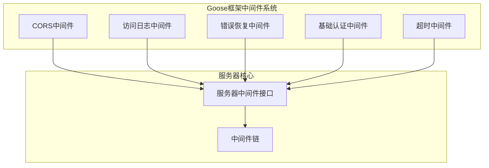
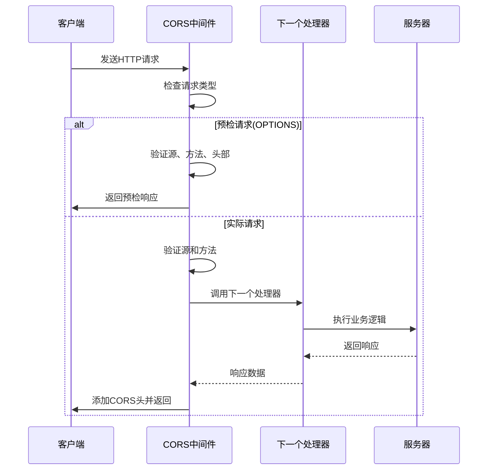
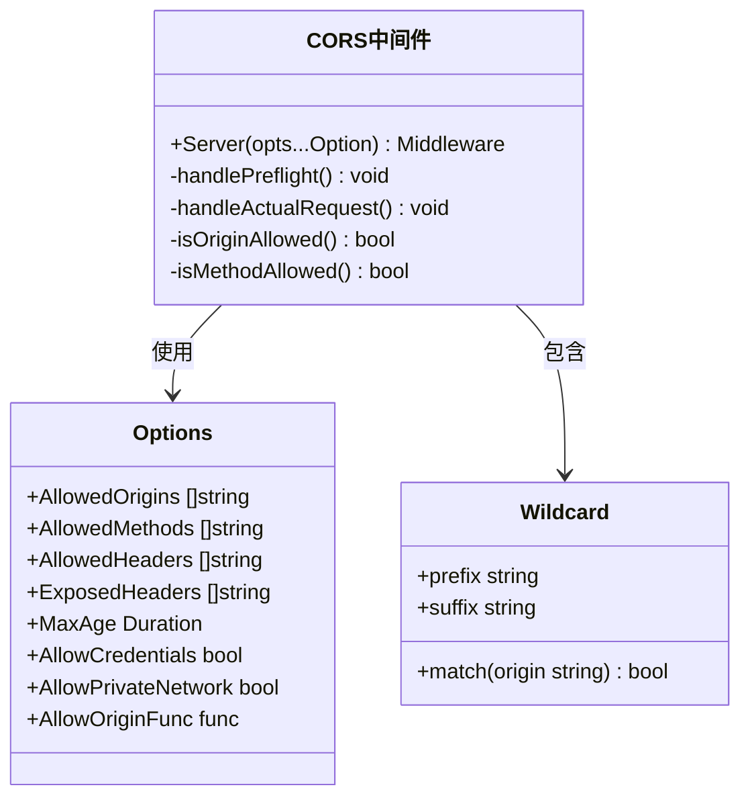
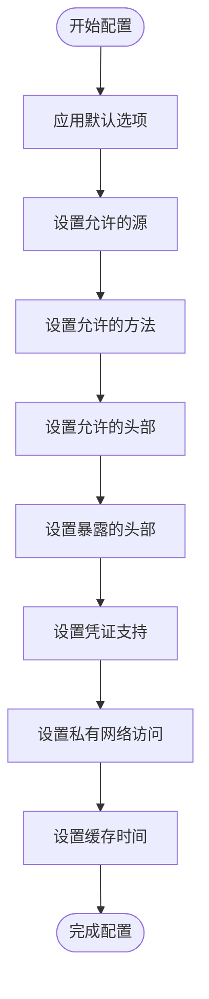
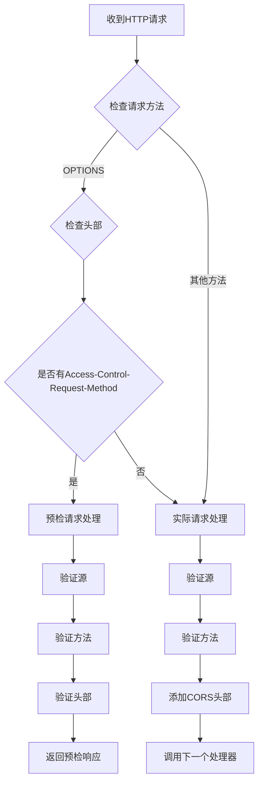
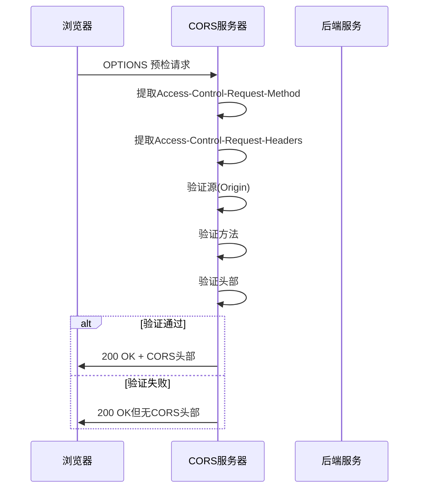
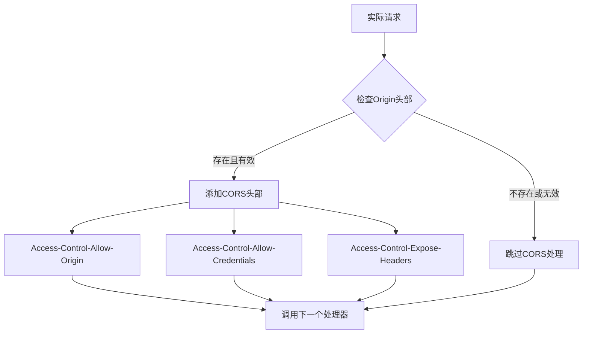
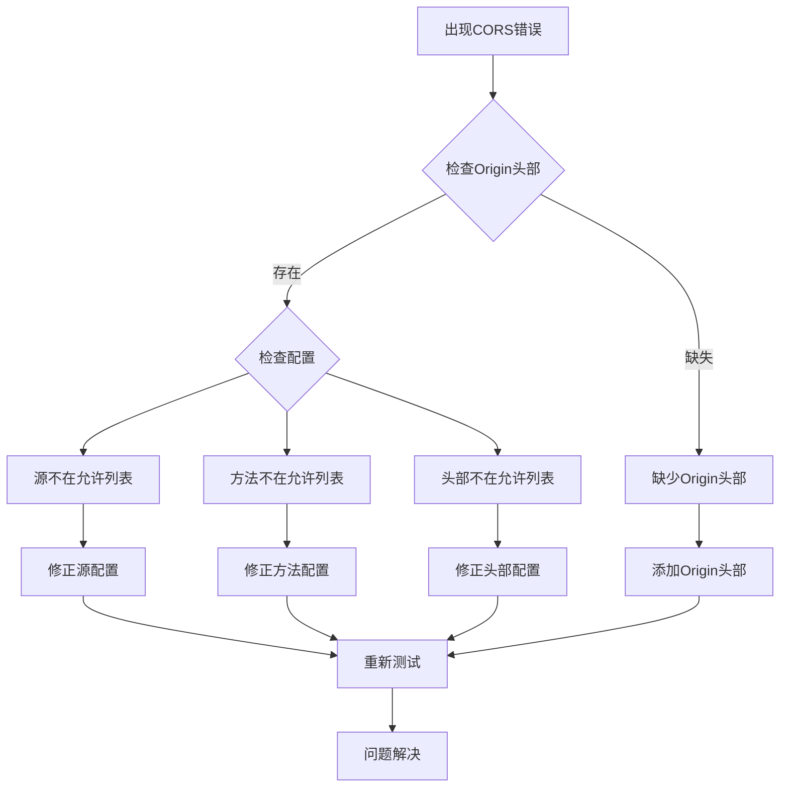

# CORS 跨域中间件

<cite>
**本文档引用的文件**
- [middleware.go](file://middleware/cors/middleware.go)
- [option.go](file://middleware/cors/option.go)
- [middleware_test.go](file://middleware/cors/middleware_test.go)
- [middleware.go](file://server/middleware.go)
- [middleware.go](file://middleware/accesslog/middleware.go)
- [middleware.go](file://middleware/recovery/middleware.go)
</cite>

## 目录
1. [简介](#简介)
2. [项目结构](#项目结构)
3. [核心组件](#核心组件)
4. [架构概览](#架构概览)
5. [详细组件分析](#详细组件分析)
6. [配置选项详解](#配置选项详解)
7. [工作原理与流程](#工作原理与流程)
8. [预检请求处理](#预检请求处理)
9. [实际请求处理](#实际请求处理)
10. [配置示例](#配置示例)
11. [常见问题与调试](#常见问题与调试)
12. [性能考虑](#性能考虑)
13. [故障排除指南](#故障排除指南)
14. [结论](#结论)

## 简介

CORS（跨域资源共享）中间件是Goose框架中用于处理跨域HTTP请求的重要组件。该中间件实现了W3C CORS规范，能够自动处理预检请求（OPTIONS）和实际的跨域请求，确保Web应用在不同源之间安全地共享资源。

CORS中间件提供了灵活的配置选项，支持多种跨域场景，包括简单的跨域请求和复杂的跨域请求（需要预检）。它能够精确控制允许的源、方法、头部以及凭证传递，为现代Web应用提供了强大的跨域支持能力。

## 项目结构

CORS中间件位于Goose框架的中间件子系统中，采用模块化设计，与其他中间件如访问日志、错误恢复等协同工作。



**图表来源**
- [middleware.go:1-249](file://middleware/cors/middleware.go#L1-L249)
- [middleware.go:1-85](file://server/middleware.go#L1-L85)

**章节来源**
- [middleware.go:1-249](file://middleware/cors/middleware.go#L1-L249)
- [middleware.go:1-85](file://server/middleware.go#L1-L85)

## 核心组件

CORS中间件由三个主要组件构成：核心处理逻辑、配置选项系统和测试验证框架。

### 主要特性

1. **预检请求处理**：自动识别和处理OPTIONS预检请求
2. **实际请求处理**：为跨域实际请求添加适当的CORS头
3. **灵活的源控制**：支持精确匹配和通配符模式
4. **方法和头部验证**：严格验证允许的方法和自定义头部
5. **凭证支持**：可选择性地允许携带认证信息
6. **私有网络访问**：支持现代浏览器的私有网络访问功能

**章节来源**
- [middleware.go:35-160](file://middleware/cors/middleware.go#L35-L160)
- [option.go:9-18](file://middleware/cors/option.go#L9-L18)

## 架构概览

CORS中间件采用函数式中间件架构，遵循Goose框架的中间件模式设计。



**图表来源**
- [middleware.go:147-159](file://middleware/cors/middleware.go#L147-L159)
- [middleware.go:162-216](file://middleware/cors/middleware.go#L162-L216)

**章节来源**
- [middleware.go:147-160](file://middleware/cors/middleware.go#L147-L160)

## 详细组件分析

### 中间件核心实现

CORS中间件的核心实现采用了分层处理策略，将预检请求和实际请求分别处理。



**图表来源**
- [middleware.go:45-160](file://middleware/cors/middleware.go#L45-L160)
- [option.go:9-18](file://middleware/cors/option.go#L9-L18)
- [option.go:95-104](file://middleware/cors/option.go#L95-L104)

**章节来源**
- [middleware.go:45-160](file://middleware/cors/middleware.go#L45-L160)
- [option.go:9-104](file://middleware/cors/option.go#L9-L104)

### 配置选项系统

CORS中间件提供了丰富的配置选项，通过函数式选项模式实现灵活的配置。



**图表来源**
- [option.go:22-28](file://middleware/cors/option.go#L22-L28)
- [option.go:38-93](file://middleware/cors/option.go#L38-L93)

**章节来源**
- [option.go:22-93](file://middleware/cors/option.go#L22-L93)

## 配置选项详解

### 默认配置

CORS中间件提供了合理的默认配置，确保在大多数情况下都能正常工作：

- **允许的源**：`["*"]` - 允许所有源
- **允许的方法**：`[GET, POST, HEAD]` - 基础HTTP方法
- **允许的头部**：`[Accept, Content-Type, X-Requested-With]` - 常用头部
- **最大缓存时间**：`10分钟` - 预检请求缓存

### 高级配置选项

| 选项 | 类型 | 描述 | 默认值 |
|------|------|------|--------|
| AllowedOrigins | `[]string` | 允许的源列表，支持通配符 | `["*"]` |
| AllowedMethods | `[]string` | 允许的HTTP方法 | `[GET, POST, HEAD]` |
| AllowedHeaders | `[]string` | 允许的请求头部 | `[Accept, Content-Type, X-Requested-With]` |
| ExposedHeaders | `[]string` | 可暴露给客户端的响应头部 | `[]` |
| MaxAge | `time.Duration` | 预检请求缓存时间 | `10*time.Minute` |
| AllowCredentials | `bool` | 是否允许携带凭证 | `false` |
| AllowPrivateNetwork | `bool` | 是否允许私有网络访问 | `false` |
| AllowOriginFunc | `func` | 自定义源验证函数 | `nil` |

**章节来源**
- [option.go:9-18](file://middleware/cors/option.go#L9-L18)
- [option.go:22-28](file://middleware/cors/option.go#L22-L28)

## 工作原理与流程

### 请求分类机制

CORS中间件通过检查请求方法和特定头部来区分不同类型的请求：



**图表来源**
- [middleware.go:150-159](file://middleware/cors/middleware.go#L150-L159)
- [middleware.go:162-216](file://middleware/cors/middleware.go#L162-L216)

**章节来源**
- [middleware.go:150-159](file://middleware/cors/middleware.go#L150-L159)

## 预检请求处理

### 预检请求识别

预检请求是CORS协议中的关键概念，当客户端发送复杂请求时，浏览器会先发送OPTIONS预检请求来确认服务器是否允许实际请求。

### 预检请求验证流程



**图表来源**
- [middleware.go:162-216](file://middleware/cors/middleware.go#L162-L216)

**章节来源**
- [middleware.go:162-216](file://middleware/cors/middleware.go#L162-L216)

### 预检请求头部验证

预检请求的头部验证是CORS安全性的关键环节：

1. **Access-Control-Request-Method**：验证请求方法是否在允许列表中
2. **Access-Control-Request-Headers**：验证自定义头部是否被允许
3. **Access-Control-Request-Private-Network**：验证私有网络访问权限

**章节来源**
- [middleware.go:178-196](file://middleware/cors/middleware.go#L178-L196)

## 实际请求处理

### 实际请求处理流程

实际请求处理相对简单，主要是为响应添加适当的CORS头部：



**图表来源**
- [middleware.go:218-248](file://middleware/cors/middleware.go#L218-L248)

**章节来源**
- [middleware.go:218-248](file://middleware/cors/middleware.go#L218-L248)

### Vary头部管理

CORS中间件智能地管理Vary头部，确保代理缓存正确处理跨域响应：

- **实际请求**：Vary: Origin
- **预检请求**：Vary: Origin, Access-Control-Request-Method, Access-Control-Request-Headers[, Access-Control-Request-Private-Network]

**章节来源**
- [middleware.go:165-169](file://middleware/cors/middleware.go#L165-L169)
- [middleware.go:221-225](file://middleware/cors/middleware.go#L221-L225)

## 配置示例

### 基础配置

最简单的CORS配置允许所有源和基本方法：

```go
// 创建默认CORS中间件
mdw := cors.Server()

// 或者显式配置
mdw := cors.Server(
    cors.AllowedOrigins([]string{"*"}),
    cors.AllowedMethods([]string{http.MethodGet, http.MethodPost}),
)
```

### 限制源访问

```go
// 仅允许特定源
mdw := cors.Server(
    cors.AllowedOrigins([]string{
        "https://example.com",
        "https://app.example.com",
    }),
)

// 使用通配符模式
mdw := cors.Server(
    cors.AllowedOrigins([]string{
        "https://*.example.com",
        "https://dashboard.*.example.com",
    }),
)
```

### 复杂请求配置

```go
// 支持复杂请求的完整配置
mdw := cors.Server(
    cors.AllowedOrigins([]string{"https://example.com"}),
    cors.AllowedMethods([]string{
        http.MethodGet,
        http.MethodPost,
        http.MethodPut,
        http.MethodDelete,
        http.MethodOptions,
    }),
    cors.AllowedHeaders([]string{
        "Content-Type",
        "Authorization",
        "X-Custom-Header",
    }),
    cors.ExposedHeaders([]string{
        "X-Request-ID",
        "X-Response-Time",
    }),
    cors.AllowCredentials(),
    cors.MaxAge(15 * time.Minute),
)
```

### 动态源验证

```go
// 使用自定义函数验证源
mdw := cors.Server(
    cors.AllowOriginFunc(func(r *http.Request, origin string) bool {
        // 仅允许特定域名和环境
        return origin == "https://example.com" && 
               r.Header.Get("X-Environment") == "production"
    }),
)
```

### 私有网络访问

```go
// 启用私有网络访问支持
mdw := cors.Server(
    cors.AllowedOrigins([]string{"https://example.com"}),
    cors.AllowPrivateNetwork(),
)
```

**章节来源**
- [middleware.go:7-22](file://middleware/cors/middleware.go#L7-L22)
- [middleware_test.go:58-94](file://middleware/cors/middleware_test.go#L58-L94)

## 常见问题与调试

### 调试技巧

1. **启用访问日志**：结合访问日志中间件查看CORS头部
2. **检查Vary头部**：确保代理缓存正确处理跨域响应
3. **验证预检缓存**：使用MaxAge参数优化性能
4. **测试不同场景**：覆盖简单请求和复杂请求的所有组合

### 常见问题解决

#### 问题1：预检请求被拒绝

**症状**：浏览器显示CORS错误，预检请求返回403

**解决方案**：
- 检查AllowedMethods是否包含实际请求方法
- 验证AllowedHeaders是否包含所有自定义头部
- 确认AllowOriginFunc返回true

#### 问题2：凭证无法传递

**症状**：设置了AllowCredentials但客户端无法访问响应头部

**解决方案**：
- 确保AllowedOrigins不是"*"，必须指定具体源
- 验证AllowCredentials选项已启用

#### 问题3：预检缓存失效

**症状**：频繁发送预检请求，影响性能

**解决方案**：
- 设置合适的MaxAge值
- 确保预检请求的头部保持一致

**章节来源**
- [middleware_test.go:196-266](file://middleware/cors/middleware_test.go#L196-L266)
- [middleware_test.go:309-339](file://middleware/cors/middleware_test.go#L309-L339)

## 性能考虑

### 缓存策略

CORS中间件通过MaxAge参数实现预检请求缓存，显著减少重复的预检请求：

- **默认缓存时间**：10分钟
- **最佳实践**：根据实际需求调整缓存时间
- **动态调整**：复杂请求可能需要更短的缓存时间

### 内存优化

1. **字符串处理**：使用strings包进行高效的字符串操作
2. **切片复用**：避免不必要的内存分配
3. **函数闭包**：合理使用闭包减少重复代码

### 并发安全性

CORS中间件在并发环境下表现稳定，因为：
- 所有状态都是只读的配置
- 处理逻辑不依赖共享可变状态
- 使用标准库的并发安全工具

## 故障排除指南

### 调试步骤

1. **检查请求头部**：确认Origin、Access-Control-Request-Method等头部是否存在
2. **验证配置**：确认AllowedOrigins、AllowedMethods、AllowedHeaders配置正确
3. **查看响应头部**：检查CORS相关头部是否正确设置
4. **测试预检请求**：直接发送OPTIONS请求验证预检逻辑

### 常见错误模式



**图表来源**
- [middleware_test.go:175-194](file://middleware/cors/middleware_test.go#L175-L194)
- [middleware_test.go:234-244](file://middleware/cors/middleware_test.go#L234-L244)

**章节来源**
- [middleware_test.go:175-266](file://middleware/cors/middleware_test.go#L175-L266)

## 结论

Goose框架的CORS中间件提供了强大而灵活的跨域资源共享解决方案。通过精心设计的配置选项、严格的验证机制和完善的测试覆盖，该中间件能够满足各种复杂的跨域需求。

### 主要优势

1. **完整的CORS实现**：严格按照W3C规范实现
2. **灵活的配置选项**：支持从简单到复杂的各种配置
3. **优秀的性能表现**：通过预检缓存和优化的算法实现高效处理
4. **全面的测试覆盖**：包含各种边界情况和错误场景的测试
5. **易于集成**：与Goose框架的其他中间件无缝协作

### 最佳实践建议

1. **最小权限原则**：仅允许必要的源、方法和头部
2. **明确的凭证策略**：谨慎使用AllowCredentials选项
3. **合理的缓存设置**：根据实际需求调整MaxAge参数
4. **动态源验证**：在生产环境中使用AllowOriginFunc进行动态验证
5. **充分的测试**：在部署前进行全面的跨域测试

CORS中间件为Goose框架提供了坚实的跨域支持基础，使得开发者能够专注于业务逻辑的实现，而不必担心复杂的跨域问题。