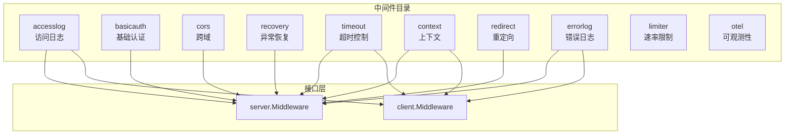
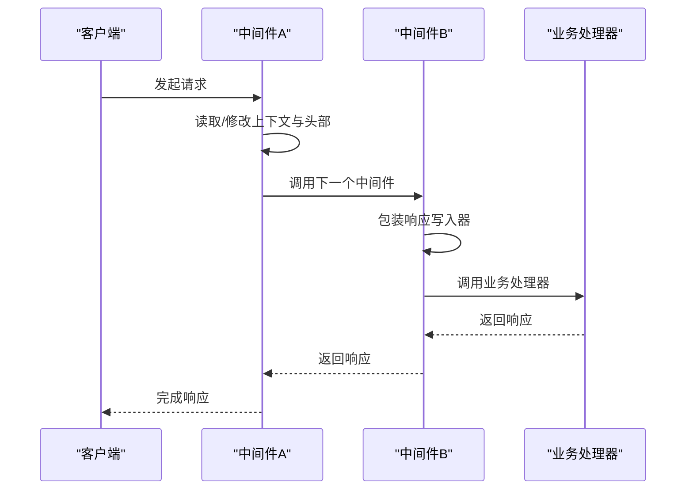
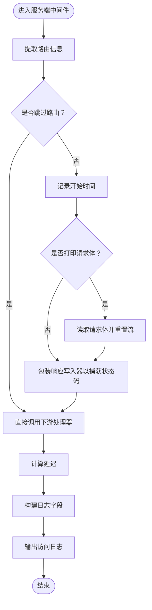
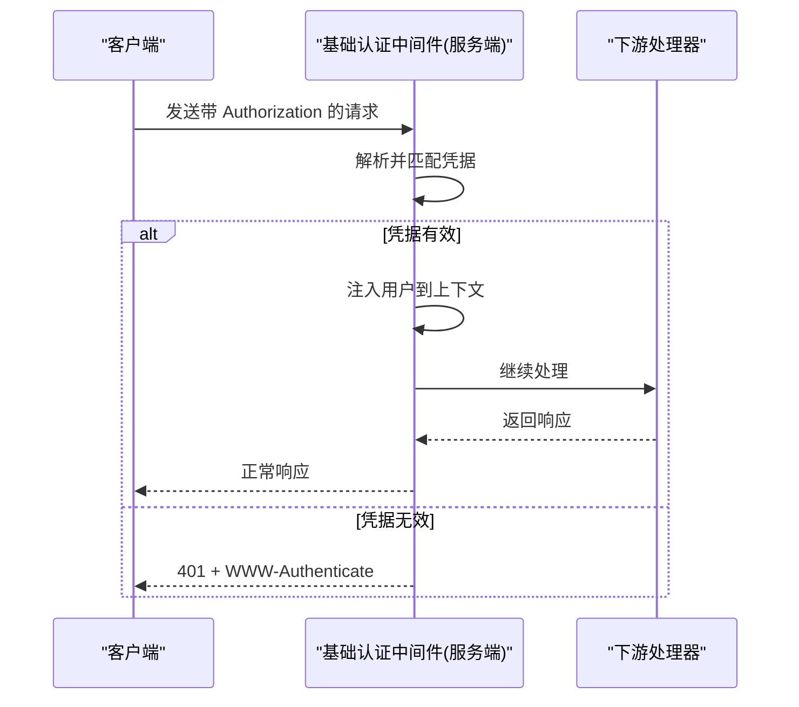
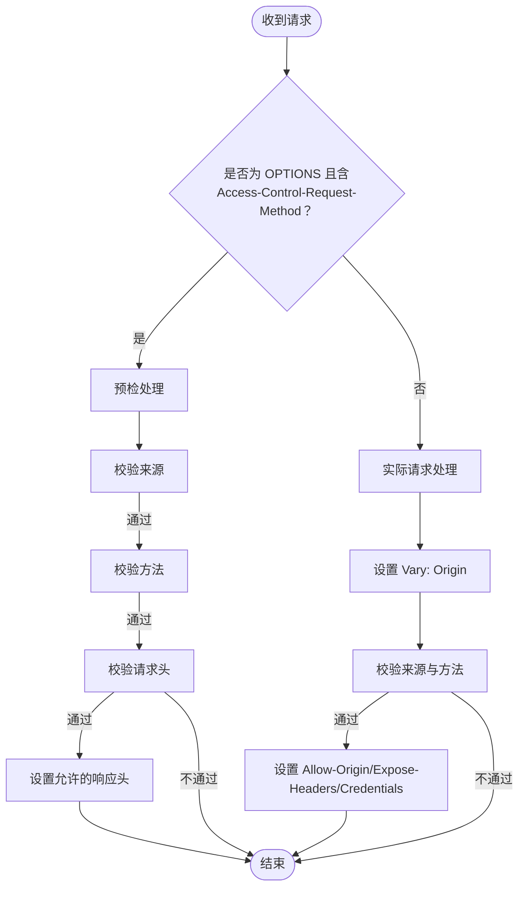
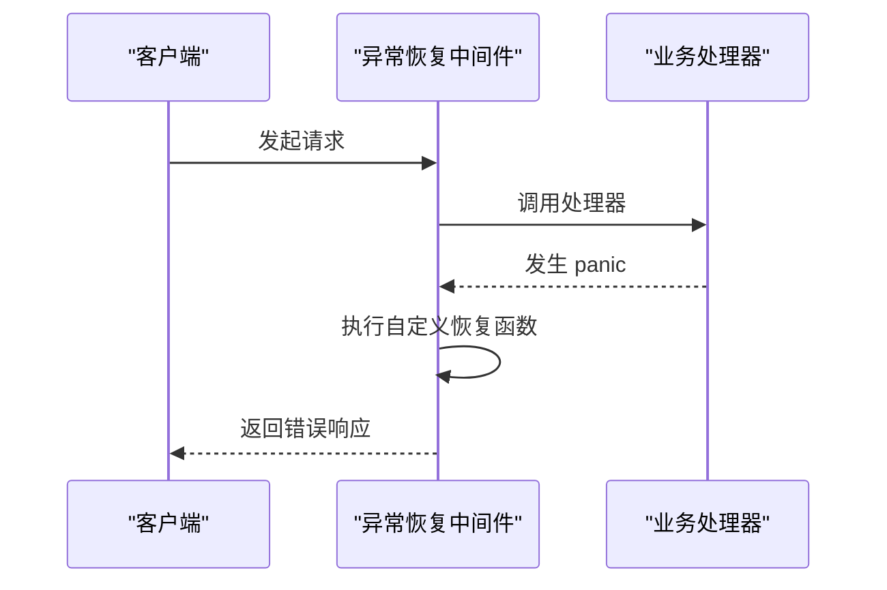
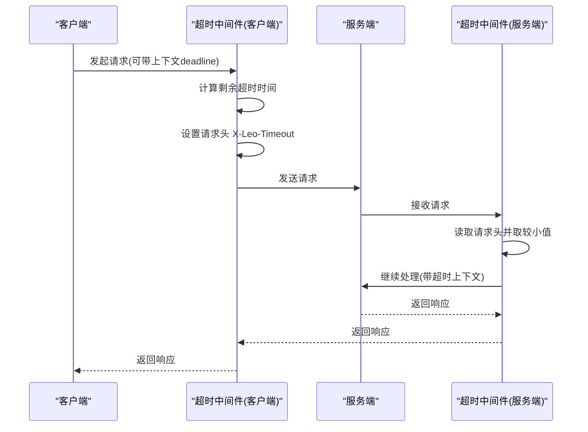
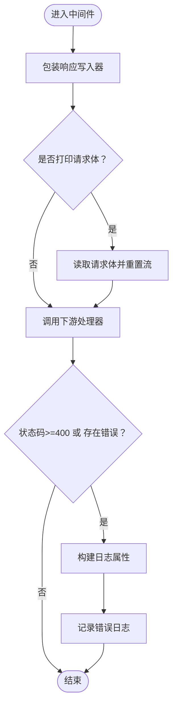
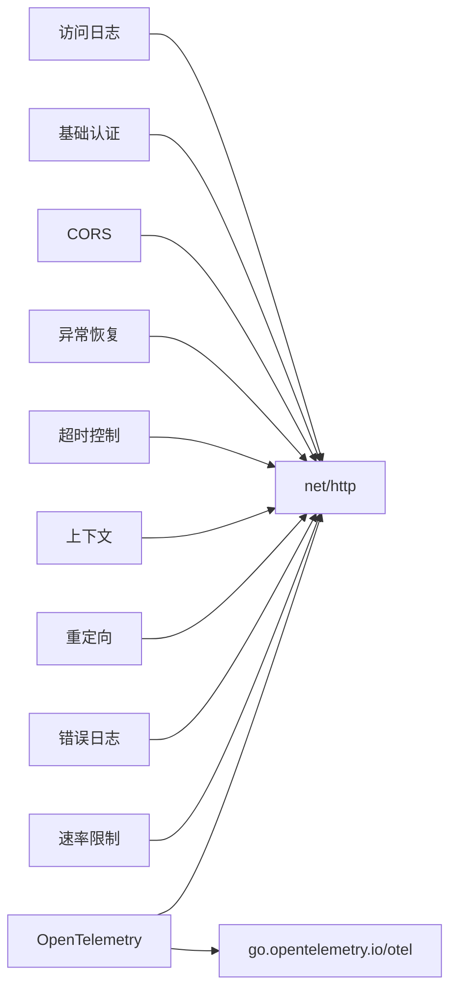

# 内置中间件详解

<cite>
**本文档引用的文件**
- [accesslog/middleware.go](file://middleware/accesslog/middleware.go)
- [basicauth/middleware.go](file://middleware/basicauth/middleware.go)
- [cors/middleware.go](file://middleware/cors/middleware.go)
- [cors/option.go](file://middleware/cors/option.go)
- [cors/middleware_test.go](file://middleware/cors/middleware_test.go)
- [recovery/middleware.go](file://middleware/recovery/middleware.go)
- [timeout/middleware.go](file://middleware/timeout/middleware.go)
- [context/middleware.go](file://middleware/context/middleware.go)
- [redirect/middleware.go](file://middleware/redirect/middleware.go)
- [errorlog/middleware.go](file://middleware/errorlog/middleware.go)
- [errorlog/option.go](file://middleware/errorlog/option.go)
- [limiter/middleware.go](file://middleware/limiter/middleware.go)
- [otel/middleware.go](file://middleware/otel/middleware.go)
</cite>

## 目录
1. [简介](#简介)
2. [项目结构](#项目结构)
3. [核心组件](#核心组件)
4. [架构概览](#架构概览)
5. [详细组件分析](#详细组件分析)
6. [依赖关系分析](#依赖关系分析)
7. [性能考量](#性能考量)
8. [故障排除指南](#故障排除指南)
9. [结论](#结论)

## 简介
本文件系统性地介绍了 Goose 项目中的内置中间件，涵盖访问日志、基础认证、CORS、异常恢复、超时控制等核心中间件的功能特性与使用方法。文档重点说明各中间件的配置选项、处理流程、安全考虑与最佳实践，并提供完整的配置示例与适用场景。

## 项目结构
Goose 的中间件位于 middleware 目录下，按功能模块划分，每个中间件通常包含一个 middleware.go 文件以及可选的 option.go 配置文件。整体采用分层设计：服务端中间件遵循 server.Middleware 接口，客户端中间件遵循 client.Middleware 接口，二者均通过统一的调用约定集成到 HTTP 处理链中。

**图表来源**
- [accesslog/middleware.go:104-204](file://middleware/accesslog/middleware.go#L104-L204)
- [basicauth/middleware.go:55-76](file://middleware/basicauth/middleware.go#L55-L76)
- [cors/middleware.go:45-160](file://middleware/cors/middleware.go#L45-L160)
- [recovery/middleware.go:38-50](file://middleware/recovery/middleware.go#L38-L50)
- [timeout/middleware.go:28-106](file://middleware/timeout/middleware.go#L28-L106)
- [context/middleware.go:13-34](file://middleware/context/middleware.go#L13-L34)
- [redirect/middleware.go:9-21](file://middleware/redirect/middleware.go#L9-L21)
- [errorlog/middleware.go:24-106](file://middleware/errorlog/middleware.go#L24-L106)

**章节来源**
- [accesslog/middleware.go:1-318](file://middleware/accesslog/middleware.go#L1-L318)
- [basicauth/middleware.go:1-113](file://middleware/basicauth/middleware.go#L1-L113)
- [cors/middleware.go:1-249](file://middleware/cors/middleware.go#L1-L249)
- [recovery/middleware.go:1-55](file://middleware/recovery/middleware.go#L1-L55)
- [timeout/middleware.go:1-107](file://middleware/timeout/middleware.go#L1-L107)
- [context/middleware.go:1-35](file://middleware/context/middleware.go#L1-L35)
- [redirect/middleware.go:1-22](file://middleware/redirect/middleware.go#L1-L22)
- [errorlog/middleware.go:1-195](file://middleware/errorlog/middleware.go#L1-L195)

## 核心组件
本节概述各中间件的核心职责与通用模式：
- 访问日志中间件：记录请求/响应元数据、延迟、状态码等，支持服务端与客户端双端。
- 基础认证中间件：解析 Authorization 头，校验凭据，注入用户信息到上下文。
- CORS 中间件：处理预检与实际请求，动态设置允许的来源、方法、头与凭证。
- 异常恢复中间件：捕获 panic 并执行自定义恢复逻辑，保障服务稳定性。
- 超时控制中间件：基于请求头或上下文 deadline 动态设置超时，确保资源可控。
- 上下文中间件：允许对请求上下文进行扩展或替换。
- 重定向中间件：强制 HTTPS 重定向，处理转发协议头。
- 错误日志中间件：仅在 4xx/5xx 或客户端错误时记录详细日志。
- 速率限制中间件：基于 BBR 算法进行自适应限流。
- OpenTelemetry 中间件：集成分布式追踪与指标标注。

**章节来源**
- [accesslog/middleware.go:104-204](file://middleware/accesslog/middleware.go#L104-L204)
- [basicauth/middleware.go:55-113](file://middleware/basicauth/middleware.go#L55-L113)
- [cors/middleware.go:45-249](file://middleware/cors/middleware.go#L45-L249)
- [recovery/middleware.go:38-55](file://middleware/recovery/middleware.go#L38-L55)
- [timeout/middleware.go:28-107](file://middleware/timeout/middleware.go#L28-L107)
- [context/middleware.go:13-35](file://middleware/context/middleware.go#L13-L35)
- [redirect/middleware.go:9-22](file://middleware/redirect/middleware.go#L9-L22)
- [errorlog/middleware.go:24-195](file://middleware/errorlog/middleware.go#L24-L195)
- [limiter/middleware.go:36-64](file://middleware/limiter/middleware.go#L36-L64)
- [otel/middleware.go:23-52](file://middleware/otel/middleware.go#L23-L52)

## 架构概览
中间件通过统一的调用约定串联形成处理链。服务端中间件接收 http.ResponseWriter、*http.Request 与下一个处理器函数；客户端中间件接收 *http.Client、*http.Request 与下一个调用器。中间件通常会：
- 读取/修改请求上下文与头部
- 包装响应写入器以捕获状态码
- 在调用下游处理器前后插入行为
- 记录日志或设置可观测性标签

**图表来源**
- [accesslog/middleware.go:127-204](file://middleware/accesslog/middleware.go#L127-L204)
- [errorlog/middleware.go:29-106](file://middleware/errorlog/middleware.go#L29-L106)
- [timeout/middleware.go:28-106](file://middleware/timeout/middleware.go#L28-L106)

## 详细组件分析

### 访问日志中间件（accesslog）
- 功能特性
  - 支持服务端与客户端双端日志记录
  - 可配置日志级别、跳过特定路由、打印请求/响应体
  - 使用 sync.Pool 复用 slog.Attr 切片以降低 GC 压力
  - 服务端模式下自动提取路由信息，客户端模式下记录请求 ID 与 deadline
- 关键配置项
  - WithLevel：设置日志级别
  - WithSkip：按路由跳过日志
  - WithPrintRequest/WithPrintResponse：选择性打印请求/响应体
- 输出字段（服务端）
  - 系统标识、时间戳、延迟、方法、URI、路径、协议、主机、远程地址
  - 状态码、X-Forwarded-For、Authorization、Referer、User-Agent、X-Request-Id
  - deadline（若存在）、request_body/response_body（若启用）
- 输出字段（客户端）
  - 系统标识、时间戳、延迟、方法、URI、协议、主机、路径、X-Request-Id
  - deadline（若存在）、response_status（若响应存在）、error（若存在）

**图表来源**
- [accesslog/middleware.go:116-204](file://middleware/accesslog/middleware.go#L116-L204)

**章节来源**
- [accesslog/middleware.go:20-102](file://middleware/accesslog/middleware.go#L20-L102)
- [accesslog/middleware.go:104-204](file://middleware/accesslog/middleware.go#L104-L204)
- [accesslog/middleware.go:206-276](file://middleware/accesslog/middleware.go#L206-L276)

使用场景与示例
- 服务端生产环境：建议设置 WithLevel 为 Info，开启 WithPrintRequest/WithPrintResponse 仅在调试阶段使用
- 客户端微服务：记录上游调用的延迟与状态，便于定位性能瓶颈
- 路由级过滤：使用 WithSkip 对健康检查或监控路由进行跳过

### 基础认证中间件（basicauth）
- 功能特性
  - 服务端：解析 Authorization 头，验证用户凭据，失败时返回 401 并设置 WWW-Authenticate
  - 客户端：将用户名密码设置到请求 URL，便于下游服务识别
  - 使用 constant-time 比较避免时序攻击
  - 将用户名注入上下文，可通过 FromContext 获取
- 关键配置项
  - Realm：设置 WWW-Authenticate 的 realm 字段
- 安全考虑
  - 必须配合 HTTPS 使用，防止明文传输
  - 凭据列表不能为空，用户名不可为空
  - 建议定期轮换密码并限制账户数量

**图表来源**
- [basicauth/middleware.go:55-76](file://middleware/basicauth/middleware.go#L55-L76)

**章节来源**
- [basicauth/middleware.go:30-76](file://middleware/basicauth/middleware.go#L30-L76)
- [basicauth/middleware.go:78-113](file://middleware/basicauth/middleware.go#L78-L113)

使用场景与示例
- 内部 API 保护：为管理接口添加基础认证
- 微服务间鉴权：客户端中间件自动附加凭据到下游请求

### CORS 中间件（cors）
- 功能特性
  - 自动区分预检（OPTIONS）与实际请求
  - 支持通配符来源（如 https://*.example.com）
  - 可配置允许的方法、头、暴露头、最大缓存时间、凭证与私有网络访问
  - 预检请求时根据 Vary 头优化缓存
- 关键配置项（Option）
  - AllowedOrigins：允许的来源列表，支持通配符
  - AllowOriginFunc：自定义来源判断函数
  - AllowedMethods：允许的 HTTP 方法
  - AllowedHeaders/ExposedHeaders：允许与暴露的头
  - MaxAge：预检缓存时间
  - AllowCredentials：是否允许携带凭证
  - AllowPrivateNetwork：是否允许私有网络访问
- 预检请求处理流程
  - 校验 Origin、Access-Control-Request-Method、Access-Control-Request-Headers
  - 设置 Vary、Allow-Origin、Allow-Methods、Allow-Headers、Max-Age、Allow-Credentials、Allow-Private-Network

**图表来源**
- [cors/middleware.go:147-160](file://middleware/cors/middleware.go#L147-L160)
- [cors/middleware.go:162-216](file://middleware/cors/middleware.go#L162-L216)
- [cors/middleware.go:218-248](file://middleware/cors/middleware.go#L218-L248)

**章节来源**
- [cors/middleware.go:35-160](file://middleware/cors/middleware.go#L35-L160)
- [cors/option.go:9-93](file://middleware/cors/option.go#L9-L93)
- [cors/middleware_test.go:41-56](file://middleware/cors/middleware_test.go#L41-L56)

使用场景与示例
- 前后端分离：允许特定前端域名访问后端 API
- 私有网络访问：在需要时允许从私网发起的请求
- 预检缓存：合理设置 MaxAge 以减少重复预检请求

### 异常恢复中间件（recovery）
- 功能特性
  - 使用 defer 捕获 panic，执行自定义 HandlerFunc
  - 默认处理会记录 panic 与堆栈信息
  - 可通过 RecoveryHandler 自定义恢复逻辑（如返回友好错误页面）
- 典型用法
  - 在中间件链末端放置，确保所有处理器异常都能被捕获

**图表来源**
- [recovery/middleware.go:38-50](file://middleware/recovery/middleware.go#L38-L50)

**章节来源**
- [recovery/middleware.go:11-55](file://middleware/recovery/middleware.go#L11-L55)

使用场景与示例
- 生产环境稳定性：避免未捕获异常导致进程崩溃
- 自定义错误页：结合业务返回统一的错误页面或 JSON

### 超时控制中间件（timeout）
- 功能特性
  - 服务端：从请求头 X-Leo-Timeout 读取超时设置，取请求设置与默认值的较小者
  - 客户端：基于上下文 deadline 计算剩余时间，设置请求头并创建带超时的上下文
  - 统一的 Key 常量便于跨端一致性
- 上下文管理
  - 服务端与客户端均通过 WithCancel 管理超时生命周期
  - 客户端遇到 deadline 已过的情况直接返回 DeadlineExceeded

**图表来源**
- [timeout/middleware.go:28-106](file://middleware/timeout/middleware.go#L28-L106)

**章节来源**
- [timeout/middleware.go:14-107](file://middleware/timeout/middleware.go#L14-L107)

使用场景与示例
- 网关聚合：根据上游请求设置更严格的超时
- 客户端熔断：利用 deadline 控制调用链路的总耗时

### 上下文中间件（context）
- 功能特性
  - 允许对请求上下文进行转换或扩展
  - 服务端与客户端均支持，便于注入 TraceID、用户信息等
- 典型用法
  - 与 OpenTelemetry 结合注入标签
  - 在认证后将用户信息写入上下文

**章节来源**
- [context/middleware.go:13-35](file://middleware/context/middleware.go#L13-L35)

使用场景与示例
- 追踪与审计：在上下文中携带 TraceID 以便全链路追踪
- 权限控制：在上下文中携带用户角色或租户信息

### 重定向中间件（redirect）
- 功能特性
  - 将非 HTTPS 请求重定向至 HTTPS
  - 支持 X-Forwarded-Proto 头判断真实协议
- 注意事项
  - 未来可能支持 Forwarded 头规范（TODO）

**章节来源**
- [redirect/middleware.go:9-22](file://middleware/redirect/middleware.go#L9-L22)

使用场景与示例
- 强制 HTTPS：在公网入口启用，确保所有流量加密

### 错误日志中间件（errorlog）
- 功能特性
  - 仅在 4xx/5xx 或客户端错误时记录日志
  - 支持打印请求/响应体，便于问题排查
  - 服务端与客户端分别实现
- 关键配置项
  - WithPrintRequest/WithPrintResponse：选择性打印

**图表来源**
- [errorlog/middleware.go:24-106](file://middleware/errorlog/middleware.go#L24-L106)

**章节来源**
- [errorlog/middleware.go:16-106](file://middleware/errorlog/middleware.go#L16-L106)
- [errorlog/option.go:6-60](file://middleware/errorlog/option.go#L6-L60)

使用场景与示例
- 生产问题排查：开启 WithPrintRequest/WithPrintResponse 快速定位问题
- 客户端调用异常：记录上游错误与状态码

### 速率限制中间件（limiter）
- 功能特性
  - 基于 BBR 算法的自适应限流
  - 捕获实际响应状态码用于统计与反馈
  - 超限时返回 429 Too Many Requests
- 实现要点
  - 包装响应写入器以捕获最终状态码
  - 完成回调传递 DoneInfo，包含实际状态码

**章节来源**
- [limiter/middleware.go:36-64](file://middleware/limiter/middleware.go#L36-L64)

使用场景与示例
- 防刷与削峰：对外部 API 或热门接口进行限流保护
- 自适应调节：结合实际响应状态码优化限流策略

### OpenTelemetry 中间件（otel）
- 功能特性
  - 服务端：基于路由信息生成操作名，注入标签（路由、方法、RPC 方法）
  - 客户端：包装 Transport 以采集出站调用指标
  - 提供 ExtractTraceId 辅助提取追踪 ID

**章节来源**
- [otel/middleware.go:23-52](file://middleware/otel/middleware.go#L23-L52)

使用场景与示例
- 分布式追踪：在微服务间建立统一的追踪链路
- 指标采集：结合 Prometheus/OpenTelemetry 平台进行监控

## 依赖关系分析
- 中间件间耦合度低，主要通过 HTTP 接口与上下文交互
- 服务端与客户端中间件分别独立实现，便于按需组合
- 部分中间件依赖标准库（net/http、context、log/slog）与第三方库（OpenTelemetry）

**图表来源**
- [accesslog/middleware.go:4-18](file://middleware/accesslog/middleware.go#L4-L18)
- [basicauth/middleware.go:3-14](file://middleware/basicauth/middleware.go#L3-L14)
- [cors/middleware.go:25-33](file://middleware/cors/middleware.go#L25-L33)
- [recovery/middleware.go:3-9](file://middleware/recovery/middleware.go#L3-L9)
- [timeout/middleware.go:4-12](file://middleware/timeout/middleware.go#L4-L12)
- [context/middleware.go:3-9](file://middleware/context/middleware.go#L3-L9)
- [redirect/middleware.go:3-7](file://middleware/redirect/middleware.go#L3-L7)
- [errorlog/middleware.go:5-14](file://middleware/errorlog/middleware.go#L5-L14)
- [limiter/middleware.go:4-7](file://middleware/limiter/middleware.go#L4-L7)
- [otel/middleware.go:11-14](file://middleware/otel/middleware.go#L11-L14)

## 性能考量
- 访问日志中间件使用 sync.Pool 复用字段切片，降低内存分配与 GC 压力
- 基础认证使用 constant-time 比较，避免时序侧信道
- CORS 中间件对通配符来源进行预处理，减少运行时匹配开销
- 超时中间件在客户端基于 deadline 计算剩余时间，避免不必要的超时设置
- 异常恢复中间件仅在 panic 发生时执行，正常路径无额外开销

## 故障排除指南
- CORS 预检失败
  - 检查 AllowedOrigins 与 AllowOriginFunc 配置是否匹配
  - 确认请求头 Access-Control-Request-Method 与 Access-Control-Request-Headers 是否在允许范围内
  - 查看 Vary 头是否正确设置
- 基础认证 401
  - 确认 Authorization 头格式正确（Basic base64(user:pass)）
  - 检查凭据列表是否包含对应用户
- 超时问题
  - 服务端：确认请求头 X-Leo-Timeout 格式正确且大于 0
  - 客户端：检查上下文 deadline 是否已过期
- 日志过多或敏感信息泄露
  - 访问日志：关闭 WithPrintRequest/WithPrintResponse
  - 错误日志：仅在必要时开启打印体，避免生产环境打印敏感数据

**章节来源**
- [cors/middleware.go:162-216](file://middleware/cors/middleware.go#L162-L216)
- [basicauth/middleware.go:55-76](file://middleware/basicauth/middleware.go#L55-L76)
- [timeout/middleware.go:34-46](file://middleware/timeout/middleware.go#L34-L46)
- [accesslog/middleware.go:80-102](file://middleware/accesslog/middleware.go#L80-L102)
- [errorlog/middleware.go:37-42](file://middleware/errorlog/middleware.go#L37-L42)

## 结论
Goose 的内置中间件提供了完善的基础设施能力，覆盖了日志、认证、跨域、恢复、超时、上下文、重定向、错误日志、限流与可观测性等关键领域。通过清晰的配置接口与统一的调用约定，开发者可以灵活组合中间件以满足不同场景的需求。建议在生产环境中优先启用访问日志、错误日志、异常恢复与超时控制，并结合 CORS 与基础认证保障 API 安全与合规。