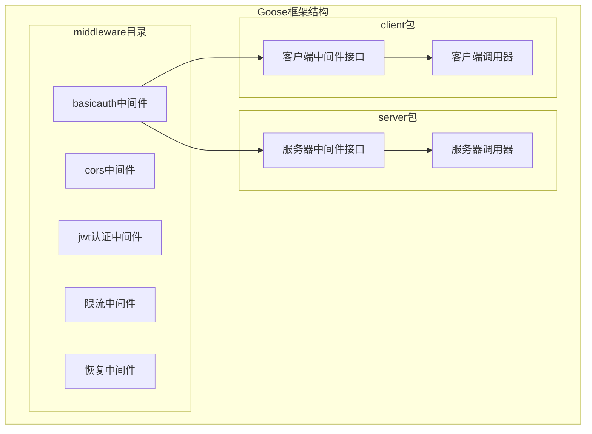
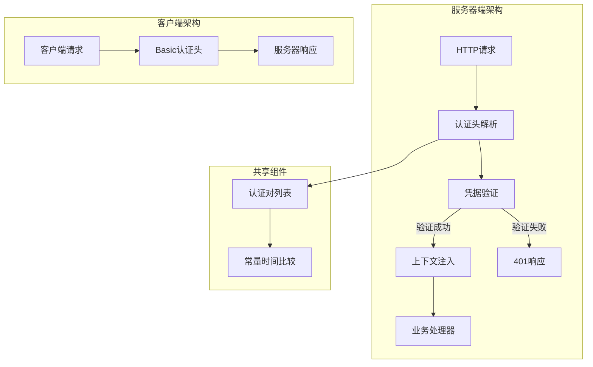
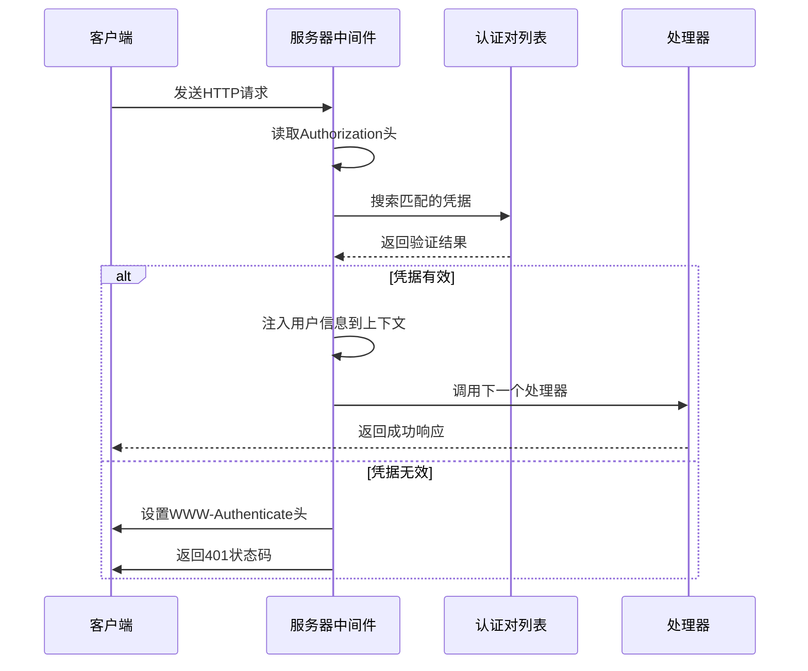
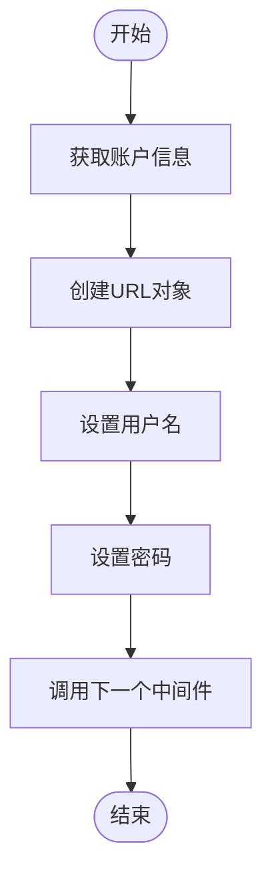
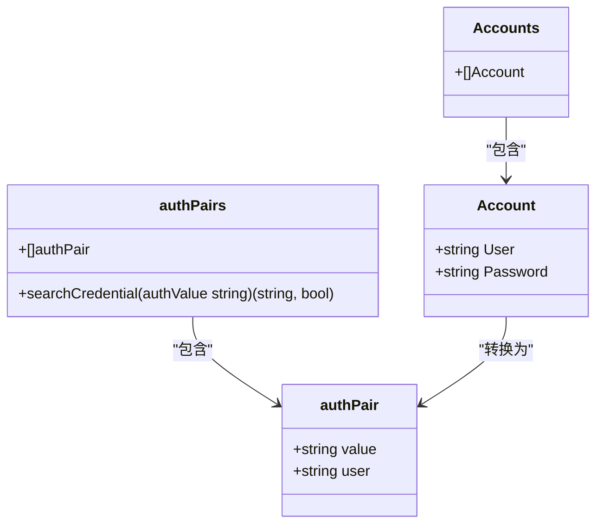
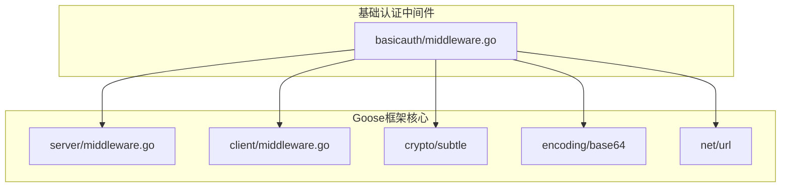

# 基础认证中间件

<cite>
**本文档引用的文件**
- [middleware.go](file://middleware/basicauth/middleware.go)
- [middleware.go](file://server/middleware.go)
- [middleware.go](file://client/middleware.go)
- [middleware_test.go](file://server/middleware_test.go)
- [middleware_test.go](file://client/middleware_test.go)
- [middleware.go](file://middleware/jwtauth/middleware.go)
</cite>

## 目录
1. [简介](#简介)
2. [项目结构](#项目结构)
3. [核心组件](#核心组件)
4. [架构概览](#架构概览)
5. [详细组件分析](#详细组件分析)
6. [依赖关系分析](#依赖关系分析)
7. [性能考虑](#性能考虑)
8. [故障排除指南](#故障排除指南)
9. [结论](#结论)

## 简介

基础认证中间件是Goose框架中用于实现HTTP基本认证的核心组件。该中间件基于RFC 7617标准，提供了服务器端和客户端两个方向的认证支持。通过统一的接口设计，开发者可以轻松地为HTTP服务添加基本认证功能，同时确保安全性和易用性。

该中间件的主要特点包括：
- 支持服务器端请求认证和客户端请求发送
- 提供可配置的认证域（Realm）设置
- 使用常量时间比较防止时序攻击
- 集成到Goose框架的中间件体系中
- 支持多用户凭据管理

## 项目结构

Goose框架的基础认证中间件位于`middleware/basicauth`目录下，与框架的其他中间件组件保持一致的组织结构：



**图表来源**
- [middleware.go:1-113](file://middleware/basicauth/middleware.go#L1-L113)
- [middleware.go:1-85](file://server/middleware.go#L1-L85)
- [middleware.go:1-99](file://client/middleware.go#L1-L99)

**章节来源**
- [middleware.go:1-113](file://middleware/basicauth/middleware.go#L1-L113)
- [middleware.go:1-85](file://server/middleware.go#L1-L85)
- [middleware.go:1-99](file://client/middleware.go#L1-L99)

## 核心组件

基础认证中间件包含以下核心组件：

### 1. 认证账户模型
```go
type Account struct {
    User     string
    Password string
}

type Accounts []Account
```

### 2. 中间件选项系统
```go
type options struct {
    realm string
}

func Realm(realm string) Option {
    return func(o *options) {
        o.realm = realm
    }
}
```

### 3. 上下文集成
```go
func FromContext(ctx context.Context) (string, bool) {
    value, ok := ctx.Value(ctxKey{}).(string)
    return value, ok
}
```

**章节来源**
- [middleware.go:16-21](file://middleware/basicauth/middleware.go#L16-L21)
- [middleware.go:23-28](file://middleware/basicauth/middleware.go#L23-L28)
- [middleware.go:30-53](file://middleware/basicauth/middleware.go#L30-L53)

## 架构概览

基础认证中间件采用分层架构设计，实现了服务器端和客户端的双向认证支持：



**图表来源**
- [middleware.go:55-69](file://middleware/basicauth/middleware.go#L55-L69)
- [middleware.go:71-76](file://middleware/basicauth/middleware.go#L71-L76)
- [middleware.go:78-93](file://middleware/basicauth/middleware.go#L78-L93)

## 详细组件分析

### 服务器端认证中间件

服务器端中间件负责验证传入请求的认证信息：

#### 核心实现逻辑



**图表来源**
- [middleware.go:55-69](file://middleware/basicauth/middleware.go#L55-L69)
- [middleware.go:102-112](file://middleware/basicauth/middleware.go#L102-L112)

#### 关键特性

1. **认证头处理**：从`Authorization`头部提取认证信息
2. **凭据验证**：使用常量时间比较防止时序攻击
3. **上下文集成**：将用户名注入到请求上下文中
4. **错误处理**：返回标准的401未授权响应

**章节来源**
- [middleware.go:55-69](file://middleware/basicauth/middleware.go#L55-L69)
- [middleware.go:102-112](file://middleware/basicauth/middleware.go#L102-L112)

### 客户端认证中间件

客户端中间件负责在出站请求中添加认证信息：

#### 实现机制



**图表来源**
- [middleware.go:71-76](file://middleware/basicauth/middleware.go#L71-L76)

#### 功能特点

1. **URL构建**：使用`net/url`包正确构建带认证信息的URL
2. **凭据编码**：自动进行Base64编码
3. **链式调用**：支持与其他客户端中间件组合使用

**章节来源**
- [middleware.go:71-76](file://middleware/basicauth/middleware.go#L71-L76)

### 认证数据结构

#### 认证对列表



**图表来源**
- [middleware.go:95-101](file://middleware/basicauth/middleware.go#L95-L101)
- [middleware.go:23-28](file://middleware/basicauth/middleware.go#L23-L28)

#### 数据处理流程


**图表来源**
- [middleware.go:78-93](file://middleware/basicauth/middleware.go#L78-L93)

**章节来源**
- [middleware.go:78-93](file://middleware/basicauth/middleware.go#L78-L93)
- [middleware.go:95-101](file://middleware/basicauth/middleware.go#L95-L101)

## 依赖关系分析

基础认证中间件的依赖关系相对简单，主要依赖于Goose框架的核心组件：



**图表来源**
- [middleware.go:3-14](file://middleware/basicauth/middleware.go#L3-L14)

### 外部依赖

| 依赖包 | 版本 | 用途 |
|--------|------|------|
| crypto/subtle | 内置 | 常量时间比较，防止时序攻击 |
| encoding/base64 | 内置 | Base64编码认证字符串 |
| net/http | 内置 | HTTP请求/响应处理 |
| net/url | 内置 | URL解析和用户信息设置 |

**章节来源**
- [middleware.go:3-14](file://middleware/basicauth/middleware.go#L3-L14)

## 性能考虑

### 时间复杂度分析

1. **凭据验证**：O(n)，其中n是已配置的账户数量
2. **认证头解析**：O(1)，字符串比较操作
3. **内存使用**：O(n)，存储预计算的认证对

### 安全性优化

1. **常量时间比较**：使用`crypto/subtle.ConstantTimeCompare`防止时序攻击
2. **凭据预处理**：在中间件初始化时完成Base64编码，避免重复计算
3. **错误响应**：统一的401响应格式，不泄露具体认证信息

### 最佳实践建议

1. **账户数量控制**：建议限制同时配置的账户数量，避免性能问题
2. **Realm配置**：使用明确的认证域名称，便于用户识别
3. **HTTPS配合**：基础认证仅提供基本保护，应配合HTTPS使用

## 故障排除指南

### 常见问题及解决方案

#### 1. 401未授权错误

**可能原因**：
- 认证头格式不正确
- 用户名或密码错误
- 账户未在允许列表中

**诊断步骤**：
1. 检查`Authorization`头部格式是否为`Basic base64(username:password)`
2. 验证用户名是否存在于配置的账户列表中
3. 确认Realm设置是否正确

#### 2. 中间件链执行问题

**可能原因**：
- 中间件顺序不当
- 上下文传递问题

**解决方案**：
1. 确保基础认证中间件位于需要保护的处理器之前
2. 检查中间件链的正确组合

#### 3. 性能问题

**可能原因**：
- 账户数量过多
- 频繁的认证检查

**优化建议**：
1. 考虑使用更高效的认证方案（如JWT）
2. 实施缓存机制减少重复验证

**章节来源**
- [middleware_test.go:18-31](file://server/middleware_test.go#L18-L31)
- [middleware_test.go:56-90](file://client/middleware_test.go#L56-L90)

## 结论

Goose框架的基础认证中间件提供了一个简洁、安全且易于使用的HTTP基本认证解决方案。其设计充分考虑了安全性、性能和易用性，通过常量时间比较和标准化的错误处理，为开发者提供了可靠的认证基础设施。

主要优势包括：
- **安全性**：内置防时序攻击机制
- **易用性**：简单的API设计和配置选项
- **集成性**：无缝集成到Goose框架的中间件体系
- **灵活性**：支持自定义Realm和多账户配置

对于生产环境，建议结合HTTPS使用，并根据具体需求选择合适的认证策略。基础认证适用于轻量级的访问控制场景，对于复杂的认证需求，可以考虑使用JWT或其他更高级的认证方案。