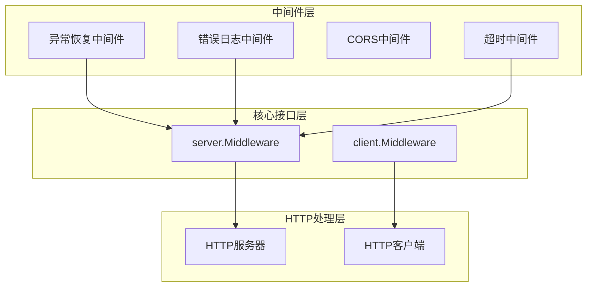
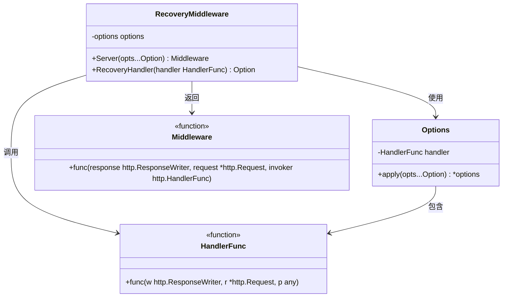
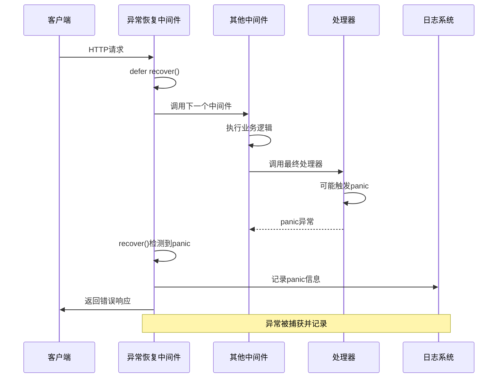
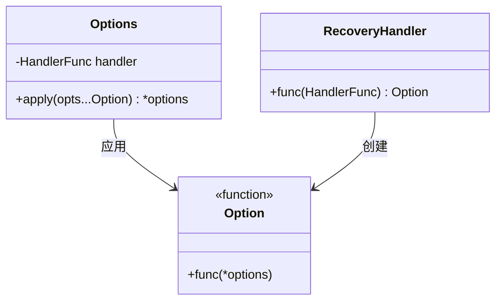
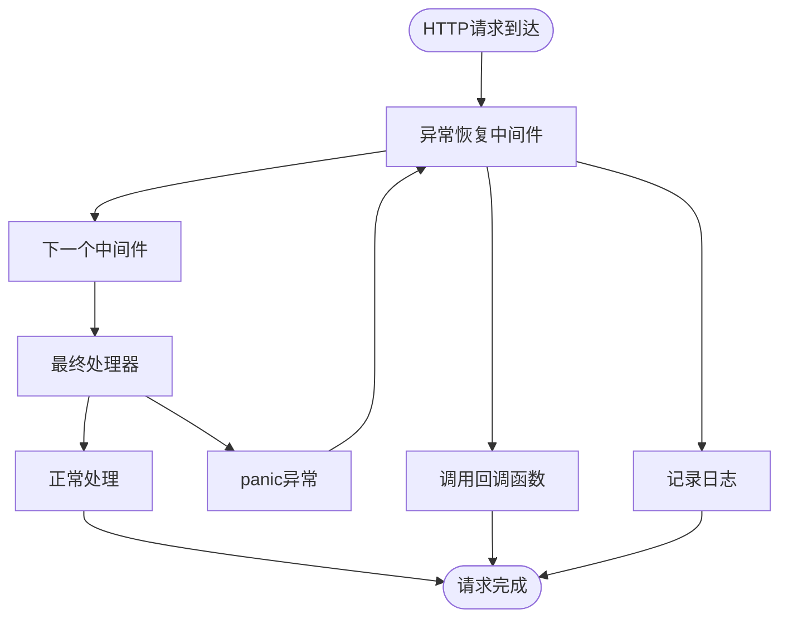
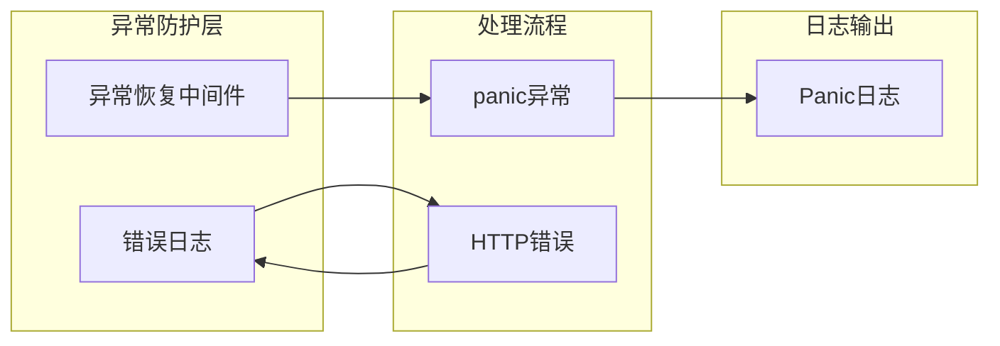
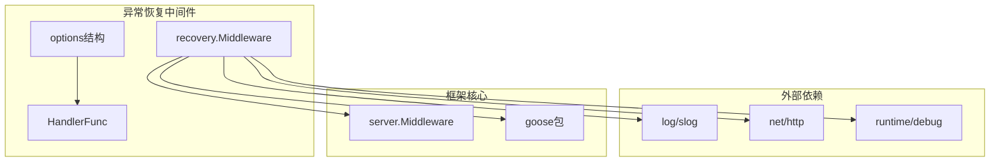
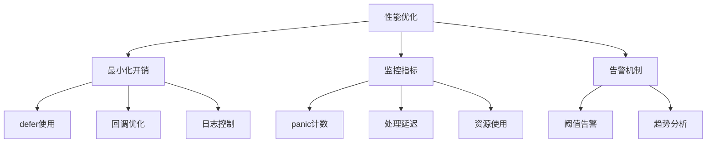

# 异常恢复中间件

<cite>
**本文档引用的文件**
- [middleware.go](file://middleware/recovery/middleware.go)
- [middleware.go](file://server/middleware.go)
- [middleware.go](file://client/middleware.go)
- [middleware.go](file://middleware/errorlog/middleware.go)
- [option.go](file://middleware/errorlog/option.go)
</cite>

## 目录
1. [简介](#简介)
2. [项目结构](#项目结构)
3. [核心组件](#核心组件)
4. [架构概览](#架构概览)
5. [详细组件分析](#详细组件分析)
6. [依赖关系分析](#依赖关系分析)
7. [性能考虑](#性能考虑)
8. [故障排除指南](#故障排除指南)
9. [结论](#结论)

## 简介

异常恢复中间件是Goose框架中一个关键的安全防护组件，专门设计用于捕获和处理HTTP请求处理过程中的panic异常。该中间件通过Go语言的defer-recover机制，在请求处理链路中提供最后一道防线，防止意外的panic导致整个HTTP服务崩溃。

该中间件的核心设计理念是在不中断服务可用性的前提下，优雅地处理运行时异常，同时提供可定制的恢复策略和详细的错误日志记录。它不仅能够捕获panic异常，还能通过回调函数机制允许开发者实现自定义的错误响应逻辑。

## 项目结构

Goose框架采用模块化设计，异常恢复中间件位于`middleware/recovery`目录下，与其它中间件组件保持一致的架构模式：

**图表来源**
- [middleware.go:1-55](file://middleware/recovery/middleware.go#L1-L55)
- [middleware.go:1-85](file://server/middleware.go#L1-L85)

**章节来源**
- [middleware.go:1-55](file://middleware/recovery/middleware.go#L1-L55)
- [middleware.go:1-85](file://server/middleware.go#L1-L85)

## 核心组件

### 异常恢复中间件架构

异常恢复中间件的核心实现基于Go语言的标准库panic/recover机制，通过defer语句在中间件函数的末尾执行recover操作，从而捕获任何未处理的panic异常。

#### 主要组件结构

**图表来源**
- [middleware.go:11-36](file://middleware/recovery/middleware.go#L11-L36)

#### 关键特性

1. **延迟执行机制**: 使用`defer`确保在中间件函数退出时自动检查panic状态
2. **可配置回调**: 支持自定义panic处理回调函数
3. **默认日志记录**: 内置默认的panic日志记录功能
4. **无侵入性**: 不影响正常请求的处理流程

**章节来源**
- [middleware.go:38-50](file://middleware/recovery/middleware.go#L38-L50)

## 架构概览

异常恢复中间件在整个HTTP请求处理流程中扮演着关键角色，它位于中间件链的合适位置，确保能够捕获到所有后续中间件和最终处理器抛出的panic异常。

**图表来源**
- [middleware.go:40-49](file://middleware/recovery/middleware.go#L40-L49)
- [middleware.go:76-84](file://server/middleware.go#L76-L84)

## 详细组件分析

### 异常恢复中间件实现

#### 核心实现机制

异常恢复中间件的核心实现基于Go语言的panic/recover机制，通过以下步骤实现异常捕获：

1. **延迟执行**: 在中间件函数开始处设置defer语句
2. **异常检测**: 在defer函数中调用recover()检查是否有panic
3. **回调处理**: 如果检测到panic，调用配置的回调函数
4. **日志记录**: 默认情况下记录panic的详细信息和堆栈跟踪

#### 配置选项系统

**图表来源**
- [middleware.go:11-36](file://middleware/recovery/middleware.go#L11-L36)

#### 默认处理策略

当没有提供自定义回调函数时，异常恢复中间件使用默认的处理策略：

1. **日志记录**: 使用`slog.ErrorContext`记录panic信息
2. **堆栈跟踪**: 包含完整的goroutine堆栈跟踪
3. **上下文信息**: 记录请求的上下文信息
4. **不可恢复**: 默认策略不会尝试恢复程序执行

**章节来源**
- [middleware.go:52-54](file://middleware/recovery/middleware.go#L52-L54)

### 中间件链集成

异常恢复中间件遵循Goose框架的中间件链模式，与其他中间件协同工作：

**图表来源**
- [middleware.go:31-42](file://server/middleware.go#L31-L42)
- [middleware.go:38-50](file://middleware/recovery/middleware.go#L38-L50)

**章节来源**
- [middleware.go:31-63](file://server/middleware.go#L31-L63)

### 错误日志集成

异常恢复中间件与错误日志中间件形成互补的安全防护体系：

**图表来源**
- [middleware.go:1-195](file://middleware/errorlog/middleware.go#L1-L195)

**章节来源**
- [middleware.go:16-58](file://middleware/errorlog/middleware.go#L16-L58)

## 依赖关系分析

异常恢复中间件的依赖关系相对简单，主要依赖于标准库和框架核心组件：

**图表来源**
- [middleware.go:3-9](file://middleware/recovery/middleware.go#L3-L9)

**章节来源**
- [middleware.go:1-55](file://middleware/recovery/middleware.go#L1-L55)

### 性能影响分析

异常恢复中间件对性能的影响主要体现在以下几个方面：

1. **内存开销**: 每个请求都会创建defer函数，内存开销极小
2. **CPU开销**: 正常情况下几乎无额外开销，仅在panic时产生影响
3. **堆栈跟踪**: 默认的日志记录会生成完整的堆栈跟踪信息
4. **回调函数**: 自定义回调函数的执行时间会影响整体性能

## 性能考虑

### 最佳实践建议

1. **合理放置中间件**: 将异常恢复中间件放在中间件链的合适位置，通常作为第一个或最后一个中间件
2. **优化回调函数**: 自定义回调函数应尽量简洁，避免复杂的计算逻辑
3. **选择性日志记录**: 对于高频请求，考虑减少日志记录的详细程度
4. **监控和告警**: 建立panic事件的监控和告警机制

### 性能优化策略

## 故障排除指南

### 常见问题诊断

1. **中间件未生效**: 检查中间件是否正确添加到中间件链中
2. **日志信息不完整**: 确认panic回调函数是否正确实现
3. **性能问题**: 分析panic发生的频率和原因
4. **错误响应格式**: 验证自定义回调函数返回的响应格式

### 调试技巧

1. **启用详细日志**: 在开发环境中启用更详细的panic日志记录
2. **堆栈跟踪分析**: 利用堆栈跟踪信息定位问题根源
3. **性能分析**: 使用pprof工具分析panic对性能的影响
4. **监控告警**: 建立实时监控和告警机制

**章节来源**
- [middleware.go:52-54](file://middleware/recovery/middleware.go#L52-L54)

## 结论

异常恢复中间件是Goose框架中不可或缺的安全组件，它通过优雅的panic捕获和处理机制，为HTTP服务提供了可靠的异常防护。该中间件的设计充分体现了Go语言的并发安全特性和中间件模式的优势。

其核心价值在于：
- **可靠性**: 确保服务在异常情况下仍能保持可用性
- **可观测性**: 提供详细的异常信息和日志记录
- **灵活性**: 支持自定义的恢复策略和错误处理逻辑
- **易用性**: 简洁的API设计和灵活的配置选项

通过合理使用异常恢复中间件，开发者可以构建更加健壮和可靠的HTTP服务，有效提升系统的整体稳定性和用户体验。