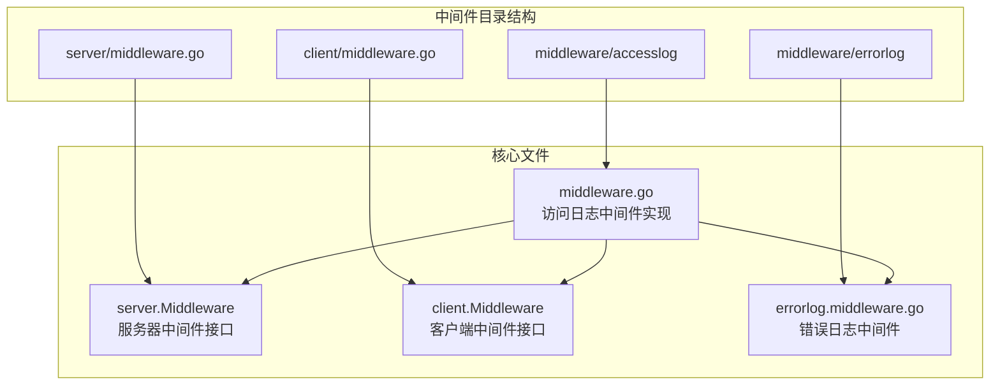
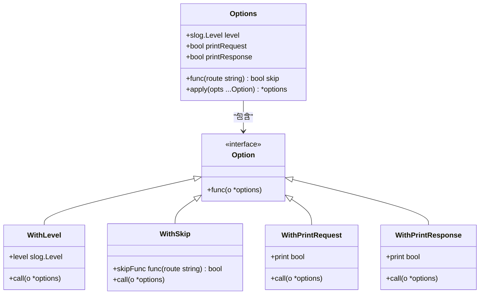
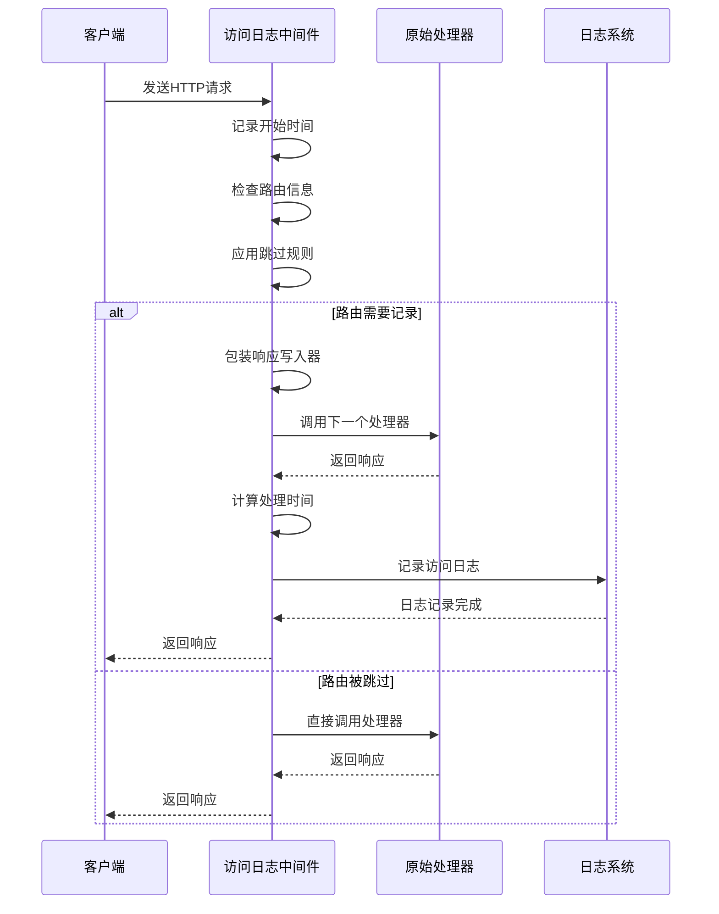
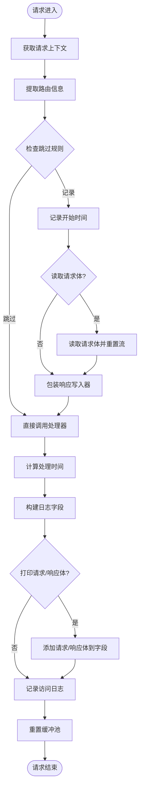
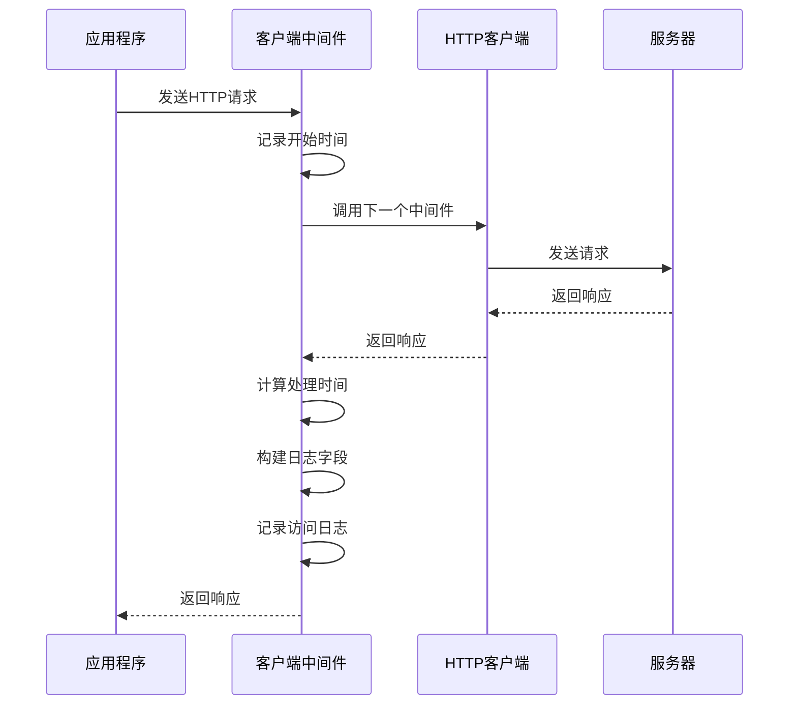
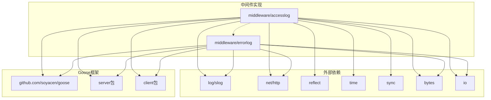

# 访问日志中间件

<cite>
**本文档引用的文件**
- [middleware.go](file://middleware/accesslog/middleware.go)
- [middleware.go](file://server/middleware.go)
- [middleware.go](file://client/middleware.go)
- [middleware.go](file://middleware/errorlog/middleware.go)
- [SKILL.md](file://skills/go-goose/SKILL.md)
</cite>

## 目录
1. [简介](#简介)
2. [项目结构](#项目结构)
3. [核心组件](#核心组件)
4. [架构概览](#架构概览)
5. [详细组件分析](#详细组件分析)
6. [依赖关系分析](#依赖关系分析)
7. [性能考虑](#性能考虑)
8. [故障排除指南](#故障排除指南)
9. [结论](#结论)

## 简介

访问日志中间件是 Goose 框架中的一个核心组件，提供了 HTTP 请求访问日志记录功能。该中间件支持服务器端和客户端两种环境，能够记录请求处理的完整生命周期信息，包括请求方法、路径、状态码、处理时间等关键指标。

该中间件采用现代化的日志记录方式，基于 Go 标准库的 `log/slog` 包，提供了灵活的配置选项，包括日志级别控制、跳过规则配置、请求响应体打印等高级功能。

## 项目结构

访问日志中间件位于 `middleware/accesslog` 目录下，与服务器和客户端中间件框架紧密集成：



**图表来源**
- [middleware.go:1-318](file://middleware/accesslog/middleware.go#L1-L318)
- [middleware.go:1-85](file://server/middleware.go#L1-L85)
- [middleware.go:1-99](file://client/middleware.go#L1-L99)

**章节来源**
- [middleware.go:1-318](file://middleware/accesslog/middleware.go#L1-L318)
- [middleware.go:1-85](file://server/middleware.go#L1-L85)
- [middleware.go:1-99](file://client/middleware.go#L1-L99)

## 核心组件

访问日志中间件包含以下核心组件：

### 1. 配置选项系统

中间件通过 `options` 结构体管理所有配置参数：



**图表来源**
- [middleware.go:20-42](file://middleware/accesslog/middleware.go#L20-L42)

### 2. 中间件接口定义

中间件遵循统一的接口规范，支持服务器和客户端两种环境：

```mermaid
classDiagram
class ServerMiddleware {
+func(response http.ResponseWriter,
request *http.Request,
invoker http.HandlerFunc)
}
class ClientMiddleware {
+func(cli *http.Client,
request *http.Request,
invoker client.Invoker)
(*http.Response, error)
}
class StatusCodeResponseWriter {
+ResponseWriter http.ResponseWriter
+int statusCode
+bool printResponse
+bytes.Buffer body
+Write(p []byte) (int, error)
+WriteHeader(statusCode int)
}
ServerMiddleware --> StatusCodeResponseWriter : "包装"
```

**图表来源**
- [middleware.go:9-17](file://server/middleware.go#L9-L17)
- [middleware.go:21-33](file://client/middleware.go#L21-L33)
- [middleware.go:278-296](file://middleware/accesslog/middleware.go#L278-L296)

**章节来源**
- [middleware.go:20-102](file://middleware/accesslog/middleware.go#L20-L102)
- [middleware.go:9-17](file://server/middleware.go#L9-L17)
- [middleware.go:21-33](file://client/middleware.go#L21-L33)

## 架构概览

访问日志中间件采用装饰器模式，为现有的 HTTP 处理器添加日志记录功能：



**图表来源**
- [middleware.go:116-204](file://middleware/accesslog/middleware.go#L116-L204)

## 详细组件分析

### 1. 服务器端中间件

服务器端中间件负责记录 HTTP 服务器的请求处理过程：

#### 核心工作流程



**图表来源**
- [middleware.go:116-204](file://middleware/accesslog/middleware.go#L116-L204)

#### 关键特性

1. **路由信息提取**：优先从上下文中提取路由信息，失败时使用反射获取
2. **性能优化**：使用 `sync.Pool` 复用 `slog.Attr` 切片
3. **请求体处理**：可选择性读取和重置请求体流
4. **响应体捕获**：通过包装响应写入器捕获响应内容

**章节来源**
- [middleware.go:116-204](file://middleware/accesslog/middleware.go#L116-L204)

### 2. 客户端中间件

客户端中间件记录 HTTP 客户端的请求执行过程：

#### 工作机制



**图表来源**
- [middleware.go:206-276](file://middleware/accesslog/middleware.go#L206-L276)

#### 特殊处理

客户端中间件对错误情况有特殊处理逻辑：
- 捕获 HTTP 错误状态码（>= 400）
- 记录网络层错误
- 支持请求和响应体的条件打印

**章节来源**
- [middleware.go:206-276](file://middleware/accesslog/middleware.go#L206-L276)

### 3. 配置选项详解

#### 日志级别设置

中间件支持标准的 `slog.Level` 级别：
- `slog.LevelDebug` - 调试信息
- `slog.LevelInfo` - 一般信息（默认）
- `slog.LevelWarn` - 警告信息
- `slog.LevelError` - 错误信息

#### 跳过规则配置

通过 `WithSkip` 函数配置路由跳过规则：
- 接受路由字符串作为参数
- 返回布尔值决定是否跳过记录
- 支持基于路由模式的过滤

#### 请求响应体打印

通过 `WithPrintRequest` 和 `WithPrintResponse` 控制：
- 可选地记录完整的请求和响应内容
- 注意内存使用和性能影响
- 适用于调试环境，生产环境建议关闭

**章节来源**
- [middleware.go:56-102](file://middleware/accesslog/middleware.go#L56-L102)

### 4. 性能优化机制

#### 缓冲池优化

中间件使用 `sync.Pool` 复用日志字段切片：
- 服务器端使用容量为 20 的切片池
- 客户端使用容量为 10 的切片池
- 减少内存分配和垃圾回收压力

#### 内存安全处理

- 使用 `io.NopCloser` 重置请求体流
- 通过 `bytes.Buffer` 捕获响应体
- 合理的内存释放策略

**章节来源**
- [middleware.go:119-125](file://middleware/accesslog/middleware.go#L119-L125)
- [middleware.go:209-214](file://middleware/accesslog/middleware.go#L209-L214)

## 依赖关系分析

访问日志中间件与其他组件的依赖关系：



**图表来源**
- [middleware.go:4-18](file://middleware/accesslog/middleware.go#L4-L18)
- [middleware.go:5-14](file://middleware/errorlog/middleware.go#L5-L14)

**章节来源**
- [middleware.go:4-18](file://middleware/accesslog/middleware.go#L4-L18)
- [middleware.go:5-14](file://middleware/errorlog/middleware.go#L5-L14)

## 性能考虑

### 1. 内存使用优化

- **缓冲池复用**：避免频繁的内存分配
- **按需读取**：仅在启用相应选项时读取请求/响应体
- **流式处理**：使用 `io.NopCloser` 保持流的完整性

### 2. CPU 性能优化

- **最小化反射使用**：仅在必要时使用反射获取路由信息
- **条件日志记录**：通过跳过规则减少不必要的日志开销
- **高效的时间计算**：使用 `time.Since` 进行精确的时间测量

### 3. 生产环境最佳实践

- 关闭请求体和响应体打印选项
- 使用合适的日志级别（通常为 Info）
- 合理配置跳过规则，排除健康检查等高频路由
- 监控日志系统的性能影响

## 故障排除指南

### 1. 路由信息获取问题

**问题**：无法正确获取路由信息
**解决方案**：
- 确保使用 `goose.InjectRouteInfo` 注入路由信息
- 检查上下文是否正确传递
- 反射方法可能因 Go 版本变化而失效

### 2. 内存泄漏问题

**问题**：长时间运行后内存使用持续增长
**解决方案**：
- 确认缓冲池正常工作
- 检查是否有未释放的资源
- 监控 `sync.Pool` 的使用情况

### 3. 日志格式异常

**问题**：日志输出格式不符合预期
**解决方案**：
- 检查 `slog` 的处理器配置
- 验证字段名称和数据类型
- 确认日志级别设置正确

**章节来源**
- [middleware.go:306-317](file://middleware/accesslog/middleware.go#L306-L317)

## 结论

访问日志中间件是 Goose 框架中功能完善、性能优化的中间件组件。它提供了：

1. **全面的日志记录**：涵盖请求处理的完整生命周期
2. **灵活的配置选项**：支持多种定制需求
3. **高性能设计**：通过多种优化技术确保低开销
4. **双端支持**：同时支持服务器和客户端环境

在实际使用中，建议根据具体需求合理配置各项选项，特别注意在生产环境中关闭请求响应体打印，以平衡可观测性和性能。