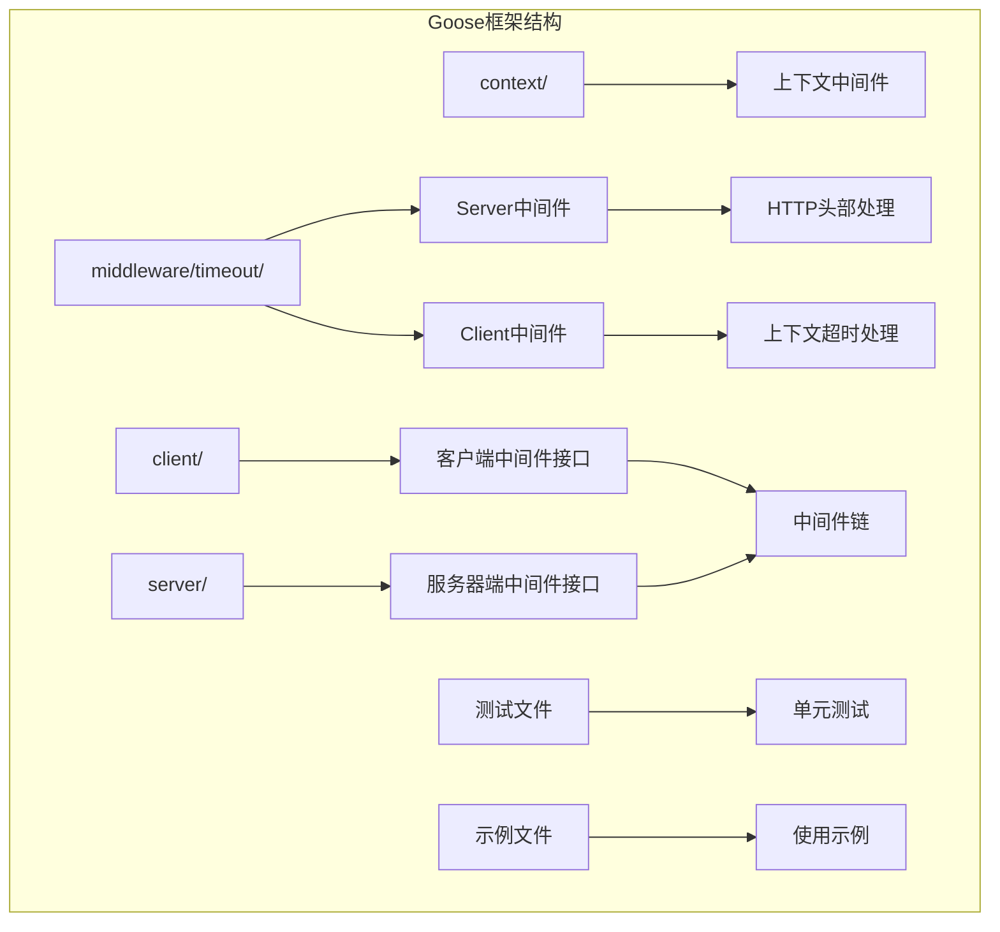
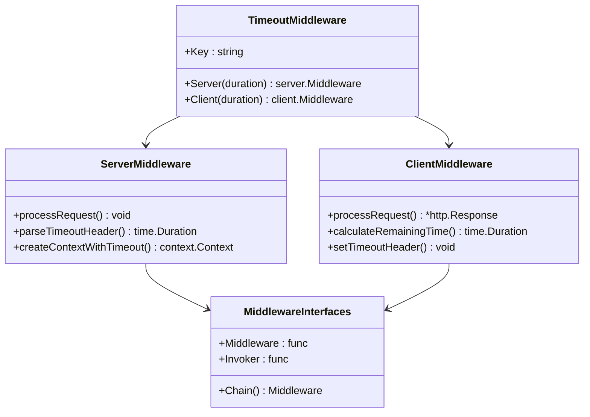
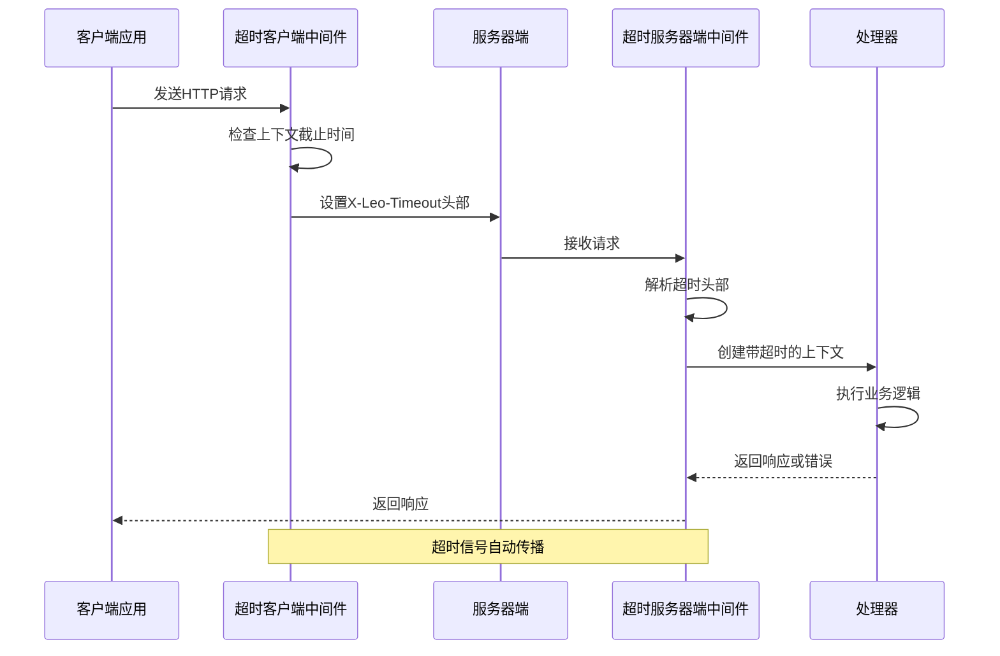
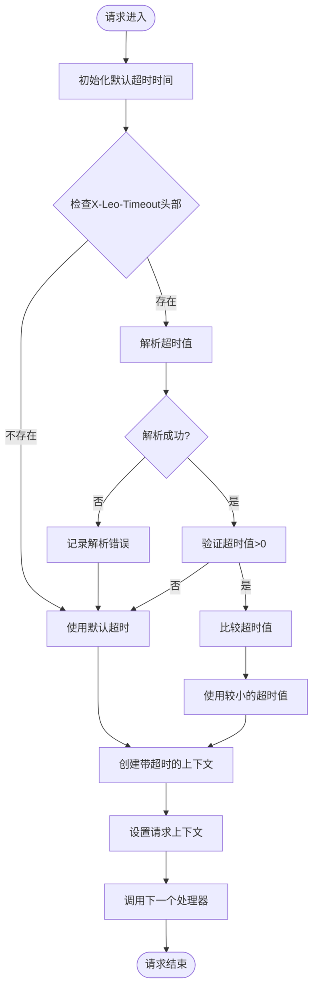
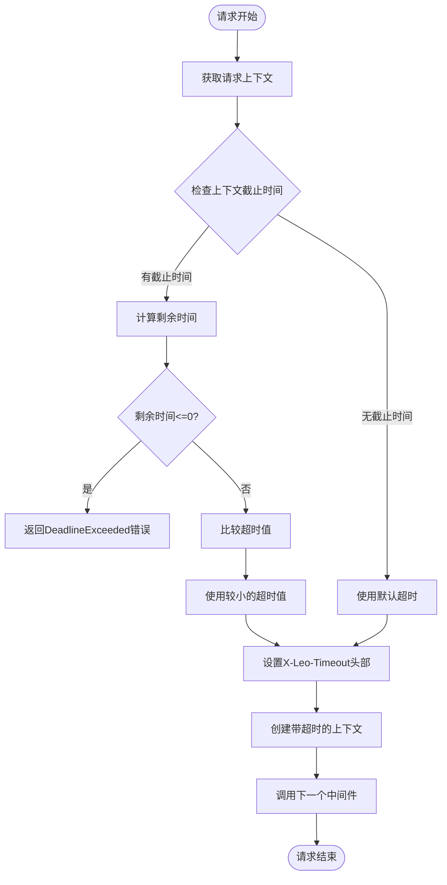
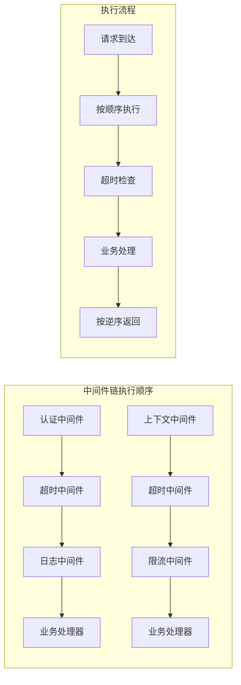
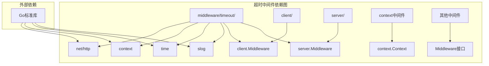

# 超时控制中间件

<cite>
**本文档引用的文件**
- [middleware.go](file://middleware/timeout/middleware.go)
- [middleware.go](file://client/middleware.go)
- [middleware.go](file://server/middleware.go)
- [middleware_test.go](file://client/middleware_test.go)
- [middleware_test.go](file://server/middleware_test.go)
- [middleware.go](file://middleware/context/middleware.go)
</cite>

## 目录
1. [简介](#简介)
2. [项目结构](#项目结构)
3. [核心组件](#核心组件)
4. [架构概览](#架构概览)
5. [详细组件分析](#详细组件分析)
6. [依赖关系分析](#依赖关系分析)
7. [性能考虑](#性能考虑)
8. [故障排除指南](#故障排除指南)
9. [结论](#结论)

## 简介

超时控制中间件是Goose框架中一个重要的基础设施组件，它提供了统一的HTTP请求超时管理机制。该中间件通过在客户端和服务器端分别实现超时控制逻辑，确保HTTP请求能够在预设的时间限制内完成，防止资源泄露和系统过载。

该中间件的核心特性包括：
- 支持客户端和服务器端双向超时控制
- 基于HTTP头部传递超时参数
- 自动处理超时信号传播
- 提供灵活的超时配置选项
- 集成到Goose框架的中间件链系统

## 项目结构

Goose框架采用模块化设计，超时控制中间件位于`middleware/timeout/`目录下，与客户端和服务器端的通用中间件接口保持一致。

**图表来源**
- [middleware.go:1-107](file://middleware/timeout/middleware.go#L1-L107)
- [middleware.go:1-99](file://client/middleware.go#L1-L99)
- [middleware.go:1-85](file://server/middleware.go#L1-L85)

**章节来源**
- [middleware.go:1-107](file://middleware/timeout/middleware.go#L1-L107)
- [middleware.go:1-99](file://client/middleware.go#L1-L99)
- [middleware.go:1-85](file://server/middleware.go#L1-L85)

## 核心组件

超时控制中间件由两个主要组件构成：服务器端中间件和客户端中间件。这两个组件协同工作，确保HTTP请求在整个传输过程中的超时控制。

### 关键常量和类型定义

**图表来源**
- [middleware.go:14-15](file://middleware/timeout/middleware.go#L14-L15)
- [middleware.go:28-58](file://middleware/timeout/middleware.go#L28-L58)
- [middleware.go:72-105](file://middleware/timeout/middleware.go#L72-L105)

### 核心功能特性

1. **HTTP头部超时传递**：使用`X-Leo-Timeout`头部在客户端和服务器端之间传递超时设置
2. **动态超时计算**：根据上下文截止时间和请求头中的超时值计算最终超时时间
3. **超时信号传播**：通过Go标准库的context包传播超时信号
4. **错误处理机制**：优雅处理超时解析错误和超时异常情况

**章节来源**
- [middleware.go:14-15](file://middleware/timeout/middleware.go#L14-L15)
- [middleware.go:28-58](file://middleware/timeout/middleware.go#L28-L58)
- [middleware.go:72-105](file://middleware/timeout/middleware.go#L72-L105)

## 架构概览

超时控制中间件采用分层架构设计，与Goose框架的中间件系统无缝集成。

**图表来源**
- [middleware.go:28-58](file://middleware/timeout/middleware.go#L28-L58)
- [middleware.go:72-105](file://middleware/timeout/middleware.go#L72-L105)

## 详细组件分析

### 服务器端超时中间件

服务器端超时中间件负责接收来自客户端的超时设置，解析并应用到当前请求的上下文中。

#### 实现流程

**图表来源**
- [middleware.go:28-58](file://middleware/timeout/middleware.go#L28-L58)

#### 关键实现细节

1. **超时值解析**：使用`time.ParseDuration()`解析HTTP头部中的超时字符串
2. **错误处理**：解析失败时记录错误日志但继续使用默认超时
3. **超时比较**：取客户端请求头指定的超时值和服务器默认超时值中的较小值
4. **上下文创建**：使用`context.WithTimeout()`创建带超时的上下文

**章节来源**
- [middleware.go:28-58](file://middleware/timeout/middleware.go#L28-L58)

### 客户端超时中间件

客户端超时中间件负责从请求的上下文中提取截止时间信息，计算剩余可用时间，并将其设置到HTTP头部中。

#### 实现流程

**图表来源**
- [middleware.go:72-105](file://middleware/timeout/middleware.go#L72-L105)

#### 关键实现细节

1. **截止时间检查**：使用`ctx.Deadline()`获取上下文的截止时间
2. **剩余时间计算**：使用`time.Until(deadline)`计算剩余可用时间
3. **超时状态检查**：如果剩余时间为负数，直接返回`context.DeadlineExceeded`
4. **头部设置**：将计算出的超时值设置到`X-Leo-Timeout`头部

**章节来源**
- [middleware.go:72-105](file://middleware/timeout/middleware.go#L72-L105)

### 中间件链集成

超时中间件与Goose框架的中间件链系统完美集成，支持与其他中间件的组合使用。

#### 中间件链实现

**图表来源**
- [middleware.go:35-55](file://client/middleware.go#L35-L55)
- [middleware.go:19-43](file://server/middleware.go#L19-L43)

**章节来源**
- [middleware.go:35-55](file://client/middleware.go#L35-L55)
- [middleware.go:19-43](file://server/middleware.go#L19-L43)

## 依赖关系分析

超时控制中间件的设计遵循了最小依赖原则，仅依赖必要的Go标准库和Goose框架的核心组件。

**图表来源**
- [middleware.go:4-12](file://middleware/timeout/middleware.go#L4-L12)

### 依赖关系特点

1. **轻量级依赖**：只依赖Go标准库的必要组件
2. **接口隔离**：通过Goose框架定义的中间件接口进行解耦
3. **可测试性**：依赖抽象接口，便于单元测试和模拟
4. **扩展性**：基于接口设计，易于扩展新的超时策略

**章节来源**
- [middleware.go:4-12](file://middleware/timeout/middleware.go#L4-L12)

## 性能考虑

超时控制中间件在设计时充分考虑了性能影响，采用了多种优化策略来最小化对系统性能的影响。

### 性能优化策略

1. **零分配设计**：中间件函数直接操作现有数据结构，避免额外的内存分配
2. **短路求值**：在超时解析失败时快速回退到默认行为
3. **延迟计算**：只有在需要时才计算剩余时间
4. **缓存友好**：使用简单的数据结构，提高缓存命中率

### 性能影响评估

| 组件 | CPU开销 | 内存分配 | I/O操作 |
|------|---------|----------|---------|
| 服务器端中间件 | 极低 | 无 | 无 |
| 客户端中间件 | 极低 | 无 | 无 |
| 上下文创建 | 极低 | 无 | 无 |
| 头部解析 | 极低 | 无 | 无 |

### 最佳实践建议

1. **合理设置默认超时**：根据业务需求设置合理的默认超时时间
2. **避免过度超时**：不要设置过长的超时时间，以免浪费系统资源
3. **监控超时事件**：建立超时监控机制，及时发现性能问题
4. **分层超时设计**：在不同层次设置不同的超时策略

## 故障排除指南

### 常见问题及解决方案

#### 超时解析错误

**问题描述**：当`X-Leo-Timeout`头部包含无效格式时，服务器会记录错误但继续使用默认超时。

**解决方法**：
1. 确保超时值使用正确的Go duration格式（如"10s"、"1m30s"）
2. 验证客户端发送的超时值是否在合理范围内
3. 检查网络传输过程中头部值是否被修改

#### 死亡竞争条件

**问题描述**：客户端和服务器端同时设置超时可能导致意外的行为。

**解决方法**：
1. 使用较小的超时值作为最终超时时间
2. 在客户端设置更严格的超时限制
3. 确保超时值始终大于0

#### 上下文超时传播

**问题描述**：超时信号可能无法正确传播到所有子操作。

**解决方法**：
1. 确保所有异步操作都检查上下文的取消信号
2. 使用`context.WithCancel`显式取消长时间运行的操作
3. 在数据库连接和外部API调用中正确处理超时

### 调试技巧

1. **启用详细日志**：观察超时解析和应用过程
2. **监控超时事件**：统计超时发生的频率和原因
3. **性能基准测试**：评估超时中间件对系统性能的影响
4. **压力测试**：在高负载情况下验证超时机制的稳定性

**章节来源**
- [middleware.go:37-40](file://middleware/timeout/middleware.go#L37-L40)
- [middleware.go:85-87](file://middleware/timeout/middleware.go#L85-L87)

## 结论

超时控制中间件是Goose框架中一个设计精良的基础设施组件，它通过简洁而强大的机制实现了跨客户端和服务器端的统一超时管理。该中间件的主要优势包括：

1. **设计理念先进**：基于Go标准库的context包，符合现代Go语言的最佳实践
2. **实现简洁高效**：代码简洁，性能开销极小
3. **集成度高**：与Goose框架的中间件系统无缝集成
4. **扩展性强**：基于接口设计，易于扩展和定制

通过合理配置和使用，超时控制中间件能够有效防止系统过载，提高系统的稳定性和可靠性。建议在生产环境中结合具体的业务场景，制定合适的超时策略，并建立完善的监控和告警机制。