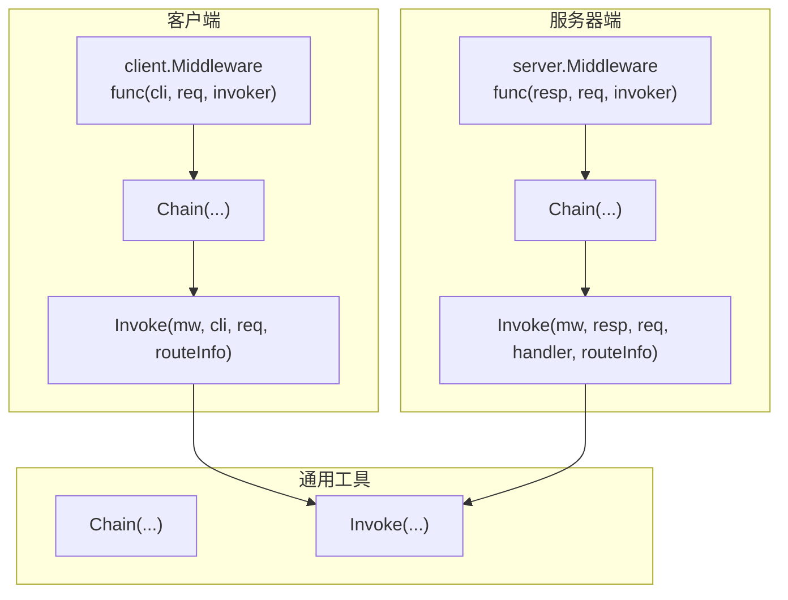
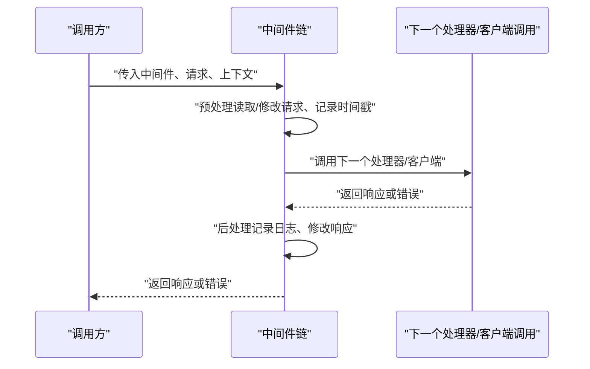
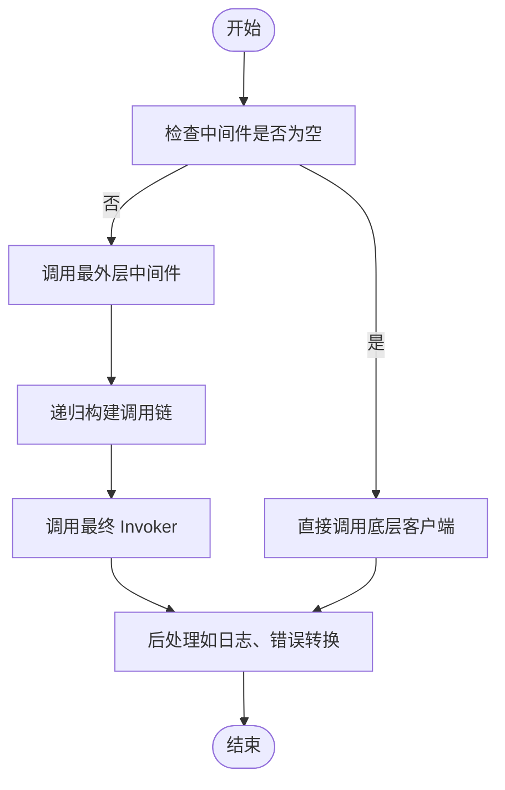
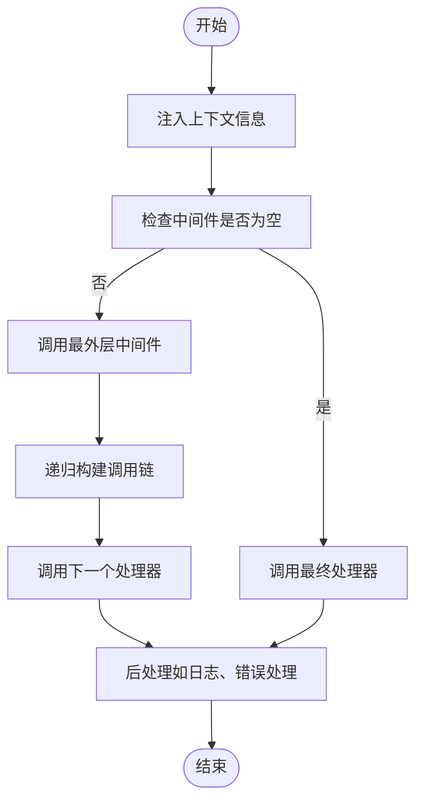
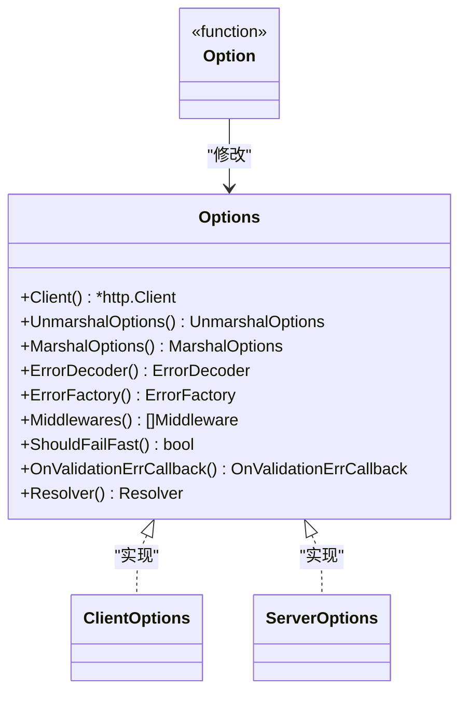
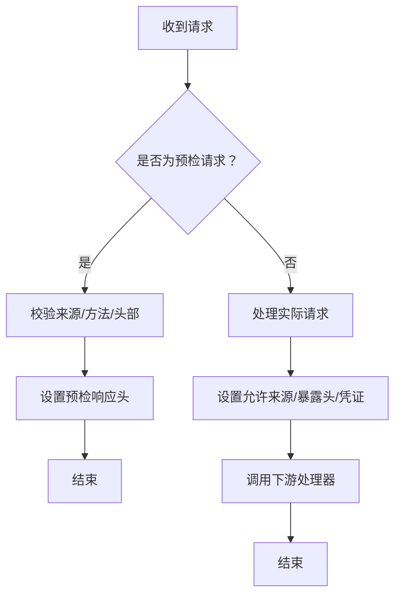
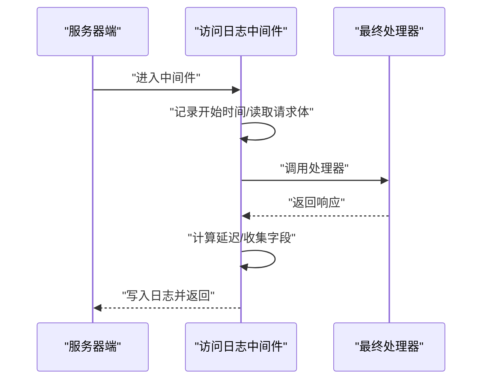
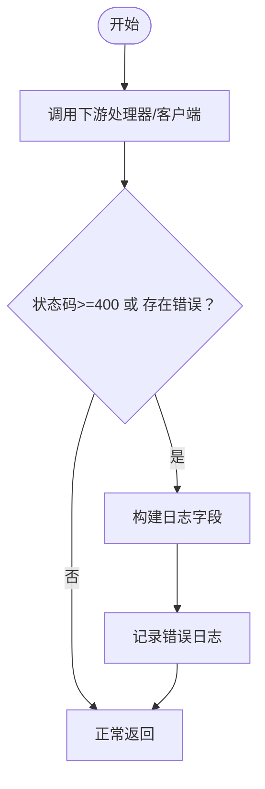
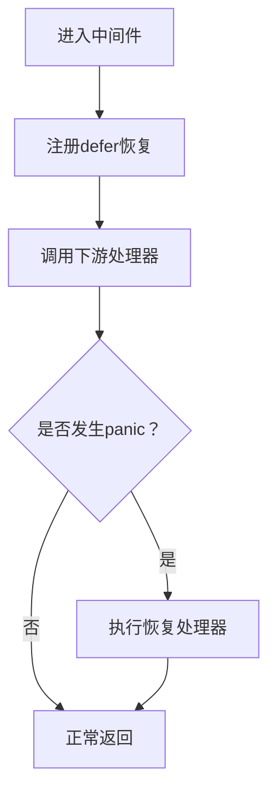
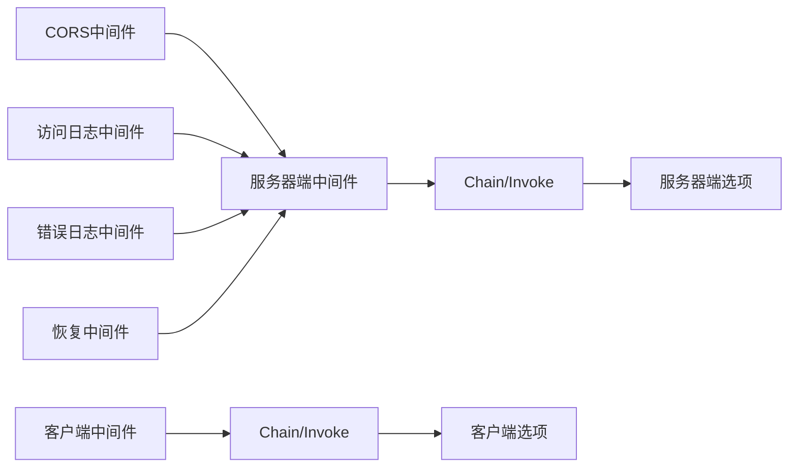

# 自定义中间件开发

<cite>
**本文档引用的文件**
- [client/middleware.go](file://client/middleware.go)
- [server/middleware.go](file://server/middleware.go)
- [client/option.go](file://client/option.go)
- [server/option.go](file://server/option.go)
- [middleware/cors/middleware.go](file://middleware/cors/middleware.go)
- [middleware/cors/option.go](file://middleware/cors/option.go)
- [middleware/accesslog/middleware.go](file://middleware/accesslog/middleware.go)
- [middleware/errorlog/middleware.go](file://middleware/errorlog/middleware.go)
- [middleware/recovery/middleware.go](file://middleware/recovery/middleware.go)
- [client/middleware_test.go](file://client/middleware_test.go)
- [server/middleware_test.go](file://server/middleware_test.go)
</cite>

## 目录
1. [简介](#简介)
2. [项目结构](#项目结构)
3. [核心组件](#核心组件)
4. [架构总览](#架构总览)
5. [详细组件分析](#详细组件分析)
6. [依赖分析](#依赖分析)
7. [性能考虑](#性能考虑)
8. [故障排查指南](#故障排查指南)
9. [结论](#结论)
10. [附录](#附录)

## 简介
本指南面向希望在 Goose 生态中开发自定义中间件的工程师，系统阐述以下内容：
- 中间件接口与职责边界：服务端与客户端中间件的统一链式调用模型
- 工厂函数设计模式：通过 Option 函数组合配置，返回可复用的中间件实例
- 选项配置实现：基于函数式选项（functional options）的可扩展配置体系
- 实战示例：从零实现服务器端与客户端中间件，覆盖请求处理、响应修改、错误处理、性能监控等场景
- 质量保障：单元测试编写、性能优化技巧、调试方法与部署注意事项

## 项目结构
Goose 将中间件能力抽象为两套通用接口与工具：
- 客户端中间件：围绕 http.Client 的请求链路进行拦截与增强
- 服务器端中间件：围绕 http.Handler 的请求链路进行拦截与增强
- 通用链式编排：提供 Chain 与 Invoke 统一入口，支持多中间件串联与最终处理器调用
- 选项体系：通过 Options 接口与 Option 函数，集中管理中间件配置

图表来源
- [client/middleware.go:35-99](file://client/middleware.go#L35-L99)
- [server/middleware.go:19-84](file://server/middleware.go#L19-L84)

章节来源
- [client/middleware.go:1-99](file://client/middleware.go#L1-L99)
- [server/middleware.go:1-85](file://server/middleware.go#L1-L85)

## 核心组件
- 客户端中间件接口与链式编排
  - 接口签名：接收 http.Client、*http.Request 与下一个 Invoker，并返回 *http.Response 或 error
  - 链式编排：Chain 支持空链、单链、多链；getInvoker 递归构建调用链
  - 执行入口：Invoke 在注入路由信息后，按需调用中间件或直接执行
- 服务器端中间件接口与链式编排
  - 接口签名：接收 http.ResponseWriter、*http.Request 与下一个 http.HandlerFunc
  - 链式编排：Chain 与 getInvoker 同构实现，确保调用顺序正确
  - 执行入口：Invoke 注入路由与请求头信息，按需调用中间件或直接执行最终处理器
- 选项体系（客户端/服务器端）
  - Options 接口：统一暴露配置项访问方法（如 Client、MarshalOptions、ErrorEncoder、Middlewares 等）
  - Option 函数：通过函数式选项设置配置，支持链式 Apply 与默认值修正（Correct/apply）

章节来源
- [client/middleware.go:9-99](file://client/middleware.go#L9-L99)
- [server/middleware.go:9-84](file://server/middleware.go#L9-L84)
- [client/option.go:12-279](file://client/option.go#L12-L279)
- [server/option.go:8-198](file://server/option.go#L8-L198)

## 架构总览
下图展示客户端与服务器端中间件的统一链式调用模型，以及与选项系统的集成方式。

图表来源
- [client/middleware.go:76-99](file://client/middleware.go#L76-L99)
- [server/middleware.go:65-84](file://server/middleware.go#L65-L84)

## 详细组件分析

### 客户端中间件接口与链式编排
- 接口与职责
  - Middleware：封装一次 HTTP 请求的拦截逻辑，可读取/修改请求，调用下一个 Invoker 发起真实请求，再对响应进行后处理
  - Invoker：封装实际的 HTTP 调用，作为链路末端
- 链式编排
  - Chain：根据传入数量返回不同形态的中间件包装
  - getInvoker：递归构建“下一个调用者”，形成从外到内的调用栈
- 执行入口
  - Invoke：注入 RouteInfo 到上下文，若中间件为 nil 则直连底层调用，否则进入中间件链

图表来源
- [client/middleware.go:35-99](file://client/middleware.go#L35-L99)

章节来源
- [client/middleware.go:9-99](file://client/middleware.go#L9-L99)

### 服务器端中间件接口与链式编排
- 接口与职责
  - Middleware：拦截 http 请求，可读取/修改请求与响应，调用下一个 http.HandlerFunc，再进行后处理
- 链式编排
  - Chain：同客户端一致，支持空链、单链、多链
  - getInvoker：递归构建调用链，保证顺序正确
- 执行入口
  - Invoke：注入 RouteInfo 与请求头到上下文，若中间件为 nil 则直接调用最终处理器，否则进入中间件链

图表来源
- [server/middleware.go:65-84](file://server/middleware.go#L65-L84)

章节来源
- [server/middleware.go:9-84](file://server/middleware.go#L9-L84)

### 选项配置体系（客户端/服务器端）
- Options 接口
  - 统一暴露配置项访问方法，便于中间件读取运行时参数（如 HTTP 客户端、序列化选项、错误编解码器、中间件列表等）
- Option 函数
  - 采用函数式选项模式，每个 Option 返回一个函数，用于修改内部 options 结构
  - Apply/apply：批量应用 Option，支持默认值修正（Correct/apply）
- 使用建议
  - 将中间件所需的外部依赖（如 HTTP 客户端、编码器、回调）通过 Options 注入，避免在中间件内部硬编码
  - 对于可选行为（如是否打印请求/响应体），通过 Option 控制

图表来源
- [client/option.go:12-40](file://client/option.go#L12-L40)
- [server/option.go:8-27](file://server/option.go#L8-L27)

章节来源
- [client/option.go:12-279](file://client/option.go#L12-L279)
- [server/option.go:8-198](file://server/option.go#L8-L198)

### 实战：从零实现一个服务器端中间件（鉴权）
目标：实现一个简单的鉴权中间件，校验请求头中的 Token 并在失败时返回 401。

步骤要点
- 定义中间件函数：接收 http.ResponseWriter、*http.Request、http.HandlerFunc
- 读取请求头：从 Header 中提取 Token
- 校验逻辑：若无效则写入 401 并终止链路
- 正常流程：调用下一个处理器
- 工厂函数：通过 Option 函数支持可插拔的校验策略

参考实现位置
- [server/middleware.go:9-17](file://server/middleware.go#L9-L17)
- [server/middleware.go:31-43](file://server/middleware.go#L31-L43)
- [server/middleware.go:56-63](file://server/middleware.go#L56-L63)
- [server/middleware.go:76-84](file://server/middleware.go#L76-L84)

章节来源
- [server/middleware.go:9-84](file://server/middleware.go#L9-L84)

### 实战：从零实现一个客户端中间件（重试）
目标：实现一个重试中间件，在网络瞬时错误时自动重试。

步骤要点
- 定义中间件函数：接收 http.Client、*http.Request、Invoker
- 调用 Invoker：发起真实请求
- 错误判断：仅对可重试错误进行重试
- 重试控制：限制最大重试次数与退避策略
- 返回结果：将最终响应或错误传递给上层

参考实现位置
- [client/middleware.go:9-33](file://client/middleware.go#L9-L33)
- [client/middleware.go:35-55](file://client/middleware.go#L35-L55)
- [client/middleware.go:67-74](file://client/middleware.go#L67-L74)
- [client/middleware.go:76-99](file://client/middleware.go#L76-L99)

章节来源
- [client/middleware.go:9-99](file://client/middleware.go#L9-L99)

### 实战：使用现有中间件（CORS）
- 功能概述：处理预检（OPTIONS）与实际 CORS 请求，支持允许的来源、方法、头部、凭证与私有网络访问
- 工厂函数：Server(opts ...) 返回 server.Middleware
- 选项配置：AllowedOrigins、AllowedMethods、AllowedHeaders、ExposedHeaders、MaxAge、AllowCredentials、AllowPrivateNetwork
- 使用建议：生产环境建议明确白名单来源与方法，避免使用通配符

图表来源
- [middleware/cors/middleware.go:147-160](file://middleware/cors/middleware.go#L147-L160)
- [middleware/cors/middleware.go:162-216](file://middleware/cors/middleware.go#L162-L216)
- [middleware/cors/middleware.go:218-248](file://middleware/cors/middleware.go#L218-L248)

章节来源
- [middleware/cors/middleware.go:1-249](file://middleware/cors/middleware.go#L1-L249)
- [middleware/cors/option.go:1-105](file://middleware/cors/option.go#L1-L105)

### 实战：使用现有中间件（访问日志）
- 功能概述：记录请求/响应元数据与延迟，支持选择性打印请求/响应体
- 服务器端：Server(opts ...)，包装 ResponseWriter 捕获状态码与响应体
- 客户端：Client(opts ...)，记录请求与响应状态
- 性能优化：使用 sync.Pool 复用属性切片，降低 GC 压力

图表来源
- [middleware/accesslog/middleware.go:116-204](file://middleware/accesslog/middleware.go#L116-L204)
- [middleware/accesslog/middleware.go:206-276](file://middleware/accesslog/middleware.go#L206-L276)

章节来源
- [middleware/accesslog/middleware.go:1-318](file://middleware/accesslog/middleware.go#L1-L318)

### 实战：使用现有中间件（错误日志）
- 功能概述：仅在 4xx/5xx 或客户端错误时记录错误日志，支持选择性打印请求/响应体
- 服务器端：Server(opts ...)，包装 ResponseWriter 捕获状态码与响应体
- 客户端：Client(opts ...)，捕获 HTTP 错误与程序错误

图表来源
- [middleware/errorlog/middleware.go:24-58](file://middleware/errorlog/middleware.go#L24-L58)
- [middleware/errorlog/middleware.go:60-106](file://middleware/errorlog/middleware.go#L60-L106)

章节来源
- [middleware/errorlog/middleware.go:1-195](file://middleware/errorlog/middleware.go#L1-L195)

### 实战：使用现有中间件（恢复）
- 功能概述：捕获 panic 并执行自定义恢复逻辑，默认记录堆栈
- 服务器端：Server(opts ...)，通过 defer 捕获 panic，调用自定义 HandlerFunc

图表来源
- [middleware/recovery/middleware.go:38-55](file://middleware/recovery/middleware.go#L38-L55)

章节来源
- [middleware/recovery/middleware.go:1-55](file://middleware/recovery/middleware.go#L1-L55)

## 依赖分析
- 客户端与服务器端中间件共享相同的链式编排思想，差异在于接口签名与执行入口
- 选项系统独立于具体中间件，通过 Options 接口与 Option 函数实现配置注入
- 具体中间件（如 CORS、访问日志、错误日志、恢复）均遵循上述统一模式

图表来源
- [client/middleware.go:35-99](file://client/middleware.go#L35-L99)
- [server/middleware.go:19-84](file://server/middleware.go#L19-L84)
- [client/option.go:12-279](file://client/option.go#L12-L279)
- [server/option.go:8-198](file://server/option.go#L8-L198)
- [middleware/cors/middleware.go:45-160](file://middleware/cors/middleware.go#L45-L160)
- [middleware/accesslog/middleware.go:116-204](file://middleware/accesslog/middleware.go#L116-L204)
- [middleware/errorlog/middleware.go:24-58](file://middleware/errorlog/middleware.go#L24-L58)
- [middleware/recovery/middleware.go:38-55](file://middleware/recovery/middleware.go#L38-L55)

章节来源
- [client/middleware.go:35-99](file://client/middleware.go#L35-L99)
- [server/middleware.go:19-84](file://server/middleware.go#L19-L84)
- [client/option.go:12-279](file://client/option.go#L12-L279)
- [server/option.go:8-198](file://server/option.go#L8-L198)

## 性能考虑
- 避免不必要的拷贝与分配
  - 客户端/服务器端中间件在读取请求体时应谨慎，必要时使用 io.NopCloser 回绕，避免重复读取
  - 访问日志中间件使用 sync.Pool 复用属性切片，减少内存分配与 GC 压力
- 日志开销控制
  - 仅在需要时打印请求/响应体，避免大对象序列化带来的 CPU 与内存消耗
  - 使用合适的日志级别，避免在高频路径产生过多日志
- 链路长度与顺序
  - 中间件链过长会增加调用栈深度与上下文传递成本，建议按需组合
  - 将高频但轻量的中间件置于前部，将昂贵的中间件（如日志、限流）合理安排

章节来源
- [middleware/accesslog/middleware.go:119-125](file://middleware/accesslog/middleware.go#L119-L125)
- [middleware/accesslog/middleware.go:209-214](file://middleware/accesslog/middleware.go#L209-L214)

## 故障排查指南
- 单元测试编写
  - 客户端中间件测试：构造 httptest 服务器验证请求头是否被正确添加；使用 errorMiddleware 模拟错误路径；验证链式执行顺序
  - 服务器端中间件测试：通过 Recorder 验证响应写入顺序；验证中间件链的前后序一致性
- 常见问题定位
  - 中间件未生效：确认是否传入了正确的中间件链与最终处理器；检查 Invoke 的参数顺序
  - 请求体丢失：确认中间件是否正确回绕 Body；避免重复读取导致 Body 为空
  - 日志异常：检查日志级别与字段拼接逻辑；对于服务器端中间件，注意包装 ResponseWriter 的时机
- 调试技巧
  - 使用最小化中间件链快速定位问题
  - 在关键节点打印上下文信息（如 RouteInfo、Header），辅助定位问题
  - 对于客户端中间件，结合 Invoker 的返回值与错误类型进行分层诊断

章节来源
- [client/middleware_test.go:1-213](file://client/middleware_test.go#L1-L213)
- [server/middleware_test.go:1-69](file://server/middleware_test.go#L1-L69)

## 结论
通过统一的中间件接口、链式编排与函数式选项体系，Goose 为开发者提供了清晰、可扩展的中间件开发框架。遵循本文档的实现规范与最佳实践，可以高效地构建满足业务需求的服务器端与客户端中间件，并在保证性能与可观测性的前提下，平滑演进与维护。

## 附录
- 快速清单
  - 明确中间件职责：请求/响应拦截、错误处理、性能监控、安全控制
  - 设计工厂函数：通过 Option 组合配置，返回稳定的中间件实例
  - 编写单元测试：覆盖正常路径、错误路径与链式顺序
  - 关注性能：减少分配、控制日志开销、合理安排中间件顺序
  - 部署注意事项：在生产环境收紧白名单（如 CORS）、启用必要的安全与可观测性中间件