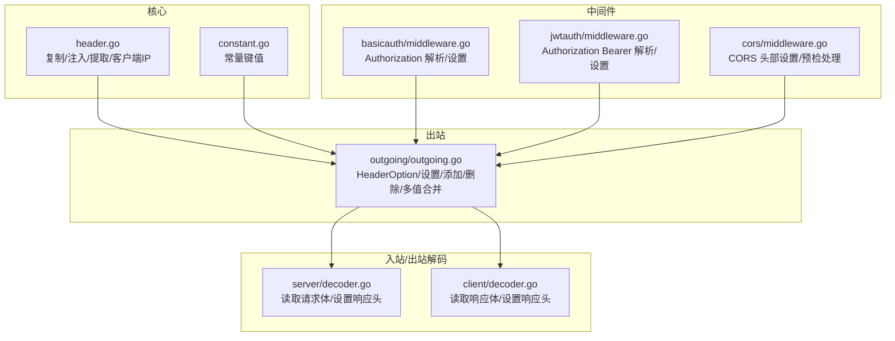
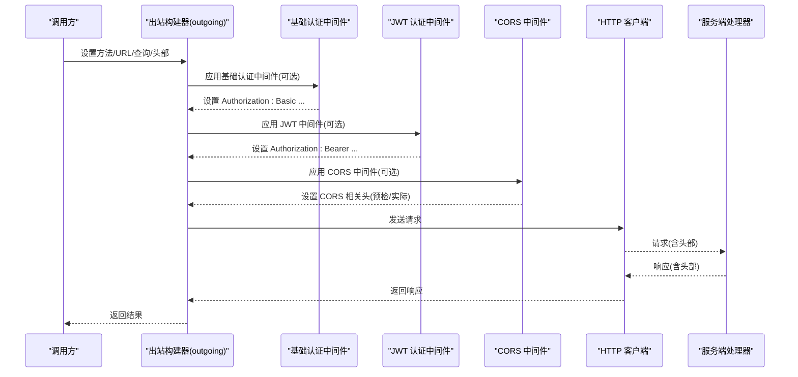
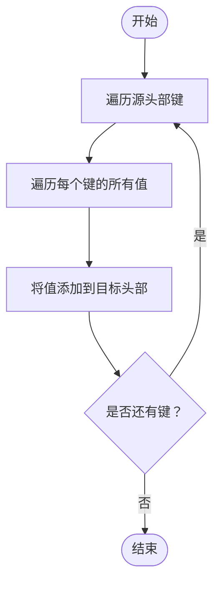
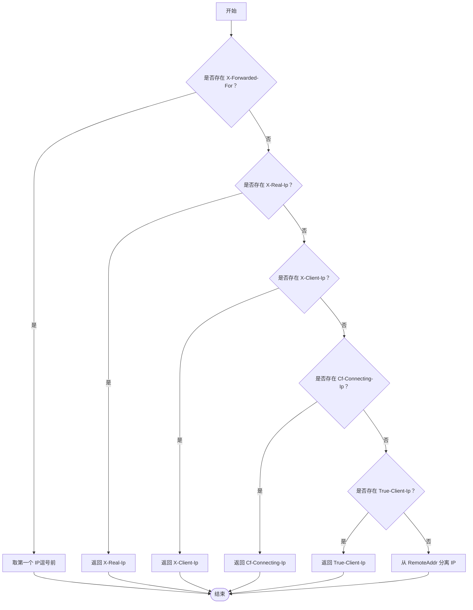
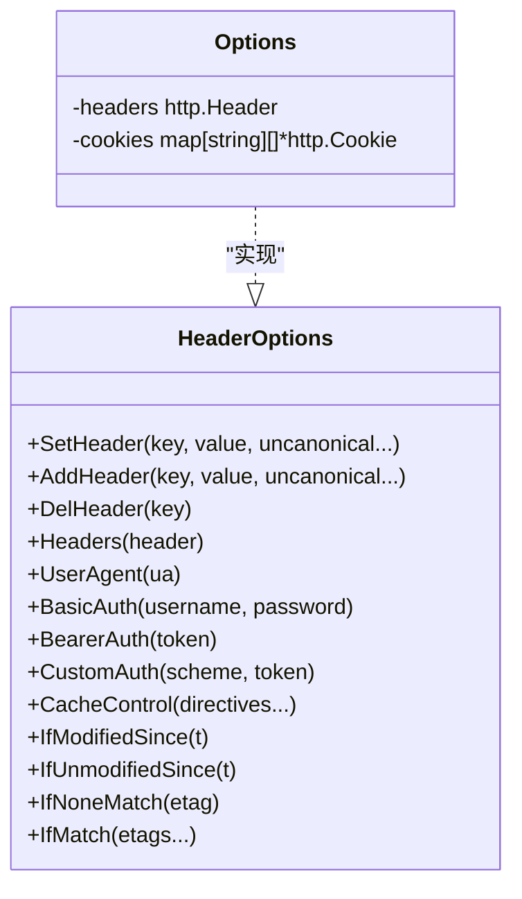
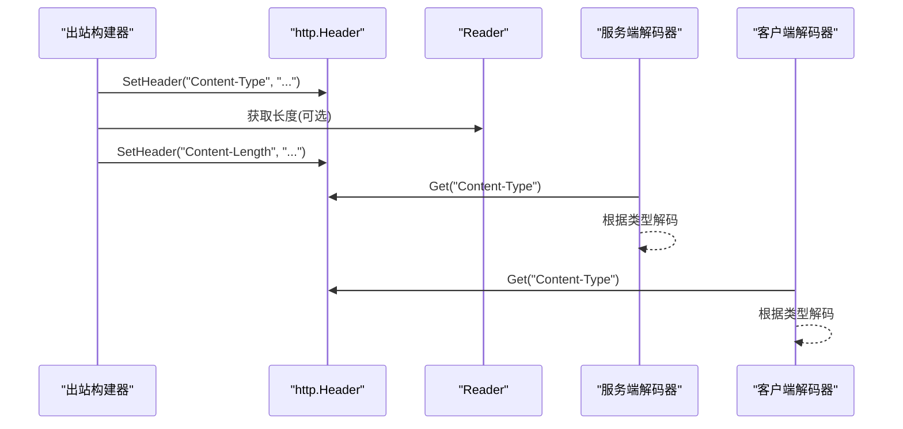
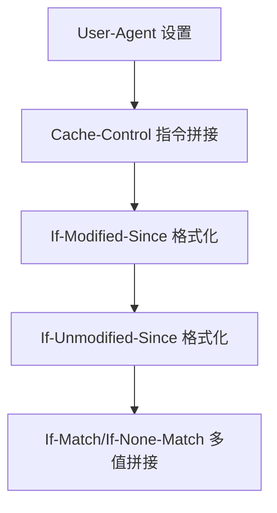
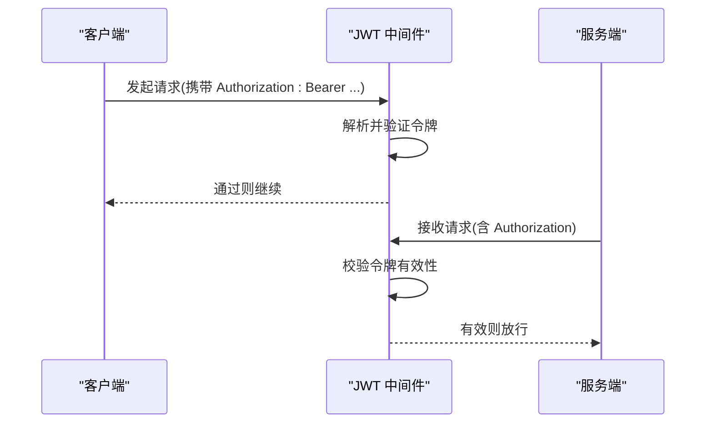
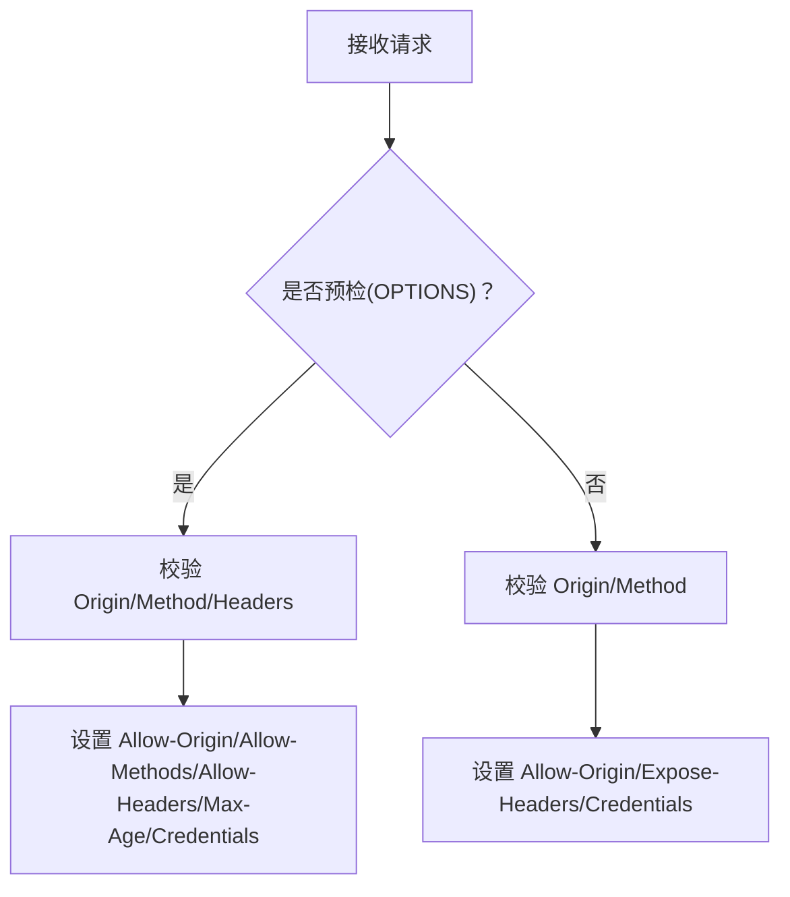
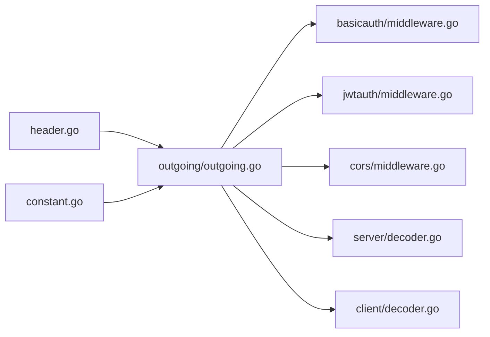

# HTTP 头部处理

<cite>
**本文引用的文件**
- [header.go](file://header.go)
- [constant.go](file://constant.go)
- [outgoing.go](file://outgoing/outgoing.go)
- [decoder.go（客户端）](file://client/decoder.go)
- [decoder.go（服务端）](file://server/decoder.go)
- [middleware.go（基础认证）](file://middleware/basicauth/middleware.go)
- [middleware.go（JWT 认证）](file://middleware/jwtauth/middleware.go)
- [middleware.go（CORS）](file://middleware/cors/middleware.go)
- [outgoing_test.go](file://outgoing/outgoing_test.go)
- [middleware_test.go（CORS）](file://middleware/cors/middleware_test.go)
</cite>

## 目录
1. [简介](#简介)
2. [项目结构](#项目结构)
3. [核心组件](#核心组件)
4. [架构总览](#架构总览)
5. [详细组件分析](#详细组件分析)
6. [依赖分析](#依赖分析)
7. [性能考虑](#性能考虑)
8. [故障排查指南](#故障排查指南)
9. [结论](#结论)
10. [附录：使用示例与最佳实践](#附录使用示例与最佳实践)

## 简介
本文件系统性介绍该仓库中 HTTP 头部处理工具的功能与用法，覆盖以下方面：
- 常用头部字段的解析、设置与验证：Content-Type、Content-Length、User-Agent、Authorization、Cache-Control、If-* 系列、Origin/Vary/CORS 系列等
- 头部标准化处理、大小写不敏感匹配、重复头部处理
- 在 HTTP 请求/响应处理中的典型应用场景
- 安全性与性能优化建议

## 项目结构
围绕“HTTP 头部处理”的关键模块分布如下：
- 核心头部工具：header.go 提供复制、注入/提取上下文中的头部、从请求中提取客户端真实 IP 的能力
- 常量定义：constant.go 定义 Content-Type 键与错误头键等
- 出站请求构建器：outgoing/outgoing.go 提供统一的 HeaderOption 接口与多种头部设置函数
- 入站/出站解码器：client/decoder.go 与 server/decoder.go 展示如何从请求/响应头中读取 Content-Type 并进行数据解码
- 中间件：基础认证、JWT 认证、CORS 中间件均涉及头部的解析与设置
- 测试：outgoing_test.go 与 middleware_test.go 验证头部行为与跨域策略

**图表来源**
- [header.go:1-88](file://header.go#L1-L88)
- [constant.go:1-16](file://constant.go#L1-L16)
- [outgoing.go:344-652](file://outgoing/outgoing.go#L344-L652)
- [decoder.go（客户端）:1-89](file://client/decoder.go#L1-L89)
- [decoder.go（服务端）:1-112](file://server/decoder.go#L1-L112)
- [middleware.go（基础认证）:55-69](file://middleware/basicauth/middleware.go#L55-L69)
- [middleware.go（JWT 认证）:135-171](file://middleware/jwtauth/middleware.go#L135-L171)
- [middleware.go（CORS）:45-160](file://middleware/cors/middleware.go#L45-L160)

**章节来源**
- [header.go:1-88](file://header.go#L1-L88)
- [constant.go:1-16](file://constant.go#L1-L16)
- [outgoing.go:344-652](file://outgoing/outgoing.go#L344-L652)
- [decoder.go（客户端）:1-89](file://client/decoder.go#L1-L89)
- [decoder.go（服务端）:1-112](file://server/decoder.go#L1-L112)
- [middleware.go（基础认证）:55-69](file://middleware/basicauth/middleware.go#L55-L69)
- [middleware.go（JWT 认证）:135-171](file://middleware/jwtauth/middleware.go#L135-L171)
- [middleware.go（CORS）:45-160](file://middleware/cors/middleware.go#L45-L160)

## 核心组件
- 头部复制与上下文存取
  - 复制：将源 http.Header 的所有键值复制到目标 http.Header，保留原有值并追加源值
  - 注入/提取：通过自定义未导出键在 context.Context 中存储/读取 http.Header
- 客户端真实 IP 提取：按顺序检查 X-Forwarded-For、X-Real-Ip、X-Client-Ip、Cf-Connecting-Ip、True-Client-Ip，若无则回退到 RemoteAddr
- 常量：Content-Type 键、JSON/纯文本默认类型、错误头键
- 出站头部选项：统一的 HeaderOption 接口，支持 Set/Add/Del/Headers；内置 User-Agent、Basic/Bearer/CustomAuth、Cache-Control、If-Modified-Since、If-Unmodified-Since、If-None-Match、If-Match 等
- 解码器：服务端/客户端分别从请求/响应头中读取 Content-Type 并据此解码

**章节来源**
- [header.go:10-87](file://header.go#L10-L87)
- [constant.go:3-15](file://constant.go#L3-L15)
- [outgoing.go:344-652](file://outgoing/outgoing.go#L344-L652)
- [decoder.go（客户端）:39-89](file://client/decoder.go#L39-L89)
- [decoder.go（服务端）:63-112](file://server/decoder.go#L63-L112)

## 架构总览
下图展示了“出站请求构建”与“中间件/解码器”之间的交互，体现头部处理的关键路径。

**图表来源**
- [outgoing.go:344-652](file://outgoing/outgoing.go#L344-L652)
- [middleware.go（基础认证）:55-69](file://middleware/basicauth/middleware.go#L55-L69)
- [middleware.go（JWT 认证）:173-219](file://middleware/jwtauth/middleware.go#L173-L219)
- [middleware.go（CORS）:45-160](file://middleware/cors/middleware.go#L45-L160)

## 详细组件分析

### 组件一：头部复制与上下文存取
- 能力
  - 将源 http.Header 的每个键的所有值追加到目标 http.Header
  - 使用未导出的空结构体作为 context.Context 的键，避免冲突
- 典型用途
  - 在中间件链中传递或合并头部
  - 将请求头注入到上下文中以便后续处理

**图表来源**
- [header.go:16-22](file://header.go#L16-L22)

**章节来源**
- [header.go:10-45](file://header.go#L10-L45)

### 组件二：客户端真实 IP 提取
- 规则
  - 按优先级检查多个代理/CDN 头部
  - 若存在 X-Forwarded-For，则仅取最左侧 IP
  - 回退到 RemoteAddr 的 IP 部分
- 注意
  - 该实现仅返回 IP 字符串，不负责校验格式合法性

**图表来源**
- [header.go:47-87](file://header.go#L47-L87)

**章节来源**
- [header.go:47-87](file://header.go#L47-L87)

### 组件三：出站头部选项（HeaderOption）
- 设计要点
  - 统一接口：SetHeader/AddHeader/DelHeader/Headers
  - 支持“非规范名”模式（通过可变参数控制）
  - 内置常用头部快捷设置：User-Agent、BasicAuth、BearerAuth、CustomAuth、CacheControl、If-* 等
  - 自动设置 Content-Type 与 Content-Length（当设置 Reader 类 Body 时）
- 重复头部处理
  - AddHeader 会为同一键追加多个值
  - Headers 会将源头中同一键的多个值全部追加到目标头
  - SetHeader 会替换为单个值
- 大小写不敏感
  - http.Header 的键在 Go 中通常以 CanonicalHeaderKey 归一化，但 SetHeader/AddHeader 仍按传入键名处理；如需严格大小写不敏感，请在调用前自行规范化

**图表来源**
- [outgoing.go:344-652](file://outgoing/outgoing.go#L344-L652)

**章节来源**
- [outgoing.go:344-652](file://outgoing/outgoing.go#L344-L652)

### 组件四：内容类型与长度处理
- Content-Type
  - 常量键由常量模块提供
  - 出站设置 Body 时自动设置 Content-Type
- Content-Length
  - 当 Body 为可探测长度的 Reader 时，自动设置 Content-Length
- 解码器
  - 服务端/客户端解码器从请求/响应头读取 Content-Type 并据此解码

**图表来源**
- [constant.go:3-15](file://constant.go#L3-L15)
- [outgoing.go:758-768](file://outgoing/outgoing.go#L758-L768)
- [decoder.go（客户端）:39-57](file://client/decoder.go#L39-L57)
- [decoder.go（服务端）:63-83](file://server/decoder.go#L63-L83)

**章节来源**
- [constant.go:3-15](file://constant.go#L3-L15)
- [outgoing.go:758-768](file://outgoing/outgoing.go#L758-L768)
- [decoder.go（客户端）:39-57](file://client/decoder.go#L39-L57)
- [decoder.go（服务端）:63-83](file://server/decoder.go#L63-L83)

### 组件五：User-Agent 与缓存控制
- User-Agent
  - 提供专用设置函数，便于统一标识客户端
- 缓存控制
  - Cache-Control 指令以逗号连接
  - If-Modified-Since/If-Unmodified-Since 使用标准时间格式
  - If-Match/If-None-Match 支持多 ETag

**图表来源**
- [outgoing.go:564-597](file://outgoing/outgoing.go#L564-L597)

**章节来源**
- [outgoing.go:564-597](file://outgoing/outgoing.go#L564-L597)

### 组件六：认证头部（Authorization）
- 基础认证
  - 中间件从 Authorization 头解析凭证
  - 出站可通过 BasicAuth 快速设置
- JWT 认证
  - 中间件从 Authorization 头解析 Bearer 令牌
  - 出站可通过 BearerAuth/CustomAuth 设置
- 安全注意
  - 建议配合 HTTPS 使用
  - 对于高风险场景，建议缩短令牌有效期并启用刷新机制

**图表来源**
- [middleware.go（JWT 认证）:135-171](file://middleware/jwtauth/middleware.go#L135-L171)
- [middleware.go（JWT 认证）:186-219](file://middleware/jwtauth/middleware.go#L186-L219)

**章节来源**
- [middleware.go（基础认证）:55-69](file://middleware/basicauth/middleware.go#L55-L69)
- [middleware.go（JWT 认证）:135-171](file://middleware/jwtauth/middleware.go#L135-L171)
- [middleware.go（JWT 认证）:186-219](file://middleware/jwtauth/middleware.go#L186-L219)

### 组件七：CORS 头部处理
- 预检（OPTIONS）与实际请求的区分
- 允许来源、方法、头部的白名单/通配符/函数回调
- Vary 头部的动态设置
- 暴露头部（Access-Control-Expose-Headers）与凭据（Allow-Credentials）

**图表来源**
- [middleware.go（CORS）:147-160](file://middleware/cors/middleware.go#L147-L160)
- [middleware.go（CORS）:162-216](file://middleware/cors/middleware.go#L162-L216)
- [middleware.go（CORS）:218-248](file://middleware/cors/middleware.go#L218-L248)

**章节来源**
- [middleware.go（CORS）:45-160](file://middleware/cors/middleware.go#L45-L160)
- [middleware.go（CORS）:162-216](file://middleware/cors/middleware.go#L162-L216)
- [middleware.go（CORS）:218-248](file://middleware/cors/middleware.go#L218-L248)

## 依赖分析
- header.go 与 constant.go 为低耦合基础模块，被其他组件广泛复用
- outgoing/outgoing.go 作为“出站请求构建器”，集中管理头部设置逻辑
- 中间件通过解析/设置头部参与请求生命周期
- 解码器依赖头部中的 Content-Type 进行协议无关的数据解码

**图表来源**
- [header.go:1-88](file://header.go#L1-L88)
- [constant.go:1-16](file://constant.go#L1-L16)
- [outgoing.go:344-652](file://outgoing/outgoing.go#L344-L652)
- [decoder.go（客户端）:1-89](file://client/decoder.go#L1-L89)
- [decoder.go（服务端）:1-112](file://server/decoder.go#L1-L112)
- [middleware.go（基础认证）:1-113](file://middleware/basicauth/middleware.go#L1-L113)
- [middleware.go（JWT 认证）:1-246](file://middleware/jwtauth/middleware.go#L1-L246)
- [middleware.go（CORS）:1-249](file://middleware/cors/middleware.go#L1-L249)

**章节来源**
- [header.go:1-88](file://header.go#L1-L88)
- [constant.go:1-16](file://constant.go#L1-L16)
- [outgoing.go:344-652](file://outgoing/outgoing.go#L344-L652)
- [decoder.go（客户端）:1-89](file://client/decoder.go#L1-L89)
- [decoder.go（服务端）:1-112](file://server/decoder.go#L1-L112)
- [middleware.go（基础认证）:1-113](file://middleware/basicauth/middleware.go#L1-L113)
- [middleware.go（JWT 认证）:1-246](file://middleware/jwtauth/middleware.go#L1-L246)
- [middleware.go（CORS）:1-249](file://middleware/cors/middleware.go#L1-L249)

## 性能考虑
- 头部合并与重复值
  - AddHeader 会为同一键累积多个值，可能增加响应头体积；在需要严格去重时，应在发送前对目标头进行归并
- Content-Length 自动设置
  - 当 Body 可探测长度时自动设置，避免不必要的分块传输；若使用不可探测长度的流，将导致 Transfer-Encoding: chunked
- 头部键规范化
  - 使用 http.Header.Set/Add 时遵循 CanonicalHeaderKey 规范，有助于减少重复键与兼容性问题
- 中间件顺序
  - 将高频/轻量中间件前置，认证/CORS 等可按需插入，避免重复扫描头部

[本节为通用指导，无需特定文件引用]

## 故障排查指南
- 头部未生效
  - 检查是否使用了“非规范名”模式（uncanonical），或是否被后续中间件覆盖
  - 确认中间件执行顺序与覆盖策略
- Content-Length 异常
  - 确认 Body 是否实现了长度探测接口；否则将采用分块传输
- CORS 未生效
  - 检查 AllowedOrigins/AllowedMethods/AllowedHeaders 配置
  - 确认预检请求是否正确传递 Access-Control-Request-* 头
- 认证失败
  - 基础认证：确认 Authorization 头格式与凭据正确
  - JWT：确认 Bearer 令牌格式、签名与过期时间

**章节来源**
- [outgoing_test.go:128-170](file://outgoing/outgoing_test.go#L128-L170)
- [outgoing_test.go:664-698](file://outgoing/outgoing_test.go#L664-L698)
- [middleware_test.go（CORS）:196-249](file://middleware/cors/middleware_test.go#L196-L249)

## 结论
该工具集提供了统一、可组合的 HTTP 头部处理能力：
- 通过 HeaderOption 抽象，简化了常见头部的设置与验证
- 在出站与入/出站解码器中自然融入头部处理流程
- 中间件层面对 Authorization、CORS 等关键头部进行解析与设置
- 建议在生产环境中结合 HTTPS、严格的 CORS 策略与最小权限原则，确保安全性与性能

[本节为总结，无需特定文件引用]

## 附录：使用示例与最佳实践

### 常见头部处理示例（路径指引）
- 设置 User-Agent
  - 参考：[outgoing.go:404-409](file://outgoing/outgoing.go#L404-L409)
- 设置缓存控制
  - 参考：[outgoing.go:432-437](file://outgoing/outgoing.go#L432-L437)
- 条件请求头（If-Modified-Since/If-Match 等）
  - 参考：[outgoing.go:439-465](file://outgoing/outgoing.go#L439-L465)
- 设置 Authorization（Basic/JWT）
  - 出站设置：[outgoing.go:411-430](file://outgoing/outgoing.go#L411-L430)
  - 服务端解析：[middleware.go（基础认证）:59-60](file://middleware/basicauth/middleware.go#L59-L60)、[middleware.go（JWT 认证）:140](file://middleware/jwtauth/middleware.go#L140)
- CORS 头部
  - 参考：[middleware.go（CORS）:162-248](file://middleware/cors/middleware.go#L162-L248)
- 从请求头读取 Content-Type 并解码
  - 参考：[decoder.go（服务端）:81](file://server/decoder.go#L81)、[decoder.go（客户端）:50](file://client/decoder.go#L50)

### 最佳实践
- 安全性
  - 所有认证头部（Authorization）必须在 HTTPS 下传输
  - JWT 令牌应设置合理过期时间与刷新策略
  - CORS 配置应尽量收紧允许来源与方法
- 性能
  - 优先使用可探测长度的 Body，避免不必要的分块传输
  - 合理使用缓存控制指令，减少不必要的网络往返
- 可维护性
  - 使用统一的 HeaderOption 接口，避免散落的手动设置
  - 对重复头部进行必要的归并与去重

[本节为通用指导，无需特定文件引用]