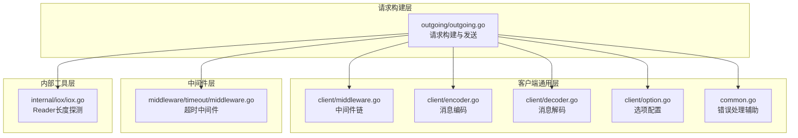
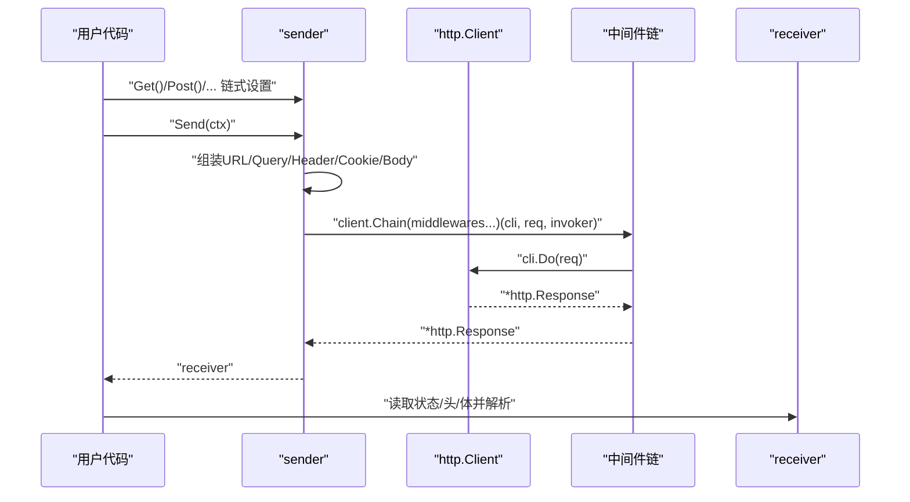
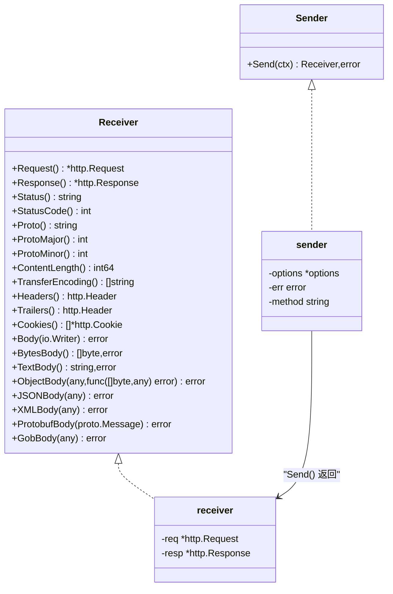
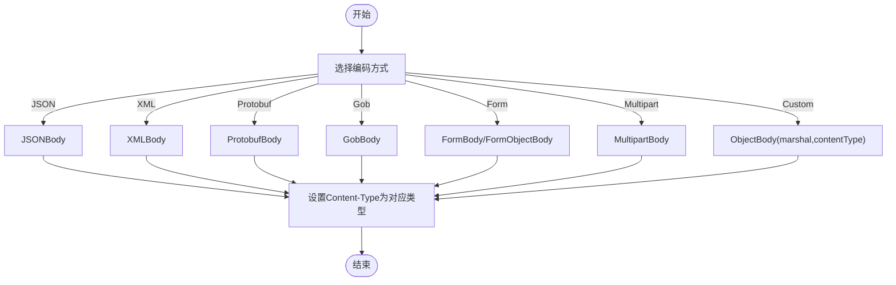
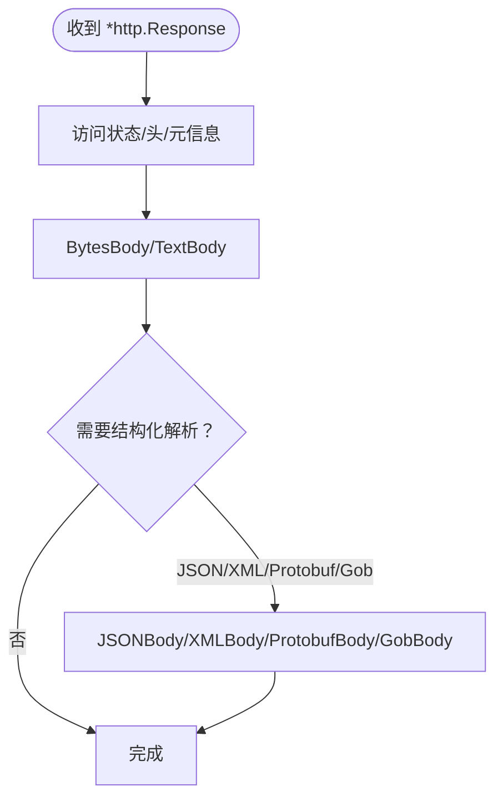
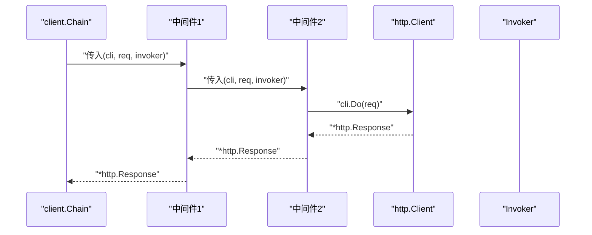
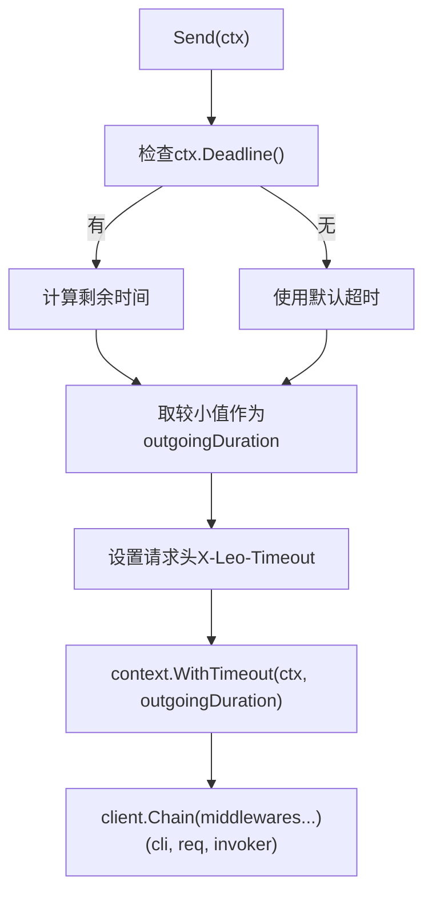
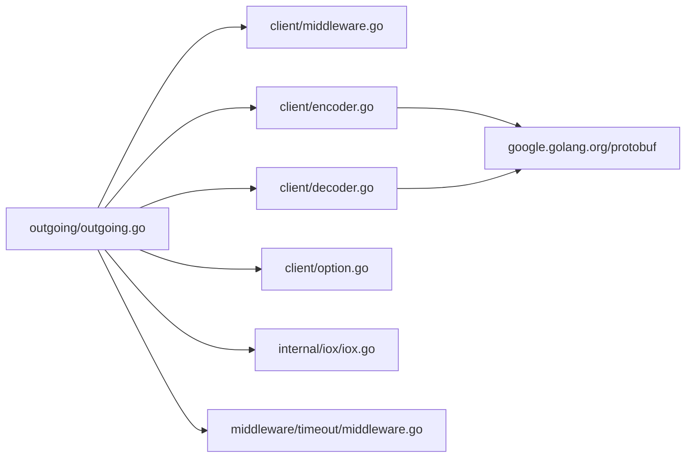

# HTTP 请求发送

<cite>
**本文引用的文件**
- [outgoing.go](file://outgoing/outgoing.go)
- [outgoing_example_test.go](file://outgoing/outgoing_example_test.go)
- [outgoing_test.go](file://outgoing/outgoing_test.go)
- [middleware.go](file://client/middleware.go)
- [option.go](file://client/option.go)
- [decoder.go](file://client/decoder.go)
- [encoder.go](file://client/encoder.go)
- [common.go](file://common.go)
- [iox.go](file://internal/iox/iox.go)
- [middleware.go](file://middleware/timeout/middleware.go)
- [go.mod](file://go.mod)
</cite>

## 目录
1. [简介](#简介)
2. [项目结构](#项目结构)
3. [核心组件](#核心组件)
4. [架构总览](#架构总览)
5. [详细组件分析](#详细组件分析)
6. [依赖关系分析](#依赖关系分析)
7. [性能考量](#性能考量)
8. [故障排查指南](#故障排查指南)
9. [结论](#结论)
10. [附录](#附录)

## 简介
本文件系统性介绍 HTTP 请求发送工具的功能与使用方法，覆盖 Outgoing 请求的构建、发送、响应处理全流程，包括请求头设置、请求体编码、响应解析等；同时解释并发请求处理、连接池管理、超时控制等高级特性，并提供微服务通信、外部 API 调用、代理转发等典型场景下的最佳实践与性能优化建议。

## 项目结构
该仓库采用模块化设计，HTTP 请求发送能力集中在 outgoing 包，客户端中间件与通用能力位于 client、middleware、internal 等包中：
- outgoing：对外暴露简洁的链式 API，支持多种请求构建与发送能力
- client：提供中间件链、编码解码、选项配置等通用能力
- middleware：提供超时、限流等横切能力
- internal：内部工具（如 io 长度探测）

图表来源
- [outgoing.go:1-1079](file://outgoing/outgoing.go#L1-L1079)
- [middleware.go:1-99](file://client/middleware.go#L1-L99)
- [encoder.go:1-81](file://client/encoder.go#L1-L81)
- [decoder.go:1-89](file://client/decoder.go#L1-L89)
- [option.go:1-279](file://client/option.go#L1-L279)
- [common.go:1-51](file://common.go#L1-L51)
- [iox.go:1-72](file://internal/iox/iox.go#L1-L72)
- [middleware.go:1-107](file://middleware/timeout/middleware.go#L1-L107)

章节来源
- [outgoing.go:1-1079](file://outgoing/outgoing.go#L1-L1079)
- [go.mod:1-14](file://go.mod#L1-L14)

## 核心组件
- 请求构建器 sender：负责组装方法、URL、查询参数、请求头、Cookie、请求体，并最终发送请求
- 响应接收器 receiver：封装 http.Response，提供统一的响应读取与解析接口
- 中间件链 client.Chain：支持在请求发送前进行拦截与增强（如日志、鉴权、超时）
- 编码/解码：支持 JSON、XML、Protobuf、Gob、表单、多部分上传等
- 连接池与超时：默认 http.Client 配置包含连接池参数与全局超时；可通过中间件实现动态超时

章节来源
- [outgoing.go:147-942](file://outgoing/outgoing.go#L147-L942)
- [middleware.go:35-99](file://client/middleware.go#L35-L99)
- [encoder.go:15-81](file://client/encoder.go#L15-L81)
- [decoder.go:16-89](file://client/decoder.go#L16-L89)

## 架构总览
Outgoing 的请求发送流程如下：
- 通过 Get/Post/Put 等方法创建 sender
- 链式设置 URL、Query、Header、Body
- Send(ctx) 构造 http.Request，合并 headers 与 cookies，应用中间件链，调用 http.Client 发送
- 返回 receiver，支持按需读取响应体并解析为 JSON/XML/Protobuf/Gob 等

图表来源
- [outgoing.go:907-942](file://outgoing/outgoing.go#L907-L942)
- [middleware.go:88-99](file://client/middleware.go#L88-L99)

## 详细组件分析

### 请求构建与发送（sender/receiver）
- 方法选择：Get/Head/Post/Put/Patch/Delete/Connect/Options/Trace
- URL 设置：支持 *url.URL 与字符串，自动解析并合并查询参数
- 查询参数：Set/Add/Del/QueryString/Queries/QueryObject
- 请求头：Set/Add/Del/Headers/UserAgent/BasicAuth/BearerAuth/CustomAuth/缓存与条件请求头
- Cookie：Set/Add/Del/Cookies
- 请求体：支持 Reader、[]byte、string、JSON/XML/Protobuf/Gob、表单、对象表单、多部分上传
- 发送：构造 http.Request，注入中间件链，调用 http.Client，返回 receiver

图表来源
- [outgoing.go:903-1079](file://outgoing/outgoing.go#L903-L1079)

章节来源
- [outgoing.go:27-65](file://outgoing/outgoing.go#L27-L65)
- [outgoing.go:147-942](file://outgoing/outgoing.go#L147-L942)
- [outgoing.go:944-1079](file://outgoing/outgoing.go#L944-L1079)

### 请求体编码策略
- JSON/XML/Protobuf/Gob：使用内置 marshal 函数，自动设置 Content-Type
- 表单：application/x-www-form-urlencoded
- 多部分：multipart/form-data，支持字段与文件混合
- 自定义编码：ObjectBody 接受自定义 marshal 函数与 Content-Type

图表来源
- [outgoing.go:796-891](file://outgoing/outgoing.go#L796-L891)

章节来源
- [outgoing.go:758-891](file://outgoing/outgoing.go#L758-L891)

### 响应解析与读取
- 支持按字节、文本、JSON、XML、Protobuf、Gob 解析
- 提供 Headers、Cookies、状态码、协议版本、传输编码、尾部头等访问器
- Body 写入任意 io.Writer，便于落盘或流式处理

图表来源
- [outgoing.go:944-1067](file://outgoing/outgoing.go#L944-L1067)

章节来源
- [outgoing.go:944-1067](file://outgoing/outgoing.go#L944-L1067)

### 中间件与链式调用
- client.Middleware 定义中间件签名，client.Chain 组合多个中间件
- client.Invoke 在无中间件时直接调用 http.Client.Do，否则按链顺序执行
- outgoing 通过 client.Chain 注入中间件，支持日志、鉴权、超时等

图表来源
- [middleware.go:35-99](file://client/middleware.go#L35-L99)

章节来源
- [middleware.go:9-99](file://client/middleware.go#L9-L99)
- [outgoing.go:937-941](file://outgoing/outgoing.go#L937-L941)

### 超时控制与并发特性
- 默认 http.Client.Timeout：30 秒
- 连接池参数（默认 Transport）：最大空闲连接、每主机空闲连接、每主机最大连接、空闲超时、压缩开关
- 超时中间件：Client 根据上下文 deadline 动态计算剩余时间，设置请求头并创建带超时的上下文
- 并发：通过中间件链与连接池实现；注意避免阻塞与资源泄漏

图表来源
- [outgoing.go:155-167](file://outgoing/outgoing.go#L155-L167)
- [middleware.go:72-106](file://middleware/timeout/middleware.go#L72-L106)

章节来源
- [outgoing.go:155-167](file://outgoing/outgoing.go#L155-L167)
- [middleware.go:14-107](file://middleware/timeout/middleware.go#L14-L107)

### 错误处理与校验
- MarshalError/UnmarshalError：分别用于请求体与响应体编解码失败
- BreakOnError/ContinueOnError：提供链式错误处理辅助，便于组合与传播错误
- 单元测试覆盖：查询参数、请求头、认证、Cookie、Body、发送流程、响应读取等

章节来源
- [outgoing.go:67-97](file://outgoing/outgoing.go#L67-L97)
- [common.go:5-51](file://common.go#L5-L51)
- [outgoing_test.go:16-71](file://outgoing/outgoing_test.go#L16-L71)

## 依赖关系分析
- outgoing 依赖 client 中间件机制与选项配置
- 编码/解码依赖 google.golang.org/protobuf 与标准库
- 连接池与超时由标准库 net/http 提供
- 内部工具 iox 用于探测 Reader 长度，自动设置 Content-Length

图表来源
- [outgoing.go:1-25](file://outgoing/outgoing.go#L1-L25)
- [encoder.go:1-13](file://client/encoder.go#L1-L13)
- [decoder.go:1-14](file://client/decoder.go#L1-L14)
- [iox.go:1-72](file://internal/iox/iox.go#L1-L72)
- [go.mod:5-13](file://go.mod#L5-L13)

章节来源
- [go.mod:1-14](file://go.mod#L1-L14)

## 性能考量
- 连接池与复用
  - 默认 Transport 已启用连接池与 Keep-Alive，适合高并发场景
  - 建议根据业务峰值 QPS 调整 MaxIdleConns、MaxIdleConnsPerHost、MaxConnsPerHost
- 超时与背压
  - 使用超时中间件确保请求不会无限等待
  - 对上游服务设置合理超时，避免级联阻塞
- 请求体大小与 Content-Length
  - 若 Reader 实现 Len/Length/Size 接口，将自动设置 Content-Length，有利于服务端优化
- 编解码开销
  - Protobuf/JSON/XML/Gob 选择应结合数据规模与兼容性
  - 大对象建议使用流式读写，避免一次性分配过多内存
- 中间件链成本
  - 控制中间件数量与复杂度，避免在热路径上做昂贵操作

## 故障排查指南
- 常见错误类型
  - MarshalError：请求体或查询参数序列化失败
  - UnmarshalError：响应体反序列化失败
  - 发送前校验失败：未设置 URL、未初始化 options、client 未设置
- 排查步骤
  - 检查链式调用顺序与参数合法性
  - 使用中间件输出请求摘要（如日志中间件）定位问题
  - 对响应体使用 BytesBody/TextBody 快速确认服务端返回
  - 关注 Content-Length 是否正确设置
- 单元测试参考
  - 查询参数、请求头、认证、Cookie、Body、发送流程、响应读取等均有覆盖

章节来源
- [outgoing.go:67-97](file://outgoing/outgoing.go#L67-L97)
- [outgoing_test.go:16-71](file://outgoing/outgoing_test.go#L16-L71)
- [outgoing_test.go:315-348](file://outgoing/outgoing_test.go#L315-L348)

## 结论
该 HTTP 请求发送工具以简洁的链式 API 提供了从请求构建到响应解析的全栈能力，配合中间件链与连接池、超时控制等机制，适用于微服务通信、外部 API 调用、代理转发等多种场景。通过合理的参数配置与中间件策略，可在保证稳定性的同时获得良好的性能表现。

## 附录

### 使用示例与最佳实践
- 基础 GET 请求与查询参数、自定义头
- POST JSON 请求与响应解析
- 自定义 http.Client 与超时
- 表单提交与多部分上传
- 中间件集成（如日志、鉴权）
- 复杂查询对象与多种请求体类型
- 响应体读取与写入自定义 Writer
- 多个同名头与 Cookie 管理

章节来源
- [outgoing_example_test.go:17-274](file://outgoing/outgoing_example_test.go#L17-L274)

### API 一览（按功能分组）
- 方法选择：Get/Head/Post/Put/Patch/Delete/Connect/Options/Trace
- URL 设置：URL/URLString
- 查询参数：SetQuery/AddQuery/DelQuery/QueryString/Queries/QueryObject
- 请求头：SetHeader/AddHeader/DelHeader/Headers/UserAgent/BasicAuth/BearerAuth/CustomAuth/缓存与条件请求头
- Cookie：SetCookie/AddCookie/DelCookie/Cookies
- 请求体：Body/BytesBody/TextBody/ObjectBody/JSONBody/XMLBody/ProtobufBody/GobBody/FormBody/FormObjectBody/MultipartBody
- 发送：Send(ctx)
- 响应读取与解析：Request/Response/Status/StatusCode/Proto/ProtoMajor/ProtoMinor/ContentLength/TransferEncoding/Headers/Trailers/Cookies/Body/BytesBody/TextBody/ObjectBody/JSONBody/XMLBody/ProtobufBody/GobBody

章节来源
- [outgoing.go:27-65](file://outgoing/outgoing.go#L27-L65)
- [outgoing.go:171-218](file://outgoing/outgoing.go#L171-L218)
- [outgoing.go:220-342](file://outgoing/outgoing.go#L220-L342)
- [outgoing.go:344-652](file://outgoing/outgoing.go#L344-L652)
- [outgoing.go:654-901](file://outgoing/outgoing.go#L654-L901)
- [outgoing.go:903-1079](file://outgoing/outgoing.go#L903-L1079)