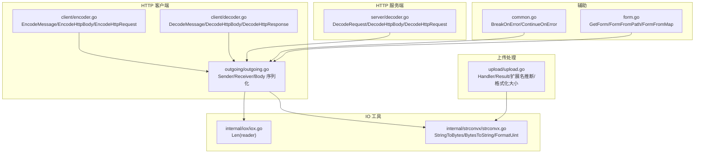
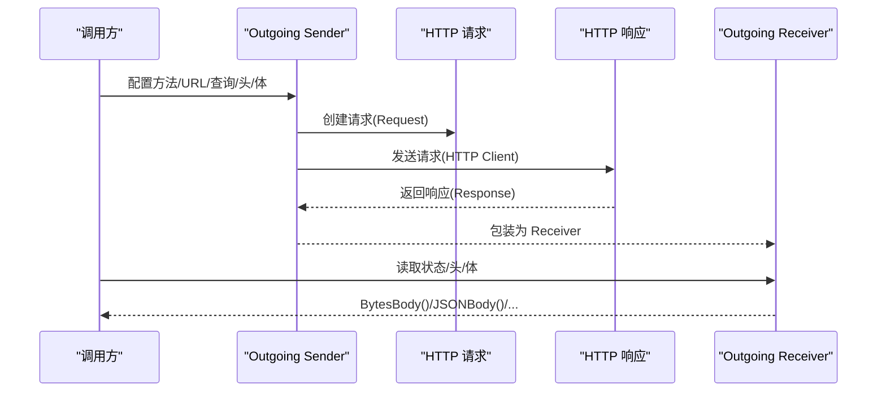
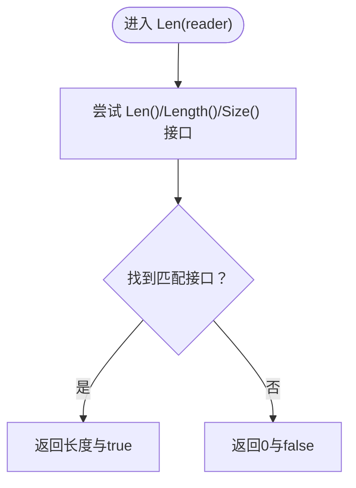
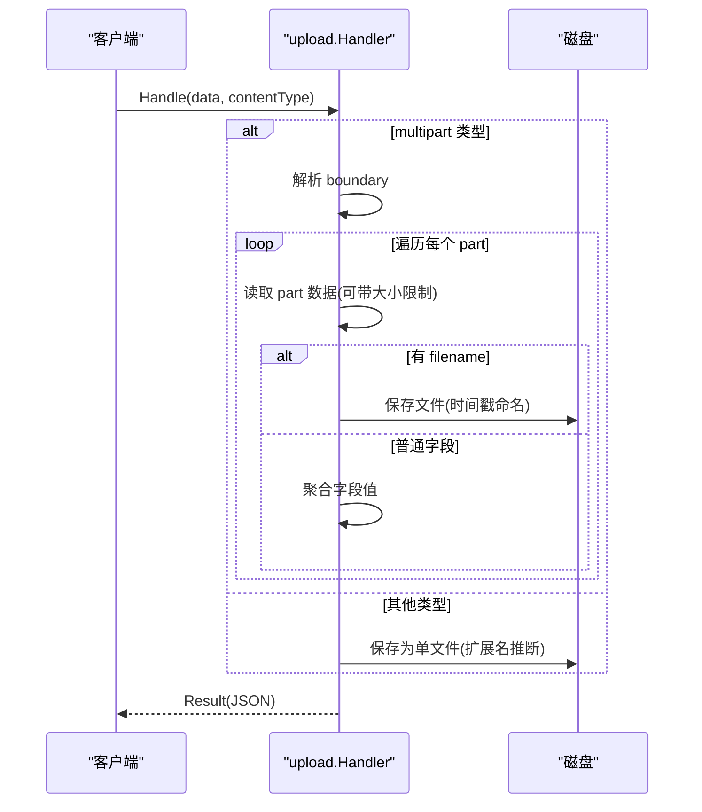
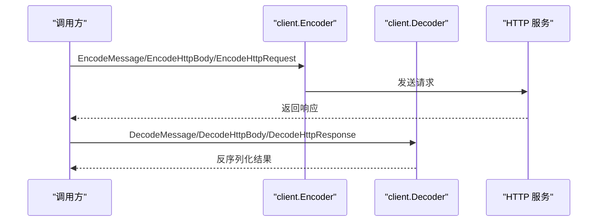
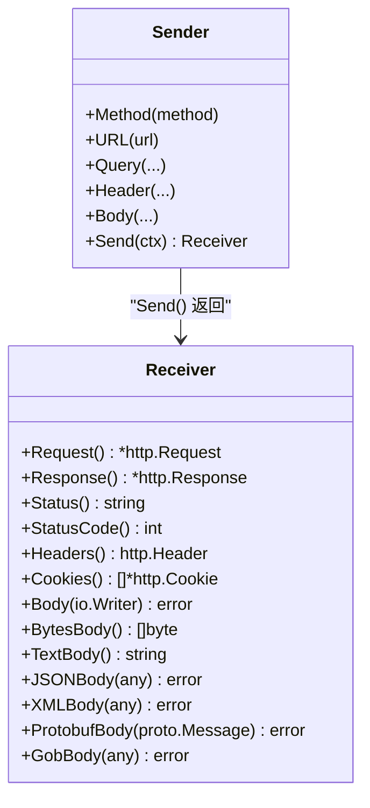
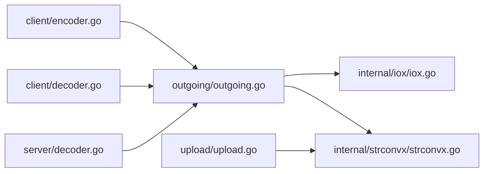

# IO 工具函数

<cite>
**本文档引用的文件**
- [internal/iox/iox.go](file://internal/iox/iox.go)
- [upload/upload.go](file://upload/upload.go)
- [client/decoder.go](file://client/decoder.go)
- [client/encoder.go](file://client/encoder.go)
- [server/decoder.go](file://server/decoder.go)
- [outgoing/outgoing.go](file://outgoing/outgoing.go)
- [common.go](file://common.go)
- [form.go](file://form.go)
- [internal/strconvx/strconvx.go](file://internal/strconvx/strconvx.go)
- [upload/upload_test.go](file://upload/upload_test.go)
- [outgoing/outgoing_test.go](file://outgoing/outgoing_test.go)
- [example/upload/upload_test.go](file://example/upload/upload_test.go)
</cite>

## 目录
1. [简介](#简介)
2. [项目结构](#项目结构)
3. [核心组件](#核心组件)
4. [架构总览](#架构总览)
5. [详细组件分析](#详细组件分析)
6. [依赖分析](#依赖分析)
7. [性能考虑](#性能考虑)
8. [故障排查指南](#故障排查指南)
9. [结论](#结论)
10. [附录：使用示例与最佳实践](#附录使用示例与最佳实践)

## 简介
本文件系统性介绍 IO 工具包的功能与使用方法，重点覆盖以下方面：
- 文件读写与流处理：基于 io.Reader/io.Writer 的通用读取、复制与长度推断
- 缓冲区管理：统一的字节缓冲与内存零拷贝转换
- HTTP 请求处理：请求/响应体的编码与解码，支持多种内容类型（JSON/XML/Protobuf/Gob）
- 文件上传下载：多部分表单解析、文件落地、大小限制与扩展名推断
- 数据序列化：JSON/XML/Protobuf/Gob 的编解码与错误包装
- 实际应用场景：HTTP 接口、文件上传下载、RPC 请求封装、中间件链路集成

## 项目结构
IO 工具包主要分布在以下模块：
- internal/iox：通用 IO 能力（长度推断）
- upload：文件上传与多部分解析
- client/server：HTTP 请求/响应编解码
- outgoing：HTTP 客户端发送器（链式配置、序列化、接收器）
- common/form：错误控制与表单数据提取
- internal/strconvx：字符串与字节的零分配转换
- 示例与测试：验证各组件行为与边界条件

**图表来源**
- [internal/iox/iox.go:1-72](file://internal/iox/iox.go#L1-L72)
- [internal/strconvx/strconvx.go:1-49](file://internal/strconvx/strconvx.go#L1-L49)
- [upload/upload.go:1-412](file://upload/upload.go#L1-L412)
- [outgoing/outgoing.go:1-1079](file://outgoing/outgoing.go#L1-L1079)
- [client/encoder.go:1-81](file://client/encoder.go#L1-L81)
- [client/decoder.go:1-89](file://client/decoder.go#L1-L89)
- [server/decoder.go:1-112](file://server/decoder.go#L1-L112)
- [common.go:1-51](file://common.go#L1-L51)
- [form.go:1-80](file://form.go#L1-L80)

**章节来源**
- [internal/iox/iox.go:1-72](file://internal/iox/iox.go#L1-L72)
- [upload/upload.go:1-412](file://upload/upload.go#L1-L412)
- [outgoing/outgoing.go:1-1079](file://outgoing/outgoing.go#L1-L1079)
- [client/encoder.go:1-81](file://client/encoder.go#L1-L81)
- [client/decoder.go:1-89](file://client/decoder.go#L1-L89)
- [server/decoder.go:1-112](file://server/decoder.go#L1-L112)
- [common.go:1-51](file://common.go#L1-L51)
- [form.go:1-80](file://form.go#L1-L80)
- [internal/strconvx/strconvx.go:1-49](file://internal/strconvx/strconvx.go#L1-L49)

## 核心组件
- IO 长度推断：Len(reader) 支持多种整数类型的 Len()/Length()/Size() 接口，自动设置 Content-Length 头部
- 字符串与字节零拷贝：StringToBytes/BytesToString 提供底层指针切片，避免额外内存分配
- 上传处理器：Handler 统一处理 multipart/form-data/multipart/mixed 与原始二进制，支持大小限制、扩展名推断、结果序列化
- HTTP 编解码：客户端与服务端分别提供消息、HttpBody、HttpRequest 的编解码函数
- 发送器/接收器：Outgoing Sender/Receiver 提供链式配置、多种序列化方式与统一的响应读取接口
- 错误控制：BreakOnError/ContinueOnError 提供错误短路与合并策略
- 表单工具：GetForm/FormFromPath/FormFromMap 简化表单字段提取与构造

**章节来源**
- [internal/iox/iox.go:5-71](file://internal/iox/iox.go#L5-L71)
- [internal/strconvx/strconvx.go:14-28](file://internal/strconvx/strconvx.go#L14-L28)
- [upload/upload.go:69-152](file://upload/upload.go#L69-L152)
- [client/decoder.go:16-88](file://client/decoder.go#L16-L88)
- [server/decoder.go:15-111](file://server/decoder.go#L15-L111)
- [outgoing/outgoing.go:67-1079](file://outgoing/outgoing.go#L67-L1079)
- [common.go:5-50](file://common.go#L5-L50)
- [form.go:8-79](file://form.go#L8-L79)

## 架构总览
IO 工具包围绕“流式读取 + 内容类型感知 + 错误控制”的设计原则构建，贯穿上传、HTTP 编解码与客户端发送流程。

**图表来源**
- [outgoing/outgoing.go:907-942](file://outgoing/outgoing.go#L907-L942)
- [outgoing/outgoing.go:944-1067](file://outgoing/outgoing.go#L944-L1067)

## 详细组件分析

### IO 长度推断（Len）
- 设计目的：从 Reader 中安全地探测可读对象的长度，用于设置 Content-Length，减少不必要的分块传输
- 实现原理：通过类型断言匹配 Len()/Length()/Size() 等方法签名，返回 uint64 长度与是否可用标志
- 性能影响：当 Reader 实现了长度接口时，可直接设置 Content-Length，有利于连接复用与代理缓存

**图表来源**
- [internal/iox/iox.go:5-71](file://internal/iox/iox.go#L5-L71)

**章节来源**
- [internal/iox/iox.go:5-71](file://internal/iox/iox.go#L5-L71)

### 字符串与字节零拷贝（strconvx）
- 设计目的：在不触发 GC 的前提下进行字符串与字节切片互转，降低内存分配成本
- 实现原理：利用 unsafe 指针与切片数据，直接共享底层存储
- 使用建议：仅在确定生命周期与不可变性时使用；配合上游严格控制数据所有权

**章节来源**
- [internal/strconvx/strconvx.go:14-28](file://internal/strconvx/strconvx.go#L14-L28)

### 上传处理器（upload.Handler）
- 功能概览：解析 multipart/form-data/mixed，保存文件到磁盘，收集表单字段，支持单文件回退与大小限制
- 关键点：
  - 自动检测 Content-Type 并选择解析路径
  - 单文件模式下根据 Content-Type 推断扩展名
  - 多文件模式下按字段名聚合，支持同名多次提交
  - 逐文件/总体积大小限制，防止资源滥用
  - 结果结构化输出 JSON，便于前端或下游系统消费

**图表来源**
- [upload/upload.go:169-194](file://upload/upload.go#L169-L194)
- [upload/upload.go:212-267](file://upload/upload.go#L212-L267)
- [upload/upload.go:286-303](file://upload/upload.go#L286-L303)

**章节来源**
- [upload/upload.go:169-194](file://upload/upload.go#L169-L194)
- [upload/upload.go:212-267](file://upload/upload.go#L212-L267)
- [upload/upload.go:286-303](file://upload/upload.go#L286-L303)
- [upload/upload.go:325-391](file://upload/upload.go#L325-L391)

### HTTP 客户端编解码（client）
- EncodeMessage：将 Protobuf 消息 JSON 序列化后写入请求体，并设置 Content-Type
- EncodeHttpBody：直接写入 HttpBody 的原始数据并设置 Content-Type
- EncodeHttpRequest：写入 HttpRequest 的 body，并附加所有头
- DecodeMessage：读取响应体 JSON 并反序列化到 Protobuf 消息
- DecodeHttpBody：提取响应的 Content-Type 与原始数据
- DecodeHttpResponse：提取状态码、原因短语、头与 body

**图表来源**
- [client/encoder.go:15-80](file://client/encoder.go#L15-L80)
- [client/decoder.go:16-88](file://client/decoder.go#L16-L88)

**章节来源**
- [client/encoder.go:15-80](file://client/encoder.go#L15-L80)
- [client/decoder.go:16-88](file://client/decoder.go#L16-L88)

### HTTP 服务端编解码（server）
- DecodeRequest：读取请求体 JSON 并反序列化到 Protobuf 消息
- DecodeHttpBody：读取请求体并填充 HttpBody 的 Data 与 ContentType
- DecodeHttpRequest：读取请求体并填充方法、URI、头与 body

**章节来源**
- [server/decoder.go:15-111](file://server/decoder.go#L15-L111)

### 发送器/接收器（outgoing）
- Sender：链式配置 HTTP 方法、URL、查询、头、Cookie、认证、Body（支持 JSON/XML/Protobuf/Gob/Form/Multipart）
- Receiver：统一读取响应的状态、头、Cookie、Trailers，以及 Body（Bytes/Text/JSON/XML/Protobuf/Gob）
- Content-Length：当 Reader 实现长度接口时自动设置头部，提升传输效率

**图表来源**
- [outgoing/outgoing.go:903-1067](file://outgoing/outgoing.go#L903-L1067)

**章节来源**
- [outgoing/outgoing.go:67-1079](file://outgoing/outgoing.go#L67-L1079)

### 错误控制与表单工具（common/form）
- BreakOnError：前序错误存在则短路，否则执行后续函数
- ContinueOnError：无论成功与否，保留并可能合并前序错误
- GetForm：结合预设错误与表单 getter 函数，简化表单字段提取
- FormFromPath/FormFromMap：从路径参数与映射构造 url.Values

**章节来源**
- [common.go:5-50](file://common.go#L5-L50)
- [form.go:8-79](file://form.go#L8-L79)

## 依赖分析
- outgoing 对 internal/iox 的 Len(reader) 存在直接依赖，用于自动设置 Content-Length
- outgoing 对 internal/strconvx 的 FormatUint/StringToBytes/BytesToString 存在直接依赖，用于格式化与零拷贝
- upload 对 internal/strconvx 的 StringToBytes/BytesToString 存在直接依赖，用于文本与字节互转
- client/server 对 outgoing 的编解码函数存在直接依赖，形成双向交互

**图表来源**
- [outgoing/outgoing.go:764-767](file://outgoing/outgoing.go#L764-L767)
- [upload/upload.go:286-303](file://upload/upload.go#L286-L303)
- [client/encoder.go:28-37](file://client/encoder.go#L28-L37)
- [client/decoder.go:29-36](file://client/decoder.go#L29-L36)
- [server/decoder.go:53-60](file://server/decoder.go#L53-L60)

**章节来源**
- [outgoing/outgoing.go:764-767](file://outgoing/outgoing.go#L764-L767)
- [upload/upload.go:286-303](file://upload/upload.go#L286-L303)
- [client/encoder.go:28-37](file://client/encoder.go#L28-L37)
- [client/decoder.go:29-36](file://client/decoder.go#L29-L36)
- [server/decoder.go:53-60](file://server/decoder.go#L53-L60)

## 性能考虑
- 流式读取与复制：优先使用 io.ReadFull/io.Copy 等流式 API，避免一次性加载大文件到内存
- 零拷贝转换：在确保安全的前提下使用 strconvx 的零拷贝函数，减少 GC 压力
- Content-Length 设置：通过 iox.Len(reader) 自动设置 Content-Length，有助于连接复用与代理缓存
- 限制与超时：为上传与 HTTP 客户端设置合理的 MaxFileSize/MaxTotalSize 与 http.Client.Timeout，防止资源耗尽
- 缓冲区复用：在高频场景中复用 bytes.Buffer 或自定义缓冲池，降低分配次数
- 序列化开销：JSON/XML/Protobuf/Gob 各有适用场景，优先选择体积更小、解析更快的方案

## 故障排查指南
- 上传失败（缺少 boundary）：multipart/form-data 必须包含 boundary 参数，否则返回缺失边界错误
- 单文件过大/总大小超限：检查 WithMaxFileSize/WithMaxTotalSize 配置，确认实际数据是否超过限制
- 扩展名推断异常：未知 Content-Type 将回退为 .bin，可通过文件名推断修正
- HTTP 编解码错误：检查 Content-Type 与序列化选项，确保与服务端约定一致
- 发送器未初始化：确保已设置 URL、方法与客户端，否则 Send() 会返回错误

**章节来源**
- [upload/upload.go:25-32](file://upload/upload.go#L25-L32)
- [upload/upload.go:172-177](file://upload/upload.go#L172-L177)
- [upload/upload.go:213-215](file://upload/upload.go#L213-L215)
- [upload/upload.go:333-374](file://upload/upload.go#L333-L374)
- [outgoing/outgoing.go:907-942](file://outgoing/outgoing.go#L907-L942)

## 结论
IO 工具包以“流式 + 类型感知 + 错误控制”为核心理念，覆盖上传、HTTP 编解码与客户端发送等关键场景。通过 Len(reader)、零拷贝转换与链式配置，显著提升了代码质量与运行效率。在实际项目中，建议结合大小限制、超时与缓冲策略，充分利用工具包能力实现高性能与高可靠性的 IO 处理。

## 附录：使用示例与最佳实践
- 上传处理
  - 使用 upload.NewHandler 配置上传目录与大小限制
  - 通过 Handler.Handle 接收 multipart 或原始二进制，自动区分解析路径
  - 使用 Result.JSON 输出结构化结果，便于前端展示
  - 参考测试用例验证边界条件与错误场景
  - 示例参考：[example/upload/upload_test.go:15-95](file://example/upload/upload_test.go#L15-L95)

- HTTP 客户端发送
  - 使用 outgoing.Get/Post 等快捷入口，链式配置 URL、查询、头与 Body
  - 选择合适的 Body 序列化（JSON/XML/Protobuf/Gob/Form/Multipart）
  - 通过 Receiver.BytesBody/JSONBody 等方法读取响应体
  - 参考测试用例验证链式配置与响应读取
  - 示例参考：[outgoing/outgoing_test.go:315-348](file://outgoing/outgoing_test.go#L315-L348)

- HTTP 编解码
  - 服务端：使用 server.DecodeRequest/DecodeHttpBody/DecodeHttpRequest 解析请求
  - 客户端：使用 client.EncodeMessage/EncodeHttpBody/EncodeHttpRequest 构造请求
  - 参考测试用例验证编解码正确性
  - 示例参考：[client/decoder.go:16-88](file://client/decoder.go#L16-L88), [server/decoder.go:15-111](file://server/decoder.go#L15-L111)

- 错误控制与表单
  - 使用 BreakOnError/ContinueOnError 控制错误传播
  - 使用 GetForm/FormFromPath/FormFromMap 简化表单提取
  - 示例参考：[common.go:5-50](file://common.go#L5-L50), [form.go:8-79](file://form.go#L8-L79)

- 性能优化建议
  - 优先使用流式读取与 io.Copy，避免一次性加载大文件
  - 利用 iox.Len(reader) 设置 Content-Length，减少分块传输
  - 在高频场景中复用缓冲区与连接池
  - 为上传与 HTTP 客户端设置合理上限与超时
  - 示例参考：[outgoing/outgoing.go:764-767](file://outgoing/outgoing.go#L764-L767), [upload/upload.go:213-215](file://upload/upload.go#L213-L215)