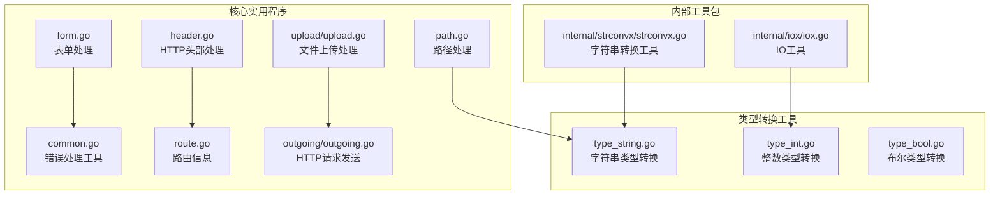
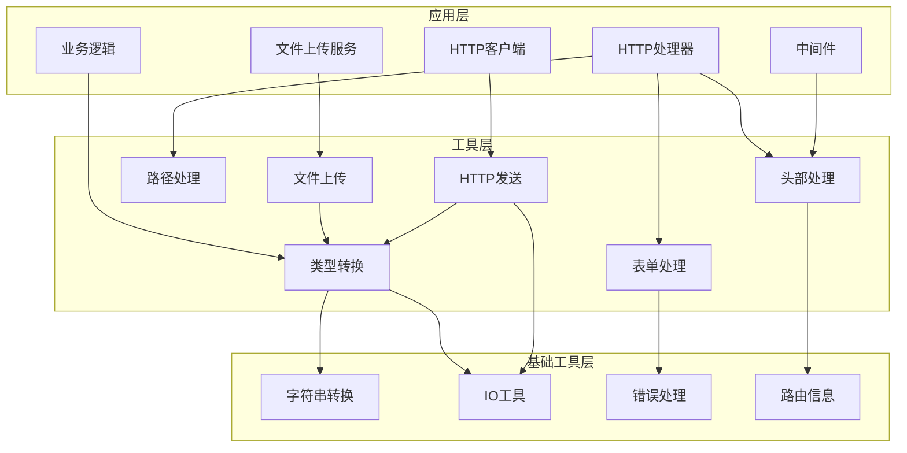
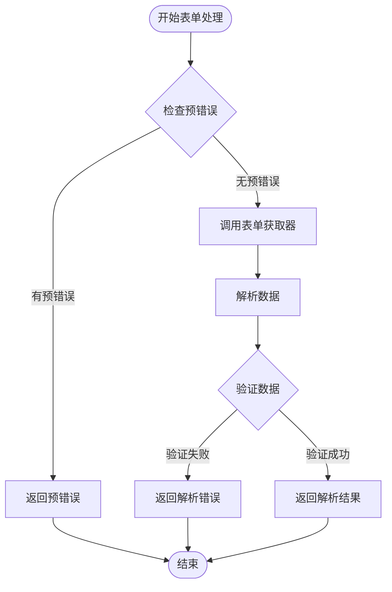
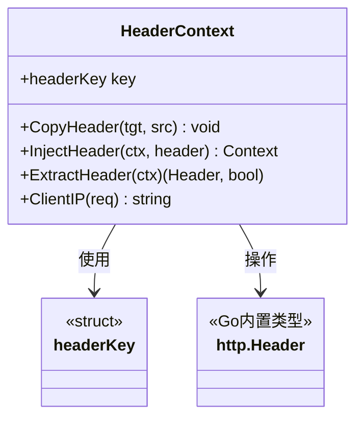
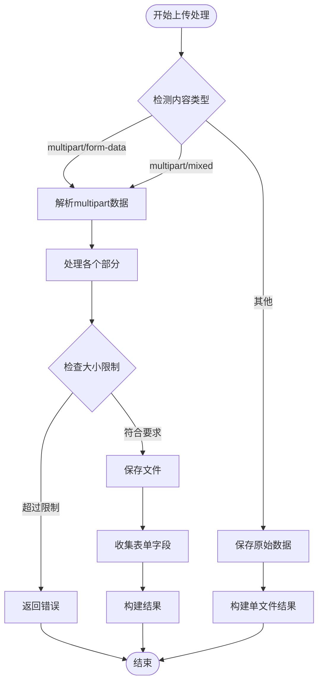
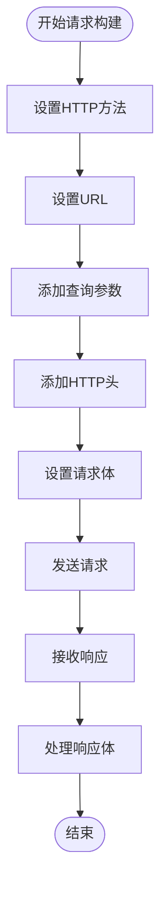
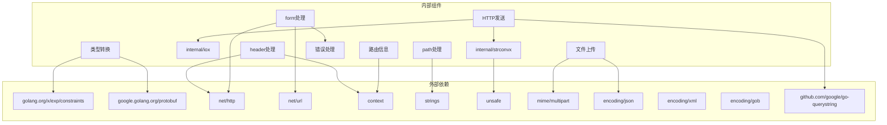

# 内部工具和实用程序

<cite>
**本文档引用的文件**
- [internal/strconvx/strconvx.go](file://internal/strconvx/strconvx.go)
- [internal/iox/iox.go](file://internal/iox/iox.go)
- [form.go](file://form.go)
- [header.go](file://header.go)
- [path.go](file://path.go)
- [common.go](file://common.go)
- [route.go](file://route.go)
- [type_string.go](file://type_string.go)
- [type_int.go](file://type_int.go)
- [type_bool.go](file://type_bool.go)
- [upload/upload.go](file://upload/upload.go)
- [outgoing/outgoing.go](file://outgoing/outgoing.go)
- [form_test.go](file://form_test.go)
</cite>

## 更新摘要
**所做更改**
- 新增文件上传处理工具的完整文档
- 新增HTTP请求发送工具的详细使用指南
- 扩展类型转换工具的Protobuf包装类型支持
- 增强错误处理工具的使用场景说明
- 完善路径处理工具的扩展占位符功能
- 添加路由信息处理的上下文传递机制

## 目录
1. [简介](#简介)
2. [项目结构](#项目结构)
3. [核心组件](#核心组件)
4. [架构概览](#架构概览)
5. [详细组件分析](#详细组件分析)
6. [依赖关系分析](#依赖关系分析)
7. [性能考虑](#性能考虑)
8. [故障排除指南](#故障排除指南)
9. [结论](#结论)

## 简介

本项目包含一组精心设计的内部工具包和实用程序，旨在简化Go应用开发中的常见任务。这些工具涵盖了字符串转换、IO操作、表单处理、HTTP头部处理、路径处理、文件上传处理和HTTP请求发送等多个方面，通过类型安全的泛型设计和高效的内存管理，帮助开发者提高代码质量和开发效率。

主要工具包包括：
- **internal/strconvx**: 高性能字符串与字节切片转换工具
- **internal/iox**: IO流长度检测工具
- **表单处理工具**: 统一的表单数据获取和转换机制
- **HTTP头部工具**: 头部复制、注入和客户端IP解析
- **路径处理工具**: URL路径模板替换功能
- **类型转换工具**: 支持多种数据类型的转换和Protobuf包装类型
- **文件上传处理**: 完整的multipart/form-data解析和文件保存功能
- **HTTP请求发送**: 强大的HTTP客户端请求构建和发送工具

## 项目结构

项目采用模块化设计，将不同功能领域的工具分别组织在独立的文件中：



**图表来源**
- [internal/strconvx/strconvx.go:1-49](file://internal/strconvx/strconvx.go#L1-L49)
- [internal/iox/iox.go:1-72](file://internal/iox/iox.go#L1-L72)
- [form.go:1-80](file://form.go#L1-L80)
- [header.go:1-88](file://header.go#L1-L88)
- [path.go:1-41](file://path.go#L1-L41)
- [common.go:1-51](file://common.go#L1-L51)
- [route.go:1-27](file://route.go#L1-L27)
- [type_string.go:1-88](file://type_string.go#L1-L88)
- [type_int.go:1-305](file://type_int.go#L1-L305)
- [type_bool.go:1-211](file://type_bool.go#L1-L211)
- [upload/upload.go:1-412](file://upload/upload.go#L1-L412)
- [outgoing/outgoing.go:1-1079](file://outgoing/outgoing.go#L1-L1079)

## 核心组件

### 字符串转换工具

**设计目的**: 提供零分配的高性能字符串与字节切片转换，避免常见的内存分配开销。

**核心功能**:
- `StringToBytes`: 将字符串转换为字节切片，无需额外内存分配
- `BytesToString`: 将字节切片转换为字符串，无需额外内存分配
- `FormatUint`: 泛型无符号整数格式化工具
- `GoSanitized`: 生成有效的Go标识符

**实现原理**: 使用Go语言的`unsafe`包直接操作底层内存布局，绕过标准库的内存分配机制。

**章节来源**
- [internal/strconvx/strconvx.go:14-48](file://internal/strconvx/strconvx.go#L14-L48)

### IO工具函数

**设计目的**: 统一处理各种Reader接口的长度查询，支持多种整数类型的长度表示。

**核心功能**:
- `Len`: 检测Reader的长度，支持从`Len()`、`Length()`或`Size()`方法获取长度

**实现原理**: 使用类型断言检查Reader是否实现了标准的长度查询接口，提供统一的长度访问机制。

**章节来源**
- [internal/iox/iox.go:5-71](file://internal/iox/iox.go#L5-L71)

### 表单处理工具

**设计目的**: 提供类型安全的表单数据获取和转换机制，简化HTTP请求参数处理。

**核心功能**:
- `FormGetter[T]`: 泛型表单数据获取器类型
- `GetForm[T]`: 统一的表单数据获取入口
- `FormFromPath`: 从HTTP请求路径参数构建表单数据
- `FormFromMap`: 将映射转换为表单数据格式

**实现原理**: 结合错误处理工具`BreakOnError`，提供链式错误处理和类型安全的数据转换。

**章节来源**
- [form.go:8-79](file://form.go#L8-L79)
- [common.go:5-22](file://common.go#L5-L22)

### HTTP头部处理

**设计目的**: 提供HTTP头部的复制、注入和提取功能，支持上下文传递。

**核心功能**:
- `CopyHeader`: 完整复制源头部到目标头部
- `InjectHeader/ExtractHeader`: 在上下文中存储和检索HTTP头部
- `ClientIP`: 解析客户端真实IP地址

**实现原理**: 使用Go的`context`包和自定义键类型，确保线程安全的头部信息传递。

**章节来源**
- [header.go:10-87](file://header.go#L10-L87)

### 路径处理工具

**设计目的**: 实现URL路径模板的动态替换，支持普通占位符和扩展占位符。

**核心功能**:
- `URLPath`: 替换路径模板中的占位符为实际值

**实现原理**: 分割路径段，识别花括号包围的占位符，支持以"..."结尾的扩展语法。

**章节来源**
- [path.go:5-40](file://path.go#L5-L40)

### 类型转换工具

**设计目的**: 提供完整的数据类型转换和包装机制，支持Protobuf包装类型。

**核心功能**:
- **字符串类型**: `ParseBytesSlice`、`WrapStringSlice`、`UnwrapStringSlice`
- **整数类型**: `FormatInt`、`ParseInt`、`WrapInt32Slice`、`UnwrapInt64Slice`
- **布尔类型**: `FormatBool`、`ParseBool`、`WrapBoolSlice`、`UnwrapBoolSlice`

**实现原理**: 使用Go泛型约束确保类型安全，预分配切片容量优化内存使用。

**章节来源**
- [type_string.go:5-87](file://type_string.go#L5-L87)
- [type_int.go:11-304](file://type_int.go#L11-L304)
- [type_bool.go:10-210](file://type_bool.go#L10-L210)

### 文件上传处理工具

**设计目的**: 提供完整的multipart/form-data解析和文件保存功能，支持多种文件类型和大小限制。

**核心功能**:
- `Handler`: 主要的上传处理类，支持配置选项
- `Result`: 上传结果的结构化表示
- `SavedFile`: 成功保存文件的元数据记录
- `FormField`: 普通表单字段的聚合处理

**实现原理**: 使用Go的`mime/multipart`包解析multipart数据，支持文件和表单字段的分离处理。

**章节来源**
- [upload/upload.go:12-412](file://upload/upload.go#L12-L412)

### HTTP请求发送工具

**设计目的**: 提供强大的HTTP客户端请求构建和发送功能，支持多种内容类型和认证方式。

**核心功能**:
- `Method`: HTTP方法链式配置
- `URLSetter/QuerySetter/HeaderSetter/BodySetter`: 多层次的请求配置
- `Sender/Receiver`: 请求发送和响应接收接口
- `MultipartBody/FormBody`: 多种内容类型的便捷构建

**实现原理**: 采用函数式选项模式和链式调用设计，提供类型安全的请求构建体验。

**章节来源**
- [outgoing/outgoing.go:27-1079](file://outgoing/outgoing.go#L27-L1079)

## 架构概览

系统采用分层架构设计，各工具包职责明确，相互协作：



**图表来源**
- [form.go:18-34](file://form.go#L18-L34)
- [header.go:28-45](file://header.go#L28-L45)
- [path.go:19-40](file://path.go#L19-L40)
- [type_string.go:15-47](file://type_string.go#L15-L47)
- [internal/strconvx/strconvx.go:16-24](file://internal/strconvx/strconvx.go#L16-L24)
- [internal/iox/iox.go:5-71](file://internal/iox/iox.go#L5-L71)
- [common.go:14-22](file://common.go#L14-L22)
- [upload/upload.go:122-152](file://upload/upload.go#L122-L152)
- [outgoing/outgoing.go:147-169](file://outgoing/outgoing.go#L147-L169)

## 详细组件分析

### 错误处理工具

**设计目的**: 提供统一的错误处理模式，支持错误中断和继续执行。

**核心功能**:
- `BreakOnError[T]`: 如果存在预错误则立即返回，否则执行函数
- `ContinueOnError[T]`: 执行函数并根据结果合并错误

**实现原理**: 使用闭包返回函数，实现惰性求值和错误传播控制。

```mermaid
sequenceDiagram
participant Caller as 调用者
participant Break as BreakOnError
participant Func as 目标函数
participant Error as 错误处理
Caller->>Break : 传入预错误
Break->>Break : 检查预错误是否存在
alt 存在预错误
Break->>Caller : 立即返回预错误
else 不存在预错误
Break->>Func : 执行目标函数
Func->>Error : 返回执行结果和错误
Error->>Caller : 返回最终结果
end
```

**图表来源**
- [common.go:14-22](file://common.go#L14-L22)
- [common.go:35-50](file://common.go#L35-L50)

**章节来源**
- [common.go:5-51](file://common.go#L5-L51)

### 表单处理流程

**设计目的**: 提供类型安全的表单数据获取机制，简化HTTP参数处理。

**核心流程**:



**图表来源**
- [form.go:32-34](file://form.go#L32-L34)
- [form.go:18-34](file://form.go#L18-L34)

**章节来源**
- [form.go:18-79](file://form.go#L18-L79)

### 字符串转换性能优化

**设计目的**: 通过零分配转换提升性能，避免标准库的内存分配开销。

**性能特性**:
- 使用`unsafe.Slice`和`unsafe.String`直接操作内存
- 避免创建新的字符串或字节切片副本
- 减少垃圾回收压力

**实现细节**:
- `StringToBytes`: 利用`unsafe.StringData`获取字符串底层数据指针
- `BytesToString`: 使用`unsafe.SliceData`创建字符串视图

**章节来源**
- [internal/strconvx/strconvx.go:14-24](file://internal/strconvx/strconvx.go#L14-L24)

### HTTP头部处理机制

**设计目的**: 提供线程安全的头部信息管理和客户端IP解析。

**核心机制**:



**图表来源**
- [header.go:24-45](file://header.go#L24-L45)
- [header.go:16-87](file://header.go#L16-L87)

**章节来源**
- [header.go:10-87](file://header.go#L10-L87)

### 文件上传处理架构

**设计目的**: 提供完整的文件上传处理能力，支持多种文件类型和安全限制。

**核心架构**:



**图表来源**
- [upload/upload.go:169-194](file://upload/upload.go#L169-L194)
- [upload/upload.go:212-267](file://upload/upload.go#L212-L267)

**章节来源**
- [upload/upload.go:121-412](file://upload/upload.go#L121-L412)

### HTTP请求发送工作流

**设计目的**: 提供直观的HTTP请求构建和发送体验，支持复杂的请求配置。

**核心工作流**:



**图表来源**
- [outgoing/outgoing.go:147-169](file://outgoing/outgoing.go#L147-L169)
- [outgoing/outgoing.go:907-942](file://outgoing/outgoing.go#L907-L942)

**章节来源**
- [outgoing/outgoing.go:27-1079](file://outgoing/outgoing.go#L27-L1079)

## 依赖关系分析

系统采用松耦合设计，各组件间依赖关系清晰：



**图表来源**
- [internal/strconvx/strconvx.go:3-12](file://internal/strconvx/strconvx.go#L3-L12)
- [type_int.go:3-9](file://type_int.go#L3-L9)
- [form.go:3-6](file://form.go#L3-L6)
- [header.go:3-8](file://header.go#L3-L8)
- [path.go:3](file://path.go#L3)
- [upload/upload.go:12-23](file://upload/upload.go#L12-L23)
- [outgoing/outgoing.go:3-25](file://outgoing/outgoing.go#L3-L25)

**章节来源**
- [internal/strconvx/strconvx.go:3-12](file://internal/strconvx/strconvx.go#L3-L12)
- [type_int.go:3-9](file://type_int.go#L3-L9)
- [form.go:3-6](file://form.go#L3-L6)
- [header.go:3-8](file://header.go#L3-L8)
- [path.go:3](file://path.go#L3)
- [upload/upload.go:12-23](file://upload/upload.go#L12-L23)
- [outgoing/outgoing.go:3-25](file://outgoing/outgoing.go#L3-L25)

## 性能考虑

### 内存优化策略

1. **零分配转换**: 字符串与字节切片转换避免额外内存分配
2. **预分配切片**: 类型转换工具预估容量减少扩容开销
3. **类型断言缓存**: IO工具对Reader接口进行一次性检查
4. **流式处理**: 文件上传使用流式读取避免大文件内存占用
5. **连接池复用**: HTTP客户端使用连接池提高网络请求效率

### 并发安全性

- 使用Go原生的`context`包确保头部信息传递的线程安全
- 字符串转换工具通过底层内存操作保证并发安全
- 表单处理工具使用泛型约束确保类型安全
- 文件上传处理使用独立的临时目录避免竞态条件

### 最佳实践建议

1. **优先使用工具包提供的函数**而非手动实现相同功能
2. **注意字符串转换的安全性**，确保输入数据的有效性
3. **合理使用错误处理工具**，避免错误传播链过长
4. **在高并发场景下**充分利用工具包的线程安全特性
5. **配置适当的文件大小限制**防止内存溢出
6. **使用连接池和超时配置**优化HTTP请求性能

## 故障排除指南

### 常见问题及解决方案

**表单数据获取失败**:
- 检查表单键名是否正确
- 验证数据格式是否符合预期
- 使用`GetForm`的错误返回值进行调试

**字符串转换异常**:
- 确保输入数据不是nil
- 检查字符串编码格式
- 注意UTF-8字符的正确处理

**HTTP头部处理错误**:
- 验证上下文是否正确传递
- 检查头部键名大小写一致性
- 确认客户端IP解析的代理配置

**路径处理问题**:
- 验证路径模板格式正确性
- 检查占位符名称与实际值匹配
- 注意扩展占位符的特殊语法

**文件上传错误**:
- 验证上传目录权限和可用空间
- 检查文件大小和总大小限制配置
- 确认multipart边界参数正确性

**HTTP请求发送失败**:
- 验证URL格式和网络连通性
- 检查认证信息和请求头配置
- 确认超时和重试机制设置

**章节来源**
- [form_test.go:10-161](file://form_test.go#L10-L161)

## 结论

本项目的内部工具包和实用程序通过精心设计的架构和高效的实现，为Go应用开发提供了强大而灵活的基础设施。各工具包职责明确、相互协作，既保证了类型安全和线程安全，又优化了性能表现。

**核心优势**:
- **类型安全**: 全面使用Go泛型确保编译时类型检查
- **性能优化**: 零分配转换和预分配策略提升运行效率
- **易用性**: 简洁的API设计降低学习成本
- **可维护性**: 清晰的模块划分便于代码维护和扩展
- **功能完整性**: 覆盖从基础工具到高级功能的完整工具链

**推荐使用场景**:
- 高性能Web服务开发
- Protobuf消息处理
- 复杂的HTTP请求参数解析
- 多种数据类型的转换和验证
- 文件上传和下载处理
- HTTP客户端和服务端开发

通过合理利用这些工具，开发者可以显著提高代码质量，减少重复劳动，并获得更好的性能表现。