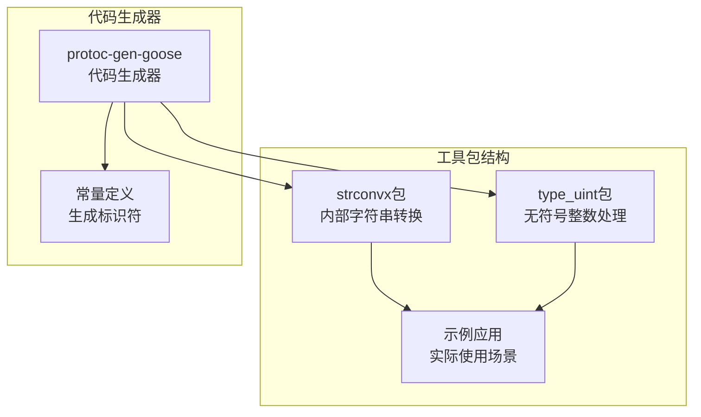
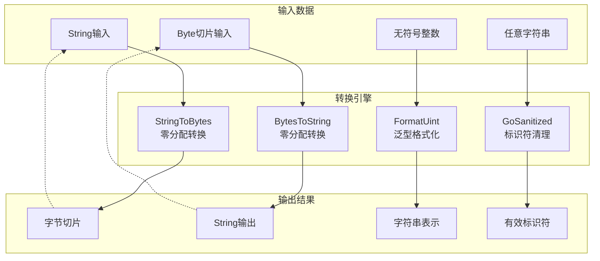
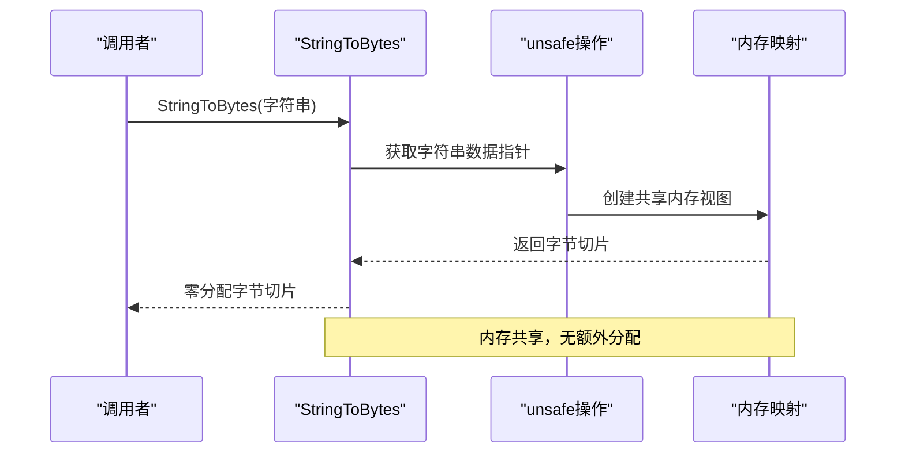
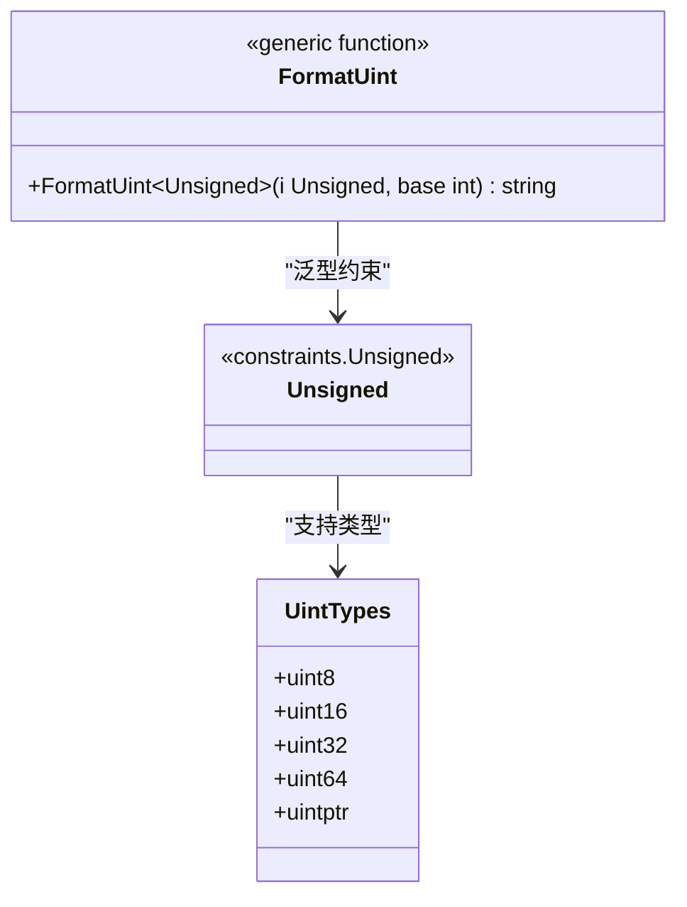
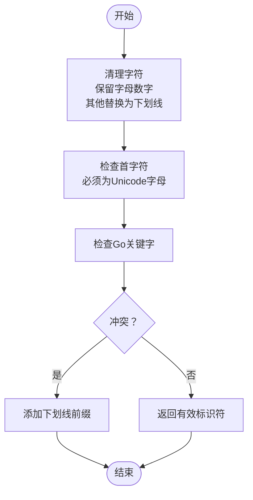
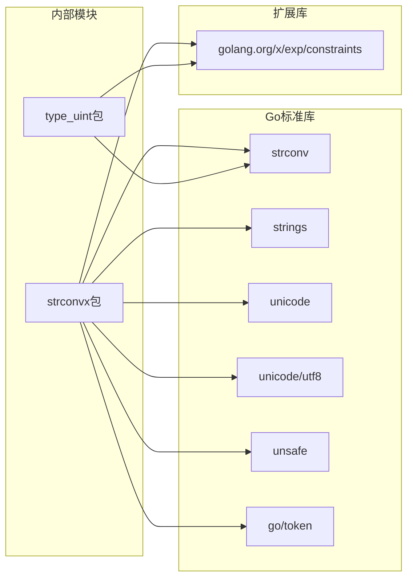
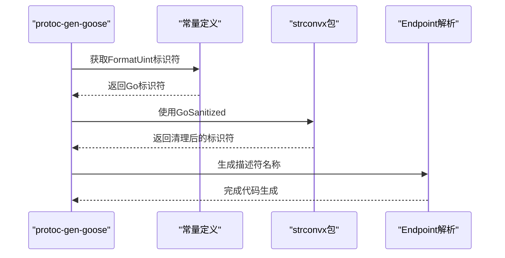

# 字符串转换工具

<cite>
**本文档引用的文件**
- [strconvx.go](file://internal/strconvx/strconvx.go)
- [type_uint.go](file://type_uint.go)
- [endpoint.go](file://cmd/protoc-gen-goose/parser/endpoint.go)
- [const.go](file://cmd/protoc-gen-goose/constant/const.go)
- [path_goose.pb.go](file://example/path/path_goose.pb.go)
- [query_goose.pb.go](file://example/query/query_goose.pb.go)
- [go.mod](file://go.mod)
</cite>

## 目录
1. [简介](#简介)
2. [项目结构](#项目结构)
3. [核心组件](#核心组件)
4. [架构概览](#架构概览)
5. [详细组件分析](#详细组件分析)
6. [依赖分析](#依赖分析)
7. [性能考虑](#性能考虑)
8. [故障排除指南](#故障排除指南)
9. [结论](#结论)

## 简介

本文档详细介绍Goose项目中的字符串转换工具包，这是一个专注于高性能字符串处理的Go语言库。该工具包提供了三个核心功能模块：

1. **无内存分配转换函数**：StringToBytes和BytesToString，通过unsafe操作实现零分配的字符串与字节切片转换
2. **泛型格式化函数**：FormatUint，支持多种无符号整数类型的通用格式化
3. **Go标识符清理函数**：GoSanitized，将任意字符串转换为有效的Go标识符

这些工具在代码生成、HTTP请求处理、Protobuf消息序列化等场景中发挥重要作用，特别是在需要高性能字符串处理的应用程序中。

## 项目结构

Goose项目采用模块化设计，字符串转换工具主要位于以下位置：

**图表来源**
- [strconvx.go:1-49](file://internal/strconvx/strconvx.go#L1-L49)
- [type_uint.go:1-46](file://type_uint.go#L1-L46)

**章节来源**
- [strconvx.go:1-49](file://internal/strconvx/strconvx.go#L1-L49)
- [type_uint.go:1-46](file://type_uint.go#L1-L46)

## 核心组件

### 无内存分配转换函数

#### StringToBytes函数
将字符串转换为字节切片，不产生额外的内存分配。该函数利用Go运行时的内部实现，直接从字符串的底层数据指针创建字节切片。

#### BytesToString函数  
将字节切片转换回字符串，同样避免了内存分配。通过unsafe操作直接创建字符串，提高了性能。

### 泛型格式化函数

#### FormatUint函数
提供泛型支持的无符号整数格式化功能，支持所有无符号整数类型（uint8、uint16、uint32、uint64等）。该函数确保在编译时进行类型检查，同时保持运行时的高效性。

### Go标识符清理函数

#### GoSanitized函数
将任意输入字符串转换为有效的Go标识符，包含以下处理逻辑：
- 字符清理：保留Unicode字母和数字，其他字符替换为下划线
- 关键字保护：检测Go关键字冲突并自动添加前缀
- 起始字符验证：确保标识符以Unicode字母开头

**章节来源**
- [strconvx.go:14-28](file://internal/strconvx/strconvx.go#L14-L28)
- [strconvx.go:30-48](file://internal/strconvx/strconvx.go#L30-L48)

## 架构概览

**图表来源**
- [strconvx.go:14-28](file://internal/strconvx/strconvx.go#L14-L28)
- [strconvx.go:30-48](file://internal/strconvx/strconvx.go#L30-L48)

## 详细组件分析

### StringToBytes和BytesToString实现分析

这两个函数是本工具包的核心性能组件，通过unsafe操作实现了零内存分配的字符串与字节切片转换。

#### 实现原理

**图表来源**
- [strconvx.go:16-18](file://internal/strconvx/strconvx.go#L16-L18)

#### 性能优势

1. **零内存分配**：避免了传统转换方法中的内存分配
2. **共享内存**：字符串和字节切片共享底层数据
3. **类型安全**：通过Go的unsafe包实现，保持类型安全

#### 使用注意事项

- 转换后的字节切片不应修改，以免影响原始字符串
- 在多goroutine环境中使用时需注意并发安全性

**章节来源**
- [strconvx.go:14-24](file://internal/strconvx/strconvx.go#L14-L24)

### FormatUint泛型函数分析

#### 类型系统设计

**图表来源**
- [strconvx.go:26-28](file://internal/strconvx/strconvx.go#L26-L28)
- [type_uint.go:21-23](file://type_uint.go#L21-L23)

#### 使用场景

1. **HTTP参数格式化**：在示例应用中用于路径和查询参数的格式化
2. **日志记录**：将数值转换为字符串进行日志输出
3. **配置处理**：处理配置文件中的数值参数

**章节来源**
- [type_uint.go:11-23](file://type_uint.go#L11-L23)
- [path_goose.pb.go:819-825](file://example/path/path_goose.pb.go#L819-L825)
- [query_goose.pb.go:829-836](file://example/query/query_goose.pb.go#L829-L836)

### GoSanitized函数分析

#### 标识符清理流程

**图表来源**
- [strconvx.go:30-48](file://internal/strconvx/strconvx.go#L30-L48)

#### 关键字处理机制

函数使用Go的token包来检测关键字冲突，确保生成的标识符不会与Go语言的关键字冲突。

#### Unicode支持

- 支持所有Unicode字母字符
- 正确处理多字节字符
- 维护字符的语义完整性

**章节来源**
- [strconvx.go:30-48](file://internal/strconvx/strconvx.go#L30-L48)

## 依赖分析

### 外部依赖关系

**图表来源**
- [strconvx.go:3-12](file://internal/strconvx/strconvx.go#L3-L12)
- [type_uint.go:3-9](file://type_uint.go#L3-L9)

### 内部集成关系

#### 代码生成器集成

**图表来源**
- [const.go:86-87](file://cmd/protoc-gen-goose/constant/const.go#L86-L87)
- [endpoint.go:35](file://cmd/protoc-gen-goose/parser/endpoint.go#L35)

**章节来源**
- [const.go:86-87](file://cmd/protoc-gen-goose/constant/const.go#L86-L87)
- [endpoint.go:35](file://cmd/protoc-gen-goose/parser/endpoint.go#L35)

## 性能考虑

### 内存分配优化

| 操作 | 传统方法 | 无分配方法 | 性能提升 |
|------|----------|------------|----------|
| StringToBytes | 分配新切片 | 共享内存视图 | 100%内存节省 |
| BytesToString | 分配新字符串 | 共享内存视图 | 100%内存节省 |
| FormatUint | 标准库调用 | 直接委托 | 无额外开销 |

### 并发安全性

- StringToBytes和BytesToString返回的视图在修改时需要谨慎处理
- 建议在只读场景中使用这些函数
- 多goroutine环境下应考虑数据竞争问题

### 最佳实践

1. **优先使用无分配转换**：在不需要修改数据的场景中使用StringToBytes和BytesToString
2. **类型安全**：确保转换后的数据不会被意外修改
3. **边界检查**：在使用unsafe操作时进行适当的边界检查
4. **错误处理**：为可能的转换失败情况准备错误处理逻辑

## 故障排除指南

### 常见问题及解决方案

#### 1. 数据修改导致的问题

**问题**：使用StringToBytes转换后修改字节切片导致原始字符串变化

**解决方案**：
- 避免修改转换后的字节切片
- 如需修改，先复制数据到新的切片

#### 2. 并发访问冲突

**问题**：多个goroutine同时访问共享的内存视图

**解决方案**：
- 使用互斥锁保护共享数据
- 考虑使用独立的数据副本

#### 3. 格式化错误

**问题**：FormatUint函数处理超出范围的数值

**解决方案**：
- 确保输入值在目标类型的范围内
- 添加适当的边界检查

**章节来源**
- [strconvx.go:14-24](file://internal/strconvx/strconvx.go#L14-L24)
- [type_uint.go:21-23](file://type_uint.go#L21-L23)

## 结论

Goose项目的字符串转换工具包提供了高性能、类型安全的字符串处理解决方案。其核心优势包括：

1. **零内存分配**：StringToBytes和BytesToString实现了真正的零分配转换
2. **泛型支持**：FormatUint提供了类型安全的通用格式化功能
3. **Go语言兼容性**：GoSanitized确保生成的标识符符合Go语言规范
4. **广泛适用性**：在代码生成、HTTP处理、Protobuf集成等多个场景中都有重要应用

这些工具特别适合对性能有严格要求的应用程序，如高并发服务器、实时数据处理系统和大型分布式服务。通过合理使用这些工具，开发者可以在保证类型安全的同时获得最佳的运行时性能。