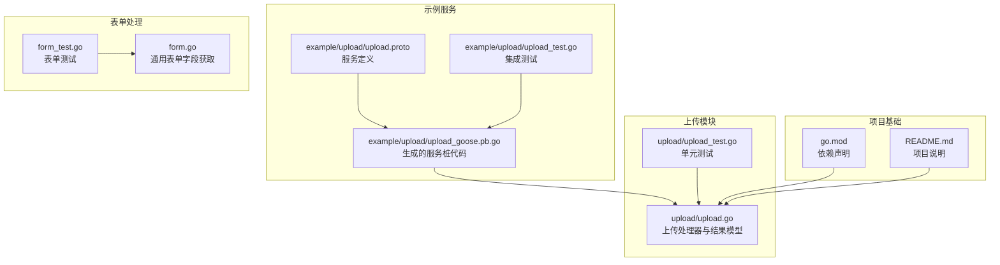
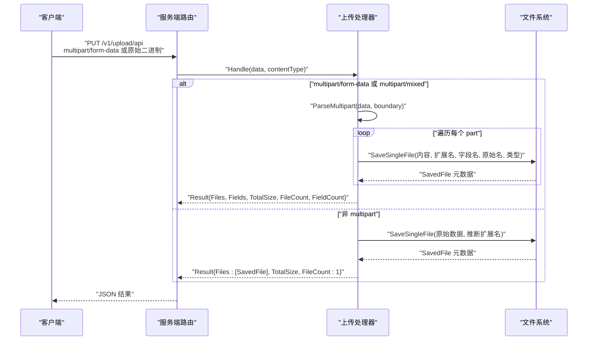
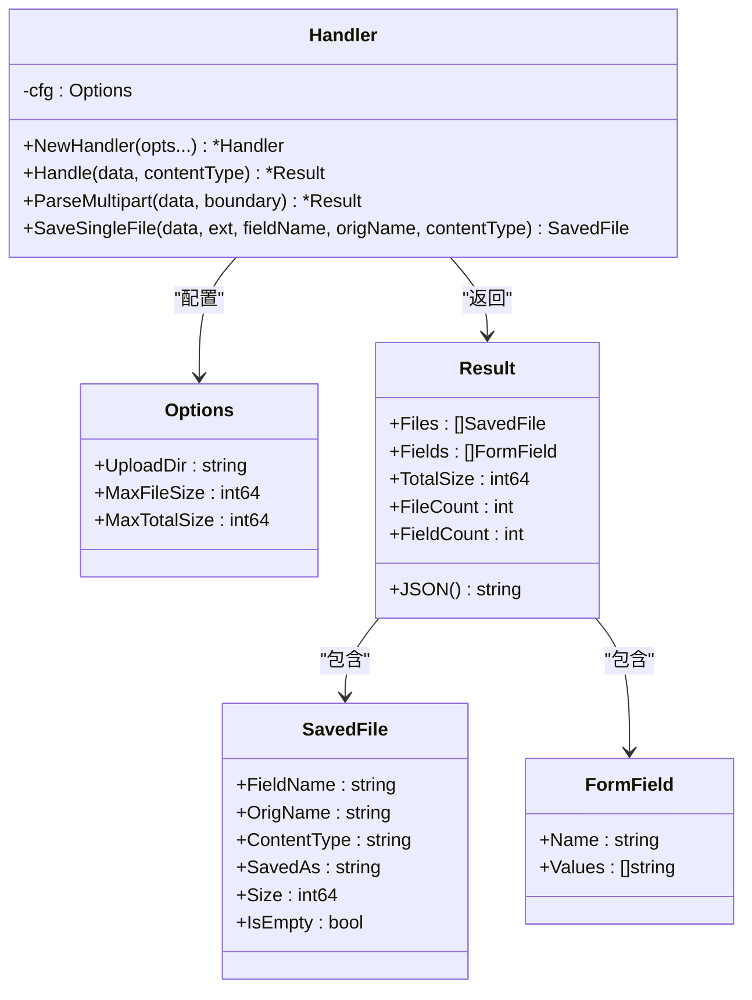
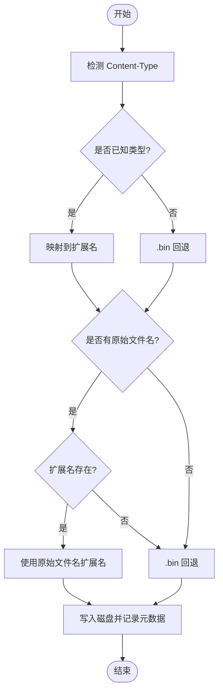
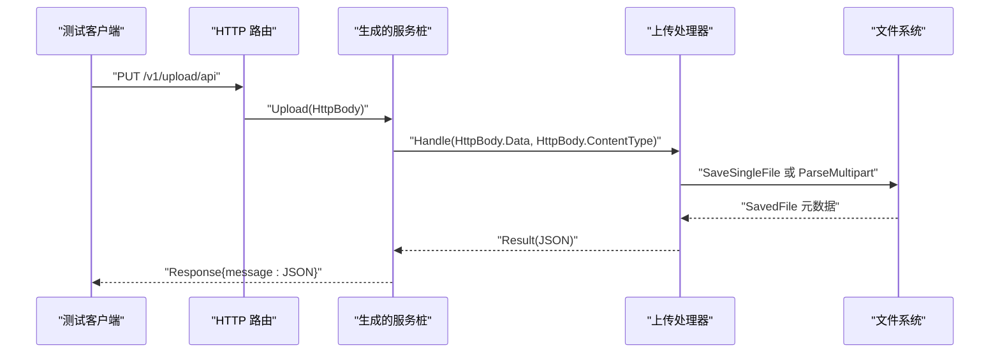
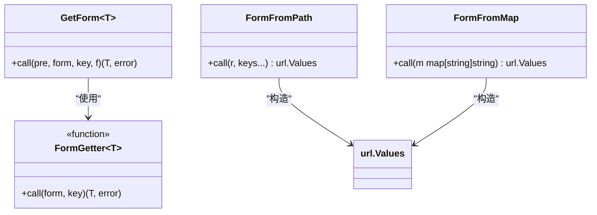
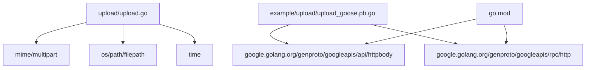

# 文件上传处理

<cite>
**本文引用的文件列表**
- [upload.go](file://upload/upload.go)
- [upload_test.go](file://upload/upload_test.go)
- [upload.proto](file://example/upload/upload.proto)
- [upload_goose.pb.go](file://example/upload/upload_goose.pb.go)
- [upload_test.go](file://example/upload/upload_test.go)
- [form.go](file://form.go)
- [form_test.go](file://form_test.go)
- [go.mod](file://go.mod)
- [README.md](file://README.md)
</cite>

## 目录
1. [简介](#简介)
2. [项目结构](#项目结构)
3. [核心组件](#核心组件)
4. [架构总览](#架构总览)
5. [详细组件分析](#详细组件分析)
6. [依赖关系分析](#依赖关系分析)
7. [性能考虑](#性能考虑)
8. [故障排除指南](#故障排除指南)
9. [结论](#结论)
10. [附录](#附录)

## 简介
本文件上传处理工具基于 Go 标准库的 multipart/form-data 解析能力，提供完整的文件上传、表单字段收集、大小限制、扩展名推断与磁盘保存等功能。该工具通过统一的处理器接口接收原始字节数据与 Content-Type 头信息，自动识别 multipart 或原始二进制数据，并将文件安全地写入配置的上传目录。同时，工具内置错误处理与边界检查，确保在高并发场景下的稳定性与安全性。

## 项目结构
- 核心上传逻辑位于 `upload/` 目录，包含上传处理器、结果聚合、扩展名推断与文件保存等关键实现。
- 示例服务位于 `example/upload/`，展示了如何在 HTTP 服务中集成上传处理器，并提供多种请求体映射方式（原始 HttpBody、嵌入 HttpBody、RPC HttpRequest）。
- 表单数据处理位于 `form.go`，提供通用的表单字段获取与类型转换工具，便于与上传服务结合使用。
- 单元测试覆盖了扩展名推断、格式化字节大小、处理器初始化、单文件与多文件上传、边界与大小限制等场景。

**图表来源**
- [upload.go:1-412](file://upload/upload.go#L1-L412)
- [upload_test.go:1-668](file://upload/upload_test.go#L1-L668)
- [upload.proto:1-35](file://example/upload/upload.proto#L1-L35)
- [upload_goose.pb.go:1-427](file://example/upload/upload_goose.pb.go#L1-L427)
- [upload_test.go:1-181](file://example/upload/upload_test.go#L1-L181)
- [form.go:1-80](file://form.go#L1-L80)
- [form_test.go:1-161](file://form_test.go#L1-L161)
- [go.mod:1-14](file://go.mod#L1-L14)
- [README.md:1-125](file://README.md#L1-L125)

**章节来源**
- [upload.go:1-412](file://upload/upload.go#L1-L412)
- [upload_test.go:1-668](file://upload/upload_test.go#L1-L668)
- [upload.proto:1-35](file://example/upload/upload.proto#L1-L35)
- [upload_goose.pb.go:1-427](file://example/upload/upload_goose.pb.go#L1-L427)
- [upload_test.go:1-181](file://example/upload/upload_test.go#L1-L181)
- [form.go:1-80](file://form.go#L1-L80)
- [form_test.go:1-161](file://form_test.go#L1-L161)
- [go.mod:1-14](file://go.mod#L1-L14)
- [README.md:1-125](file://README.md#L1-L125)

## 核心组件
- 上传处理器（Handler）：负责解析 multipart/form-data 或原始二进制数据，保存文件到磁盘，并统计结果。
- 结果聚合（Result）：包含已保存文件列表、表单字段、总大小、文件数量与字段数量等信息。
- 扩展名推断：根据 Content-Type 或原始文件名推断合适的文件扩展名。
- 功能选项（Options）：支持设置上传目录、单文件大小上限、总上传大小上限。
- 错误类型：包含文件过大、总大小超限、缺失 boundary 等错误。

**章节来源**
- [upload.go:69-152](file://upload/upload.go#L69-L152)
- [upload.go:51-67](file://upload/upload.go#L51-L67)
- [upload.go:325-391](file://upload/upload.go#L325-L391)

## 架构总览
上传处理的整体流程如下：
- 服务层接收 HTTP 请求，提取原始字节数据与 Content-Type。
- 上传处理器根据 Content-Type 判断是否为 multipart 类型。
- 若为 multipart：解析 boundary，逐个读取 part，区分文件与普通表单字段，按需保存文件并收集字段。
- 若为非 multipart：按 Content-Type 推断扩展名，将整个请求体作为单一文件保存。
- 返回结果对象，包含文件元数据、总大小与计数等信息。

**图表来源**
- [upload.go:154-194](file://upload/upload.go#L154-L194)
- [upload.go:196-267](file://upload/upload.go#L196-L267)
- [upload.go:269-303](file://upload/upload.go#L269-L303)

## 详细组件分析

### 上传处理器（Handler）
- 初始化：通过 WithUploadDir、WithMaxFileSize、WithMaxTotalSize 设置配置；默认上传目录为 "./uploads"，若不存在则自动创建。
- 处理入口：Handle(data, contentType) 根据 Content-Type 自动选择 multipart 解析或单文件保存。
- 解析逻辑：ParseMultipart 逐 part 读取，支持 per-file 与 total size 限制；文件 part 保存到磁盘并记录元数据；普通表单字段按名称聚合为数组。
- 单文件保存：SaveSingleFile 写入带时间戳的唯一文件名，避免冲突；支持大小限制与空文件标记。

**图表来源**
- [upload.go:121-152](file://upload/upload.go#L121-L152)
- [upload.go:69-77](file://upload/upload.go#L69-L77)
- [upload.go:51-58](file://upload/upload.go#L51-L58)
- [upload.go:34-42](file://upload/upload.go#L34-L42)
- [upload.go:44-49](file://upload/upload.go#L44-L49)

**章节来源**
- [upload.go:121-152](file://upload/upload.go#L121-L152)
- [upload.go:154-194](file://upload/upload.go#L154-L194)
- [upload.go:196-267](file://upload/upload.go#L196-L267)
- [upload.go:269-303](file://upload/upload.go#L269-L303)

### 扩展名推断与文件保存
- Content-Type 推断：根据常见 MIME 类型映射到扩展名，未知类型回退为 ".bin"。
- 文件名回退：当 Content-Type 为二进制流时，优先使用原始文件名的扩展名。
- 唯一命名：保存文件采用纳秒级时间戳作为前缀，避免同名冲突。

**图表来源**
- [upload.go:325-391](file://upload/upload.go#L325-L391)
- [upload.go:269-303](file://upload/upload.go#L269-L303)

**章节来源**
- [upload.go:325-391](file://upload/upload.go#L325-L391)
- [upload.go:269-303](file://upload/upload.go#L269-L303)

### 示例服务集成
- 服务定义：通过 proto 定义三个上传端点，分别映射不同的请求体结构。
- 生成代码：使用 Goose 插件生成服务桩代码，包含路由挂载、请求解码、响应编码与错误处理。
- 集成测试：在测试中启动 HTTP 服务器，调用不同端点，验证上传处理器的行为与结果。

**图表来源**
- [upload.proto:9-30](file://example/upload/upload.proto#L9-L30)
- [upload_goose.pb.go:25-48](file://example/upload/upload_goose.pb.go#L25-L48)
- [upload_goose.pb.go:60-83](file://example/upload/upload_goose.pb.go#L60-L83)
- [upload_test.go:115-134](file://example/upload/upload_test.go#L115-L134)

**章节来源**
- [upload.proto:1-35](file://example/upload/upload.proto#L1-L35)
- [upload_goose.pb.go:1-427](file://example/upload/upload_goose.pb.go#L1-L427)
- [upload_test.go:1-181](file://example/upload/upload_test.go#L1-L181)

### 表单字段处理
- 通用表单获取：FormGetter 定义泛型表单字段获取函数类型，GetForm 提供链式错误传播与提前返回。
- 路径参数转表单：FormFromPath 将 HTTP 路径参数转换为 url.Values，便于与表单处理一致。
- 映射转表单：FormFromMap 将字符串映射转换为 url.Values。

**图表来源**
- [form.go:8-34](file://form.go#L8-L34)
- [form.go:36-79](file://form.go#L36-L79)

**章节来源**
- [form.go:1-80](file://form.go#L1-L80)
- [form_test.go:1-161](file://form_test.go#L1-L161)

## 依赖关系分析
- 上传模块依赖 Go 标准库的 mime、multipart、os、path/filepath、time 等包，用于解析、文件系统操作与时间戳生成。
- 示例服务依赖 Google 的 HTTP/REST 相关 proto（google.api.httpbody、google.rpc.http），并通过 Goose 插件生成服务桩代码。
- 项目整体依赖 Go 1.23+，并引入 google.golang.org/genproto 相关包以支持 HTTP/REST 映射。

**图表来源**
- [upload.go:12-23](file://upload/upload.go#L12-L23)
- [upload_goose.pb.go:5-16](file://example/upload/upload_goose.pb.go#L5-L16)
- [go.mod:5-13](file://go.mod#L5-L13)

**章节来源**
- [upload.go:12-23](file://upload/upload.go#L12-L23)
- [upload_goose.pb.go:5-16](file://example/upload/upload_goose.pb.go#L5-L16)
- [go.mod:1-14](file://go.mod#L1-L14)

## 性能考虑
- 流式解析：使用 multipart.NewReader 逐 part 读取，避免一次性加载整个请求体到内存。
- 限额控制：通过 io.LimitReader 对单文件大小进行预检查，防止超出限制的数据进入后续处理。
- 唯一命名：基于纳秒时间戳生成文件名，降低磁盘写入冲突概率。
- 目录创建：首次使用时自动创建上传目录，避免运行时因权限或路径问题导致失败。

[本节为通用性能讨论，无需特定文件来源]

## 故障排除指南
- 缺失 boundary：当 Content-Type 为 multipart/form-data 但缺少 boundary 参数时，会返回缺失 boundary 错误。
- 文件过大：单文件超过 MaxFileSize 或总上传超过 MaxTotalSize 时，返回相应错误。
- 未知 Content-Type：非 multipart 的请求将按 Content-Type 推断扩展名保存为单一文件。
- 空文件：保存空内容的文件时，IsEmpty 标记为 true，Size 为 0。
- 目录权限：确保上传目录具有写权限，否则创建目录或写入文件会失败。

**章节来源**
- [upload.go:25-32](file://upload/upload.go#L25-L32)
- [upload.go:172-178](file://upload/upload.go#L172-L178)
- [upload.go:180-183](file://upload/upload.go#L180-L183)
- [upload_test.go:322-332](file://upload/upload_test.go#L322-L332)
- [upload_test.go:279-285](file://upload/upload_test.go#L279-L285)
- [upload_test.go:489-503](file://upload/upload_test.go#L489-L503)
- [upload_test.go:505-518](file://upload/upload_test.go#L505-L518)

## 结论
该文件上传处理工具提供了简洁而强大的 multipart/form-data 解析与文件保存能力，具备完善的大小限制、扩展名推断与错误处理机制。通过 Goose 插件生成的服务桩代码，开发者可以快速将上传功能集成到 HTTP 服务中，并在多种请求体映射场景下保持一致的行为。配合表单字段处理工具，可轻松实现复杂的表单与文件混合上传场景。

[本节为总结性内容，无需特定文件来源]

## 附录

### 使用示例与最佳实践
- 单文件上传：适用于直接上传二进制文件或通过 Content-Type 推断扩展名的场景。建议设置合理的 MaxTotalSize 以限制整体请求体积。
- 多文件上传：使用 multipart/form-data，支持同一字段名的多个文件独立保存，适合批量上传图片、文档等资源。
- 断点续传：当前实现未内置断点续传机制。可在应用层通过自定义字段（如分片序号、校验和）与外部存储（如对象存储）实现，上传处理器仅负责接收与保存文件内容。
- 安全检查：建议在业务层增加文件类型白名单、内容检测与访问控制，避免恶意文件上传。
- 并发上传：上传处理器本身不强制并发控制，建议在服务层通过中间件或限流策略控制并发连接数与速率，避免磁盘与网络成为瓶颈。

[本节为概念性指导，无需特定文件来源]