# 表单处理工具

<cite>
**本文档引用的文件**
- [form.go](file://form.go)
- [form_test.go](file://form_test.go)
- [common.go](file://common.go)
- [type_bool.go](file://type_bool.go)
- [type_int.go](file://type_int.go)
- [type_uint.go](file://type_uint.go)
- [type_float.go](file://type_float.go)
- [type_string.go](file://type_string.go)
- [validate.go](file://validate.go)
- [upload/upload.go](file://upload/upload.go)
- [server/decoder.go](file://server/decoder.go)
- [client/decoder.go](file://client/decoder.go)
- [example/upload/upload_test.go](file://example/upload/upload_test.go)
- [example/query/query_test.go](file://example/query/query_test.go)
- [example/body/body_test.go](file://example/body/body_test.go)
- [type_test.go](file://type_test.go)
</cite>

## 目录
1. [简介](#简介)
2. [项目结构](#项目结构)
3. [核心组件](#核心组件)
4. [架构概览](#架构概览)
5. [详细组件分析](#详细组件分析)
6. [依赖关系分析](#依赖关系分析)
7. [性能考虑](#性能考虑)
8. [故障排除指南](#故障排除指南)
9. [结论](#结论)
10. [附录](#附录)

## 简介

表单处理工具是 Goose 框架中的核心组件，提供了全面的 HTTP 请求数据处理能力。该工具集支持多种数据格式的解析、验证和处理，包括：

- **多格式支持**：multipart 表单、URL 编码表单、JSON 表单、原始二进制数据
- **类型转换**：自动进行各种 Go 基本类型的转换和包装
- **验证机制**：内置的请求验证和错误处理
- **文件上传**：完整的文件上传处理和存储管理
- **协议兼容**：支持 Google RPC HTTP 规范和标准 HTTP 协议

该工具集的设计目标是提供统一、类型安全且易于使用的表单处理接口，简化 Web 应用程序中的数据处理逻辑。

## 项目结构

表单处理工具采用模块化设计，主要包含以下核心模块：

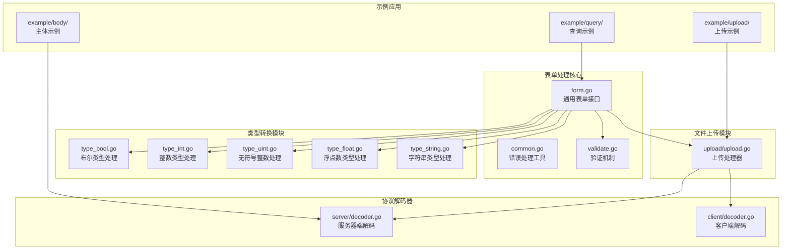

**图表来源**
- [form.go:1-80](file://form.go#L1-L80)
- [common.go:1-51](file://common.go#L1-L51)
- [validate.go:1-57](file://validate.go#L1-L57)
- [upload/upload.go:1-412](file://upload/upload.go#L1-L412)

**章节来源**
- [form.go:1-80](file://form.go#L1-L80)
- [common.go:1-51](file://common.go#L1-L51)
- [validate.go:1-57](file://validate.go#L1-L57)

## 核心组件

### 通用表单接口

表单处理工具的核心是 `FormGetter` 类型和 `GetForm` 函数，它们提供了类型安全的表单数据访问机制。

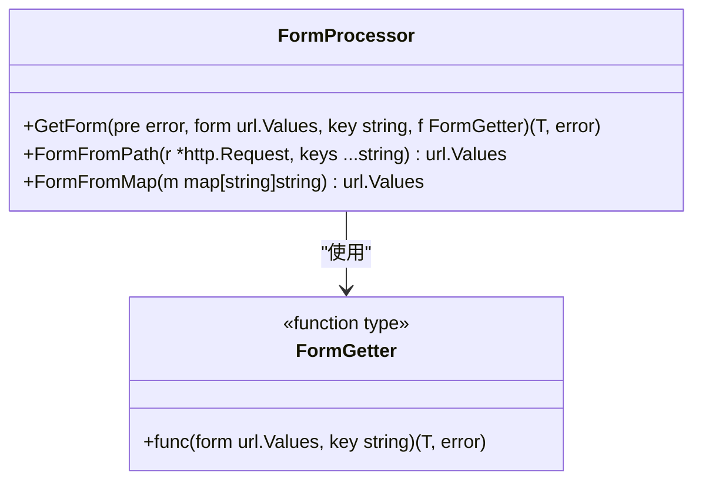

**图表来源**
- [form.go:8-34](file://form.go#L8-L34)

### 错误处理机制

工具集提供了两种主要的错误处理策略：立即中断和继续执行。

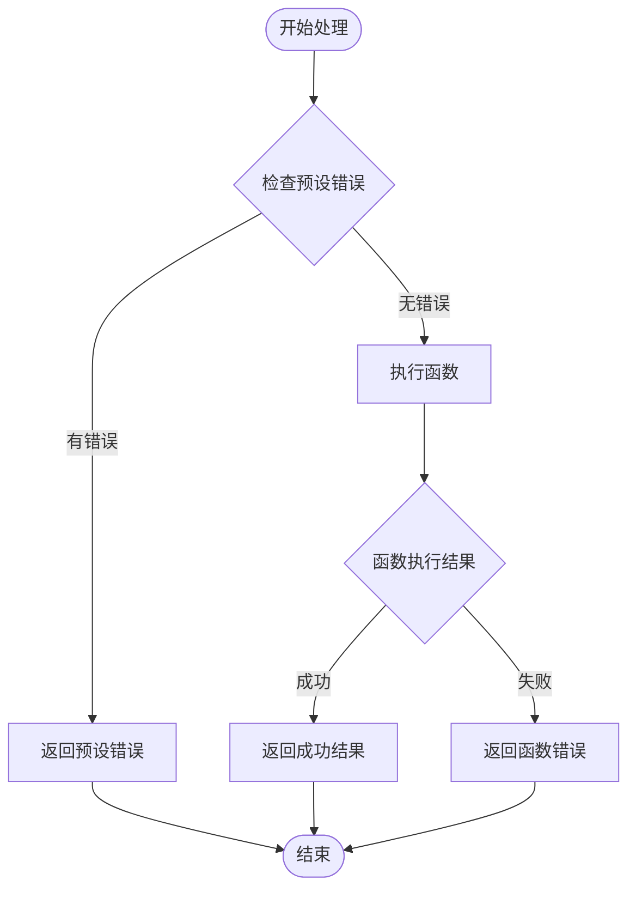

**图表来源**
- [common.go:14-22](file://common.go#L14-L22)

**章节来源**
- [form.go:8-80](file://form.go#L8-L80)
- [common.go:5-51](file://common.go#L5-L51)

## 架构概览

表单处理工具的整体架构采用分层设计，从底层的数据解析到上层的应用逻辑都有清晰的职责分离。

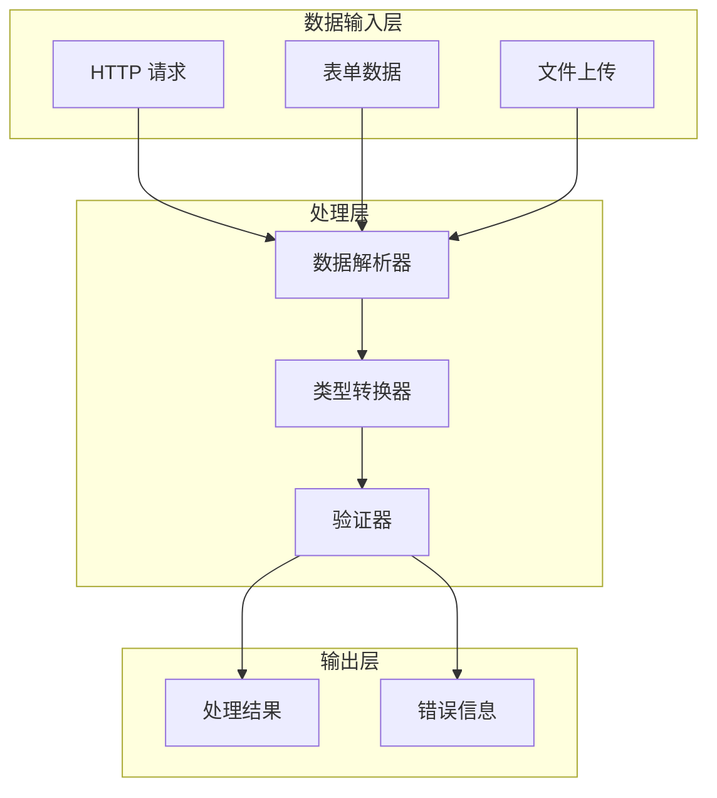

**图表来源**
- [server/decoder.go:39-61](file://server/decoder.go#L39-L61)
- [upload/upload.go:154-194](file://upload/upload.go#L154-L194)

## 详细组件分析

### 文件上传处理系统

文件上传处理是表单处理工具的重要组成部分，支持多种文件上传场景和复杂的元数据管理。

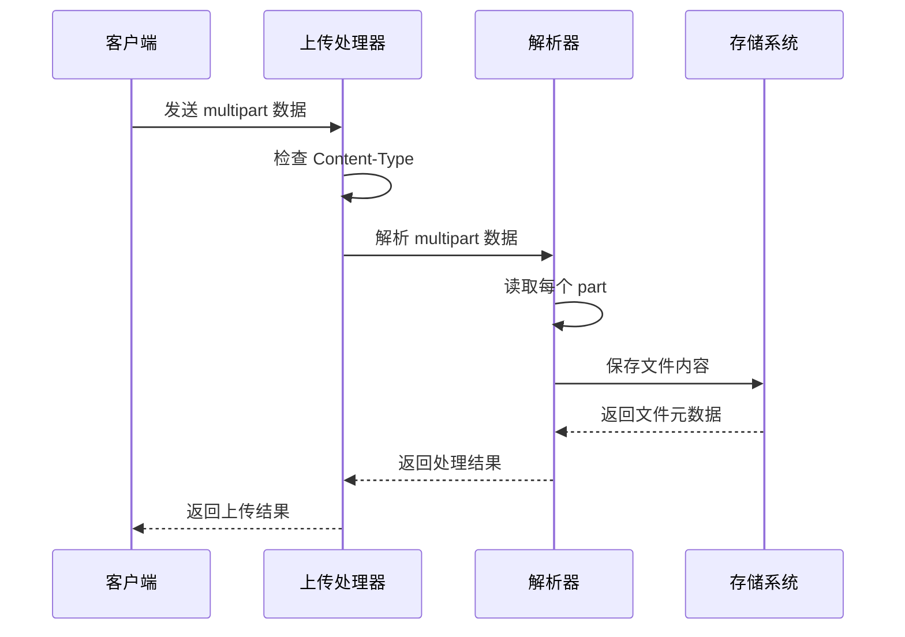

**图表来源**
- [upload/upload.go:154-267](file://upload/upload.go#L154-L267)

#### 核心特性

1. **多格式支持**：自动识别 multipart/form-data 和 multipart/mixed 格式
2. **大小限制**：支持单文件大小和总上传大小限制
3. **扩展名推断**：根据 Content-Type 或文件名推断文件扩展名
4. **元数据记录**：完整记录文件上传的元数据信息

#### 数据结构设计

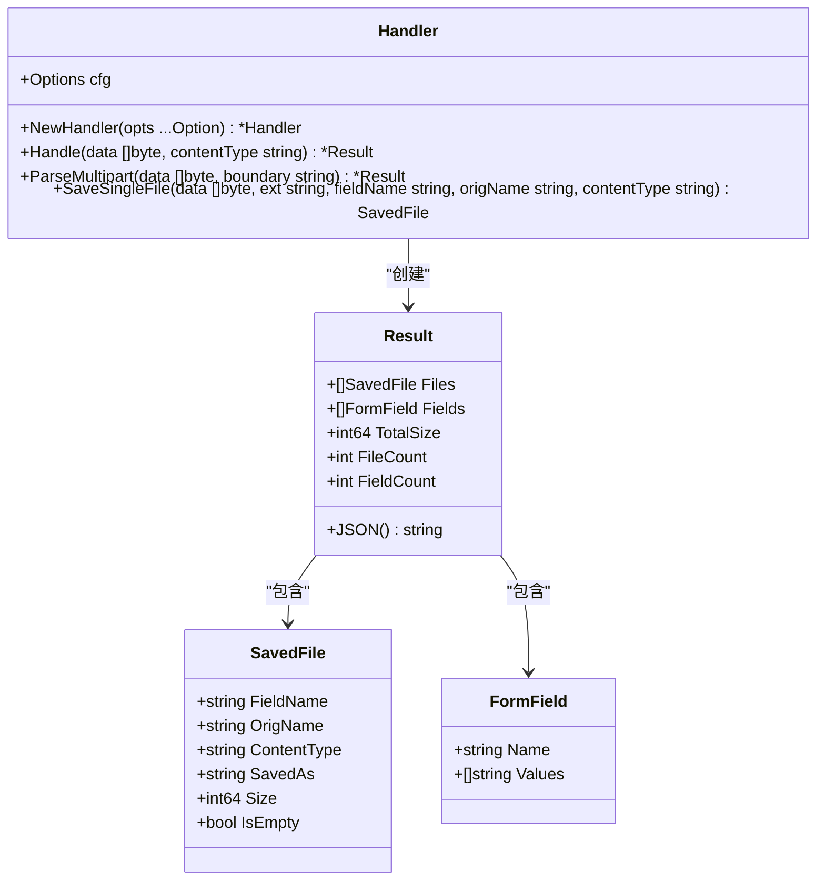

**图表来源**
- [upload/upload.go:51-152](file://upload/upload.go#L51-L152)

**章节来源**
- [upload/upload.go:1-412](file://upload/upload.go#L1-L412)

### 类型转换系统

表单处理工具提供了完整的类型转换系统，支持所有 Go 基本类型的安全转换。

#### 布尔类型处理

布尔类型转换支持多种输入格式，包括标准布尔值和数字表示。

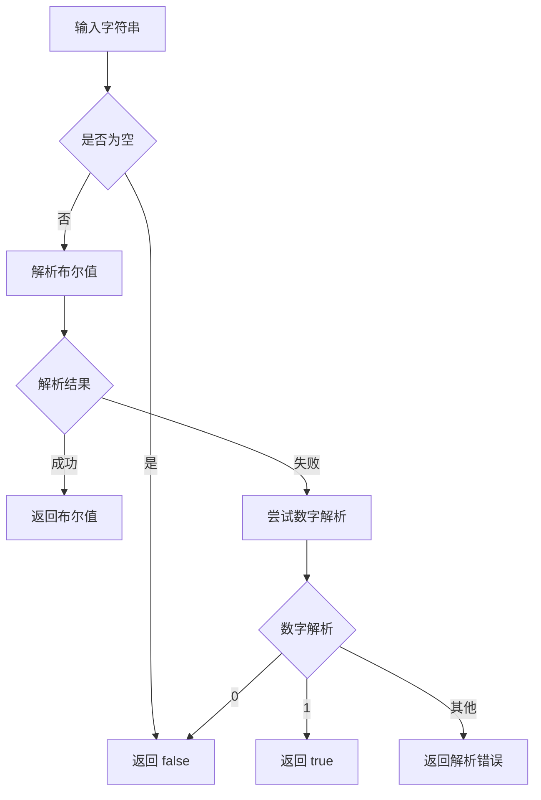

**图表来源**
- [type_bool.go:82-97](file://type_bool.go#L82-L97)

#### 数字类型处理

数字类型转换支持多种进制和位宽配置，确保数据的精确转换。

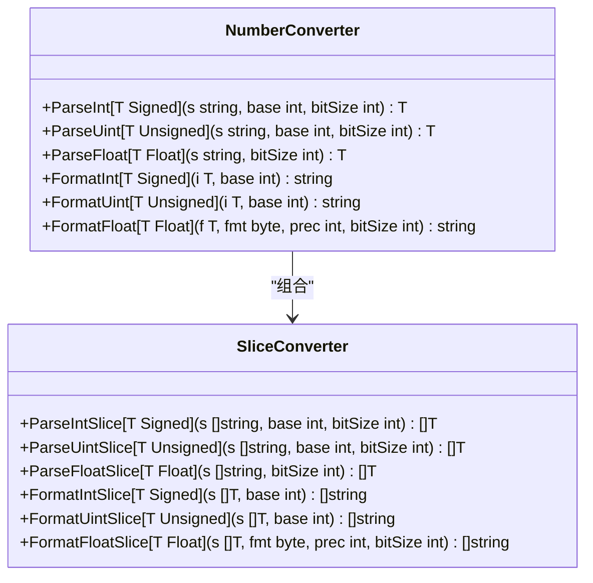

**图表来源**
- [type_int.go:48-92](file://type_int.go#L48-L92)
- [type_uint.go:48-92](file://type_uint.go#L48-L92)
- [type_float.go:51-93](file://type_float.go#L51-L93)

**章节来源**
- [type_bool.go:1-211](file://type_bool.go#L1-L211)
- [type_int.go:1-305](file://type_int.go#L1-L305)
- [type_uint.go:1-305](file://type_uint.go#L1-L305)
- [type_float.go:1-308](file://type_float.go#L1-L308)
- [type_string.go:1-88](file://type_string.go#L1-L88)

### 验证机制

表单处理工具内置了灵活的验证机制，支持快速验证和深度验证两种模式。

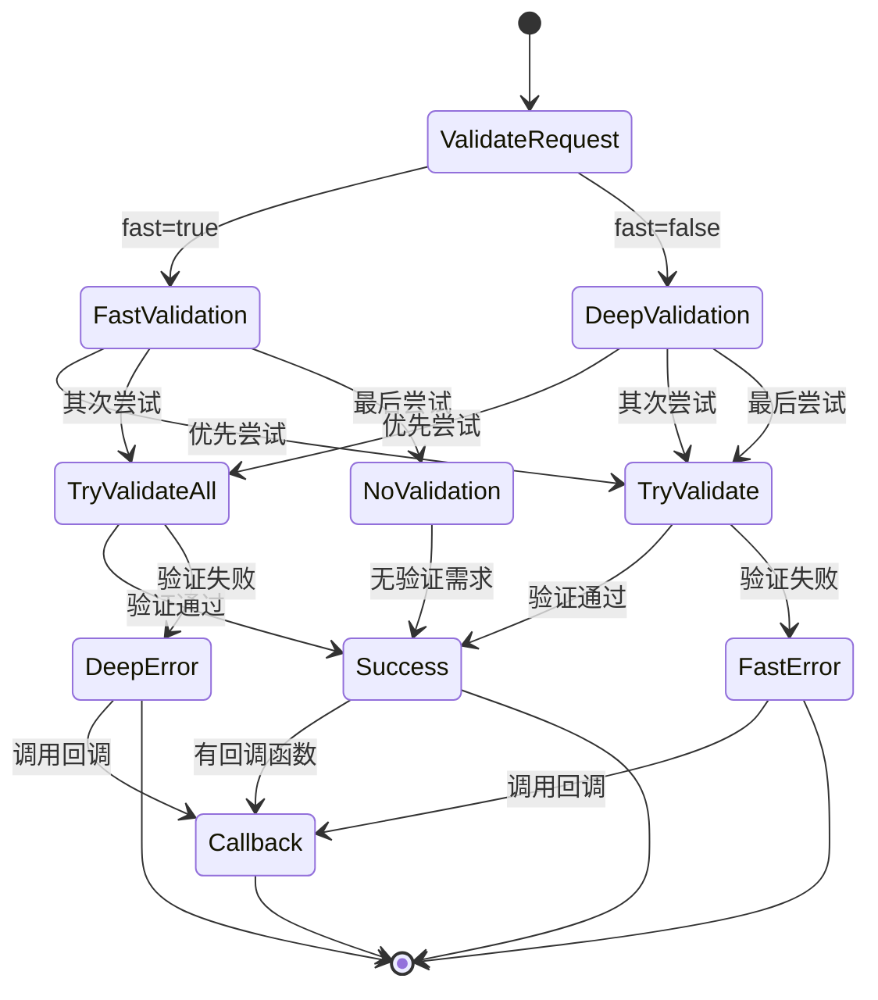

**图表来源**
- [validate.go:29-56](file://validate.go#L29-L56)

**章节来源**
- [validate.go:1-57](file://validate.go#L1-L57)

### 协议解码器

表单处理工具提供了多种协议的解码支持，包括标准 HTTP 和 Google RPC 规范。

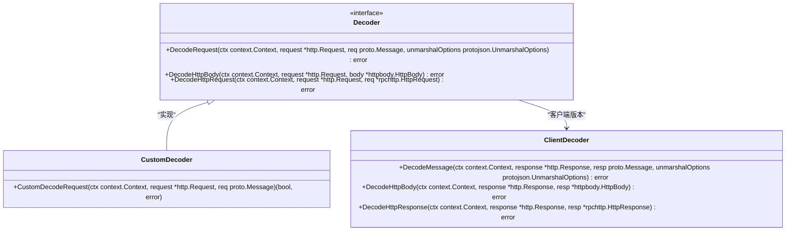

**图表来源**
- [server/decoder.go:15-61](file://server/decoder.go#L15-L61)
- [client/decoder.go:16-88](file://client/decoder.go#L16-L88)

**章节来源**
- [server/decoder.go:1-112](file://server/decoder.go#L1-L112)
- [client/decoder.go:1-89](file://client/decoder.go#L1-L89)

## 依赖关系分析

表单处理工具的依赖关系相对简单，主要依赖于标准库和 Google Protobuf 库。

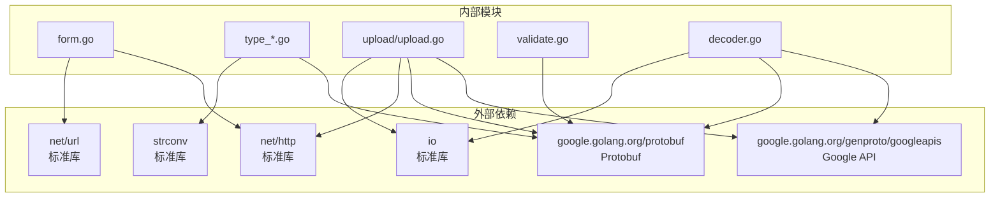

**图表来源**
- [form.go:3-6](file://form.go#L3-L6)
- [upload/upload.go:12-23](file://upload/upload.go#L12-L23)

**章节来源**
- [form.go:1-80](file://form.go#L1-L80)
- [upload/upload.go:1-412](file://upload/upload.go#L1-L412)

## 性能考虑

表单处理工具在设计时充分考虑了性能优化：

### 内存管理
- 使用 `bytes.Reader` 和 `io.LimitReader` 进行流式处理
- 避免不必要的数据复制和缓冲区分配
- 合理的切片容量预分配

### 并发安全
- 所有公共函数都是并发安全的
- 使用 `sync.Pool` 复用临时对象
- 避免全局状态共享

### 错误处理优化
- 提供 `ContinueOnError` 功能，允许累积多个错误
- 使用 `errors.Join` 组合错误信息
- 及时的资源清理和关闭

## 故障排除指南

### 常见问题及解决方案

#### 文件上传失败
1. **检查文件大小限制**：确认 `MaxFileSize` 和 `MaxTotalSize` 设置
2. **验证边界完整性**：确保 multipart 请求包含正确的 boundary
3. **检查权限问题**：确认上传目录可写且有足够空间

#### 类型转换错误
1. **验证输入格式**：确保字符串符合目标类型的格式要求
2. **检查位宽限制**：确认数值在目标类型的范围内
3. **处理空值情况**：注意键不存在时的默认值行为

#### 验证失败
1. **启用详细日志**：使用回调函数获取详细的验证错误信息
2. **检查 Protobuf 定义**：确认消息定义符合验证要求
3. **验证快速/深度模式**：根据需要选择合适的验证级别

**章节来源**
- [upload/upload.go:25-32](file://upload/upload.go#L25-L32)
- [validate.go:9-11](file://validate.go#L9-L11)

## 结论

表单处理工具提供了全面而强大的 HTTP 请求数据处理能力。其设计特点包括：

1. **类型安全**：通过泛型和接口确保编译时类型安全
2. **灵活扩展**：支持自定义解码器和验证回调
3. **高性能**：优化的内存使用和流式处理
4. **易用性**：简洁的 API 设计和丰富的示例

该工具集适用于各种 Web 应用场景，从简单的表单处理到复杂的文件上传和数据验证需求都能有效支持。

## 附录

### 使用示例

#### 基本表单处理
```go
// 获取布尔值
boolVal, err := GetBool[bool](form, "active")

// 获取整数值
intVal, err := GetInt[int64](form, "age")

// 获取字符串值
stringVal, err := GetString(form, "name")
```

#### 文件上传处理
```go
handler, err := NewHandler(
    WithUploadDir("./uploads"),
    WithMaxFileSize(10<<20), // 10MB
    WithMaxTotalSize(50<<20), // 50MB
)

result, err := handler.Handle(data, contentType)
```

#### 自定义验证
```go
err := ValidateRequest(ctx, request, false, func(ctx context.Context, err error) {
    log.Printf("验证失败: %v", err)
})
```

### 最佳实践

1. **错误处理**：始终检查和处理返回的错误
2. **资源管理**：及时关闭文件句柄和网络连接
3. **输入验证**：在业务逻辑前进行必要的数据验证
4. **性能优化**：合理设置大小限制和超时时间
5. **安全性**：验证用户输入，防止恶意文件上传