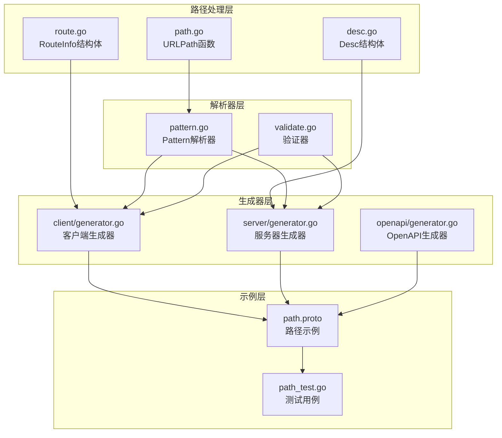
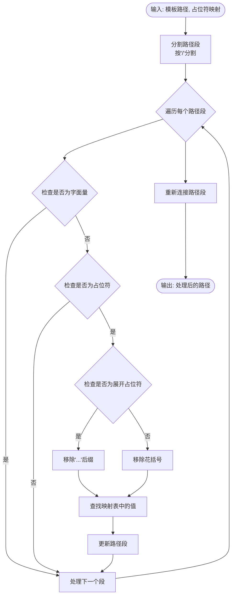
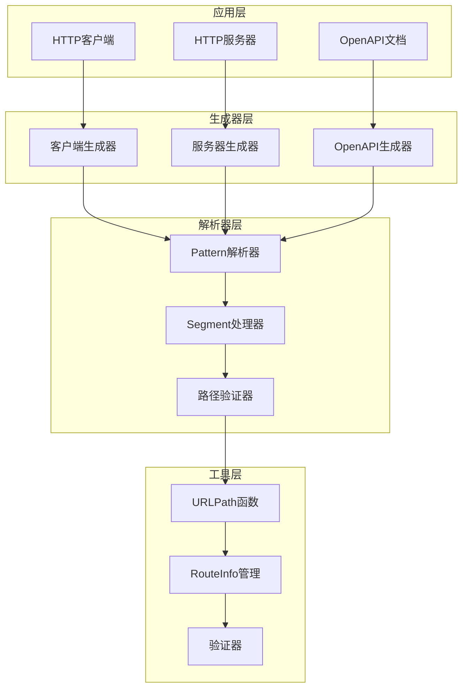
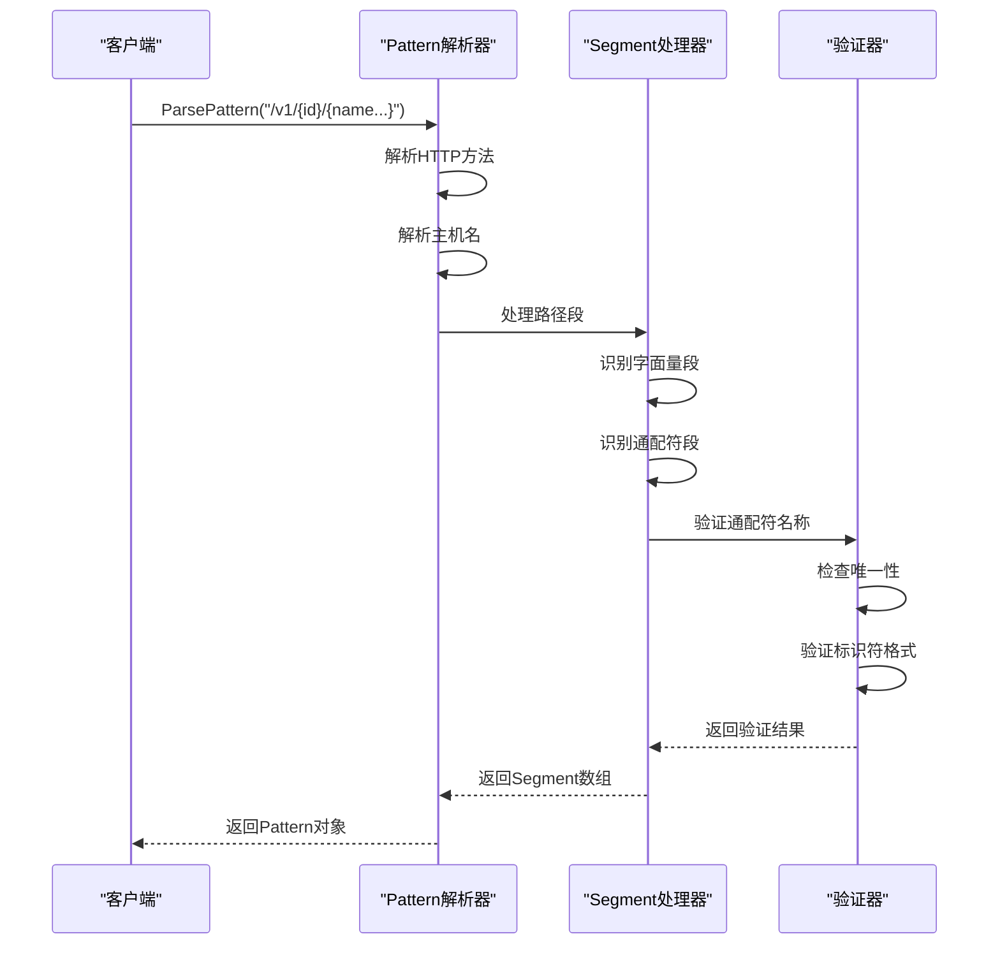
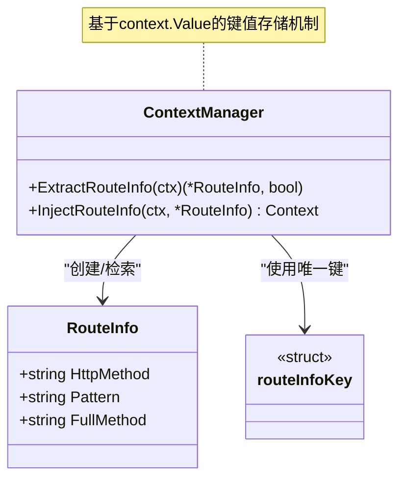
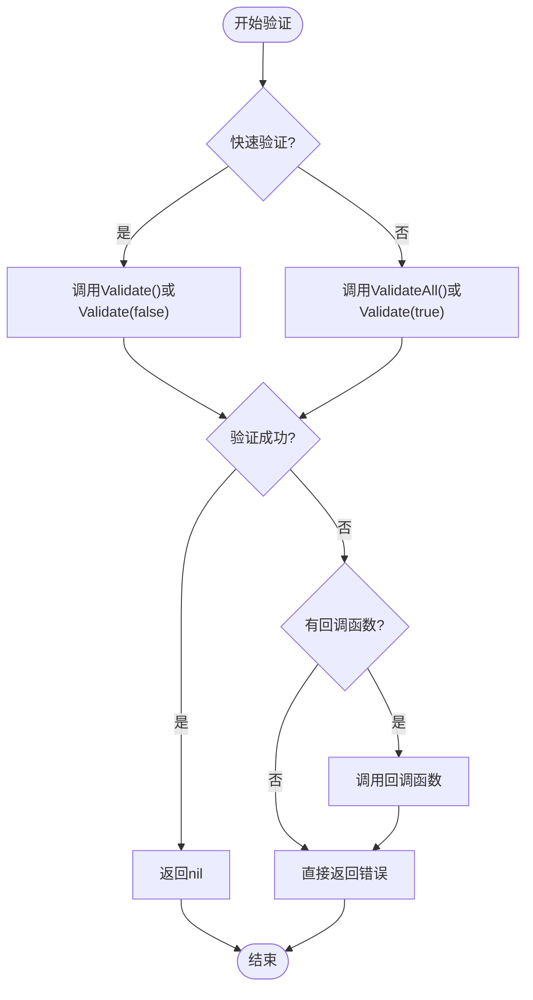
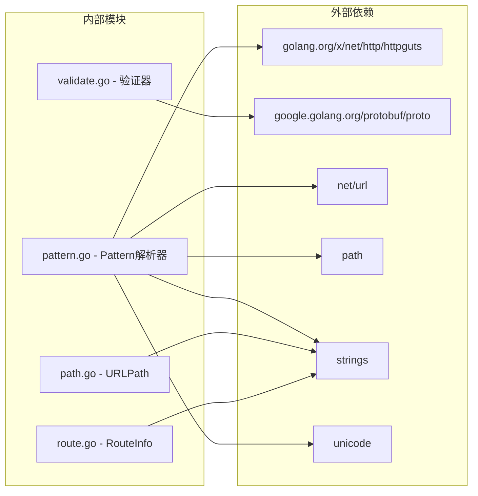
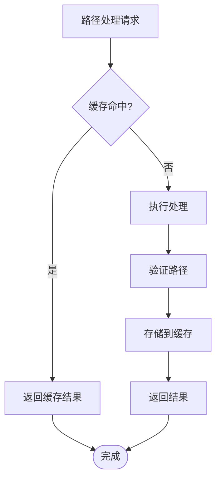

# 路径处理工具

<cite>
**本文档引用的文件**
- [path.go](file://path.go)
- [route.go](file://route.go)
- [common.go](file://common.go)
- [desc.go](file://desc.go)
- [validate.go](file://validate.go)
- [pattern.go](file://cmd/protoc-gen-goose/parser/pattern.go)
- [generator.go](file://cmd/protoc-gen-goose/client/generator.go)
- [generator.go](file://cmd/protoc-gen-goose/server/generator.go)
- [generator.go](file://cmd/protoc-gen-goose/openapi/generator.go)
- [path.proto](file://example/path/path.proto)
- [path_test.go](file://example/path/path_test.go)
</cite>

## 目录
1. [简介](#简介)
2. [项目结构](#项目结构)
3. [核心组件](#核心组件)
4. [架构概览](#架构概览)
5. [详细组件分析](#详细组件分析)
6. [依赖分析](#依赖分析)
7. [性能考虑](#性能考虑)
8. [故障排除指南](#故障排除指南)
9. [结论](#结论)
10. [附录](#附录)

## 简介

路径处理工具是 Goose 框架的核心功能模块，专门用于处理 HTTP 请求路径的解析、构建、验证和规范化。该工具集提供了完整的路径处理解决方案，包括：

- **URL 路径模板解析**：支持花括号占位符的路径模板处理
- **路径参数提取**：从请求路径中提取动态参数
- **查询字符串处理**：处理 URL 查询参数
- **路径模板匹配**：基于模式的路径匹配机制
- **路径规范化**：确保路径格式的一致性和安全性

该工具在路由匹配、静态资源服务、API 路由等场景中发挥着关键作用，为开发者提供了灵活而强大的路径处理能力。

## 项目结构

Goose 项目的路径处理功能分布在多个层次中，形成了一个完整的处理链路：



**图表来源**
- [path.go:1-41](file://path.go#L1-L41)
- [route.go:1-27](file://route.go#L1-L27)
- [pattern.go:1-244](file://cmd/protoc-gen-goose/parser/pattern.go#L1-L244)

**章节来源**
- [path.go:1-41](file://path.go#L1-L41)
- [route.go:1-27](file://route.go#L1-L27)
- [pattern.go:1-244](file://cmd/protoc-gen-goose/parser/pattern.go#L1-L244)

## 核心组件

### URLPath 函数

URLPath 是路径处理的核心函数，负责将模板路径中的占位符替换为实际值：



**图表来源**
- [path.go:19-40](file://path.go#L19-L40)

### RouteInfo 结构体

RouteInfo 提供了路由信息的上下文存储和检索机制：

```mermaid
classDiagram
class RouteInfo {
+string HttpMethod
+string Pattern
+string FullMethod
}
class Context {
+value interface{}
+WithValue(key, val) Context
+Value(key) interface{}
}
class routeInfoKey {
<<struct>>
}
RouteInfo --> Context : "通过上下文存储"
Context --> routeInfoKey : "使用键进行检索"
```

**图表来源**
- [route.go:7-26](file://route.go#L7-L26)

**章节来源**
- [path.go:5-40](file://path.go#L5-L40)
- [route.go:7-26](file://route.go#L7-L26)

## 架构概览

Goose 的路径处理架构采用分层设计，从底层的路径解析到上层的应用集成：



**图表来源**
- [generator.go:11-68](file://cmd/protoc-gen-goose/client/generator.go#L11-L68)
- [generator.go:13-81](file://cmd/protoc-gen-goose/server/generator.go#L13-L81)
- [pattern.go:64-177](file://cmd/protoc-gen-goose/parser/pattern.go#L64-L177)

## 详细组件分析

### 路径解析器 (Pattern Parser)

路径解析器是整个路径处理系统的核心，负责将字符串形式的路径模式转换为可匹配的数据结构：



**图表来源**
- [pattern.go:81-177](file://cmd/protoc-gen-goose/parser/pattern.go#L81-L177)

#### Segment 类型系统

Segment 定义了三种不同类型的路径段匹配模式：

| Segment类型 | 描述 | 示例 | 用途 |
|-----------|------|------|-----|
| 字面量段 | 匹配固定文本 | `"users"` | 静态路径部分 |
| 单段通配符 | 匹配单个路径段 | `"{id}"` | 动态ID参数 |
| 多段通配符 | 匹配剩余所有段 | `"{path...}"` | 文件路径或目录 |

**章节来源**
- [pattern.go:40-62](file://cmd/protoc-gen-goose/parser/pattern.go#L40-L62)
- [pattern.go:140-175](file://cmd/protoc-gen-goose/parser/pattern.go#L140-L175)

### 路由信息管理

RouteInfo 提供了线程安全的路由信息存储和检索机制：



**图表来源**
- [route.go:17-26](file://route.go#L17-L26)

**章节来源**
- [route.go:17-26](file://route.go#L17-L26)
- [desc.go:3-5](file://desc.go#L3-L5)

### 错误处理和验证

Goose 提供了完善的错误处理和验证机制：



**图表来源**
- [validate.go:29-56](file://validate.go#L29-L56)

**章节来源**
- [validate.go:29-56](file://validate.go#L29-L56)
- [common.go:14-50](file://common.go#L14-L50)

## 依赖分析

路径处理系统的依赖关系相对简单，主要依赖于标准库和 Google 的 Protocol Buffers 库：



**图表来源**
- [pattern.go:3-12](file://cmd/protoc-gen-goose/parser/pattern.go#L3-L12)
- [validate.go:3-7](file://validate.go#L3-L7)

**章节来源**
- [pattern.go:3-12](file://cmd/protoc-gen-goose/parser/pattern.go#L3-L12)
- [validate.go:3-7](file://validate.go#L3-L7)

## 性能考虑

### 时间复杂度分析

- **URLPath 函数**：O(n*m)，其中 n 是路径段数量，m 是占位符查找操作
- **Pattern 解析**：O(k)，k 为路径字符串长度
- **RouteInfo 操作**：O(1)，基于 context.Value 的常数时间访问

### 内存优化策略

1. **字符串池化**：避免重复分配相同的字符串常量
2. **延迟初始化**：仅在需要时创建复杂的解析结构
3. **切片重用**：复用临时的字符串切片以减少 GC 压力

### 缓存机制



## 故障排除指南

### 常见问题及解决方案

#### 路径解析错误

**问题**：`invalid method "INVALID"`
**原因**：HTTP 方法不符合 RFC 标准
**解决**：检查 HTTP 方法是否为标准方法之一

**问题**：`bad wildcard segment (must start with '{')`
**原因**：通配符段格式不正确
**解决**：确保通配符以 `{` 开始，以 `}` 结束

#### 路径匹配失败

**问题**：非 CONNECT 方法的路径包含清理前缀
**解决**：使用 `cleanPath` 函数清理路径

#### 上下文路由信息缺失

**问题**：`ExtractRouteInfo` 返回 `nil`
**解决**：确保在处理请求前调用 `InjectRouteInfo`

**章节来源**
- [pattern.go:97-122](file://cmd/protoc-gen-goose/parser/pattern.go#L97-L122)
- [pattern.go:146-151](file://cmd/protoc-gen-goose/parser/pattern.go#L146-L151)

## 结论

Goose 的路径处理工具提供了一个完整、高效且易于使用的路径处理解决方案。其设计特点包括：

1. **模块化设计**：清晰的分层架构便于维护和扩展
2. **类型安全**：强类型的结构体确保运行时安全
3. **性能优化**：高效的算法和内存管理策略
4. **错误处理**：完善的错误处理和恢复机制
5. **可扩展性**：灵活的接口设计支持自定义扩展

该工具集在实际应用中表现出色，能够满足各种复杂的路径处理需求，是构建高性能 Web 应用的理想选择。

## 附录

### 使用示例

#### 基本路径模板处理

```go
// 基本占位符替换
result := URLPath("/users/{id}", map[string]string{"id": "123"})
// 结果: "/users/123"

// 展开占位符处理
result = URLPath("/files/{path...}", map[string]string{"path": "dir/file.txt"})
// 结果: "/files/dir/file.txt"
```

#### 路由信息管理

```go
// 注入路由信息
ctx := InjectRouteInfo(context.Background(), &RouteInfo{
    HttpMethod: "GET",
    Pattern: "/v1/users/{id}",
    FullMethod: "/com.example.UserService/GetUser",
})

// 提取路由信息
info, ok := ExtractRouteInfo(ctx)
if ok {
    // 使用路由信息
}
```

### 最佳实践

1. **路径规范化**：始终使用 `cleanPath` 函数清理用户输入的路径
2. **错误处理**：在关键路径处理点添加适当的错误检查
3. **性能监控**：对高频路径处理操作进行性能基准测试
4. **安全考虑**：验证用户输入的路径参数，防止路径遍历攻击
5. **日志记录**：记录重要的路径处理事件以便调试和审计