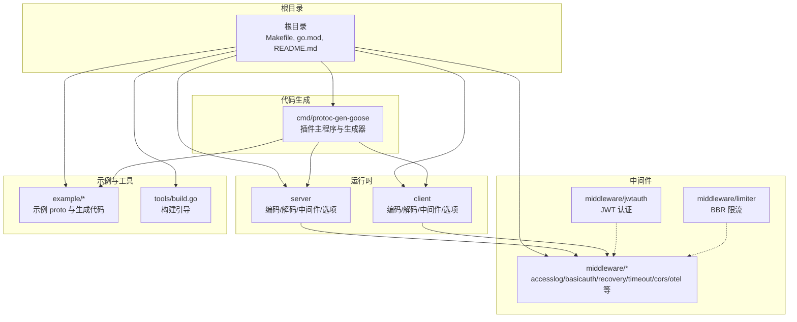
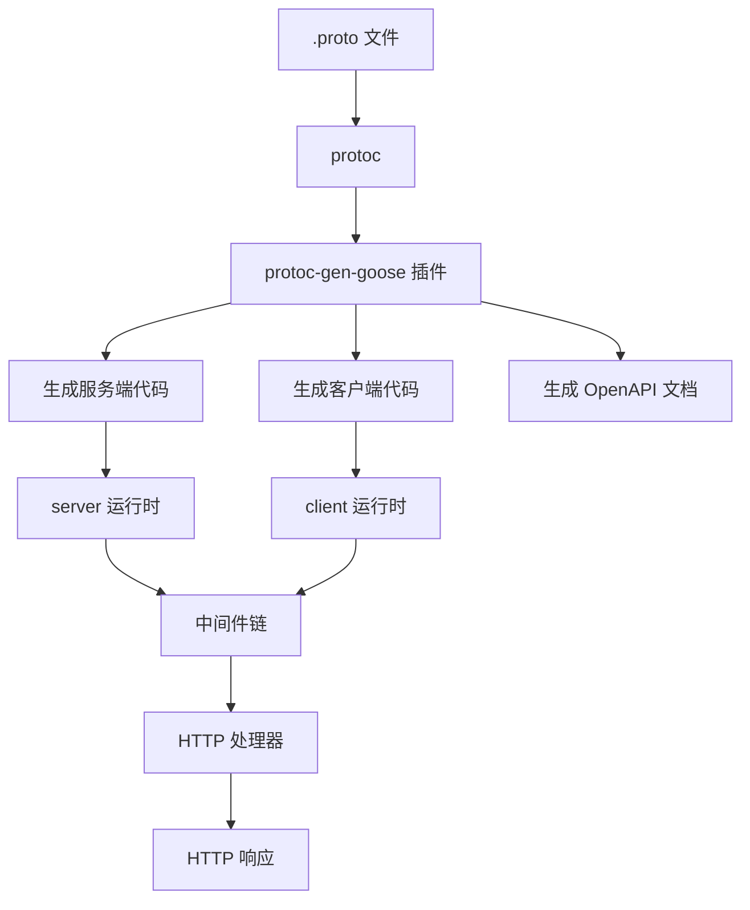
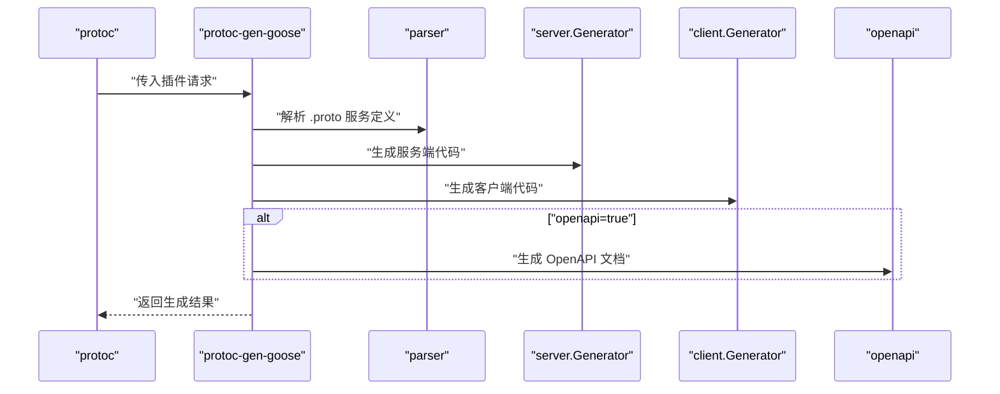
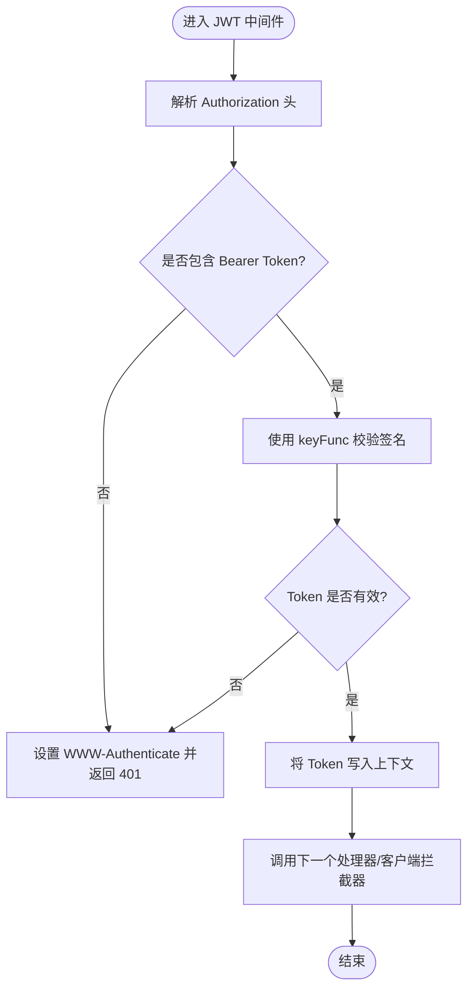
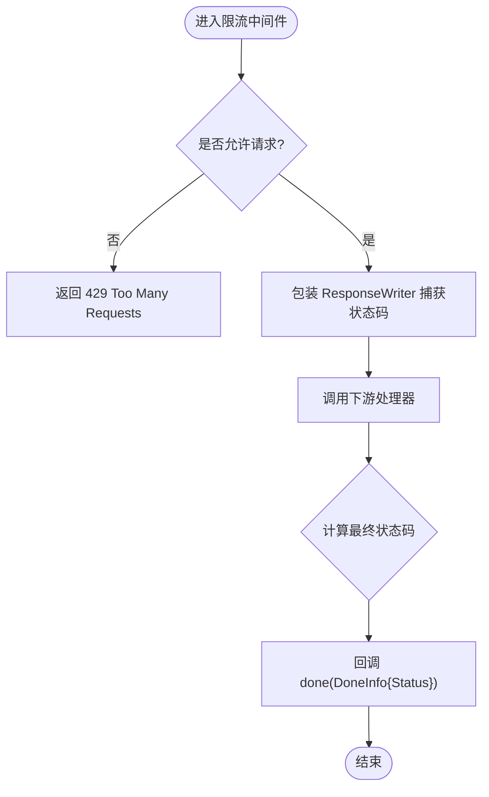
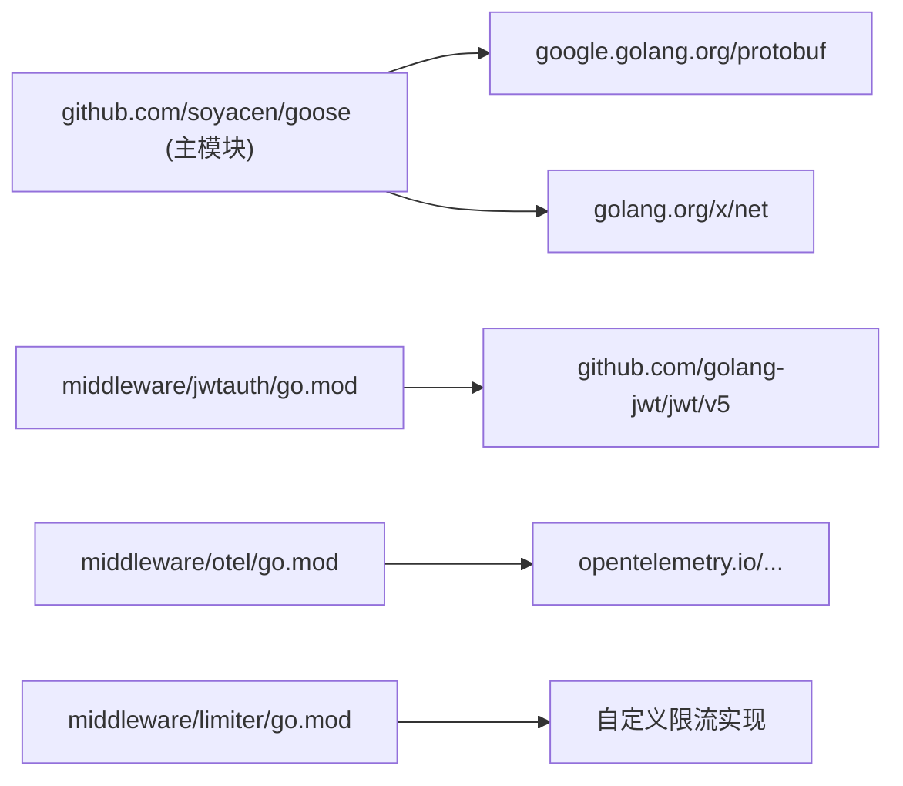

# 开发者指南

<cite>
**本文引用的文件**
- [README.md](file://README.md)
- [Makefile](file://Makefile)
- [.github/workflows/release.yml](file://.github/workflows/release.yml)
- [.github/workflows/codeql.yml](file://.github/workflows/codeql.yml)
- [.github/workflows/greetings.yml](file://.github/workflows/greetings.yml)
- [go.mod](file://go.mod)
- [cmd/protoc-gen-goose/main.go](file://cmd/protoc-gen-goose/main.go)
- [CLAUDE.md](file://CLAUDE.md)
- [skills/go-goose/SKILL.md](file://skills/go-goose/SKILL.md)
- [middleware/jwtauth/middleware.go](file://middleware/jwtauth/middleware.go)
- [middleware/limiter/middleware.go](file://middleware/limiter/middleware.go)
- [tools/build.go](file://tools/build.go)
- [middleware/otel/middleware.go](file://middleware/otel/middleware.go)
- [middleware/limiter/go.mod](file://middleware/limiter/go.mod)
- [middleware/jwtauth/go.mod](file://middleware/jwtauth/go.mod)
- [middleware/otel/go.mod](file://middleware/otel/go.mod)
</cite>

## 更新摘要
**所做变更**
- 新增完整的开发者指南文档，为新加入项目的开发者提供全面的开发指导
- 该指南涵盖了开发环境搭建、开发流程、代码与提交规范、分支管理策略
- 包含构建系统、测试流程、CI/CD 配置、发布流程的详细说明
- 提供贡献指南，包括问题报告、补丁提交、社区协作方式
- 详细介绍项目治理结构、维护策略和技术决策过程

## 目录
1. [简介](#简介)
2. [项目结构](#项目结构)
3. [核心组件](#核心组件)
4. [架构总览](#架构总览)
5. [详细组件分析](#详细组件分析)
6. [依赖分析](#依赖分析)
7. [性能考虑](#性能考虑)
8. [故障排查指南](#故障排查指南)
9. [结论](#结论)
10. [附录](#附录)

## 简介
本指南面向希望参与 Goose 项目开发的贡献者，涵盖开发环境搭建、开发流程、代码与提交规范、分支管理策略、构建与测试、CI/CD 配置、发布流程，以及问题报告、补丁提交与社区协作方式。Goose 是一个基于 Protobuf 的 Go 语言 HTTP/REST 代码生成与运行时支持库，提供 protoc 插件、服务端/客户端编码解码器、以及一组可复用中间件。

作为新加入项目的开发者，您将通过本指南快速了解项目的整体架构、开发规范和协作流程，确保能够高效地参与到项目开发中。

## 项目结构
仓库采用按功能域分层的组织方式：
- 根目录包含构建入口、模块声明与工作流配置
- cmd/protoc-gen-goose：protoc 插件源码，负责从 .proto 生成服务端/客户端样板与 OpenAPI 文档
- server/client：运行时支持，包含编码/解码器与中间件选项
- middleware：可复用中间件集合（访问日志、基本认证、JWT、恢复、超时、限流、CORS、OTEL 等）
- example：示例 proto、生成的 Go 代码与 OpenAPI 文档，配套测试
- internal/tools：内部工具与构建脚本
- third_party/google：第三方 Google API 注解与 HTTP 类型
- skills：技能评估与示例说明文档

**图表来源**
- [Makefile:1-29](file://Makefile#L1-L29)
- [go.mod:1-14](file://go.mod#L1-L14)
- [cmd/protoc-gen-goose/main.go:1-126](file://cmd/protoc-gen-goose/main.go#L1-L126)
- [middleware/jwtauth/middleware.go:1-246](file://middleware/jwtauth/middleware.go#L1-L246)
- [middleware/limiter/middleware.go:1-64](file://middleware/limiter/middleware.go#L1-L64)

**章节来源**
- [README.md:23-31](file://README.md#L23-L31)
- [CLAUDE.md:35-100](file://CLAUDE.md#L35-L100)

## 核心组件
- protoc 插件：从 .proto 生成服务端/客户端样板、路由注册与 OpenAPI 文档
- 运行时编码/解码器：将 Protobuf 消息映射到 HTTP 请求/响应
- 中间件生态：访问日志、基本认证、JWT、panic 恢复、超时、限流、CORS、OTEL 等
- 示例与测试：example 目录提供多种请求模式示例，配套测试保障一致性
- 构建与工具：Makefile 提供构建、安装、测试与示例生成；tools/build.go 引导依赖

**章节来源**
- [README.md:14-21](file://README.md#L14-L21)
- [CLAUDE.md:45-99](file://CLAUDE.md#L45-L99)
- [skills/go-goose/SKILL.md:169-332](file://skills/go-goose/SKILL.md#L169-L332)

## 架构总览
Goose 的整体架构围绕"代码生成 + 运行时 + 中间件"的三层设计展开。.proto 文件通过 protoc 与 Goose 插件生成服务端路由与客户端桩代码；运行时提供编码/解码与中间件链路；中间件模块化复用，按需装配。

**图表来源**
- [cmd/protoc-gen-goose/main.go:38-101](file://cmd/protoc-gen-goose/main.go#L38-L101)
- [README.md:48-72](file://README.md#L48-L72)
- [skills/go-goose/SKILL.md:169-190](file://skills/go-goose/SKILL.md#L169-L190)

## 详细组件分析

### protoc-gen-goose 插件
- 入口与参数解析：支持版本查询与插件参数注入
- 服务解析与生成：遍历插件输入文件，解析服务定义，生成服务接口、路由描述、服务端处理器、客户端桩代码
- OpenAPI 生成：可选开启，输出符合 OpenAPI 3.0.3 的接口文档
- 版本常量：集中维护插件版本字符串，便于发布与回溯

**图表来源**
- [cmd/protoc-gen-goose/main.go:26-101](file://cmd/protoc-gen-goose/main.go#L26-L101)

**章节来源**
- [cmd/protoc-gen-goose/main.go:19-36](file://cmd/protoc-gen-goose/main.go#L19-L36)
- [cmd/protoc-gen-goose/main.go:38-101](file://cmd/protoc-gen-goose/main.go#L38-L101)
- [cmd/protoc-gen-goose/main.go:103-125](file://cmd/protoc-gen-goose/main.go#L103-L125)

### JWT 认证中间件
- 服务端：从 Authorization 头解析 Bearer Token，使用提供的密钥函数校验签名，将有效 Token 写入请求上下文
- 客户端：根据上下文生成声明，使用密钥函数签名生成 Token，并注入到请求头
- 配置项：Realm、ParserOptions、TokenOptions、SigningMethod 等

**图表来源**
- [middleware/jwtauth/middleware.go:135-171](file://middleware/jwtauth/middleware.go#L135-L171)
- [middleware/jwtauth/middleware.go:186-219](file://middleware/jwtauth/middleware.go#L186-L219)

**章节来源**
- [middleware/jwtauth/middleware.go:16-121](file://middleware/jwtauth/middleware.go#L16-L121)
- [middleware/jwtauth/middleware.go:135-171](file://middleware/jwtauth/middleware.go#L135-L171)
- [middleware/jwtauth/middleware.go:186-219](file://middleware/jwtauth/middleware.go#L186-L219)

### 限流中间件（BBR）
- 服务端：基于 BBR 算法判断请求是否允许；包装 ResponseWriter 捕获最终状态码，完成后回调上报真实状态
- 行为：超出配额返回 429，否则放行并统计响应状态

**图表来源**
- [middleware/limiter/middleware.go:36-63](file://middleware/limiter/middleware.go#L36-L63)

**章节来源**
- [middleware/limiter/middleware.go:9-24](file://middleware/limiter/middleware.go#L9-L24)
- [middleware/limiter/middleware.go:36-63](file://middleware/limiter/middleware.go#L36-L63)

### 运行时与中间件链
- server/client 包提供编码/解码器、中间件选项与配置，支持 JSON 名称映射、未知字段丢弃、错误编码器、失败快速返回等
- 中间件通过链式组合（server.Chain 或 WithMiddleware）装配，形成统一的处理流水线

**章节来源**
- [skills/go-goose/SKILL.md:303-332](file://skills/go-goose/SKILL.md#L303-L332)
- [CLAUDE.md:76-89](file://CLAUDE.md#L76-L89)

## 依赖分析
- 模块版本：Go 语言版本要求与外部依赖在 go.mod 中声明
- 子模块：部分中间件（如 jwtauth、otel、limiter）拥有独立 go.mod，体现模块化与可选依赖
- 构建引导：tools/build.go 通过空导入确保相关包被纳入构建缓存与依赖树

**图表来源**
- [go.mod:1-14](file://go.mod#L1-L14)
- [.github/workflows/release.yml:47-54](file://.github/workflows/release.yml#L47-L54)

**章节来源**
- [go.mod:3-13](file://go.mod#L3-L13)
- [.github/workflows/release.yml:47-54](file://.github/workflows/release.yml#L47-L54)
- [tools/build.go:1-11](file://tools/build.go#L1-L11)

## 性能考虑
- 零反射取值与高效编码/解码：提升序列化/反序列化性能
- 中间件顺序与职责分离：避免重复处理，减少上下文切换
- 限流与超时：在高并发场景下保护后端资源，结合 BBR 动态调整
- OpenAPI 生成：便于前端对接与契约先行，降低调试成本

**章节来源**
- [README.md:5-12](file://README.md#L5-L12)
- [skills/go-goose/SKILL.md:255-302](file://skills/go-goose/SKILL.md#L255-L302)

## 故障排查指南
- 插件未找到或版本不匹配：确认已安装插件并处于 PATH；使用版本参数核对版本
- 生成代码异常：检查 .proto 的 google.api.annotations 映射是否正确；必要时开启 OpenAPI 生成比对
- 测试失败：优先运行单个示例测试，逐步缩小范围；关注路由注册与中间件装配
- CI/安全扫描：CodeQL 扫描在主分支触发，若发现告警需逐项修复

**章节来源**
- [cmd/protoc-gen-goose/main.go:26-30](file://cmd/protoc-gen-goose/main.go#L26-L30)
- [.github/workflows/codeql.yml:14-20](file://.github/workflows/codeql.yml#L14-L20)

## 结论
本指南提供了从开发环境到贡献流程、从构建测试到发布运维的全链路指引。建议贡献者在提交前先运行测试与示例生成，确保兼容性与一致性；在 PR 描述中清晰说明变更动机与影响面；遵守中间件与编码规范，保持模块化与可维护性。

对于新加入的开发者，建议按照以下步骤快速上手：
1. 阅读本指南的开发环境设置部分，完成本地开发环境配置
2. 运行示例项目，熟悉代码生成和运行流程
3. 查看具体组件的实现，理解设计思路
4. 参与社区讨论，了解项目发展方向

## 附录

### 开发环境设置与常用命令
- 安装插件：使用 go install 或 make install
- 构建二进制：make build
- 运行测试：go test ./... 或 make test
- 生成示例：make example
- 生成命令参考：protoc 与 Goose 插件参数

**章节来源**
- [README.md:36-46](file://README.md#L36-L46)
- [README.md:97-105](file://README.md#L97-L105)
- [Makefile:1-29](file://Makefile#L1-L29)
- [CLAUDE.md:13-33](file://CLAUDE.md#L13-L33)
- [skills/go-goose/SKILL.md:169-190](file://skills/go-goose/SKILL.md#L169-L190)

### 开发流程与代码规范
- 开发流程：Fork 仓库 → 在 feature 分支开发 → 编写/更新测试 → 提交 PR
- 代码规范：遵循 Go 社区通用实践；中间件保持单一职责；生成器与运行时保持清晰边界
- 提交规范：在 PR 描述中说明变更目的、影响范围与测试情况

**章节来源**
- [README.md:107-114](file://README.md#L107-L114)
- [CLAUDE.md:94-100](file://CLAUDE.md#L94-L100)

### 分支管理策略
- 主分支：稳定发布基线
- 功能分支：feature/* 或 feat/*，合并前需通过测试与审阅
- 发布标签：遵循 vX.Y.Z 规范，CI 自动创建标签与发布

**章节来源**
- [.github/workflows/release.yml:3-9](file://.github/workflows/release.yml#L3-L9)
- [.github/workflows/release.yml:35-40](file://.github/workflows/release.yml#L35-L40)

### 构建系统与测试流程
- 构建：Makefile 提供 build/install；插件入口集中管理版本
- 测试：go test ./...；示例目录包含端到端测试样例
- 依赖：go.mod 统一声明；子模块独立 go.mod 管理可选依赖

**章节来源**
- [Makefile:1-29](file://Makefile#L1-L29)
- [go.mod:1-14](file://go.mod#L1-L14)
- [tools/build.go:1-11](file://tools/build.go#L1-L11)

### CI/CD 配置与发布流程
- CodeQL：主分支推送与拉取请求触发，周期性扫描
- 欢迎机器人：首次提交 issue/pr 自动回复
- 发布：手动触发工作流，校验版本格式，更新源码与子模块版本，打标签并创建 GitHub Release

**章节来源**
- [.github/workflows/codeql.yml:14-20](file://.github/workflows/codeql.yml#L14-L20)
- [.github/workflows/greetings.yml:1-17](file://.github/workflows/greetings.yml#L1-L17)
- [.github/workflows/release.yml:10-94](file://.github/workflows/release.yml#L10-L94)

### 贡献指南与治理
- 报告问题：使用 Issues 模板，提供最小可复现步骤与期望/实际行为
- 提交补丁：遵循开发流程与代码规范，附带测试
- 参与讨论：通过 Discussions 或 Issues 讨论设计与实现细节
- 治理与维护：核心维护者负责代码审阅与发布；重大变更通过社区讨论决定

**章节来源**
- [README.md:107-114](file://README.md#L107-L114)
- [.github/workflows/greetings.yml:12-16](file://.github/workflows/greetings.yml#L12-L16)

### 版本管理与发布自动化
- 版本常量：插件版本在 cmd/protoc-gen-goose/main.go 中集中管理
- 自动化发布：GitHub Actions 工作流支持手动触发版本更新
- 子模块同步：发布时自动更新各中间件子模块的版本依赖
- 标签管理：创建主版本标签和子模块专用标签

**章节来源**
- [cmd/protoc-gen-goose/main.go:22](file://cmd/protoc-gen-goose/main.go#L22)
- [.github/workflows/release.yml:28-76](file://.github/workflows/release.yml#L28-L76)
- [middleware/limiter/go.mod:1](file://middleware/limiter/go.mod#L1)
- [middleware/jwtauth/go.mod:1](file://middleware/jwtauth/go.mod#L1)
- [middleware/otel/go.mod:1](file://middleware/otel/go.mod#L1)