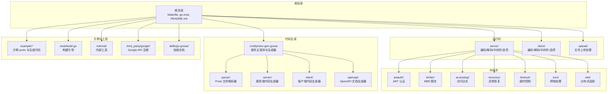
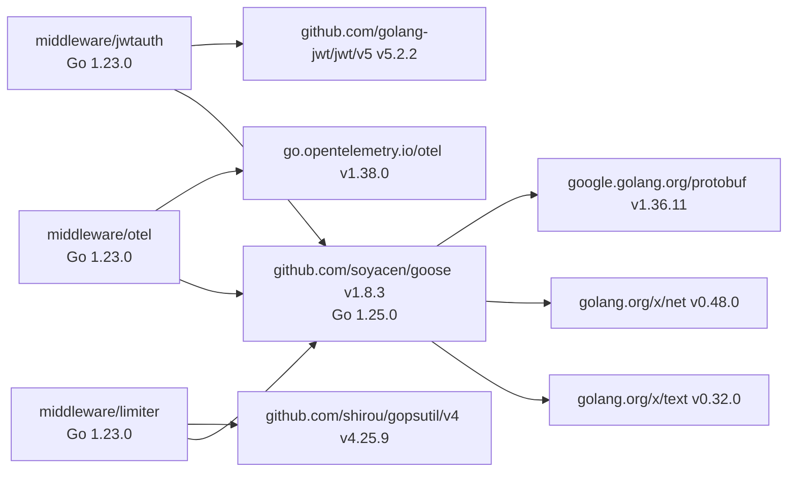
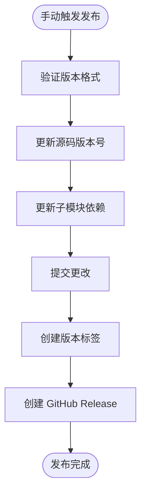

# 开发者指南

<cite>
**本文引用的文件**
- [README.md](file://README.md)
- [CLAUDE.md](file://CLAUDE.md)
- [skills/go-goose/SKILL.md](file://skills/go-goose/SKILL.md)
- [Makefile](file://Makefile)
- [.github/workflows/release.yml](file://.github/workflows/release.yml)
- [.github/workflows/codeql.yml](file://.github/workflows/codeql.yml)
- [go.mod](file://go.mod)
- [tools/build.go](file://tools/build.go)
- [middleware/jwtauth/go.mod](file://middleware/jwtauth/go.mod)
- [middleware/limiter/go.mod](file://middleware/limiter/go.mod)
- [middleware/otel/go.mod](file://middleware/otel/go.mod)
</cite>

## 更新摘要
**所做变更**
- 重构了文档结构，增强了开发环境设置和快速开始部分
- 新增了详细的依赖管理和版本控制章节
- 完善了构建系统和CI/CD配置说明
- 增加了贡献流程和代码规范的具体指导
- 优化了中间件生态系统的文档组织
- 更新了Go语言版本要求和工具链说明

## 目录
1. [简介](#简介)
2. [快速开始](#快速开始)
3. [开发环境设置](#开发环境设置)
4. [项目结构](#项目结构)
5. [核心组件](#核心组件)
6. [架构总览](#架构总览)
7. [详细组件分析](#详细组件分析)
8. [依赖管理](#依赖管理)
9. [构建与测试](#构建与测试)
10. [中间件生态系统](#中间件生态系统)
11. [代码生成流程](#代码生成流程)
12. [性能考虑](#性能考虑)
13. [故障排查指南](#故障排查指南)
14. [贡献指南](#贡献指南)
15. [CI/CD 配置](#cicd-配置)
16. [发布流程](#发布流程)
17. [结论](#结论)

## 简介
Goose 是一个面向 Go 的 Protobuf + HTTP/REST 代码生成与运行时支持库，提供完整的开发体验从代码生成到生产部署。本指南为贡献者和开发者提供全面的开发环境搭建、工作流程、代码规范和最佳实践指导。

作为新加入项目的开发者，您将通过本指南快速了解项目的整体架构、开发规范和协作流程，确保能够高效地参与到项目开发中。

## 快速开始

### 环境要求
- **Go 版本**: 1.25.0+ (主模块), 1.23.0+ (子模块)
- **protoc**: Protocol Buffers 编译器
- **插件**: protoc-gen-go, protoc-gen-go-grpc, protoc-gen-goose

### 安装步骤
```bash
# 安装 Goose 插件
go install github.com/soyacen/goose/cmd/protoc-gen-goose@latest

# 安装必要的 protoc 插件
go install google.golang.org/protobuf/cmd/protoc-gen-go@latest
go install google.golang.org/grpc/cmd/protoc-gen-go-grpc@latest
```

### 第一个示例
```bash
# 克隆仓库并进入示例目录
git clone https://github.com/soyacen/goose.git
cd goose/example/user

# 生成代码
./protoc.sh

# 运行测试
go test -v
```

**章节来源**
- [README.md:34-84](file://README.md#L34-L84)
- [skills/go-goose/SKILL.md:358-381](file://skills/go-goose/SKILL.md#L358-L381)

## 开发环境设置

### 本地开发环境
推荐使用以下工具进行本地开发：

#### 必需工具
- **Go 1.25.0+**: 主模块开发环境
- **protoc 编译器**: 用于处理 .proto 文件
- **Git**: 版本控制和协作
- **IDE**: 推荐 VS Code 或 GoLand

#### 可选工具
- **make**: 构建自动化
- **curl/postman**: API 测试
- **golangci-lint**: 代码质量检查

### 开发工作流
```bash
# 克隆仓库
git clone https://github.com/soyacen/goose.git
cd goose

# 安装依赖
go mod download

# 构建插件
make build

# 运行所有测试
make test

# 生成示例代码
make example
```

**章节来源**
- [CLAUDE.md:13-33](file://CLAUDE.md#L13-L33)
- [Makefile:1-29](file://Makefile#L1-L29)

## 项目结构
仓库采用按功能域分层的组织方式，便于维护和扩展：



**图表来源**
- [README.md:24-32](file://README.md#L24-L32)
- [CLAUDE.md:45-75](file://CLAUDE.md#L45-L75)

**章节来源**
- [README.md:24-32](file://README.md#L24-L32)
- [CLAUDE.md:45-75](file://CLAUDE.md#L45-L75)

## 核心组件

### protoc-gen-goose 插件
- **功能**: 从 .proto 文件生成服务端/客户端样板代码和 OpenAPI 文档
- **特性**: 支持多种 HTTP 模式映射、参数验证、错误处理
- **输出**: 服务端处理器、客户端桩代码、路由注册、OpenAPI 3.0.3 文档

### 运行时支持
- **server 包**: 提供 HTTP 服务器端编码/解码器、中间件链、配置选项
- **client 包**: 提供 HTTP 客户端编码器/解码器、中间件支持、请求重试
- **upload 包**: 处理 multipart/form-data 文件上传，支持单文件、多文件和混合表单

### 中间件生态
- **安全认证**: JWT 认证、基本认证
- **监控日志**: 访问日志、错误日志、分布式追踪
- **性能优化**: 限流、超时控制、CORS 处理
- **可靠性**: 异常恢复、请求重试

**章节来源**
- [README.md:14-22](file://README.md#L14-L22)
- [CLAUDE.md:45-75](file://CLAUDE.md#L45-L75)

## 架构总览
Goose 的整体架构围绕"代码生成 + 运行时 + 中间件"的三层设计展开：

```mermaid
sequenceDiagram
participant Dev as "开发者"
participant Proto as ".proto 文件"
participant Protoc as "protoc 编译器"
participant Plugin as "protoc-gen-goose 插件"
participant GenCode as "生成的代码"
participant Runtime as "运行时"
participant MW as "中间件链"
participant Handler as "业务处理器"
Dev->>Proto : 定义服务接口
Dev->>Protoc : 执行代码生成
Protoc->>Plugin : 调用插件
Plugin->>GenCode : 生成服务端/客户端代码
Plugin->>GenCode : 生成 OpenAPI 文档
Note over GenCode : 生成的代码包含 :
- 服务端处理器
- 客户端桩代码
- 路由注册
- 编解码逻辑
Dev->>Runtime : 启动应用
Runtime->>MW : 组装中间件链
MW->>Handler : 调用业务逻辑
Handler-->>MW : 返回响应
MW-->>Runtime : 处理响应
Runtime-->>Dev : 提供服务
```

**图表来源**
- [CLAUDE.md:35-44](file://CLAUDE.md#L35-L44)
- [skills/go-goose/SKILL.md:358-381](file://skills/go-goose/SKILL.md#L358-L381)

## 详细组件分析

### 代码生成系统
Goose 的代码生成系统采用模块化设计，支持灵活的模板定制：

#### 解析器 (parser/)
- 解析 .proto 文件中的服务定义
- 提取 HTTP 映射信息
- 验证语法和语义正确性

#### 代码生成器 (server/, client/)
- 生成类型安全的 Go 代码
- 实现请求/响应编解码
- 处理路径参数、查询字符串、请求体

#### OpenAPI 生成器 (openapi/)
- 自动生成 OpenAPI 3.0.3 文档
- 支持 schema 定义和示例数据
- 与 Swagger UI 集成

**章节来源**
- [CLAUDE.md:47-52](file://CLAUDE.md#L47-L52)
- [skills/go-goose/SKILL.md:20-47](file://skills/go-goose/SKILL.md#L20-L47)

### 运行时架构
运行时组件提供高性能的 HTTP 处理：

#### 编码/解码器
- 零反射取值，提升序列化性能
- 支持多种数据格式映射
- 错误处理和验证机制

#### 中间件链
- 函数式组合模式
- 支持同步和异步处理
- 上下文传递和状态管理

**章节来源**
- [CLAUDE.md:53-70](file://CLAUDE.md#L53-L70)

## 依赖管理

### 主模块依赖
Goose 主模块使用 Go 1.25.0，提供最新的语言特性和性能优化：

#### 核心依赖
- **google.golang.org/protobuf v1.36.11**: Protocol Buffers 运行时支持
- **golang.org/x/net v0.48.0**: 网络相关工具包
- **golang.org/x/text v0.32.0**: 文本处理工具包
- **golang.org/x/sync v0.21.0**: 并发原语
- **golang.org/x/exp v0.0.0-20260611194520-c48552f49976**: 实验性特性
- **github.com/google/go-querystring v1.2.0**: URL 查询字符串处理
- **google.golang.org/genproto/googleapis/api v0.0.0-20260622175928-b703f567277d**: Google API 协议定义
- **google.golang.org/genproto/googleapis/rpc v0.0.0-20260618152121-87f3d3e198d3**: RPC 协议定义
- **github.com/coder/websocket v1.8.15**: WebSocket 支持

### 子模块依赖管理
项目采用多模块架构，各中间件拥有独立的 go.mod 文件：

#### JWT 认证中间件 (middleware/jwtauth)
- **Go 版本**: 1.23.0
- **核心依赖**: github.com/golang-jwt/jwt/v5 v5.2.2
- **主模块依赖**: github.com/soyacen/goose v1.8.3

#### 限流中间件 (middleware/limiter) 
- **Go 版本**: 1.23.0
- **核心依赖**: github.com/shirou/gopsutil/v4 v4.25.9
- **测试框架**: github.com/stretchr/testify v1.11.1

#### OTEL 中间件 (middleware/otel)
- **Go 版本**: 1.23.0
- **核心依赖**: go.opentelemetry.io/otel v1.38.0
- **HTTP 插桩**: go.opentelemetry.io/contrib/instrumentation/net/http/otelhttp v0.60.0

### 依赖解析与构建引导
- **构建引导**: tools/build.go 通过空导入确保相关包被纳入构建缓存
- **版本替换**: 子模块使用 replace 指令指向本地主模块，便于开发调试
- **依赖锁定**: go.sum 文件确保依赖版本的一致性和可重现性



**图表来源**
- [go.mod:1-17](file://go.mod#L1-L17)
- [middleware/jwtauth/go.mod:1-18](file://middleware/jwtauth/go.mod#L1-L18)
- [middleware/limiter/go.mod:1-33](file://middleware/limiter/go.mod#L1-L33)
- [middleware/otel/go.mod:1-25](file://middleware/otel/go.mod#L1-L25)

**章节来源**
- [go.mod:3-17](file://go.mod#L3-L17)
- [middleware/jwtauth/go.mod:3-18](file://middleware/jwtauth/go.mod#L3-L18)
- [middleware/limiter/go.mod:3-33](file://middleware/limiter/go.mod#L3-L33)
- [middleware/otel/go.mod:3-25](file://middleware/otel/go.mod#L3-L25)
- [tools/build.go:1-11](file://tools/build.go#L1-L11)

## 构建与测试

### 构建系统
项目使用 Makefile 提供统一的构建入口：

#### 常用命令
```bash
# 构建插件二进制
make build

# 安装插件到 $GOBIN
make install

# 运行所有测试
make test

# 生成示例代码
make example

# 完整构建（安装 + 生成示例）
make all
```

### 测试策略
项目采用多层次测试策略：

#### 单元测试
- 每个包都有对应的 *_test.go 文件
- 覆盖核心功能和边界情况
- 使用 testify 进行断言

#### 集成测试
- example 目录包含端到端测试
- 验证代码生成和服务运行
- OpenAPI 文档一致性测试

#### 性能测试
- 基准测试确保性能回归
- 内存使用监控
- 并发安全性验证

**章节来源**
- [Makefile:1-29](file://Makefile#L1-L29)
- [README.md:135-144](file://README.md#L135-L144)

## 中间件生态系统

### 内置中间件
Goose 提供丰富的中间件集合，满足常见的 Web 服务需求：

| 中间件 | 功能描述 | 配置选项 |
|--------|----------|----------|
| `accesslog` | HTTP 访问日志记录 | 自定义日志格式、输出目标 |
| `basicauth` | HTTP 基本认证 | 用户名密码验证、Realm 配置 |
| `jwtauth` | JWT 令牌验证 | 密钥函数、签名方法、Token 选项 |
| `recovery` | Panic 异常恢复 | 自定义错误响应、日志记录 |
| `timeout` | 请求超时控制 | 超时时间、上下文传播 |
| `limiter` | BBR 算法限流 | 配额配置、统计上报 |
| `cors` | 跨域资源共享 | 允许的来源、方法、头部 |
| `otel` | OpenTelemetry 集成 | 追踪配置、采样策略 |

### 中间件开发
开发自定义中间件遵循统一模式：

#### 服务端中间件
```go
func MyMiddleware(next http.HandlerFunc) http.HandlerFunc {
    return func(w http.ResponseWriter, r *http.Request) {
        // 前置处理
        next(w, r)
        // 后置处理
    }
}
```

#### 客户端中间件
```go
func MyClientMiddleware(cli *http.Client, req *http.Request, invoker client.Invoker) (*http.Response, error) {
    // 前置处理
    resp, err := invoker(req)
    // 后置处理
    return resp, err
}
```

**章节来源**
- [CLAUDE.md:61-72](file://CLAUDE.md#L61-L72)
- [CLAUDE.md:76-88](file://CLAUDE.md#L76-L88)

## 代码生成流程

### Proto 文件定义
Goose 支持完整的 Google API HTTP 映射语法：

#### 基础服务定义
```proto
syntax = "proto3";
package my.package.v1;
option go_package = "github.com/user/project/pkg/v1;pkg";

import "google/api/annotations.proto";

service UserService {
  rpc GetUser(GetUserRequest) returns (UserResponse) {
    option (google.api.http) = {
      get: "/v1/users/{id}"
    };
  }
  
  rpc CreateUser(CreateUserRequest) returns (UserResponse) {
    option (google.api.http) = {
      post: "/v1/users"
      body: "user"
    };
  }
}
```

#### 支持的 HTTP 模式
- **GET**: 路径参数、查询字符串
- **POST**: 请求体映射
- **PUT/PATCH**: 部分更新
- **DELETE**: 资源删除
- **自定义方法**: 复杂业务逻辑

### 生成配置
```bash
protoc \
  --proto_path=. \
  --proto_path=./third_party \
  --go_out=. \
  --go_opt=paths=source_relative \
  --go-grpc_out=. \
  --go-grpc_opt=paths=source_relative \
  --goose_out=. \
  --goose_opt=paths=source_relative \
  --goose_opt=openapi=true \
  your_service.proto
```

**章节来源**
- [skills/go-goose/SKILL.md:20-175](file://skills/go-goose/SKILL.md#L20-L175)
- [skills/go-goose/SKILL.md:358-381](file://skills/go-goose/SKILL.md#L358-L381)

## 性能考虑

### 零反射优化
- 使用编译时代码生成避免运行时反射
- 静态类型绑定提升序列化性能
- 预分配缓冲区减少内存分配

### 中间件优化
- 中间件顺序优化，避免重复处理
- 上下文传递最小化开销
- 错误处理快速失败

### 资源管理
- 连接池复用
- 内存泄漏防护
- 并发安全保证

**章节来源**
- [README.md:5-12](file://README.md#L5-L12)
- [skills/go-goose/SKILL.md:255-302](file://skills/go-goose/SKILL.md#L255-L302)

## 故障排查指南

### 常见问题解决

#### 插件相关问题
- **插件未找到**: 确认 protoc-gen-goose 已安装且在 PATH 中
- **版本不匹配**: 检查 Go 版本兼容性，主模块需要 1.25.0+
- **生成失败**: 验证 .proto 文件的语法和 google.api.annotations 映射

#### 运行时问题
- **路由冲突**: 检查 HTTP 路径映射是否唯一
- **中间件错误**: 查看中间件链顺序和配置
- **性能问题**: 使用 pprof 分析热点函数

#### 依赖问题
- **版本冲突**: 使用 go mod tidy 清理未使用的依赖
- **下载失败**: 检查网络连接和代理配置
- **构建失败**: 清理 go.sum 后重新下载依赖

### 调试技巧
- 启用详细日志输出
- 使用 OpenAPI 文档验证接口
- 逐步缩小问题范围进行测试

**章节来源**
- [README.md:135-144](file://README.md#L135-L144)
- [CLAUDE.md:94-100](file://CLAUDE.md#L94-L100)

## 贡献指南

### 开发流程
1. **Fork 仓库**: 在 GitHub 上 Fork 项目
2. **创建分支**: 基于 main 分支创建 feature 分支
3. **开发功能**: 编写代码和测试用例
4. **提交更改**: 遵循提交规范
5. **发起 PR**: 提交 Pull Request 等待审阅

### 代码规范
- 遵循 Go 社区通用实践
- 保持中间件单一职责
- 生成器与运行时清晰边界
- 完善的注释和文档

### 提交规范
- 清晰的提交信息
- 包含测试用例
- 更新相关文档
- 通过 CI 检查

### 问题报告
- 使用 Issues 模板
- 提供最小可复现步骤
- 说明期望和实际行为
- 附上相关日志和错误信息

**章节来源**
- [README.md:145-152](file://README.md#L145-L152)
- [CLAUDE.md:94-100](file://CLAUDE.md#L94-L100)

## CI/CD 配置

### 持续集成
项目使用 GitHub Actions 进行自动化构建和测试：

#### CodeQL 安全扫描
- 主分支推送时触发
- 定期安全扫描
- 自动发现安全漏洞

#### 欢迎机器人
- 首次提交 issue/pr 自动回复
- 提供贡献指南链接
- 引导新贡献者

### 工作流配置
```yaml
# CodeQL 扫描配置
on:
  push:
    branches: [ "main" ]
  pull_request:
    branches: [ "main" ]
  schedule:
    - cron: '35 2 * * 6'
```

**章节来源**
- [.github/workflows/codeql.yml:14-20](file://.github/workflows/codeql.yml#L14-L20)
- [.github/workflows/greetings.yml:1-17](file://.github/workflows/greetings.yml#L1-L17)

## 发布流程

### 版本管理
项目采用自动化发布流程：

#### 手动触发发布
```bash
# 使用 GitHub Actions 手动触发
gh workflow run release.yml -f version=v1.8.3
```

#### 版本更新流程
1. **版本验证**: 检查版本号格式 vX.Y.Z
2. **源码更新**: 更新 cmd/protoc-gen-goose/main.go 中的版本号
3. **子模块同步**: 更新各中间件子模块的版本依赖
4. **标签创建**: 创建主版本标签和子模块专用标签
5. **Release 创建**: 自动生成 GitHub Release

#### 发布产物
- 主模块版本标签: v1.8.3
- JWT 中间件标签: middleware/jwtauth/v1.8.3
- OTEL 中间件标签: middleware/otel/v1.8.3
- 限流中间件标签: middleware/limiter/v1.8.3



**图表来源**
- [.github/workflows/release.yml:28-76](file://.github/workflows/release.yml#L28-L76)

**章节来源**
- [.github/workflows/release.yml:10-94](file://.github/workflows/release.yml#L10-L94)

## 结论
本指南提供了从开发环境到贡献流程、从构建测试到发布运维的全链路指引。建议贡献者在提交前先运行测试与示例生成，确保兼容性与一致性；在 PR 描述中清晰说明变更动机与影响面；遵守中间件与编码规范，保持模块化与可维护性。

对于新加入的开发者，建议按照以下步骤快速上手：
1. 阅读本指南的开发环境设置部分，完成本地开发环境配置
2. 运行示例项目，熟悉代码生成和运行流程
3. 查看具体组件的实现，理解设计思路
4. 参与社区讨论，了解项目发展方向

通过遵循本指南，您可以更高效地参与 Goose 项目的开发和贡献，共同推动项目的持续发展。