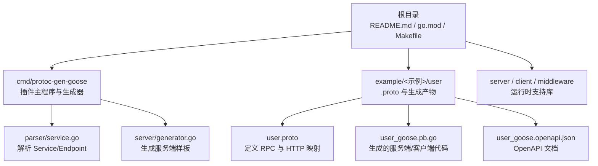
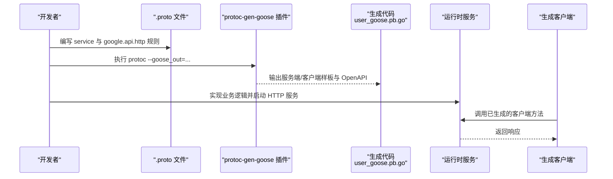
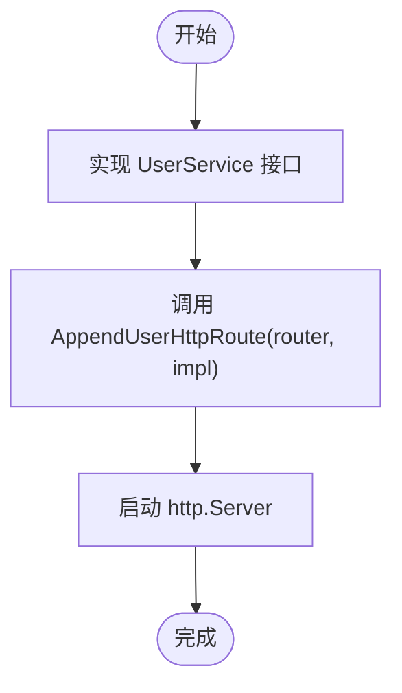
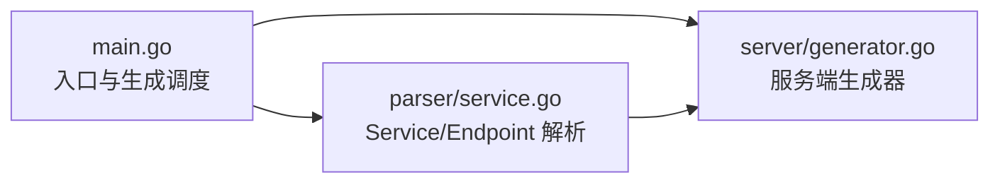

# 快速开始

<cite>
**本文引用的文件**
- [README.md](file://README.md)
- [go.mod](file://go.mod)
- [Makefile](file://Makefile)
- [cmd/protoc-gen-goose/main.go](file://cmd/protoc-gen-goose/main.go)
- [cmd/protoc-gen-goose/parser/service.go](file://cmd/protoc-gen-goose/parser/service.go)
- [cmd/protoc-gen-goose/server/generator.go](file://cmd/protoc-gen-goose/server/generator.go)
- [example/user/user.proto](file://example/user/user.proto)
- [example/user/user_goose.pb.go](file://example/user/user_goose.pb.go)
- [example/user/user_goose.openapi.json](file://example/user/user_goose.openapi.json)
- [example/user/user_test.go](file://example/user/user_test.go)
- [example/user/openapi_test.go](file://example/user/openapi_test.go)
</cite>

## 目录
1. [简介](#简介)
2. [项目结构](#项目结构)
3. [核心组件](#核心组件)
4. [架构总览](#架构总览)
5. [详细组件分析](#详细组件分析)
6. [依赖分析](#依赖分析)
7. [性能考虑](#性能考虑)
8. [故障排查指南](#故障排查指南)
9. [结论](#结论)
10. [附录](#附录)

## 简介
本指南面向首次接触 Goose 框架的开发者，目标是帮助你在最短时间内完成从环境准备、安装插件、编写 .proto 文件、生成代码、实现业务逻辑到部署服务的全流程实践。你将学会：
- 如何安装 protoc 与 Goose 插件
- 如何编写符合 Goose 约定的 .proto 文件
- 如何使用 protoc 生成服务端与客户端代码及 OpenAPI 文档
- 如何在生成代码基础上实现业务逻辑并启动 HTTP 服务
- 如何使用生成的客户端或工具调用接口
- 常见问题与解决方案

## 项目结构
仓库采用"多模块 + 示例"的组织方式：
- 根目录提供安装、测试与示例生成的 Makefile
- cmd/protoc-gen-goose 是 protoc 插件源码，负责解析 .proto 并生成服务端/客户端样板与 OpenAPI
- example 目录包含多个示例 proto 与生成产物，便于对照学习
- server、client、middleware 等包提供运行时编码解码与中间件能力

**图表来源**
- [README.md:23-31](file://README.md#L23-L31)
- [Makefile:14-26](file://Makefile#L14-L26)
- [cmd/protoc-gen-goose/main.go:38-101](file://cmd/protoc-gen-goose/main.go#L38-L101)
- [cmd/protoc-gen-goose/parser/service.go:63-89](file://cmd/protoc-gen-goose/parser/service.go#L63-L89)
- [cmd/protoc-gen-goose/server/generator.go:13-40](file://cmd/protoc-gen-goose/server/generator.go#L13-L40)

**章节来源**
- [README.md:23-31](file://README.md#L23-L31)
- [Makefile:14-26](file://Makefile#L14-L26)

## 核心组件
- protoc 插件：cmd/protoc-gen-goose，负责解析 .proto 中的 service 与 google.api.http 规则，生成服务端路由、处理器、客户端封装、请求/响应编解码器，以及可选的 OpenAPI 文档。
- 解析器：parser.Service/Endpoint 将 .proto 的 Service 方法转换为 Endpoint，提取 HTTP 方法与路径规则。
- 生成器：server.Generator 生成服务端样板代码（路由注册、处理器、编解码器绑定）。
- 示例：example/user 展示了从 .proto 到生成代码再到测试与 OpenAPI 校验的完整链路。

**章节来源**
- [cmd/protoc-gen-goose/main.go:38-101](file://cmd/protoc-gen-goose/main.go#L38-L101)
- [cmd/protoc-gen-goose/parser/service.go:63-89](file://cmd/protoc-gen-goose/parser/service.go#L63-L89)
- [cmd/protoc-gen-goose/server/generator.go:13-40](file://cmd/protoc-gen-goose/server/generator.go#L13-L40)

## 架构总览
下图展示了从 .proto 到运行时服务的关键步骤与组件交互：

**图表来源**
- [cmd/protoc-gen-goose/main.go:38-101](file://cmd/protoc-gen-goose/main.go#L38-L101)
- [example/user/user_goose.pb.go:27-53](file://example/user/user_goose.pb.go#L27-L53)
- [example/user/user.proto:7-62](file://example/user/user.proto#L7-L62)

## 详细组件分析

### 环境要求与安装
- Go 版本：仓库 go.mod 指定 1.23.0，建议使用该版本或更高稳定版本。
- 安装插件：推荐使用 go install 一键安装 protoc-gen-goose；也可在根目录通过 make install 或 go build 生成本地可执行文件。
- protoc：确保 protoc 已安装且可用，插件会自动被 protoc 发现。

**章节来源**
- [go.mod:3](file://go.mod#L3)
- [README.md:36-46](file://README.md#L36-L46)
- [Makefile:6-8](file://Makefile#L6-L8)

### 第一步：编写 .proto 文件
- 在 example/user/user.proto 中，定义 service 与 RPC 方法，并使用 google.api.http 为每个方法声明 HTTP 映射（方法、路径、body 字段等）。
- 关键点：
  - 使用 import "google/api/annotations.proto"
  - 在每个 rpc 上设置 option (google.api.http) = { ... }
  - 请求/响应消息按需定义，字段类型与名称遵循 Protobuf 规范

**章节来源**
- [example/user/user.proto:1-111](file://example/user/user.proto#L1-L111)

### 第二步：运行 protoc-gen-goose 插件生成代码
- 使用 Makefile 中的 example 目标或手动执行 protoc，指定 --goose_out 与 --goose_opt=openapi=true 以同时生成 OpenAPI 文档。
- 生成产物包括：
  - 服务端路由注册函数 Append<Service>HttpRoute
  - 处理器与编解码器
  - 客户端封装 New<Service>HttpClient 与各方法
  - OpenAPI 文档 *_goose.openapi.json

**章节来源**
- [Makefile:14-26](file://Makefile#L14-L26)
- [README.md:48-72](file://README.md#L48-L72)
- [example/user/user_goose.pb.go:27-53](file://example/user/user_goose.pb.go#L27-L53)

### 第三步：实现业务逻辑并启动服务
- 在生成的 user_goose.pb.go 中，可以看到服务接口 UserService 与路由注册函数 AppendUserHttpRoute。
- 你可以：
  - 实现 UserService 接口（如示例中的 MockUserService）
  - 调用 AppendUserHttpRoute(router, impl) 注册路由
  - 启动 http.Server 即可对外提供 REST 服务

**图表来源**
- [example/user/user_goose.pb.go:18-25](file://example/user/user_goose.pb.go#L18-L25)
- [example/user/user_goose.pb.go:27-53](file://example/user/user_goose.pb.go#L27-L53)
- [example/user/user_test.go:47-55](file://example/user/user_test.go#L47-L55)

**章节来源**
- [example/user/user_goose.pb.go:18-25](file://example/user/user_goose.pb.go#L18-L25)
- [example/user/user_goose.pb.go:27-53](file://example/user/user_goose.pb.go#L27-L53)
- [example/user/user_test.go:47-55](file://example/user/user_test.go#L47-L55)

### 第四步：使用生成的客户端调用服务
- 通过 NewUserHttpClient(target, opts...) 创建客户端实例
- 调用 CreateUser/GetUser/ListUser 等方法，插件会自动处理请求构造、发送与响应解析
- 可结合中间件（如 accesslog、timeout、basicauth 等）增强客户端行为

**章节来源**
- [example/user/user_goose.pb.go:353-372](file://example/user/user_goose.pb.go#L353-L372)
- [example/user/user_goose.pb.go:383-495](file://example/user/user_goose.pb.go#L383-L495)

### 第五步：验证 OpenAPI 文档一致性
- 插件会生成 *_goose.openapi.json，示例中提供了 openapi_test.go，通过读取该 JSON 并对服务发起请求，校验状态码、内容类型与响应体是否符合规范。

**章节来源**
- [example/user/user_goose.openapi.json:1-403](file://example/user/user_goose.openapi.json#L1-L403)
- [example/user/openapi_test.go:382-450](file://example/user/openapi_test.go#L382-L450)

## 依赖分析
- 插件入口与生成流程
  - main.go 负责解析插件参数、遍历文件与 service，调用 server.Generator 与 client.Generator 生成服务端/客户端代码，并在开启 openapi 选项时生成 OpenAPI 文档。
- 解析与生成关系
  - parser.Service 将 .proto 的 Service 方法转为 Endpoint，提取 HTTP 规则与路径模式
  - server.Generator 生成路由注册、处理器与编解码器

**图表来源**
- [cmd/protoc-gen-goose/main.go:38-101](file://cmd/protoc-gen-goose/main.go#L38-L101)
- [cmd/protoc-gen-goose/parser/service.go:63-89](file://cmd/protoc-gen-goose/parser/service.go#L63-L89)
- [cmd/protoc-gen-goose/server/generator.go:13-40](file://cmd/protoc-gen-goose/server/generator.go#L13-L40)

**章节来源**
- [cmd/protoc-gen-goose/main.go:38-101](file://cmd/protoc-gen-goose/main.go#L38-L101)
- [cmd/protoc-gen-goose/parser/service.go:63-89](file://cmd/protoc-gen-goose/parser/service.go#L63-L89)
- [cmd/protoc-gen-goose/server/generator.go:13-40](file://cmd/protoc-gen-goose/server/generator.go#L13-L40)

## 性能考虑
- 零反射取值：Goose 的编解码与路由处理均基于生成代码，避免反射开销，适合高并发场景。
- 中间件链：通过中间件组合（如 accesslog、timeout、recovery）提升稳定性与可观测性，但需注意链路顺序与性能影响。
- OpenAPI 生成：仅在需要文档时启用 openapi=true，避免不必要的生成时间与磁盘占用。

## 故障排查指南
- protoc 无法找到插件
  - 确认插件已安装至 $GOBIN 或 $GOPATH/bin，并在 PATH 中；或使用 go install ./cmd/protoc-gen-goose 安装
- 生成失败或未生成 OpenAPI
  - 检查是否正确传入 --goose_opt=openapi=true
  - 确保 .proto 中包含 google.api.annotations 导入与 google.api.http 规则
- 运行时报错找不到路由
  - 确保调用了 Append<Service>HttpRoute 并将 router 交给 http.Server
- 响应不符合 OpenAPI
  - 使用 openapi_test.go 的校验逻辑，检查状态码、Content-Type 与响应体结构

**章节来源**
- [README.md:36-46](file://README.md#L36-L46)
- [README.md:58-72](file://README.md#L58-L72)
- [example/user/openapi_test.go:310-354](file://example/user/openapi_test.go#L310-L354)

## 结论
通过本指南，你已经完成了从环境准备、编写 .proto、生成代码、实现业务逻辑到部署服务的完整流程。建议在实际项目中：
- 将 .proto 与生成代码纳入版本管理
- 使用中间件增强服务的可观测性与健壮性
- 借助 OpenAPI 文档与自动化测试保障接口一致性

## 附录
- 快速命令参考
  - 安装插件：go install ./cmd/protoc-gen-goose
  - 生成示例：make example
  - 运行测试：go test ./example/user
- 相关文件定位
  - 插件入口：cmd/protoc-gen-goose/main.go
  - 解析器：cmd/protoc-gen-goose/parser/service.go
  - 服务端生成器：cmd/protoc-gen-goose/server/generator.go
  - 示例 .proto：example/user/user.proto
  - 生成代码：example/user/user_goose.pb.go
  - OpenAPI 文档：example/user/user_goose.openapi.json
  - 测试与 OpenAPI 校验：example/user/user_test.go、example/user/openapi_test.go