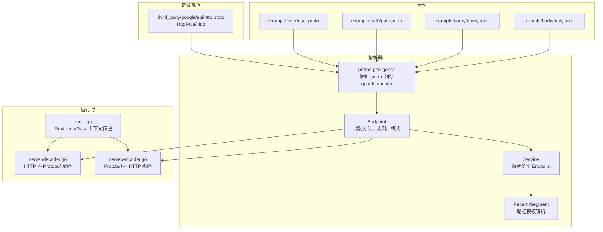
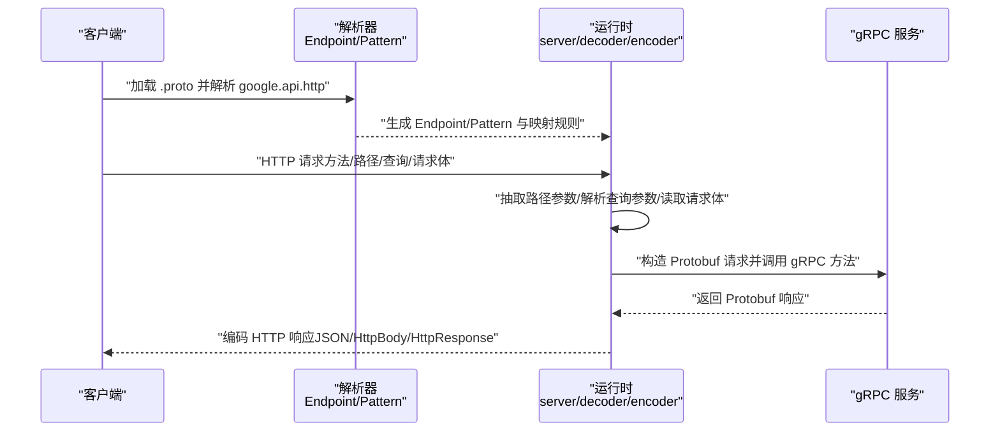
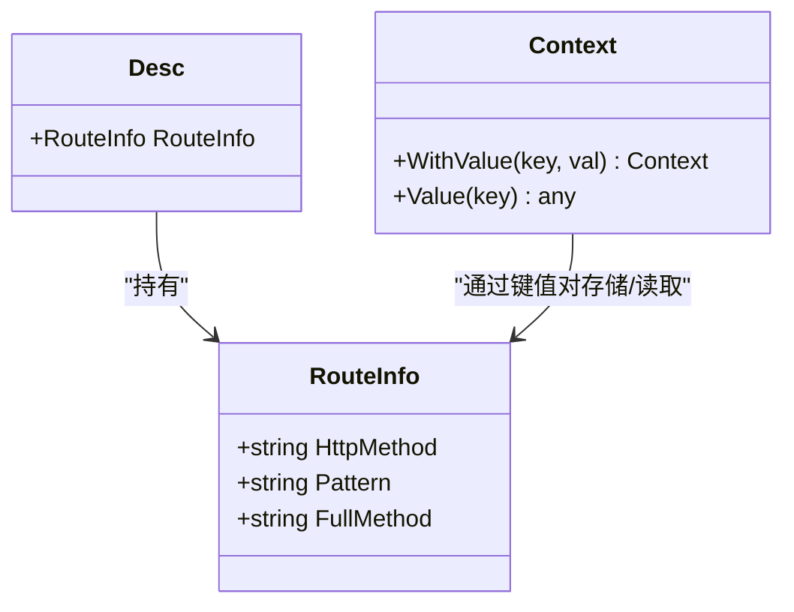
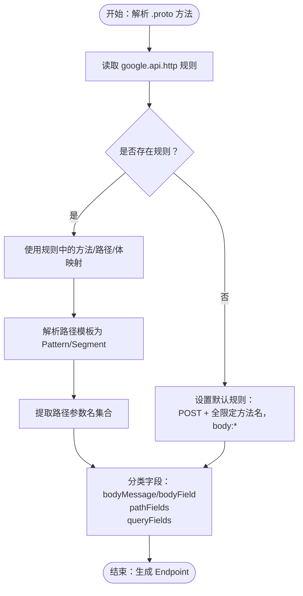
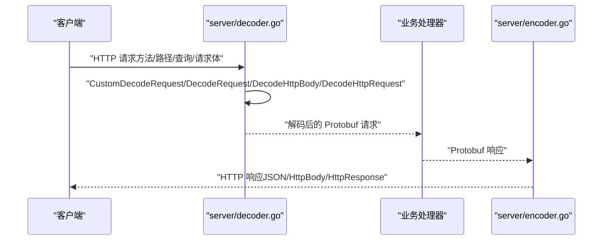
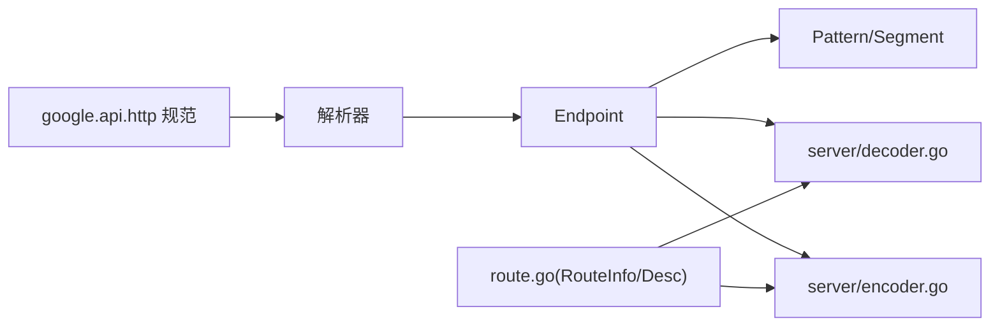

# HTTP 到 gRPC 映射原理

<cite>
**本文引用的文件**
- [route.go](file://route.go)
- [desc.go](file://desc.go)
- [constant.go](file://constant.go)
- [common.go](file://common.go)
- [http.proto](file://third_party/google/api/http.proto)
- [user.proto](file://example/user/user.proto)
- [path.proto](file://example/path/path.proto)
- [query.proto](file://example/query/query.proto)
- [body.proto](file://example/body/body.proto)
- [service.go](file://cmd/protoc-gen-goose/parser/service.go)
- [endpoint.go](file://cmd/protoc-gen-goose/parser/endpoint.go)
- [pattern.go](file://cmd/protoc-gen-goose/parser/pattern.go)
- [field.go](file://cmd/protoc-gen-goose/parser/field.go)
- [decoder.go](file://server/decoder.go)
- [encoder.go](file://server/encoder.go)
</cite>

## 目录
1. [引言](#引言)
2. [项目结构](#项目结构)
3. [核心组件](#核心组件)
4. [架构总览](#架构总览)
5. [详细组件分析](#详细组件分析)
6. [依赖关系分析](#依赖关系分析)
7. [性能考量](#性能考量)
8. [故障排查指南](#故障排查指南)
9. [结论](#结论)
10. [附录](#附录)

## 引言
本文件系统性阐述 HTTP 协议到 gRPC 服务的映射机制，重点解释如何将 HTTP 方法、URL 路径、查询参数映射到 gRPC 服务方法，并详细说明 RouteInfo 结构在映射流程中的作用。文档还涵盖路径参数提取、查询参数处理、请求体解析等映射规则，结合具体示例展示不同类型的 API 定义如何转换为 HTTP 端点，并总结映射过程中的约束条件与最佳实践。

## 项目结构
该仓库围绕“HTTP 到 gRPC 映射”这一核心目标，组织了以下关键模块：
- 解析器（protoc-gen-goose）：从 .proto 文件读取 google.api.http 注解，生成路由模式与端点信息。
- 运行时（server）：提供 HTTP 请求解码、响应编码能力，支持标准 Protobuf JSON 与 google.api.HttpBody、google.rpc.HttpRequest 等特殊类型。
- 核心数据结构（goose）：定义 RouteInfo、Desc 等用于承载映射元信息的数据结构，并通过上下文传递。

图表来源
- [service.go:63-89](file://cmd/protoc-gen-goose/parser/service.go#L63-L89)
- [endpoint.go:181-192](file://cmd/protoc-gen-goose/parser/endpoint.go#L181-L192)
- [pattern.go:81-178](file://cmd/protoc-gen-goose/parser/pattern.go#L81-L178)
- [http.proto:262-309](file://third_party/google/api/http.proto#L262-L309)
- [decoder.go:29-61](file://server/decoder.go#L29-L61)
- [encoder.go:27-44](file://server/encoder.go#L27-L44)
- [route.go:7-26](file://route.go#L7-L26)

章节来源
- [service.go:63-89](file://cmd/protoc-gen-goose/parser/service.go#L63-L89)
- [endpoint.go:181-192](file://cmd/protoc-gen-goose/parser/endpoint.go#L181-L192)
- [pattern.go:81-178](file://cmd/protoc-gen-goose/parser/pattern.go#L81-L178)
- [http.proto:262-309](file://third_party/google/api/http.proto#L262-L309)
- [decoder.go:29-61](file://server/decoder.go#L29-L61)
- [encoder.go:27-44](file://server/encoder.go#L27-L44)
- [route.go:7-26](file://route.go#L7-L26)

## 核心组件
- RouteInfo：承载一次 HTTP 到 gRPC 映射的关键元信息，包含 HTTP 方法、路径模式、以及对应的 gRPC 全限定方法名。
- Desc：包装 RouteInfo，便于在运行时检索。
- 常量：统一管理 Content-Type、错误头键等常量。
- 错误组合工具：BreakOnError/ContinueOnError 提供链式错误处理策略。

章节来源
- [route.go:7-26](file://route.go#L7-L26)
- [desc.go:3-5](file://desc.go#L3-L5)
- [constant.go:3-15](file://constant.go#L3-L15)
- [common.go:14-50](file://common.go#L14-L50)

## 架构总览
HTTP 到 gRPC 的映射分为两个阶段：
- 预编译阶段（解析器）：从 .proto 中读取 google.api.http 规则，解析路径模板，确定 HTTP 方法、路径、请求体字段映射，生成 Endpoint/Service 模型。
- 运行时阶段（服务器）：根据已知的 Endpoint 模式，从 HTTP 请求中抽取路径参数、解析查询参数、读取并反序列化请求体，最终调用对应 gRPC 方法；再将响应编码为 HTTP 响应。

图表来源
- [endpoint.go:181-192](file://cmd/protoc-gen-goose/parser/endpoint.go#L181-L192)
- [pattern.go:81-178](file://cmd/protoc-gen-goose/parser/pattern.go#L81-L178)
- [decoder.go:29-61](file://server/decoder.go#L29-L61)
- [encoder.go:27-44](file://server/encoder.go#L27-L44)

## 详细组件分析

### RouteInfo 与 Desc：映射元信息载体
- RouteInfo 字段
  - HttpMethod：HTTP 方法（如 GET/POST/PUT/DELETE/PATCH）
  - Pattern：路径模式（含占位符与通配符）
  - FullMethod：gRPC 全限定方法名（格式为 /package.service/method）
- Desc：在运行时通过上下文注入/提取 RouteInfo，便于中间件与处理器共享映射信息。
- 上下文注入/提取：通过专用的键在 context 中存取 RouteInfo，避免全局状态污染。

图表来源
- [route.go:7-26](file://route.go#L7-L26)
- [desc.go:3-5](file://desc.go#L3-L5)

章节来源
- [route.go:7-26](file://route.go#L7-L26)
- [desc.go:3-5](file://desc.go#L3-L5)

### 解析器：从 .proto 到 Endpoint/Pattern
- Endpoint
  - 从方法选项中读取 google.api.http 规则，若缺失则回退为默认规则（POST + 全限定方法名，body:*）。
  - 解析路径模板为 Pattern/Segment，记录路径参数名集合。
  - 分类输入消息字段：bodyMessage/bodyField（当 body="*" 或指定字段）、pathFields（来自路径模板）、queryFields（未绑定到路径且非映射/列表字段）。
- Pattern/Segment
  - 支持单段占位符 {name}、多段通配符 {rest...}、尾部斜杠匿名通配符。
  - 对路径进行合法性校验（方法、主机、重复占位符、占位符位置等）。
- Service
  - 聚合多个 Endpoint，生成服务级名称与方法名等标识。

图表来源
- [endpoint.go:181-192](file://cmd/protoc-gen-goose/parser/endpoint.go#L181-L192)
- [endpoint.go:58-161](file://cmd/protoc-gen-goose/parser/endpoint.go#L58-L161)
- [pattern.go:81-178](file://cmd/protoc-gen-goose/parser/pattern.go#L81-L178)
- [service.go:63-89](file://cmd/protoc-gen-goose/parser/service.go#L63-L89)

章节来源
- [endpoint.go:181-192](file://cmd/protoc-gen-goose/parser/endpoint.go#L181-L192)
- [endpoint.go:58-161](file://cmd/protoc-gen-goose/parser/endpoint.go#L58-L161)
- [pattern.go:81-178](file://cmd/protoc-gen-goose/parser/pattern.go#L81-L178)
- [service.go:63-89](file://cmd/protoc-gen-goose/parser/service.go#L63-L89)

### 协议规范：google.api.http 的映射规则
- HttpRule
  - selector：选择目标 RPC 方法。
  - pattern：oneof(get/put/post/delete/patch/custom)，定义 HTTP 方法与路径。
  - body：指定请求体映射字段或“*”表示除路径外所有字段。
  - response_body：指定响应体映射字段。
  - additional_bindings：为同一方法追加额外绑定。
- 规则要点
  - 路径模板语法：支持单段变量、多段通配符、尾斜杠匿名通配符。
  - 字段映射：路径模板只允许基本类型或特定包装类型；未被路径绑定的字段成为查询参数；请求体仅包含 body 指定的字段。
  - 多个 HTTP 绑定：通过 additional_bindings 实现同方法多端点。

章节来源
- [http.proto:262-309](file://third_party/google/api/http.proto#L262-L309)
- [http.proto:225-261](file://third_party/google/api/http.proto#L225-L261)
- [http.proto:45-92](file://third_party/google/api/http.proto#L45-L92)

### 示例：不同 API 类型的映射
- 用户资源（REST 风格）
  - POST /v1/user -> CreateUser（body:"*"）
  - DELETE /v1/user/{id} -> DeleteUser（无请求体）
  - PUT /v1/user/{id} -> ModifyUser（body:"*"）
  - PATCH /v1/user/{id} -> UpdateUser（body:"item"）
  - GET /v1/user/{id} -> GetUser
  - GET /v1/users -> ListUser
- 路径参数（多类型）
  - GET /v1/{bool}/{opt_bool}/{wrap_bool} -> BoolPath
  - GET /v1/{int32}/{sint32}/{sfixed32}/{...} -> Int32Path/Int64Path 等
  - GET /v1/{string}/{opt_string}/{wrap_string}/{multi_string...} -> StringPath
- 查询参数（多类型）
  - GET /v1/bool -> BoolQuery（查询参数映射）
  - GET /v1/int32 -> Int32Query（查询参数映射）
  - GET /v1/string -> StringQuery（查询参数映射）
- 请求体映射
  - POST /v1/star/body -> StarBody（body:"*"）
  - POST /v1/named/body -> NamedBody（body:"body"）
  - PUT /v1/http/body/star/body -> HttpBodyStarBody（body:"*"）
  - PUT /v1/http/body/named/body -> HttpBodyNamedBody（body:"body"）

章节来源
- [user.proto:9-62](file://example/user/user.proto#L9-L62)
- [path.proto:9-154](file://example/path/path.proto#L9-L154)
- [query.proto:9-174](file://example/query/query.proto#L9-L174)
- [body.proto:10-51](file://example/body/body.proto#L10-L51)

### 运行时：HTTP 请求到 gRPC 的解码与编码
- 自定义解码
  - 若请求消息实现自定义 UnmarshalRequest，则优先执行自定义解码逻辑。
- 标准解码
  - 读取请求体，使用 protojson 反序列化为目标消息。
  - 支持 google.api.HttpBody：读取原始字节与 Content-Type。
  - 支持 google.rpc.HttpRequest：读取方法、URI、头部与正文。
- 响应编码
  - EncodeResponse：将 Protobuf 消息以 JSON 写入响应，设置 Content-Type 与 200 状态。
  - EncodeHttpBody：直接写入 HttpBody 的 Data 与 ContentType。
  - EncodeHttpResponse：复制头部、状态码与正文到 HTTP 响应。

图表来源
- [decoder.go:29-111](file://server/decoder.go#L29-L111)
- [encoder.go:27-97](file://server/encoder.go#L27-L97)

章节来源
- [decoder.go:29-111](file://server/decoder.go#L29-L111)
- [encoder.go:27-97](file://server/encoder.go#L27-L97)

## 依赖关系分析
- 解析器依赖 google.api.http 规范，确保路径模板、方法与体映射合法。
- Endpoint 依赖 Pattern 解析结果，用于抽取路径参数与验证模板。
- 运行时依赖 server/decoder/encoder 将 HTTP 请求/响应与 Protobuf 消息互转。
- RouteInfo/Desc 通过上下文在运行时传播映射元信息，贯穿中间件与处理器。

图表来源
- [http.proto:262-309](file://third_party/google/api/http.proto#L262-L309)
- [service.go:63-89](file://cmd/protoc-gen-goose/parser/service.go#L63-L89)
- [endpoint.go:181-192](file://cmd/protoc-gen-goose/parser/endpoint.go#L181-L192)
- [pattern.go:81-178](file://cmd/protoc-gen-goose/parser/pattern.go#L81-L178)
- [decoder.go:29-111](file://server/decoder.go#L29-L111)
- [encoder.go:27-97](file://server/encoder.go#L27-L97)
- [route.go:7-26](file://route.go#L7-L26)

章节来源
- [http.proto:262-309](file://third_party/google/api/http.proto#L262-L309)
- [service.go:63-89](file://cmd/protoc-gen-goose/parser/service.go#L63-L89)
- [endpoint.go:181-192](file://cmd/protoc-gen-goose/parser/endpoint.go#L181-L192)
- [pattern.go:81-178](file://cmd/protoc-gen-goose/parser/pattern.go#L81-L178)
- [decoder.go:29-111](file://server/decoder.go#L29-L111)
- [encoder.go:27-97](file://server/encoder.go#L27-L97)
- [route.go:7-26](file://route.go#L7-L26)

## 性能考量
- 路径模板解析：Pattern 解析在预编译阶段完成，运行时只需匹配与抽取，避免重复解析开销。
- 请求体读取：建议限制请求体大小并采用流式处理策略，防止内存峰值过高。
- JSON 编解码：合理配置 protojson 的 Marshal/Unmarshal 选项，减少不必要的字段序列化。
- 错误处理：使用 BreakOnError/ContinueOnError 在中间件层快速失败或合并错误，降低无效调用成本。

## 故障排查指南
- 路由不匹配
  - 检查路径模板是否包含非法字符或重复占位符。
  - 确认 HTTP 方法与 google.api.http 中的 pattern 是否一致。
- 参数类型错误
  - 路径参数仅支持基本类型与特定包装类型；若使用消息类型会导致解析失败。
  - body 不能指向列表或映射字段。
- 查询参数未生效
  - 未绑定到路径的字段才会作为查询参数；若 body="*"，则不会产生查询参数。
- 请求体解析失败
  - 确认 Content-Type 正确；检查 JSON 结构与字段命名（JSON 名称）。
- 响应编码异常
  - 检查响应消息是否正确设置；对于 HttpBody/HttpResponse，确认字段完整性。

章节来源
- [endpoint.go:82-112](file://cmd/protoc-gen-goose/parser/endpoint.go#L82-L112)
- [endpoint.go:117-159](file://cmd/protoc-gen-goose/parser/endpoint.go#L117-L159)
- [decoder.go:52-61](file://server/decoder.go#L52-L61)
- [encoder.go:58-97](file://server/encoder.go#L58-L97)

## 结论
本项目通过“解析器 + 运行时”的分层设计，实现了从 .proto 中的 google.api.http 规则到 HTTP 端点的完整映射。RouteInfo/Desc 提供了跨组件的映射元信息传递机制；解析器负责严谨的路径模板与字段分类；运行时提供灵活的解码/编码能力。遵循本文的映射规则与最佳实践，可稳定地构建高性能的 HTTP-to-gRPC 网关。

## 附录

### 映射规则速查表
- HTTP 方法 → gRPC 方法
  - GET → Get/List 等只读操作
  - POST → Create 等创建操作
  - PUT → Modify/Update 等整体更新
  - PATCH → Update 等局部更新
  - DELETE → Remove/Delete 等删除操作
- 路径参数 → 请求体字段
  - 路径模板中的 {field} 必须映射到请求体的基本类型或特定包装类型。
- 查询参数 → 请求体字段
  - 未被路径绑定且非映射/列表的字段自动成为查询参数。
- 请求体 → 请求体字段
  - body="*" 表示除路径外所有字段进入请求体；
  - body="fieldName" 表示仅该字段进入请求体；
  - 无 body 时通常无请求体。
- 响应体 → HTTP 响应
  - 默认使用响应消息作为 HTTP 响应体；
  - 可通过 response_body 指定响应体字段。

章节来源
- [http.proto:262-309](file://third_party/google/api/http.proto#L262-L309)
- [endpoint.go:236-242](file://cmd/protoc-gen-goose/parser/endpoint.go#L236-L242)
- [encoder.go:27-44](file://server/encoder.go#L27-L44)