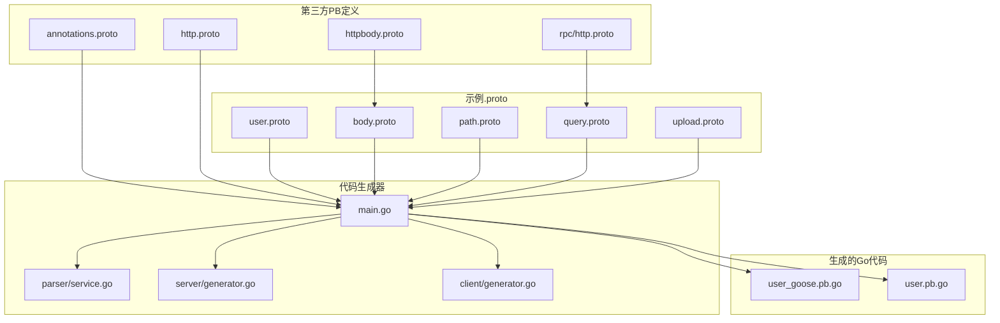
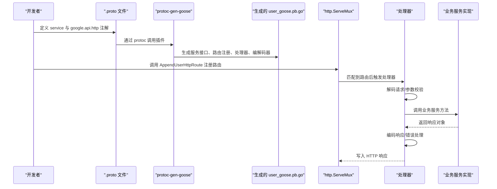
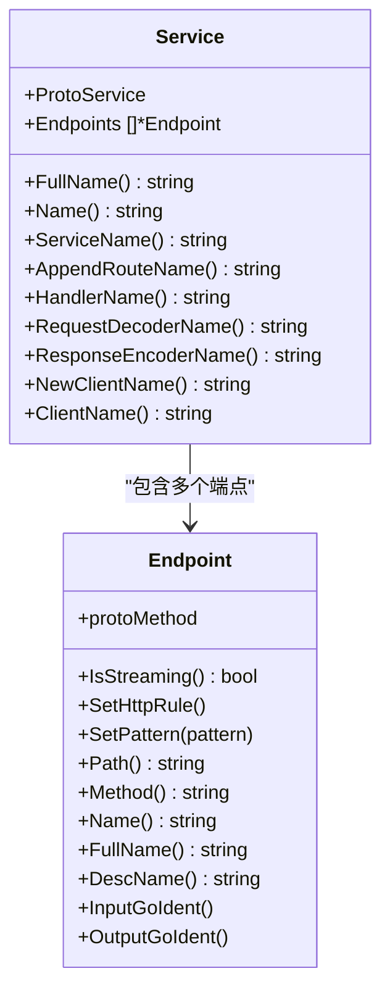
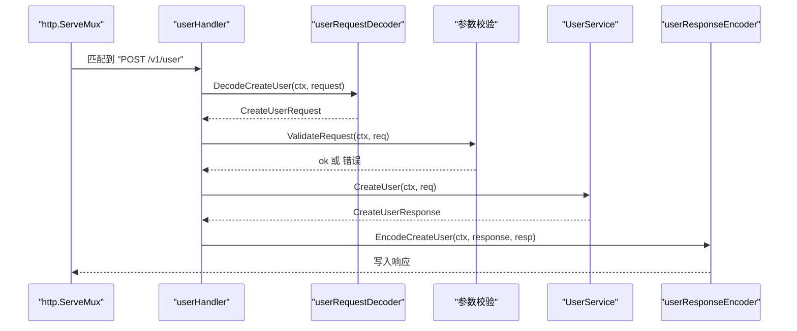
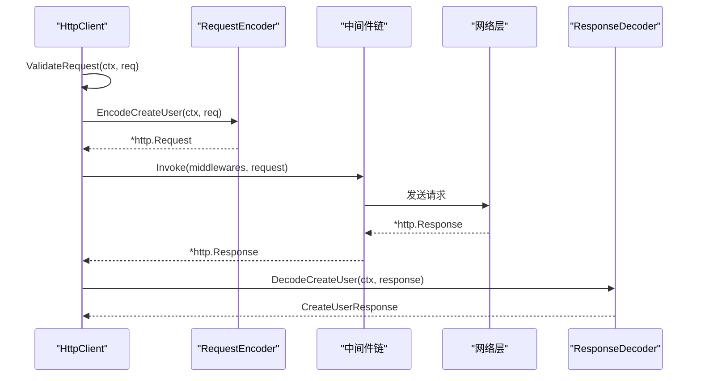
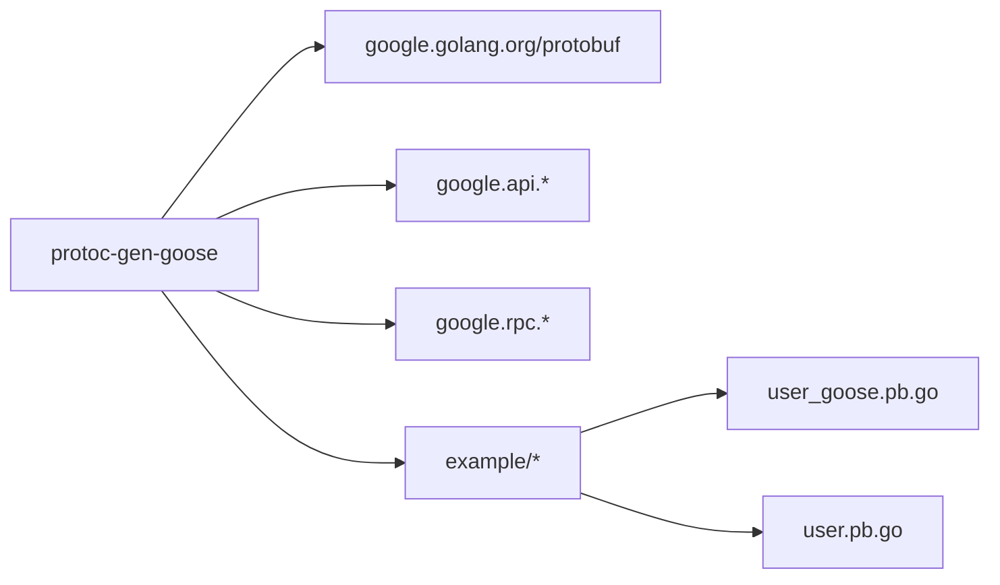

# Protocol Buffers 基础

<cite>
**本文引用的文件**
- [cmd/protoc-gen-goose/main.go](file://cmd/protoc-gen-goose/main.go)
- [cmd/protoc-gen-goose/parser/service.go](file://cmd/protoc-gen-goose/parser/service.go)
- [cmd/protoc-gen-goose/server/generator.go](file://cmd/protoc-gen-goose/server/generator.go)
- [cmd/protoc-gen-goose/client/generator.go](file://cmd/protoc-gen-goose/client/generator.go)
- [third_party/google/api/annotations.proto](file://third_party/google/api/annotations.proto)
- [third_party/google/api/http.proto](file://third_party/google/api/http.proto)
- [third_party/google/api/httpbody.proto](file://third_party/google/api/httpbody.proto)
- [third_party/google/rpc/http.proto](file://third_party/google/rpc/http.proto)
- [example/user/user.proto](file://example/user/user.proto)
- [example/body/body.proto](file://example/body/body.proto)
- [example/path/path.proto](file://example/path/path.proto)
- [example/query/query.proto](file://example/query/query.proto)
- [example/upload/upload.proto](file://example/upload/upload.proto)
- [example/user/user_goose.pb.go](file://example/user/user_goose.pb.go)
- [example/user/user.pb.go](file://example/user/user.pb.go)
</cite>

## 目录
1. [引言](#引言)
2. [项目结构](#项目结构)
3. [核心组件](#核心组件)
4. [架构总览](#架构总览)
5. [详细组件分析](#详细组件分析)
6. [依赖分析](#依赖分析)
7. [性能考虑](#性能考虑)
8. [故障排查指南](#故障排查指南)
9. [结论](#结论)
10. [附录](#附录)

## 引言
本篇文档系统性介绍 Protocol Buffers（简称 PB）的基础知识，并结合 Goose 框架在仓库中的实现，讲解如何在 .proto 中定义消息与服务、如何通过注解将 RPC 映射为 HTTP REST 接口，以及 Goose 如何基于这些元信息自动生成服务端路由、请求/响应编解码器与客户端调用代码。同时给出常见 .proto 结构范式与最佳实践，帮助读者快速上手并正确使用。

## 项目结构
本仓库围绕“以 .proto 描述服务契约，借助 protoc-gen-goose 自动生成 HTTP 映射与 Go 代码”的模式组织：
- 第三方 PB 定义：位于 third_party/google/api 与 third_party/google/rpc，提供 HTTP 注解、HTTP 请求/响应体等标准类型。
- 示例 .proto：位于 example/*，演示不同场景下的消息与服务定义，如用户管理、请求体映射、路径参数、查询参数、上传等。
- 代码生成器：cmd/protoc-gen-goose，解析 .proto 中的服务与注解，生成 Goose 所需的服务接口、路由注册函数、处理器、编解码器与客户端代码。
- 运行时支持：框架内置的 server、client、decoder、encoder 等模块，配合生成代码完成运行时处理。

图表来源
- [cmd/protoc-gen-goose/main.go:1-126](file://cmd/protoc-gen-goose/main.go#L1-L126)
- [cmd/protoc-gen-goose/parser/service.go:1-90](file://cmd/protoc-gen-goose/parser/service.go#L1-L90)
- [cmd/protoc-gen-goose/server/generator.go:1-82](file://cmd/protoc-gen-goose/server/generator.go#L1-L82)
- [cmd/protoc-gen-goose/client/generator.go:1-69](file://cmd/protoc-gen-goose/client/generator.go#L1-L69)
- [third_party/google/api/annotations.proto:1-32](file://third_party/google/api/annotations.proto#L1-L32)
- [third_party/google/api/http.proto:1-319](file://third_party/google/api/http.proto#L1-L319)
- [third_party/google/api/httpbody.proto:1-82](file://third_party/google/api/httpbody.proto#L1-L82)
- [third_party/google/rpc/http.proto:1-65](file://third_party/google/rpc/http.proto#L1-L65)
- [example/user/user.proto:1-111](file://example/user/user.proto#L1-L111)
- [example/user/user_goose.pb.go:1-200](file://example/user/user_goose.pb.go#L1-L200)
- [example/user/user.pb.go:1-200](file://example/user/user.pb.go#L1-L200)

章节来源
- [cmd/protoc-gen-goose/main.go:1-126](file://cmd/protoc-gen-goose/main.go#L1-L126)
- [example/user/user.proto:1-111](file://example/user/user.proto#L1-L111)

## 核心组件
- 协议注解与规则
  - annotations.proto 提供对 MethodOptions 的扩展，允许在 RPC 上添加 google.api.http 注解。
  - http.proto 定义 Http 与 HttpRule，描述 RPC 到 HTTP REST 的映射规则，包括路径模板、HTTP 方法、请求体映射、附加绑定等。
- 示例 .proto
  - user.proto 展示典型的 CRUD 场景，包含 GET/POST/PUT/PATCH/DELETE 的路径与 body 映射。
  - body.proto 展示 body:* 与 body:"field" 的两种映射方式，以及直接使用 google.api.HttpBody 的场景。
  - path.proto 展示将多种基础类型（布尔、整型、浮点、字符串、枚举）映射到路径段的实践。
  - query.proto 展示将基础类型与可选值、包装类型、数组映射到查询参数的实践。
  - upload.proto 展示上传场景，支持原生 HttpBody 与封装后的 HttpBodyRequest。
- 生成器与运行时
  - main.go 负责遍历文件、解析服务、生成服务接口、路由注册函数、处理器、编解码器与客户端代码；可选生成 OpenAPI 文档。
  - parser/service.go 将 protogen.Service 解析为内部 Service/Endpoint 结构，提取 HTTP 规则与路径模式。
  - server/generator.go 生成服务端路由注册与处理器，负责请求解码、参数校验、调用业务服务、响应编码与错误处理。
  - client/generator.go 生成客户端构造器与调用方法，负责请求编码、中间件链、调用远端服务与响应解码。

章节来源
- [third_party/google/api/annotations.proto:28-31](file://third_party/google/api/annotations.proto#L28-L31)
- [third_party/google/api/http.proto:30-319](file://third_party/google/api/http.proto#L30-L319)
- [example/user/user.proto:7-62](file://example/user/user.proto#L7-L62)
- [example/body/body.proto:10-51](file://example/body/body.proto#L10-L51)
- [example/path/path.proto:9-154](file://example/path/path.proto#L9-L154)
- [example/query/query.proto:9-174](file://example/query/query.proto#L9-L174)
- [example/upload/upload.proto:9-30](file://example/upload/upload.proto#L9-L30)
- [cmd/protoc-gen-goose/main.go:38-101](file://cmd/protoc-gen-goose/main.go#L38-L101)
- [cmd/protoc-gen-goose/parser/service.go:63-89](file://cmd/protoc-gen-goose/parser/service.go#L63-L89)
- [cmd/protoc-gen-goose/server/generator.go:13-81](file://cmd/protoc-gen-goose/server/generator.go#L13-L81)
- [cmd/protoc-gen-goose/client/generator.go:11-68](file://cmd/protoc-gen-goose/client/generator.go#L11-L68)

## 架构总览
下图展示了从 .proto 到运行时的完整流程：.proto 定义服务与注解 → protoc-gen-goose 解析 → 生成服务接口与路由 → 运行时按路由分发到处理器 → 处理器调用业务服务并返回结果。

图表来源
- [cmd/protoc-gen-goose/main.go:38-101](file://cmd/protoc-gen-goose/main.go#L38-L101)
- [cmd/protoc-gen-goose/server/generator.go:13-81](file://cmd/protoc-gen-goose/server/generator.go#L13-L81)
- [example/user/user_goose.pb.go:27-53](file://example/user/user_goose.pb.go#L27-L53)

## 详细组件分析

### 组件一：HTTP 注解与映射规则
- 注解扩展
  - annotations.proto 在 MethodOptions 上扩展了 http 字段，用于承载 HttpRule。
- 映射规则
  - http.proto 定义 HttpRule 的 pattern（get/put/post/delete/patch/custom）、body、response_body、additional_bindings 等。
  - 支持路径变量、查询参数、请求体映射；支持 body="*" 表示将未绑定到路径的字段映射到请求体。
- 实战示例
  - user.proto 中的 CreateUser 使用 body:"*" 将整个请求体映射到 RPC 参数。
  - path.proto 将多种基础类型映射到路径段，验证路径参数的可读性与约束。
  - query.proto 将基础类型、可选值、包装类型与数组映射到查询参数，覆盖复杂参数组合。

章节来源
- [third_party/google/api/annotations.proto:28-31](file://third_party/google/api/annotations.proto#L28-L31)
- [third_party/google/api/http.proto:262-319](file://third_party/google/api/http.proto#L262-L319)
- [example/user/user.proto:11-16](file://example/user/user.proto#L11-L16)
- [example/path/path.proto:11-14](file://example/path/path.proto#L11-L14)
- [example/query/query.proto:11-14](file://example/query/query.proto#L11-L14)

### 组件二：服务解析与端点建模
- 解析流程
  - parser/service.go 将 protogen.Service 转换为内部 Service/Endpoint，提取每个方法的 HTTP 规则与路径模式。
  - 对于流式 RPC（server-side streaming、client-side streaming、bidirectional streaming），生成器会拒绝处理并报错。
- 关键能力
  - 从注解中读取 HttpRule，解析路径模板，构建 Endpoint 结构，便于后续生成路由与编解码逻辑。

图表来源
- [cmd/protoc-gen-goose/parser/service.go:10-89](file://cmd/protoc-gen-goose/parser/service.go#L10-L89)

章节来源
- [cmd/protoc-gen-goose/parser/service.go:63-89](file://cmd/protoc-gen-goose/parser/service.go#L63-L89)

### 组件三：服务端生成与路由注册
- 生成内容
  - 生成服务接口 UserService 与处理器 userHandler。
  - 生成 AppendUserHttpRoute 函数，将 HTTP 方法与路径注册到 http.ServeMux。
  - 生成请求解码器、响应编码器与错误编码器，统一处理参数校验、序列化与错误返回。
- 运行时行为
  - 处理器先解码请求，执行参数校验，再调用业务服务，最后编码响应或错误。

图表来源
- [cmd/protoc-gen-goose/server/generator.go:13-81](file://cmd/protoc-gen-goose/server/generator.go#L13-L81)
- [example/user/user_goose.pb.go:65-88](file://example/user/user_goose.pb.go#L65-L88)

章节来源
- [cmd/protoc-gen-goose/server/generator.go:13-81](file://cmd/protoc-gen-goose/server/generator.go#L13-L81)
- [example/user/user_goose.pb.go:27-53](file://example/user/user_goose.pb.go#L27-L53)

### 组件四：客户端生成与调用链
- 生成内容
  - 生成 NewUserHttpClient 构造器与 HttpClient 结构体。
  - 为每个端点生成调用方法，负责参数校验、请求编码、中间件链、远程调用与响应解码。
- 调用流程
  - 客户端方法先进行参数校验，再编码请求，通过中间件链发送到目标地址，最后解码响应。

图表来源
- [cmd/protoc-gen-goose/client/generator.go:11-68](file://cmd/protoc-gen-goose/client/generator.go#L11-L68)

章节来源
- [cmd/protoc-gen-goose/client/generator.go:11-68](file://cmd/protoc-gen-goose/client/generator.go#L11-L68)

### 组件五：请求体映射与特殊类型
- body:* 与 body:"field"
  - body:"*" 表示将未被路径模板捕获的字段映射到请求体。
  - body:"field" 表示仅将指定字段映射到请求体。
- 特殊类型
  - google.api.HttpBody 可携带 content_type 与 data，适用于非 JSON 的原始二进制或 HTML 页面。
  - google.rpc.HttpRequest/HttpResponse 可用于更灵活地表达 HTTP 请求/响应细节。

章节来源
- [example/body/body.proto:11-29](file://example/body/body.proto#L11-L29)
- [example/upload/upload.proto:10-29](file://example/upload/upload.proto#L10-L29)
- [third_party/google/api/httpbody.proto:71-81](file://third_party/google/api/httpbody.proto#L71-L81)
- [third_party/google/rpc/http.proto:26-55](file://third_party/google/rpc/http.proto#L26-L55)

### 组件六：路径参数与查询参数映射
- 路径参数
  - 将布尔、整型、浮点、字符串、枚举等基础类型映射到路径段，验证类型与可选性。
- 查询参数
  - 将基础类型、可选值、包装类型与数组映射到查询参数，支持重复项与可选值。

章节来源
- [example/path/path.proto:9-154](file://example/path/path.proto#L9-L154)
- [example/query/query.proto:9-174](file://example/query/query.proto#L9-L174)

## 依赖分析
- 外部依赖
  - google.golang.org/protobuf：提供 protogen、descriptor、json 编解码等。
  - google.api.* 与 google.rpc.*：提供 HTTP 注解与通用 HTTP 类型。
- 内部依赖
  - cmd/protoc-gen-goose 依赖 third_party 的注解与规则，解析 .proto 并生成 example/* 与运行时所需的代码。
  - example/* 依赖生成的 user_goose.pb.go 与 user.pb.go，前者由 protoc-gen-goose 生成，后者由 protoc-gen-go 生成。

图表来源
- [cmd/protoc-gen-goose/main.go:3-17](file://cmd/protoc-gen-goose/main.go#L3-L17)
- [third_party/google/api/http.proto:15-25](file://third_party/google/api/http.proto#L15-L25)
- [third_party/google/rpc/http.proto:15-24](file://third_party/google/rpc/http.proto#L15-L24)
- [example/user/user_goose.pb.go:1-16](file://example/user/user_goose.pb.go#L1-L16)
- [example/user/user.pb.go:1-16](file://example/user/user.pb.go#L1-L16)

章节来源
- [cmd/protoc-gen-goose/main.go:3-17](file://cmd/protoc-gen-goose/main.go#L3-L17)
- [third_party/google/api/http.proto:15-25](file://third_party/google/api/http.proto#L15-L25)
- [third_party/google/rpc/http.proto:15-24](file://third_party/google/rpc/http.proto#L15-L24)
- [example/user/user_goose.pb.go:1-16](file://example/user/user_goose.pb.go#L1-L16)
- [example/user/user.pb.go:1-16](file://example/user/user.pb.go#L1-L16)

## 性能考虑
- 编解码性能
  - 使用 protojson 进行 JSON 编解码，建议在高并发场景下关注内存分配与序列化开销，必要时采用二进制协议或优化序列化选项。
- 路由匹配
  - ServeMux 的路由匹配为线性扫描，建议合理规划路径模板，避免过多重叠与通配，减少匹配成本。
- 参数校验
  - 在处理器与客户端均执行参数校验，前置校验可降低无效请求进入业务逻辑的概率，提升整体吞吐。
- 中间件链
  - 中间件链顺序影响性能与可观测性，建议将耗时操作（如限流、鉴权）置于链路前端，日志与指标采集放在靠近末端。

## 故障排查指南
- 流式 RPC 不受支持
  - 若 .proto 中存在流式方法，生成器会直接报错并拒绝生成，需改为双向交互或改用其他传输方案。
- 路径模板解析失败
  - 当路径模板不符合规范或字段类型不满足映射要求时，解析阶段会报错，需检查注解与字段类型。
- 请求体映射冲突
  - 使用 body:"*" 时，若还存在额外查询参数，需确保未被路径捕获的字段不会与查询参数冲突。
- 错误编码与回调
  - 处理器与客户端均支持错误编码器与校验错误回调，可通过配置统一错误格式与日志策略，便于定位问题。

章节来源
- [cmd/protoc-gen-goose/parser/service.go:74-77](file://cmd/protoc-gen-goose/parser/service.go#L74-L77)
- [cmd/protoc-gen-goose/main.go:74-77](file://cmd/protoc-gen-goose/main.go#L74-L77)
- [cmd/protoc-gen-goose/server/generator.go:58-64](file://cmd/protoc-gen-goose/server/generator.go#L58-L64)
- [cmd/protoc-gen-goose/client/generator.go:48-50](file://cmd/protoc-gen-goose/client/generator.go#L48-L50)

## 结论
通过 Protocol Buffers 与 HTTP 注解，Goose 将服务契约与 HTTP 映射统一在 .proto 中表达，借助 protoc-gen-goose 自动生成服务接口、路由、处理器与客户端代码，显著降低了 REST API 开发的样板代码与一致性成本。结合合理的消息设计、清晰的注解配置与完善的参数校验，可在保证性能的同时提升开发效率与可维护性。

## 附录

### 常见 .proto 结构与最佳实践
- 消息设计
  - 使用明确的字段类型与语义命名，避免嵌套过深导致路径模板复杂。
  - 对可选字段与包装类型（如 Int32Value）保持一致的使用策略，便于查询参数映射。
- 服务与注解
  - 为每个 RPC 配置清晰的 google.api.http 注解，优先使用路径模板表达资源标识，使用 body:"field" 或 body:"*" 控制请求体映射。
  - 对于复杂查询条件，尽量通过查询参数传递，避免路径过长或模板过于复杂。
- 示例参考
  - 用户管理：参考 user.proto 的 CRUD 映射与 body:"*" 的使用。
  - 请求体映射：参考 body.proto 的多种 body 映射方式与 HttpBody 的使用。
  - 路径参数：参考 path.proto 的多类型路径映射。
  - 查询参数：参考 query.proto 的多类型查询映射。
  - 上传场景：参考 upload.proto 的 HttpBody 与封装请求体。

章节来源
- [example/user/user.proto:7-62](file://example/user/user.proto#L7-L62)
- [example/body/body.proto:10-51](file://example/body/body.proto#L10-L51)
- [example/path/path.proto:9-154](file://example/path/path.proto#L9-L154)
- [example/query/query.proto:9-174](file://example/query/query.proto#L9-L174)
- [example/upload/upload.proto:9-30](file://example/upload/upload.proto#L9-L30)