# 中间件模式设计

<cite>
**本文档引用的文件**
- [client/middleware.go](file://client/middleware.go)
- [server/middleware.go](file://server/middleware.go)
- [middleware/accesslog/middleware.go](file://middleware/accesslog/middleware.go)
- [middleware/basicauth/middleware.go](file://middleware/basicauth/middleware.go)
- [middleware/context/middleware.go](file://middleware/context/middleware.go)
- [middleware/cors/middleware.go](file://middleware/cors/middleware.go)
- [middleware/errorlog/middleware.go](file://middleware/errorlog/middleware.go)
- [middleware/recovery/middleware.go](file://middleware/recovery/middleware.go)
- [middleware/timeout/middleware.go](file://middleware/timeout/middleware.go)
- [middleware/redirect/middleware.go](file://middleware/redirect/middleware.go)
- [common.go](file://common.go)
- [route.go](file://route.go)
- [client/middleware_test.go](file://client/middleware_test.go)
- [server/middleware_test.go](file://server/middleware_test.go)
- [middleware/cors/option.go](file://middleware/cors/option.go)
- [middleware/errorlog/option.go](file://middleware/errorlog/option.go)
</cite>

## 目录
1. [引言](#引言)
2. [项目结构](#项目结构)
3. [核心组件](#核心组件)
4. [架构总览](#架构总览)
5. [详细组件分析](#详细组件分析)
6. [依赖分析](#依赖分析)
7. [性能考量](#性能考量)
8. [故障排查指南](#故障排查指南)
9. [结论](#结论)
10. [附录](#附录)

## 引言
本文件系统性阐述 Goose 项目中的中间件模式设计思想与实现原理，涵盖中间件基本概念、执行顺序、链式调用机制、接口设计、上下文传递、错误处理等关键点，并通过多个实际中间件示例展示其在服务器端与客户端的差异与共同点。同时，文档对比了传统中间件模式与装饰器模式的区别，给出中间件开发最佳实践，包括性能优化、错误传播与上下文管理策略。

## 项目结构
Goose 将中间件分为两类：服务器端中间件与客户端中间件，分别定义在 server 与 client 包中。每个中间件包提供统一的链式组合与调用入口，同时内置若干常用中间件（如访问日志、基础认证、CORS、错误日志、恢复、超时、重定向等）。公共能力通过 goose 包注入上下文信息（如路由信息、请求头）。

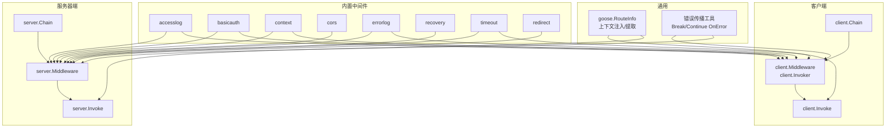

图示来源
- [client/middleware.go:1-99](file://client/middleware.go#L1-L99)
- [server/middleware.go:1-85](file://server/middleware.go#L1-L85)
- [middleware/accesslog/middleware.go:1-318](file://middleware/accesslog/middleware.go#L1-L318)
- [middleware/basicauth/middleware.go:1-113](file://middleware/basicauth/middleware.go#L1-L113)
- [middleware/context/middleware.go:1-35](file://middleware/context/middleware.go#L1-L35)
- [middleware/cors/middleware.go:1-249](file://middleware/cors/middleware.go#L1-L249)
- [middleware/errorlog/middleware.go:1-195](file://middleware/errorlog/middleware.go#L1-L195)
- [middleware/recovery/middleware.go:1-55](file://middleware/recovery/middleware.go#L1-L55)
- [middleware/timeout/middleware.go:1-107](file://middleware/timeout/middleware.go#L1-L107)
- [middleware/redirect/middleware.go:1-22](file://middleware/redirect/middleware.go#L1-L22)
- [common.go:1-51](file://common.go#L1-L51)
- [route.go:1-26](file://route.go#L1-L26)

章节来源
- [client/middleware.go:1-99](file://client/middleware.go#L1-L99)
- [server/middleware.go:1-85](file://server/middleware.go#L1-L85)
- [route.go:1-26](file://route.go#L1-L26)

## 核心组件
- 客户端中间件接口与链式调用
  - 定义 Invoker 与 Middleware 类型，支持链式组合与递归 invoker 构造，最终调用 http.Client.Do。
  - 提供 Chain 与 Invoke，支持空中间件链返回 nil，单个中间件直接返回该中间件，多中间件构建嵌套 invoker 链。
- 服务器端中间件接口与链式调用
  - 定义 Middleware 与 http.HandlerFunc 形式的 invoker，支持链式组合与递归 invoker 构造，最终调用业务处理器。
  - 提供 Chain 与 Invoke，支持空中间件链返回 nil，单个中间件直接返回该中间件，多中间件构建嵌套 invoker 链。
- 上下文与路由信息
  - goose 包提供 RouteInfo 结构与上下文注入/提取方法，服务器端 Invoke 在进入中间件前将 RouteInfo 与请求头注入上下文，便于中间件读取。
- 错误传播工具
  - common 包提供 BreakOnError 与 ContinueOnError，用于在中间件链中控制错误的中断与合并传播。

章节来源
- [client/middleware.go:9-99](file://client/middleware.go#L9-L99)
- [server/middleware.go:9-85](file://server/middleware.go#L9-L85)
- [route.go:17-26](file://route.go#L17-L26)
- [common.go:14-50](file://common.go#L14-L50)

## 架构总览
中间件模式采用“职责链”思想：每个中间件负责特定横切关注点（鉴权、日志、限流、超时、CORS 等），通过链式组合按序执行。服务器端与客户端共享相同的链式调用骨架，但具体中间件实现针对各自场景定制。

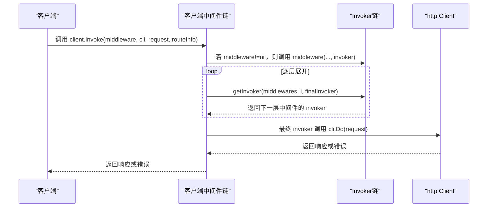

图示来源
- [client/middleware.go:35-99](file://client/middleware.go#L35-L99)

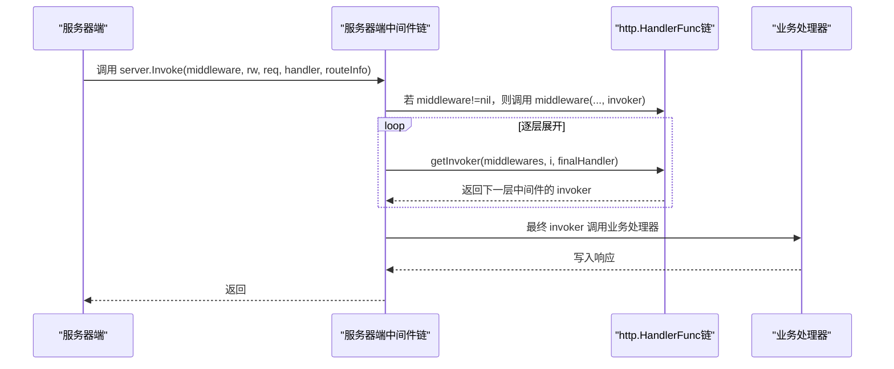

图示来源
- [server/middleware.go:19-85](file://server/middleware.go#L19-L85)

## 详细组件分析

### 客户端中间件链式调用机制
- 接口设计
  - Invoker：封装对 http.Client 的一次请求调用。
  - Middleware：接收 http.Client、*http.Request 与下一个 Invoker，返回响应或错误。
- 链式组合
  - Chain 支持零、一、多中间件情况；多中间件时通过递归 getInvoker 构造 invoker 链，形成“外层先执行，内层后执行”的顺序。
- 调用流程
  - Invoke 将 RouteInfo 注入请求上下文，若 middleware 为 nil 则直接调用 http.Client.Do，否则调用 middleware(...) 并传入最终 invoker。

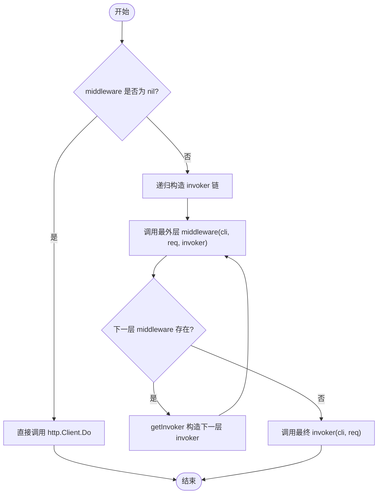

图示来源
- [client/middleware.go:35-99](file://client/middleware.go#L35-L99)

章节来源
- [client/middleware.go:9-99](file://client/middleware.go#L9-L99)
- [client/middleware_test.go:33-212](file://client/middleware_test.go#L33-L212)

### 服务器端中间件链式调用机制
- 接口设计
  - Middleware：接收 http.ResponseWriter、*http.Request 与下一个 http.HandlerFunc。
- 链式组合
  - Chain 与 getInvoker 的实现与客户端一致，保证执行顺序为“外层先执行，内层后执行”。
- 调用流程
  - Invoke 在进入中间件前将 RouteInfo 与请求头注入上下文，随后根据 middleware 是否为 nil 决定直接调用最终处理器或进入中间件链。

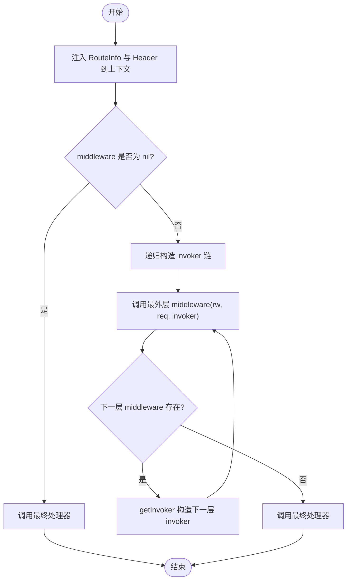

图示来源
- [server/middleware.go:65-85](file://server/middleware.go#L65-L85)

章节来源
- [server/middleware.go:9-85](file://server/middleware.go#L9-L85)
- [server/middleware_test.go:18-68](file://server/middleware_test.go#L18-L68)

### 基础认证中间件（BasicAuth）
- 服务器端
  - 解析 Authorization 头，校验凭据；校验失败设置 WWW-Authenticate 并返回 401；校验成功将用户名注入上下文，再调用后续处理器。
- 客户端
  - 将用户名密码设置到 request.URL.User，然后调用下一个 invoker。

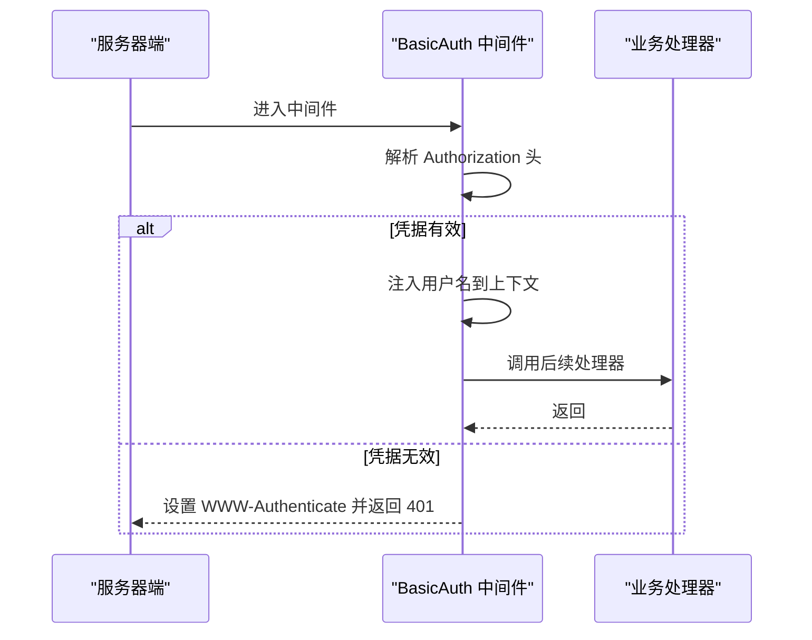

图示来源
- [middleware/basicauth/middleware.go:55-69](file://middleware/basicauth/middleware.go#L55-L69)

章节来源
- [middleware/basicauth/middleware.go:1-113](file://middleware/basicauth/middleware.go#L1-L113)

### 访问日志中间件（AccessLog）
- 服务器端
  - 记录起始时间、请求体（可选）、包装 ResponseWriter 捕获状态码与响应体（可选），调用后续处理器，最后统一记录日志（包含延迟、路径、状态码、请求头等）。
- 客户端
  - 记录起始时间，调用下一个 invoker，计算延迟，记录请求与响应信息（含错误）。

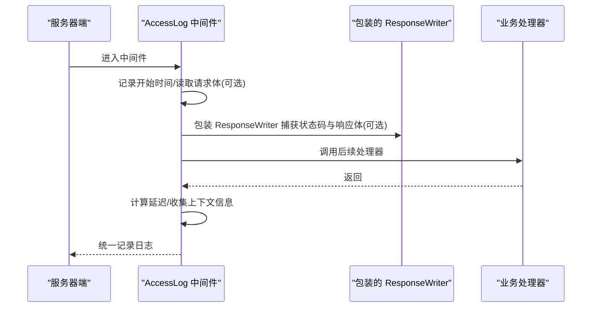

图示来源
- [middleware/accesslog/middleware.go:116-204](file://middleware/accesslog/middleware.go#L116-L204)

章节来源
- [middleware/accesslog/middleware.go:1-318](file://middleware/accesslog/middleware.go#L1-L318)

### CORS 中间件
- 服务器端
  - 处理预检（OPTIONS）与实际请求，根据 AllowedOrigins、AllowedMethods、AllowedHeaders 等配置决定是否允许并设置相应头。
  - 支持通配符匹配与自定义 Origin 校验函数。

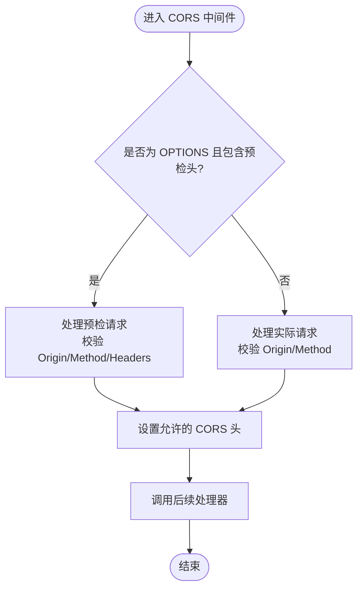

图示来源
- [middleware/cors/middleware.go:147-160](file://middleware/cors/middleware.go#L147-L160)

章节来源
- [middleware/cors/middleware.go:1-249](file://middleware/cors/middleware.go#L1-L249)
- [middleware/cors/option.go:1-105](file://middleware/cors/option.go#L1-L105)

### 错误日志中间件（ErrorLog）
- 服务器端
  - 包装 ResponseWriter 捕获状态码与响应体，若状态码 ≥ 400 则记录错误日志（可选打印请求/响应体）。
- 客户端
  - 记录请求体（可选），调用 invoker 后检查错误或状态码 ≥ 400，记录错误日志（可选打印请求/响应体）。

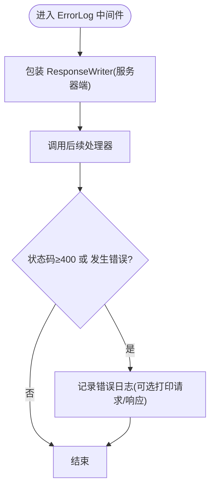

图示来源
- [middleware/errorlog/middleware.go:24-58](file://middleware/errorlog/middleware.go#L24-L58)

章节来源
- [middleware/errorlog/middleware.go:1-195](file://middleware/errorlog/middleware.go#L1-L195)
- [middleware/errorlog/option.go:1-60](file://middleware/errorlog/option.go#L1-L60)

### 恢复中间件（Recovery）
- 服务器端
  - 使用 defer 捕获 panic，调用自定义或默认处理器记录 panic 信息与堆栈，然后继续传播。

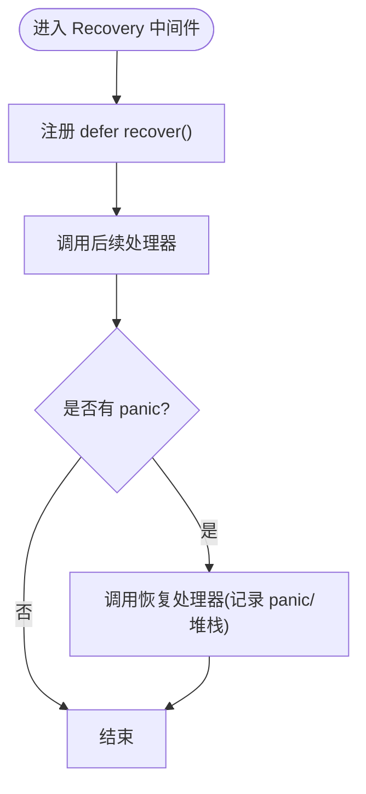

图示来源
- [middleware/recovery/middleware.go:38-50](file://middleware/recovery/middleware.go#L38-L50)

章节来源
- [middleware/recovery/middleware.go:1-55](file://middleware/recovery/middleware.go#L1-L55)

### 超时中间件（Timeout）
- 服务器端
  - 从请求头读取客户端声明的超时，取较小值作为服务端超时，创建带超时的上下文并注入请求，调用后续处理器。
- 客户端
  - 从上下文 deadline 计算剩余时间，取较小值作为客户端超时，设置请求头并创建带超时的上下文，调用下一个 invoker。

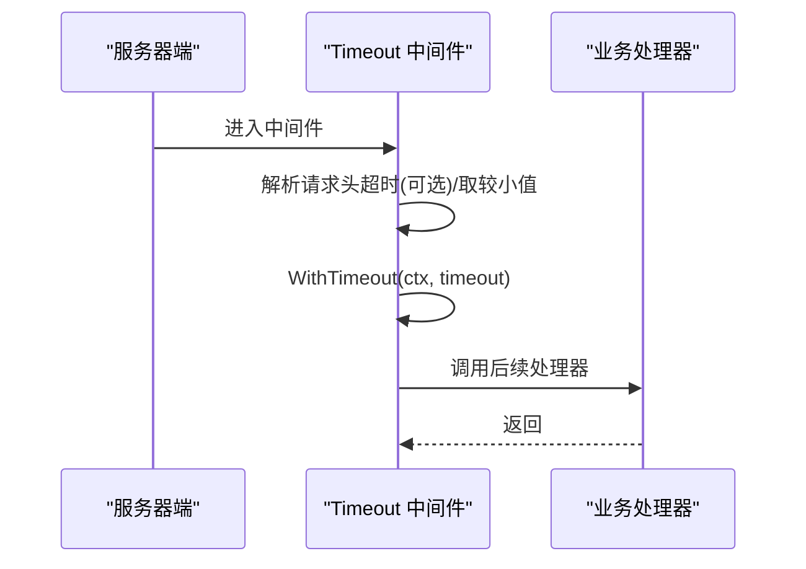

图示来源
- [middleware/timeout/middleware.go:28-59](file://middleware/timeout/middleware.go#L28-L59)

章节来源
- [middleware/timeout/middleware.go:1-107](file://middleware/timeout/middleware.go#L1-L107)

### 重定向中间件（Redirect）
- 服务器端
  - 若请求协议非 HTTPS 且未携带特定头指示为 HTTPS，则重定向至 https://host/path。

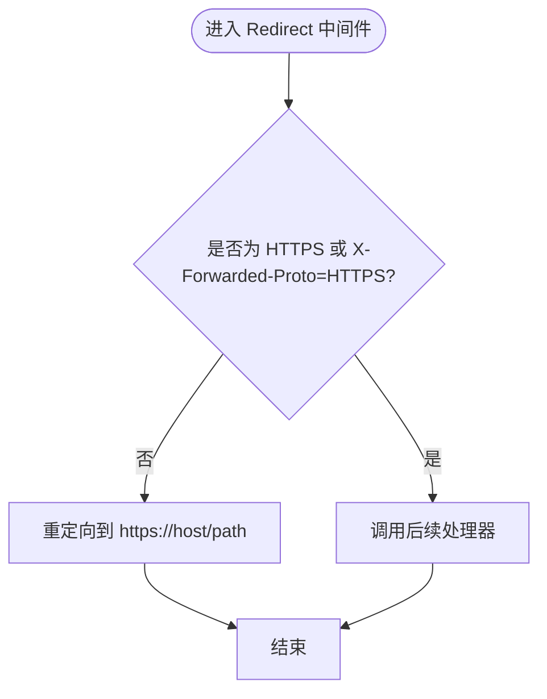

图示来源
- [middleware/redirect/middleware.go:9-22](file://middleware/redirect/middleware.go#L9-L22)

章节来源
- [middleware/redirect/middleware.go:1-22](file://middleware/redirect/middleware.go#L1-L22)

### 上下文与路由信息传递
- RouteInfo 注入与提取
  - 服务器端 Invoke 在进入中间件前将 RouteInfo 与请求头注入上下文，中间件可通过 ExtractRouteInfo 获取路由信息。
- Context 中间件
  - 提供 ContextFunc，允许在中间件中修改上下文并回写到请求。

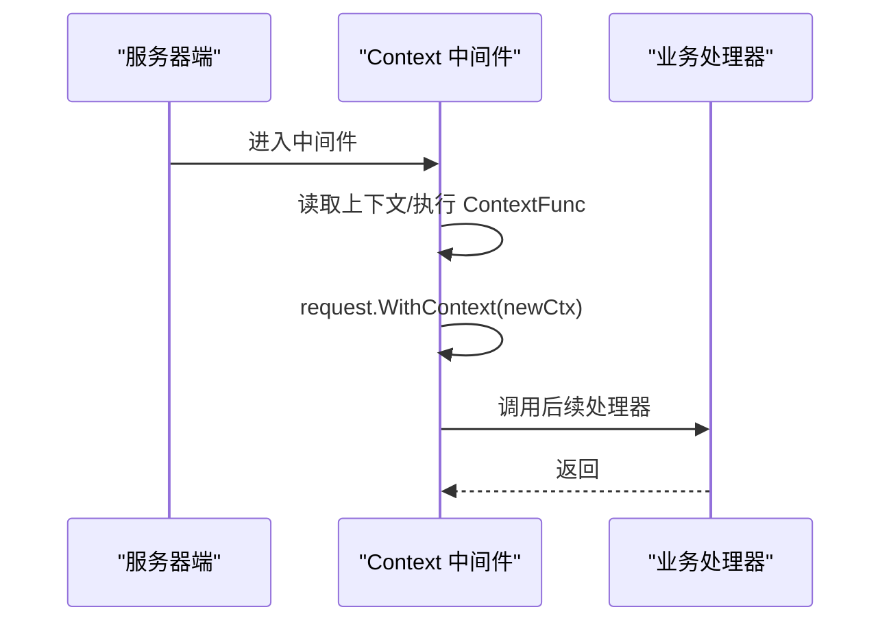

图示来源
- [middleware/context/middleware.go:13-34](file://middleware/context/middleware.go#L13-L34)
- [server/middleware.go:76-78](file://server/middleware.go#L76-L78)

章节来源
- [route.go:17-26](file://route.go#L17-L26)
- [middleware/context/middleware.go:1-35](file://middleware/context/middleware.go#L1-L35)

### 错误传播与合并
- BreakOnError
  - 若已有错误则直接短路返回，不再执行后续函数。
- ContinueOnError
  - 先执行函数，再根据已有错误进行合并或返回，支持多错误合并。

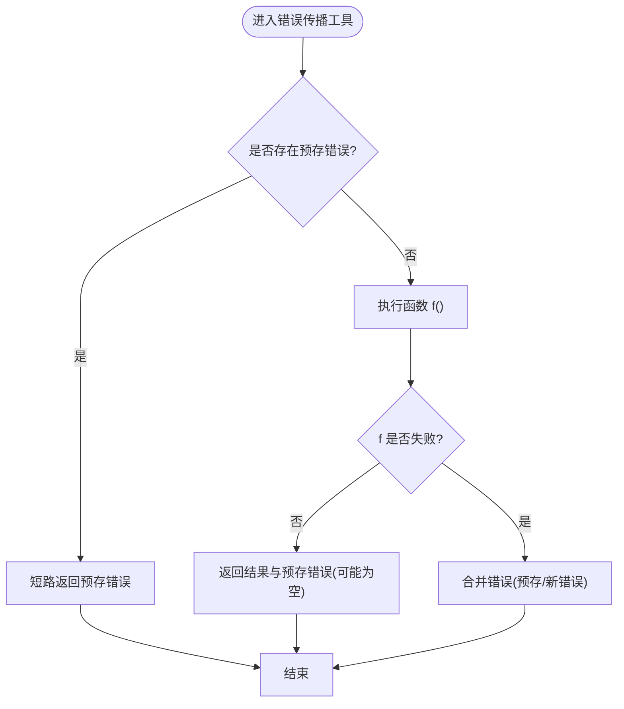

图示来源
- [common.go:14-50](file://common.go#L14-L50)

章节来源
- [common.go:1-51](file://common.go#L1-L51)

## 依赖分析
- 客户端与服务器端中间件共享相同的链式调用骨架，但具体中间件实现针对各自场景定制。
- 内置中间件之间无直接耦合，通过统一接口与链式组合解耦。
- goose 包提供公共上下文能力（RouteInfo 注入/提取）与错误传播工具，被各中间件广泛使用。

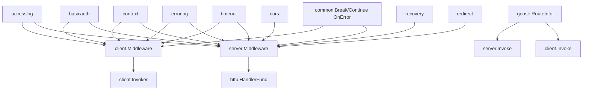

图示来源
- [client/middleware.go:9-99](file://client/middleware.go#L9-L99)
- [server/middleware.go:9-85](file://server/middleware.go#L9-L85)
- [middleware/accesslog/middleware.go:1-318](file://middleware/accesslog/middleware.go#L1-L318)
- [middleware/basicauth/middleware.go:1-113](file://middleware/basicauth/middleware.go#L1-L113)
- [middleware/context/middleware.go:1-35](file://middleware/context/middleware.go#L1-L35)
- [middleware/cors/middleware.go:1-249](file://middleware/cors/middleware.go#L1-L249)
- [middleware/errorlog/middleware.go:1-195](file://middleware/errorlog/middleware.go#L1-L195)
- [middleware/recovery/middleware.go:1-55](file://middleware/recovery/middleware.go#L1-L55)
- [middleware/timeout/middleware.go:1-107](file://middleware/timeout/middleware.go#L1-L107)
- [middleware/redirect/middleware.go:1-22](file://middleware/redirect/middleware.go#L1-L22)
- [common.go:14-50](file://common.go#L14-L50)
- [route.go:17-26](file://route.go#L17-L26)

章节来源
- [client/middleware.go:1-99](file://client/middleware.go#L1-L99)
- [server/middleware.go:1-85](file://server/middleware.go#L1-L85)

## 性能考量
- invoker 构造
  - 递归 getInvoker 构造 invoker 链，避免在热路径上分配过多对象；可在中间件内部缓存或复用临时结构（如 accesslog 中的 slog.Attr 切片池）。
- 日志与 I/O
  - 访问日志与错误日志在需要时才读取请求/响应体，避免不必要的内存拷贝与 I/O。
- 上下文与反射
  - accesslog 对请求的反射访问存在风险，应谨慎使用并在异常时进行保护（已通过 recover 与错误日志记录）。
- 超时与并发
  - Timeout 中间件基于请求头或上下文 deadline 计算超时，注意避免过小的超时导致频繁超时；合理设置最大超时以平衡性能与可靠性。

## 故障排查指南
- 中间件未生效
  - 检查是否正确调用 server.Invoke 或 client.Invoke，并确保 middleware 不为 nil。
- 执行顺序异常
  - 确认 Chain 的参数顺序即为执行顺序；客户端与服务器端的链式展开方向一致。
- 日志缺失
  - 确认 accesslog 与 errorlog 的打印开关（printRequest/printResponse）已启用；检查日志级别与输出目标。
- CORS 不生效
  - 检查 AllowedOrigins、AllowedMethods、AllowedHeaders 配置；确认预检请求头是否完整。
- 超时问题
  - 检查请求头 X-Leo-Timeout 与客户端上下文 deadline；确认服务端与客户端超时取较小值逻辑。
- Panic 导致崩溃
  - 确保已安装 recovery 中间件；检查恢复处理器是否正确记录堆栈信息。

章节来源
- [server/middleware_test.go:18-68](file://server/middleware_test.go#L18-L68)
- [client/middleware_test.go:33-212](file://client/middleware_test.go#L33-L212)
- [middleware/accesslog/middleware.go:116-204](file://middleware/accesslog/middleware.go#L116-L204)
- [middleware/errorlog/middleware.go:24-58](file://middleware/errorlog/middleware.go#L24-L58)
- [middleware/cors/middleware.go:147-160](file://middleware/cors/middleware.go#L147-L160)
- [middleware/timeout/middleware.go:28-59](file://middleware/timeout/middleware.go#L28-L59)
- [middleware/recovery/middleware.go:38-50](file://middleware/recovery/middleware.go#L38-L50)

## 结论
Goose 的中间件模式以统一的链式调用骨架为基础，结合上下文注入与错误传播工具，实现了高内聚、低耦合的横切能力组合。服务器端与客户端中间件在接口设计与执行顺序上保持一致，同时针对各自场景提供了丰富的内置中间件。通过合理的性能优化与完善的故障排查策略，中间件模式能够在保障可维护性的同时满足生产环境的性能与稳定性要求。

## 附录

### 传统中间件模式 vs 装饰器模式
- 传统中间件模式
  - 关注点分离明确，支持链式组合与顺序执行，适合复杂横切逻辑（鉴权、日志、限流、CORS 等）。
  - 通过 invoker/next handler 机制实现“先入后出”的执行顺序。
- 装饰器模式
  - 通过层层包裹增强对象行为，强调单一职责与可叠加性；通常以类或函数包装形式出现。
  - 更偏向于静态组合，而中间件更强调运行时链式装配与动态顺序控制。

### 中间件开发最佳实践
- 设计原则
  - 单一职责：每个中间件只负责一个横切关注点。
  - 明确边界：严格区分前置处理、调用下游、后置处理三段式。
  - 可配置化：提供 Option/配置项，支持灵活开关与参数调整。
- 性能优化
  - 避免在热路径上进行昂贵操作（如大对象分配、反射）；必要时使用对象池或惰性读取。
  - 控制日志量级，仅在需要时打印请求/响应体。
- 错误处理
  - 明确错误传播策略：使用 BreakOnError 短路错误，使用 ContinueOnError 合并错误。
  - 对不可恢复错误及时终止链路并记录日志。
- 上下文管理
  - 在进入中间件链前注入必要的上下文信息（如 RouteInfo、Header），在中间件中安全地读取与更新。
  - 注意上下文生命周期，避免泄漏或覆盖。