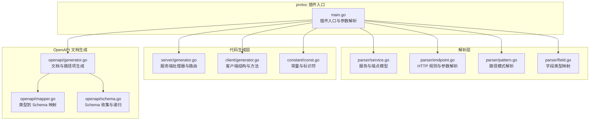
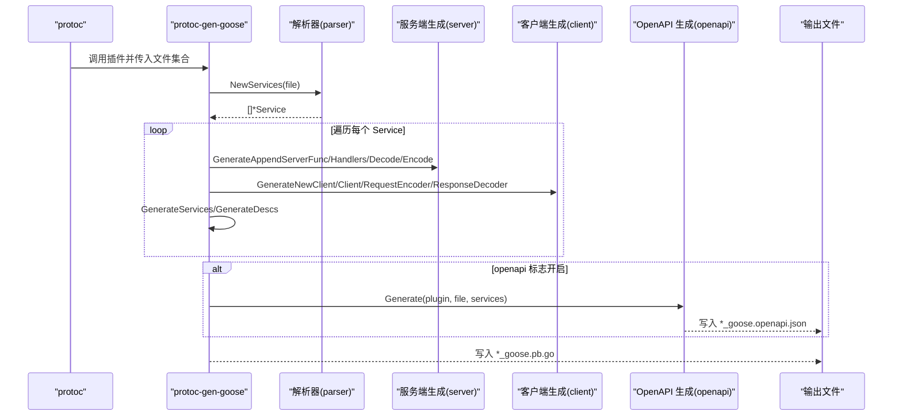
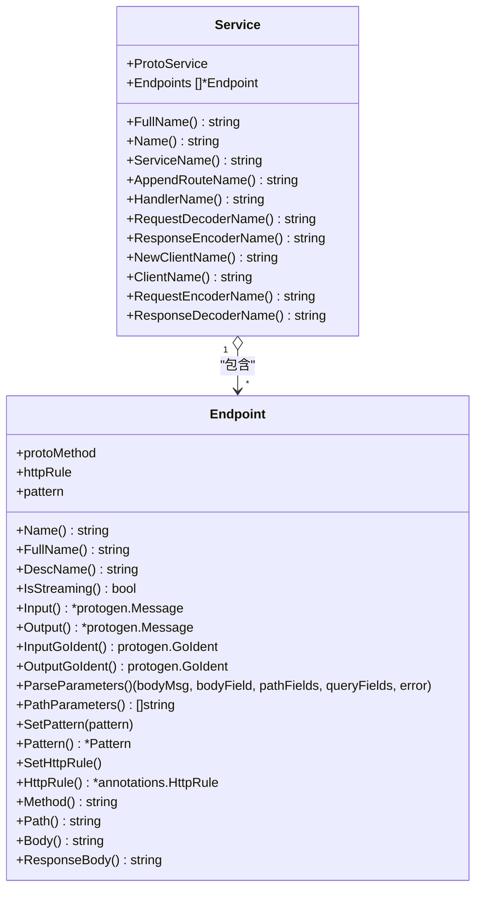
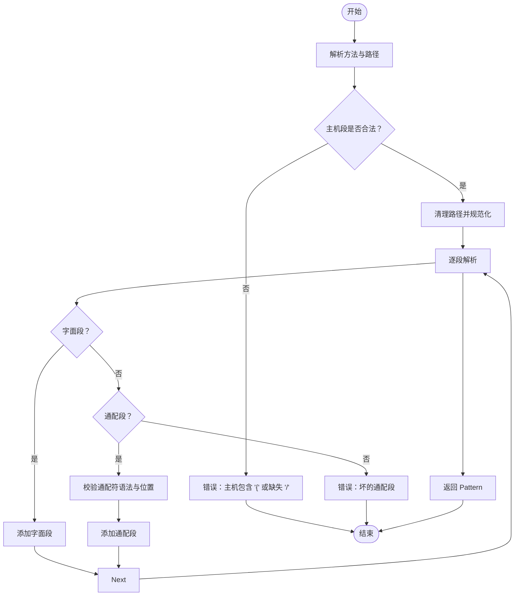
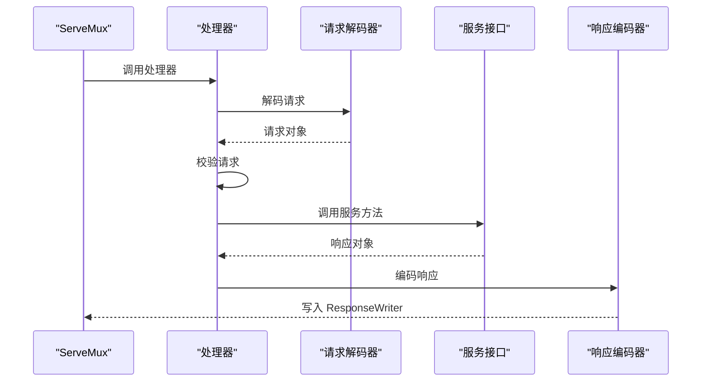
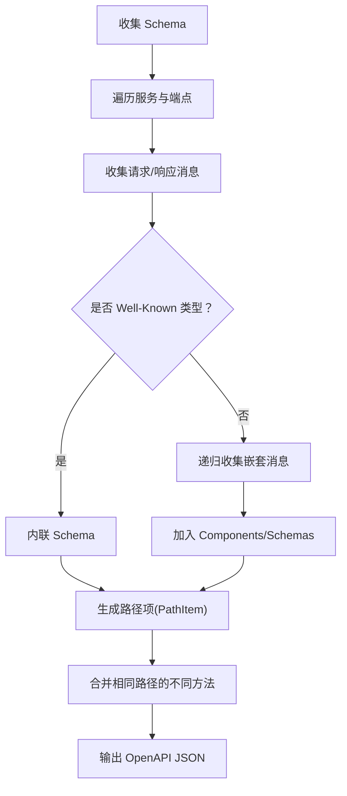
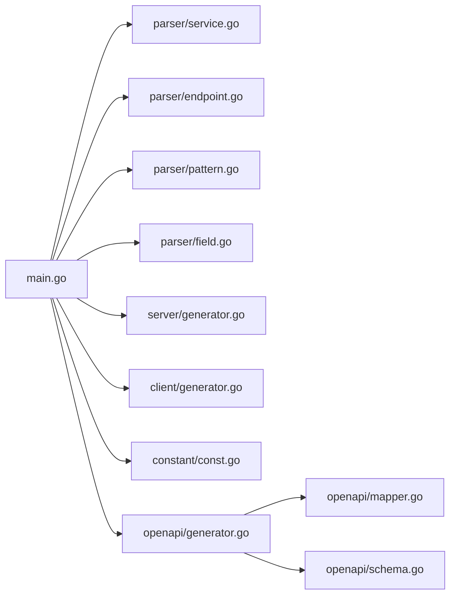

# 代码生成机制

<cite>
**本文引用的文件**
- [main.go](file://cmd/protoc-gen-goose/main.go)
- [service.go](file://cmd/protoc-gen-goose/parser/service.go)
- [endpoint.go](file://cmd/protoc-gen-goose/parser/endpoint.go)
- [pattern.go](file://cmd/protoc-gen-goose/parser/pattern.go)
- [field.go](file://cmd/protoc-gen-goose/parser/field.go)
- [generator.go（服务端）](file://cmd/protoc-gen-goose/server/generator.go)
- [generator.go（客户端）](file://cmd/protoc-gen-goose/client/generator.go)
- [const.go](file://cmd/protoc-gen-goose/constant/const.go)
- [generator.go（OpenAPI）](file://cmd/protoc-gen-goose/openapi/generator.go)
- [mapper.go](file://cmd/protoc-gen-goose/openapi/mapper.go)
- [schema.go](file://cmd/protoc-gen-goose/openapi/schema.go)
- [user.proto](file://example/user/user.proto)
- [body.proto](file://example/body/body.proto)
- [path.proto](file://example/path/path.proto)
- [query.proto](file://example/query/query.proto)
- [Makefile](file://Makefile)
- [go.mod](file://go.mod)
</cite>

## 目录
1. [简介](#简介)
2. [项目结构](#项目结构)
3. [核心组件](#核心组件)
4. [架构总览](#架构总览)
5. [详细组件分析](#详细组件分析)
6. [依赖分析](#依赖分析)
7. [性能考虑](#性能考虑)
8. [故障排查指南](#故障排查指南)
9. [结论](#结论)
10. [附录](#附录)

## 简介
本文件深入解释 Goose 框架的代码生成机制与工作流程，覆盖从 .proto 文件解析到 Go 代码与 OpenAPI 文档生成的完整链路。重点包括：
- protoc 插件执行流程：从命令行参数解析到插件运行、文件遍历与服务解析
- AST 解析：基于 protogen 的服务与端点解析、HTTP 规则提取与路径模式解析
- 模板渲染：通过 protogen 生成器写入 Go 源码与 OpenAPI JSON
- 文件输出：生成服务接口、处理器、编解码器、客户端、路由描述与 OpenAPI 文档
- 不同生成策略：服务器端代码、客户端代码、OpenAPI 文档三类产物的差异与协作
- 配置选项与扩展：插件参数、HTTP 规则、字段类型映射与 OpenAPI 组件收集
- 生成代码结构与使用方式：如何在业务中调用生成的接口与中间件

## 项目结构
Goose 的代码生成器位于 cmd/protoc-gen-goose 目录，包含以下子模块：
- parser：解析 .proto 中的服务、端点、HTTP 规则与路径模式
- server：生成服务端处理器、路由注册、请求/响应编解码器
- client：生成客户端结构体、构造函数、请求编码与响应解码
- openapi：生成 OpenAPI 3.0 文档，含 Schema 收集与路径项生成
- constant：集中管理 Go 标准库与 Goose 内部包的标识符引用
- 示例：example 下的多个 .proto 展示不同 HTTP 映射场景

图表来源
- [main.go:26-101](file://cmd/protoc-gen-goose/main.go#L26-L101)
- [service.go:63-89](file://cmd/protoc-gen-goose/parser/service.go#L63-L89)
- [endpoint.go:181-242](file://cmd/protoc-gen-goose/parser/endpoint.go#L181-L242)
- [pattern.go:81-178](file://cmd/protoc-gen-goose/parser/pattern.go#L81-L178)
- [field.go:34-75](file://cmd/protoc-gen-goose/parser/field.go#L34-L75)
- [generator.go（服务端）:13-81](file://cmd/protoc-gen-goose/server/generator.go#L13-L81)
- [generator.go（客户端）:11-68](file://cmd/protoc-gen-goose/client/generator.go#L11-L68)
- [const.go:67-197](file://cmd/protoc-gen-goose/constant/const.go#L67-L197)
- [generator.go（OpenAPI）:13-61](file://cmd/protoc-gen-goose/openapi/generator.go#L13-L61)
- [mapper.go:8-62](file://cmd/protoc-gen-goose/openapi/mapper.go#L8-L62)
- [schema.go:11-91](file://cmd/protoc-gen-goose/openapi/schema.go#L11-L91)

章节来源
- [main.go:26-101](file://cmd/protoc-gen-goose/main.go#L26-L101)
- [Makefile:14-25](file://Makefile#L14-L25)

## 核心组件
- 插件入口与控制流：解析版本与参数、遍历待生成文件、筛选需生成的服务、逐个生成服务接口、服务端处理器、客户端、描述信息与可选 OpenAPI 文档
- 解析器：将 protogen 的 Service/Method 抽象为内部 Service/Endpoint，并解析 HTTP 规则、路径模式、参数类型与约束
- 生成器：按策略生成服务端处理器、客户端结构体与方法、请求/响应编解码器、路由描述常量
- OpenAPI 生成器：收集消息 Schema、生成路径项、合并重复路径、输出 JSON 文档
- 常量与标识符：统一引用标准库与 Goose 包中的类型与函数，确保生成代码的一致性

章节来源
- [main.go:38-101](file://cmd/protoc-gen-goose/main.go#L38-L101)
- [service.go:63-89](file://cmd/protoc-gen-goose/parser/service.go#L63-L89)
- [endpoint.go:181-242](file://cmd/protoc-gen-goose/parser/endpoint.go#L181-L242)
- [generator.go（服务端）:13-81](file://cmd/protoc-gen-goose/server/generator.go#L13-L81)
- [generator.go（客户端）:11-68](file://cmd/protoc-gen-goose/client/generator.go#L11-L68)
- [generator.go（OpenAPI）:13-61](file://cmd/protoc-gen-goose/openapi/generator.go#L13-L61)
- [const.go:67-197](file://cmd/protoc-gen-goose/constant/const.go#L67-L197)

## 架构总览
下图展示从 .proto 到 Go 代码与 OpenAPI 文档的端到端流程。

图表来源
- [main.go:38-99](file://cmd/protoc-gen-goose/main.go#L38-L99)
- [generator.go（服务端）:13-81](file://cmd/protoc-gen-goose/server/generator.go#L13-L81)
- [generator.go（客户端）:11-68](file://cmd/protoc-gen-goose/client/generator.go#L11-L68)
- [generator.go（OpenAPI）:13-61](file://cmd/protoc-gen-goose/openapi/generator.go#L13-L61)

## 详细组件分析

### 插件入口与控制流
- 版本查询：支持 --version 输出插件版本
- 参数解析：使用 protogen.Options.ParamFunc 注册标志，当前仅开放 openapi 标志
- 文件过滤：仅处理 Generate=true 且包含服务的文件
- 服务生成：对每个服务依次生成接口、路由注册、处理器、编解码器、客户端与描述常量
- OpenAPI 生成：若启用 openapi 标志，则收集 Schema、生成路径项并输出 JSON

章节来源
- [main.go:26-36](file://cmd/protoc-gen-goose/main.go#L26-L36)
- [main.go:38-101](file://cmd/protoc-gen-goose/main.go#L38-L101)

### 解析器：服务与端点
- Service 模型：封装 protogen.Service 并持有若干 Endpoint；提供命名约定与派生名称
- Endpoint 模型：封装 protogen.Method，解析 HTTP 规则、路径、Body 与 ResponseBody，提取路径与查询参数字段，校验不支持的流式 RPC 与非法参数类型
- HTTP 规则：默认使用 POST 方法与方法全名作为路径，支持 GET/POST/PUT/DELETE/PATCH/CUSTOM
- 路径模式：解析 goose 风格路径，支持单段通配与尾部通配，校验合法性与唯一性

图表来源
- [service.go:10-89](file://cmd/protoc-gen-goose/parser/service.go#L10-L89)
- [endpoint.go:16-242](file://cmd/protoc-gen-goose/parser/endpoint.go#L16-L242)

章节来源
- [service.go:63-89](file://cmd/protoc-gen-goose/parser/service.go#L63-L89)
- [endpoint.go:181-242](file://cmd/protoc-gen-goose/parser/endpoint.go#L181-L242)
- [pattern.go:81-178](file://cmd/protoc-gen-goose/parser/pattern.go#L81-L178)

### 路径模式解析算法
- 输入：形如 METHOD HOST]/PATH 的字符串
- 输出：Pattern 结构，包含 segments（字面或通配段），支持尾部通配 {...} 与特殊占位符 {$}
- 校验：方法合法性、路径清理、通配符位置与唯一性、主机段合法性

图表来源
- [pattern.go:81-178](file://cmd/protoc-gen-goose/parser/pattern.go#L81-L178)

章节来源
- [pattern.go:81-178](file://cmd/protoc-gen-goose/parser/pattern.go#L81-L178)

### 字段类型映射与参数提取
- 字段类型映射：根据 protoreflect.Kind 与 Presence 生成 Go 类型表示，处理枚举、消息、列表、映射等
- 参数提取：区分 Body（* 表示整消息、或指定字段）、Path 参数（必须为标量或特定包装类型，不支持列表/映射）、Query 参数（排除 Body 与 Path，允许标量与包装类型）

章节来源
- [field.go:34-75](file://cmd/protoc-gen-goose/parser/field.go#L34-L75)
- [endpoint.go:58-161](file://cmd/protoc-gen-goose/parser/endpoint.go#L58-L161)

### 服务端代码生成策略
- 路由注册：生成 AppendXxxHttpRoute 函数，创建 ServeMux，绑定 HTTP 方法+路径到处理器
- 处理器结构：包含服务接口、请求解码器、响应编码器、错误编码器、中间件链、校验开关与回调
- 处理器方法：统一编排：解码 -> 校验 -> 调用服务接口 -> 编码 -> 错误处理
- 描述常量：为每个端点生成 RouteInfo 与 Desc 常量，便于路由匹配与中间件使用

图表来源
- [generator.go（服务端）:13-81](file://cmd/protoc-gen-goose/server/generator.go#L13-L81)

章节来源
- [generator.go（服务端）:13-81](file://cmd/protoc-gen-goose/server/generator.go#L13-L81)
- [const.go:67-197](file://cmd/protoc-gen-goose/constant/const.go#L67-L197)

### 客户端代码生成策略
- 客户端构造：生成 NewXxxHttpClient，初始化底层 HTTP 客户端、请求编码器、响应解码器、中间件链、校验开关与回调
- 客户端结构：包含底层 Client、编码器、解码器、中间件链、校验开关与回调
- 客户端方法：统一编排：校验 -> 编码 -> 中间件链调用 -> 发送请求 -> 解码 -> 返回结果

章节来源
- [generator.go（客户端）:11-68](file://cmd/protoc-gen-goose/client/generator.go#L11-L68)
- [const.go:174-197](file://cmd/protoc-gen-goose/constant/const.go#L174-L197)

### OpenAPI 文档生成策略
- Schema 收集：递归遍历所有被引用的消息类型，跳过 Well-Known 类型，生成属性与 Required 列表
- 路径项生成：将每个端点映射为 OpenAPI Operation，提取 Path/Query 参数、请求体与响应
- 文档构建：组装 Info、Paths、Components/Schemas，输出 JSON 文件
- 类型映射：针对 Well-Known 类型给出 OpenAPI Schema，其他消息类型以 $ref 引用组件

图表来源
- [generator.go（OpenAPI）:13-61](file://cmd/protoc-gen-goose/openapi/generator.go#L13-L61)
- [schema.go:25-91](file://cmd/protoc-gen-goose/openapi/schema.go#L25-L91)
- [mapper.go:8-62](file://cmd/protoc-gen-goose/openapi/mapper.go#L8-L62)

章节来源
- [generator.go（OpenAPI）:13-61](file://cmd/protoc-gen-goose/openapi/generator.go#L13-L61)
- [schema.go:25-91](file://cmd/protoc-gen-goose/openapi/schema.go#L25-L91)
- [mapper.go:8-62](file://cmd/protoc-gen-goose/openapi/mapper.go#L8-L62)

### 生成代码结构与使用方式
- 服务接口：生成服务接口定义，供业务实现
- 路由注册：AppendXxxHttpRoute 将服务挂载到 ServeMux
- 处理器与编解码器：内置解码/编码逻辑与错误处理，可注入中间件
- 客户端：NewXxxHttpClient 提供统一客户端，支持中间件链与错误解码
- 描述常量：用于路由匹配与中间件增强

章节来源
- [main.go:103-125](file://cmd/protoc-gen-goose/main.go#L103-L125)
- [generator.go（服务端）:13-81](file://cmd/protoc-gen-goose/server/generator.go#L13-L81)
- [generator.go（客户端）:11-68](file://cmd/protoc-gen-goose/client/generator.go#L11-L68)

## 依赖分析
- 插件入口依赖解析器、生成器与常量模块
- 解析器依赖 protogen 与 googleapis annotations 扩展
- 生成器依赖常量模块提供的标识符
- OpenAPI 生成器依赖解析器与类型映射模块
- 运行时依赖 goose/server 与 goose/client 包中的 Option/Chain/Invoke 等

图表来源
- [main.go:31-36](file://cmd/protoc-gen-goose/main.go#L31-L36)
- [service.go:63-89](file://cmd/protoc-gen-goose/parser/service.go#L63-L89)
- [endpoint.go:181-242](file://cmd/protoc-gen-goose/parser/endpoint.go#L181-L242)
- [pattern.go:81-178](file://cmd/protoc-gen-goose/parser/pattern.go#L81-L178)
- [field.go:34-75](file://cmd/protoc-gen-goose/parser/field.go#L34-L75)
- [generator.go（服务端）:13-81](file://cmd/protoc-gen-goose/server/generator.go#L13-L81)
- [generator.go（客户端）:11-68](file://cmd/protoc-gen-goose/client/generator.go#L11-L68)
- [const.go:67-197](file://cmd/protoc-gen-goose/constant/const.go#L67-L197)
- [generator.go（OpenAPI）:13-61](file://cmd/protoc-gen-goose/openapi/generator.go#L13-L61)
- [mapper.go:8-62](file://cmd/protoc-gen-goose/openapi/mapper.go#L8-L62)
- [schema.go:25-91](file://cmd/protoc-gen-goose/openapi/schema.go#L25-L91)

章节来源
- [go.mod:5-13](file://go.mod#L5-L13)

## 性能考虑
- 解析阶段：路径模式解析与参数提取为线性复杂度，受端点数量与字段数量影响
- 生成阶段：按服务与端点顺序生成，避免重复计算；OpenAPI Schema 收集使用 visited 集合去重
- I/O 阶段：一次性写入生成文件，减少磁盘操作次数
- 建议：在大型仓库中分批生成或并行化 protoc 调用，合理组织 .proto 文件与包结构

## 故障排查指南
- 流式 RPC 不支持：解析器检测到流式方法会直接报错，需改为双向不流式
- 路径参数类型限制：仅允许标量与特定包装类型，列表/映射不支持；非法类型会报错
- 通配符位置与唯一性：{...} 必须位于末尾，{$} 只能在末尾出现，名称需唯一
- HTTP 规则缺失：未设置 google.api.http 时，默认使用 POST 与方法全名路径
- OpenAPI 生成失败：检查消息引用与 Well-Known 类型映射，确认 JSON 序列化无异常

章节来源
- [service.go:74-76](file://cmd/protoc-gen-goose/parser/service.go#L74-L76)
- [endpoint.go:82-112](file://cmd/protoc-gen-goose/parser/endpoint.go#L82-L112)
- [pattern.go:160-176](file://cmd/protoc-gen-goose/parser/pattern.go#L160-L176)
- [endpoint.go:181-192](file://cmd/protoc-gen-goose/parser/endpoint.go#L181-L192)
- [generator.go（OpenAPI）:49-53](file://cmd/protoc-gen-goose/openapi/generator.go#L49-L53)

## 结论
Goose 的代码生成器以 protoc 插件为核心，结合解析器与多策略生成器，实现了从 .proto 到 Go 服务端/客户端代码与 OpenAPI 文档的自动化产出。其设计强调：
- 清晰的职责分离：解析、生成、常量与文档各司其职
- 可扩展的生成策略：服务端、客户端、OpenAPI 三类产物相互独立又协同
- 严格的类型与规则约束：保证生成代码的正确性与一致性
- 易于定制：通过插件参数、HTTP 规则与字段映射，满足多样化的业务需求

## 附录

### 配置选项与使用示例
- 插件参数
  - openapi：布尔值，开启后生成 OpenAPI 文档
- protoc 调用示例
  - 使用 Makefile 中的 example 目标可一键生成 Go 与 OpenAPI 文档
- 示例 .proto
  - 用户服务：展示 CRUD 场景与 HTTP 映射
  - 请求体：演示 * 与命名 Body 的差异
  - 路径参数：覆盖标量、包装类型与多段通配
  - 查询参数：覆盖标量、包装类型与数组

章节来源
- [main.go:23-24](file://cmd/protoc-gen-goose/main.go#L23-L24)
- [Makefile:14-25](file://Makefile#L14-L25)
- [user.proto:11-61](file://example/user/user.proto#L11-L61)
- [body.proto:11-50](file://example/body/body.proto#L11-L50)
- [path.proto:9-134](file://example/path/path.proto#L9-L134)
- [query.proto:9-173](file://example/query/query.proto#L9-L173)