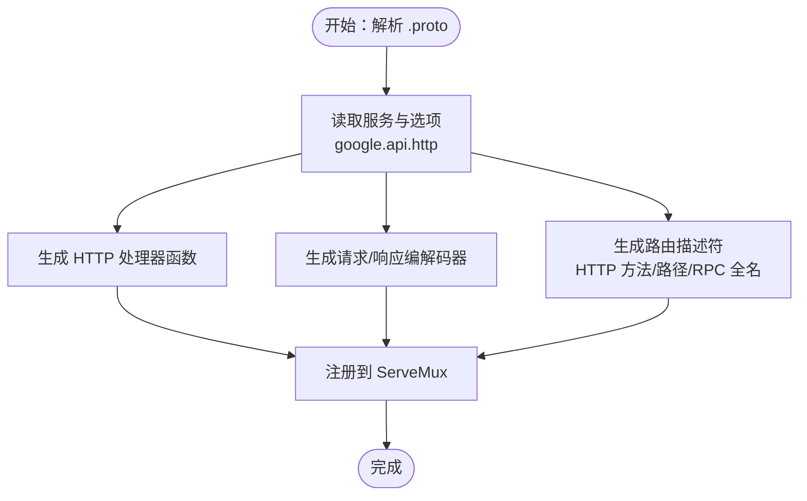
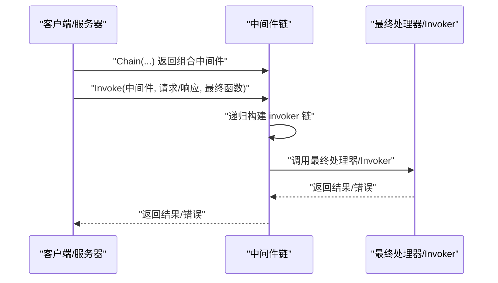
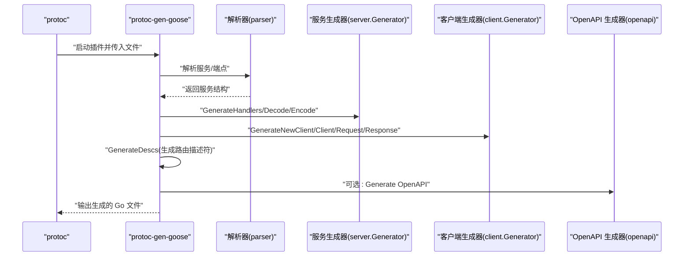
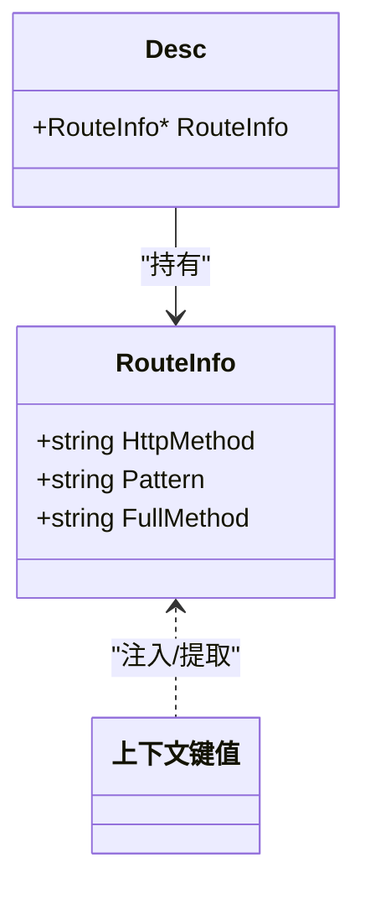
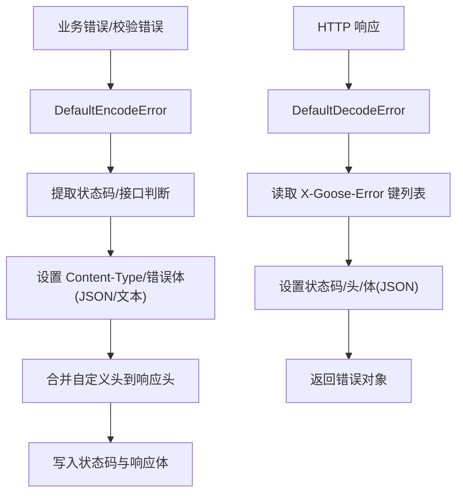
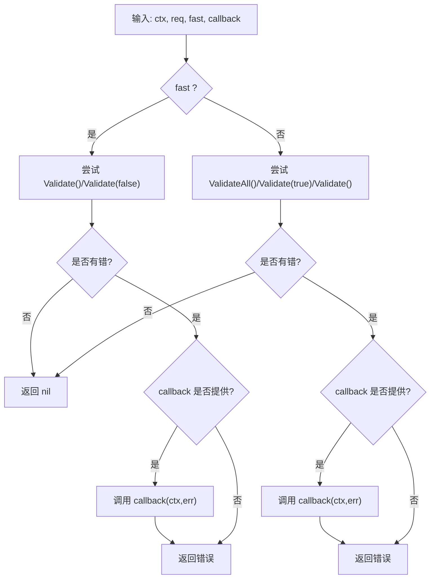
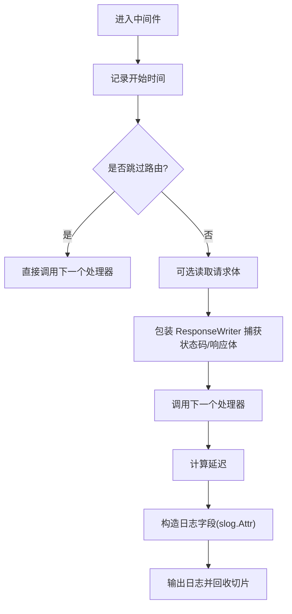
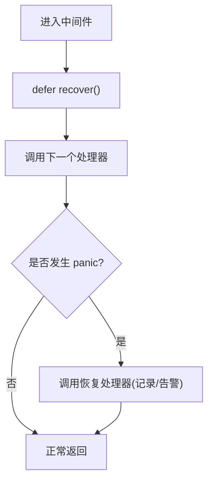

# 核心概念

<cite>
**本文引用的文件**
- [doc.go](file://doc.go)
- [desc.go](file://desc.go)
- [route.go](file://route.go)
- [common.go](file://common.go)
- [constant.go](file://constant.go)
- [header.go](file://header.go)
- [status.go](file://status.go)
- [validate.go](file://validate.go)
- [server/middleware.go](file://server/middleware.go)
- [client/middleware.go](file://client/middleware.go)
- [cmd/protoc-gen-goose/main.go](file://cmd/protoc-gen-goose/main.go)
- [middleware/accesslog/middleware.go](file://middleware/accesslog/middleware.go)
- [middleware/recovery/middleware.go](file://middleware/recovery/middleware.go)
- [example/user/user.proto](file://example/user/user.proto)
- [example/user/user_goose.pb.go](file://example/user/user_goose.pb.go)
</cite>

## 更新摘要
**所做更改**
- 新增 Protocol Buffers 基础概念章节，详细解释 .proto 文件语法和 google.api.http 选项
- 新增 HTTP 到 gRPC 映射原理章节，说明如何从 Protocol Buffers 生成 HTTP 路由
- 新增中间件模式设计章节，阐述链式调用机制和中间件组合
- 新增代码生成机制章节，详细介绍 protoc-gen-goose 插件工作流程
- 新增路由管理系统章节，解释 RouteInfo 和描述符系统
- 更新现有章节以反映最新的实现细节和架构设计

## 目录
1. [引言](#引言)
2. [Protocol Buffers 基础](#protocol-buffers-基础)
3. [HTTP 到 gRPC 映射原理](#http-到-grpc-映射原理)
4. [中间件模式设计](#中间件模式设计)
5. [代码生成机制](#代码生成机制)
6. [路由管理系统](#路由管理系统)
7. [错误处理机制](#错误处理机制)
8. [请求校验与通用错误控制流](#请求校验与通用错误控制流)
9. [中间件系统](#中间件系统)
10. [性能考虑](#性能考虑)
11. [故障排查指南](#故障排查指南)
12. [结论](#结论)
13. [附录](#附录)

## 引言
Goose 框架是一个基于 Protocol Buffers 的 HTTP/gRPC 网关框架，旨在简化现代 Web 服务的开发。该框架通过 Protocol Buffers 定义服务契约，自动生成功能完整的 HTTP 处理器和客户端代码，结合统一的中间件系统和错误处理机制，提供了一套高效、可维护的 API 开发解决方案。

本文件面向初学者与进阶开发者，系统性阐释 Goose 框架的核心概念与设计原理，包括：

- **Protocol Buffers 基础**：理解 .proto 文件语法、消息定义和服务声明
- **HTTP 到 gRPC 映射原理**：从 Protocol Buffers 到 HTTP 路由的转换机制
- **中间件模式设计**：链式调用模型和中间件组合策略
- **代码生成机制**：protoc-gen-goose 插件的工作流程和生成策略
- **路由管理系统**：RouteInfo 和描述符系统的实现原理
- **错误处理机制**：统一的错误编码和解码系统
- **请求校验**：基于 Protocol Buffers 的验证机制

## Protocol Buffers 基础

### Protocol Buffers 概述
Protocol Buffers（简称 protobuf）是 Google 开发的一种语言无关、平台无关的序列化数据结构的方法。在 Goose 框架中，protobuf 用于定义服务契约和消息格式，为 HTTP/gRPC 接口提供强类型的约束。

### .proto 文件结构
一个标准的 .proto 文件包含以下基本元素：

```protobuf
syntax = "proto3";
package leo.goose.example.user.v1;
option go_package = "github.com/soyacen/goose/example/user/v1;user";

import "google/api/annotations.proto";

service User {
  // RPC 定义和 HTTP 映射
}
```

### 服务定义与 HTTP 映射
Goose 框架通过 google.api.http 选项将 RPC 方法映射到 HTTP 端点：

```protobuf
rpc CreateUser(CreateUserRequest) returns (CreateUserResponse) {
  option (google.api.http) = {
    post : "/v1/user"
    body : "*"
  };
}

rpc GetUser(GetUserRequest) returns (GetUserResponse) {
  option (google.api.http) = {
    get : "/v1/user/{id}"
  };
}
```

### 消息类型定义
消息类型定义了请求和响应的数据结构：

```protobuf
message UserItem {
  int64 id = 1;
  string name = 2;
}

message CreateUserRequest { 
  string name = 1; 
}

message CreateUserResponse { 
  UserItem item = 1; 
}
```

**章节来源**
- [example/user/user.proto:1-111](file://example/user/user.proto#L1-L111)

## HTTP 到 gRPC 映射原理

### 映射机制概述
Goose 框架实现了从 Protocol Buffers 到 HTTP 接口的自动映射，主要通过以下步骤完成：

1. **解析 .proto 文件**：读取服务定义和 google.api.http 选项
2. **生成 HTTP 路由**：根据 HTTP 方法和路径模式创建路由规则
3. **生成处理器函数**：为每个 RPC 方法生成对应的 HTTP 处理器
4. **生成编解码器**：创建请求解析和响应序列化的工具函数
5. **生成描述符**：创建路由信息的静态描述符

### 路由注册流程


**图示来源**
- [cmd/protoc-gen-goose/main.go:38-101](file://cmd/protoc-gen-goose/main.go#L38-L101)
- [example/user/user.proto:11-62](file://example/user/user.proto#L11-L62)

### 处理器生成示例
protoc-gen-goose 为每个 RPC 方法生成对应的 HTTP 处理器：

```go
func AppendUserHttpRoute(router *http.ServeMux, service UserService, opts ...server.Option) *http.ServeMux {
    // 注册各个 HTTP 端点
    router.Handle("POST /v1/user", http.HandlerFunc(handler.CreateUser))
    router.Handle("DELETE /v1/user/{id}", http.HandlerFunc(handler.DeleteUser))
    router.Handle("PUT /v1/user/{id}", http.HandlerFunc(handler.ModifyUser))
    router.Handle("PATCH /v1/user/{id}", http.HandlerFunc(handler.UpdateUser))
    router.Handle("GET /v1/user/{id}", http.HandlerFunc(handler.GetUser))
    router.Handle("GET /v1/users", http.HandlerFunc(handler.ListUser))
    return router
}
```

**章节来源**
- [example/user/user_goose.pb.go:27-53](file://example/user/user_goose.pb.go#L27-L53)
- [cmd/protoc-gen-goose/main.go:38-101](file://cmd/protoc-gen-goose/main.go#L38-L101)

## 中间件模式设计

### 中间件架构概述
Goose 框架采用统一的中间件模式，支持服务器端和客户端的链式调用。中间件通过函数组合的方式实现横切关注点的模块化。

### 中间件类型定义
框架定义了两种主要的中间件类型：

**服务器端中间件**：
```go
type Middleware func(response http.ResponseWriter, request *http.Request, invoker http.HandlerFunc)
```

**客户端中间件**：
```go
type Middleware func(cli *http.Client, request *http.Request, invoker Invoker) (*http.Response, error)
```

### 链式调用机制
中间件通过递归构建调用链，确保按照正确的顺序执行：



**图示来源**
- [server/middleware.go:19-84](file://server/middleware.go#L19-L84)
- [client/middleware.go:35-98](file://client/middleware.go#L35-L98)

### 上下文传递机制
中间件链在执行前将 RouteInfo 和 http.Header 注入到上下文中：

```go
func Invoke(middleware Middleware, response http.ResponseWriter, request *http.Request, invoke http.HandlerFunc, routeInfo *goose.RouteInfo) {
    request = request.WithContext(goose.InjectRouteInfo(request.Context(), routeInfo))
    request = request.WithContext(goose.InjectHeader(request.Context(), request.Header))
    // ...
}
```

**章节来源**
- [server/middleware.go:9-84](file://server/middleware.go#L9-L84)
- [client/middleware.go:9-98](file://client/middleware.go#L9-L98)

## 代码生成机制

### protoc-gen-goose 概述
protoc-gen-goose 是 Goose 框架的核心代码生成器，作为 protoc 插件运行，负责将 Protocol Buffers 定义转换为完整的 Go 代码。

### 生成器架构


**图示来源**
- [cmd/protoc-gen-goose/main.go:32-101](file://cmd/protoc-gen-goose/main.go#L32-L101)

### 生成内容
protoc-gen-goose 生成以下类型的代码：

1. **服务接口**：定义业务逻辑接口
2. **HTTP 处理器**：实现具体的 HTTP 请求处理
3. **编解码器**：处理请求解析和响应序列化
4. **客户端代码**：生成 HTTP 客户端调用代码
5. **路由描述符**：包含路由信息的静态描述符

### 描述符生成
每个端点都会生成对应的路由描述符：

```go
var _leo_goose_example_user_v1_User_CreateUser_Desc = &Desc{
    RouteInfo: &RouteInfo{
        HttpMethod: "POST",
        Pattern: "/v1/user",
        FullMethod: "/leo.goose.example.user.v1/User/CreateUser",
    },
}
```

**章节来源**
- [cmd/protoc-gen-goose/main.go:1-126](file://cmd/protoc-gen-goose/main.go#L1-L126)

## 路由管理系统

### RouteInfo 结构
RouteInfo 是路由管理系统的核心数据结构，包含 HTTP 方法、路径模式和 RPC 全名：

```go
type RouteInfo struct {
    HttpMethod string  // HTTP 方法（GET、POST、PUT、DELETE 等）
    Pattern    string  // 路径模式（支持路径参数）
    FullMethod string  // RPC 完整方法名（/package.service/method）
}
```

### 上下文键值对
框架使用唯一的上下文键值对在请求生命周期内传递 RouteInfo：

```go
type routeInfoKey struct{}

func ExtractRouteInfo(ctx context.Context) (*RouteInfo, bool) {
    val, ok := ctx.Value(routeInfoKey{}).(*RouteInfo)
    return val, ok
}

func InjectRouteInfo(ctx context.Context, routeInfo *RouteInfo) context.Context {
    return context.WithValue(ctx, routeInfoKey{}, routeInfo)
}
```

### 描述符系统
每个生成的服务都包含路由描述符数组，供中间件和日志模块使用：



**图示来源**
- [route.go:7-15](file://route.go#L7-L15)
- [desc.go:3-5](file://desc.go#L3-L5)
- [example/user/user_goose.pb.go:113-124](file://example/user/user_goose.pb.go#L113-L124)

**章节来源**
- [route.go:7-26](file://route.go#L7-L26)
- [desc.go:1-6](file://desc.go#L1-L6)
- [example/user/user_goose.pb.go:113-124](file://example/user/user_goose.pb.go#L113-L124)

## 错误处理机制

### 错误类型系统
Goose 框架定义了统一的错误类型 defaultError，支持状态码、响应头和 JSON 错误体：

```go
type defaultError struct {
    statusCode int         // HTTP 状态码
    headers    http.Header // HTTP 响应头
    body       any         // 错误体内容
}
```

### 错误编码器
DefaultEncodeError 根据错误实现动态选择内容类型和状态码：



**图示来源**
- [status.go:149-202](file://status.go#L149-L202)
- [status.go:222-268](file://status.go#L222-L268)

### 错误解码器
DefaultDecodeError 从响应头中读取错误键列表，还原错误对象的状态码、头和 JSON 体：

```go
func DefaultDecodeError(ctx context.Context, response *http.Response, factory ErrorFactory) (error, bool) {
    keysJson := response.Header.Get(ErrorKey)
    if keysJson == "" {
        return nil, false
    }
    // 解析错误信息...
}
```

**章节来源**
- [status.go:13-269](file://status.go#L13-L269)
- [constant.go:3-15](file://constant.go#L3-L15)

## 请求校验与通用错误控制流

### 请求验证机制
ValidateRequest 支持快速和全量校验策略，优先尝试带参数的校验方法：



**图示来源**
- [validate.go:29-56](file://validate.go#L29-L56)
- [common.go:14-50](file://common.go#L14-L50)

### 错误控制流
框架提供了两种错误控制策略：

**BreakOnError**：遇到错误立即短路
```go
func BreakOnError[T any](pre error) func(f func() (T, error)) (T, error) {
    return func(f func() (T, error)) (T, error) {
        if pre != nil {
            var v T
            return v, pre
        }
        return f()
    }
}
```

**ContinueOnError**：累积错误并继续执行
```go
func ContinueOnError[T any](pre error) func(f func() (T, error)) (T, error) {
    return func(f func() (T, error)) (T, error) {
        v, err := f()
        if err == nil {
            return v, pre
        }
        if pre == nil {
            return v, err
        }
        // 错误累积逻辑
    }
}
```

**章节来源**
- [validate.go:1-57](file://validate.go#L1-L57)
- [common.go:1-51](file://common.go#L1-L51)

## 中间件系统

### 内置中间件
Goose 框架提供了多种内置中间件，满足常见的横切关注点需求：

#### 访问日志中间件
支持服务器端和客户端两类中间件，记录详细的请求/响应元数据：



**图示来源**
- [middleware/accesslog/middleware.go:116-204](file://middleware/accesslog/middleware.go#L116-L204)
- [middleware/accesslog/middleware.go:206-276](file://middleware/accesslog/middleware.go#L206-L276)

#### 异常恢复中间件
捕获 panic 并调用自定义或默认处理器：



**图示来源**
- [middleware/recovery/middleware.go:38-54](file://middleware/recovery/middleware.go#L38-L54)

### 中间件配置
中间件支持灵活的配置选项，包括日志级别、跳过规则、请求/响应体打印等。

**章节来源**
- [middleware/accesslog/middleware.go:1-318](file://middleware/accesslog/middleware.go#L1-L318)
- [middleware/recovery/middleware.go:1-55](file://middleware/recovery/middleware.go#L1-L55)

## 性能考虑

### 中间件链优化
- **递归调用链**：采用递归构建 invoker 链，避免显式闭包层级过深
- **sync.Pool 复用**：访问日志中间件使用 sync.Pool 复用属性切片
- **按需编码**：错误编码器仅在必要时进行 JSON 编码

### 客户端 IP 解析
遵循常见代理头顺序，优先取第一个 IP，减少解析成本：

```go
func ClientIP(req *http.Request) string {
    if xff := req.Header.Get("X-Forwarded-For"); xff != "" {
        // 优先处理 X-Forwarded-For
    }
    // 其他代理头处理...
}
```

### 内存管理
- **零分配策略**：尽可能避免在热路径上的内存分配
- **对象池**：使用 sync.Pool 复用临时对象
- **字符串优化**：合理使用字符串操作，避免不必要的复制

## 故障排查指南

### 常见问题诊断

**无法获取路由信息**
- 服务器端访问日志中间件会回退到反射获取路由字符串
- 建议在中间件链中尽早注入 RouteInfo

**错误未正确编码**
- 检查错误类型是否实现了状态码/头/JSON 接口
- 确认 DefaultEncodeError 已被调用

**校验失败未回调**
- 确认 ValidateRequest 的回调函数已传入且在相应分支触发

**中间件未生效**
- 检查 Chain 是否正确组合，Invoke 是否在处理器入口处调用

### 调试技巧
- 使用 slog 日志系统记录详细的请求/响应信息
- 启用访问日志中间件的请求/响应体打印功能
- 利用中间件的跳过功能定位问题范围

**章节来源**
- [middleware/accesslog/middleware.go:298-317](file://middleware/accesslog/middleware.go#L298-L317)
- [status.go:155-202](file://status.go#L155-L202)
- [validate.go:48-56](file://validate.go#L48-L56)
- [server/middleware.go:76-84](file://server/middleware.go#L76-L84)

## 结论
Goose 框架通过 Protocol Buffers 定义服务契约，借助 protoc-gen-goose 自动生成 HTTP 处理器与编解码器，结合统一的中间件链、上下文传递与错误编解码机制，形成一套简洁而强大的 Web/gRPC 风格接口开发范式。

### 核心优势
- **声明式 API 设计**：通过 .proto 文件声明服务契约
- **自动化代码生成**：减少重复代码，提高开发效率
- **统一中间件系统**：支持服务器端和客户端的链式调用
- **强类型安全保障**：利用 Protocol Buffers 的类型系统
- **高性能运行时**：优化的内存管理和调用链设计

### 架构特点
- **低耦合设计**：核心模块之间保持松散耦合
- **可扩展性**：支持自定义中间件和扩展点
- **可观测性**：内置访问日志和错误处理机制
- **兼容性**：同时支持 HTTP 和 gRPC 风格的接口

## 附录

### 示例协议与生成物
参考示例目录中的 user.proto 与 user_goose.pb.go，理解从 .proto 到 HTTP 路由与处理器的完整链路。

### 常用常量
Content-Type、错误头键等在 constant.go 中集中定义，便于统一管理。

### 进一步学习资源
- Protocol Buffers 官方文档
- Go 语言中间件模式最佳实践
- HTTP/1.1 和 HTTP/2 协议规范
- gRPC 官方文档

**章节来源**
- [example/user/user.proto:1-111](file://example/user/user.proto#L1-L111)
- [example/user/user_goose.pb.go:1-200](file://example/user/user_goose.pb.go#L1-L200)
- [constant.go:3-15](file://constant.go#L3-L15)