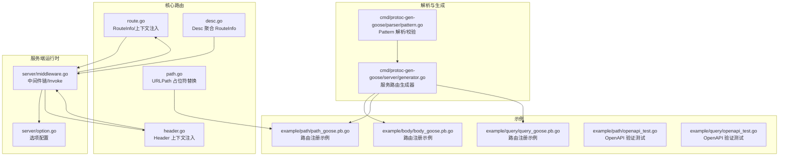
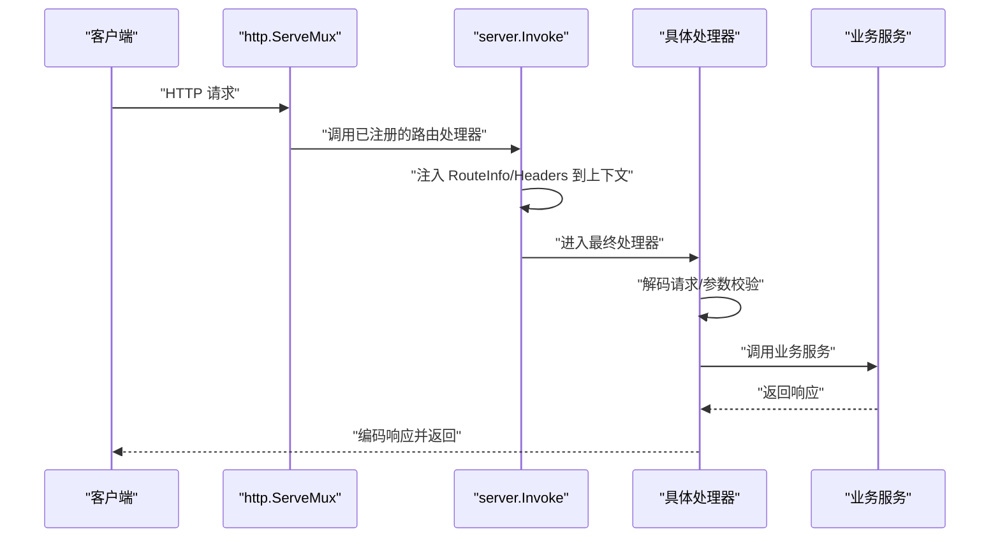
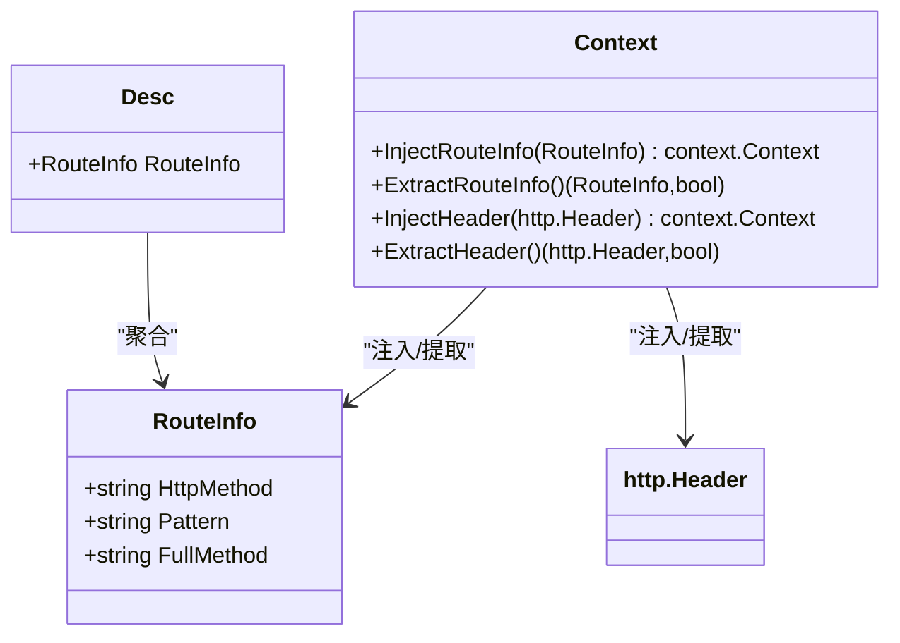
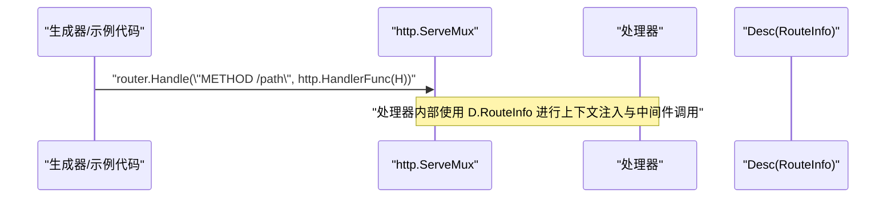
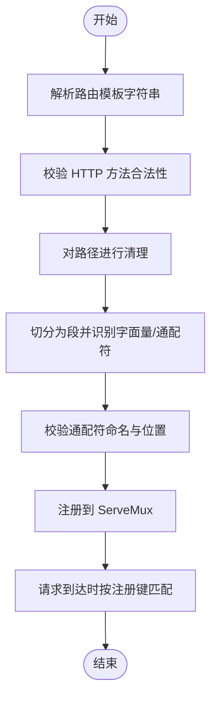
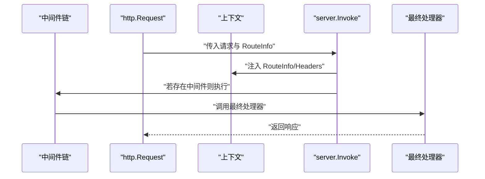
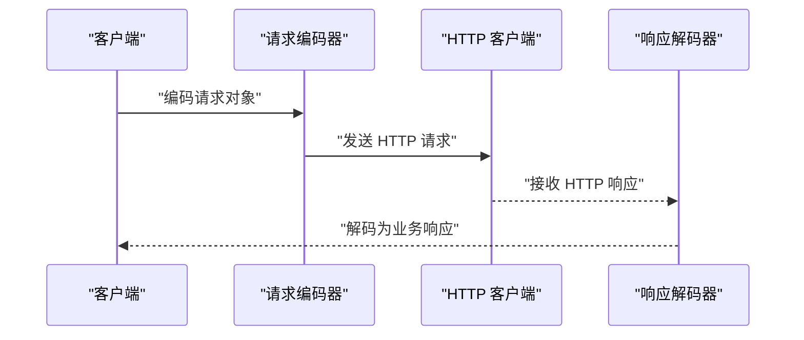
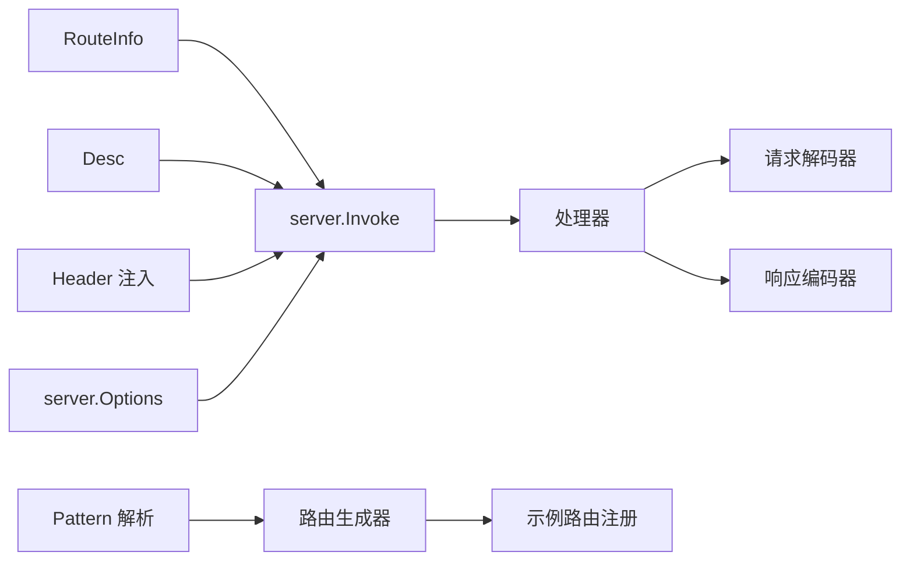

# 路由管理系统

<cite>
**本文档引用的文件**
- [route.go](file://route.go)
- [desc.go](file://desc.go)
- [header.go](file://header.go)
- [path.go](file://path.go)
- [pattern.go](file://cmd/protoc-gen-goose/parser/pattern.go)
- [middleware.go](file://server/middleware.go)
- [option.go](file://server/option.go)
- [body_goose.pb.go](file://example/body/body_goose.pb.go)
- [path_goose.pb.go](file://example/path/path_goose.pb.go)
- [query_goose.pb.go](file://example/query/query_goose.pb.go)
- [openapi_test.go（路径示例）](file://example/path/openapi_test.go)
- [openapi_test.go（查询示例）](file://example/query/openapi_test.go)
</cite>

## 目录
1. [简介](#简介)
2. [项目结构](#项目结构)
3. [核心组件](#核心组件)
4. [架构总览](#架构总览)
5. [详细组件分析](#详细组件分析)
6. [依赖关系分析](#依赖关系分析)
7. [性能考量](#性能考量)
8. [故障排查指南](#故障排查指南)
9. [结论](#结论)
10. [附录](#附录)

## 简介
本文件系统性介绍 Goose 框架的路由管理系统，重点覆盖以下方面：
- RouteInfo 结构的设计与职责：HTTP 方法、路径模式、完整方法名的管理
- 路由描述符（Desc）的定义与使用，以及路由信息在上下文中的传递机制
- 路由匹配算法、优先级与冲突处理的技术细节
- 路由注册、查找与管理的实际示例
- 路由系统与中间件、编解码器等组件的集成方式

## 项目结构
Goose 的路由系统围绕“路由描述符 + 上下文注入 + 中间件链 + 编解码器”的组合展开。核心代码位于根目录与 server 子模块中，示例路由通过 protoc-gen-goose 生成。

图表来源
- [route.go:1-27](file://route.go#L1-L27)
- [desc.go:1-6](file://desc.go#L1-L6)
- [header.go:1-88](file://header.go#L1-L88)
- [path.go:1-41](file://path.go#L1-L41)
- [pattern.go:1-244](file://cmd/protoc-gen-goose/parser/pattern.go#L1-L244)
- [middleware.go:1-85](file://server/middleware.go#L1-L85)
- [option.go:1-198](file://server/option.go#L1-L198)
- [body_goose.pb.go:696-743](file://example/body/body_goose.pb.go#L696-L743)
- [path_goose.pb.go:1490-1522](file://example/path/path_goose.pb.go#L1490-L1522)
- [query_goose.pb.go:1484-1517](file://example/query/query_goose.pb.go#L1484-L1517)
- [openapi_test.go（路径示例）:374-466](file://example/path/openapi_test.go#L374-L466)
- [openapi_test.go（查询示例）:357-394](file://example/query/openapi_test.go#L357-L394)

章节来源
- [route.go:1-27](file://route.go#L1-L27)
- [desc.go:1-6](file://desc.go#L1-L6)
- [header.go:1-88](file://header.go#L1-L88)
- [path.go:1-41](file://path.go#L1-L41)
- [pattern.go:1-244](file://cmd/protoc-gen-goose/parser/pattern.go#L1-L244)
- [middleware.go:1-85](file://server/middleware.go#L1-L85)
- [option.go:1-198](file://server/option.go#L1-L198)
- [body_goose.pb.go:696-743](file://example/body/body_goose.pb.go#L696-L743)
- [path_goose.pb.go:1490-1522](file://example/path/path_goose.pb.go#L1490-L1522)
- [query_goose.pb.go:1484-1517](file://example/query/query_goose.pb.go#L1484-L1517)
- [openapi_test.go（路径示例）:374-466](file://example/path/openapi_test.go#L374-L466)
- [openapi_test.go（查询示例）:357-394](file://example/query/openapi_test.go#L357-L394)

## 核心组件
- RouteInfo：承载一次路由的关键元数据，包含 HTTP 方法、路径模式、完整方法名（RPC 全限定名），用于在请求生命周期内贯穿中间件与处理器。
- Desc：聚合 RouteInfo 的描述符，作为路由注册时的静态描述对象，供生成器与运行时使用。
- 上下文注入：通过 InjectRouteInfo/ExtractRouteInfo 将 RouteInfo 注入到请求上下文；同时通过 InjectHeader/ExtractHeader 注入并读取请求头。
- 中间件链：server.Chain 组合多个中间件，server.Invoke 在进入最终处理器前完成上下文注入与中间件执行。
- 路径占位符：URLPath 支持普通占位符与“多段”占位符（以“...”结尾），用于客户端侧构造目标 URL。

章节来源
- [route.go:7-26](file://route.go#L7-L26)
- [desc.go:3-6](file://desc.go#L3-L6)
- [header.go:24-45](file://header.go#L24-L45)
- [path.go:5-41](file://path.go#L5-L41)
- [middleware.go:9-85](file://server/middleware.go#L9-L85)
- [option.go:8-27](file://server/option.go#L8-L27)

## 架构总览
Goose 的路由系统采用“声明式描述 + 运行时注入 + 中间件链”的设计。服务端通过 http.ServeMux 注册路由，每个路由绑定一个处理器；处理器内部通过 server.Invoke 完成中间件链执行，并在上下文中注入 RouteInfo 与 Header，以便后续中间件与业务逻辑使用。

图表来源
- [middleware.go:65-84](file://server/middleware.go#L65-L84)
- [route.go:17-26](file://route.go#L17-L26)
- [header.go:28-45](file://header.go#L28-L45)
- [path_goose.pb.go:1524-1547](file://example/path/path_goose.pb.go#L1524-L1547)

## 详细组件分析

### RouteInfo 结构与上下文传递
- 字段含义
  - HttpMethod：HTTP 方法（如 GET、POST）
  - Pattern：路径模式（如 /v1/{id} 或带通配符的多段模式）
  - FullMethod：RPC 完整方法名（如 /package.service/method）
- 上下文注入
  - InjectRouteInfo：将 RouteInfo 注入到请求上下文
  - ExtractRouteInfo：从上下文提取 RouteInfo，供中间件或处理器使用
- Header 注入
  - InjectHeader/ExtractHeader：将原始请求头注入上下文，便于中间件读取

图表来源
- [route.go:7-26](file://route.go#L7-L26)
- [desc.go:3-6](file://desc.go#L3-L6)
- [header.go:24-45](file://header.go#L24-L45)

章节来源
- [route.go:7-26](file://route.go#L7-L26)
- [desc.go:3-6](file://desc.go#L3-L6)
- [header.go:24-45](file://header.go#L24-L45)

### 路由描述符（Desc）与路由注册
- Desc 的作用
  - 以静态对象形式保存 RouteInfo，供生成器与运行时使用
  - 示例中各服务均定义了对应的 Desc 变量，包含 HttpMethod、Pattern、FullMethod
- 路由注册
  - 通过 AppendXxxHttpRoute 函数将处理器注册到 http.ServeMux
  - 注册时将处理器绑定到形如 “METHOD /path” 的模式串
  - 示例文件展示了多种路由注册方式（路径参数、查询参数、请求体）

图表来源
- [body_goose.pb.go:696-743](file://example/body/body_goose.pb.go#L696-L743)
- [path_goose.pb.go:1490-1522](file://example/path/path_goose.pb.go#L1490-L1522)
- [query_goose.pb.go:1484-1517](file://example/query/query_goose.pb.go#L1484-L1517)

章节来源
- [body_goose.pb.go:696-743](file://example/body/body_goose.pb.go#L696-L743)
- [path_goose.pb.go:1490-1522](file://example/path/path_goose.pb.go#L1490-L1522)
- [query_goose.pb.go:1484-1517](file://example/query/query_goose.pb.go#L1484-L1517)

### 路由匹配算法与优先级
- 匹配基础
  - 使用标准库 http.ServeMux 的路由表进行匹配
  - 匹配键为 “METHOD + 空格 + 路径模板”，例如 “GET /v1/{id}”
- 通配符与多段匹配
  - 通配符仅允许出现在路径末尾，且必须是合法的 Go 标识符
  - 多段通配符（以“...”结尾）表示匹配剩余所有段
- 清理与规范化
  - 非 CONNECT 方法要求路径在注册前经过清理（移除多余斜杠等）
  - 未清理的路径在非 CONNECT 方法下无法匹配
- 冲突与重叠
  - 当存在相同前缀但不同通配符类型时（如 /v1/{int32}/... 与 /v1/{int64}/...），示例测试通过为每条路由分配独立端口避免 ServeMux 冲突
  - 建议在设计上避免路径模板重叠，或通过更精确的前缀区分

图表来源
- [pattern.go:64-178](file://cmd/protoc-gen-goose/parser/pattern.go#L64-L178)
- [pattern.go:201-221](file://cmd/protoc-gen-goose/parser/pattern.go#L201-L221)
- [openapi_test.go（路径示例）:374-407](file://example/path/openapi_test.go#L374-L407)

章节来源
- [pattern.go:64-178](file://cmd/protoc-gen-goose/parser/pattern.go#L64-L178)
- [pattern.go:201-221](file://cmd/protoc-gen-goose/parser/pattern.go#L201-L221)
- [openapi_test.go（路径示例）:374-407](file://example/path/openapi_test.go#L374-L407)

### 中间件链与上下文注入
- 中间件链构建
  - Chain 将多个中间件组合为单一 Middleware
  - getInvoker 递归构建调用链，确保按顺序执行
- 上下文注入
  - Invoke 在进入最终处理器前，将 RouteInfo 与 Header 注入请求上下文
  - 若未设置中间件，直接调用最终处理器
- 选项配置
  - server.Options 提供编解码选项、错误编码器、中间件列表、失败快速模式、验证回调等

图表来源
- [middleware.go:19-84](file://server/middleware.go#L19-L84)
- [option.go:8-27](file://server/option.go#L8-L27)
- [route.go:17-26](file://route.go#L17-L26)
- [header.go:28-45](file://header.go#L28-L45)

章节来源
- [middleware.go:19-84](file://server/middleware.go#L19-L84)
- [option.go:8-27](file://server/option.go#L8-L27)
- [route.go:17-26](file://route.go#L17-L26)
- [header.go:28-45](file://header.go#L28-L45)

### 编解码器与路由集成
- 请求解码
  - 处理器内部通过 decoder 将请求转换为业务请求对象
  - 对于路径参数，使用 FormFromPath 从 URL 中提取
- 响应编码
  - 通过 encoder 将业务响应编码为 HTTP 响应
- 客户端侧
  - 客户端使用 URLPath 将请求对象中的字段替换到路径模板中
  - 通过 client.Invoke 完成客户端中间件链与错误处理

图表来源
- [path_goose.pb.go:1638-1668](file://example/path/path_goose.pb.go#L1638-L1668)
- [path_goose.pb.go:1676-1685](file://example/path/path_goose.pb.go#L1676-L1685)
- [query_goose.pb.go:1644-1670](file://example/query/query_goose.pb.go#L1644-L1670)

章节来源
- [path_goose.pb.go:1638-1668](file://example/path/path_goose.pb.go#L1638-L1668)
- [path_goose.pb.go:1676-1685](file://example/path/path_goose.pb.go#L1676-L1685)
- [query_goose.pb.go:1644-1670](file://example/query/query_goose.pb.go#L1644-L1670)

### 实际示例：路由注册、查找与管理
- 路由注册
  - 通过 AppendXxxHttpRoute 将处理器注册到 ServeMux
  - 示例中包含路径参数、查询参数、请求体等多种场景
- 查找与验证
  - OpenAPI 测试通过启动独立端口并注册对应路由，随后发起 HTTP 请求并断言响应状态
- 管理建议
  - 保持路径模板唯一性，避免与通配符重叠导致 ServeMux 冲突
  - 使用 Desc 明确记录 HttpMethod、Pattern、FullMethod，便于维护与文档生成

章节来源
- [path_goose.pb.go:1490-1522](file://example/path/path_goose.pb.go#L1490-L1522)
- [query_goose.pb.go:1484-1517](file://example/query/query_goose.pb.go#L1484-L1517)
- [body_goose.pb.go:696-743](file://example/body/body_goose.pb.go#L696-L743)
- [openapi_test.go（路径示例）:374-466](file://example/path/openapi_test.go#L374-L466)
- [openapi_test.go（查询示例）:357-394](file://example/query/openapi_test.go#L357-L394)

## 依赖关系分析
- 组件耦合
  - RouteInfo/Desc 与 server.Invoke 强耦合，后者负责在上下文中注入元数据
  - 中间件链依赖 server.Options 提供的配置项
  - 编解码器与处理器紧密协作，形成清晰的职责边界
- 外部依赖
  - 标准库 http.ServeMux 用于路由注册与匹配
  - protoc-gen-goose 生成器负责根据服务定义生成路由注册代码与 Desc

图表来源
- [route.go:7-26](file://route.go#L7-L26)
- [desc.go:3-6](file://desc.go#L3-L6)
- [header.go:24-45](file://header.go#L24-L45)
- [middleware.go:65-84](file://server/middleware.go#L65-L84)
- [option.go:8-27](file://server/option.go#L8-L27)
- [pattern.go:64-178](file://cmd/protoc-gen-goose/parser/pattern.go#L64-L178)
- [path_goose.pb.go:1490-1522](file://example/path/path_goose.pb.go#L1490-L1522)

章节来源
- [route.go:7-26](file://route.go#L7-L26)
- [desc.go:3-6](file://desc.go#L3-L6)
- [header.go:24-45](file://header.go#L24-L45)
- [middleware.go:65-84](file://server/middleware.go#L65-L84)
- [option.go:8-27](file://server/option.go#L8-L27)
- [pattern.go:64-178](file://cmd/protoc-gen-goose/parser/pattern.go#L64-L178)
- [path_goose.pb.go:1490-1522](file://example/path/path_goose.pb.go#L1490-L1522)

## 性能考量
- 路由匹配
  - 使用标准库 ServeMux，具备良好的性能与稳定性
  - 避免过多重叠路径模板，减少匹配分支复杂度
- 中间件链
  - 合理组织中间件顺序，避免重复上下文操作
  - 使用 Chain 组合中间件，减少函数调用层级
- 编解码
  - 选择合适的 protojson 编解码选项，平衡精度与性能
  - 在高频接口中考虑缓存与复用解码器实例

## 故障排查指南
- 路由不匹配
  - 检查路径是否经过清理（非 CONNECT 方法）
  - 确认通配符命名与位置符合规范
- 上下文缺失
  - 确保 Invoke 已被调用，且 RouteInfo/Headers 已注入
  - 在中间件中通过 ExtractRouteInfo/ExtractHeader 获取所需信息
- 中间件异常
  - 检查 Chain 组合顺序与 getInvoker 递归逻辑
  - 关注错误编码器与验证回调的配置

章节来源
- [pattern.go:118-122](file://cmd/protoc-gen-goose/parser/pattern.go#L118-L122)
- [middleware.go:65-84](file://server/middleware.go#L65-L84)
- [route.go:17-26](file://route.go#L17-L26)
- [header.go:28-45](file://header.go#L28-L45)

## 结论
Goose 的路由系统以简洁的 RouteInfo/Desc 描述为核心，结合标准库 ServeMux 与中间件链，实现了可扩展、可维护的 HTTP 路由能力。通过上下文注入与编解码器分离，系统在保证性能的同时提供了良好的开发体验。遵循路径模板设计规范与中间件组织原则，可有效避免冲突并提升整体稳定性。

## 附录
- 最佳实践
  - 明确区分路径参数与查询参数，避免模板重叠
  - 使用 Desc 固化路由元数据，便于统一管理与文档生成
  - 在中间件中尽量只做横切关注点，避免侵入业务逻辑
- 扩展建议
  - 可引入路由优先级策略（如基于前缀长度或权重）以支持更复杂的匹配需求
  - 提供路由热更新与动态注册能力，满足灰度发布场景