# 单元测试

<cite>
**本文引用的文件**
- [client/decoder_test.go](file://client/decoder_test.go)
- [client/encoder_test.go](file://client/encoder_test.go)
- [server/decoder_test.go](file://server/decoder_test.go)
- [server/encoder_test.go](file://server/encoder_test.go)
- [type_test.go](file://type_test.go)
- [common_test.go](file://common_test.go)
- [status_test.go](file://status_test.go)
- [middleware/cors/middleware_test.go](file://middleware/cors/middleware_test.go)
- [middleware/limiter/middleware_test.go](file://middleware/limiter/middleware_test.go)
- [middleware/limiter/cpu_test.go](file://middleware/limiter/cpu_test.go)
- [upload/upload_test.go](file://upload/upload_test.go)
- [outgoing/outgoing_test.go](file://outgoing/outgoing_test.go)
- [outgoing/outgoing_example_test.go](file://outgoing/outgoing_example_test.go)
- [example/body/body_test.go](file://example/body/body_test.go)
- [example/user/user_test.go](file://example/user/user_test.go)
</cite>

## 目录
1. [简介](#简介)
2. [项目结构与测试分布](#项目结构与测试分布)
3. [核心组件与测试策略](#核心组件与测试策略)
4. [架构总览与测试覆盖](#架构总览与测试覆盖)
5. [详细组件分析](#详细组件分析)
6. [依赖关系分析](#依赖关系分析)
7. [性能与稳定性考量](#性能与稳定性考量)
8. [故障排查指南](#故障排查指南)
9. [结论](#结论)
10. [附录：测试设计原则与断言方法](#附录测试设计原则与断言方法)

## 简介
本章节系统性介绍本仓库的单元测试编写方法与最佳实践，覆盖编解码器测试、类型解析与格式化测试、错误处理测试、中间件行为测试、上传处理测试以及对外请求客户端测试。文档强调测试用例设计原则（输入边界、异常路径、组合场景）、断言方法（状态码、头信息、正文内容、错误类型）与测试数据准备策略（构造器、临时目录、模拟对象），并给出可复用的测试模板与流程图，帮助读者快速上手并高质量完成单元测试。

## 项目结构与测试分布
- 客户端与服务端编解码器测试：分别位于 client 与 server 目录，覆盖消息、HttpBody、HttpRequest/Response 的编解码。
- 类型与格式化测试：位于根目录，覆盖布尔、整数、浮点、切片、包装器等类型的解析与格式化。
- 错误编码与通用工具：包含错误编码器的默认实现测试与通用工具的错误短路测试。
- 中间件测试：CORS 与限流中间件的行为测试，覆盖预检、允许来源、凭证、私有网络等场景。
- 上传处理测试：覆盖扩展名推断、大小限制、多部分解析、空文件、混合类型等。
- 对外请求客户端测试：覆盖选项设置、请求发送、响应读取、错误封装等。
- 示例服务测试：演示真实服务的集成测试风格（启动本地服务、发起请求、断言响应）。

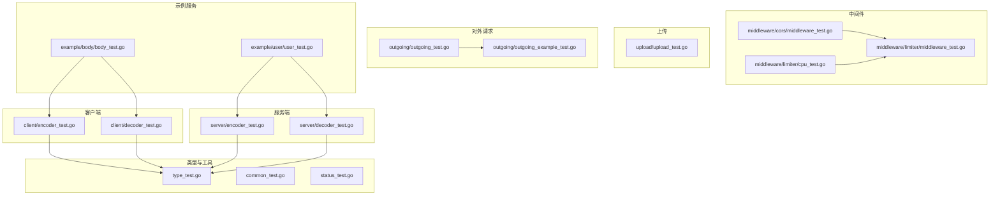

**图表来源**
- [client/encoder_test.go:1-150](file://client/encoder_test.go#L1-L150)
- [client/decoder_test.go:1-179](file://client/decoder_test.go#L1-L179)
- [server/encoder_test.go:1-103](file://server/encoder_test.go#L1-L103)
- [server/decoder_test.go:1-108](file://server/decoder_test.go#L1-L108)
- [type_test.go:1-800](file://type_test.go#L1-L800)
- [common_test.go:1-32](file://common_test.go#L1-L32)
- [status_test.go:1-86](file://status_test.go#L1-L86)
- [middleware/cors/middleware_test.go:1-500](file://middleware/cors/middleware_test.go#L1-L500)
- [middleware/limiter/middleware_test.go:1-143](file://middleware/limiter/middleware_test.go#L1-L143)
- [middleware/limiter/cpu_test.go:1-25](file://middleware/limiter/cpu_test.go#L1-L25)
- [upload/upload_test.go:1-668](file://upload/upload_test.go#L1-L668)
- [outgoing/outgoing_test.go:1-699](file://outgoing/outgoing_test.go#L1-L699)
- [outgoing/outgoing_example_test.go:1-274](file://outgoing/outgoing_example_test.go#L1-L274)
- [example/body/body_test.go:1-164](file://example/body/body_test.go#L1-L164)
- [example/user/user_test.go:1-160](file://example/user/user_test.go#L1-L160)

**章节来源**
- [client/decoder_test.go:1-179](file://client/decoder_test.go#L1-L179)
- [client/encoder_test.go:1-150](file://client/encoder_test.go#L1-L150)
- [server/decoder_test.go:1-108](file://server/decoder_test.go#L1-L108)
- [server/encoder_test.go:1-103](file://server/encoder_test.go#L1-L103)
- [type_test.go:1-800](file://type_test.go#L1-L800)
- [common_test.go:1-32](file://common_test.go#L1-L32)
- [status_test.go:1-86](file://status_test.go#L1-L86)
- [middleware/cors/middleware_test.go:1-500](file://middleware/cors/middleware_test.go#L1-L500)
- [middleware/limiter/middleware_test.go:1-143](file://middleware/limiter/middleware_test.go#L1-L143)
- [middleware/limiter/cpu_test.go:1-25](file://middleware/limiter/cpu_test.go#L1-L25)
- [upload/upload_test.go:1-668](file://upload/upload_test.go#L1-L668)
- [outgoing/outgoing_test.go:1-699](file://outgoing/outgoing_test.go#L1-L699)
- [outgoing/outgoing_example_test.go:1-274](file://outgoing/outgoing_example_test.go#L1-L274)
- [example/body/body_test.go:1-164](file://example/body/body_test.go#L1-L164)
- [example/user/user_test.go:1-160](file://example/user/user_test.go#L1-L160)

## 核心组件与测试策略
- 编解码器测试
  - 客户端/服务端分别提供 Encode/Decode 的完整链路测试，覆盖成功路径与错误路径（不可读的Body、无效JSON、协议消息不匹配等）。
  - 断言要点：状态码、头信息、正文内容、协议消息字段一致性；错误类型与错误信息。
- 类型与格式化测试
  - 覆盖布尔、整数、浮点、切片、包装器等类型的解析与格式化，采用表格驱动测试，覆盖正常值、边界值与非法输入。
  - 断言要点：解析结果与期望一致、错误标记正确、切片长度与元素值均正确。
- 错误处理测试
  - 默认错误编码器根据错误实现动态选择文本或JSON输出，并支持设置状态码与响应头。
  - 断言要点：Content-Type、状态码、响应体包含性、自定义头存在。
- 中间件测试
  - CORS：覆盖允许来源、通配符、预检、暴露头、凭证、私有网络、Vary 头等。
  - 限流：覆盖窗口、桶数量、CPU阈值、中间件链、默认状态码等。
- 上传处理测试
  - 覆盖扩展名推断、大小限制、多部分解析、重复字段名聚合、混合类型、未知类型回退等。
  - 断言要点：保存文件名后缀、文件内容、统计字段（总数、文件数、字段数）。
- 对外请求客户端测试
  - 覆盖选项设置（查询、头、Cookie、认证、缓存控制等）、发送流程、响应读取（字节、文本、JSON、对象）、错误封装与链式调用。
  - 断言要点：状态码、头信息、正文内容、错误类型与消息。
- 示例服务测试
  - 启动本地HTTP服务，调用生成的客户端，断言响应内容，用于验证编解码器与路由生成的一致性。

**章节来源**
- [client/decoder_test.go:19-64](file://client/decoder_test.go#L19-L64)
- [client/encoder_test.go:17-59](file://client/encoder_test.go#L17-L59)
- [server/decoder_test.go:39-53](file://server/decoder_test.go#L39-L53)
- [server/encoder_test.go:31-50](file://server/encoder_test.go#L31-L50)
- [type_test.go:13-36](file://type_test.go#L13-L36)
- [status_test.go:36-85](file://status_test.go#L36-L85)
- [middleware/cors/middleware_test.go:41-133](file://middleware/cors/middleware_test.go#L41-L133)
- [middleware/limiter/middleware_test.go:13-79](file://middleware/limiter/middleware_test.go#L13-L79)
- [upload/upload_test.go:61-97](file://upload/upload_test.go#L61-L97)
- [outgoing/outgoing_test.go:17-55](file://outgoing/outgoing_test.go#L17-L55)
- [example/body/body_test.go:70-83](file://example/body/body_test.go#L70-L83)

## 架构总览与测试覆盖
下图展示测试与被测模块之间的映射关系，突出“编解码器—类型—错误处理—中间件—上传—对外请求—示例服务”的测试覆盖路径。

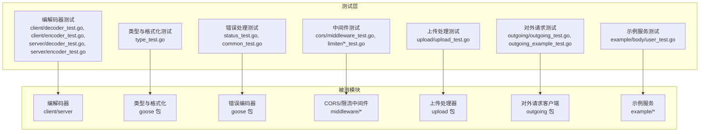

**图表来源**
- [client/decoder_test.go:1-179](file://client/decoder_test.go#L1-L179)
- [client/encoder_test.go:1-150](file://client/encoder_test.go#L1-L150)
- [server/decoder_test.go:1-108](file://server/decoder_test.go#L1-L108)
- [server/encoder_test.go:1-103](file://server/encoder_test.go#L1-L103)
- [type_test.go:1-800](file://type_test.go#L1-L800)
- [status_test.go:1-86](file://status_test.go#L1-L86)
- [common_test.go:1-32](file://common_test.go#L1-L32)
- [middleware/cors/middleware_test.go:1-500](file://middleware/cors/middleware_test.go#L1-L500)
- [middleware/limiter/middleware_test.go:1-143](file://middleware/limiter/middleware_test.go#L1-L143)
- [middleware/limiter/cpu_test.go:1-25](file://middleware/limiter/cpu_test.go#L1-L25)
- [upload/upload_test.go:1-668](file://upload/upload_test.go#L1-L668)
- [outgoing/outgoing_test.go:1-699](file://outgoing/outgoing_test.go#L1-L699)
- [outgoing/outgoing_example_test.go:1-274](file://outgoing/outgoing_example_test.go#L1-L274)
- [example/body/body_test.go:1-164](file://example/body/body_test.go#L1-L164)
- [example/user/user_test.go:1-160](file://example/user/user_test.go#L1-L160)

## 详细组件分析

### 编解码器测试（客户端）
- 成功路径：构造合法的 Protobuf Struct/HttpBody/HttpResponse，断言解码/编码后的字段与原始一致。
- 异常路径：不可读Body、无效JSON、协议消息不匹配，断言返回非空错误。
- 断言方法：使用比较器对比协议消息、字节切片比对、头信息断言。
- 数据准备：使用内存Reader/Buffer、临时Header、Protobuf消息构造器。

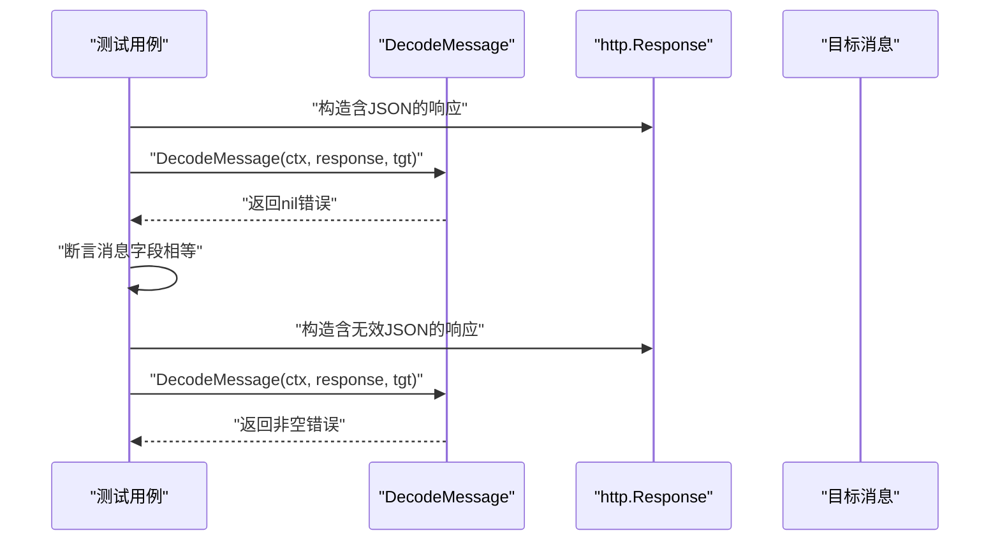

**图表来源**
- [client/decoder_test.go:19-64](file://client/decoder_test.go#L19-L64)

**章节来源**
- [client/decoder_test.go:19-64](file://client/decoder_test.go#L19-L64)

### 编解码器测试（服务端）
- 成功路径：从http.Request读取Body与Header，断言解码后的字段与期望一致。
- 异常路径：不可读Body、无效JSON，断言返回非空错误。
- 断言方法：字符串/字节切片比对、头信息断言、状态码断言。
- 数据准备：使用内存Reader、Header构造、URL构造。

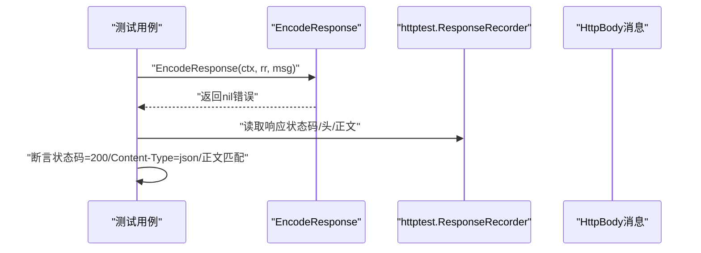

**图表来源**
- [server/encoder_test.go:31-50](file://server/encoder_test.go#L31-L50)

**章节来源**
- [server/encoder_test.go:31-50](file://server/encoder_test.go#L31-L50)

### 类型与格式化测试
- 设计原则：表格驱动测试，覆盖正常值、边界值、非法输入；对切片测试进行长度与元素值双重断言。
- 断言方法：反射比较、字符串/字节切片比对、错误标记断言。
- 数据准备：构造基础类型与切片、包装器消息。

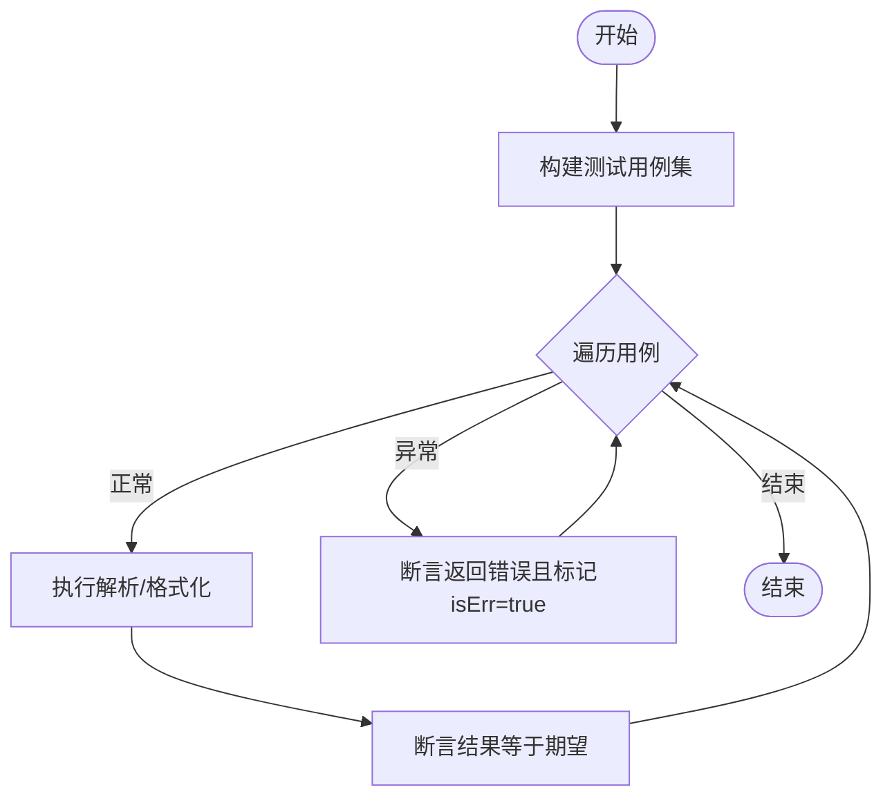

**图表来源**
- [type_test.go:13-36](file://type_test.go#L13-L36)

**章节来源**
- [type_test.go:13-36](file://type_test.go#L13-L36)

### 错误处理测试
- 设计原则：针对不同错误实现（JSON序列化、自定义头、状态码）分别断言。
- 断言方法：状态码、Content-Type、响应体包含性、自定义头存在。
- 数据准备：自定义错误类型实现相应接口。

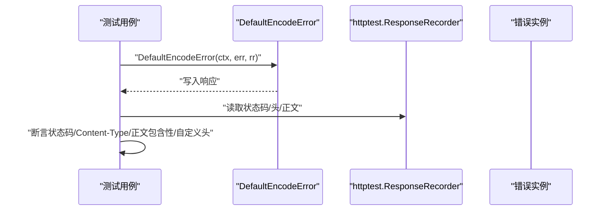

**图表来源**
- [status_test.go:36-85](file://status_test.go#L36-L85)

**章节来源**
- [status_test.go:36-85](file://status_test.go#L36-L85)

### 中间件测试（CORS）
- 设计原则：覆盖允许来源、通配符、预检、暴露头、凭证、私有网络、Vary头等。
- 断言方法：状态码、头信息、Vary组合值包含性。
- 数据准备：httptest.NewRequest/ResponseRecorder、server.Invoke链式调用。

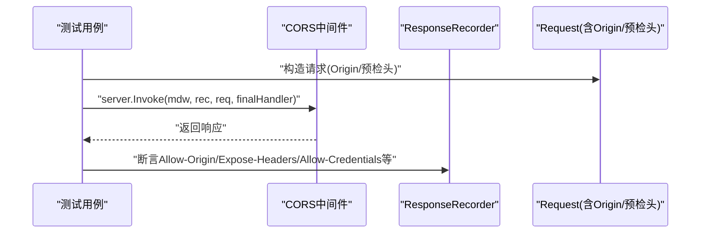

**图表来源**
- [middleware/cors/middleware_test.go:41-133](file://middleware/cors/middleware_test.go#L41-L133)

**章节来源**
- [middleware/cors/middleware_test.go:41-133](file://middleware/cors/middleware_test.go#L41-L133)

### 中间件测试（限流）
- 设计原则：验证中间件链、默认状态码、高CPU阈值下的限流行为（通过日志观察）。
- 断言方法：状态码、响应体、中间件链注入的自定义头。
- 数据准备：httptest.NewRequest/ResponseRecorder、server.Chain。

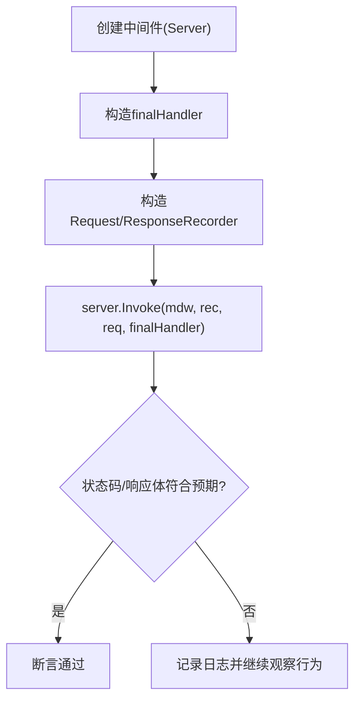

**图表来源**
- [middleware/limiter/middleware_test.go:13-79](file://middleware/limiter/middleware_test.go#L13-L79)

**章节来源**
- [middleware/limiter/middleware_test.go:13-79](file://middleware/limiter/middleware_test.go#L13-L79)

### 上传处理测试
- 设计原则：覆盖扩展名推断（基于Content-Type优先，其次文件名回退）、大小限制、多部分解析、重复字段名聚合、混合类型、未知类型回退。
- 断言方法：保存文件名后缀、文件内容、统计字段（总数、文件数、字段数）。
- 数据准备：multipart构造器、临时目录、错误类型断言。

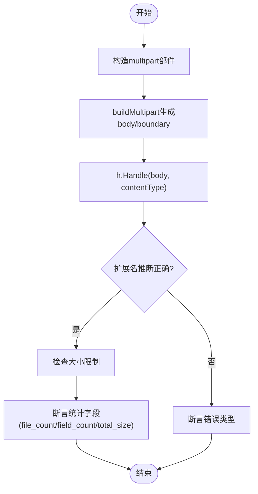

**图表来源**
- [upload/upload_test.go:338-400](file://upload/upload_test.go#L338-L400)

**章节来源**
- [upload/upload_test.go:61-97](file://upload/upload_test.go#L61-L97)
- [upload/upload_test.go:338-400](file://upload/upload_test.go#L338-L400)
- [upload/upload_test.go:405-438](file://upload/upload_test.go#L405-L438)
- [upload/upload_test.go:489-518](file://upload/upload_test.go#L489-L518)

### 对外请求客户端测试
- 设计原则：覆盖选项设置（查询、头、Cookie、认证、缓存控制等）、发送流程、响应读取（字节、文本、JSON、对象）、错误封装与链式调用。
- 断言方法：状态码、头信息、正文内容、错误类型与消息。
- 数据准备：httptest.Server模拟远程服务、URL构造、JSON/表单/字节体构造。

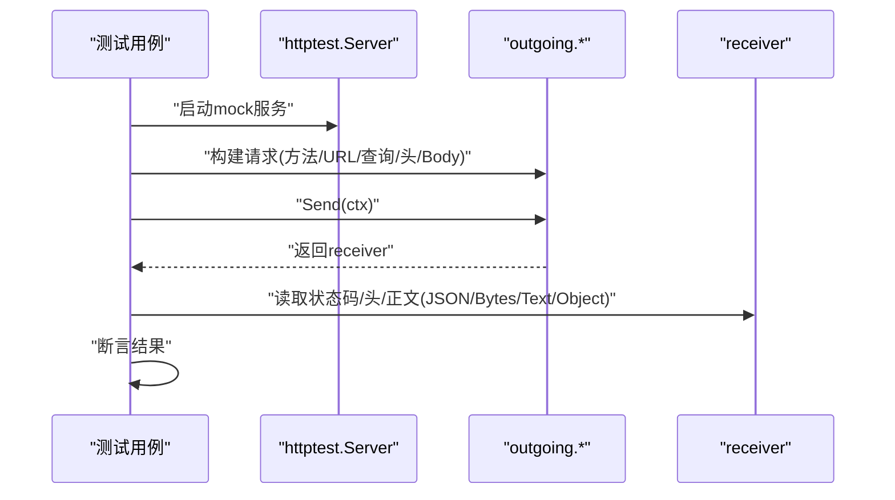

**图表来源**
- [outgoing/outgoing_test.go:315-348](file://outgoing/outgoing_test.go#L315-L348)

**章节来源**
- [outgoing/outgoing_test.go:17-55](file://outgoing/outgoing_test.go#L17-L55)
- [outgoing/outgoing_test.go:315-348](file://outgoing/outgoing_test.go#L315-L348)
- [outgoing/outgoing_test.go:477-503](file://outgoing/outgoing_test.go#L477-L503)

### 示例服务测试
- 设计原则：启动本地HTTP服务，调用生成的客户端，断言响应内容，验证编解码器与路由生成的一致性。
- 断言方法：响应消息字段、状态码。
- 数据准备：本地HTTP服务、客户端生成器。

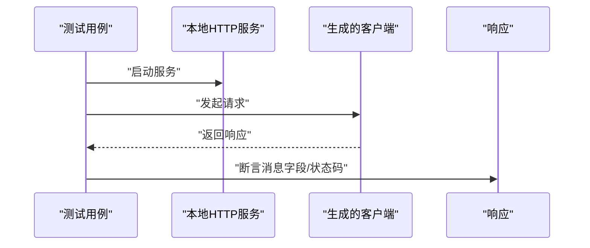

**图表来源**
- [example/body/body_test.go:70-83](file://example/body/body_test.go#L70-L83)
- [example/user/user_test.go:63-77](file://example/user/user_test.go#L63-L77)

**章节来源**
- [example/body/body_test.go:70-83](file://example/body/body_test.go#L70-L83)
- [example/user/user_test.go:63-77](file://example/user/user_test.go#L63-L77)

## 依赖关系分析
- 组件内聚与耦合
  - 编解码器测试高度内聚于各自包，仅依赖标准库与Protobuf类型，耦合度低。
  - 类型与格式化测试集中在根包，便于跨模块复用。
  - 中间件测试依赖server.Invoke链式调用，体现中间件组合特性。
  - 上传与对外请求测试依赖标准库与第三方库（如multipart、httptest），但通过构造器与选项隔离外部依赖。
- 外部依赖与集成点
  - Protobuf消息与Google RPC类型用于编解码器测试。
  - httptest用于模拟HTTP服务与客户端。
  - testify用于断言辅助（如assert.Equal）。

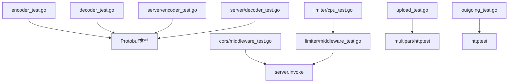

**图表来源**
- [client/encoder_test.go:1-150](file://client/encoder_test.go#L1-L150)
- [client/decoder_test.go:1-179](file://client/decoder_test.go#L1-L179)
- [server/encoder_test.go:1-103](file://server/encoder_test.go#L1-L103)
- [server/decoder_test.go:1-108](file://server/decoder_test.go#L1-L108)
- [middleware/cors/middleware_test.go:1-500](file://middleware/cors/middleware_test.go#L1-L500)
- [middleware/limiter/middleware_test.go:1-143](file://middleware/limiter/middleware_test.go#L1-L143)
- [middleware/limiter/cpu_test.go:1-25](file://middleware/limiter/cpu_test.go#L1-L25)
- [upload/upload_test.go:1-668](file://upload/upload_test.go#L1-L668)
- [outgoing/outgoing_test.go:1-699](file://outgoing/outgoing_test.go#L1-L699)

**章节来源**
- [middleware/cors/middleware_test.go:1-500](file://middleware/cors/middleware_test.go#L1-L500)
- [middleware/limiter/middleware_test.go:1-143](file://middleware/limiter/middleware_test.go#L1-L143)
- [upload/upload_test.go:1-668](file://upload/upload_test.go#L1-L668)
- [outgoing/outgoing_test.go:1-699](file://outgoing/outgoing_test.go#L1-L699)

## 性能与稳定性考量
- 并发与限流
  - 限流中间件通过CPU阈值与窗口机制控制请求速率，测试中可通过降低阈值与高并发请求触发限流行为，验证中间件链的稳定性。
- 响应读取
  - 对外请求客户端支持多种响应读取方式（字节、文本、JSON、对象），建议在大体积响应场景下优先使用流式读取以避免内存峰值。
- 上传性能
  - 上传测试覆盖多部分解析与大小限制，建议在真实环境评估磁盘IO与内存占用，合理设置最大文件大小与总大小。

[本节为通用指导，无需具体文件引用]

## 故障排查指南
- 编解码器错误
  - 若解码失败，检查输入是否为合法JSON、Body是否可读、协议消息字段是否匹配。
  - 若编码失败，检查Writer是否可写、消息是否可序列化。
- 类型解析错误
  - 表格驱动测试中若出现断言失败，优先检查用例覆盖范围（正常值、边界值、非法输入）。
- CORS错误
  - 若预检失败，检查Access-Control-Request-*头是否齐全、允许的方法/头是否包含在白名单。
- 上传错误
  - 若扩展名推断异常，检查Content-Type与文件名后缀；若超出大小限制，确认MaxFileSize/MaxTotalSize配置。
- 对外请求错误
  - 若发送失败，检查URL、方法、头信息、Body类型与Content-Type是否匹配；查看错误封装信息定位问题。

**章节来源**
- [client/decoder_test.go:54-64](file://client/decoder_test.go#L54-L64)
- [client/encoder_test.go:53-59](file://client/encoder_test.go#L53-L59)
- [middleware/cors/middleware_test.go:223-232](file://middleware/cors/middleware_test.go#L223-L232)
- [upload/upload_test.go:489-518](file://upload/upload_test.go#L489-L518)
- [outgoing/outgoing_test.go:289-313](file://outgoing/outgoing_test.go#L289-L313)

## 结论
本仓库的单元测试体系覆盖编解码器、类型解析、错误处理、中间件、上传与对外请求等关键模块，采用表格驱动、链式调用与httptest模拟等策略，确保测试的可维护性与可扩展性。遵循本文提供的测试设计原则与断言方法，可在保证质量的同时提升开发效率。

[本节为总结，无需具体文件引用]

## 附录：测试设计原则与断言方法
- 测试设计原则
  - 输入边界：覆盖最小/最大值、零值、空切片、nil指针等。
  - 异常路径：无效JSON、不可读Body、超限、未知类型等。
  - 组合场景：多部分解析、重复字段名、混合类型、链式调用等。
- 断言方法
  - 状态码断言：http.StatusOK、自定义状态码。
  - 头信息断言：Content-Type、自定义头、Vary组合值。
  - 正文断言：字节切片比对、JSON反序列化断言、对象断言。
  - 错误断言：错误类型判断、错误消息包含性、错误封装链。
- 测试数据准备策略
  - 构造器：使用multipart构造器、临时目录、内存Reader/Buffer。
  - 模拟对象：httptest.Server/ResponseRecorder、自定义错误类型。
  - 选项与链式调用：通过选项函数与链式调用构建复杂请求。

[本节为通用指导，无需具体文件引用]