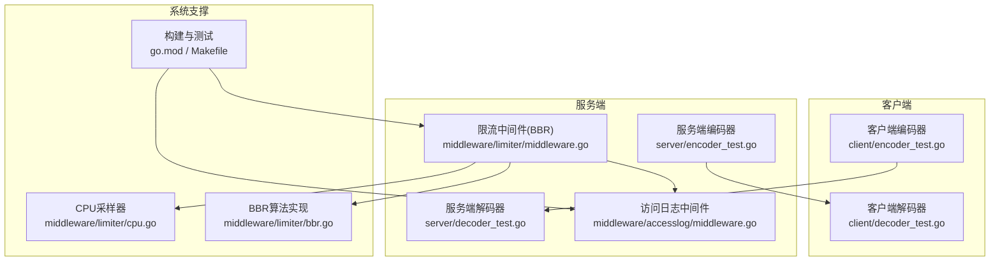
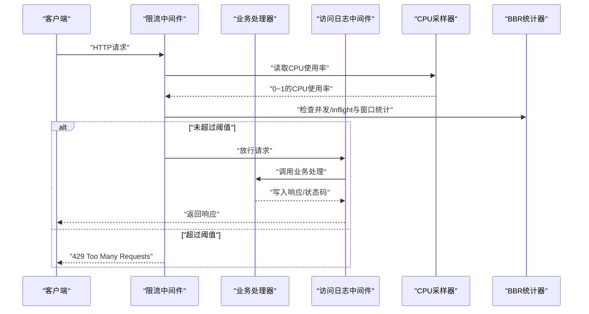
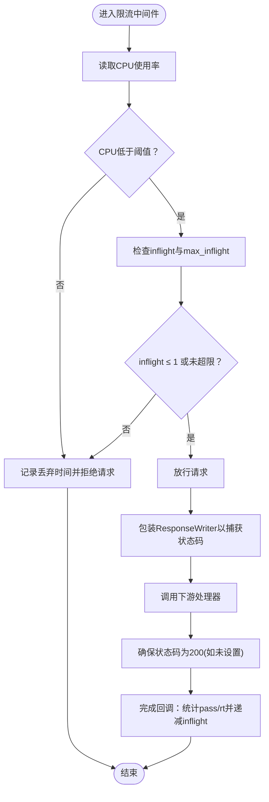
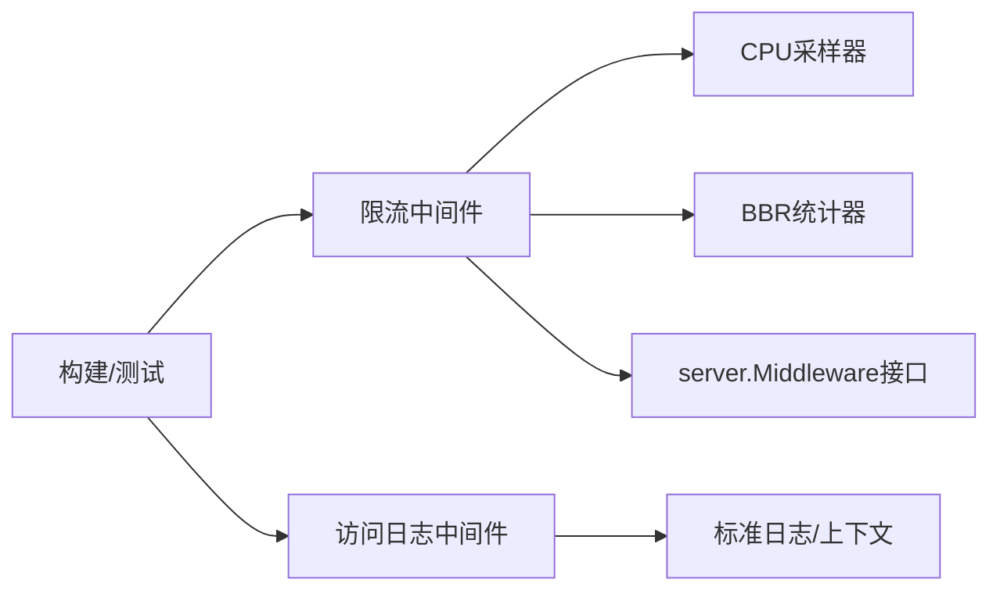

# 性能测试

<cite>
**本文引用的文件**
- [go.mod](file://go.mod)
- [Makefile](file://Makefile)
- [middleware/limiter/cpu.go](file://middleware/limiter/cpu.go)
- [middleware/limiter/cpu_test.go](file://middleware/limiter/cpu_test.go)
- [middleware/limiter/middleware.go](file://middleware/limiter/middleware.go)
- [middleware/limiter/middleware_test.go](file://middleware/limiter/middleware_test.go)
- [middleware/limiter/bbr.go](file://middleware/limiter/bbr.go)
- [middleware/accesslog/middleware.go](file://middleware/accesslog/middleware.go)
- [server/decoder_test.go](file://server/decoder_test.go)
- [server/encoder_test.go](file://server/encoder_test.go)
- [client/decoder_test.go](file://client/decoder_test.go)
- [client/encoder_test.go](file://client/encoder_test.go)
</cite>

## 目录
1. [引言](#引言)
2. [项目结构](#项目结构)
3. [核心组件](#核心组件)
4. [架构总览](#架构总览)
5. [详细组件分析](#详细组件分析)
6. [依赖关系分析](#依赖关系分析)
7. [性能考量](#性能考量)
8. [故障排查指南](#故障排查指南)
9. [结论](#结论)
10. [附录](#附录)

## 引言
本文件聚焦于 HTTP 服务器的性能测试与基准测试方法，结合仓库中的限流中间件与访问日志中间件，系统阐述吞吐量、延迟与并发三类测试的设计思路与实施要点，并给出结果分析与优化策略。同时提供内存与 CPU 监控建议及测试场景设计，帮助读者在真实生产环境中开展可重复、可观测的性能评估。

## 项目结构
本仓库围绕 HTTP 编解码、服务端中间件（含限流与访问日志）以及示例与测试展开。与性能测试直接相关的关键模块如下：
- 中间件层：限流中间件（基于 BBR 的 CPU 驱动限流）、访问日志中间件（记录延迟等指标）
- 服务端编解码：HTTP 请求/响应与 Protobuf 的编解码测试，体现序列化开销
- 客户端编解码：与服务端对称的编解码路径，便于端到端压测
- 构建与测试：统一的构建与测试入口，便于自动化性能回归

图表来源
- [middleware/limiter/middleware.go:1-64](file://middleware/limiter/middleware.go#L1-L64)
- [middleware/limiter/cpu.go:1-69](file://middleware/limiter/cpu.go#L1-L69)
- [middleware/limiter/bbr.go:175-280](file://middleware/limiter/bbr.go#L175-L280)
- [middleware/accesslog/middleware.go:162-196](file://middleware/accesslog/middleware.go#L162-L196)
- [server/decoder_test.go:1-108](file://server/decoder_test.go#L1-L108)
- [server/encoder_test.go:1-103](file://server/encoder_test.go#L1-L103)
- [client/decoder_test.go:1-179](file://client/decoder_test.go#L1-L179)
- [client/encoder_test.go:1-150](file://client/encoder_test.go#L1-L150)
- [go.mod:1-14](file://go.mod#L1-L14)
- [Makefile:1-29](file://Makefile#L1-L29)

章节来源
- [go.mod:1-14](file://go.mod#L1-L14)
- [Makefile:1-29](file://Makefile#L1-L29)

## 核心组件
- 限流中间件（Server）：基于 BBR 算法与 CPU 使用率阈值动态调节并发上限，支持捕获实际状态码以提升统计准确性；在超限时返回 429。
- CPU 采样器：周期性采集系统 CPU 百分比并转换为 0~1 的浮点值，供限流器判断。
- BBR 统计器：维护滑动窗口内的通过请求数与最小 RT，计算 max_inflight，决定是否丢弃请求。
- 访问日志中间件：记录请求处理延迟、状态码、方法、路径、用户代理等，便于延迟与吞吐分析。
- 服务端/客户端编解码：提供 HTTP 与 Protobuf 的编解码路径，用于端到端压测与序列化开销评估。

章节来源
- [middleware/limiter/middleware.go:1-64](file://middleware/limiter/middleware.go#L1-L64)
- [middleware/limiter/cpu.go:1-69](file://middleware/limiter/cpu.go#L1-L69)
- [middleware/limiter/bbr.go:175-280](file://middleware/limiter/bbr.go#L175-L280)
- [middleware/accesslog/middleware.go:162-196](file://middleware/accesslog/middleware.go#L162-L196)
- [server/decoder_test.go:1-108](file://server/decoder_test.go#L1-L108)
- [server/encoder_test.go:1-103](file://server/encoder_test.go#L1-L103)
- [client/decoder_test.go:1-179](file://client/decoder_test.go#L1-L179)
- [client/encoder_test.go:1-150](file://client/encoder_test.go#L1-L150)

## 架构总览
下图展示一次典型请求在限流与日志中间件之间的交互流程，以及 CPU 采样与 BBR 决策对请求放行的影响。

图表来源
- [middleware/limiter/middleware.go:36-63](file://middleware/limiter/middleware.go#L36-L63)
- [middleware/limiter/cpu.go:32-68](file://middleware/limiter/cpu.go#L32-L68)
- [middleware/limiter/bbr.go:180-244](file://middleware/limiter/bbr.go#L180-L244)
- [middleware/accesslog/middleware.go:162-196](file://middleware/accesslog/middleware.go#L162-L196)

## 详细组件分析

### 限流中间件（BBR + CPU 驱动）
- 设计要点
  - 使用原子计数维护并发请求数（inflight），在请求完成时递减。
  - 通过滑动窗口统计 pass 数与最小 RT，计算 max_inflight，若当前 inflight 超过阈值则丢弃请求。
  - 读取 CPU 使用率，低于阈值时允许放行；高于阈值且并发较高时触发丢弃，避免雪崩。
  - 捕获实际状态码，确保统计准确（默认 200）。
- 关键行为
  - 放行：调用下一个中间件/处理器。
  - 拒绝：返回 429，提示“超出速率限制”。
- 测试覆盖
  - 正常请求放行与链路组合。
  - 高 CPU 场景下的限流触发（通过自定义 CPU 回调模拟）。
  - 中间件链顺序与默认状态码处理。

图表来源
- [middleware/limiter/middleware.go:36-63](file://middleware/limiter/middleware.go#L36-L63)
- [middleware/limiter/bbr.go:180-206](file://middleware/limiter/bbr.go#L180-L206)
- [middleware/limiter/bbr.go:208-244](file://middleware/limiter/bbr.go#L208-L244)

章节来源
- [middleware/limiter/middleware.go:1-64](file://middleware/limiter/middleware.go#L1-L64)
- [middleware/limiter/middleware_test.go:1-143](file://middleware/limiter/middleware_test.go#L1-L143)
- [middleware/limiter/bbr.go:175-280](file://middleware/limiter/bbr.go#L175-L280)

### CPU 采样器
- 设计要点
  - 程序启动时初始化 CPU 使用率为 0，并启动后台 goroutine 循环采样。
  - 采样间隔通过原子变量控制，避免频繁阻塞；错误时退避重试。
  - 返回值范围 0.0~1.0，适配限流器阈值比较。
- 测试要点
  - 采样值范围校验（0~1）。
  - 采样间隔配置生效。

章节来源
- [middleware/limiter/cpu.go:1-69](file://middleware/limiter/cpu.go#L1-L69)
- [middleware/limiter/cpu_test.go:1-25](file://middleware/limiter/cpu_test.go#L1-L25)

### 访问日志中间件
- 设计要点
  - 记录请求处理延迟、方法、路径、状态码、UA、请求 ID 等字段，便于后续延迟分布与吞吐分析。
  - 支持可选打印请求/响应体（注意生产环境谨慎开启）。
- 性能影响
  - 结构化日志输出会带来额外开销，建议在压测阶段按需启用。

章节来源
- [middleware/accesslog/middleware.go:162-196](file://middleware/accesslog/middleware.go#L162-L196)

### 服务端/客户端编解码
- 设计要点
  - 提供 HTTP 与 Protobuf 的编解码路径，包含通用消息、HttpBody、HttpResponse 等类型。
  - 测试覆盖 JSON 序列化/反序列化、头部与正文一致性校验。
- 性能意义
  - 编解码路径是端到端延迟的重要组成部分，压测时应关注序列化/反序列化成本与缓冲区分配。

章节来源
- [server/decoder_test.go:1-108](file://server/decoder_test.go#L1-L108)
- [server/encoder_test.go:1-103](file://server/encoder_test.go#L1-L103)
- [client/decoder_test.go:1-179](file://client/decoder_test.go#L1-L179)
- [client/encoder_test.go:1-150](file://client/encoder_test.go#L1-L150)

## 依赖关系分析
- 限流中间件依赖
  - server.Middleware 接口约定的调用模型。
  - CPU 采样器提供的 CPU 使用率。
  - BBR 统计器的滑动窗口统计能力。
- 访问日志中间件依赖
  - 标准库日志与上下文 deadline 字段，用于丰富观测维度。
- 构建与测试
  - go.mod 管理外部依赖，Makefile 提供统一构建与测试命令，便于自动化性能回归。

图表来源
- [middleware/limiter/middleware.go:1-64](file://middleware/limiter/middleware.go#L1-L64)
- [middleware/limiter/cpu.go:1-69](file://middleware/limiter/cpu.go#L1-L69)
- [middleware/limiter/bbr.go:175-280](file://middleware/limiter/bbr.go#L175-L280)
- [middleware/accesslog/middleware.go:162-196](file://middleware/accesslog/middleware.go#L162-L196)
- [go.mod:1-14](file://go.mod#L1-L14)
- [Makefile:1-29](file://Makefile#L1-L29)

章节来源
- [go.mod:1-14](file://go.mod#L1-L14)
- [Makefile:1-29](file://Makefile#L1-L29)

## 性能考量
- 吞吐量测试
  - 使用稳定的压力生成工具（如 wrk、ghz、Vegeta 或自研压测客户端）构造恒定或阶梯式 QPS。
  - 关注 5xx/429 比例与 P95/P99 延迟，识别限流触发点。
  - 逐步提高并发，观察系统从“低负载”到“CPU 饱和”的拐点。
- 延迟测试
  - 使用访问日志中间件记录的“latency”字段，结合不同 QPS 下的延迟分布，绘制延迟曲线。
  - 分离网络/编解码/业务处理三段延迟，定位瓶颈。
- 并发测试
  - 以 inflight 作为并发度指标，结合 BBR 的 max_inflight 计算公式，理解并发上限与 RT 的关系。
  - 观察 CPU 使用率与并发的关系，避免在高 CPU 时继续扩大并发导致尾延迟飙升。
- 结果分析
  - 吞吐-延迟-并发三者关系：在 CPU 饱和前，吞吐随并发线性增长；越过阈值后，延迟快速上升，429 增多。
  - 状态码分布：关注 2xx、4xx、429、5xx 的占比，429 多通常意味着限流策略过于保守。
- 优化策略
  - 动态阈值：根据 CPU 使用率自适应调整阈值，避免在峰值 CPU 时过度丢弃请求。
  - 并发上限：合理设置窗口与桶数，使滑动窗口统计更贴近实时负载。
  - 编解码优化：减少不必要的序列化/拷贝，优先使用零拷贝与复用缓冲区。
  - 日志降噪：仅在必要时记录请求/响应体，降低日志 IO 对吞吐的影响。
  - 资源隔离：对热点路由单独限流，避免全局策略拖累整体吞吐。

## 故障排查指南
- 429 频繁
  - 检查 CPU 使用率是否长期高于阈值，适当提高阈值或引入弹性扩容。
  - 核对 inflight 是否持续偏高，确认下游是否存在慢处理。
- 延迟突增
  - 查看访问日志中的延迟分布，定位是否存在长尾请求。
  - 检查编解码路径是否产生大量临时对象，优化序列化策略。
- 状态码异常
  - 确认业务处理器是否显式设置了状态码；若未设置，中间件会默认 200。
- 监控缺失
  - 确认已启用访问日志中间件并正确记录关键字段（latency、status、method、path）。

章节来源
- [middleware/limiter/middleware.go:36-63](file://middleware/limiter/middleware.go#L36-L63)
- [middleware/accesslog/middleware.go:162-196](file://middleware/accesslog/middleware.go#L162-L196)

## 结论
通过将 CPU 驱动的 BBR 限流与访问日志观测相结合，可以在不牺牲可观测性的前提下，对 HTTP 服务器进行系统化的性能评估。建议以“QPS→延迟→并发→CPU 使用率”为主线，逐步逼近系统极限，并据此优化限流参数与编解码路径，最终达成稳定、可预期的吞吐与延迟表现。

## 附录
- 测试场景设计建议
  - 场景一：恒定 QPS 压测（如 100、500、1000 RPS），记录延迟分布与 429 比例。
  - 场景二：阶梯式并发（如 10→100→500→1000），观察吞吐与延迟拐点。
  - 场景三：突发流量（短时高并发），评估限流器的抗冲击能力。
- 监控方法
  - CPU 占用：使用系统级采样器（如 gopsutil）或容器监控工具，结合限流器的 CPU 使用率输入。
  - 内存使用：关注编解码过程中的临时缓冲区与对象分配，避免 GC 抖动。
  - 网络与磁盘：在高并发下观察连接数、队列长度与磁盘 IO，避免成为瓶颈。
- 工具与命令
  - 构建与测试：使用仓库提供的构建与测试命令，便于自动化回归。
  - 压测工具：选择与协议匹配的压测工具，确保客户端与服务端编解码一致。

章节来源
- [Makefile:1-29](file://Makefile#L1-L29)
- [go.mod:1-14](file://go.mod#L1-L14)