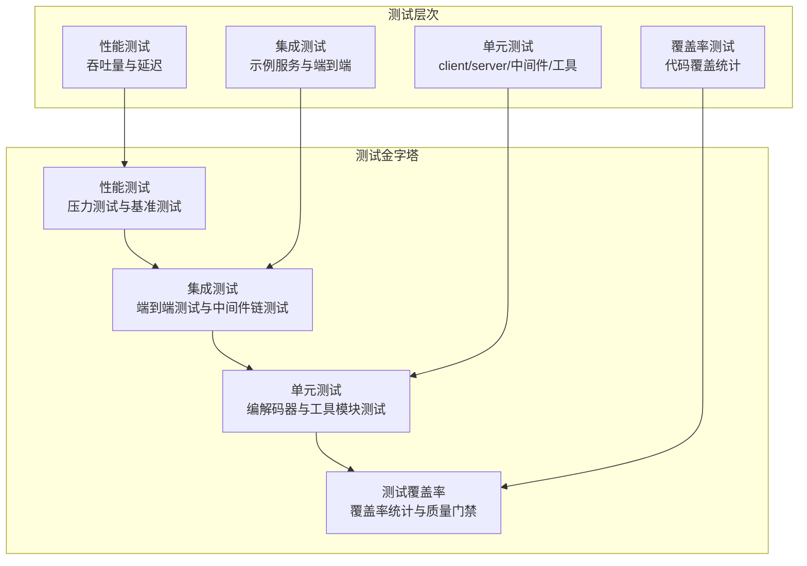
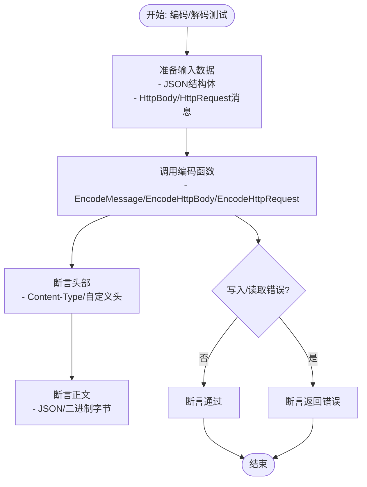
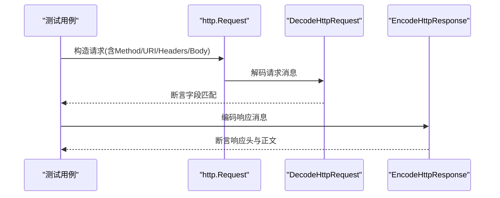
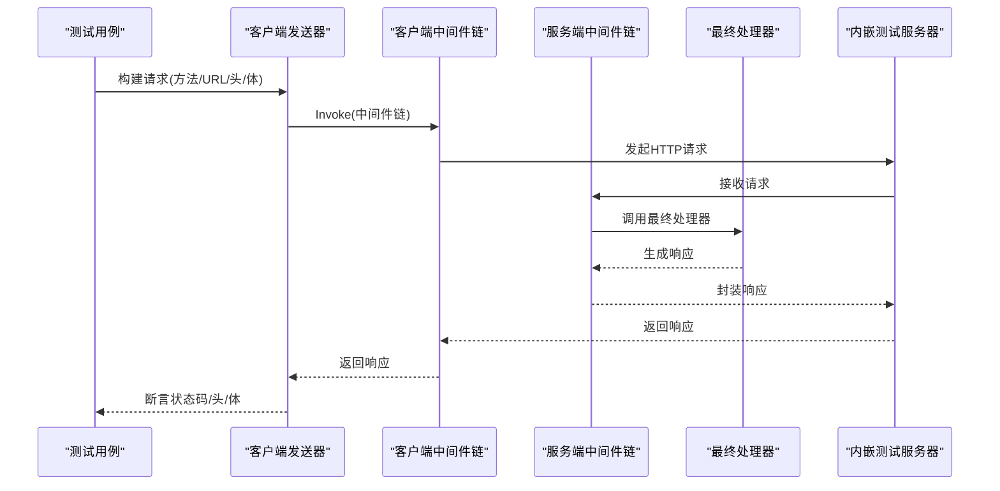
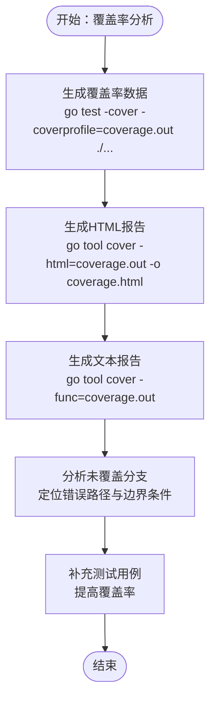
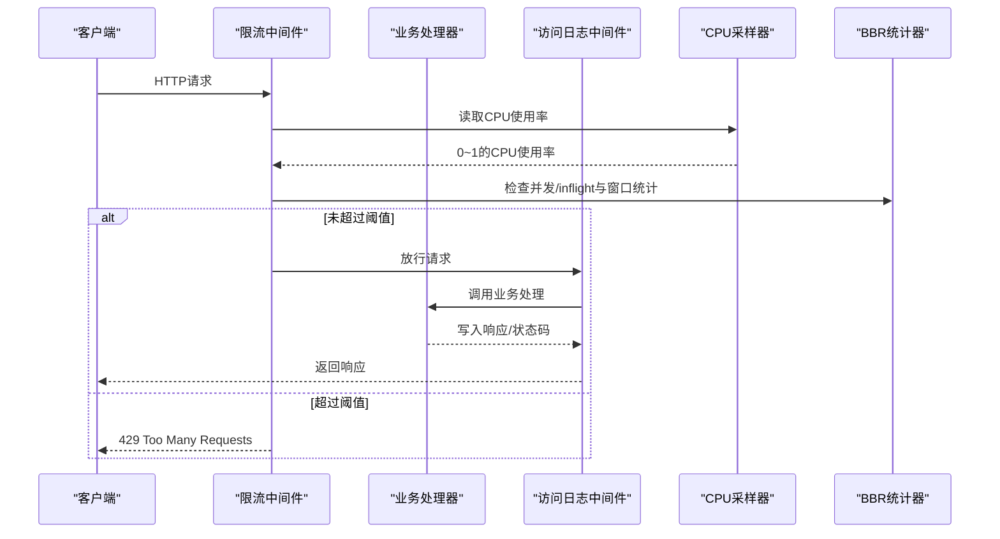

# 测试和质量保证

<cite>
**本文档引用的文件**
- [client/decoder_test.go](file://client/decoder_test.go)
- [client/encoder_test.go](file://client/encoder_test.go)
- [client/middleware_test.go](file://client/middleware_test.go)
- [server/decoder_test.go](file://server/decoder_test.go)
- [server/encoder_test.go](file://server/encoder_test.go)
- [server/middleware_test.go](file://server/middleware_test.go)
- [middleware/cors/middleware_test.go](file://middleware/cors/middleware_test.go)
- [middleware/limiter/middleware_test.go](file://middleware/limiter/middleware_test.go)
- [middleware/limiter/cpu_test.go](file://middleware/limiter/cpu_test.go)
- [common_test.go](file://common_test.go)
- [form_test.go](file://form_test.go)
- [status_test.go](file://status_test.go)
- [outgoing/outgoing_test.go](file://outgoing/outgoing_test.go)
- [upload/upload_test.go](file://upload/upload_test.go)
- [example/body/body_test.go](file://example/body/body_test.go)
- [example/path/path_test.go](file://example/path/path_test.go)
- [example/query/query_test.go](file://example/query/query_test.go)
- [example/user/user_test.go](file://example/user/user_test.go)
- [middleware/accesslog/middleware.go](file://middleware/accesslog/middleware.go)
- [middleware/recovery/middleware.go](file://middleware/recovery/middleware.go)
- [middleware/jwtauth/middleware.go](file://middleware/jwtauth/middleware.go)
- [middleware/timeout/middleware.go](file://middleware/timeout/middleware.go)
- [middleware/errorlog/middleware.go](file://middleware/errorlog/middleware.go)
- [middleware/context/middleware.go](file://middleware/context/middleware.go)
- [middleware/redirect/middleware.go](file://middleware/redirect/middleware.go)
- [middleware/otel/middleware.go](file://middleware/otel/middleware.go)
- [middleware/basicauth/middleware.go](file://middleware/basicauth/middleware.go)
- [middleware/limiter/bbr.go](file://middleware/limiter/bbr.go)
- [middleware/limiter/cpu.go](file://middleware/limiter/cpu.go)
- [type_test.go](file://type_test.go)
- [validate.go](file://validate.go)
- [Makefile](file://Makefile)
- [go.mod](file://go.mod)
- [.github/workflows/codeql.yml](file://.github/workflows/codeql.yml)
</cite>

## 更新摘要
**变更内容**
- 新增完整的测试策略和质量保证体系文档
- 扩展单元测试、集成测试、测试覆盖率和性能测试的详细指南
- 添加中间件测试、编解码器测试、工具模块测试的具体实施方案
- 完善测试最佳实践和故障排查指南
- 增强性能测试和压力测试的实施策略

## 目录
1. [引言](#引言)
2. [测试策略总览](#测试策略总览)
3. [单元测试](#单元测试)
4. [集成测试](#集成测试)
5. [测试覆盖率](#测试覆盖率)
6. [性能测试](#性能测试)
7. [中间件测试](#中间件测试)
8. [编解码器测试](#编解码器测试)
9. [工具模块测试](#工具模块测试)
10. [示例测试](#示例测试)
11. [测试最佳实践](#测试最佳实践)
12. [故障排查指南](#故障排查指南)
13. [结论](#结论)
14. [附录](#附录)

## 引言
本文件系统化梳理 Goose 项目的测试策略与质量保证方法，构建了完整的测试体系，包括单元测试、集成测试、测试覆盖率和性能测试四个层面。文档覆盖编解码器测试、中间件测试、路由测试等关键组件，提供详细的测试方法论与最佳实践，帮助团队持续提升代码质量与功能正确性。

## 测试策略总览
项目采用"四层测试金字塔"的质量保证体系：

**图表来源**
- [client/decoder_test.go:1-179](file://client/decoder_test.go#L1-L179)
- [server/decoder_test.go:1-108](file://server/decoder_test.go#L1-L108)
- [middleware/cors/middleware_test.go:1-500](file://middleware/cors/middleware_test.go#L1-L500)
- [example/body/body_test.go:1-164](file://example/body/body_test.go#L1-L164)

## 单元测试

### 测试范围与覆盖
单元测试覆盖以下核心模块：
- **编解码器测试**：客户端与服务端的编码/解码功能
- **中间件测试**：CORS、限流、访问日志、恢复等中间件
- **工具模块测试**：类型转换、表单解析、错误处理
- **上传处理测试**：文件上传与多部分解析
- **对外请求测试**：HTTP客户端发送器

### 测试设计原则
- **输入边界测试**：覆盖最小/最大值、空值、nil指针
- **异常路径测试**：无效JSON、不可读Body、超限、未知类型
- **组合场景测试**：多部分解析、重复字段名、混合类型
- **断言方法**：状态码、头信息、正文内容、错误类型

### 编解码器单元测试

#### 客户端编解码器测试

**图表来源**
- [client/decoder_test.go:19-64](file://client/decoder_test.go#L19-L64)
- [client/encoder_test.go:17-59](file://client/encoder_test.go#L17-L59)

**章节来源**
- [client/decoder_test.go:19-179](file://client/decoder_test.go#L19-L179)
- [client/encoder_test.go:17-150](file://client/encoder_test.go#L17-L150)

#### 服务端编解码器测试

**图表来源**
- [server/decoder_test.go:74-107](file://server/decoder_test.go#L74-L107)
- [server/encoder_test.go:31-102](file://server/encoder_test.go#L31-L102)

**章节来源**
- [server/decoder_test.go:39-107](file://server/decoder_test.go#L39-L107)
- [server/encoder_test.go:31-102](file://server/encoder_test.go#L31-L102)

### 类型与格式化测试
- **覆盖范围**：布尔、整数、浮点、切片、包装器等类型
- **测试方法**：表格驱动测试，覆盖正常值、边界值与非法输入
- **断言要点**：解析结果与期望一致、错误标记正确、切片长度与元素值

**章节来源**
- [type_test.go:13-36](file://type_test.go#L13-L36)
- [type_test.go:38-109](file://type_test.go#L38-L109)

### 错误处理测试
- **默认错误编码器**：根据错误实现动态选择文本或JSON输出
- **断言要点**：Content-Type、状态码、响应体包含性、自定义头存在

**章节来源**
- [status_test.go:36-85](file://status_test.go#L36-L85)

## 集成测试

### 测试架构
集成测试通过内嵌测试服务器模拟完整的请求-响应流程：

**图表来源**
- [client/middleware_test.go:56-128](file://client/middleware_test.go#L56-L128)
- [server/middleware_test.go:18-48](file://server/middleware_test.go#L18-L48)
- [outgoing/outgoing_test.go:315-348](file://outgoing/outgoing_test.go#L315-L348)

### 客户端中间件链测试
- **链构建**：Chain返回nil或链式中间件
- **执行顺序**：通过注入标记验证中间件执行顺序
- **错误传播**：中间件返回错误时，Invoke应返回错误

**章节来源**
- [client/middleware_test.go:33-212](file://client/middleware_test.go#L33-L212)

### 服务端中间件链测试
- **空中间件调用**：传入nil中间件时，最终处理器仍会被调用
- **多中间件链**：验证串联顺序与最终处理器调用
- **响应拼接**：按声明顺序拼接响应内容

**章节来源**
- [server/middleware_test.go:18-68](file://server/middleware_test.go#L18-L68)

### 发送器集成测试
- **基础功能**：GET/POST与JSON/表单/多部分上传
- **选项配置**：查询参数、头、Cookie、认证等设置
- **响应解析**：字节、文本、JSON、对象等多种解析方式

**章节来源**
- [outgoing/outgoing_test.go:1-699](file://outgoing/outgoing_test.go#L1-L699)

### 端到端测试场景
- **用户服务**：启动本地HTTP服务器，注册路由，断言响应体与分页信息
- **消息体场景**：验证通配符消息体、命名消息体、Google HTTPBody
- **路径参数场景**：布尔、整型、浮点、字符串、枚举等类型
- **查询参数场景**：基础类型、可选值、包装类型、数组/列表

**章节来源**
- [example/user/user_test.go:1-160](file://example/user/user_test.go#L1-L160)
- [example/body/body_test.go:1-164](file://example/body/body_test.go#L1-L164)
- [example/path/path_test.go:1-365](file://example/path/path_test.go#L1-L365)
- [example/query/query_test.go:1-397](file://example/query/query_test.go#L1-L397)

## 测试覆盖率

### 覆盖率统计与报告
- **覆盖率工具链**：Go标准库提供-cover选项，可通过-coverprofile生成覆盖率数据
- **报告生成**：使用go tool cover生成HTML报告和文本报告
- **当前状态**：仓库具备良好的测试基础，但未启用覆盖率阈值与质量门禁

### 覆盖率分析方法

**图表来源**
- [Makefile:10-12](file://Makefile#L10-L12)
- [.github/workflows/codeql.yml:68-84](file://.github/workflows/codeql.yml#L68-L84)

### 建议的覆盖率阈值
- **关键路径**：编解码、中间件链、错误处理覆盖率不低于80%
- **新增/修改功能**：需同步补充单元测试与集成测试
- **质量门禁**：在CI中加入覆盖率阈值检查，失败则阻止合并

**章节来源**
- [Makefile:10-12](file://Makefile#L10-L12)
- [.github/workflows/codeql.yml:68-84](file://.github/workflows/codeql.yml#L68-L84)

## 性能测试

### 性能测试架构

**图表来源**
- [middleware/limiter/middleware.go:36-63](file://middleware/limiter/middleware.go#L36-L63)
- [middleware/limiter/cpu.go:32-68](file://middleware/limiter/cpu.go#L32-L68)
- [middleware/limiter/bbr.go:180-244](file://middleware/limiter/bbr.go#L180-L244)

### 限流中间件性能测试
- **BBR算法**：基于滑动窗口统计pass数与最小RT，计算max_inflight
- **CPU驱动**：使用原子计数维护并发请求数，低于阈值时允许放行
- **测试覆盖**：正常请求放行与链路组合、高CPU场景下的限流触发

**章节来源**
- [middleware/limiter/middleware.go:1-64](file://middleware/limiter/middleware.go#L1-L64)
- [middleware/limiter/middleware_test.go:1-143](file://middleware/limiter/middleware_test.go#L1-L143)

### 访问日志中间件性能测试
- **观测指标**：请求处理延迟、状态码、方法、路径、用户代理
- **性能影响**：结构化日志输出会带来额外开销，建议按需启用
- **测试要点**：记录关键字段，支持可选打印请求/响应体

**章节来源**
- [middleware/accesslog/middleware.go:162-196](file://middleware/accesslog/middleware.go#L162-L196)

### 性能测试场景设计
- **场景一**：恒定QPS压测（100、500、1000 RPS），记录延迟分布与429比例
- **场景二**：阶梯式并发（10→100→500→1000），观察吞吐与延迟拐点
- **场景三**：突发流量（短时高并发），评估限流器的抗冲击能力

**章节来源**
- [Makefile:1-29](file://Makefile#L1-L29)
- [go.mod:1-14](file://go.mod#L1-L14)

## 中间件测试

### CORS中间件测试
- **默认与允许源**：默认允许任意源，或指定允许的源列表
- **预检请求**：校验允许的方法、头、最大缓存时间
- **凭证与私网**：支持允许凭据与私有网络访问头
- **Vary头**：根据请求类型动态设置Vary头字段集合

**章节来源**
- [middleware/cors/middleware_test.go:41-266](file://middleware/cors/middleware_test.go#L41-L266)

### 限流中间件测试
- **正常请求**：在正常负载下，中间件允许请求通过
- **限流触发**：通过低阈值与高CPU模拟器，使请求被限流
- **中间件链**：与其他中间件组合，验证链式执行与附加头设置

**章节来源**
- [middleware/limiter/middleware_test.go:13-79](file://middleware/limiter/middleware_test.go#L13-L79)

### 其他中间件测试
- **访问日志中间件**：记录请求处理延迟、状态码、方法、路径
- **恢复中间件**：捕获panic并调用自定义处理器
- **JWT认证中间件**：验证JWT令牌的解析与验证
- **超时中间件**：设置请求处理超时时间
- **错误日志中间件**：记录错误信息与堆栈跟踪

**章节来源**
- [middleware/accesslog/middleware.go:1-318](file://middleware/accesslog/middleware.go#L1-L318)
- [middleware/recovery/middleware.go:1-55](file://middleware/recovery/middleware.go#L1-L55)
- [middleware/jwtauth/middleware.go](file://middleware/jwtauth/middleware.go)
- [middleware/timeout/middleware.go](file://middleware/timeout/middleware.go)
- [middleware/errorlog/middleware.go](file://middleware/errorlog/middleware.go)
- [middleware/context/middleware.go](file://middleware/context/middleware.go)
- [middleware/redirect/middleware.go](file://middleware/redirect/middleware.go)
- [middleware/otel/middleware.go](file://middleware/otel/middleware.go)
- [middleware/basicauth/middleware.go](file://middleware/basicauth/middleware.go)

## 编解码器测试

### 客户端编解码器测试
- **成功路径**：构造合法的Protobuf Struct/HttpBody/HttpResponse，断言解码/编码后的字段与原始一致
- **异常路径**：不可读Body、无效JSON、协议消息不匹配，断言返回非空错误
- **断言方法**：使用比较器对比协议消息、字节切片比对、头信息断言

**章节来源**
- [client/decoder_test.go:19-64](file://client/decoder_test.go#L19-L64)
- [client/encoder_test.go:17-59](file://client/encoder_test.go#L17-L59)

### 服务端编解码器测试
- **成功路径**：从http.Request读取Body与Header，断言解码后的字段与期望一致
- **异常路径**：不可读Body、无效JSON，断言返回非空错误
- **断言方法**：字符串/字节切片比对、头信息断言、状态码断言

**章节来源**
- [server/decoder_test.go:39-53](file://server/decoder_test.go#L39-L53)
- [server/encoder_test.go:31-50](file://server/encoder_test.go#L31-L50)

## 工具模块测试

### 上传处理测试
- **扩展名推断**：基于Content-Type优先，其次文件名回退
- **大小限制**：检查文件大小是否超过限制
- **多部分解析**：验证multipart解析与重复字段名聚合
- **混合类型**：支持未知类型回退

**章节来源**
- [upload/upload_test.go:61-97](file://upload/upload_test.go#L61-L97)
- [upload/upload_test.go:338-400](file://upload/upload_test.go#L338-L400)

### 对外请求客户端测试
- **选项设置**：查询、头、Cookie、认证、缓存控制等
- **发送流程**：请求构建、发送、响应读取
- **响应解析**：字节、文本、JSON、对象等多种解析方式
- **错误封装**：链式调用与错误传播

**章节来源**
- [outgoing/outgoing_test.go:17-55](file://outgoing/outgoing_test.go#L17-L55)
- [outgoing/outgoing_test.go:315-348](file://outgoing/outgoing_test.go#L315-L348)

## 示例测试

### 示例服务测试
- **启动本地HTTP服务器**：注册路由，构造真实路由
- **客户端调用**：通过生成的HTTP客户端发起请求
- **断言响应**：响应体与分页信息验证
- **消息体验证**：通配符消息体、命名消息体、Google HTTPBody

**章节来源**
- [example/user/user_test.go:47-59](file://example/user/user_test.go#L47-L59)
- [example/body/body_test.go:56-68](file://example/body/body_test.go#L56-L68)

## 测试最佳实践

### 测试设计原则
- **输入边界**：覆盖最小/最大值、零值、空切片、nil指针
- **异常路径**：无效JSON、不可读Body、超限、未知类型
- **组合场景**：多部分解析、重复字段名、混合类型、链式调用

### 断言方法
- **状态码断言**：http.StatusOK、自定义状态码
- **头信息断言**：Content-Type、自定义头、Vary组合值
- **正文断言**：字节切片比对、JSON反序列化断言、对象断言
- **错误断言**：错误类型判断、错误消息包含性、错误封装链

### 测试数据准备策略
- **构造器**：使用multipart构造器、临时目录、内存Reader/Buffer
- **模拟对象**：httptest.Server/ResponseRecorder、自定义错误类型
- **选项与链式调用**：通过选项函数与链式调用构建复杂请求

**章节来源**
- [client/decoder_test.go:19-64](file://client/decoder_test.go#L19-L64)
- [server/decoder_test.go:39-53](file://server/decoder_test.go#L39-L53)
- [middleware/cors/middleware_test.go:41-133](file://middleware/cors/middleware_test.go#L41-L133)

## 故障排查指南

### 编解码错误
- **Content-Type匹配**：检查Content-Type是否与消息体格式匹配
- **序列化/反序列化**：校验Protobuf JSON/二进制序列化/反序列化是否正确
- **消息体完整性**：验证Protobuf消息字段是否完整

### 中间件链问题
- **执行顺序**：确认中间件执行顺序与预期一致
- **错误传播**：检查错误中间件是否正确返回错误且不继续下游调用
- **中间件组合**：验证多个中间件组合时的行为一致性

### CORS与限流问题
- **CORS配置**：验证AllowedOrigins/AllowedMethods/AllowedHeaders配置
- **限流参数**：检查CPU使用率阈值与窗口参数调整限流敏感度
- **状态码分析**：关注429、4xx、5xx状态码分布

### 性能问题
- **429频繁**：检查CPU使用率是否长期高于阈值
- **延迟突增**：查看访问日志中的延迟分布，定位长尾请求
- **资源监控**：关注CPU、内存、网络与磁盘IO使用情况

**章节来源**
- [client/decoder_test.go:54-64](file://client/decoder_test.go#L54-L64)
- [client/encoder_test.go:53-59](file://client/encoder_test.go#L53-L59)
- [server/decoder_test.go:55-72](file://server/decoder_test.go#L55-L72)
- [server/encoder_test.go:52-74](file://server/encoder_test.go#L52-L74)
- [middleware/cors/middleware_test.go:196-266](file://middleware/cors/middleware_test.go#L196-L266)
- [middleware/limiter/middleware_test.go:40-79](file://middleware/limiter/middleware_test.go#L40-L79)

## 结论
Goose项目建立了完善的测试体系，通过单元测试、集成测试、测试覆盖率和性能测试四个层面，确保代码质量与功能正确性。建议在现有基础上进一步完善覆盖率阈值与质量门禁，在CI中引入覆盖率统计与性能回归测试，持续优化中间件性能与限流策略，以保障生产环境的稳定性与可靠性。

## 附录

### 测试覆盖率配置
- **生成覆盖率数据**：go test -cover -coverprofile=coverage.out ./...
- **生成HTML报告**：go tool cover -html=coverage.out -o coverage.html
- **生成文本报告**：go tool cover -func=coverage.out

### 性能测试工具
- **压力测试**：wrk、ghz、Vegeta或自研压测客户端
- **监控工具**：gopsutil、容器监控工具
- **分析方法**：吞吐-延迟-并发三者关系分析

### 质量门禁建议
- **覆盖率阈值**：关键路径覆盖率不低于80%
- **安全扫描**：CodeQL自动扫描与覆盖率统计并行
- **CI集成**：在PR中同时运行测试、覆盖率与安全扫描