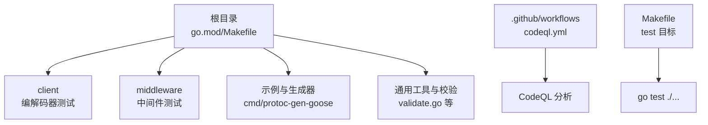
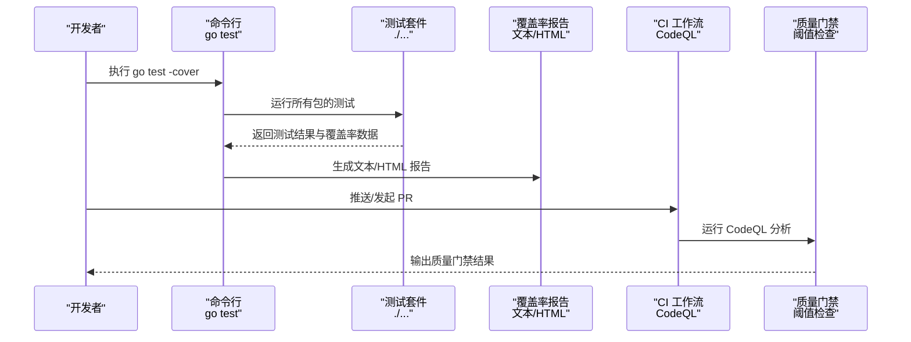
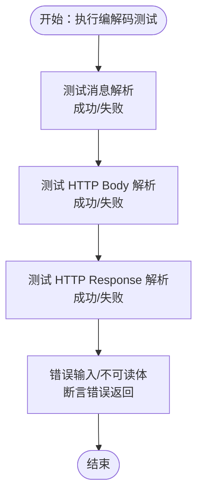
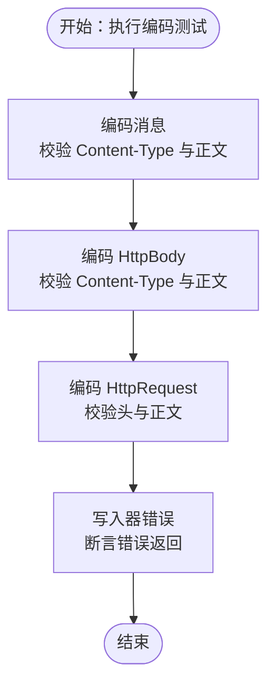
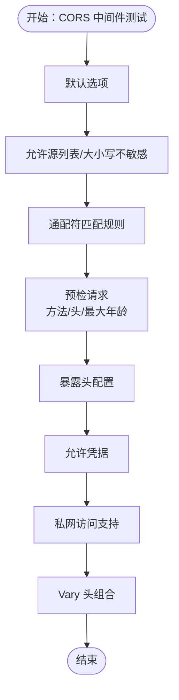
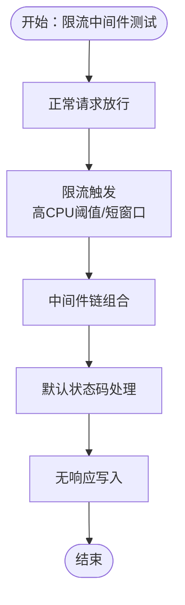
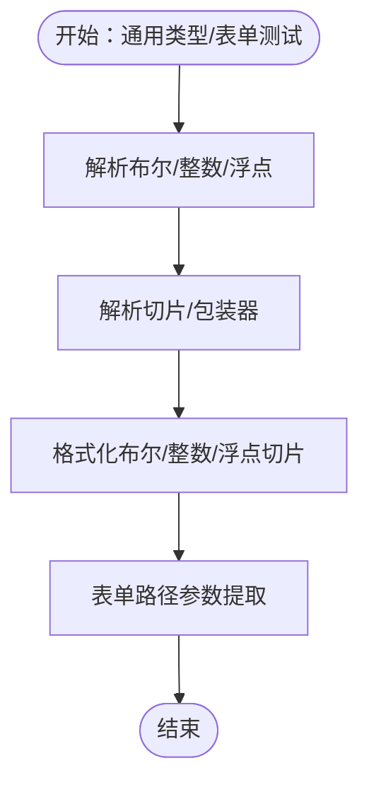
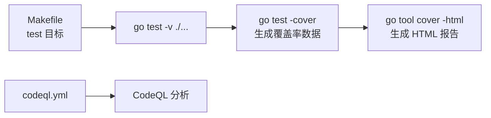

# 测试覆盖率

<cite>
**本文引用的文件**
- [go.mod](file://go.mod)
- [Makefile](file://Makefile)
- [.github/workflows/codeql.yml](file://.github/workflows/codeql.yml)
- [client/decoder_test.go](file://client/decoder_test.go)
- [client/encoder_test.go](file://client/encoder_test.go)
- [middleware/cors/middleware_test.go](file://middleware/cors/middleware_test.go)
- [middleware/limiter/middleware_test.go](file://middleware/limiter/middleware_test.go)
- [common_test.go](file://common_test.go)
- [form_test.go](file://form_test.go)
- [type_test.go](file://type_test.go)
- [validate.go](file://validate.go)
- [.gitignore](file://.gitignore)
</cite>

## 目录
1. [引言](#引言)
2. [项目结构](#项目结构)
3. [核心组件](#核心组件)
4. [架构总览](#架构总览)
5. [详细组件分析](#详细组件分析)
6. [依赖分析](#依赖分析)
7. [性能考虑](#性能考虑)
8. [故障排查指南](#故障排查指南)
9. [结论](#结论)
10. [附录](#附录)

## 引言
本文件聚焦于测试覆盖率的测量与分析方法，结合仓库现有工具链与工作流，系统阐述如何使用 Go 工具链进行覆盖率统计、如何解读覆盖率报告、如何基于现有测试用例提升覆盖率、以及如何在持续集成中设置覆盖率阈值与质量门禁。同时，文档还介绍了 CodeQL 的安全扫描能力及其与测试覆盖率的关系，帮助读者构建更稳健的质量保障体系。

## 项目结构
该仓库采用模块化组织方式，核心业务逻辑分布在多个包中，测试覆盖了客户端编解码、中间件（如 CORS、限流）、通用类型转换与校验等模块。Makefile 提供统一的构建与测试入口；GitHub Actions 中包含 CodeQL 安全扫描工作流。

图表来源
- [go.mod:1-14](file://go.mod#L1-L14)
- [Makefile:10-12](file://Makefile#L10-L12)
- [.github/workflows/codeql.yml:14-20](file://.github/workflows/codeql.yml#L14-L20)

章节来源
- [go.mod:1-14](file://go.mod#L1-L14)
- [Makefile:10-12](file://Makefile#L10-L12)
- [.github/workflows/codeql.yml:14-20](file://.github/workflows/codeql.yml#L14-L20)

## 核心组件
- 测试执行入口：通过 Makefile 的 test 目标运行 go test -v ./...，对所有包进行并行测试。
- 覆盖率现状：当前仓库未启用覆盖率收集与报告输出，未见覆盖率阈值或质量门禁配置。
- CodeQL：已配置 GitHub Actions 中的 CodeQL 自动扫描，用于安全漏洞检测，与覆盖率互补。

章节来源
- [Makefile:10-12](file://Makefile#L10-L12)
- [.github/workflows/codeql.yml:14-20](file://.github/workflows/codeql.yml#L14-L20)

## 架构总览
下图展示了从开发者本地到 CI 的测试与分析流程概览：

图表来源
- [Makefile:10-12](file://Makefile#L10-L12)
- [.github/workflows/codeql.yml:68-84](file://.github/workflows/codeql.yml#L68-L84)

## 详细组件分析

### 客户端编解码测试覆盖率
- 编解码器测试覆盖了消息、HTTP Body、HTTP Response 的解析与序列化场景，包含错误输入与不可读体的边界条件。
- 建议：针对每条分支添加断言，确保错误路径与成功路径均被覆盖；对复杂解析逻辑补充更多边界用例。

图表来源
- [client/decoder_test.go:19-64](file://client/decoder_test.go#L19-L64)
- [client/decoder_test.go:66-106](file://client/decoder_test.go#L66-L106)
- [client/decoder_test.go:108-167](file://client/decoder_test.go#L108-L167)

章节来源
- [client/decoder_test.go:19-179](file://client/decoder_test.go#L19-L179)

### 客户端编码测试覆盖率
- 编码器测试覆盖消息、HTTP Body、HTTP Request 的序列化，重点验证头部设置与写入错误处理。
- 建议：对不同内容类型的编码路径分别验证；对写入器错误进行更细粒度的断言。

图表来源
- [client/encoder_test.go:17-59](file://client/encoder_test.go#L17-L59)
- [client/encoder_test.go:61-97](file://client/encoder_test.go#L61-L97)
- [client/encoder_test.go:99-142](file://client/encoder_test.go#L99-L142)

章节来源
- [client/encoder_test.go:17-150](file://client/encoder_test.go#L17-L150)

### CORS 中间件测试覆盖率
- CORS 测试覆盖默认选项、允许源、通配符匹配、预检请求、暴露头、凭据、私网访问、Vary 头等多个维度。
- 建议：补充更多边界与异常场景（如空 Origin、非法方法、非法头），并验证响应头组合的一致性。

图表来源
- [middleware/cors/middleware_test.go:41-94](file://middleware/cors/middleware_test.go#L41-L94)
- [middleware/cors/middleware_test.go:196-266](file://middleware/cors/middleware_test.go#L196-L266)
- [middleware/cors/middleware_test.go:290-307](file://middleware/cors/middleware_test.go#L290-L307)
- [middleware/cors/middleware_test.go:341-373](file://middleware/cors/middleware_test.go#L341-L373)
- [middleware/cors/middleware_test.go:375-429](file://middleware/cors/middleware_test.go#L375-L429)
- [middleware/cors/middleware_test.go:431-456](file://middleware/cors/middleware_test.go#L431-L456)
- [middleware/cors/middleware_test.go:458-473](file://middleware/cors/middleware_test.go#L458-L473)
- [middleware/cors/middleware_test.go:475-499](file://middleware/cors/middleware_test.go#L475-L499)

章节来源
- [middleware/cors/middleware_test.go:1-500](file://middleware/cors/middleware_test.go#L1-L500)

### 限流中间件测试覆盖率
- 限流测试验证正常请求放行、限流触发后的响应行为、中间件链组合、默认状态码处理与无响应写入场景。
- 建议：补充 CPU 使用率阈值与窗口参数的边界测试；对并发场景进行更严格的断言。

图表来源
- [middleware/limiter/middleware_test.go:13-38](file://middleware/limiter/middleware_test.go#L13-L38)
- [middleware/limiter/middleware_test.go:40-79](file://middleware/limiter/middleware_test.go#L40-L79)
- [middleware/limiter/middleware_test.go:81-104](file://middleware/limiter/middleware_test.go#L81-L104)
- [middleware/limiter/middleware_test.go:106-123](file://middleware/limiter/middleware_test.go#L106-L123)
- [middleware/limiter/middleware_test.go:125-141](file://middleware/limiter/middleware_test.go#L125-L141)

章节来源
- [middleware/limiter/middleware_test.go:1-143](file://middleware/limiter/middleware_test.go#L1-L143)

### 通用类型与表单测试覆盖率
- 类型转换测试覆盖布尔、整数、浮点、切片、包装器的解析与格式化；表单测试覆盖路径参数提取、空键与不存在键的处理。
- 建议：补充更多边界值与非法输入；对泛型函数的错误路径进行更全面断言。

图表来源
- [type_test.go:13-36](file://type_test.go#L13-L36)
- [type_test.go:38-109](file://type_test.go#L38-L109)
- [type_test.go:111-201](file://type_test.go#L111-L201)
- [type_test.go:220-372](file://type_test.go#L220-L372)
- [type_test.go:374-705](file://type_test.go#L374-L705)
- [type_test.go:707-725](file://type_test.go#L707-L725)
- [form_test.go:10-26](file://form_test.go#L10-L26)
- [form_test.go:77-160](file://form_test.go#L77-L160)

章节来源
- [type_test.go:1-800](file://type_test.go#L1-L800)
- [form_test.go:1-161](file://form_test.go#L1-L161)

### 请求校验与回调
- 校验函数根据 fast 参数选择不同的校验策略，并在出错时调用回调。建议补充对回调触发与不同消息类型校验路径的测试。

章节来源
- [validate.go:29-56](file://validate.go#L29-L56)

## 依赖分析
- 语言与工具：Go 版本要求与依赖管理由 go.mod 管理；Makefile 提供统一测试入口。
- 覆盖率工具链：Go 标准库提供 -cover 选项；可通过 -coverprofile 生成覆盖率数据，再用 go tool cover 生成 HTML 报告。
- CI 集成：CodeQL 已在 GitHub Actions 中配置，但未与覆盖率阈值联动。

图表来源
- [Makefile:10-12](file://Makefile#L10-L12)
- [.github/workflows/codeql.yml:68-84](file://.github/workflows/codeql.yml#L68-L84)

章节来源
- [go.mod:1-14](file://go.mod#L1-L14)
- [Makefile:10-12](file://Makefile#L10-L12)
- [.github/workflows/codeql.yml:68-84](file://.github/workflows/codeql.yml#L68-L84)

## 性能考虑
- 测试执行性能：使用 go test -p 并行度控制与 -timeout 避免长时间阻塞；在 CI 中合理设置 runner 规格。
- 覆盖率开销：开启 -cover 会引入额外开销，建议仅在 CI 或发布前阶段启用覆盖率生成。
- 报告生成：HTML 报告生成较重，可在本地使用文本报告，CI 中按需生成 HTML。

## 故障排查指南
- 覆盖率报告缺失：确认是否使用了 -coverprofile 生成数据文件，再用 go tool cover -html 生成报告。
- CI 中覆盖率阈值：当前仓库未设置阈值；可在 CI 中新增步骤计算整体覆盖率并与阈值比较，失败则阻止合并。
- CodeQL 与覆盖率关系：CodeQL 关注安全问题，覆盖率关注逻辑覆盖度，二者互补；建议在 PR 中同时运行两者。

章节来源
- [.gitignore:9-10](file://.gitignore#L9-L10)

## 结论
- 当前仓库具备良好的测试基础，覆盖了客户端编解码、中间件与通用工具的关键路径。
- 建议在本地与 CI 中启用覆盖率统计与报告生成，并在 CI 中加入覆盖率阈值与质量门禁。
- CodeQL 已在 CI 中运行，可作为安全质量门禁的一部分，与覆盖率共同提升整体质量。

## 附录

### 如何使用 Go 工具链进行覆盖率统计
- 生成覆盖率数据文件：在测试命令后追加 -coverprofile=coverage.out，例如：
  - go test -cover -coverprofile=coverage.out ./...
- 生成 HTML 报告：使用 go tool cover -html=coverage.out -o coverage.html
- 生成文本报告：使用 go tool cover -func=coverage.out 查看各包函数级覆盖率

章节来源
- [Makefile:10-12](file://Makefile#L10-L12)

### 如何解读覆盖率报告
- 函数级覆盖率：查看每个函数的覆盖行数与总行数，定位未覆盖分支。
- 行级覆盖率：关注未覆盖的分支与条件判断，优先补齐错误路径与边界条件。
- 包级覆盖率：汇总各包覆盖率，作为整体质量指标。

章节来源
- [Makefile:10-12](file://Makefile#L10-L12)

### 提高测试覆盖率的策略与工具配置
- 补充边界与异常用例：针对错误输入、不可读体、非法参数等场景编写测试。
- 使用表格驱动测试：在类型转换与解析函数中广泛使用表格驱动，覆盖多组输入与期望输出。
- 中间件链测试：验证多个中间件组合时的行为一致性。
- 代码生成与示例：利用示例 proto 文件生成代码并配套测试，扩大覆盖面。

章节来源
- [middleware/cors/middleware_test.go:1-500](file://middleware/cors/middleware_test.go#L1-L500)
- [middleware/limiter/middleware_test.go:1-143](file://middleware/limiter/middleware_test.go#L1-L143)
- [type_test.go:1-800](file://type_test.go#L1-L800)
- [form_test.go:1-161](file://form_test.go#L1-L161)

### CodeQL 分析与自动化测试流程
- CodeQL 已在 GitHub Actions 中配置，自动扫描安全问题。
- 建议在 CI 中新增覆盖率统计与阈值检查步骤，形成“测试 + 覆盖率 + 安全”的三重门禁。

章节来源
- [.github/workflows/codeql.yml:14-20](file://.github/workflows/codeql.yml#L14-L20)
- [.github/workflows/codeql.yml:68-84](file://.github/workflows/codeql.yml#L68-L84)

### 设置覆盖率阈值与质量门禁
- 在 CI 中新增步骤：
  - 计算整体覆盖率：go tool cover -func=coverage.out
  - 对比阈值（如 80%）并失败退出，阻止合并
- 将覆盖率报告上传为工件，便于审查与回溯

章节来源
- [Makefile:10-12](file://Makefile#L10-L12)