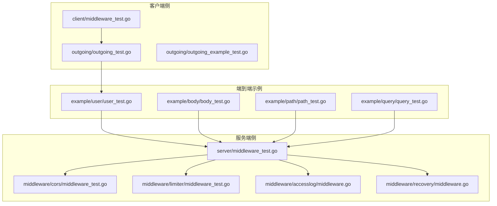
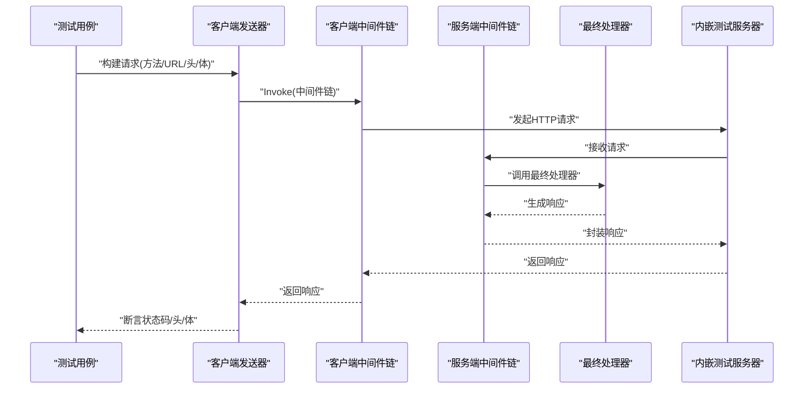
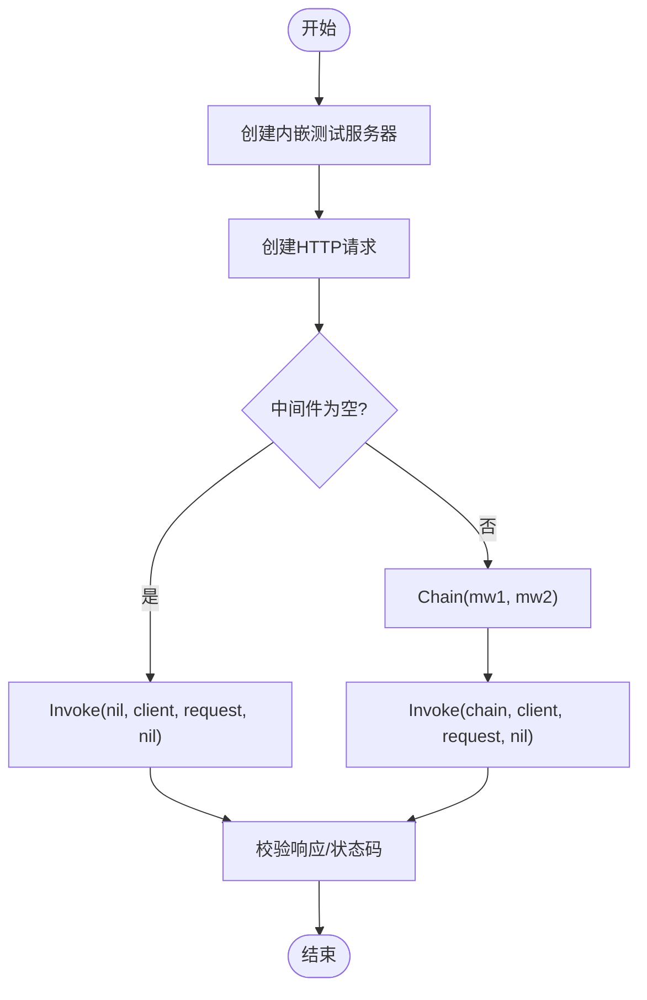
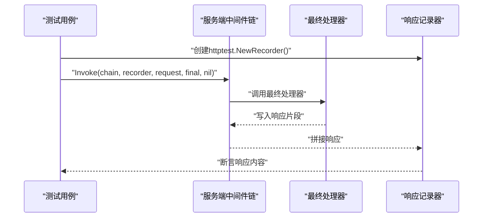
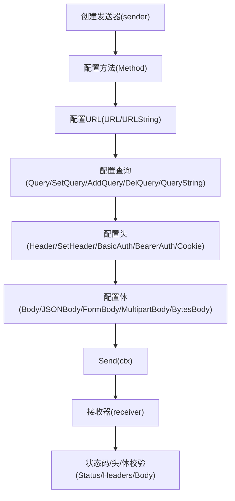
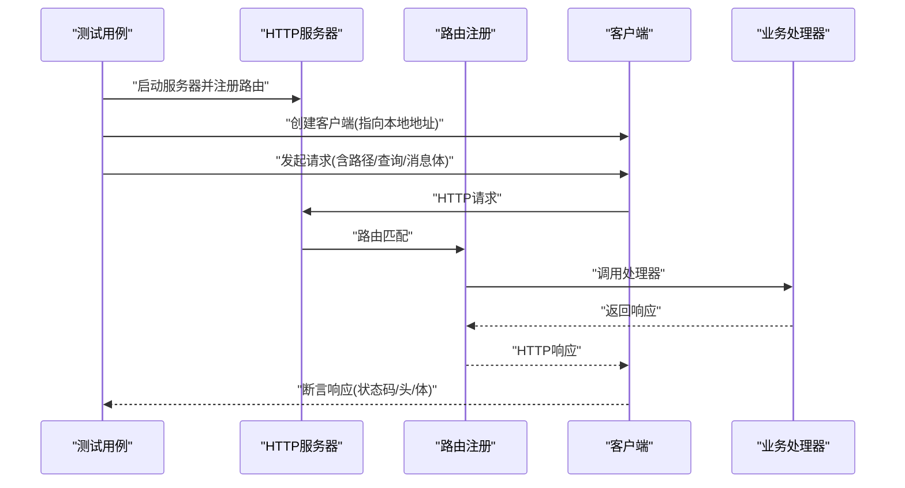
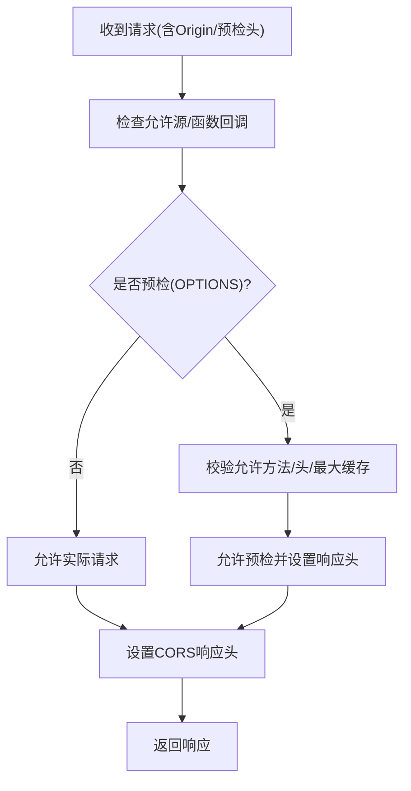
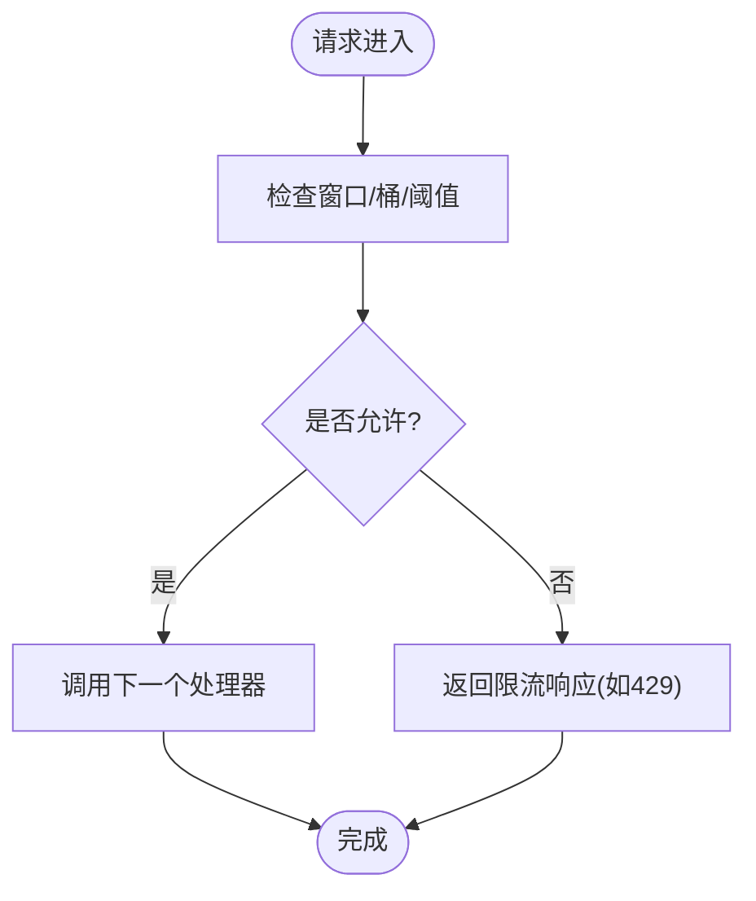
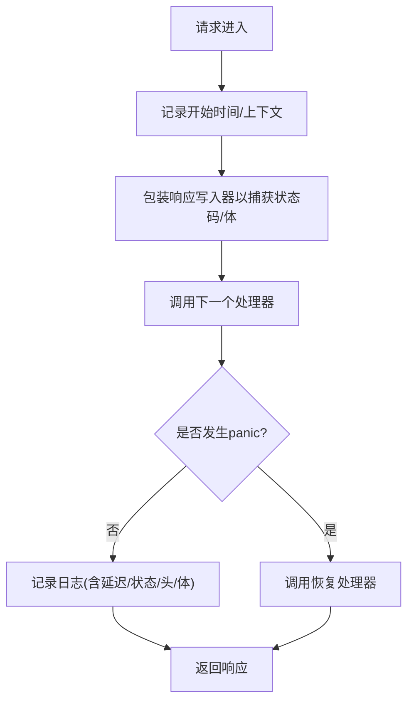
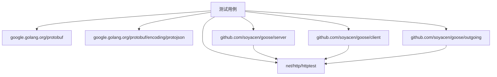

# 集成测试

<cite>
**本文档引用的文件**
- [client/middleware_test.go](file://client/middleware_test.go)
- [server/middleware_test.go](file://server/middleware_test.go)
- [outgoing/outgoing_test.go](file://outgoing/outgoing_test.go)
- [outgoing/outgoing_example_test.go](file://outgoing/outgoing_example_test.go)
- [example/user/user_test.go](file://example/user/user_test.go)
- [example/body/body_test.go](file://example/body/body_test.go)
- [example/path/path_test.go](file://example/path/path_test.go)
- [example/query/query_test.go](file://example/query/query_test.go)
- [middleware/cors/middleware_test.go](file://middleware/cors/middleware_test.go)
- [middleware/limiter/middleware_test.go](file://middleware/limiter/middleware_test.go)
- [middleware/accesslog/middleware.go](file://middleware/accesslog/middleware.go)
- [middleware/recovery/middleware.go](file://middleware/recovery/middleware.go)
- [go.mod](file://go.mod)
</cite>

## 目录
1. [引言](#引言)
2. [项目结构](#项目结构)
3. [核心组件](#核心组件)
4. [架构总览](#架构总览)
5. [详细组件分析](#详细组件分析)
6. [依赖分析](#依赖分析)
7. [性能考虑](#性能考虑)
8. [故障排查指南](#故障排查指南)
9. [结论](#结论)
10. [附录](#附录)

## 引言
本文件系统性阐述该仓库中的集成测试实施策略与测试场景，覆盖从客户端到服务器的完整请求-响应流程，重点包括：
- 如何通过内嵌测试服务器（httptest）模拟 HTTP 请求与响应
- 如何验证中间件链的执行顺序与效果
- 如何进行端到端（E2E）测试，涵盖路径参数、查询参数、消息体等多场景
- 如何搭建稳定的测试环境与最佳实践

## 项目结构
该项目采用按功能域划分的模块化组织方式，核心与测试相关的目录如下：
- client：客户端中间件与发送器（outgoing）相关测试
- server：服务端中间件测试
- example：各协议样例的端到端测试
- middleware：各类中间件（CORS、限流、访问日志、恢复等）的测试
- outgoing：对外部服务发起 HTTP 请求的工具与测试

**图表来源**
- [client/middleware_test.go:1-213](file://client/middleware_test.go#L1-L213)
- [server/middleware_test.go:1-69](file://server/middleware_test.go#L1-L69)
- [outgoing/outgoing_test.go:1-699](file://outgoing/outgoing_test.go#L1-L699)
- [outgoing/outgoing_example_test.go:1-274](file://outgoing/outgoing_example_test.go#L1-L274)
- [middleware/cors/middleware_test.go:1-500](file://middleware/cors/middleware_test.go#L1-L500)
- [middleware/limiter/middleware_test.go:1-143](file://middleware/limiter/middleware_test.go#L1-L143)
- [middleware/accesslog/middleware.go:1-318](file://middleware/accesslog/middleware.go#L1-L318)
- [middleware/recovery/middleware.go:1-55](file://middleware/recovery/middleware.go#L1-L55)
- [example/user/user_test.go:1-160](file://example/user/user_test.go#L1-L160)
- [example/body/body_test.go:1-164](file://example/body/body_test.go#L1-L164)
- [example/path/path_test.go:1-365](file://example/path/path_test.go#L1-L365)
- [example/query/query_test.go:1-397](file://example/query/query_test.go#L1-L397)

**章节来源**
- [go.mod:1-14](file://go.mod#L1-L14)

## 核心组件
- 客户端中间件链与调用
  - 通过 Chain 组合多个中间件，每个中间件可修改请求或拦截调用
  - 使用 httptest.NewServer 构造内嵌服务，验证中间件对请求头、错误处理等的影响
- 服务端中间件链与调用
  - 通过 Chain 组合服务端中间件，验证响应拼接、顺序与最终处理器行为
- 发送器（outgoing）与接收器（receiver）
  - 提供链式构建 HTTP 请求的能力，并对响应进行状态码、头、体等多维度校验
- 示例端到端测试
  - 启动本地 HTTP 服务器，构造真实路由，验证请求-响应全链路

**章节来源**
- [client/middleware_test.go:33-212](file://client/middleware_test.go#L33-L212)
- [server/middleware_test.go:18-68](file://server/middleware_test.go#L18-L68)
- [outgoing/outgoing_test.go:315-348](file://outgoing/outgoing_test.go#L315-L348)

## 架构总览
下图展示了典型的请求-响应集成测试流程：客户端发送器构建请求，经过客户端中间件链；服务端接收请求，经过服务端中间件链，最终到达业务处理器；响应沿相反方向回传。

**图表来源**
- [client/middleware_test.go:56-128](file://client/middleware_test.go#L56-L128)
- [server/middleware_test.go:18-48](file://server/middleware_test.go#L18-L48)
- [outgoing/outgoing_test.go:315-348](file://outgoing/outgoing_test.go#L315-L348)

## 详细组件分析

### 客户端中间件链集成测试
- 中间件链构建与调用
  - Chain 接受多个中间件，返回组合后的中间件；空链返回 nil
  - Invoke 支持传入 nil 中间件，直接走底层调用
- 请求头注入与错误传播
  - 自定义中间件向请求添加头字段，最终通过内嵌服务器校验
  - 错误中间件应返回错误且不产生响应
- 中间件执行顺序验证
  - 通过在每个中间件中记录执行序号，验证进入与退出顺序（前向与反向）

**图表来源**
- [client/middleware_test.go:33-128](file://client/middleware_test.go#L33-L128)

**章节来源**
- [client/middleware_test.go:33-212](file://client/middleware_test.go#L33-L212)

### 服务端中间件链集成测试
- 空中间件调用
  - 传入 nil 中间件时，最终处理器仍会被调用
- 单中间件与多中间件链
  - 中间件按声明顺序拼接响应内容，验证“前向拼接+后向回放”的链式行为
- 顺序一致性
  - 通过在每个中间件中追加标识，确保进入与退出顺序一致

**图表来源**
- [server/middleware_test.go:18-68](file://server/middleware_test.go#L18-L68)

**章节来源**
- [server/middleware_test.go:18-68](file://server/middleware_test.go#L18-L68)

### 发送器（outgoing）集成测试
- 基础 GET/POST 与 JSON/表单/多部分上传
  - 通过 httptest.NewServer 模拟外部服务，验证发送器的链式配置与成功响应
- 响应解析
  - 对响应体进行字节、文本、JSON、对象等多种解析方式的校验
- 头、Cookie、认证等选项
  - SetHeader/AddHeader/BearerAuth/BasicAuth/SetCookie/DelCookie 等选项的设置与清理
- 查询参数与缓存控制
  - SetQuery/AddQuery/DelQuery/QueryString 以及 CacheControl/IfMatch/UserAgent 等头设置

**图表来源**
- [outgoing/outgoing_test.go:315-348](file://outgoing/outgoing_test.go#L315-L348)
- [outgoing/outgoing_test.go:597-620](file://outgoing/outgoing_test.go#L597-L620)

**章节来源**
- [outgoing/outgoing_test.go:1-699](file://outgoing/outgoing_test.go#L1-L699)

### 端到端测试场景（示例）
- 用户服务（CRUD）
  - 启动本地 HTTP 服务器，注册路由，客户端通过生成的 HTTP 客户端发起请求，断言响应体与分页信息
- 消息体场景
  - 验证通配符消息体、命名消息体、Google HTTPBody、标准 HTTP 请求体等不同映射
- 路径参数场景
  - 针对布尔、整型、浮点、字符串、枚举等类型，验证路径参数编码与解析
- 查询参数场景
  - 验证基础类型、可选值、包装类型、数组/列表等查询参数的序列化

**图表来源**
- [example/user/user_test.go:47-59](file://example/user/user_test.go#L47-L59)
- [example/body/body_test.go:56-68](file://example/body/body_test.go#L56-L68)
- [example/path/path_test.go:110-122](file://example/path/path_test.go#L110-L122)
- [example/query/query_test.go:111-124](file://example/query/query_test.go#L111-L124)

**章节来源**
- [example/user/user_test.go:1-160](file://example/user/user_test.go#L1-L160)
- [example/body/body_test.go:1-164](file://example/body/body_test.go#L1-L164)
- [example/path/path_test.go:1-365](file://example/path/path_test.go#L1-L365)
- [example/query/query_test.go:1-397](file://example/query/query_test.go#L1-L397)

### CORS 中间件集成测试
- 默认与允许源
  - 默认允许任意源，或指定允许的源列表；大小写敏感与通配符子域匹配
- 预检请求（OPTIONS）
  - 校验允许的方法、头、最大缓存时间；未满足条件时不允许跨域
- 凭据与私有网络
  - 支持允许凭据与私有网络访问头
- Vary 头
  - 根据请求类型动态设置 Vary 头字段集合

**图表来源**
- [middleware/cors/middleware_test.go:41-266](file://middleware/cors/middleware_test.go#L41-L266)

**章节来源**
- [middleware/cors/middleware_test.go:1-500](file://middleware/cors/middleware_test.go#L1-L500)

### 限流中间件集成测试
- 正常请求
  - 在正常负载下，中间件允许请求通过并返回成功响应
- 限流触发
  - 通过低阈值与高 CPU 模拟器，使请求被限流；验证响应状态码与中间件链结构
- 中间件链
  - 与其他中间件组合，验证链式执行与附加头设置

**图表来源**
- [middleware/limiter/middleware_test.go:13-79](file://middleware/limiter/middleware_test.go#L13-L79)

**章节来源**
- [middleware/limiter/middleware_test.go:1-143](file://middleware/limiter/middleware_test.go#L1-L143)

### 访问日志与恢复中间件
- 访问日志
  - 服务端与客户端均支持记录请求/响应元数据、延迟、头与可选体；支持跳过特定路由
- 恢复
  - 捕获 panic 并调用自定义处理器，默认输出错误日志

**图表来源**
- [middleware/accesslog/middleware.go:116-204](file://middleware/accesslog/middleware.go#L116-L204)
- [middleware/recovery/middleware.go:38-54](file://middleware/recovery/middleware.go#L38-L54)

**章节来源**
- [middleware/accesslog/middleware.go:1-318](file://middleware/accesslog/middleware.go#L1-L318)
- [middleware/recovery/middleware.go:1-55](file://middleware/recovery/middleware.go#L1-L55)

## 依赖分析
- 测试运行时依赖
  - Go 标准库 net/http/httptest 用于内嵌服务器与响应记录
  - Google Protobuf 及其 JSON 编解码用于示例中的消息体与路由
- 中间件与发送器
  - 服务端中间件链依赖 server.Invoke 与 Chain
  - 客户端中间件链依赖 client.Invoke 与 Chain
  - outgoing 发送器依赖 http.Client 与 httptest.NewServer

**图表来源**
- [go.mod:1-14](file://go.mod#L1-L14)
- [example/user/user_test.go:1-160](file://example/user/user_test.go#L1-L160)
- [outgoing/outgoing_test.go:1-699](file://outgoing/outgoing_test.go#L1-L699)

**章节来源**
- [go.mod:1-14](file://go.mod#L1-L14)

## 性能考虑
- 内嵌服务器与短生命周期
  - 使用 httptest.NewServer 临时启动服务，避免外部依赖；注意在测试结束后关闭
- 中间件池化与最小拷贝
  - 访问日志中间件使用 sync.Pool 复用属性切片，减少 GC 压力
- 响应体读取策略
  - 在仅需长度或简单断言时，优先使用 ContentLength/Headers；需要完整体时再读取
- 并发与限流
  - 限流中间件通过窗口与桶控制请求速率，结合 CPU 使用率阈值，避免过载

[本节为通用建议，无需特定文件引用]

## 故障排查指南
- 中间件链未生效
  - 确认 Chain 返回非空中间件；检查中间件是否正确包裹 invoker
- 响应体为空或解析失败
  - 校验 Content-Type 与编码；使用 BytesBody/TextBody/JSONBody/ObjectBody 分别读取
- CORS 未放行
  - 检查允许源、方法、头与预检头是否齐全；确认是否为 OPTIONS 预检
- 限流导致 429
  - 调整阈值或窗口；在测试中模拟高负载以验证限流逻辑
- panic 导致崩溃
  - 确保已安装恢复中间件；检查自定义恢复处理器是否正确记录堆栈

**章节来源**
- [client/middleware_test.go:33-128](file://client/middleware_test.go#L33-L128)
- [server/middleware_test.go:18-68](file://server/middleware_test.go#L18-L68)
- [middleware/cors/middleware_test.go:196-266](file://middleware/cors/middleware_test.go#L196-L266)
- [middleware/limiter/middleware_test.go:40-79](file://middleware/limiter/middleware_test.go#L40-L79)
- [middleware/recovery/middleware.go:38-54](file://middleware/recovery/middleware.go#L38-L54)

## 结论
本项目通过内嵌测试服务器与完善的中间件链测试，实现了从客户端到服务端的完整集成测试闭环。示例端到端测试覆盖多种协议与参数场景，配合 CORS、限流、访问日志与恢复等中间件测试，能够有效保障请求-响应流程的正确性与鲁棒性。建议在持续集成中引入这些测试，以提升整体质量与稳定性。

[本节为总结性内容，无需特定文件引用]

## 附录
- 最佳实践清单
  - 使用 httptest.NewServer/httptest.NewRecorder 构建稳定、隔离的测试环境
  - 明确中间件职责边界，尽量保持幂等与可预测
  - 对关键路径（CORS、鉴权、限流）编写专项测试
  - 在端到端测试中覆盖典型参数组合与异常分支
  - 使用访问日志中间件辅助定位问题，必要时开启响应体打印
  - 为恢复中间件提供自定义处理器，统一错误上报格式

[本节为通用建议，无需特定文件引用]