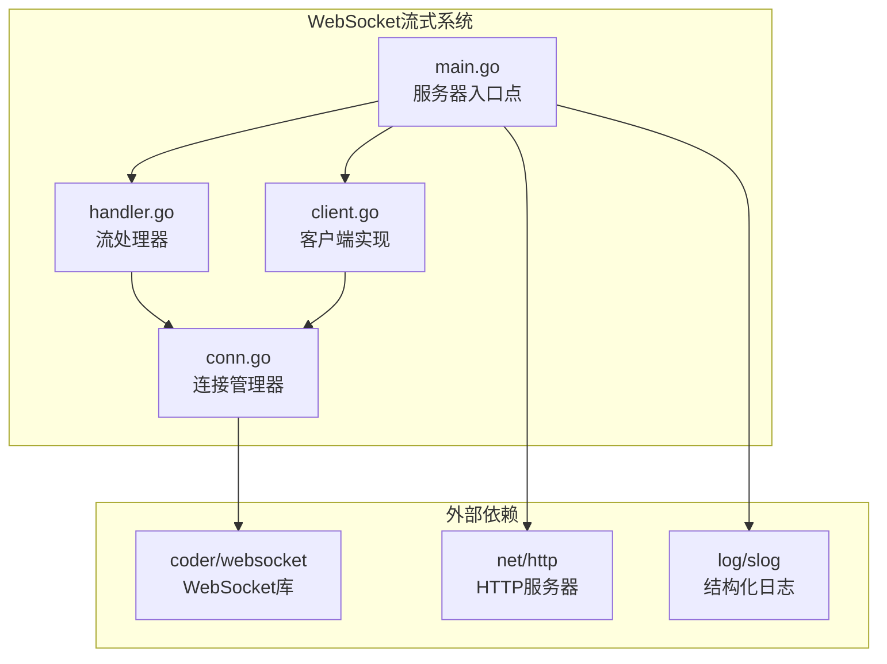
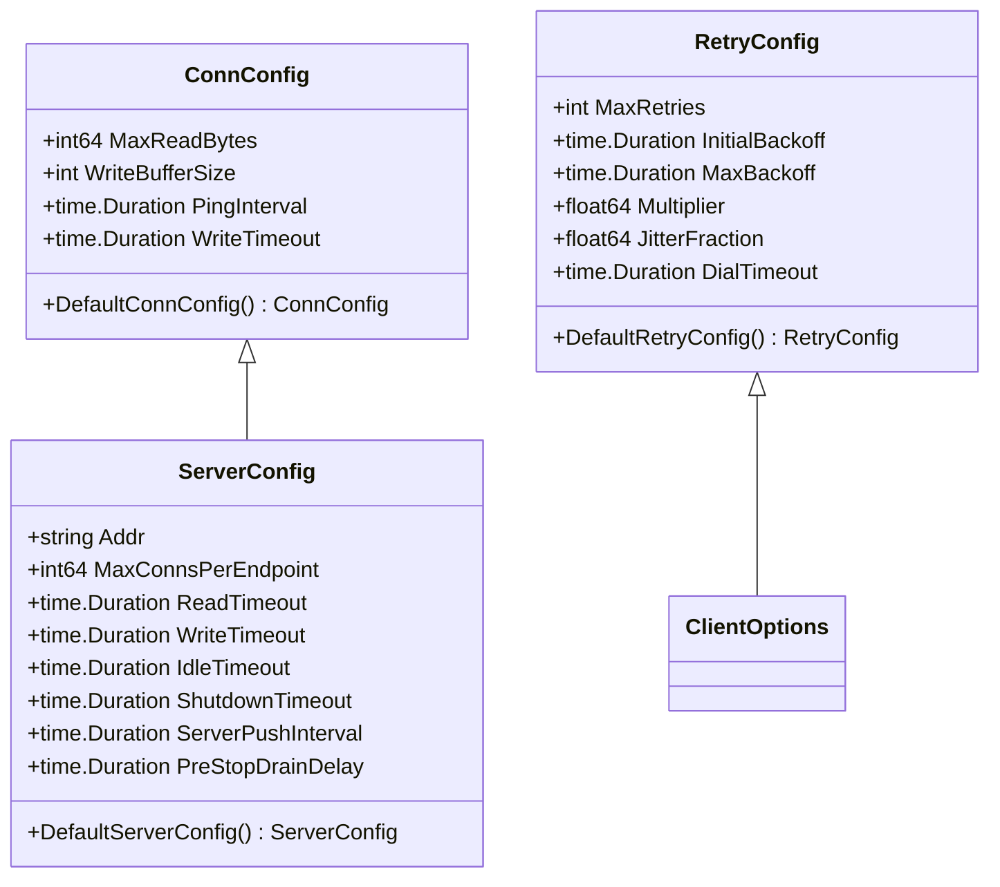
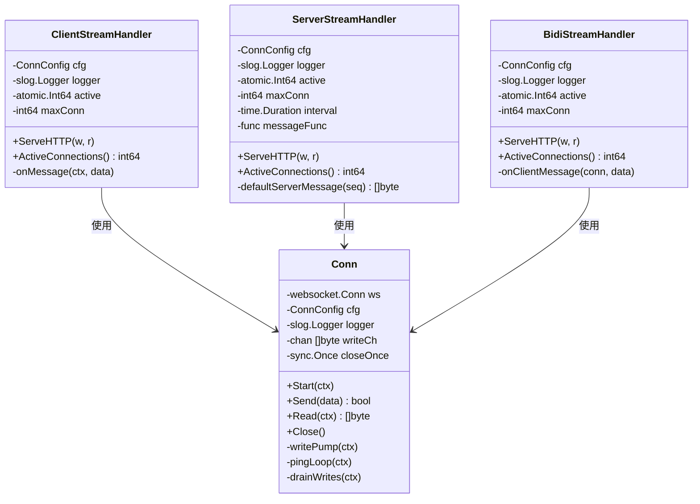
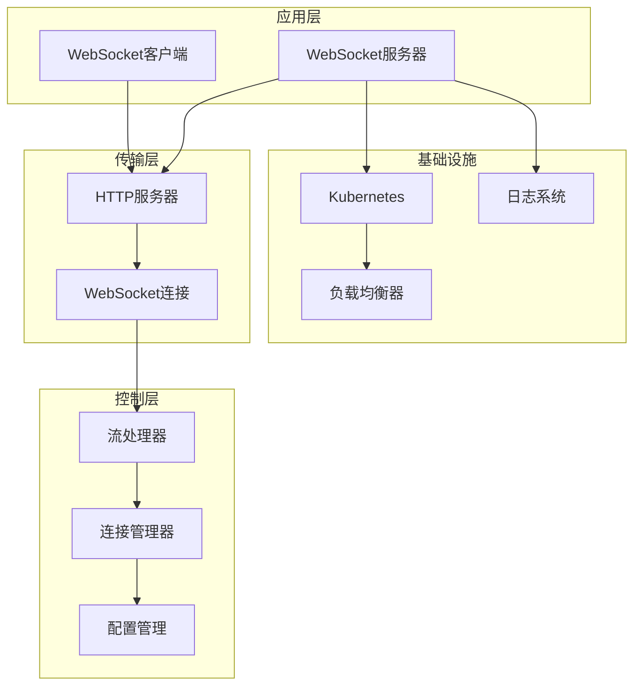
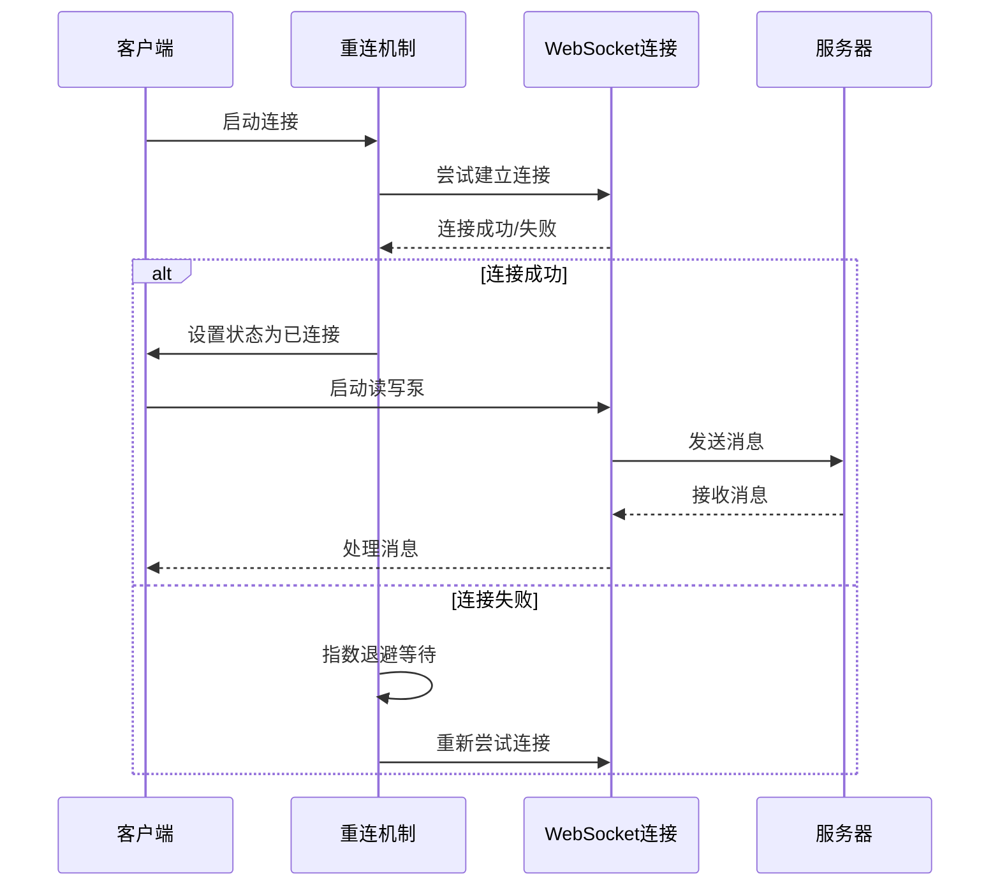
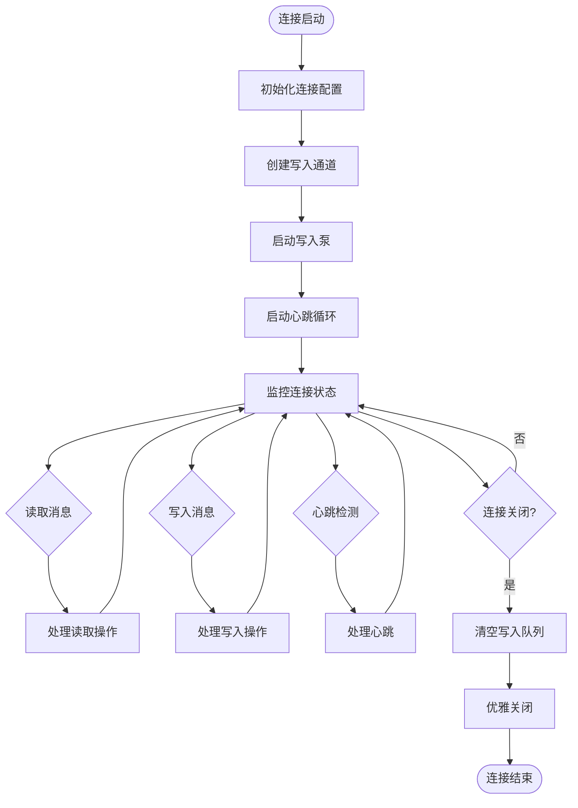
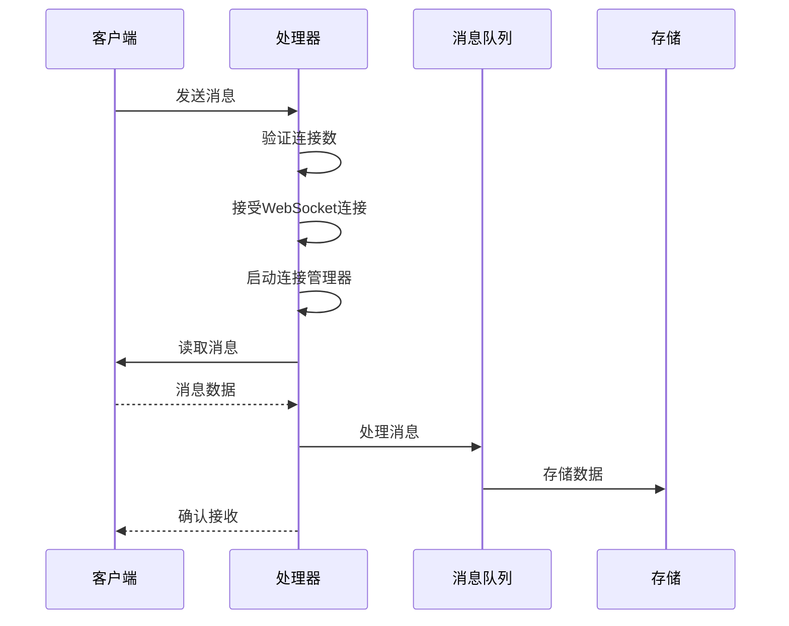
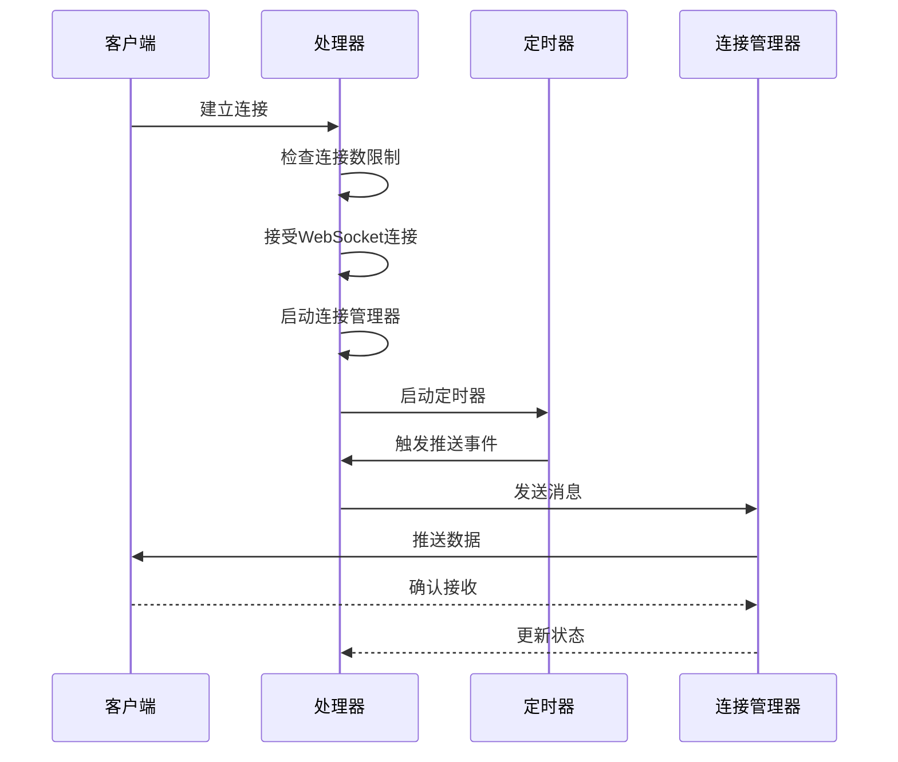
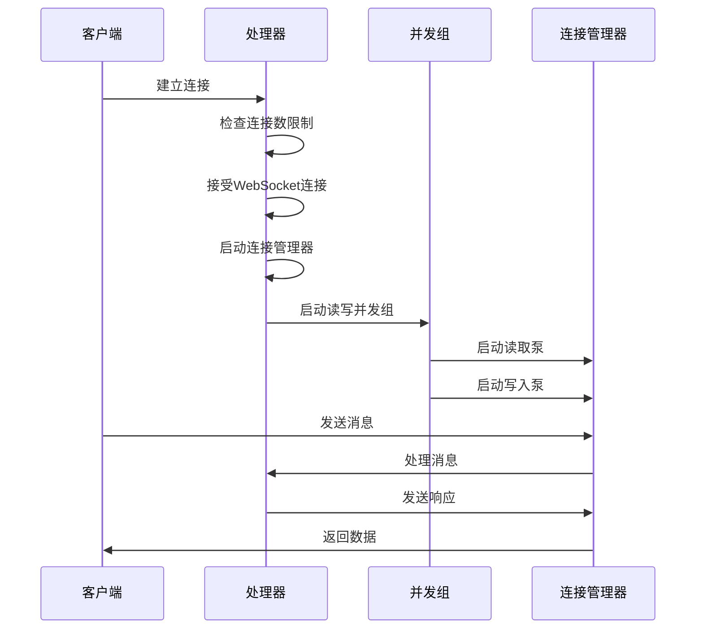
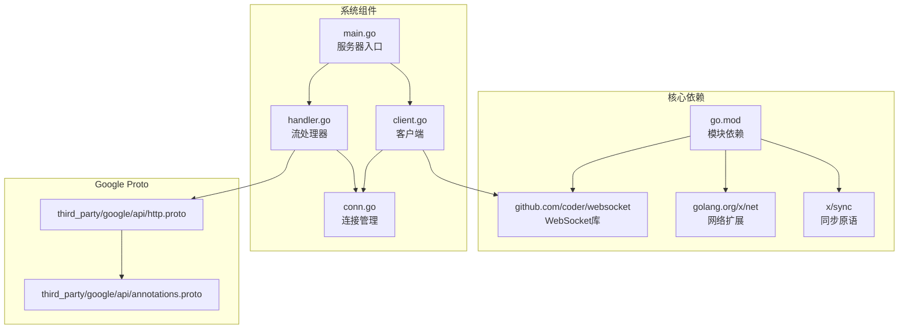

# WebSocket流式系统

<cite>
**本文档引用的文件**
- [main.go](file://example/stream/main.go)
- [client.go](file://example/stream/client.go)
- [conn.go](file://example/stream/conn.go)
- [handler.go](file://example/stream/handler.go)
- [go.mod](file://go.mod)
- [http.proto](file://third_party/google/api/http.proto)
- [annotations.proto](file://third_party/google/api/annotations.proto)
- [common.go](file://common.go)
- [route.go](file://route.go)
- [Makefile](file://Makefile)
</cite>

## 目录
1. [简介](#简介)
2. [项目结构](#项目结构)
3. [核心组件](#核心组件)
4. [架构概览](#架构概览)
5. [详细组件分析](#详细组件分析)
6. [依赖关系分析](#依赖关系分析)
7. [性能考虑](#性能考虑)
8. [故障排除指南](#故障排除指南)
9. [结论](#结论)

## 简介

WebSocket流式系统是Goose项目中的一个核心功能模块，提供了三种不同类型的WebSocket流式通信模式：客户端单向流、服务器单向流和双向流。该系统专为生产环境设计，具备自动重连、连接池管理、优雅关闭等高级特性。

系统基于Go标准库的net/http包和coder/websocket库构建，支持Kubernetes部署场景下的健康检查和优雅停机。通过统一的连接管理器和处理器架构，实现了高效、可靠的实时通信能力。

## 项目结构

WebSocket流式系统主要位于example/stream目录中，包含以下核心文件：

**图表来源**
- [main.go:1-172](file://example/stream/main.go#L1-L172)
- [handler.go:1-318](file://example/stream/handler.go#L1-L318)
- [client.go:1-363](file://example/stream/client.go#L1-L363)
- [conn.go:1-164](file://example/stream/conn.go#L1-L164)

**章节来源**
- [main.go:1-172](file://example/stream/main.go#L1-L172)
- [go.mod:1-17](file://go.mod#L1-L17)

## 核心组件

### 连接配置系统

连接配置系统提供了生产级别的默认设置和灵活的自定义选项：

**图表来源**
- [conn.go:12-32](file://example/stream/conn.go#L12-L32)
- [main.go:15-50](file://example/stream/main.go#L15-L50)
- [client.go:15-42](file://example/stream/client.go#L15-L42)

### 流处理器架构

系统支持三种不同的流式通信模式，每种都有专门的处理器：

**图表来源**
- [handler.go:27-36](file://example/stream/handler.go#L27-L36)
- [handler.go:99-125](file://example/stream/handler.go#L99-L125)
- [handler.go:212-225](file://example/stream/handler.go#L212-L225)
- [conn.go:34-61](file://example/stream/conn.go#L34-L61)

**章节来源**
- [handler.go:1-318](file://example/stream/handler.go#L1-L318)
- [conn.go:1-164](file://example/stream/conn.go#L1-L164)

## 架构概览

WebSocket流式系统采用分层架构设计，确保了高可用性和可扩展性：

**图表来源**
- [main.go:52-172](file://example/stream/main.go#L52-L172)
- [handler.go:44-82](file://example/stream/handler.go#L44-L82)

系统的关键特性包括：

1. **多模式支持**：同时支持客户端单向流、服务器单向流和双向流
2. **连接池管理**：限制每个端点的最大并发连接数
3. **优雅关闭**：支持Kubernetes环境下的平滑停机
4. **自动重连**：客户端具备指数退避重连机制
5. **健康检查**：提供liveness和readiness探针

## 详细组件分析

### 客户端实现

客户端组件提供了生产级别的WebSocket客户端功能：

**图表来源**
- [client.go:132-238](file://example/stream/client.go#L132-L238)
- [client.go:247-317](file://example/stream/client.go#L247-L317)

客户端的核心功能包括：

1. **状态管理**：跟踪连接状态（断开、连接中、已连接、重连中）
2. **自动重连**：指数退避算法，支持抖动避免雪崩效应
3. **消息循环**：根据流类型选择合适的读写泵组合
4. **优雅关闭**：支持立即关闭和延迟关闭两种模式

**章节来源**
- [client.go:1-363](file://example/stream/client.go#L1-L363)

### 连接管理器

连接管理器提供了高性能的WebSocket连接抽象：

**图表来源**
- [conn.go:63-89](file://example/stream/conn.go#L63-L89)
- [conn.go:118-149](file://example/stream/conn.go#L118-L149)

连接管理器的关键特性：

1. **异步写入**：非阻塞的消息队列，支持背压处理
2. **心跳保持**：定期发送ping帧维持连接活跃
3. **优雅关闭**：支持超时和队列清空机制
4. **错误处理**：自动检测和处理各种连接异常

**章节来源**
- [conn.go:1-164](file://example/stream/conn.go#L1-L164)

### 流处理器

流处理器实现了三种不同的流式通信模式：

#### 客户端单向流（Client-Stream）

客户端单向流适用于日志收集、遥测上报等场景：

**图表来源**
- [handler.go:28-88](file://example/stream/handler.go#L28-L88)

#### 服务器单向流（Server-Stream）

服务器单向流适用于实时通知、直播推送等场景：

**图表来源**
- [handler.go:99-201](file://example/stream/handler.go#L99-L201)

#### 双向流（Bidi-Stream）

双向流支持全双工通信，适用于聊天室、协作编辑等场景：

**图表来源**
- [handler.go:212-298](file://example/stream/handler.go#L212-L298)

**章节来源**
- [handler.go:1-318](file://example/stream/handler.go#L1-L318)

## 依赖关系分析

WebSocket流式系统的主要依赖关系如下：

**图表来源**
- [go.mod:1-17](file://go.mod#L1-L17)
- [main.go:1-172](file://example/stream/main.go#L1-L172)
- [handler.go:1-318](file://example/stream/handler.go#L1-L318)
- [client.go:1-363](file://example/stream/client.go#L1-L363)
- [conn.go:1-164](file://example/stream/conn.go#L1-L164)

**章节来源**
- [go.mod:1-17](file://go.mod#L1-L17)

## 性能考虑

WebSocket流式系统在设计时充分考虑了性能和可扩展性：

### 连接池管理
- 支持按端点限制最大并发连接数
- 使用原子计数器进行无锁连接统计
- 提供活动连接数查询接口

### 内存管理
- 使用带缓冲的通道实现异步写入
- 支持写入缓冲区大小配置
- 实现消息队列背压处理

### 网络优化
- 配置读取限制防止内存溢出
- 支持写入超时控制
- 实现心跳机制维持连接活跃

### 并发模型
- 使用errgroup管理并发任务
- 支持上下文取消机制
- 实现优雅的资源清理

## 故障排除指南

### 常见问题诊断

1. **连接无法建立**
   - 检查URL格式和协议(ws/wss)
   - 验证网络连通性和防火墙设置
   - 查看握手阶段的日志信息

2. **消息丢失**
   - 检查写入缓冲区配置
   - 验证消息大小限制设置
   - 监控连接状态变化

3. **性能问题**
   - 分析CPU和内存使用情况
   - 检查网络延迟和带宽
   - 优化并发连接数配置

### 日志分析

系统提供了详细的结构化日志输出，包括：

- 连接建立和断开事件
- 消息发送和接收统计
- 错误和异常信息
- 性能指标和监控数据

**章节来源**
- [main.go:131-171](file://example/stream/main.go#L131-L171)
- [client.go:196-204](file://example/stream/client.go#L196-L204)

## 结论

WebSocket流式系统是一个功能完整、设计精良的实时通信解决方案。它通过模块化的架构设计、完善的错误处理机制和生产级别的性能优化，为各种实时应用场景提供了可靠的技术基础。

系统的主要优势包括：

1. **多模式支持**：覆盖从简单日志收集到复杂双向通信的各种需求
2. **高可用性**：自动重连、优雅关闭、健康检查等特性确保系统稳定运行
3. **高性能**：异步处理、连接池管理、内存优化等技术提升整体性能
4. **易用性**：清晰的API设计和丰富的配置选项降低使用门槛

该系统特别适合在Kubernetes环境中部署，能够很好地适应现代云原生应用的需求。通过合理的配置和监控，可以构建出高性能、可扩展的实时通信服务。