# WebSocket流式系统

<cite>
**本文引用的文件**
- [main.go](file://example/websocket/server/main.go)
- [client_main.go](file://example/websocket/client/main.go)
- [service_impl.go](file://example/websocket/service_impl.go)
- [websocket_goose.pb.go](file://example/websocket/websocket_goose.pb.go)
- [websocket.proto](file://example/websocket/websocket.proto)
- [conn.go](file://ws/conn.go)
- [stream.go](file://ws/stream.go)
- [util.go](file://ws/util.go)
- [status.go](file://status.go)
- [middleware.go](file://server/middleware.go)
</cite>

## 更新摘要
**变更内容**
- WebSocket流式基础设施增强，标准化错误处理和中间件集成
- `AppendStreamServiceWebsocketRoute`函数签名扩展，新增errorEncoder和middleware参数
- 实现所有WebSocket流处理器的统一错误编码机制
- 支持完整的中间件链执行，确保请求处理流程的标准化

## 目录
1. [简介](#简介)
2. [项目结构](#项目结构)
3. [核心组件](#核心组件)
4. [架构概览](#架构概览)
5. [详细组件分析](#详细组件分析)
6. [依赖关系分析](#依赖关系分析)
7. [性能考虑](#性能考虑)
8. [故障排除指南](#故障排除指南)
9. [结论](#结论)

## 简介

WebSocket流式系统是Goose项目中的一个核心功能模块，提供了三种不同类型的WebSocket流式通信模式：客户端单向流、服务器单向流和双向流。该系统专为生产环境设计，具备自动重连、连接池管理、优雅关闭等高级特性。

**更新** 系统现已完成重大架构重构，移除了独立的客户端实现文件，将核心功能整合到简化的三文件结构中。新的架构采用增强的连接管理和EOS处理机制，通过统一的泛型接口提供类型安全的流式通信能力，支持客户端流、服务器流和双向流的完整生命周期管理。

**最新增强** WebSocket流式基础设施现已集成标准化的错误处理和中间件系统。`AppendStreamServiceWebsocketRoute`函数签名已扩展，支持统一的错误编码器和中间件链执行，确保所有WebSocket流处理器具有一致的错误处理行为和完整的中间件支持。

系统基于Go标准库的net/http包和coder/websocket库构建，支持Kubernetes部署场景下的健康检查和优雅停机。通过简化的连接管理器和服务委托架构，实现了高效、可靠的实时通信能力。

## 项目结构

WebSocket流式系统采用精简的模块化架构设计，核心组件位于ws包中，示例实现位于example/websocket目录中：

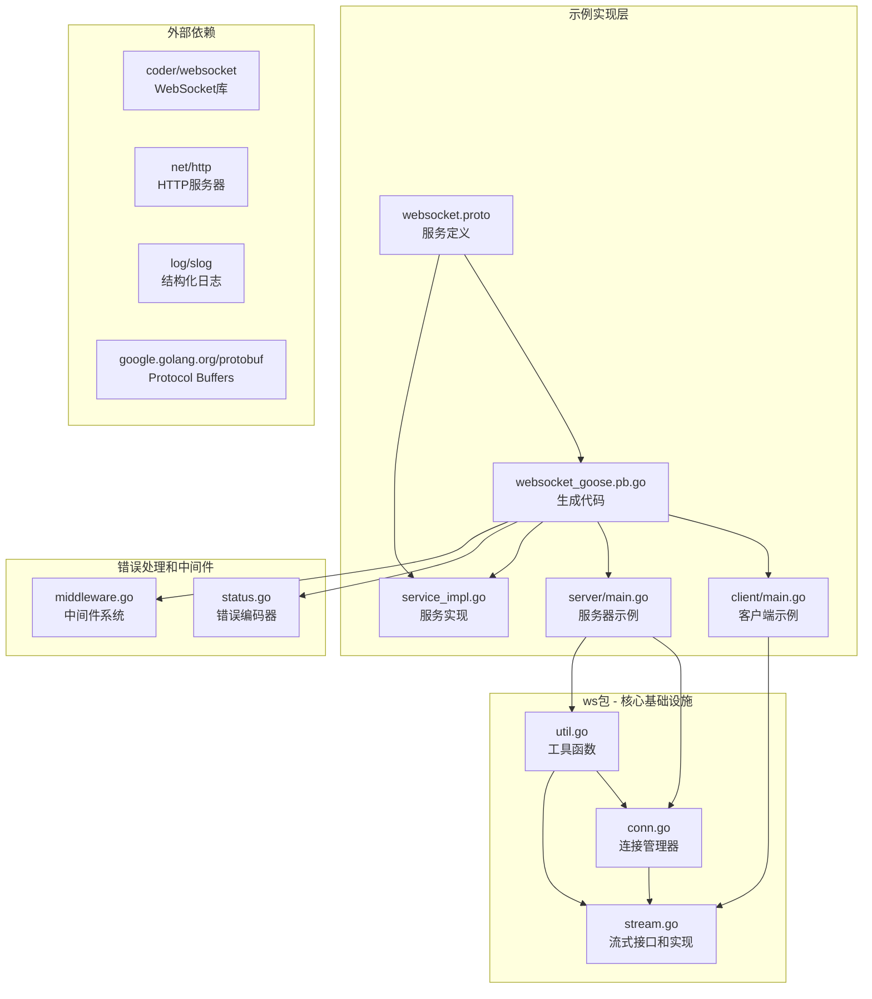
```mermaid
graph TB
subgraph "ws包 - 核心基础设施"
Conn[conn.go<br/>连接管理器]
Stream[stream.go<br/>流式接口和实现]
Util[util.go<br/>工具函数]
end
subgraph "示例实现层"
Proto[websocket.proto<br/>服务定义]
ServiceImpl[service_impl.go<br/>服务实现]
ClientMain[client/main.go<br/>客户端示例]
ServerMain[server/main.go<br/>服务器示例]
Generated[websocket_goose.pb.go<br/>生成代码]
end
subgraph "错误处理和中间件"
ErrorStatus[status.go<br/>错误编码器]
ServerMW[middleware.go<br/>中间件系统]
end
subgraph "外部依赖"
WS[coder/websocket<br/>WebSocket库]
HTTP[net/http<br/>HTTP服务器]
SLog[log/slog<br/>结构化日志]
Protobuf[google.golang.org/protobuf<br/>Protocol Buffers]
end
Conn --> Stream
Util --> Conn
Util --> Stream
Proto --> Generated
Proto --> ServiceImpl
Generated --> ClientMain
Generated --> ServerMain
Generated --> ServiceImpl
ClientMain --> Stream
ServerMain --> Conn
ServerMain --> Util
Generated --> ErrorStatus
Generated --> ServerMW
```

**图表来源**
- [conn.go:1-252](file://ws/conn.go#L1-L252)
- [stream.go:1-526](file://ws/stream.go#L1-L526)
- [util.go:1-27](file://ws/util.go#L1-L27)
- [websocket.proto:1-30](file://example/websocket/websocket.proto#L1-L30)
- [service_impl.go:1-126](file://example/websocket/service_impl.go#L1-L126)
- [client_main.go:1-207](file://example/websocket/client/main.go#L1-L207)
- [server_main.go:1-168](file://example/websocket/server/main.go#L1-L168)
- [websocket_goose.pb.go:1-293](file://example/websocket/websocket_goose.pb.go#L1-L293)
- [status.go:1-269](file://status.go#L1-L269)
- [middleware.go:1-84](file://server/middleware.go#L1-L84)

## 核心组件

### 简化的流式接口架构

系统采用简化的泛型接口设计，提供类型安全的流式通信能力：

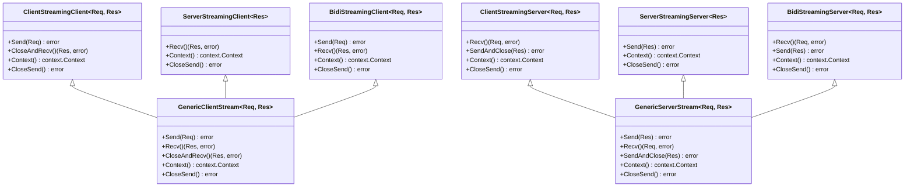
```mermaid
classDiagram
class ClientStreamingClient~Req, Res~ {
+Send(Req) error
+CloseAndRecv() (Res, error)
+Context() context.Context
+CloseSend() error
}
class ServerStreamingClient~Res~ {
+Recv() (Res, error)
+Context() context.Context
+CloseSend() error
}
class BidiStreamingClient~Req, Res~ {
+Send(Req) error
+Recv() (Res, error)
+Context() context.Context
+CloseSend() error
}
class ClientStreamingServer~Req, Res~ {
+Recv() (Req, error)
+SendAndClose(Res) error
+Context() context.Context
+CloseSend() error
}
class ServerStreamingServer~Res~ {
+Send(Res) error
+Context() context.Context
+CloseSend() error
}
class BidiStreamingServer~Req, Res~ {
+Recv() (Req, error)
+Send(Res) error
+Context() context.Context
+CloseSend() error
}
class GenericClientStream~Req, Res~ {
+Send(Req) error
+Recv() (Res, error)
+CloseAndRecv() (Res, error)
+Context() context.Context
+CloseSend() error
}
class GenericServerStream~Req, Res~ {
+Send(Res) error
+Recv() (Req, error)
+SendAndClose(Res) error
+Context() context.Context
+CloseSend() error
}
ClientStreamingClient <|-- GenericClientStream
ServerStreamingClient <|-- GenericClientStream
BidiStreamingClient <|-- GenericClientStream
ClientStreamingServer <|-- GenericServerStream
ServerStreamingServer <|-- GenericServerStream
BidiStreamingServer <|-- GenericServerStream
```

**图表来源**
- [stream.go:273-413](file://ws/stream.go#L273-L413)
- [stream.go:427-526](file://ws/stream.go#L427-L526)

### 增强的连接管理系统

连接管理系统提供了生产级别的WebSocket连接抽象和EOS处理：

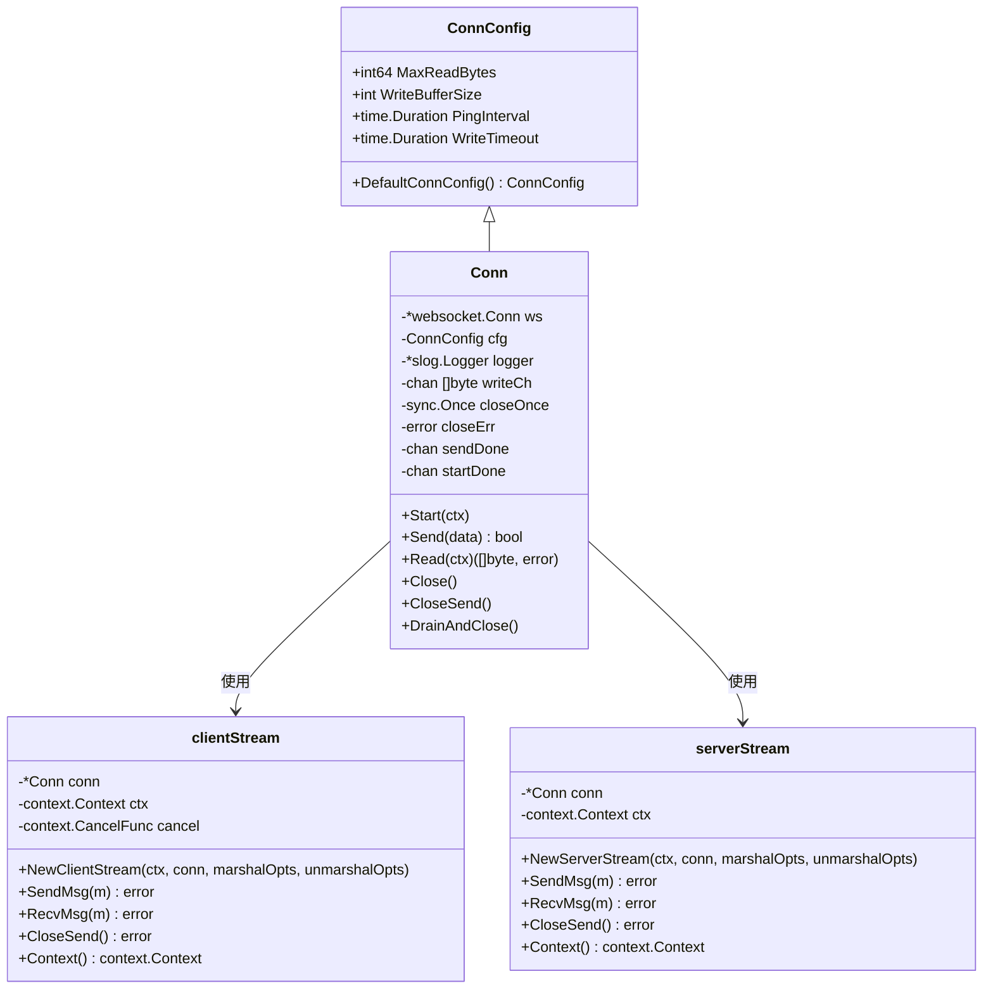
```mermaid
classDiagram
class ConnConfig {
+int64 MaxReadBytes
+int WriteBufferSize
+time.Duration PingInterval
+time.Duration WriteTimeout
+DefaultConnConfig() ConnConfig
}
class Conn {
-*websocket.Conn ws
-ConnConfig cfg
-*slog.Logger logger
-chan []byte writeCh
-sync.Once closeOnce
-error closeErr
-chan sendDone
-chan startDone
+Start(ctx)
+Send(data) bool
+Read(ctx) ([]byte, error)
+Close()
+CloseSend()
+DrainAndClose()
}
class clientStream {
-*Conn conn
-context.Context ctx
-context.CancelFunc cancel
+NewClientStream(ctx, conn, marshalOpts, unmarshalOpts)
+SendMsg(m) error
+RecvMsg(m) error
+CloseSend() error
+Context() context.Context
}
class serverStream {
-*Conn conn
-context.Context ctx
+NewServerStream(ctx, conn, marshalOpts, unmarshalOpts)
+SendMsg(m) error
+RecvMsg(m) error
+CloseSend() error
+Context() context.Context
}
ConnConfig <|-- Conn
Conn --> clientStream : 使用
Conn --> serverStream : 使用
```

**图表来源**
- [conn.go:12-50](file://ws/conn.go#L12-L50)
- [stream.go:67-94](file://ws/stream.go#L67-L94)
- [stream.go:200-218](file://ws/stream.go#L200-L218)

### 简化工具函数

系统提供了简化的工具函数用于WebSocket操作：

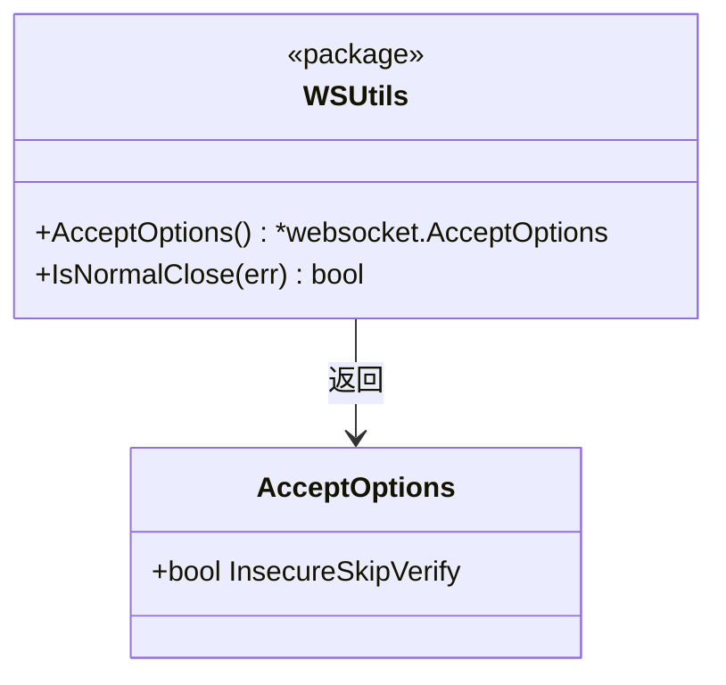
```mermaid
classDiagram
class WSUtils {
<<package>>
+AcceptOptions() *websocket.AcceptOptions
+IsNormalClose(err) bool
}
class AcceptOptions {
+bool InsecureSkipVerify
}
WSUtils --> AcceptOptions : 返回
```

**图表来源**
- [util.go:10-27](file://ws/util.go#L10-L27)

### 标准化错误处理系统

**更新** 系统现已集成标准化的错误处理机制，通过统一的错误编码器确保一致的响应格式：

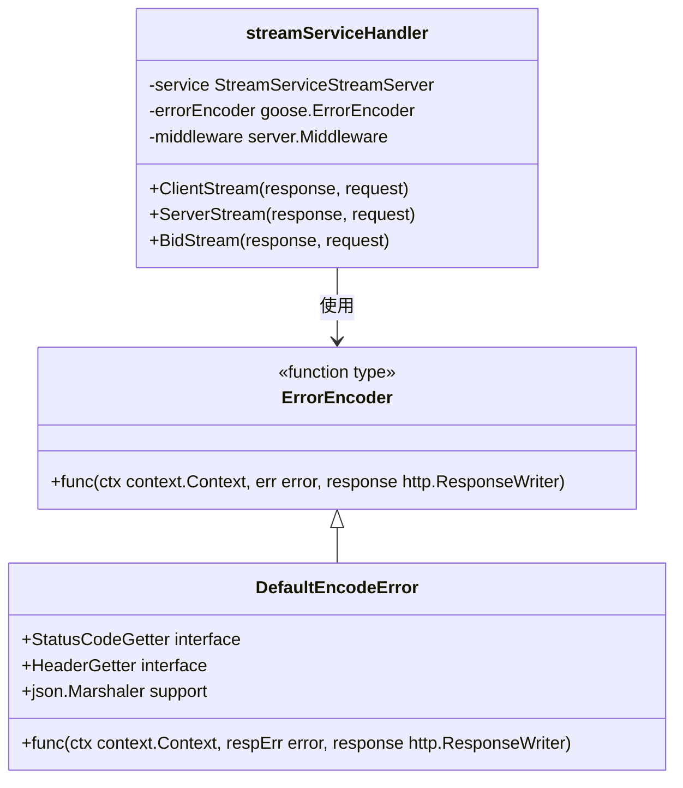
```mermaid
classDiagram
class ErrorEncoder {
<<function type>>
+func(ctx context.Context, err error, response http.ResponseWriter)
}
class DefaultEncodeError {
+func(ctx context.Context, respErr error, response http.ResponseWriter)
+StatusCodeGetter interface
+HeaderGetter interface
+json.Marshaler support
}
class streamServiceHandler {
-service StreamServiceStreamServer
-errorEncoder goose.ErrorEncoder
-middleware server.Middleware
+ClientStream(response, request)
+ServerStream(response, request)
+BidStream(response, request)
}
ErrorEncoder <|-- DefaultEncodeError
streamServiceHandler --> ErrorEncoder : 使用
```

**图表来源**
- [status.go:13-20](file://status.go#L13-20)
- [status.go:149-202](file://status.go#L149-L202)
- [websocket_goose.pb.go:58-66](file://example/websocket/websocket_goose.pb.go#L58-L66)

### 中间件集成系统

**更新** WebSocket流处理器现在完全支持中间件链执行，确保请求处理的标准化：

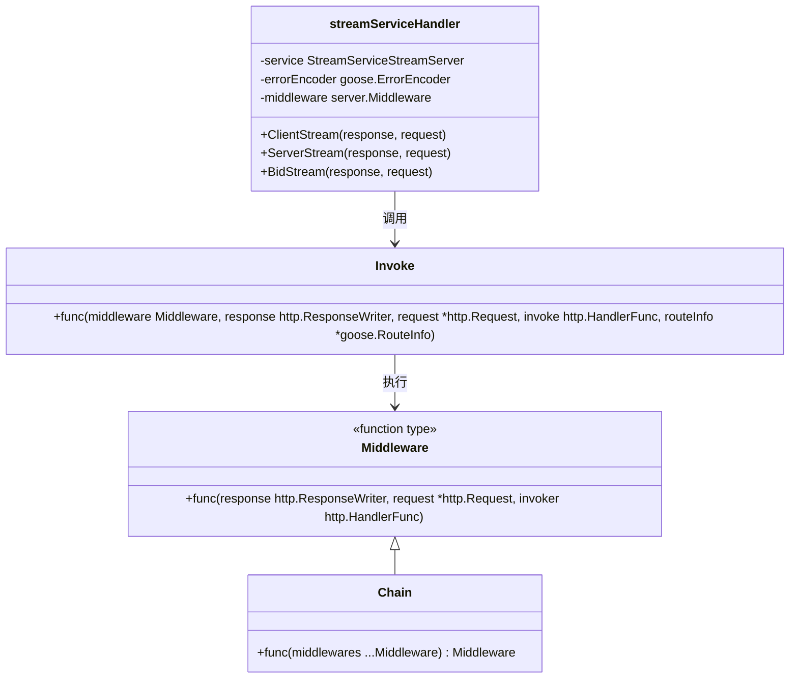
```mermaid
classDiagram
class Middleware {
<<function type>>
+func(response http.ResponseWriter, request *http.Request, invoker http.HandlerFunc)
}
class Chain {
+func(middlewares ...Middleware) Middleware
}
class Invoke {
+func(middleware Middleware, response http.ResponseWriter, request *http.Request, invoke http.HandlerFunc, routeInfo *goose.RouteInfo)
}
class streamServiceHandler {
-service StreamServiceStreamServer
-errorEncoder goose.ErrorEncoder
-middleware server.Middleware
+ClientStream(response, request)
+ServerStream(response, request)
+BidStream(response, request)
}
Middleware <|-- Chain
Invoke --> Middleware : 执行
streamServiceHandler --> Invoke : 调用
```

**图表来源**
- [middleware.go:9-17](file://server/middleware.go#L9-L17)
- [middleware.go:19-43](file://server/middleware.go#L19-L43)
- [middleware.go:65-84](file://server/middleware.go#L65-L84)
- [websocket_goose.pb.go:58-66](file://example/websocket/websocket_goose.pb.go#L58-L66)

## 架构概览

WebSocket流式系统采用精简的分层架构设计，确保了高可用性和可扩展性：

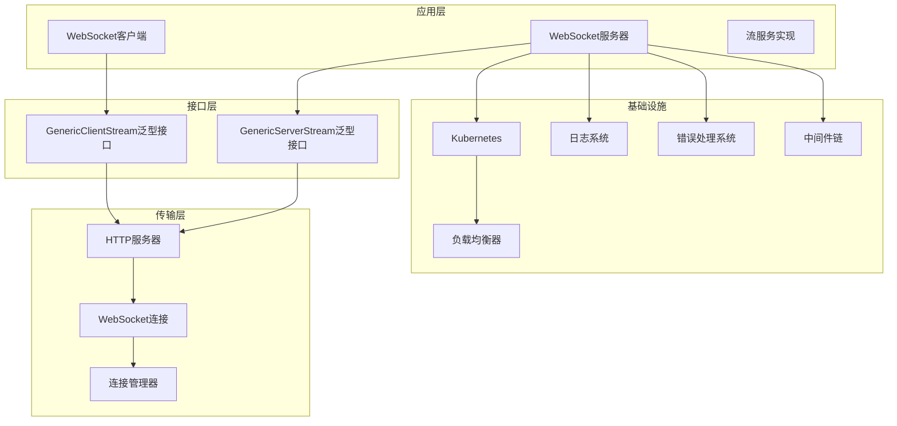
```mermaid
graph TB
subgraph "应用层"
Client[WebSocket客户端]
Server[WebSocket服务器]
Service[流服务实现]
end
subgraph "接口层"
GenericClientStream[GenericClientStream泛型接口]
GenericServerStream[GenericServerStream泛型接口]
end
subgraph "传输层"
HTTP[HTTP服务器]
WS[WebSocket连接]
Conn[连接管理器]
end
subgraph "基础设施"
ErrorHandling[错误处理系统]
MiddlewareChain[中间件链]
K8s[Kubernetes]
LB[负载均衡器]
Log[日志系统]
end
Client --> GenericClientStream
Server --> GenericServerStream
GenericClientStream --> HTTP
GenericServerStream --> HTTP
HTTP --> WS
WS --> Conn
Server --> K8s
K8s --> LB
Server --> Log
Server --> ErrorHandling
Server --> MiddlewareChain
```

**图表来源**
- [websocket_goose.pb.go:18-28](file://example/websocket/websocket_goose.pb.go#L18-L28)
- [server_main.go:57-168](file://example/websocket/server/main.go#L57-L168)
- [client_main.go:18-207](file://example/websocket/client/main.go#L18-L207)
- [status.go:149-202](file://status.go#L149-L202)
- [middleware.go:65-84](file://server/middleware.go#L65-L84)

系统的关键特性包括：

1. **多模式支持**：同时支持客户端单向流、服务器单向流和双向流
2. **类型安全**：通过泛型接口提供编译时类型检查
3. **连接池管理**：限制每个端点的最大并发连接数
4. **优雅关闭**：支持Kubernetes环境下的平滑停机
5. **EOS处理**：增强的End of Stream标记机制
6. **健康检查**：提供liveness和readiness探针
7. **简化API**：统一的泛型接口降低使用复杂度
8. **标准化错误处理**：统一的错误编码器和响应格式
9. **完整中间件支持**：支持完整的中间件链执行

## 详细组件分析

### Protocol Buffers服务定义

系统定义了完整的流服务接口体系，支持三种流式通信模式：

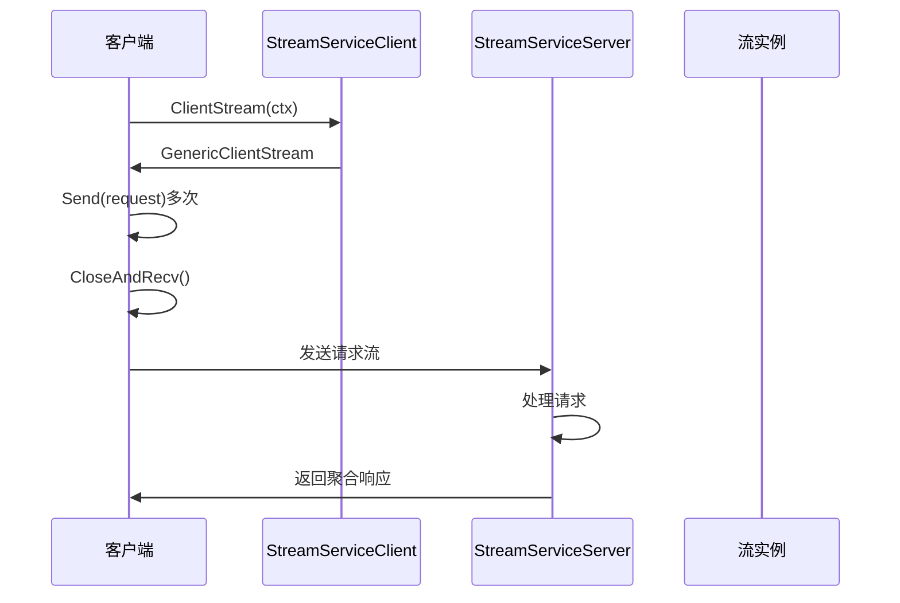
```mermaid
sequenceDiagram
participant Client as 客户端
participant Service as StreamServiceClient
participant Server as StreamServiceServer
participant Stream as 流实例
Client->>Service : ClientStream(ctx)
Service->>Client : GenericClientStream
Client->>Client : Send(request)多次
Client->>Client : CloseAndRecv()
Client->>Server : 发送请求流
Server->>Server : 处理请求
Server->>Client : 返回聚合响应
```

**图表来源**
- [websocket_goose.pb.go:235-242](file://example/websocket/websocket_goose.pb.go#L235-L242)
- [service_impl.go:38-59](file://example/websocket/service_impl.go#L38-L59)

#### 客户端单向流（Client-Stream）

客户端单向流适用于日志收集、遥测上报等场景：

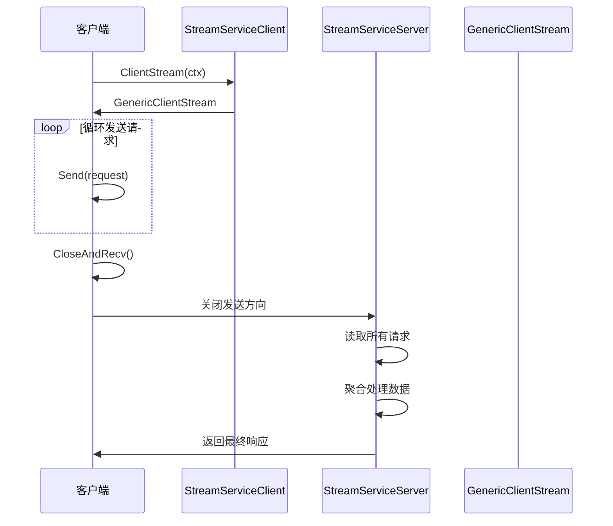
```mermaid
sequenceDiagram
participant Client as 客户端
participant Service as StreamServiceClient
participant Server as StreamServiceServer
participant Stream as GenericClientStream
Client->>Service : ClientStream(ctx)
Service->>Client : GenericClientStream
loop 循环发送请求
Client->>Client : Send(request)
end
Client->>Client : CloseAndRecv()
Client->>Server : 关闭发送方向
Server->>Server : 读取所有请求
Server->>Server : 聚合处理数据
Server->>Client : 返回最终响应
```

**图表来源**
- [websocket_goose.pb.go:235-242](file://example/websocket/websocket_goose.pb.go#L235-L242)
- [service_impl.go:38-59](file://example/websocket/service_impl.go#L38-L59)

#### 服务器单向流（Server-Stream）

服务器单向流适用于实时通知、直播推送等场景：

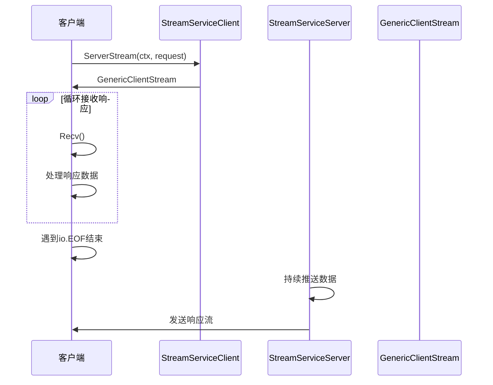
```mermaid
sequenceDiagram
participant Client as 客户端
participant Service as StreamServiceClient
participant Server as StreamServiceServer
participant Stream as GenericClientStream
Client->>Service : ServerStream(ctx, request)
Service->>Client : GenericClientStream
loop 循环接收响应
Client->>Client : Recv()
Client->>Client : 处理响应数据
end
Client->>Client : 遇到io.EOF结束
Server->>Server : 持续推送数据
Server->>Client : 发送响应流
```

**图表来源**
- [websocket_goose.pb.go:244-259](file://example/websocket/websocket_goose.pb.go#L244-L259)
- [service_impl.go:66-93](file://example/websocket/service_impl.go#L66-L93)

#### 双向流（Bidi-Stream）

双向流支持全双工通信，适用于聊天室、协作编辑等场景：

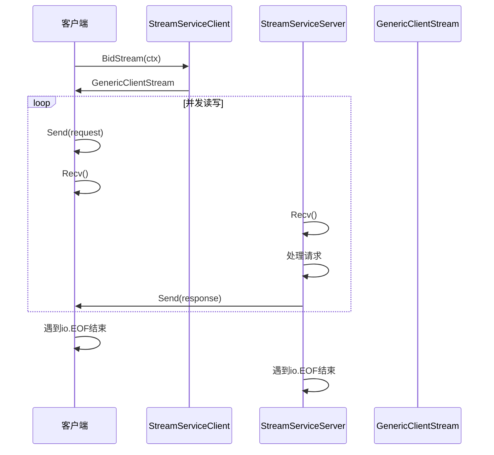
```mermaid
sequenceDiagram
participant Client as 客户端
participant Service as StreamServiceClient
participant Server as StreamServiceServer
participant Stream as GenericClientStream
Client->>Service : BidStream(ctx)
Service->>Client : GenericClientStream
loop 并发读写
Client->>Client : Send(request)
Client->>Client : Recv()
Server->>Server : Recv()
Server->>Server : 处理请求
Server->>Client : Send(response)
end
Client->>Client : 遇到io.EOF结束
Server->>Server : 遇到io.EOF结束
```

**图表来源**
- [websocket_goose.pb.go:261-268](file://example/websocket/websocket_goose.pb.go#L261-L268)
- [service_impl.go:99-125](file://example/websocket/service_impl.go#L99-L125)

### 增强的连接管理器

连接管理器提供了高性能的WebSocket连接抽象和EOS处理：

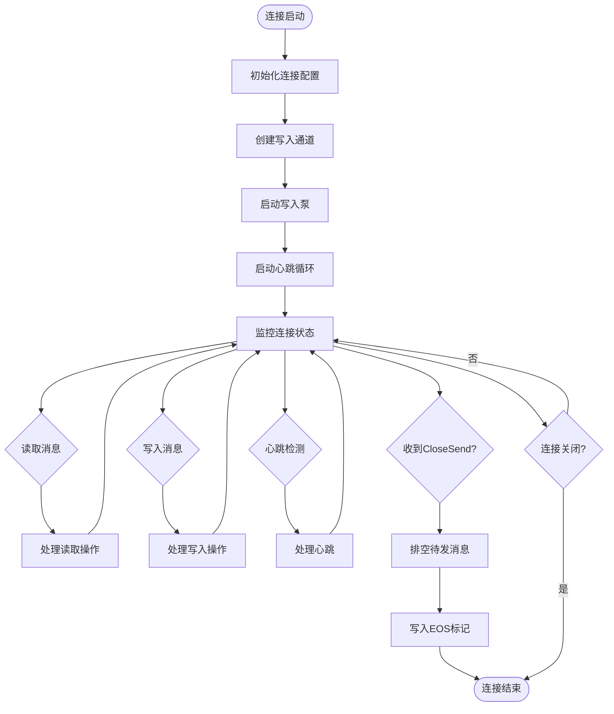
```mermaid
flowchart TD
Start([连接启动]) --> InitConfig["初始化连接配置"]
InitConfig --> CreateChan["创建写入通道"]
CreateChan --> StartWritePump["启动写入泵"]
StartWritePump --> StartPingLoop["启动心跳循环"]
StartPingLoop --> Monitor["监控连接状态"]
Monitor --> ReadMsg{"读取消息"}
Monitor --> WriteMsg{"写入消息"}
Monitor --> Heartbeat{"心跳检测"}
Monitor --> CloseSend{"收到CloseSend?"}
ReadMsg --> ProcessRead["处理读取操作"]
WriteMsg --> ProcessWrite["处理写入操作"]
Heartbeat --> ProcessHeartbeat["处理心跳"]
CloseSend --> DrainWrites["排空待发消息"]
DrainWrites --> WriteEOS["写入EOS标记"]
ProcessRead --> Monitor
ProcessWrite --> Monitor
ProcessHeartbeat --> Monitor
WriteEOS --> End([连接结束])
Monitor --> Close{"连接关闭?"}
Close --> |否| Monitor
Close --> |是| End
```

**图表来源**
- [conn.go:82-127](file://ws/conn.go#L82-L127)
- [conn.go:129-147](file://ws/conn.go#L129-L147)

连接管理器的关键特性：

1. **异步写入**：非阻塞的消息队列，支持背压处理
2. **心跳保持**：定期发送ping帧维持连接活跃
3. **EOS处理**：增强的End of Stream标记机制
4. **优雅关闭**：支持超时和队列清空机制
5. **错误处理**：自动检测和处理各种连接异常

### 简化的流式API

系统采用简化的泛型接口设计，降低了使用复杂度：

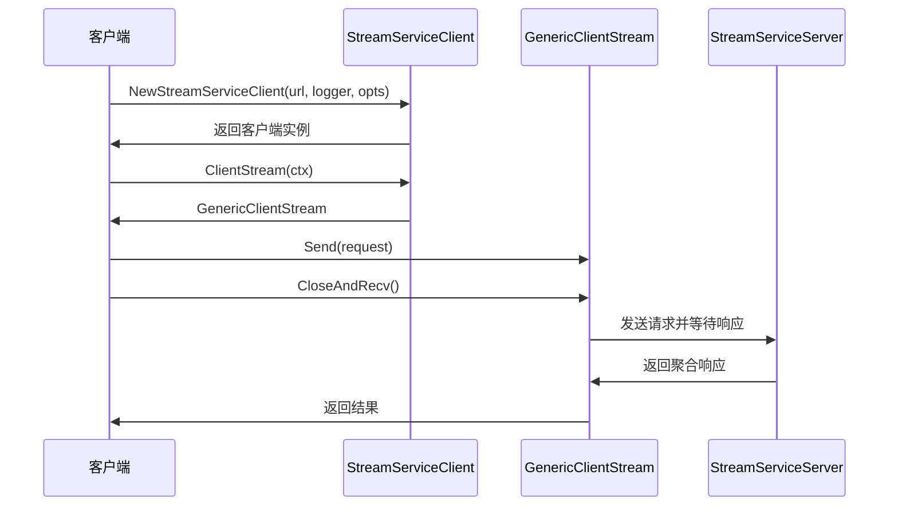
```mermaid
sequenceDiagram
participant Client as 客户端
participant Service as StreamServiceClient
participant Stream as GenericClientStream
participant Server as StreamServiceServer
Client->>Service : NewStreamServiceClient(url, logger, opts)
Service->>Client : 返回客户端实例
Client->>Service : ClientStream(ctx)
Service->>Client : GenericClientStream
Client->>Stream : Send(request)
Client->>Stream : CloseAndRecv()
Stream->>Server : 发送请求并等待响应
Server->>Stream : 返回聚合响应
Stream->>Client : 返回结果
```

**图表来源**
- [websocket_goose.pb.go:197-214](file://example/websocket/websocket_goose.pb.go#L197-L214)
- [websocket_goose.pb.go:235-242](file://example/websocket/websocket_goose.pb.go#L235-L242)

### 服务实现层

服务实现层采用简洁的服务委托模式，将业务逻辑直接委托给流式接口：

#### 客户端单向流服务实现

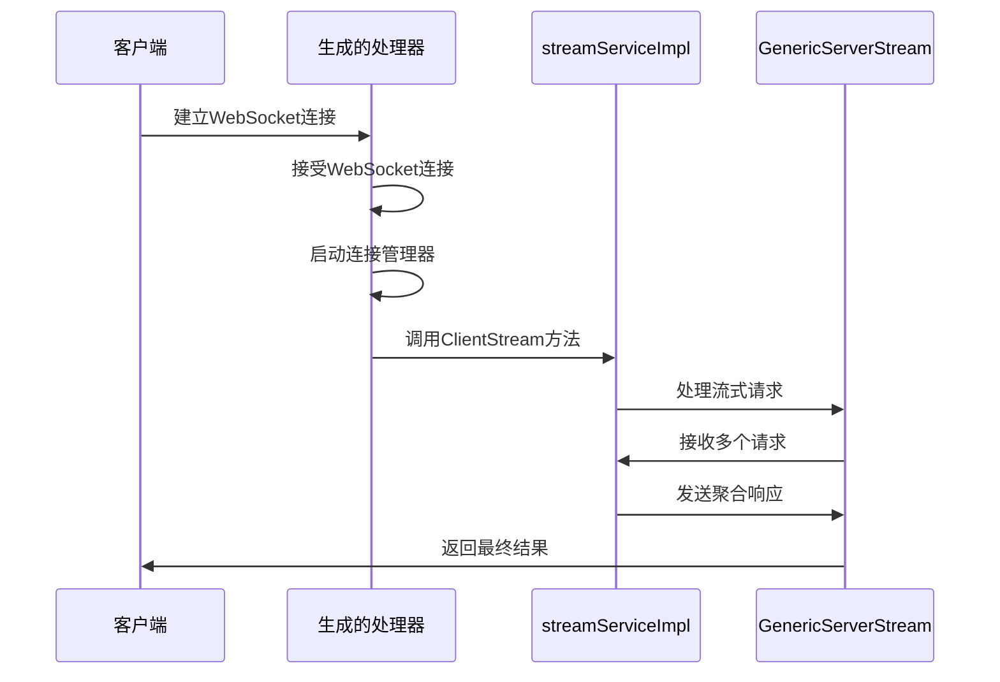
```mermaid
sequenceDiagram
participant Client as 客户端
participant Handler as 生成的处理器
participant Service as streamServiceImpl
participant Stream as GenericServerStream
Client->>Handler : 建立WebSocket连接
Handler->>Handler : 接受WebSocket连接
Handler->>Handler : 启动连接管理器
Handler->>Service : 调用ClientStream方法
Service->>Stream : 处理流式请求
Stream->>Service : 接收多个请求
Service->>Stream : 发送聚合响应
Stream->>Client : 返回最终结果
```

**图表来源**
- [websocket_goose.pb.go:60-90](file://example/websocket/websocket_goose.pb.go#L60-L90)
- [service_impl.go:38-59](file://example/websocket/service_impl.go#L38-L59)

#### 服务器单向流服务实现

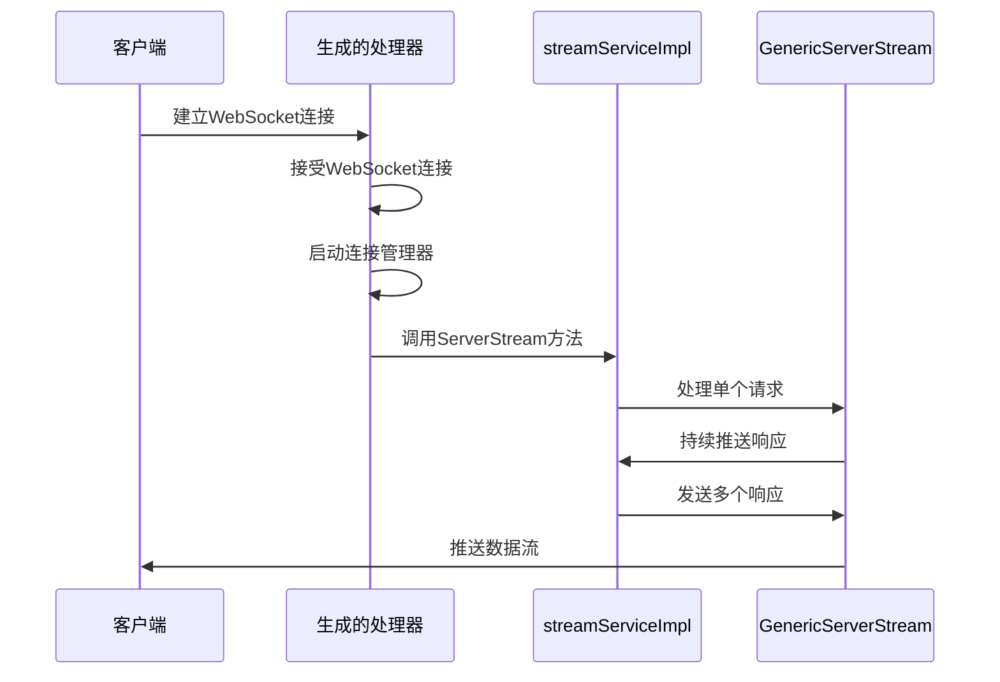
```mermaid
sequenceDiagram
participant Client as 客户端
participant Handler as 生成的处理器
participant Service as streamServiceImpl
participant Stream as GenericServerStream
Client->>Handler : 建立WebSocket连接
Handler->>Handler : 接受WebSocket连接
Handler->>Handler : 启动连接管理器
Handler->>Service : 调用ServerStream方法
Service->>Stream : 处理单个请求
Stream->>Service : 持续推送响应
Service->>Stream : 发送多个响应
Stream->>Client : 推送数据流
```

**图表来源**
- [websocket_goose.pb.go:96-140](file://example/websocket/websocket_goose.pb.go#L96-L140)
- [service_impl.go:66-93](file://example/websocket/service_impl.go#L66-L93)

#### 双向流服务实现

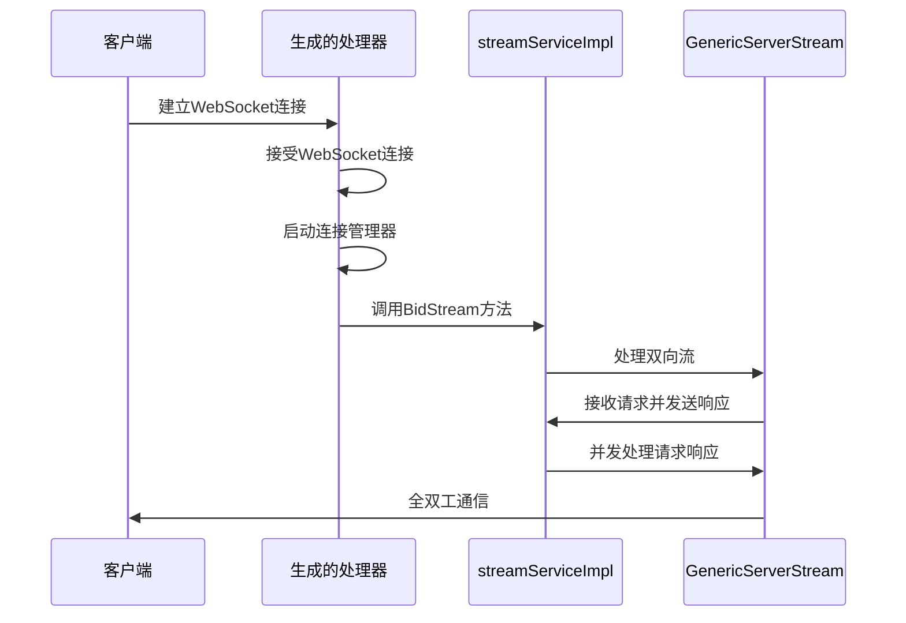
```mermaid
sequenceDiagram
participant Client as 客户端
participant Handler as 生成的处理器
participant Service as streamServiceImpl
participant Stream as GenericServerStream
Client->>Handler : 建立WebSocket连接
Handler->>Handler : 接受WebSocket连接
Handler->>Handler : 启动连接管理器
Handler->>Service : 调用BidStream方法
Service->>Stream : 处理双向流
Stream->>Service : 接收请求并发送响应
Service->>Stream : 并发处理请求响应
Stream->>Client : 全双工通信
```

**图表来源**
- [websocket_goose.pb.go:146-176](file://example/websocket/websocket_goose.pb.go#L146-L176)
- [service_impl.go:99-125](file://example/websocket/service_impl.go#L99-L125)

### 标准化错误处理机制

**更新** 系统现已实现标准化的错误处理机制，确保所有WebSocket流处理器具有一致的错误响应格式：

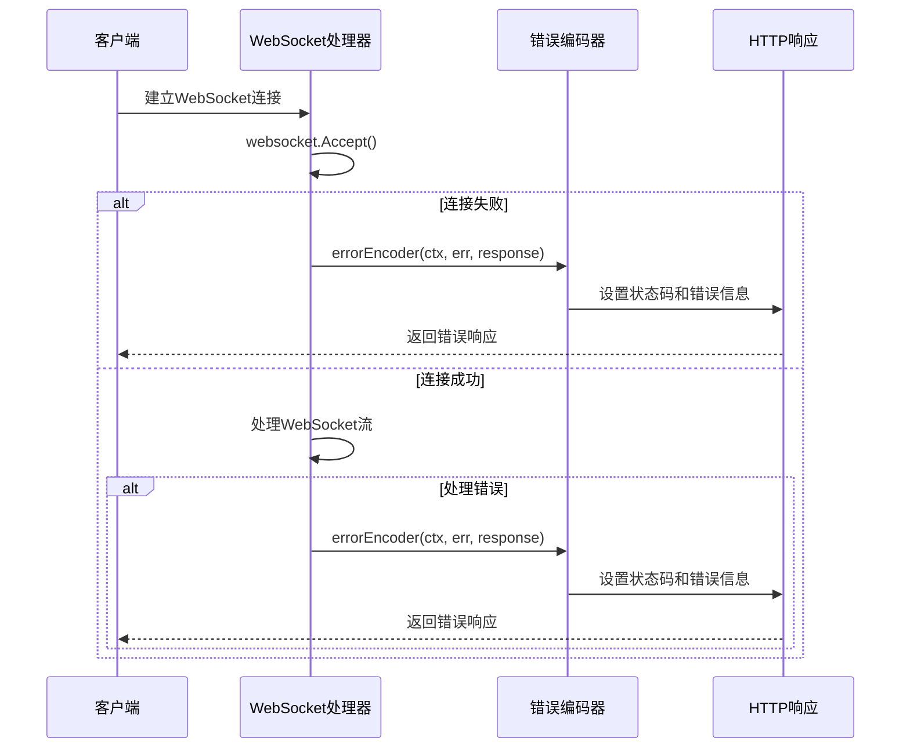
```mermaid
sequenceDiagram
participant Client as 客户端
participant Handler as WebSocket处理器
participant ErrorEncoder as 错误编码器
participant Response as HTTP响应
Client->>Handler : 建立WebSocket连接
Handler->>Handler : websocket.Accept()
alt 连接失败
Handler->>ErrorEncoder : errorEncoder(ctx, err, response)
ErrorEncoder->>Response : 设置状态码和错误信息
Response-->>Client : 返回错误响应
else 连接成功
Handler->>Handler : 处理WebSocket流
alt 处理错误
Handler->>ErrorEncoder : errorEncoder(ctx, err, response)
ErrorEncoder->>Response : 设置状态码和错误信息
Response-->>Client : 返回错误响应
end
end
```

**图表来源**
- [websocket_goose.pb.go:72-97](file://example/websocket/websocket_goose.pb.go#L72-L97)
- [websocket_goose.pb.go:103-143](file://example/websocket/websocket_goose.pb.go#L103-L143)
- [status.go:149-202](file://status.go#L149-L202)

### 中间件链执行机制

**更新** WebSocket流处理器现在完全支持中间件链执行，确保请求处理的标准化：

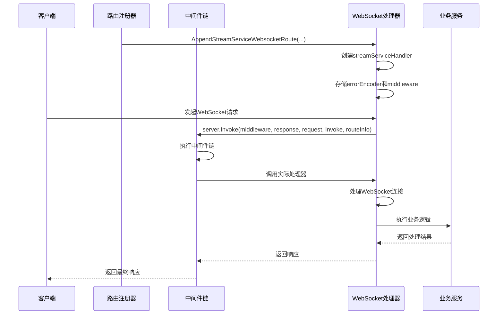
```mermaid
sequenceDiagram
participant Client as 客户端
participant Router as 路由注册器
participant Middleware as 中间件链
participant Handler as WebSocket处理器
participant Service as 业务服务
Router->>Handler : AppendStreamServiceWebsocketRoute(...)
Handler->>Handler : 创建streamServiceHandler
Handler->>Handler : 存储errorEncoder和middleware
Client->>Handler : 发起WebSocket请求
Handler->>Middleware : server.Invoke(middleware, response, request, invoke, routeInfo)
Middleware->>Middleware : 执行中间件链
Middleware->>Handler : 调用实际处理器
Handler->>Handler : 处理WebSocket连接
Handler->>Service : 执行业务逻辑
Service-->>Handler : 返回处理结果
Handler-->>Middleware : 返回响应
Middleware-->>Client : 返回最终响应
```

**图表来源**
- [websocket_goose.pb.go:30-56](file://example/websocket/websocket_goose.pb.go#L30-L56)
- [websocket_goose.pb.go:96](file://example/websocket/websocket_goose.pb.go#L96)
- [websocket_goose.pb.go:142](file://example/websocket/websocket_goose.pb.go#L142)
- [websocket_goose.pb.go:173](file://example/websocket/websocket_goose.pb.go#L173)
- [middleware.go:65-84](file://server/middleware.go#L65-L84)

## 依赖关系分析

WebSocket流式系统的主要依赖关系如下：

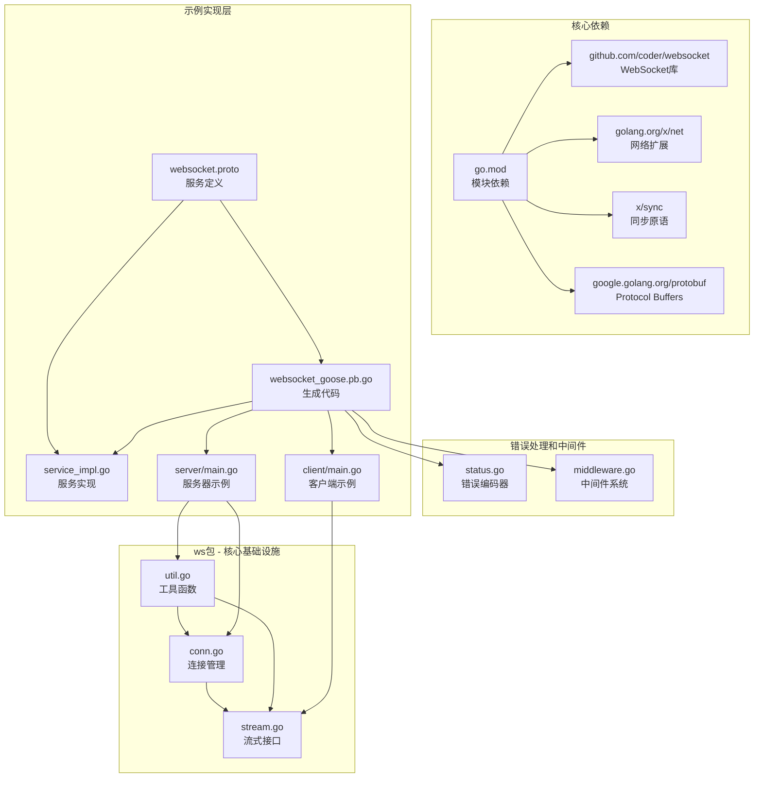
```mermaid
graph TB
subgraph "核心依赖"
GoMod[go.mod<br/>模块依赖]
WS[github.com/coder/websocket<br/>WebSocket库]
NetHTTP[golang.org/x/net<br/>网络扩展]
Sync[x/sync<br/>同步原语]
Protobuf[google.golang.org/protobuf<br/>Protocol Buffers]
end
subgraph "ws包 - 核心基础设施"
Conn[conn.go<br/>连接管理]
Stream[stream.go<br/>流式接口]
Util[util.go<br/>工具函数]
end
subgraph "错误处理和中间件"
Status[status.go<br/>错误编码器]
ServerMW[middleware.go<br/>中间件系统]
end
subgraph "示例实现层"
Proto[websocket.proto<br/>服务定义]
ServiceImpl[service_impl.go<br/>服务实现]
ClientMain[client/main.go<br/>客户端示例]
ServerMain[server/main.go<br/>服务器示例]
Generated[websocket_goose.pb.go<br/>生成代码]
end
GoMod --> WS
GoMod --> NetHTTP
GoMod --> Sync
GoMod --> Protobuf
Conn --> Stream
Util --> Conn
Util --> Stream
Proto --> Generated
Proto --> ServiceImpl
Generated --> ClientMain
Generated --> ServerMain
Generated --> ServiceImpl
ClientMain --> Stream
ServerMain --> Conn
ServerMain --> Util
Generated --> Status
Generated --> ServerMW
```

**图表来源**
- [conn.go:1-252](file://ws/conn.go#L1-L252)
- [stream.go:1-526](file://ws/stream.go#L1-L526)
- [util.go:1-27](file://ws/util.go#L1-L27)
- [websocket.proto:1-30](file://example/websocket/websocket.proto#L1-L30)
- [service_impl.go:1-126](file://example/websocket/service_impl.go#L1-L126)
- [client_main.go:1-207](file://example/websocket/client/main.go#L1-L207)
- [server_main.go:1-168](file://example/websocket/server/main.go#L1-L168)
- [websocket_goose.pb.go:1-293](file://example/websocket/websocket_goose.pb.go#L1-L293)
- [status.go:1-269](file://status.go#L1-L269)
- [middleware.go:1-84](file://server/middleware.go#L1-L84)

## 性能考虑

WebSocket流式系统在设计时充分考虑了性能和可扩展性：

### 连接池管理
- 支持按端点限制最大并发连接数
- 使用原子计数器进行无锁连接统计
- 提供活动连接数查询接口

### 内存管理
- 使用带缓冲的通道实现异步写入
- 支持写入缓冲区大小配置
- 实现消息队列背压处理

### 网络优化
- 配置读取限制防止内存溢出
- 支持写入超时控制
- 实现心跳机制维持连接活跃

### 并发模型
- 使用goroutine管理并发任务
- 支持上下文取消机制
- 实现优雅的资源清理

### EOS处理优化
- 增强的End of Stream标记机制
- 避免不必要的连接关闭
- 支持半关闭通信模式

### 错误处理优化
- 统一的错误编码器减少重复代码
- 支持多种错误类型的智能编码
- 提供自定义错误处理扩展点

### 中间件性能
- 中间件链按需执行，避免不必要的开销
- 支持中间件短路机制
- 提供中间件性能监控接口

## 故障排除指南

### 常见问题诊断

1. **连接无法建立**
   - 检查URL格式和协议(ws/wss)
   - 验证网络连通性和防火墙设置
   - 查看握手阶段的日志信息

2. **消息丢失**
   - 检查写入缓冲区配置
   - 验证消息大小限制设置
   - 监控连接状态变化

3. **性能问题**
   - 分析CPU和内存使用情况
   - 检查网络延迟和带宽
   - 优化并发连接数配置

4. **流式通信问题**
   - 检查io.EOF错误处理
   - 验证流的生命周期管理
   - 确认EOS标记正确发送

5. **错误处理问题**
   - 检查错误编码器配置
   - 验证中间件链执行顺序
   - 确认错误响应格式一致性

6. **中间件问题**
   - 检查中间件链配置
   - 验证中间件执行顺序
   - 确认中间件兼容性

### 日志分析

系统提供了详细的结构化日志输出，包括：

- 连接建立和断开事件
- 消息发送和接收统计
- 错误和异常信息
- 性能指标和监控数据
- 中间件执行日志
- 错误处理详情

## 结论

WebSocket流式系统是一个功能完整、设计精良的实时通信解决方案。它通过精简的架构设计、完善的错误处理机制和生产级别的性能优化，为各种实时应用场景提供了可靠的技术基础。

**更新** 系统现已完成重大架构重构，移除了独立的客户端实现文件，将核心功能整合到简化的三文件结构中。新的架构采用增强的连接管理和EOS处理机制，通过统一的泛型接口提供类型安全的流式通信能力，支持客户端流、服务器流和双向流的完整生命周期管理。

**最新增强** WebSocket流式基础设施现已集成标准化的错误处理和中间件系统。`AppendStreamServiceWebsocketRoute`函数签名已扩展，支持统一的错误编码器和中间件链执行，确保所有WebSocket流处理器具有一致的错误处理行为和完整的中间件支持。

系统的主要优势包括：

1. **简化架构**：从复杂的文件结构简化为三个核心文件，提高可维护性
2. **增强EOS处理**：改进的End of Stream标记机制确保可靠的流终止
3. **统一接口**：通过泛型接口提供一致的编程体验
4. **高可用性**：自动重连、优雅关闭、健康检查等特性确保系统稳定运行
5. **高性能**：异步处理、连接池管理、内存优化等技术提升整体性能
6. **易用性**：清晰的API设计和丰富的配置选项降低使用门槛
7. **标准化错误处理**：统一的错误编码器确保一致的响应格式
8. **完整中间件支持**：支持完整的中间件链执行，提供灵活的扩展能力

该系统特别适合在Kubernetes环境中部署，能够很好地适应现代云原生应用的需求。通过合理的配置和监控，可以构建出高性能、可扩展的实时通信服务。

**Section sources**
- [websocket_goose.pb.go:30-56](file://example/websocket/websocket_goose.pb.go#L30-L56)
- [websocket_goose.pb.go:58-66](file://example/websocket/websocket_goose.pb.go#L58-L66)
- [websocket_goose.pb.go:72-97](file://example/websocket/websocket_goose.pb.go#L72-L97)
- [websocket_goose.pb.go:103-143](file://example/websocket/websocket_goose.pb.go#L103-L143)
- [websocket_goose.pb.go:149-174](file://example/websocket/websocket_goose.pb.go#L149-L174)
- [status.go:13-20](file://status.go#L13-L20)
- [status.go:149-202](file://status.go#L149-L202)
- [middleware.go:9-17](file://server/middleware.go#L9-L17)
- [middleware.go:65-84](file://server/middleware.go#L65-L84)
- [server_main.go:111](file://example/websocket/server/main.go#L111)