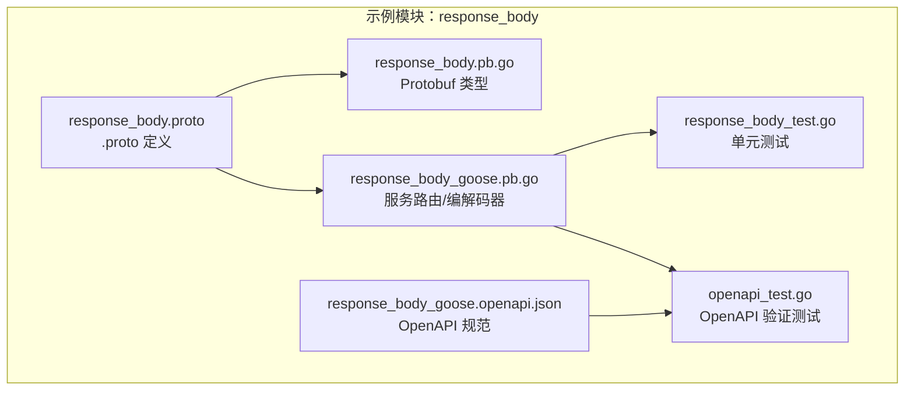
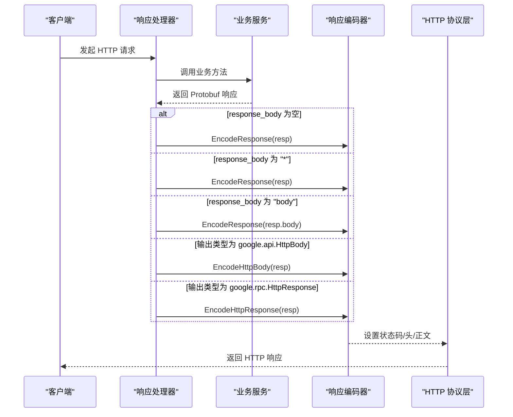
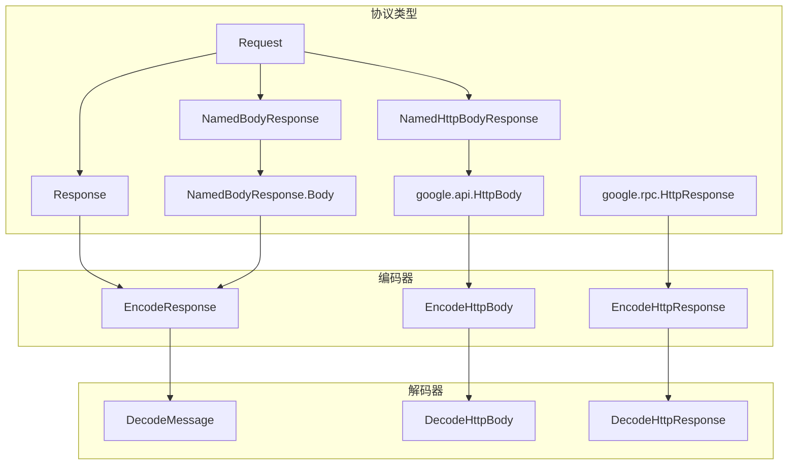

# 响应体处理示例

<cite>
**本文引用的文件列表**
- [response_body.proto](file://example/response_body/response_body.proto)
- [response_body.pb.go](file://example/response_body/response_body.pb.go)
- [response_body_goose.pb.go](file://example/response_body/response_body_goose.pb.go)
- [response_body_test.go](file://example/response_body/response_body_test.go)
- [response_body_goose.openapi.json](file://example/response_body/response_body_goose.openapi.json)
- [openapi_test.go](file://example/response_body/openapi_test.go)
- [response.go](file://cmd/protoc-gen-goose/server/response.go)
- [encoder.go](file://server/encoder.go)
- [decoder.go](file://client/decoder.go)
- [httpbody.proto](file://third_party/google/api/httpbody.proto)
- [http.proto](file://third_party/google/rpc/http.proto)
</cite>

## 目录
1. [简介](#简介)
2. [项目结构](#项目结构)
3. [核心组件](#核心组件)
4. [架构总览](#架构总览)
5. [详细组件分析](#详细组件分析)
6. [依赖关系分析](#依赖关系分析)
7. [性能考量](#性能考量)
8. [故障排查指南](#故障排查指南)
9. [结论](#结论)
10. [附录](#附录)

## 简介
本文件围绕 Goose 框架中的响应体处理机制，提供一套完整的响应体处理示例文档。内容涵盖：
- 如何定义响应消息结构（含嵌套对象）
- 如何处理不同类型的响应体（省略、星号通配、命名字段、HttpBody、NamedHttpBody、HttpResponse）
- 数据序列化与反序列化的流程
- 与 HTTP 状态码的关系及错误响应处理
- 具体的 .proto 示例、生成的响应代码与测试用例

该示例基于仓库中的 response_body 示例模块，展示了从 .proto 定义到服务端编码器、客户端解码器以及 OpenAPI 规范验证的完整链路。

## 项目结构
响应体处理示例位于 example/response_body 目录，包含以下关键文件：
- .proto 定义：定义服务接口与消息类型
- 生成的 pb.go：Protobuf 类型定义
- 生成的 goose.pb.go：服务路由、请求/响应编解码器、客户端封装
- 测试文件：单元测试与 OpenAPI 规范验证测试
- OpenAPI 规范：描述各端点的响应体结构与内容类型

图表来源
- [response_body.proto:1-60](file://example/response_body/response_body.proto#L1-L60)
- [response_body.pb.go:1-337](file://example/response_body/response_body.pb.go#L1-L337)
- [response_body_goose.pb.go:1-767](file://example/response_body/response_body_goose.pb.go#L1-L767)
- [response_body_test.go:1-167](file://example/response_body/response_body_test.go#L1-L167)
- [response_body_goose.openapi.json:1-287](file://example/response_body/response_body_goose.openapi.json#L1-L287)
- [openapi_test.go:1-497](file://example/response_body/openapi_test.go#L1-L497)

章节来源
- [response_body.proto:1-60](file://example/response_body/response_body.proto#L1-L60)
- [response_body_goose.pb.go:1-767](file://example/response_body/response_body_goose.pb.go#L1-L767)

## 核心组件
- 服务接口定义：在 .proto 中通过 google.api.http 注解定义 HTTP 映射与 response_body 参数，支持省略、星号通配、命名字段等模式。
- 编码器：根据 response_body 的配置选择不同的编码策略（JSON、HttpBody、HttpResponse）。
- 解码器：客户端侧将 HTTP 响应解码为 Protobuf 消息或特定类型（HttpBody、HttpResponse）。
- OpenAPI 规范：描述各端点的参数、响应体结构与内容类型，用于测试与文档生成。

章节来源
- [response.go:1-68](file://cmd/protoc-gen-goose/server/response.go#L1-L68)
- [encoder.go:1-98](file://server/encoder.go#L1-L98)
- [decoder.go:1-89](file://client/decoder.go#L1-L89)
- [response_body_goose.openapi.json:1-287](file://example/response_body/response_body_goose.openapi.json#L1-L287)

## 架构总览
下图展示从客户端发起请求到服务端返回响应的整体流程，重点体现响应体编码策略的选择逻辑。

图表来源
- [response.go:12-55](file://cmd/protoc-gen-goose/server/response.go#L12-L55)
- [encoder.go:27-97](file://server/encoder.go#L27-L97)
- [response_body_goose.pb.go:324-346](file://example/response_body/response_body_goose.pb.go#L324-L346)

## 详细组件分析

### .proto 响应体定义与映射
- 省略响应体：未设置 response_body，直接以 JSON 序列化整个响应消息。
- 星号通配：response_body 设置为 "*"，表示将响应消息整体作为响应体。
- 命名字段：response_body 指定为具体字段名（如 "body"），仅输出该字段的内容。
- 使用 HttpBody：输出类型为 google.api.HttpBody，响应体为原始二进制数据，Content-Type 来自 HttpBody。
- 使用 NamedHttpBody：输出类型为包含 HttpBody 的消息，响应体同样为原始二进制数据。
- 使用 HttpResponse：输出类型为 google.rpc.HttpResponse，响应体为任意字节流，状态码与头由 HttpResponse 决定。

章节来源
- [response_body.proto:9-47](file://example/response_body/response_body.proto#L9-L47)
- [httpbody.proto:71-81](file://third_party/google/api/httpbody.proto#L71-L81)
- [http.proto:42-55](file://third_party/google/rpc/http.proto#L42-L55)

### 生成的响应编码器逻辑
- response_body 为空或 "*"：调用通用 EncodeResponse，设置 Content-Type 为 application/json，状态码为 200，序列化响应消息。
- response_body 指定字段：
  - 若字段类型为 HttpBody：调用 EncodeHttpBody，使用 HttpBody 的 ContentType 作为响应头，写入 Data。
  - 否则：序列化该字段内容。
- 输出类型为 google.api.HttpBody：调用 EncodeHttpBody。
- 输出类型为 google.rpc.HttpResponse：调用 EncodeHttpResponse，复制所有头、状态码与正文。

章节来源
- [response.go:12-55](file://cmd/protoc-gen-goose/server/response.go#L12-L55)
- [encoder.go:27-97](file://server/encoder.go#L27-L97)
- [response_body_goose.pb.go:324-346](file://example/response_body/response_body_goose.pb.go#L324-L346)

### 客户端解码器与错误处理
- JSON 响应：读取响应体，按 JSON 反序列化到目标消息。
- HttpBody 响应：提取 Content-Type 头，读取原始字节作为 Data。
- HttpResponse 响应：提取状态码、原因短语、头集合与正文。
- 错误处理：当服务端返回非 2xx 或出现解析错误时，客户端解码器会返回相应错误；OpenAPI 验证测试中会对状态码与内容类型进行校验。

章节来源
- [decoder.go:28-88](file://client/decoder.go#L28-L88)
- [openapi_test.go:297-340](file://example/response_body/openapi_test.go#L297-L340)

### OpenAPI 规范与测试
- OpenAPI 文档描述了每个端点的路径、参数、响应体结构与内容类型。
- 测试通过构建符合 OpenAPI 的请求，发送 HTTP 请求并验证响应的状态码、内容类型与正文格式。
- 特别地，对于 HttpBody/HttpResponse 的场景，OpenAPI 将内容类型声明为 "*/*" 或对象，但实际响应可能为二进制或任意字节流，测试会跳过严格的 JSON 校验。

章节来源
- [response_body_goose.openapi.json:1-287](file://example/response_body/response_body_goose.openapi.json#L1-L287)
- [openapi_test.go:365-425](file://example/response_body/openapi_test.go#L365-L425)

### 嵌套对象与数据序列化
- 命名响应体（NamedResponse）：响应消息包含一个名为 body 的子消息，编码时仅输出该子消息的内容，从而实现“嵌套对象”的简化输出。
- 嵌套字段的序列化遵循 Protobuf JSON 规范，字段名采用小驼峰命名，数值类型与布尔值按 JSON 标准序列化。

章节来源
- [response_body.proto:54-57](file://example/response_body/response_body.proto#L54-L57)
- [response_body_goose.pb.go:335-337](file://example/response_body/response_body_goose.pb.go#L335-L337)

### HTTP 状态码与错误响应
- 默认 JSON 响应：状态码固定为 200，Content-Type 为 application/json。
- HttpBody 响应：状态码固定为 200，Content-Type 来自 HttpBody。
- HttpResponse 响应：状态码与头由 HttpResponse 决定，正文为任意字节流。
- 错误响应：当业务方法返回错误或解码失败时，客户端解码器会返回错误；OpenAPI 验证测试会检查未声明的状态码与异常情况。

章节来源
- [encoder.go:27-97](file://server/encoder.go#L27-L97)
- [decoder.go:28-88](file://client/decoder.go#L28-L88)
- [openapi_test.go:297-340](file://example/response_body/openapi_test.go#L297-L340)

## 依赖关系分析
响应体处理涉及的关键依赖如下：
- Protobuf 类型：Request、Response、NamedBodyResponse、NamedHttpBodyResponse、google.api.HttpBody、google.rpc.HttpResponse
- 编码器：EncodeResponse、EncodeHttpBody、EncodeHttpResponse
- 解码器：DecodeMessage、DecodeHttpBody、DecodeHttpResponse
- OpenAPI 规范：描述各端点的响应体结构与内容类型

图表来源
- [response_body.pb.go:27-201](file://example/response_body/response_body.pb.go#L27-L201)
- [encoder.go:27-97](file://server/encoder.go#L27-L97)
- [decoder.go:28-88](file://client/decoder.go#L28-L88)

章节来源
- [response_body.pb.go:27-201](file://example/response_body/response_body.pb.go#L27-L201)
- [encoder.go:27-97](file://server/encoder.go#L27-L97)
- [decoder.go:28-88](file://client/decoder.go#L28-L88)

## 性能考量
- JSON 序列化开销：对于大型响应消息，JSON 编码/解码可能成为瓶颈。建议在高频场景下评估压缩策略或使用更高效的序列化方案。
- HttpBody/HttpResponse：直接写入原始字节，避免额外的 JSON 解析，适合传输二进制或任意字节流。
- 并发与连接复用：在高并发场景下，合理配置 HTTP 客户端与服务端的连接池与超时策略，减少握手与上下文切换成本。

## 故障排查指南
- 状态码不匹配：检查服务端编码器是否正确设置状态码（默认 200，HttpResponse 由响应决定）。
- 内容类型不符：确认 response_body 配置与输出类型是否一致（JSON、HttpBody、HttpResponse）。
- 响应体为空或格式错误：核对 OpenAPI 规范与实际实现，确保客户端解码器按预期工作。
- 嵌套字段缺失：当 response_body 指定为 "body" 时，需确保响应消息包含该字段且非空。

章节来源
- [encoder.go:27-97](file://server/encoder.go#L27-L97)
- [decoder.go:28-88](file://client/decoder.go#L28-L88)
- [openapi_test.go:297-340](file://example/response_body/openapi_test.go#L297-L340)

## 结论
本示例系统性展示了如何在 Goose 框架中处理多种响应体形式，包括省略、星号通配、命名字段、HttpBody、NamedHttpBody 与 HttpResponse。通过 .proto 中的 response_body 注解与生成的编码器逻辑，开发者可以灵活控制响应体的输出结构与内容类型；结合 OpenAPI 规范与测试用例，能够确保实现的一致性与可维护性。

## 附录

### .proto 示例要点
- 使用 google.api.http 注解定义 HTTP 映射与 response_body 参数
- 嵌套消息用于命名响应体（如 NamedBodyResponse.body）
- 引入 google.api.HttpBody 与 google.rpc.HttpResponse 以支持非 JSON 响应

章节来源
- [response_body.proto:9-47](file://example/response_body/response_body.proto#L9-L47)

### 生成的响应代码要点
- 服务路由注册：将 HTTP 方法与路径映射到对应处理器
- 请求解码：优先尝试自定义解码，否则从查询参数构造请求
- 响应编码：根据 response_body 与输出类型选择编码策略
- 客户端封装：统一的请求/响应编解码与中间件链

章节来源
- [response_body_goose.pb.go:29-55](file://example/response_body/response_body_goose.pb.go#L29-L55)
- [response_body_goose.pb.go:217-322](file://example/response_body/response_body_goose.pb.go#L217-L322)
- [response_body_goose.pb.go:324-346](file://example/response_body/response_body_goose.pb.go#L324-L346)

### 测试用例要点
- 单元测试：启动本地服务器，分别验证省略、星号、命名、HttpBody、NamedHttpBody、HttpResponse 六种场景
- OpenAPI 验证：加载 OpenAPI 文档，遍历路径与操作，构建请求并验证响应状态码与内容类型

章节来源
- [response_body_test.go:72-167](file://example/response_body/response_body_test.go#L72-L167)
- [openapi_test.go:365-425](file://example/response_body/openapi_test.go#L365-L425)